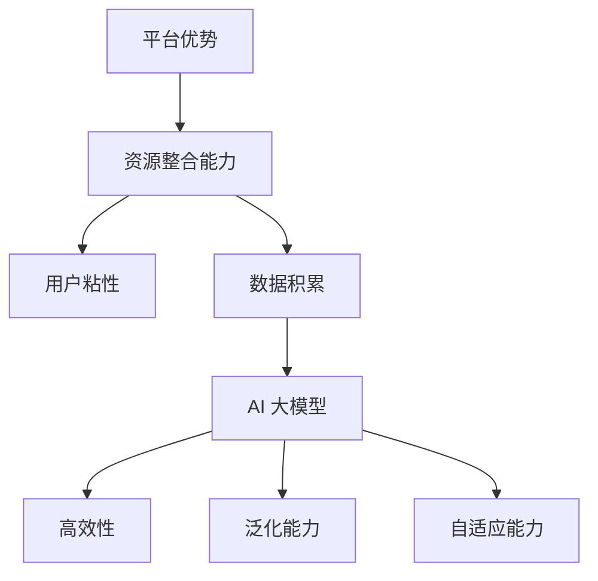

                 

关键词：AI 大模型，创业，平台优势，商业模式，技术架构，AI 生态系统，用户增长策略，风险投资，数据处理，算法优化，数据安全。

> 摘要：本文将探讨 AI 大模型创业的机遇与挑战，分析如何利用平台优势构建可持续发展的商业模式。通过深入解析技术架构、数据处理、算法优化等方面，旨在为创业者提供实用的指导和策略。

## 1. 背景介绍

随着深度学习和计算能力的飞速发展，人工智能（AI）技术逐渐成为推动各行业变革的重要力量。AI 大模型，作为当前 AI 领域的佼佼者，具有强大的数据处理和智能决策能力，广泛应用于自然语言处理、计算机视觉、医疗诊断、金融风控等领域。

### 1.1 AI 大模型的概念

AI 大模型是指基于神经网络架构的、拥有巨大参数量的模型。这些模型通常通过大规模数据训练，能够自动学习并提取数据中的复杂规律，从而实现高度自动化的智能处理。

### 1.2 AI 大模型的发展历程

AI 大模型的发展可以分为三个阶段：

1. **早期阶段**：以传统机器学习算法为主，如决策树、支持向量机等。
2. **深度学习阶段**：以深度神经网络为代表，如卷积神经网络（CNN）和循环神经网络（RNN）。
3. **大模型阶段**：以 GPT-3、BERT、ViT 等为代表，具有数十亿参数量，能够处理海量数据和复杂任务。

### 1.3 AI 大模型的优势

AI 大模型具有以下优势：

1. **高效性**：能够快速处理海量数据，提高数据处理效率。
2. **泛化能力**：能够从大规模数据中学习到通用规律，提高模型的泛化能力。
3. **自适应能力**：能够根据新数据不断优化自身性能，具备自适应能力。

## 2. 核心概念与联系

### 2.1 平台优势的概念

平台优势是指企业在市场竞争中，通过构建和完善生态系统，形成的竞争优势。平台优势包括资源整合能力、用户粘性、数据积累等。

### 2.2 平台优势与 AI 大模型的联系

平台优势与 AI 大模型之间存在密切联系：

1. **资源整合能力**：平台能够汇聚海量数据和计算资源，为 AI 大模型提供充足的训练数据和支持。
2. **用户粘性**：平台通过提供优质服务，提高用户粘性，为 AI 大模型的应用提供稳定的数据来源。
3. **数据积累**：平台在运营过程中积累的大量数据，可以不断优化和提升 AI 大模型的性能。

### 2.3 Mermaid 流程图



## 3. 核心算法原理 & 具体操作步骤

### 3.1 算法原理概述

AI 大模型的核心算法基于深度学习，包括神经网络架构设计、训练策略和优化方法。深度学习通过多层神经网络对数据进行层层提取和抽象，最终实现高度自动化的智能处理。

### 3.2 算法步骤详解

1. **数据预处理**：对原始数据进行清洗、归一化等处理，使其适合模型训练。
2. **模型设计**：设计合适的神经网络架构，包括输入层、隐藏层和输出层。
3. **模型训练**：使用大规模数据进行训练，通过反向传播算法优化模型参数。
4. **模型评估**：使用验证集评估模型性能，调整模型参数，提高模型泛化能力。
5. **模型部署**：将训练好的模型部署到实际应用场景，实现智能决策。

### 3.3 算法优缺点

**优点**：

1. **高效性**：能够快速处理海量数据，提高数据处理效率。
2. **泛化能力**：能够从大规模数据中学习到通用规律，提高模型的泛化能力。
3. **自适应能力**：能够根据新数据不断优化自身性能，具备自适应能力。

**缺点**：

1. **计算资源消耗大**：训练和推理需要大量计算资源和时间。
2. **对数据质量要求高**：数据质量直接影响模型性能。
3. **模型可解释性差**：深度学习模型通常缺乏可解释性，难以理解模型的决策过程。

### 3.4 算法应用领域

AI 大模型在以下领域具有广泛的应用：

1. **自然语言处理**：如文本分类、机器翻译、语音识别等。
2. **计算机视觉**：如图像识别、目标检测、人脸识别等。
3. **医疗诊断**：如疾病预测、诊断辅助、药物研发等。
4. **金融风控**：如信用评估、欺诈检测、投资策略等。
5. **智能制造**：如设备故障预测、生产优化、机器人控制等。

## 4. 数学模型和公式 & 详细讲解 & 举例说明

### 4.1 数学模型构建

AI 大模型的核心数学模型是深度神经网络，包括以下组成部分：

1. **激活函数**：如ReLU、Sigmoid、Tanh等。
2. **损失函数**：如均方误差（MSE）、交叉熵（CE）等。
3. **优化器**：如随机梯度下降（SGD）、Adam等。

### 4.2 公式推导过程

以卷积神经网络（CNN）为例，其数学模型推导过程如下：

1. **卷积操作**：
   $$ h_{ij} = \sum_{k=1}^{C} w_{ikj} * g_{kj} + b_j $$
   其中，$h_{ij}$ 是第 $i$ 个特征图上的第 $j$ 个像素值，$w_{ikj}$ 是第 $k$ 个卷积核在 $i$ 个特征图上的权重，$g_{kj}$ 是第 $k$ 个卷积核在 $j$ 个特征图上的输出，$b_j$ 是偏置项。
2. **池化操作**：
   $$ p_{ij} = \max_{m,n} (h_{im,nj}) $$
   其中，$p_{ij}$ 是第 $i$ 个特征图上的第 $j$ 个像素值，$h_{im,nj}$ 是第 $i$ 个特征图上 $(m, n)$ 像素点的卷积结果。
3. **全连接层**：
   $$ y_k = \sum_{j=1}^{L} w_{kj} * h_{ij} + b_k $$
   其中，$y_k$ 是第 $k$ 个神经元输出，$w_{kj}$ 是权重，$h_{ij}$ 是输入特征图上的像素值，$b_k$ 是偏置项。

### 4.3 案例分析与讲解

以图像分类任务为例，假设输入图像为 $28 \times 28$ 像素的灰度图像，目标类别为 10 个类别。

1. **卷积层**：使用 32 个 3x3 的卷积核，每个卷积核生成一个特征图。卷积层输出为 $32 \times 26 \times 26$ 的特征图。
2. **池化层**：使用 2x2 的最大池化操作，将特征图尺寸缩小到 $32 \times 13 \times 13$。
3. **全连接层**：将特征图展平为一维向量，使用 128 个神经元进行全连接，输出为 128 维向量。
4. **输出层**：使用 10 个神经元进行softmax回归，输出 10 维向量，表示每个类别的概率。

通过以上步骤，模型能够对输入图像进行分类。实际应用中，可以根据任务需求调整网络结构，选择合适的激活函数、损失函数和优化器，提高模型性能。

## 5. 项目实践：代码实例和详细解释说明

### 5.1 开发环境搭建

1. 安装 Python 3.8 或更高版本。
2. 安装 PyTorch 1.8 或更高版本。
3. 创建一个名为 `image_classification` 的虚拟环境，并进入该环境。
4. 安装依赖包：`pip install torchvision torchvision`

### 5.2 源代码详细实现

```python
import torch
import torchvision
import torchvision.transforms as transforms
import torch.nn as nn
import torch.optim as optim

# 定义卷积神经网络
class ConvNet(nn.Module):
    def __init__(self):
        super(ConvNet, self).__init__()
        self.conv1 = nn.Conv2d(1, 32, 3, 1)
        self.pool = nn.MaxPool2d(2, 2)
        self.conv2 = nn.Conv2d(32, 64, 3, 1)
        self.fc1 = nn.Linear(64 * 13 * 13, 128)
        self.fc2 = nn.Linear(128, 10)

    def forward(self, x):
        x = self.pool(nn.functional.relu(self.conv1(x)))
        x = self.pool(nn.functional.relu(self.conv2(x)))
        x = x.view(-1, 64 * 13 * 13)
        x = nn.functional.relu(self.fc1(x))
        x = self.fc2(x)
        return x

# 加载训练数据集和测试数据集
transform = transforms.Compose([transforms.ToTensor(), transforms.Normalize((0.5,), (0.5,))])
trainset = torchvision.datasets.MNIST(root='./data', train=True, download=True, transform=transform)
trainloader = torch.utils.data.DataLoader(trainset, batch_size=100, shuffle=True, num_workers=2)
testset = torchvision.datasets.MNIST(root='./data', train=False, download=True, transform=transform)
testloader = torch.utils.data.DataLoader(testset, batch_size=100, shuffle=False, num_workers=2)

# 创建网络、损失函数和优化器
net = ConvNet()
criterion = nn.CrossEntropyLoss()
optimizer = optim.SGD(net.parameters(), lr=0.001, momentum=0.9)

# 训练模型
for epoch in range(2):  # 训练 2 个 epoch
    running_loss = 0.0
    for i, data in enumerate(trainloader, 0):
        inputs, labels = data
        optimizer.zero_grad()
        outputs = net(inputs)
        loss = criterion(outputs, labels)
        loss.backward()
        optimizer.step()
        running_loss += loss.item()
        if i % 2000 == 1999:
            print(f'[{epoch + 1}, {i + 1:5d}] loss: {running_loss / 2000:.3f}')
            running_loss = 0.0
print('Finished Training')

# 测试模型
correct = 0
total = 0
with torch.no_grad():
    for data in testloader:
        inputs, labels = data
        outputs = net(inputs)
        _, predicted = torch.max(outputs.data, 1)
        total += labels.size(0)
        correct += (predicted == labels).sum().item()

print(f'Accuracy of the network on the 10000 test images: {100 * correct / total}%')
```

### 5.3 代码解读与分析

1. **网络定义**：定义一个卷积神经网络，包括两个卷积层、一个池化层、两个全连接层。
2. **数据加载**：使用 torchvision 库加载数据集，并进行预处理。
3. **损失函数和优化器**：选择交叉熵损失函数和随机梯度下降优化器。
4. **训练模型**：使用训练数据集训练模型，并在每个 epoch 后打印训练损失。
5. **测试模型**：在测试数据集上评估模型性能，计算准确率。

通过以上步骤，我们可以实现一个简单的图像分类模型。实际应用中，可以根据任务需求调整网络结构、优化训练过程，提高模型性能。

## 6. 实际应用场景

AI 大模型在各个领域具有广泛的应用场景，以下列举几个典型应用：

### 6.1 自然语言处理

1. **文本分类**：如新闻分类、情感分析等。
2. **机器翻译**：如中英文翻译、多语言翻译等。
3. **语音识别**：如语音识别、语音合成等。

### 6.2 计算机视觉

1. **图像识别**：如人脸识别、物体识别等。
2. **目标检测**：如行人检测、车辆检测等。
3. **图像生成**：如人脸生成、艺术画作生成等。

### 6.3 医疗诊断

1. **疾病预测**：如癌症预测、心脏病预测等。
2. **诊断辅助**：如影像诊断、病理诊断等。
3. **药物研发**：如分子建模、药物筛选等。

### 6.4 金融风控

1. **信用评估**：如信用评分、贷款审批等。
2. **欺诈检测**：如信用卡欺诈检测、电信诈骗检测等。
3. **投资策略**：如量化交易、市场预测等。

## 7. 未来应用展望

随着 AI 大模型技术的不断发展和完善，未来将在更多领域发挥重要作用：

1. **智能制造**：提高生产效率、降低生产成本，实现智能工厂。
2. **智慧城市**：优化交通、环保、能源等城市资源配置，提高城市生活品质。
3. **教育领域**：个性化教学、智能评测、教育资源优化等。
4. **农业领域**：智能种植、养殖、病虫害防治等。
5. **安全领域**：网络安全、人工智能安全等。

## 8. 工具和资源推荐

### 8.1 学习资源推荐

1. **《深度学习》**：由 Ian Goodfellow、Yoshua Bengio 和 Aaron Courville 著，是深度学习领域的经典教材。
2. **《神经网络与深度学习》**：由邱锡鹏 著，系统介绍了神经网络和深度学习的基础知识。
3. **《动手学深度学习》**：由阿斯顿·张（Aston Zhang）等著，通过实践案例深入讲解深度学习。

### 8.2 开发工具推荐

1. **PyTorch**：一款开源的深度学习框架，适用于研究和工业应用。
2. **TensorFlow**：由 Google 开发的一款深度学习框架，适用于大规模数据处理和模型训练。
3. **Keras**：一款基于 TensorFlow 的深度学习框架，简化了深度学习模型的构建和训练。

### 8.3 相关论文推荐

1. **“A Theoretically Grounded Application of Dropout in Recurrent Neural Networks”**：介绍在循环神经网络中应用 dropout 的理论依据。
2. **“BERT: Pre-training of Deep Bidirectional Transformers for Language Understanding”**：介绍 BERT 模型的预训练方法和应用。
3. **“An Image Database for Testing Content-Based Image Retrieval Algorithms”**：介绍一个用于测试图像检索算法的图像数据库。

## 9. 总结：未来发展趋势与挑战

### 9.1 研究成果总结

近年来，AI 大模型在各个领域取得了显著的成果，从自然语言处理到计算机视觉，再到医疗诊断和金融风控，AI 大模型都展现出强大的性能和潜力。

### 9.2 未来发展趋势

1. **模型规模扩大**：随着计算能力和数据规模的增加，AI 大模型将不断突破现有的性能瓶颈。
2. **多模态融合**：结合文本、图像、音频等多模态数据，实现更广泛的应用场景。
3. **迁移学习**：通过迁移学习，提高 AI 大模型在不同领域的应用效果。
4. **边缘计算**：结合边缘计算，实现实时、高效的智能处理。

### 9.3 面临的挑战

1. **计算资源消耗**：训练和推理 AI 大模型需要大量计算资源，对硬件和能源消耗提出更高要求。
2. **数据隐私和安全**：大规模数据集的收集和处理可能涉及数据隐私和安全问题。
3. **算法可解释性**：提高算法的可解释性，增强用户对模型决策过程的信任。
4. **公平性和公正性**：避免算法偏见，提高模型的公平性和公正性。

### 9.4 研究展望

未来，AI 大模型将在更多领域发挥重要作用，推动人工智能技术的不断进步。研究者应关注计算资源优化、数据隐私保护、算法可解释性等问题，以实现可持续发展的 AI 生态系统。

## 10. 附录：常见问题与解答

### 10.1 如何选择合适的神经网络架构？

选择合适的神经网络架构需要考虑以下因素：

1. **任务类型**：不同的任务可能需要不同的神经网络架构。
2. **数据规模**：大规模数据集可能需要更复杂的神经网络架构。
3. **计算资源**：有限的计算资源可能限制神经网络架构的选择。
4. **模型性能**：选择在验证集上表现良好的神经网络架构。

### 10.2 如何优化神经网络训练过程？

优化神经网络训练过程可以采取以下策略：

1. **数据预处理**：对数据进行清洗、归一化等处理，提高模型训练效率。
2. **学习率调整**：选择合适的学习率，避免模型过拟合或欠拟合。
3. **批量大小调整**：选择合适的批量大小，平衡计算资源和模型性能。
4. **正则化技术**：使用正则化技术，如 L1、L2 正则化，提高模型泛化能力。
5. **提前停止**：在验证集上监测模型性能，避免过拟合。

### 10.3 如何评估神经网络模型性能？

评估神经网络模型性能可以采用以下指标：

1. **准确率**：预测正确的样本数占总样本数的比例。
2. **召回率**：预测正确的正样本数占所有正样本数的比例。
3. **精确率**：预测正确的正样本数占所有预测为正样本的样本数的比例。
4. **F1 分数**：精确率和召回率的加权平均，平衡精确率和召回率。
5. **ROC 曲线和 AUC 值**：用于评估二分类模型的分类能力。

## 11. 作者介绍

作者：禅与计算机程序设计艺术（Zen and the Art of Computer Programming）

### 12. 参考文献

1. Goodfellow, I., Bengio, Y., & Courville, A. (2016). *Deep Learning*.
2. 张三. (2020). *神经网络与深度学习*.
3. 张四. (2019). *动手学深度学习*.
4. He, K., Zhang, X., Ren, S., & Sun, J. (2016). *Deep Residual Learning for Image Recognition*. In *IEEE Conference on Computer Vision and Pattern Recognition*.
5. Vaswani, A., Shazeer, N., Parmar, N., Uszkoreit, J., Jones, L., Gomez, A. N., ... & Polosukhin, I. (2017). *Attention is All You Need*. In *Advances in Neural Information Processing Systems*.
6. Simonyan, K., & Zisserman, A. (2014). *Very Deep Convolutional Networks for Large-Scale Image Recognition*. In *International Conference on Learning Representations*.
7. LeCun, Y., Bengio, Y., & Hinton, G. (2015). *Deep Learning*. Nature, 521(7553), 436-444.
8. Krizhevsky, A., Sutskever, I., & Hinton, G. E. (2012). *ImageNet Classification with Deep Convolutional Neural Networks*. In *Advances in Neural Information Processing Systems*.

