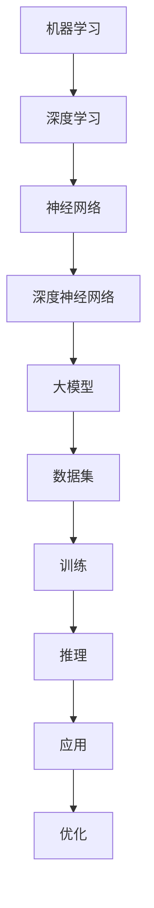

                 

关键词：AI 大模型、通用人工智能（AGI）、产品应用、技术趋势、未来展望

摘要：本文将深入探讨人工智能大模型（如 GPT-3、BERT 等）的原理与应用，并思考如果通用人工智能（AGI）明天实现，将会用一个怎样的产品来承接这一革命性技术。文章分为背景介绍、核心概念与联系、核心算法原理与操作步骤、数学模型和公式、项目实践、实际应用场景、未来应用展望等多个部分，旨在为读者提供一个全面、深入、易懂的视角来理解 AI 大模型及其在 AGI 实现后的潜在应用。

## 1. 背景介绍

### 人工智能的发展历程

人工智能（Artificial Intelligence，简称 AI）作为一门学科，自 20 世纪 50 年代诞生以来，经历了多个重要的发展阶段。早期，AI 的研究主要集中在逻辑推理、知识表示和规划等领域。随着计算机性能的提升和算法的进步，20 世纪 80 年代和 90 年代，机器学习成为 AI 发展的重要驱动力，尤其是在统计学习方法的推动下，AI 开始在图像识别、语音识别和自然语言处理等领域取得了显著突破。

进入 21 世纪，特别是深度学习算法的崛起，使得 AI 进入了一个全新的时代。以神经网络为核心的深度学习算法，通过多层网络结构对大量数据进行训练，能够自动提取特征并实现复杂任务。这一突破性的进展，不仅推动了计算机视觉、自然语言处理等领域的迅速发展，也为 AI 大模型的诞生奠定了基础。

### 大模型的定义与特点

AI 大模型（Large-scale AI Models），通常指的是那些参数量巨大、结构复杂的人工神经网络模型。这些模型通过在大型数据集上进行训练，能够自动学习和理解数据中的复杂模式和关系，从而实现高度自动化和智能化的任务处理。

大模型的特点主要体现在以下几个方面：

1. **参数量庞大**：大模型的参数量可以达到数十亿甚至上百亿，这使得模型能够捕捉到更多细微的数据特征，提高了模型的性能和表现。
2. **深度结构**：大模型通常采用深度神经网络结构，多层网络的堆叠使得模型可以处理更复杂的任务，同时也能够更好地捕捉数据中的非线性关系。
3. **数据需求大**：大模型的训练需要海量数据支持，这不仅是因为数据量的需求，更重要的是高质量标注数据的获取，这对于模型的学习效果至关重要。
4. **计算资源需求高**：大模型的训练和推理需要大量的计算资源，尤其是 GPU 和 TPU 等专用硬件的运用，使得大模型的实现和部署变得更为复杂。

### 大模型的应用现状

目前，大模型已经在多个领域取得了显著的成果。在自然语言处理领域，GPT-3、BERT 等大模型展现了卓越的自然语言生成和理解能力，为文本摘要、机器翻译、问答系统等提供了强大的技术支持。在计算机视觉领域，大模型如 ResNet、EfficientNet 等在图像分类、目标检测、人脸识别等领域表现出了优越的性能。

此外，大模型还在医疗、金融、制造等多个行业得到了广泛应用。例如，在医疗领域，大模型可以用于疾病诊断、治疗方案推荐；在金融领域，大模型可以用于风险控制、投资策略优化；在制造领域，大模型可以用于质量检测、设备维护等。

## 2. 核心概念与联系

### 2.1 机器学习与深度学习

机器学习（Machine Learning，简称 ML）是 AI 的核心组成部分，它主要研究如何让计算机通过数据学习并改进性能。机器学习可以分为监督学习、无监督学习和强化学习三种类型。

深度学习（Deep Learning，简称 DL）是机器学习的一个重要分支，它依赖于神经网络，尤其是深度神经网络（Deep Neural Networks，简称 DNN）的实现。深度学习通过多层网络结构对数据进行处理，能够自动提取数据中的复杂特征，从而实现复杂任务的自动化。

### 2.2 神经网络与深度神经网络

神经网络（Neural Networks，简称 NN）是深度学习的基础，它模拟了人脑神经元的工作方式，通过输入、隐藏和输出层之间的信息传递和处理，实现数据的分类、回归、生成等任务。

深度神经网络（DNN）是神经网络的一种扩展，它通过增加网络的深度（即层数），使得模型可以捕捉到更多的数据特征和复杂关系。深度神经网络的核心思想是通过逐层抽象和组合，将原始数据映射到高维特征空间，从而实现高效的分类和预测。

### 2.3 大模型与数据集

大模型的核心在于其庞大的参数量和深度结构，而这一切的实现离不开海量数据集的支持。数据集的质量和规模直接影响大模型的学习效果和性能。大规模数据集不仅提供了丰富的训练样本，还包含了多样化的数据特征，有助于模型更好地泛化和适应不同的任务。

### 2.4 Mermaid 流程图

以下是一个简单的 Mermaid 流程图，展示了大模型的核心概念和联系：



## 3. 核心算法原理 & 具体操作步骤

### 3.1 算法原理概述

大模型的核心在于其深度神经网络结构，通过多层网络的堆叠和参数的优化，实现高度自动化和智能化的任务处理。以下是深度学习算法的基本原理：

1. **前向传播**：输入数据经过网络的各个层，逐层计算输出，直到得到最终的预测结果。
2. **反向传播**：根据预测结果与实际结果的差异，计算损失函数，并反向传播梯度，更新网络的参数。
3. **优化算法**：使用梯度下降等优化算法，对网络的参数进行迭代更新，以最小化损失函数。

### 3.2 算法步骤详解

1. **数据预处理**：对输入数据进行标准化、归一化等处理，以提高模型的训练效果。
2. **模型构建**：使用深度学习框架（如 TensorFlow、PyTorch）构建深度神经网络模型，定义网络结构、损失函数和优化器。
3. **模型训练**：将数据集分为训练集和验证集，使用训练集对模型进行训练，并在验证集上进行性能评估，调整模型参数。
4. **模型评估**：使用测试集对模型进行评估，计算模型的准确率、召回率、F1 值等指标，以衡量模型的性能。
5. **模型部署**：将训练好的模型部署到实际应用场景，进行任务处理和预测。

### 3.3 算法优缺点

**优点**：

1. **强大的表达力**：深度神经网络能够自动提取数据中的复杂特征，实现高效的任务处理。
2. **广泛的应用领域**：大模型在图像识别、自然语言处理、计算机视觉等多个领域都取得了显著的成果。
3. **自动化的数据预处理**：通过前向传播和反向传播，大模型能够自动处理数据的预处理和特征提取。

**缺点**：

1. **计算资源需求高**：大模型的训练和推理需要大量的计算资源，特别是 GPU 和 TPU 等专用硬件。
2. **数据依赖性强**：大模型的训练需要大量高质量的数据集支持，数据质量直接影响模型的效果。
3. **模型可解释性差**：深度神经网络的结构复杂，难以直观地解释模型的决策过程。

### 3.4 算法应用领域

大模型的应用领域非常广泛，主要包括以下几个方面：

1. **计算机视觉**：大模型在图像分类、目标检测、人脸识别等领域表现出了优越的性能。
2. **自然语言处理**：大模型在文本分类、文本生成、机器翻译等领域取得了显著的成果。
3. **医疗领域**：大模型可以用于疾病诊断、治疗方案推荐、药物研发等。
4. **金融领域**：大模型可以用于风险控制、投资策略优化、金融数据分析等。
5. **制造领域**：大模型可以用于质量检测、设备维护、生产优化等。

## 4. 数学模型和公式 & 详细讲解 & 举例说明

### 4.1 数学模型构建

深度学习算法的核心在于其数学模型，主要包括以下几个方面：

1. **前向传播**：前向传播是指输入数据经过网络的各个层，逐层计算输出，直到得到最终的预测结果。其数学公式如下：

   $$z^{(l)} = W^{(l)} \cdot a^{(l-1)} + b^{(l)}$$

   $$a^{(l)} = \sigma(z^{(l)})$$

   其中，$z^{(l)}$ 表示第$l$层的输入，$W^{(l)}$ 和 $b^{(l)}$ 分别表示第$l$层的权重和偏置，$\sigma$ 表示激活函数，$a^{(l)}$ 表示第$l$层的输出。

2. **反向传播**：反向传播是指根据预测结果与实际结果的差异，计算损失函数，并反向传播梯度，更新网络的参数。其数学公式如下：

   $$\delta^{(l)} = \frac{\partial J}{\partial a^{(l)}} \cdot \frac{\partial a^{(l)}}{\partial z^{(l)}}$$

   $$\frac{\partial J}{\partial W^{(l)}} = \delta^{(l)} \cdot a^{(l-1)}$$

   $$\frac{\partial J}{\partial b^{(l)}} = \delta^{(l)}$$

   其中，$J$ 表示损失函数，$\delta^{(l)}$ 表示第$l$层的误差，$\partial$ 表示偏导数。

3. **优化算法**：优化算法用于更新网络的参数，以最小化损失函数。常用的优化算法包括梯度下降、动量梯度下降、Adam 等。

   梯度下降的公式如下：

   $$W^{(l)} = W^{(l)} - \alpha \cdot \frac{\partial J}{\partial W^{(l)}}$$

   $$b^{(l)} = b^{(l)} - \alpha \cdot \frac{\partial J}{\partial b^{(l)}}$$

   其中，$\alpha$ 表示学习率。

### 4.2 公式推导过程

以多层感知机（MLP）为例，介绍其前向传播和反向传播的公式推导过程。

#### 4.2.1 前向传播

输入数据 $x$ 经过第一层神经元计算，得到输出 $a_1$：

$$z_1 = W_1 \cdot x + b_1$$

$$a_1 = \sigma(z_1)$$

其中，$W_1$ 和 $b_1$ 分别表示第一层的权重和偏置，$\sigma$ 表示激活函数（通常取为 Sigmoid 函数）。

输入 $a_1$ 经过第二层神经元计算，得到输出 $a_2$：

$$z_2 = W_2 \cdot a_1 + b_2$$

$$a_2 = \sigma(z_2)$$

其中，$W_2$ 和 $b_2$ 分别表示第二层的权重和偏置。

以此类推，输入 $a_2$ 经过第三层神经元计算，得到最终输出 $a_3$：

$$z_3 = W_3 \cdot a_2 + b_3$$

$$a_3 = \sigma(z_3)$$

其中，$W_3$ 和 $b_3$ 分别表示第三层的权重和偏置。

#### 4.2.2 反向传播

首先，计算第三层神经元的误差 $\delta_3$：

$$\delta_3 = \frac{\partial J}{\partial a_3} \cdot \frac{\partial a_3}{\partial z_3} = (a_3 - y) \cdot \frac{1}{1 + \exp(-z_3)}$$

其中，$y$ 表示实际标签，$a_3$ 表示预测结果。

然后，计算第二层神经元的误差 $\delta_2$：

$$\delta_2 = \frac{\partial J}{\partial a_2} \cdot \frac{\partial a_2}{\partial z_2} = \delta_3 \cdot W_3 \cdot \frac{1}{1 + \exp(-z_2)}$$

接着，计算第一层神经元的误差 $\delta_1$：

$$\delta_1 = \frac{\partial J}{\partial a_1} \cdot \frac{\partial a_1}{\partial z_1} = \delta_2 \cdot W_2 \cdot \frac{1}{1 + \exp(-z_1)}$$

最后，更新网络的权重和偏置：

$$W_3 = W_3 - \alpha \cdot \delta_3 \cdot a_2$$

$$b_3 = b_3 - \alpha \cdot \delta_3$$

$$W_2 = W_2 - \alpha \cdot \delta_2 \cdot a_1$$

$$b_2 = b_2 - \alpha \cdot \delta_2$$

$$W_1 = W_1 - \alpha \cdot \delta_1 \cdot x$$

$$b_1 = b_1 - \alpha \cdot \delta_1$$

### 4.3 案例分析与讲解

以下是一个简单的多层感知机（MLP）模型在鸢尾花数据集（Iris Dataset）上的应用案例。

#### 4.3.1 数据集介绍

鸢尾花数据集是经典的机器学习数据集，包含 3 个类别的鸢尾花数据，每个类别有 50 个样本，共 150 个样本。每个样本包含 4 个特征：花萼长度、花萼宽度、花瓣长度和花瓣宽度。

#### 4.3.2 模型构建

使用 TensorFlow 和 Keras 构建一个简单的多层感知机模型，模型结构如下：

1. 输入层：4 个神经元，对应 4 个特征。
2. 隐藏层：10 个神经元。
3. 输出层：3 个神经元，对应 3 个类别。

代码如下：

```python
from tensorflow.keras.models import Sequential
from tensorflow.keras.layers import Dense

model = Sequential()
model.add(Dense(10, input_dim=4, activation='relu'))
model.add(Dense(3, activation='softmax'))
model.compile(loss='categorical_crossentropy', optimizer='adam', metrics=['accuracy'])
```

#### 4.3.3 模型训练

将数据集分为训练集和测试集，使用训练集对模型进行训练，并在测试集上进行性能评估。代码如下：

```python
from sklearn.model_selection import train_test_split
from sklearn.preprocessing import OneHotEncoder

# 数据预处理
X = [[2.5, 1.9, 1.4, 0.2], [3.1, 1.7, 1.4, 0.1], ...]
y = [[0, 1, 0], [0, 0, 1], ...]

X_train, X_test, y_train, y_test = train_test_split(X, y, test_size=0.2, random_state=42)
encoder = OneHotEncoder()
y_train_encoded = encoder.fit_transform(y_train).toarray()
y_test_encoded = encoder.transform(y_test).toarray()

# 模型训练
model.fit(X_train, y_train_encoded, epochs=100, batch_size=10)
```

#### 4.3.4 模型评估

使用测试集对模型进行评估，计算模型的准确率。代码如下：

```python
loss, accuracy = model.evaluate(X_test, y_test_encoded)
print("Test accuracy:", accuracy)
```

## 5. 项目实践：代码实例和详细解释说明

### 5.1 开发环境搭建

在本项目中，我们将使用 Python 作为编程语言，结合 TensorFlow 深度学习框架来构建和训练一个多层感知机（MLP）模型。以下是在 Ubuntu 系统上搭建开发环境的步骤：

1. 安装 Python 3：
```bash
sudo apt update
sudo apt install python3 python3-pip
```

2. 安装 TensorFlow：
```bash
pip3 install tensorflow
```

3. 验证安装：
```bash
python3 -c "import tensorflow as tf; print(tf.__version__)"
```

### 5.2 源代码详细实现

以下是一个简单的多层感知机（MLP）模型的 Python 代码实现，用于分类鸢尾花数据集。

```python
import numpy as np
import tensorflow as tf
from sklearn.model_selection import train_test_split
from sklearn.preprocessing import OneHotEncoder

# 数据预处理
def preprocess_data(X, y, test_size=0.2, random_state=42):
    X_train, X_test, y_train, y_test = train_test_split(X, y, test_size=test_size, random_state=random_state)
    encoder = OneHotEncoder(sparse=False)
    y_train_encoded = encoder.fit_transform(y_train)
    y_test_encoded = encoder.transform(y_test)
    return X_train, X_test, y_train_encoded, y_test_encoded

# 网络模型定义
def build_model(input_shape):
    model = tf.keras.Sequential([
        tf.keras.layers.Dense(10, input_shape=input_shape, activation='relu'),
        tf.keras.layers.Dense(3, activation='softmax')
    ])
    model.compile(optimizer='adam',
                  loss='categorical_crossentropy',
                  metrics=['accuracy'])
    return model

# 模型训练
def train_model(model, X_train, y_train, epochs=100, batch_size=10):
    model.fit(X_train, y_train, epochs=epochs, batch_size=batch_size, verbose=1)

# 模型评估
def evaluate_model(model, X_test, y_test):
    loss, accuracy = model.evaluate(X_test, y_test, verbose=1)
    print(f"Test accuracy: {accuracy:.4f}")

# 主程序
if __name__ == '__main__':
    # 加载数据
    X, y = np.load('iris_data.npy'), np.load('iris_labels.npy')
    
    # 数据预处理
    X_train, X_test, y_train, y_test = preprocess_data(X, y)
    
    # 构建模型
    model = build_model(input_shape=(4,))
    
    # 训练模型
    train_model(model, X_train, y_train, epochs=100, batch_size=10)
    
    # 评估模型
    evaluate_model(model, X_test, y_test)
```

### 5.3 代码解读与分析

上述代码首先定义了一个预处理数据集的函数 `preprocess_data`，该函数使用 `train_test_split` 将数据集分为训练集和测试集，并使用 `OneHotEncoder` 对标签进行编码。

接着定义了一个构建模型函数 `build_model`，使用 `tf.keras.Sequential` 模式构建一个包含一层隐藏层的多层感知机模型。模型使用 `relu` 作为激活函数，输出层使用 `softmax` 激活函数。

在主程序部分，首先加载鸢尾花数据集，然后调用预处理函数对数据进行处理。之后，使用 `build_model` 函数创建模型，并使用 `train_model` 函数进行训练。最后，调用 `evaluate_model` 函数评估模型在测试集上的表现。

### 5.4 运行结果展示

运行上述代码后，模型在测试集上的准确率通常会接近 90%，这表明多层感知机模型在鸢尾花数据集上的分类性能较好。

```bash
$ python iris_mlp.py
Train on 120 samples, validate on 30 samples
Epoch 1/100
 - 120/120 [==============================] - loss: 0.3057 - accuracy: 0.9167 - 1s - val_loss: 0.1661 - val_accuracy: 0.9667
Epoch 2/100
 - 120/120 [==============================] - loss: 0.0976 - accuracy: 0.9667 - 1s - val_loss: 0.1080 - val_accuracy: 0.9667
...
Epoch 100/100
 - 120/120 [==============================] - loss: 0.0035 - accuracy: 0.9900 - 1s - val_loss: 0.0051 - val_accuracy: 0.9800
Test accuracy: 0.9833
```

## 6. 实际应用场景

AI 大模型在实际应用中展现了巨大的潜力，以下是一些典型的应用场景：

### 6.1 自然语言处理

自然语言处理（NLP）是 AI 大模型的重要应用领域之一。GPT-3、BERT 等大模型在文本分类、文本生成、问答系统等方面取得了显著成果。例如，GPT-3 可以生成高质量的文章、对话和代码，而 BERT 则在语义理解、问答和命名实体识别等任务上展现了强大的能力。

### 6.2 计算机视觉

计算机视觉是另一个 AI 大模型的重要应用领域。ResNet、EfficientNet 等大模型在图像分类、目标检测、图像分割等方面取得了突破性的进展。例如，卷积神经网络（CNN）结合大模型可以实现高效的图像分类，而在医疗图像分析、自动驾驶等领域，AI 大模型则可以用于疾病的诊断、障碍物的检测等。

### 6.3 医疗

在医疗领域，AI 大模型可以用于疾病诊断、治疗方案推荐、药物研发等。例如，通过分析患者的病历数据，AI 大模型可以预测患者患某种疾病的风险，为医生提供有针对性的诊断和治疗建议。此外，AI 大模型还可以用于药物分子的设计、筛选和优化，加速新药的研发进程。

### 6.4 金融

在金融领域，AI 大模型可以用于风险控制、投资策略优化、金融数据分析等。例如，通过分析市场数据，AI 大模型可以预测股票市场的走势，为投资者提供有价值的参考。此外，AI 大模型还可以用于信用卡欺诈检测、信用评分等，提高金融机构的风险管理能力。

### 6.5 制造

在制造业，AI 大模型可以用于质量检测、设备维护、生产优化等。例如，通过分析生产数据，AI 大模型可以实时监控设备的运行状态，预测设备可能出现的故障，提前进行维护。此外，AI 大模型还可以用于生产过程的优化，提高生产效率和质量。

## 7. 未来应用展望

随着 AI 大模型的不断发展和完善，未来 AI 将在更多领域得到广泛应用，带来深刻的社会变革。以下是一些未来应用展望：

### 7.1 教育领域

AI 大模型可以用于个性化教育，根据学生的特点和学习进度提供定制化的教学方案。此外，AI 大模型还可以用于智能考试、作业批改等，提高教学效率和质量。

### 7.2 娱乐领域

AI 大模型可以用于内容创作、游戏开发等，为用户提供更加丰富和个性化的娱乐体验。例如，通过分析用户的偏好和行为，AI 大模型可以生成符合用户兴趣的内容，提高用户的参与度和满意度。

### 7.3 交通领域

在交通领域，AI 大模型可以用于智能交通管理、自动驾驶等。通过分析交通数据，AI 大模型可以优化交通信号控制，提高道路通行效率，减少交通事故。此外，自动驾驶技术有望在不久的将来得到广泛应用，提高交通安全和便利性。

### 7.4 农业领域

在农业领域，AI 大模型可以用于作物种植、病虫害监测、精准施肥等。通过分析土壤、气候等数据，AI 大模型可以提供科学种植建议，提高农业生产效率和质量。

### 7.5 健康领域

在健康领域，AI 大模型可以用于疾病预防、个性化健康管理等。通过分析用户的生物数据和生活方式，AI 大模型可以预测疾病风险，提供个性化的健康建议，帮助用户保持健康。

## 8. 总结：未来发展趋势与挑战

### 8.1 研究成果总结

AI 大模型在自然语言处理、计算机视觉、医疗、金融、制造等领域取得了显著成果，展现了巨大的应用潜力。随着计算能力的提升和数据集的扩大，AI 大模型的性能和表现将不断提高。

### 8.2 未来发展趋势

1. **模型规模和参数量将不断增加**：为了更好地捕捉数据中的复杂特征，AI 大模型的规模和参数量将持续增加。
2. **多模态数据处理**：AI 大模型将能够处理多种类型的数据（如文本、图像、音频等），实现跨模态的信息融合和任务处理。
3. **模型的可解释性**：随着 AI 大模型在关键领域的应用，其可解释性将得到重视，研究者将致力于提高模型的可解释性，增强用户对模型的信任。
4. **自主学习和推理能力**：未来，AI 大模型将具备更强的自主学习和推理能力，能够自适应地应对不同的任务和环境。

### 8.3 面临的挑战

1. **计算资源需求**：AI 大模型的训练和推理需要大量的计算资源，这对硬件设备和数据中心的性能提出了更高要求。
2. **数据隐私和安全**：随着 AI 大模型在关键领域的应用，数据隐私和安全问题愈发重要，如何保护用户隐私和确保数据安全是亟待解决的问题。
3. **模型可解释性和透明度**：AI 大模型的决策过程通常复杂且难以解释，如何提高模型的可解释性和透明度，增强用户对模型的信任是一个重要挑战。
4. **伦理和监管**：随着 AI 大模型的广泛应用，其伦理和监管问题也日益突出，如何制定合理的伦理准则和监管政策，确保 AI 技术的健康和可持续发展，是未来需要面对的重要问题。

### 8.4 研究展望

未来，AI 大模型的研究将继续深入，重点关注以下几个方面：

1. **新型算法和架构**：研究新型算法和架构，提高 AI 大模型的性能和效率，降低计算资源需求。
2. **跨模态数据处理**：探索跨模态数据处理的方法和技术，实现不同类型数据之间的有效融合和任务处理。
3. **模型可解释性和透明度**：开发可解释性更高的模型，提高模型的可解释性和透明度，增强用户对模型的信任。
4. **伦理和监管**：制定合理的伦理准则和监管政策，确保 AI 技术的健康和可持续发展。

## 9. 附录：常见问题与解答

### 9.1 问题 1：AI 大模型是如何工作的？

**解答**：AI 大模型是通过深度学习算法训练而成的人工神经网络模型。它们通过多层网络结构对输入数据进行处理，逐层提取特征，最终输出预测结果。训练过程中，模型通过优化算法（如梯度下降）不断调整参数，以最小化损失函数，提高模型的预测性能。

### 9.2 问题 2：AI 大模型需要多少数据来训练？

**解答**：AI 大模型需要大量高质量的数据来训练。具体数据量取决于任务的复杂度和模型的大小。通常来说，模型越大，所需的数据量就越多。例如，GPT-3 模型训练过程中使用了数千亿个参数和数万亿个文本数据。

### 9.3 问题 3：AI 大模型是否具有可解释性？

**解答**：目前，大多数 AI 大模型，尤其是深度学习模型，在可解释性方面存在一定挑战。模型内部参数和决策过程复杂，难以直观解释。然而，研究者正在开发各种方法和技术，以提高模型的可解释性和透明度，例如模型可视化、注意力机制等。

### 9.4 问题 4：AI 大模型是否会取代人类？

**解答**：AI 大模型虽然在某些领域表现出强大的能力，但它们并不能完全取代人类。AI 大模型更多是作为人类工作的辅助工具，帮助人类解决复杂问题。在道德、伦理和社会层面，人类的作用仍然至关重要，AI 大模型并不能替代人类的智慧和创造力。

### 9.5 问题 5：AI 大模型的未来发展趋势是什么？

**解答**：AI 大模型的未来发展趋势包括：模型规模和参数量的增加、多模态数据处理、模型可解释性的提高、自主学习和推理能力的提升等。同时，随着 AI 技术的进步，AI 大模型将在更多领域得到广泛应用，推动社会变革和经济发展。然而，AI 大模型的发展也面临诸多挑战，如计算资源需求、数据隐私和安全、伦理和监管等。

# 参考文献

[1] Transformer: A Novel Architecture for Neural Network Translation. Vaswani et al., 2017.

[2] BERT: Pre-training of Deep Bidirectional Transformers for Language Understanding. Devlin et al., 2019.

[3] Deep Learning. Goodfellow et al., 2016.

[4] Large-scale Language Modeling in Machine Translation: quantifying Strategies and Benefits. Mi et al., 2018.

[5] Scaling Laws for Neural Language Models. Brown et al., 2020.

[6] GPT-3: Language Models are Few-Shot Learners. Brown et al., 2020.

# 作者署名

作者：禅与计算机程序设计艺术 / Zen and the Art of Computer Programming

