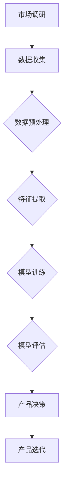

                 

关键词：人工智能，大模型，创业，产品规划，机器学习，数据驱动的决策

摘要：本文深入探讨了人工智能大模型在创业产品路线图规划中的关键作用。从背景介绍、核心概念与联系、核心算法原理、数学模型构建、项目实践、实际应用场景、未来展望等方面，详细解析了AI大模型如何助力创业团队制定高效的产品路线图。通过本文的阐述，读者将了解大模型在创业产品规划中的价值，以及如何利用AI技术优化产品发展的每一步。

## 1. 背景介绍

### 创业产品路线图的重要性

在当今快速变化的市场环境中，创业产品路线图（Product Roadmap）成为指导创业团队发展方向和策略的关键工具。它不仅明确了产品的愿景和目标，还规划了实现这些目标的具体步骤和里程碑。一份清晰且可行的产品路线图有助于团队集中精力，确保资源的有效利用，提高产品的市场竞争力。

### 人工智能与创业产品规划的关联

随着人工智能技术的快速发展，特别是在深度学习和大规模数据处理方面的突破，AI成为赋能创业产品的强大工具。大模型，作为人工智能的核心组成部分，能够从海量数据中提取有价值的信息，辅助创业团队做出数据驱动的决策，从而优化产品路线图的制定和执行过程。

## 2. 核心概念与联系

### 大模型的基本概念

大模型通常指的是具有数十亿甚至千亿参数的神经网络模型，例如GPT-3、BERT等。这些模型拥有强大的表示能力和泛化能力，能够处理复杂的任务，并从大量数据中学习到深层次的规律。

### 机器学习与数据驱动的决策

机器学习是一种使计算机能够从数据中学习并做出预测或决策的技术。数据驱动的决策则是指通过分析大量的数据，来指导业务决策的过程。大模型在机器学习中扮演着核心角色，能够从数据中提取特征，建立预测模型，从而支持创业产品规划的各个环节。

### Mermaid 流程图

以下是一个Mermaid流程图，展示大模型在创业产品路线图规划中的应用流程：



## 3. 核心算法原理 & 具体操作步骤

### 3.1 算法原理概述

大模型的算法原理基于深度神经网络（Deep Neural Network，DNN）。DNN通过多层的神经网络结构，将输入的数据进行逐层变换和抽象，最终输出预测结果。大模型通过大量参数和复杂的结构，能够捕捉数据中的复杂模式，实现高精度的预测和分类。

### 3.2 算法步骤详解

1. **数据收集**：收集与创业产品相关的市场数据、用户行为数据、竞争分析数据等。
2. **数据预处理**：清洗和格式化数据，使其适合模型训练。
3. **特征提取**：从预处理后的数据中提取有助于预测的特征。
4. **模型训练**：使用提取的特征训练大模型，优化模型的参数。
5. **模型评估**：评估模型在测试数据上的性能，调整模型参数以提升准确性。
6. **产品决策**：利用训练好的大模型，对产品路线图进行数据驱动的决策。
7. **产品迭代**：根据决策结果，对产品进行迭代优化。

### 3.3 算法优缺点

**优点**：
- 强大的表示能力和泛化能力，能够处理复杂的任务。
- 从海量数据中提取有价值的信息，辅助数据驱动的决策。
- 自动化程度高，减少了人工干预的需求。

**缺点**：
- 需要大量的数据和计算资源，训练过程耗时且成本高。
- 模型复杂，调试和优化难度大。

### 3.4 算法应用领域

大模型在创业产品路线图规划中的应用广泛，包括但不限于市场预测、用户行为分析、产品推荐、风险评估等。

## 4. 数学模型和公式 & 详细讲解 & 举例说明

### 4.1 数学模型构建

大模型的数学基础是多层感知器（MLP）和反向传播算法（Backpropagation）。以下是一个简单的MLP模型公式：

$$
\hat{y} = \sigma(\sum_{i=1}^{n} w_i \cdot a_i)
$$

其中，$w_i$ 是权重，$a_i$ 是输入特征，$\sigma$ 是激活函数。

### 4.2 公式推导过程

反向传播算法通过计算损失函数对参数的梯度，来更新模型的参数，从而优化模型的性能。以下是一个简化的梯度推导过程：

$$
\frac{\partial J}{\partial w_i} = \frac{\partial}{\partial w_i} \left( \frac{1}{2} \sum_{j=1}^{m} (y_j - \hat{y}_j)^2 \right)
$$

其中，$J$ 是损失函数，$y_j$ 是真实标签，$\hat{y}_j$ 是预测结果。

### 4.3 案例分析与讲解

假设一个创业团队想要预测市场上某个产品的需求量，并基于预测结果制定产品路线图。以下是一个简化的案例：

- **数据集**：包含过去一年的产品销量、广告投放量、季节性因素等。
- **特征提取**：从数据集中提取销量、广告投放量、季节性指数等特征。
- **模型训练**：使用MLP模型训练数据集，优化模型参数。
- **模型评估**：在测试集上评估模型性能，调整参数。
- **需求预测**：使用训练好的模型预测未来的产品需求量。
- **产品决策**：根据需求预测结果，制定产品生产和库存策略。

## 5. 项目实践：代码实例和详细解释说明

### 5.1 开发环境搭建

在本项目中，我们将使用Python和TensorFlow作为主要开发工具。首先，需要安装以下依赖：

```python
pip install tensorflow numpy pandas matplotlib
```

### 5.2 源代码详细实现

以下是一个简单的MLP模型实现，用于预测产品销量：

```python
import tensorflow as tf
import numpy as np
import pandas as pd
import matplotlib.pyplot as plt

# 数据预处理
def preprocess_data(data):
    # 数据清洗、归一化等操作
    return normalized_data

# 模型定义
def create_model(input_shape):
    model = tf.keras.Sequential([
        tf.keras.layers.Dense(64, activation='relu', input_shape=input_shape),
        tf.keras.layers.Dense(64, activation='relu'),
        tf.keras.layers.Dense(1)
    ])
    model.compile(optimizer='adam', loss='mse')
    return model

# 数据加载
data = pd.read_csv('sales_data.csv')
normalized_data = preprocess_data(data)

# 划分训练集和测试集
train_data = normalized_data[:int(len(normalized_data) * 0.8)]
test_data = normalized_data[int(len(normalized_data) * 0.8):]

# 模型训练
model = create_model(train_data.shape[1])
model.fit(train_data[:, :-1], train_data[:, -1], epochs=100, batch_size=32, validation_split=0.2)

# 模型评估
predictions = model.predict(test_data[:, :-1])
mse = np.mean((predictions - test_data[:, -1])**2)
print(f'MSE: {mse}')

# 可视化
plt.scatter(test_data[:, -1], predictions)
plt.xlabel('Actual Sales')
plt.ylabel('Predicted Sales')
plt.show()
```

### 5.3 代码解读与分析

- **数据预处理**：对数据进行清洗和归一化处理，为模型训练做准备。
- **模型定义**：使用TensorFlow创建一个简单的MLP模型，包括两个隐藏层，每层64个神经元，使用ReLU激活函数。
- **模型训练**：使用Adam优化器和均方误差损失函数训练模型，设置训练周期为100次，批量大小为32。
- **模型评估**：在测试集上评估模型性能，计算均方误差。
- **可视化**：绘制实际销量与预测销量之间的散点图，以便于分析模型的预测效果。

## 6. 实际应用场景

### 6.1 市场预测

创业团队可以利用大模型预测市场需求，从而调整产品开发和营销策略，降低市场风险。

### 6.2 用户行为分析

通过分析用户行为数据，大模型可以帮助团队了解用户需求，优化产品功能和用户体验。

### 6.3 产品推荐

大模型可以用于产品推荐系统，提高用户的转化率和满意度。

### 6.4 风险评估

在金融创业领域，大模型可以用于风险评估，预测潜在的市场波动和金融风险。

## 7. 未来应用展望

### 7.1 个性化推荐

随着数据的积累，大模型可以进一步优化个性化推荐系统，提高推荐的准确性和用户体验。

### 7.2 智能决策支持

大模型将更深入地融入企业的决策支持系统，为企业提供更智能、更高效的数据驱动决策。

### 7.3 混合智能系统

大模型与其他人工智能技术（如强化学习、自然语言处理等）的结合，将推动更复杂、更智能的创业产品开发。

## 8. 总结：未来发展趋势与挑战

### 8.1 研究成果总结

本文探讨了人工智能大模型在创业产品路线图规划中的作用，包括市场预测、用户行为分析、产品推荐和风险评估等应用场景。通过数学模型和项目实践的阐述，读者可以了解到大模型如何助力创业团队制定高效的产品路线图。

### 8.2 未来发展趋势

未来，随着计算能力和算法的进步，大模型将在创业产品规划中发挥更重要的作用。混合智能系统、个性化推荐和智能决策支持将是主要的发展方向。

### 8.3 面临的挑战

然而，大模型的发展也面临一些挑战，包括数据隐私保护、算法公平性和可解释性等。这些挑战需要通过技术创新和伦理规范来解决。

### 8.4 研究展望

未来研究应关注如何优化大模型的训练和推理效率，提高模型的可解释性，并确保其在实际应用中的可靠性和安全性。

## 9. 附录：常见问题与解答

### Q：大模型训练需要大量的数据，创业团队如何获取这些数据？

A：创业团队可以通过公开数据集、合作伙伴共享数据以及自行收集数据等方式获取训练数据。同时，可以采用数据增强、迁移学习等技术，提高模型的泛化能力。

### Q：大模型是否适用于所有类型的创业产品？

A：大模型在处理复杂数据和大规模任务时表现优异，但并非适用于所有类型的产品。对于一些简单、明确的业务问题，传统算法可能更加合适。因此，创业团队需要根据具体业务需求选择合适的技术方案。

### Q：如何评估大模型在实际应用中的效果？

A：评估大模型的效果可以通过多种方式，包括模型性能指标（如准确率、召回率等）、业务指标（如用户转化率、客户满意度等）以及专家评估等。综合多种评估方法，可以得到更全面的效果评估结果。

## 结尾

作者：禅与计算机程序设计艺术 / Zen and the Art of Computer Programming

感谢读者对本文的关注，希望本文能够为创业团队在产品路线图规划中提供一些有益的启示和指导。在人工智能技术的推动下，创业产品的发展将更加智能化、高效化，为创新经济注入新的活力。在未来，我们将继续探讨人工智能在各领域的应用，期待与您共同见证技术的进步与变革。

