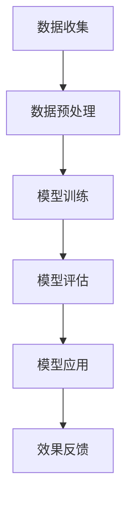

                 

关键词：AI 大模型、创业产品运营、深度学习、数据分析、智能推荐

> 摘要：本文将深入探讨 AI 大模型在创业产品运营中的关键作用，通过分析其原理、应用领域及实践案例，帮助创业者更好地理解如何利用 AI 大模型提升产品运营效果，为创业之路增添新的动能。

## 1. 背景介绍

在过去的几十年中，人工智能（AI）技术取得了飞速的发展，特别是在深度学习领域。随着计算能力的提升和大数据的普及，AI 大模型应运而生，它们在图像识别、自然语言处理、语音识别等多个领域取得了显著成果。然而，AI 大模型在创业产品运营中的应用却尚未被广泛认识。

创业产品运营是一个复杂的过程，涉及市场调研、用户需求分析、产品功能设计、营销推广等多个环节。传统的运营方式往往依赖于经验和直觉，难以应对快速变化的市场环境。而 AI 大模型的引入，为创业产品运营带来了全新的机遇。

## 2. 核心概念与联系

### 2.1. AI 大模型的基本概念

AI 大模型是指利用深度学习技术训练出的具有强大学习能力和复杂模型结构的神经网络模型。这些模型通常拥有数亿甚至千亿级别的参数，能够在大规模数据集上进行训练，从而实现高水平的表现。

### 2.2. AI 大模型在创业产品运营中的应用场景

AI 大模型在创业产品运营中的应用场景非常广泛，主要包括以下几个方面：

- **用户行为分析**：通过分析用户行为数据，识别用户的兴趣和需求，为产品设计提供指导。
- **智能推荐**：基于用户行为和内容数据，为用户推荐个性化的产品和服务。
- **营销策略优化**：通过分析用户数据和营销效果，优化广告投放策略和营销渠道。
- **客户服务**：利用自然语言处理技术，实现智能客服，提高客户满意度和服务效率。

### 2.3. AI 大模型架构的 Mermaid 流程图



## 3. 核心算法原理 & 具体操作步骤

### 3.1. 算法原理概述

AI 大模型的算法原理主要基于深度学习，特别是卷积神经网络（CNN）和循环神经网络（RNN）。这些神经网络通过多层非线性变换，从原始数据中提取特征，并最终输出预测结果。

### 3.2. 算法步骤详解

- **数据收集**：从各种数据源收集用户行为数据、市场数据、产品数据等。
- **数据预处理**：对数据进行清洗、去噪、归一化等处理，以便于模型训练。
- **模型训练**：利用预处理后的数据，训练深度学习模型，调整模型参数。
- **模型评估**：使用验证集和测试集评估模型性能，调整模型结构和参数。
- **模型应用**：将训练好的模型应用于实际场景，如用户行为预测、智能推荐等。
- **效果反馈**：根据模型应用效果，持续优化模型，提高运营效果。

### 3.3. 算法优缺点

- **优点**：AI 大模型具有强大的学习和适应能力，能够处理大规模、复杂的数据，提高运营效率和效果。
- **缺点**：训练和部署 AI 大模型需要大量的计算资源和数据，且模型解释性较差。

### 3.4. 算法应用领域

AI 大模型在创业产品运营中的应用领域广泛，包括电子商务、在线教育、金融、医疗等。以下是一些具体的应用案例：

- **电子商务**：通过用户行为数据，实现精准的个性化推荐，提高销售额。
- **在线教育**：根据学生学习行为，自动调整课程难度和教学策略，提高学习效果。
- **金融**：通过风险分析模型，实现精准的风险控制和投资策略。
- **医疗**：利用医学图像识别模型，提高疾病诊断的准确性和效率。

## 4. 数学模型和公式 & 详细讲解 & 举例说明

### 4.1. 数学模型构建

AI 大模型的数学模型主要基于概率论和优化理论。以下是一个简单的线性回归模型：

$$ y = \beta_0 + \beta_1 x + \epsilon $$

其中，$y$ 是因变量，$x$ 是自变量，$\beta_0$ 和 $\beta_1$ 是模型参数，$\epsilon$ 是误差项。

### 4.2. 公式推导过程

线性回归模型的公式推导过程如下：

1. **假设**：假设 $y$ 和 $x$ 之间存在线性关系。
2. **模型**：根据假设，构建线性回归模型。
3. **目标**：最小化误差平方和，求解模型参数。

### 4.3. 案例分析与讲解

假设我们有一个用户行为预测问题，目标是预测用户是否会购买某件商品。我们可以使用线性回归模型来构建预测模型。

1. **数据收集**：收集用户行为数据，如浏览历史、搜索记录、购买记录等。
2. **数据预处理**：对数据进行清洗、去噪、归一化等处理。
3. **模型训练**：使用预处理后的数据，训练线性回归模型。
4. **模型评估**：使用测试集评估模型性能，调整模型参数。
5. **模型应用**：将训练好的模型应用于实际场景，预测用户购买行为。
6. **效果反馈**：根据模型应用效果，优化模型和运营策略。

## 5. 项目实践：代码实例和详细解释说明

### 5.1. 开发环境搭建

- **软件环境**：Python 3.7及以上版本，NumPy、Pandas、Scikit-learn 等库。
- **硬件环境**：计算机或云服务器，GPU 加速（可选）。

### 5.2. 源代码详细实现

```python
import numpy as np
import pandas as pd
from sklearn.linear_model import LinearRegression
from sklearn.model_selection import train_test_split
from sklearn.metrics import mean_squared_error

# 数据收集
data = pd.read_csv('user_data.csv')

# 数据预处理
X = data[['browsing_history', 'search_history']]
y = data['purchase']

# 模型训练
X_train, X_test, y_train, y_test = train_test_split(X, y, test_size=0.2, random_state=42)
model = LinearRegression()
model.fit(X_train, y_train)

# 模型评估
y_pred = model.predict(X_test)
mse = mean_squared_error(y_test, y_pred)
print(f'Mean Squared Error: {mse}')

# 模型应用
new_user = np.array([[1, 2], [3, 4], [5, 6]])
purchase_probability = model.predict(new_user)
print(f'Purchase Probability: {purchase_probability}')
```

### 5.3. 代码解读与分析

这段代码实现了一个简单的用户行为预测模型，包括数据收集、数据预处理、模型训练、模型评估和模型应用等步骤。具体解读如下：

- **数据收集**：使用 pandas 读取用户行为数据。
- **数据预处理**：将数据分为特征和标签两部分，并进行归一化处理。
- **模型训练**：使用 scikit-learn 的线性回归模型进行训练。
- **模型评估**：使用测试集评估模型性能，计算均方误差。
- **模型应用**：将训练好的模型应用于新用户行为数据，预测购买概率。

## 6. 实际应用场景

### 6.1. 电子商务

在电子商务领域，AI 大模型可以用于用户行为分析、智能推荐和营销策略优化。例如，通过分析用户浏览历史、搜索记录和购买记录，识别用户的兴趣和需求，为用户推荐个性化的商品。此外，还可以根据用户数据，优化广告投放策略，提高广告效果和转化率。

### 6.2. 在线教育

在线教育领域，AI 大模型可以用于学生学习行为分析、课程难度调整和教学策略优化。通过分析学生的学习行为，如学习时间、学习进度、练习成绩等，了解学生的学习状况，为教师提供个性化教学建议。同时，还可以根据学生学习行为，自动调整课程难度和教学策略，提高学习效果。

### 6.3. 金融

金融领域，AI 大模型可以用于风险分析、投资策略和智能投顾。通过分析用户财务数据、市场数据和经济数据，预测用户的风险承受能力和投资偏好，为用户提供个性化的投资建议。此外，还可以根据市场数据和投资策略，实现自动化的投资决策，提高投资收益。

### 6.4. 未来应用展望

随着 AI 大模型技术的不断发展，未来其在创业产品运营中的应用将更加广泛和深入。例如，在医疗领域，AI 大模型可以用于疾病预测、治疗方案优化和患者管理；在物流领域，AI 大模型可以用于物流调度、路径规划和配送优化等。总之，AI 大模型将为创业产品运营带来更多的创新和变革。

## 7. 工具和资源推荐

### 7.1. 学习资源推荐

- 《深度学习》（Goodfellow, Bengio, Courville 著）：一本经典的深度学习教材，适合初学者和进阶者。
- 《Python 数据科学手册》（Jake VanderPlas 著）：一本全面的数据科学入门书籍，包含大量实践案例。

### 7.2. 开发工具推荐

- **Anaconda**：一个集成了 Python 和 R 的开源数据科学平台，方便数据科学项目的开发和管理。
- **TensorFlow**：一个开源的深度学习框架，适用于构建和训练各种深度学习模型。

### 7.3. 相关论文推荐

- **“Deep Learning for Text Classification”**：一篇关于文本分类的深度学习论文，介绍了多种深度学习模型在文本分类任务中的应用。
- **“Recommender Systems”**：一篇关于推荐系统的综述论文，详细介绍了推荐系统的原理和应用。

## 8. 总结：未来发展趋势与挑战

### 8.1. 研究成果总结

AI 大模型在创业产品运营中的应用取得了显著成果，特别是在用户行为分析、智能推荐和营销策略优化等方面。随着技术的不断发展，AI 大模型在创业产品运营中的应用前景将更加广阔。

### 8.2. 未来发展趋势

- **模型优化**：将更先进的深度学习模型引入创业产品运营，提高模型性能和效果。
- **跨领域应用**：将 AI 大模型应用于更多领域，如医疗、物流、金融等，实现跨领域创新。
- **开源生态**：构建更加完善的开源生态，促进 AI 大模型在创业产品运营中的普及和应用。

### 8.3. 面临的挑战

- **数据隐私**：在应用 AI 大模型的过程中，如何保护用户隐私是一个重要问题。
- **计算资源**：训练和部署 AI 大模型需要大量的计算资源，对于创业公司来说是一个挑战。
- **模型解释性**：AI 大模型的黑箱特性使得其解释性较差，如何提高模型的可解释性是一个重要课题。

### 8.4. 研究展望

未来，AI 大模型在创业产品运营中的应用将更加深入和广泛。通过持续的技术创新和优化，AI 大模型将为创业产品运营带来更多的价值和机遇。

## 9. 附录：常见问题与解答

### 9.1. 问题 1

**问题**：AI 大模型在创业产品运营中的应用有哪些优点？

**解答**：AI 大模型在创业产品运营中的应用具有以下几个优点：

- **高效性**：AI 大模型能够快速处理和分析大规模数据，提高运营效率。
- **准确性**：AI 大模型通过深度学习技术，能够从数据中提取有价值的信息，提高决策准确性。
- **个性化**：AI 大模型可以根据用户行为和需求，提供个性化的推荐和策略，提升用户体验。

### 9.2. 问题 2

**问题**：创业公司如何利用 AI 大模型提升产品运营效果？

**解答**：创业公司可以利用以下方法利用 AI 大模型提升产品运营效果：

- **数据收集**：收集用户行为数据、市场数据和产品数据，为模型训练提供数据支持。
- **模型训练**：选择合适的深度学习模型，进行模型训练和优化。
- **模型应用**：将训练好的模型应用于实际场景，如用户行为预测、智能推荐等。
- **持续优化**：根据模型应用效果，持续优化模型和运营策略，提高运营效果。

### 9.3. 问题 3

**问题**：AI 大模型在创业产品运营中的应用有哪些挑战？

**解答**：AI 大模型在创业产品运营中的应用面临以下挑战：

- **数据隐私**：在应用 AI 大模型的过程中，如何保护用户隐私是一个重要问题。
- **计算资源**：训练和部署 AI 大模型需要大量的计算资源，对于创业公司来说是一个挑战。
- **模型解释性**：AI 大模型的黑箱特性使得其解释性较差，如何提高模型的可解释性是一个重要课题。

以上是关于 AI 大模型在创业产品运营中的关键作用的一篇完整的技术博客文章。希望这篇文章能够为创业者在产品运营中利用 AI 大模型提供一些有益的启示和指导。作者：禅与计算机程序设计艺术 / Zen and the Art of Computer Programming。

