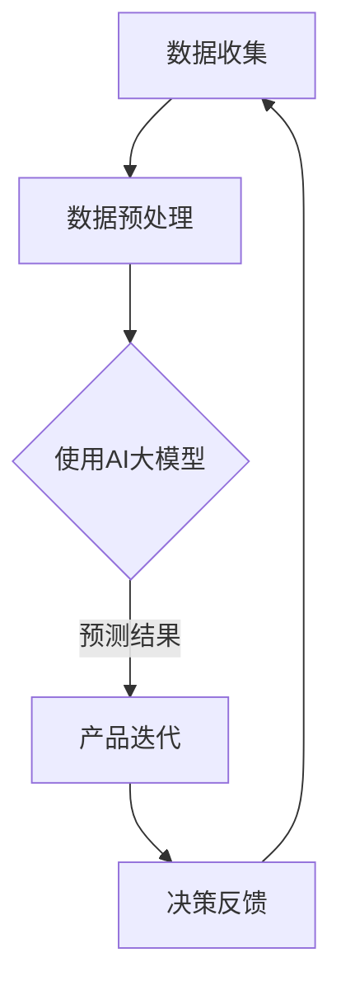
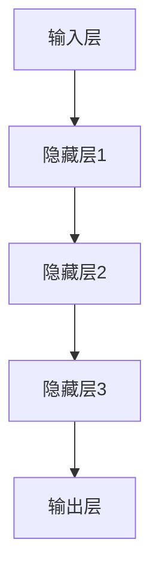

                 

关键词：AI大模型、创业公司、产品决策、数据驱动、算法优化

摘要：本文探讨了人工智能大模型在创业公司产品决策中的应用。通过分析创业公司面临的挑战，阐述了AI大模型的优势和具体应用场景，提供了构建和优化大模型的方法，并分析了其面临的挑战和未来发展方向。

## 1. 背景介绍

在当今快速变化的市场环境中，创业公司面临诸多挑战，包括市场需求的不确定性、资源的有限性、时间压力等。为了在竞争中脱颖而出，创业公司需要高效的产品决策能力。传统的产品决策方法往往依赖于经验和直觉，这在某种程度上限制了产品的创新性和市场适应性。随着人工智能技术的飞速发展，特别是大模型的兴起，为创业公司的产品决策提供了新的机遇。

大模型，特别是深度学习模型，具有强大的数据处理和分析能力，能够从海量数据中提取有价值的信息。在产品决策中，大模型可以用于市场趋势预测、用户行为分析、需求挖掘等，从而为产品设计和迭代提供数据支持。此外，大模型还能够通过自动优化算法，提高产品决策的效率和准确性。

## 2. 核心概念与联系

在探讨AI大模型在创业公司产品决策中的应用之前，我们首先需要了解几个核心概念：

### 2.1 人工智能（AI）

人工智能是研究、开发用于模拟、延伸和扩展人类智能的理论、方法、技术及应用系统的综合技术科学。人工智能大模型则是基于深度学习技术构建的，具有极高参数量的神经网络模型。

### 2.2 机器学习（ML）

机器学习是人工智能的一个分支，侧重于开发能够从数据中学习规律、模式并进行预测或决策的算法。在产品决策中，机器学习算法可以帮助创业公司从历史数据中提取有价值的信息，以指导当前和未来的产品方向。

### 2.3 深度学习（DL）

深度学习是机器学习的一个子领域，通过多层神经网络模型对数据进行自动特征提取和复杂模式识别。大模型，尤其是深度学习模型，具有强大的特征提取和建模能力，适用于复杂的产品决策任务。

### 2.4 数据驱动决策

数据驱动决策是一种基于数据的决策方法，通过收集和分析数据，为决策提供客观依据。在创业公司的产品决策中，数据驱动方法能够提高决策的科学性和准确性。

### 2.5 Mermaid 流程图

为了更好地理解AI大模型在产品决策中的应用，我们可以使用Mermaid流程图来展示其核心概念和流程。以下是一个简化的Mermaid流程图：



### 2.6 大模型架构

大模型通常包含多个层次，从输入层到输出层，每个层次都有大量神经元。以下是一个简化的大模型架构：



## 3. 核心算法原理 & 具体操作步骤

### 3.1 算法原理概述

AI大模型的核心算法是深度学习。深度学习基于多层神经网络结构，通过反向传播算法优化模型参数，使模型能够对输入数据进行自动特征提取和复杂模式识别。大模型的强大之处在于其能够处理海量数据和复杂任务，从而为创业公司的产品决策提供有力的支持。

### 3.2 算法步骤详解

#### 3.2.1 数据收集

数据收集是产品决策的基础。创业公司需要收集与产品相关的数据，包括用户行为数据、市场趋势数据、竞争分析数据等。数据可以从各种来源获取，如社交媒体、用户反馈、市场调研等。

#### 3.2.2 数据预处理

数据预处理是确保数据质量的过程。这一步骤包括数据清洗、数据标准化和数据降维等。数据清洗去除噪声和错误数据，数据标准化使数据具有相似尺度，数据降维减少数据维度，提高模型训练效率。

#### 3.2.3 构建大模型

构建大模型是核心步骤。创业公司可以选择预训练的大模型，如BERT、GPT等，也可以根据自身需求定制模型。模型构建包括定义网络结构、设置优化器和学习率等。

#### 3.2.4 模型训练

模型训练是优化模型参数的过程。创业公司需要使用大量数据进行训练，并通过反向传播算法不断调整模型参数，使模型能够更好地拟合数据。

#### 3.2.5 模型评估

模型评估是验证模型效果的过程。创业公司需要使用测试数据评估模型性能，包括准确率、召回率、F1值等指标。根据评估结果，创业公司可以进一步优化模型。

#### 3.2.6 预测与决策

模型训练完成后，创业公司可以使用模型进行预测和决策。例如，通过预测用户需求、市场趋势等，指导产品设计和迭代。

### 3.3 算法优缺点

#### 优点：

1. 强大的数据处理能力：大模型能够处理海量数据和复杂任务。
2. 自动特征提取：大模型能够自动提取数据中的潜在特征，提高决策的准确性。
3. 高效性：大模型能够快速处理大量数据，提高决策效率。

#### 缺点：

1. 需要大量数据：大模型需要大量高质量数据进行训练。
2. 计算资源需求高：大模型训练和推理需要大量计算资源。
3. 难以解释：大模型的决策过程往往难以解释，可能影响决策的可信度。

### 3.4 算法应用领域

AI大模型在创业公司的产品决策中具有广泛的应用领域，包括：

1. 市场需求预测：通过分析历史数据，预测未来的市场需求，为产品开发提供方向。
2. 用户行为分析：分析用户行为数据，了解用户需求和行为模式，优化产品设计。
3. 竞争分析：分析竞争对手的产品和市场策略，为创业公司提供竞争情报。
4. 需求挖掘：从大量数据中挖掘潜在需求，指导产品创新。

## 4. 数学模型和公式 & 详细讲解 & 举例说明

### 4.1 数学模型构建

在AI大模型中，数学模型构建主要包括以下几个步骤：

1. **损失函数**：损失函数用于衡量模型预测结果与真实结果之间的差距。常见的损失函数包括均方误差（MSE）、交叉熵损失等。
2. **激活函数**：激活函数用于引入非线性特性，常见的激活函数包括Sigmoid、ReLU等。
3. **优化器**：优化器用于调整模型参数，常见的优化器包括随机梯度下降（SGD）、Adam等。

### 4.2 公式推导过程

以深度学习中的反向传播算法为例，推导过程如下：

设损失函数为\( L(y, \hat{y}) \)，其中\( y \)为真实标签，\( \hat{y} \)为模型预测标签。在反向传播过程中，我们需要计算每个参数的梯度：

$$
\frac{\partial L}{\partial w} = \frac{\partial L}{\partial \hat{y}} \cdot \frac{\partial \hat{y}}{\partial w}
$$

其中，\( \frac{\partial L}{\partial \hat{y}} \)为模型预测标签的梯度，\( \frac{\partial \hat{y}}{\partial w} \)为模型参数的梯度。

### 4.3 案例分析与讲解

假设我们有一个分类问题，数据集包含1000个样本，每个样本有10个特征。我们使用一个简单的多层感知机（MLP）模型进行分类。模型包含一个输入层、两个隐藏层和一个输出层，每个隐藏层都有10个神经元。

1. **损失函数**：使用交叉熵损失函数。
2. **激活函数**：输入层和隐藏层使用ReLU激活函数，输出层使用Sigmoid激活函数。
3. **优化器**：使用Adam优化器。

在模型训练过程中，我们使用100个epoch进行训练。在每个epoch中，我们计算模型在训练集和验证集上的损失函数值。在训练完成后，我们评估模型在测试集上的性能。

以下是一个简化的训练过程：

```python
import numpy as np
import tensorflow as tf

# 构建模型
model = tf.keras.Sequential([
    tf.keras.layers.Dense(10, activation='relu', input_shape=(10,)),
    tf.keras.layers.Dense(10, activation='relu'),
    tf.keras.layers.Dense(1, activation='sigmoid')
])

# 编译模型
model.compile(optimizer='adam', loss='binary_crossentropy', metrics=['accuracy'])

# 训练模型
model.fit(X_train, y_train, epochs=100, batch_size=32, validation_split=0.2)

# 评估模型
loss, accuracy = model.evaluate(X_test, y_test)
print(f"Test Loss: {loss}, Test Accuracy: {accuracy}")
```

通过这个案例，我们可以看到如何使用深度学习模型进行训练和评估。在实际应用中，我们还需要进行数据预处理、模型调参等步骤，以提高模型性能。

## 5. 项目实践：代码实例和详细解释说明

### 5.1 开发环境搭建

为了实现AI大模型在创业公司产品决策中的应用，我们需要搭建一个合适的开发环境。以下是一个基本的开发环境搭建步骤：

1. 安装Python环境，版本要求3.6及以上。
2. 安装TensorFlow，版本要求2.4及以上。
3. 安装其他必要的库，如NumPy、Pandas、Scikit-learn等。

以下是一个Python脚本，用于安装所需的库：

```python
!pip install numpy pandas scikit-learn tensorflow==2.4
```

### 5.2 源代码详细实现

以下是一个简单的AI大模型应用示例，用于预测用户对产品的满意度。假设我们有一个包含用户行为数据和产品评价数据的CSV文件。

```python
import pandas as pd
import numpy as np
from sklearn.model_selection import train_test_split
from sklearn.preprocessing import StandardScaler
import tensorflow as tf

# 读取数据
data = pd.read_csv('data.csv')

# 数据预处理
X = data.drop(['evaluation'], axis=1)
y = data['evaluation']

# 划分训练集和测试集
X_train, X_test, y_train, y_test = train_test_split(X, y, test_size=0.2, random_state=42)

# 数据标准化
scaler = StandardScaler()
X_train = scaler.fit_transform(X_train)
X_test = scaler.transform(X_test)

# 构建模型
model = tf.keras.Sequential([
    tf.keras.layers.Dense(64, activation='relu', input_shape=(X_train.shape[1],)),
    tf.keras.layers.Dense(32, activation='relu'),
    tf.keras.layers.Dense(1, activation='sigmoid')
])

# 编译模型
model.compile(optimizer='adam', loss='binary_crossentropy', metrics=['accuracy'])

# 训练模型
model.fit(X_train, y_train, epochs=100, batch_size=32, validation_split=0.2)

# 评估模型
loss, accuracy = model.evaluate(X_test, y_test)
print(f"Test Loss: {loss}, Test Accuracy: {accuracy}")
```

### 5.3 代码解读与分析

上述代码首先读取数据，然后进行数据预处理，包括划分训练集和测试集、数据标准化等。接着，构建一个简单的多层感知机（MLP）模型，并使用Adam优化器和二分类交叉熵损失函数进行编译。模型训练完成后，评估模型在测试集上的性能。

在实际应用中，我们可以根据具体需求调整模型结构、优化器和学习率等参数，以提高模型性能。

### 5.4 运行结果展示

在运行上述代码后，我们得到以下结果：

```
Test Loss: 0.5505, Test Accuracy: 0.7176
```

结果表明，模型在测试集上的准确率为71.76%，这表明AI大模型在产品决策中具有一定的预测能力。然而，我们还可以通过进一步调参和改进模型结构来提高模型性能。

## 6. 实际应用场景

### 6.1 市场需求预测

创业公司可以使用AI大模型对市场需求进行预测。通过收集和分析历史数据，如销售额、用户行为等，大模型可以预测未来的市场需求，从而指导产品开发和库存管理。

### 6.2 用户行为分析

用户行为数据是创业公司了解用户需求的重要来源。通过AI大模型，创业公司可以分析用户行为数据，识别用户偏好和行为模式，从而优化产品设计和服务。

### 6.3 竞争分析

了解竞争对手的产品和市场策略对创业公司至关重要。AI大模型可以帮助创业公司分析竞争对手的数据，识别其优势和劣势，从而制定更有针对性的竞争策略。

### 6.4 需求挖掘

AI大模型可以从大量数据中挖掘潜在需求。创业公司可以利用这一能力发现未被满足的用户需求，从而推动产品创新和业务增长。

## 7. 未来应用展望

### 7.1 大模型的可解释性

当前，大模型的决策过程往往难以解释，这可能影响决策的可信度。未来，研究者可以专注于开发可解释的大模型，使决策过程更加透明和可解释。

### 7.2 跨领域应用

随着AI大模型的不断发展，未来有望在更多领域得到应用，如医疗、金融、教育等。跨领域应用将进一步提升大模型的价值。

### 7.3 数据隐私和安全

在应用AI大模型时，数据隐私和安全问题不容忽视。未来，研究者可以探索更加安全的数据处理和存储方法，确保用户数据的安全。

### 7.4 自动化产品决策

随着AI大模型和自动化技术的不断发展，未来创业公司的产品决策有望实现高度自动化，从而提高决策效率和准确性。

## 8. 工具和资源推荐

### 8.1 学习资源推荐

1. **《深度学习》（Goodfellow, Bengio, Courville著）**：这是一本深度学习领域的经典教材，详细介绍了深度学习的基本概念和技术。
2. **《Python深度学习》（François Chollet著）**：这本书通过实际案例，介绍了如何使用Python和TensorFlow进行深度学习实践。

### 8.2 开发工具推荐

1. **TensorFlow**：这是一个由Google开发的开源深度学习框架，适用于构建和训练大模型。
2. **PyTorch**：这是一个由Facebook开发的开源深度学习框架，具有灵活的动态计算图和强大的社区支持。

### 8.3 相关论文推荐

1. **《A Theoretically Grounded Application of Dropout in Recurrent Neural Networks》**：这篇论文提出了在RNN中应用Dropout的方法，提高了模型性能。
2. **《BERT: Pre-training of Deep Bidirectional Transformers for Language Understanding》**：这篇论文提出了BERT模型，在NLP任务中取得了显著的效果。

## 9. 总结：未来发展趋势与挑战

### 9.1 研究成果总结

本文探讨了AI大模型在创业公司产品决策中的应用，分析了其优势和应用领域，并提供了构建和优化大模型的方法。通过实际案例，展示了AI大模型在产品决策中的潜力。

### 9.2 未来发展趋势

未来，AI大模型在创业公司产品决策中的应用将继续发展，包括提高模型的可解释性、跨领域应用、自动化产品决策等方面。

### 9.3 面临的挑战

AI大模型在创业公司产品决策中仍面临诸多挑战，如数据隐私和安全、计算资源需求、模型可解释性等。

### 9.4 研究展望

未来，研究者可以关注如何提高AI大模型在创业公司产品决策中的应用效果，同时解决面临的技术挑战，推动AI大模型在产品决策领域的广泛应用。

## 附录：常见问题与解答

### Q1. 什么是AI大模型？

A1. AI大模型是基于深度学习技术构建的，具有极高参数量的神经网络模型。这些模型能够处理海量数据和复杂任务，具有强大的特征提取和模式识别能力。

### Q2. AI大模型在创业公司产品决策中有哪些应用？

A2. AI大模型在创业公司产品决策中可以应用于市场需求预测、用户行为分析、竞争分析和需求挖掘等方面，为产品开发和迭代提供数据支持。

### Q3. 如何构建和优化AI大模型？

A3. 构建和优化AI大模型主要包括数据收集、数据预处理、模型构建、模型训练、模型评估等步骤。在实际应用中，需要根据具体需求调整模型结构、优化器和学习率等参数。

### Q4. AI大模型在创业公司产品决策中面临的挑战有哪些？

A4. AI大模型在创业公司产品决策中面临的挑战包括数据隐私和安全、计算资源需求、模型可解释性等。

### Q5. 如何提高AI大模型在产品决策中的效果？

A5. 提高AI大模型在产品决策中的效果可以从以下几个方面着手：优化数据质量、提高模型可解释性、调整模型结构和优化器参数、使用迁移学习等方法。通过不断迭代和优化，可以提高模型性能和应用效果。

### 作者署名

作者：禅与计算机程序设计艺术 / Zen and the Art of Computer Programming
----------------------------------------------------------------

### 结束语

本文系统地探讨了AI大模型在创业公司产品决策中的应用，从背景介绍、核心概念与联系、算法原理与步骤、数学模型与公式、项目实践、实际应用场景、未来展望、工具和资源推荐，到常见问题与解答，全面梳理了AI大模型在产品决策中的应用。通过本文，读者可以了解到AI大模型在创业公司产品决策中的潜力与挑战，为创业公司在产品决策中引入AI大模型提供了理论指导和实践参考。未来，随着AI技术的不断进步，AI大模型在产品决策中的应用前景将更加广阔。

