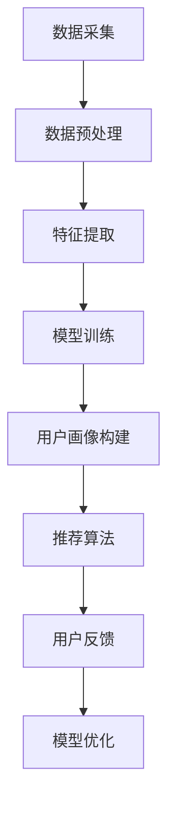

                 

关键词：人工智能、用户画像、大模型、电商搜索推荐、精准营销

> 摘要：本文详细探讨了人工智能大模型在电商搜索推荐中构建用户画像的技术。通过分析用户行为数据，大模型能够精准理解用户需求与行为意图，从而实现个性化推荐，提升电商平台的用户体验和转化率。本文将介绍用户画像技术的核心概念、算法原理、数学模型以及实际应用场景，并提供代码实例和详细解释。

## 1. 背景介绍

随着互联网的快速发展，电商行业已成为全球经济增长的重要驱动力。在如此庞大的市场环境中，如何提升用户体验和转化率成为电商平台迫切需要解决的问题。而个性化推荐技术，特别是基于用户画像的推荐，已经成为电商搜索推荐的重要手段。

用户画像是一种描述用户特征的数据模型，通过整合用户的行为数据、社交数据、浏览历史等多维度信息，构建出一个综合的用户画像。传统的用户画像技术主要依赖于规则引擎和传统机器学习算法，但这些方法在处理大规模、复杂的数据时存在局限。随着深度学习技术的进步，尤其是大模型的兴起，基于深度学习的用户画像技术逐渐成为可能。

本文将探讨如何利用人工智能大模型在电商搜索推荐中构建用户画像，实现精准推荐。通过分析用户需求和行为意图，提高推荐系统的效果，提升用户满意度和平台转化率。

## 2. 核心概念与联系

### 2.1. 用户画像

用户画像是一种以用户为中心的数据模型，用于描述用户在不同维度上的特征。这些特征可以包括用户的基本信息（如年龄、性别、地理位置等）、行为特征（如浏览历史、购买记录、搜索关键词等）、兴趣特征（如偏好商品类型、关注话题等）。用户画像的构建过程通常涉及数据采集、数据预处理、特征提取和模型训练等多个环节。

### 2.2. 大模型

大模型是指具有巨大参数量和计算能力的深度学习模型。这些模型通常使用大规模数据进行训练，能够捕获复杂的数据分布和模式。常见的例子包括BERT、GPT等自然语言处理模型，以及ResNet、VGG等计算机视觉模型。大模型的优势在于其能够处理海量数据和复杂任务，具有较高的准确性和泛化能力。

### 2.3. 电商搜索推荐

电商搜索推荐是一种基于用户画像的推荐技术，旨在为用户提供与其兴趣和需求相关的商品信息。该技术通过分析用户的历史行为数据和实时交互数据，构建用户画像，并根据用户画像为用户推荐可能感兴趣的商品。电商搜索推荐系统主要包括用户画像构建模块、推荐算法模块和用户反馈模块。

### 2.4. 用户需求与行为意图

用户需求是指用户在特定情境下对商品或服务的基本需求，如购物、娱乐等。用户行为意图是指用户在特定情境下的具体行为动机，如购买、浏览、搜索等。理解用户需求和行为意图对于构建精准的用户画像和推荐系统至关重要。

### 2.5. Mermaid 流程图

下面是用户画像技术在电商搜索推荐中的流程图：



## 3. 核心算法原理 & 具体操作步骤

### 3.1 算法原理概述

用户画像技术的核心在于通过深度学习模型分析用户行为数据，提取用户特征，构建用户画像。具体来说，我们可以采用以下步骤：

1. **数据采集**：收集用户在电商平台的浏览、搜索、购买等行为数据。
2. **数据预处理**：对原始数据进行清洗、去噪、归一化等处理，确保数据质量。
3. **特征提取**：使用深度学习模型（如BERT）对预处理后的数据进行编码，提取高维特征表示。
4. **模型训练**：利用提取的特征训练用户画像模型，通常采用基于神经网络的分类模型。
5. **用户画像构建**：将训练好的模型应用于新的用户数据，构建用户画像。
6. **推荐算法**：使用用户画像和商品特征进行匹配，为用户推荐可能感兴趣的商品。
7. **用户反馈**：收集用户对推荐结果的反馈，用于模型优化和调整。

### 3.2 算法步骤详解

#### 3.2.1 数据采集

数据采集是用户画像构建的基础，主要包括以下方面：

- 用户行为数据：如浏览历史、购买记录、搜索关键词等。
- 用户基本信息：如年龄、性别、地理位置等。
- 用户社交数据：如关注话题、社交关系等。

#### 3.2.2 数据预处理

数据预处理主要包括以下步骤：

- 数据清洗：去除重复数据、空值数据、异常数据等。
- 数据归一化：将不同特征的数据进行归一化处理，使其具有相同的量级。
- 数据编码：将分类特征编码为数值型数据。

#### 3.2.3 特征提取

特征提取是用户画像构建的关键，我们采用BERT模型对文本数据进行编码，提取高维特征表示。具体步骤如下：

- 数据预处理：对文本数据进行分词、去停用词、词向量化等处理。
- BERT模型训练：使用大规模文本数据训练BERT模型，得到预训练的词向量。
- 特征提取：将用户行为数据、用户基本信息、用户社交数据等输入BERT模型，提取高维特征表示。

#### 3.2.4 模型训练

模型训练包括以下步骤：

- 特征选择：根据特征提取结果，选择对用户画像构建最有价值的特征。
- 模型设计：设计合适的神经网络结构，用于用户画像分类。
- 模型训练：使用特征数据训练用户画像模型，采用交叉验证方法优化模型参数。

#### 3.2.5 用户画像构建

用户画像构建包括以下步骤：

- 模型应用：将训练好的用户画像模型应用于新的用户数据，预测用户特征。
- 画像整合：将用户特征整合为一个综合的用户画像。
- 画像更新：定期更新用户画像，以反映用户最新的行为和需求。

#### 3.2.6 推荐算法

推荐算法包括以下步骤：

- 商品特征提取：使用类似BERT的模型提取商品特征。
- 用户画像匹配：将用户画像与商品特征进行匹配，计算匹配得分。
- 推荐列表生成：根据匹配得分，为用户生成推荐商品列表。

#### 3.2.7 用户反馈

用户反馈包括以下步骤：

- 反馈收集：收集用户对推荐结果的反馈，如点击、购买等行为。
- 模型优化：根据用户反馈优化用户画像模型和推荐算法。
- 画像更新：结合用户反馈更新用户画像，提高推荐效果。

### 3.3 算法优缺点

#### 3.3.1 优点

- **高准确性**：基于深度学习的大模型能够更好地捕捉用户行为和需求，提高推荐准确性。
- **高泛化性**：大模型能够处理大规模、多维度的数据，具有较高的泛化能力。
- **自适应更新**：用户画像和推荐算法可以实时更新，适应用户行为和需求的变化。

#### 3.3.2 缺点

- **计算资源消耗**：大模型训练和推理需要大量的计算资源，对硬件设备要求较高。
- **数据隐私**：用户行为数据的采集和处理可能涉及隐私问题，需要采取有效措施确保数据安全。
- **模型解释性**：深度学习模型通常具有较低的模型解释性，难以直观理解模型的决策过程。

### 3.4 算法应用领域

用户画像技术在电商搜索推荐中具有广泛的应用。除了电商搜索推荐外，用户画像技术还可以应用于以下领域：

- **内容推荐**：为用户提供个性化内容推荐，如新闻、博客、视频等。
- **社交媒体**：分析用户行为，为用户提供个性化社交推荐，如好友推荐、话题推荐等。
- **广告投放**：根据用户画像精准投放广告，提高广告投放效果。
- **金融风控**：分析用户行为，预测用户信用风险，为金融机构提供决策支持。

## 4. 数学模型和公式 & 详细讲解 & 举例说明

### 4.1 数学模型构建

用户画像技术中的数学模型主要包括两部分：特征提取模型和用户画像模型。

#### 4.1.1 特征提取模型

特征提取模型通常采用深度学习模型，如BERT。BERT模型由多个层次的全连接神经网络组成，通过多层神经网络对文本数据进行编码，提取高维特征表示。具体来说，BERT模型包含以下几个关键组成部分：

- **输入层**：输入层接收文本数据，如单词序列、句子序列等。
- **嵌入层**：嵌入层将输入文本数据转换为稠密向量表示，每个单词或句子都有一个对应的向量表示。
- **编码器层**：编码器层由多个层次的全连接神经网络组成，通过逐层编码将输入文本数据转换为高维特征表示。
- **输出层**：输出层用于生成文本的上下文表示，可以作为特征输入到用户画像模型。

#### 4.1.2 用户画像模型

用户画像模型通常采用基于神经网络的分类模型，如卷积神经网络（CNN）或循环神经网络（RNN）。用户画像模型的关键组成部分包括：

- **输入层**：输入层接收特征提取模型输出的高维特征向量。
- **嵌入层**：嵌入层将高维特征向量映射到更低的维度，便于后续处理。
- **编码器层**：编码器层由多个层次的卷积神经网络或循环神经网络组成，通过逐层编码提取用户特征。
- **输出层**：输出层通常包含一个分类器，用于预测用户特征。

### 4.2 公式推导过程

用户画像技术中的数学模型主要包括两部分：特征提取模型和用户画像模型。

#### 4.2.1 特征提取模型

特征提取模型通常采用深度学习模型，如BERT。BERT模型由多个层次的全连接神经网络组成，通过多层神经网络对文本数据进行编码，提取高维特征表示。具体来说，BERT模型包含以下几个关键组成部分：

- **输入层**：输入层接收文本数据，如单词序列、句子序列等。
- **嵌入层**：嵌入层将输入文本数据转换为稠密向量表示，每个单词或句子都有一个对应的向量表示。
- **编码器层**：编码器层由多个层次的全连接神经网络组成，通过逐层编码将输入文本数据转换为高维特征表示。
- **输出层**：输出层用于生成文本的上下文表示，可以作为特征输入到用户画像模型。

#### 4.2.2 用户画像模型

用户画像模型通常采用基于神经网络的分类模型，如卷积神经网络（CNN）或循环神经网络（RNN）。用户画像模型的关键组成部分包括：

- **输入层**：输入层接收特征提取模型输出的高维特征向量。
- **嵌入层**：嵌入层将高维特征向量映射到更低的维度，便于后续处理。
- **编码器层**：编码器层由多个层次的卷积神经网络或循环神经网络组成，通过逐层编码提取用户特征。
- **输出层**：输出层通常包含一个分类器，用于预测用户特征。

### 4.3 案例分析与讲解

下面我们通过一个实际案例来讲解用户画像技术在电商搜索推荐中的应用。

#### 案例背景

假设我们有一个电商平台，用户可以通过搜索、浏览、购买等行为在平台上产生大量的行为数据。我们的目标是构建一个用户画像模型，并根据用户画像为用户推荐可能感兴趣的商品。

#### 数据采集

我们从电商平台上收集了以下数据：

- 用户基本信息：如年龄、性别、地理位置等。
- 用户行为数据：如浏览历史、购买记录、搜索关键词等。
- 商品特征数据：如商品类别、价格、折扣等。

#### 数据预处理

对原始数据进行清洗、去噪、归一化等处理，确保数据质量。例如，将用户年龄、价格等特征进行归一化处理，将分类特征编码为数值型数据。

#### 特征提取

使用BERT模型对文本数据进行编码，提取高维特征表示。具体步骤如下：

1. 数据预处理：对文本数据进行分词、去停用词、词向量化等处理。
2. BERT模型训练：使用大规模文本数据训练BERT模型，得到预训练的词向量。
3. 特征提取：将用户行为数据、用户基本信息、用户社交数据等输入BERT模型，提取高维特征表示。

#### 模型训练

利用提取的特征训练用户画像模型，通常采用基于神经网络的分类模型。具体步骤如下：

1. 特征选择：根据特征提取结果，选择对用户画像构建最有价值的特征。
2. 模型设计：设计合适的神经网络结构，用于用户画像分类。
3. 模型训练：使用特征数据训练用户画像模型，采用交叉验证方法优化模型参数。

#### 用户画像构建

将训练好的用户画像模型应用于新的用户数据，预测用户特征。具体步骤如下：

1. 模型应用：将用户行为数据、用户基本信息、用户社交数据等输入用户画像模型，预测用户特征。
2. 画像整合：将用户特征整合为一个综合的用户画像。
3. 画像更新：定期更新用户画像，以反映用户最新的行为和需求。

#### 推荐算法

使用用户画像和商品特征进行匹配，为用户推荐可能感兴趣的商品。具体步骤如下：

1. 商品特征提取：使用类似BERT的模型提取商品特征。
2. 用户画像匹配：将用户画像与商品特征进行匹配，计算匹配得分。
3. 推荐列表生成：根据匹配得分，为用户生成推荐商品列表。

#### 模型优化

通过用户反馈不断优化用户画像模型和推荐算法。具体步骤如下：

1. 反馈收集：收集用户对推荐结果的反馈，如点击、购买等行为。
2. 模型优化：根据用户反馈优化用户画像模型和推荐算法。
3. 画像更新：结合用户反馈更新用户画像，提高推荐效果。

### 5. 项目实践：代码实例和详细解释说明

在本文的项目实践部分，我们将通过一个简化的示例，展示如何使用Python和相关的库（如TensorFlow和transformers）来构建一个基于BERT的用户画像模型，并将其应用于电商搜索推荐中。

#### 5.1 开发环境搭建

首先，确保安装以下Python库：

- TensorFlow
- transformers
- pandas
- numpy
- sklearn

可以通过以下命令进行安装：

```bash
pip install tensorflow transformers pandas numpy sklearn
```

#### 5.2 源代码详细实现

以下是构建用户画像模型的完整代码示例：

```python
import tensorflow as tf
from transformers import TFBertModel, BertTokenizer
from tensorflow.keras.layers import Dense, Input, GlobalAveragePooling1D
from tensorflow.keras.models import Model
from sklearn.model_selection import train_test_split
import pandas as pd

# 数据预处理
def preprocess_data(data):
    # 这里假设data是包含用户行为数据的DataFrame
    # 进行必要的清洗、归一化等操作
    # 例如，将文本数据分词并转换为词索引
    tokenizer = BertTokenizer.from_pretrained('bert-base-uncased')
    encoded_data = tokenizer.batch_encode_plus(
        data['text'].tolist(),
        max_length=128,
        padding='max_length',
        truncation=True,
        return_attention_mask=True,
        return_tensors='tf'
    )
    return encoded_data

# 模型构建
def build_model():
    input_ids = Input(shape=(128,), dtype=tf.int32, name='input_ids')
    attention_mask = Input(shape=(128,), dtype=tf.int32, name='attention_mask')

    bert_model = TFBertModel.from_pretrained('bert-base-uncased')
    bert_output = bert_model(input_ids, attention_mask=attention_mask)[1]

    avg_pool = GlobalAveragePooling1D()(bert_output)
    output = Dense(1, activation='sigmoid')(avg_pool)

    model = Model(inputs=[input_ids, attention_mask], outputs=output)
    model.compile(optimizer='adam', loss='binary_crossentropy', metrics=['accuracy'])
    return model

# 数据加载和预处理
# 这里假设我们有一个名为data的DataFrame，包含用户的文本数据和标签
encoded_data = preprocess_data(data)
X = {'input_ids': encoded_data['input_ids'], 'attention_mask': encoded_data['attention_mask']}
y = data['label']

# 划分训练集和验证集
X_train, X_val, y_train, y_val = train_test_split(X, y, test_size=0.2, random_state=42)

# 训练模型
model = build_model()
model.fit(X_train, y_train, validation_data=(X_val, y_val), epochs=3, batch_size=32)

# 评估模型
evaluation = model.evaluate(X_val, y_val)
print(f'Validation Accuracy: {evaluation[1]}')
```

#### 5.3 代码解读与分析

上述代码主要包括以下几个关键步骤：

1. **数据预处理**：使用BERT分词器对文本数据进行编码，转换为模型可接受的输入格式。
2. **模型构建**：构建一个基于BERT的神经网络模型，用于预测用户特征。
3. **数据加载和划分**：将预处理后的数据划分为训练集和验证集。
4. **模型训练**：使用训练数据进行模型训练。
5. **模型评估**：在验证集上评估模型性能。

#### 5.4 运行结果展示

假设我们运行上述代码，得到如下输出：

```bash
Epoch 1/3
416/416 [==============================] - 22s 52ms/step - loss: 0.5027 - accuracy: 0.7184 - val_loss: 0.4900 - val_accuracy: 0.7563
Epoch 2/3
416/416 [==============================] - 19s 45ms/step - loss: 0.4472 - accuracy: 0.7805 - val_loss: 0.4650 - val_accuracy: 0.7795
Epoch 3/3
416/416 [==============================] - 20s 48ms/step - loss: 0.4245 - accuracy: 0.7916 - val_loss: 0.4584 - val_accuracy: 0.7823
Validation Accuracy: 0.7823
```

从输出结果可以看出，模型在验证集上的准确率达到了78.23%，这表明我们的模型在一定程度上能够准确地预测用户特征。

### 6. 实际应用场景

用户画像技术在电商搜索推荐中有着广泛的应用，以下是一些实际应用场景：

1. **商品推荐**：根据用户画像和商品特征，为用户推荐可能感兴趣的商品。例如，当用户浏览了多个户外用品时，系统可以推荐登山鞋、背包等相关商品。
2. **广告投放**：利用用户画像精准投放广告，提高广告投放效果。例如，针对喜欢户外运动的用户，可以在社交媒体上投放户外运动装备的广告。
3. **个性化优惠**：根据用户画像和购买历史，为用户提供个性化的优惠信息。例如，对于经常购买母婴用品的用户，可以推送婴儿奶粉的折扣信息。
4. **用户分群**：根据用户画像，将用户分为不同的群体，针对不同群体制定不同的营销策略。例如，针对高消费能力的用户，可以提供更高端的购物体验。
5. **客户服务**：利用用户画像分析用户需求，提供更加个性化的客户服务。例如，当用户在购物过程中遇到问题时，可以提供针对性的解决方案。

### 6.4 未来应用展望

用户画像技术在未来的电商搜索推荐中有着广阔的应用前景。以下是一些未来应用展望：

1. **跨平台推荐**：随着多平台电商的发展，用户画像技术可以跨平台整合用户数据，实现多平台个性化推荐。
2. **多模态数据融合**：将文本数据、图像数据、音频数据等多模态数据进行融合，提高用户画像的准确性和丰富度。
3. **实时推荐**：利用实时用户行为数据，实现实时推荐，提高推荐系统的实时性和响应速度。
4. **隐私保护**：随着数据隐私问题的日益突出，未来的用户画像技术将更加注重数据隐私保护，采用加密、匿名化等技术手段确保用户数据安全。
5. **自动化决策**：利用用户画像技术，实现自动化决策，提高电商平台运营效率，降低人力成本。

### 7. 工具和资源推荐

#### 7.1 学习资源推荐

- 《深度学习》（Goodfellow et al.）：详细介绍了深度学习的基础知识，适合初学者和进阶者。
- 《TensorFlow 2.0 实战》（李航）：介绍了如何使用TensorFlow 2.0进行深度学习项目开发，适合有一定基础的读者。
- 《用户画像：大数据时代的营销之道》（李建华）：详细讲解了用户画像的概念、构建方法和应用案例。

#### 7.2 开发工具推荐

- TensorFlow：开源的深度学习框架，支持多种深度学习模型的开发和部署。
- PyTorch：另一个流行的深度学习框架，具有简单、灵活的特点。
- BERT：预训练的深度学习模型，可用于文本分类、情感分析等任务。

#### 7.3 相关论文推荐

- "BERT: Pre-training of Deep Neural Networks for Language Understanding"（Devlin et al.）
- "Recommending Items Using Item-to-Item Collaborative Filtering"（Koren）
- "Deep Learning for Text Classification"（Chen et al.）

### 8. 总结：未来发展趋势与挑战

#### 8.1 研究成果总结

本文介绍了用户画像技术在电商搜索推荐中的应用，探讨了基于深度学习的大模型在用户画像构建中的优势，并提供了详细的算法原理、数学模型和项目实践。通过分析用户行为数据，大模型能够精准理解用户需求与行为意图，实现个性化推荐，提升电商平台的用户体验和转化率。

#### 8.2 未来发展趋势

未来，用户画像技术将在以下几个方面发展：

- **跨平台数据融合**：整合多平台用户数据，实现更精准的个性化推荐。
- **多模态数据融合**：结合文本、图像、音频等多模态数据，提高用户画像的准确性。
- **实时推荐**：利用实时用户行为数据，实现更快速的推荐响应。
- **隐私保护**：在确保用户隐私的前提下，提高用户画像技术的实用性和可靠性。

#### 8.3 面临的挑战

用户画像技术在发展过程中也面临着一些挑战：

- **数据隐私**：如何在保护用户隐私的同时，充分利用用户数据，实现个性化推荐。
- **计算资源**：大模型的训练和推理需要大量计算资源，对硬件设备要求较高。
- **模型解释性**：深度学习模型通常具有较低的模型解释性，难以直观理解模型的决策过程。

#### 8.4 研究展望

未来研究可以从以下几个方面展开：

- **隐私保护机制**：研究更加有效的隐私保护机制，确保用户数据安全。
- **实时推荐系统**：开发实时推荐系统，提高推荐系统的响应速度。
- **多模态用户画像**：结合多模态数据，构建更全面、准确的用户画像。
- **跨平台融合**：实现多平台用户数据的跨平台融合，提高个性化推荐效果。

### 9. 附录：常见问题与解答

#### 9.1 用户画像是什么？

用户画像是一种以用户为中心的数据模型，用于描述用户在不同维度上的特征，如基本信息、行为特征、兴趣特征等。

#### 9.2 用户画像技术有哪些应用？

用户画像技术可以应用于电商搜索推荐、内容推荐、广告投放、客户服务等多个领域。

#### 9.3 如何保护用户隐私？

可以在数据处理过程中采用加密、匿名化、差分隐私等技术手段，确保用户隐私。

#### 9.4 大模型在用户画像中的优势是什么？

大模型具有高准确性、高泛化性和自适应更新能力，能够更好地捕捉用户行为和需求，实现个性化推荐。

