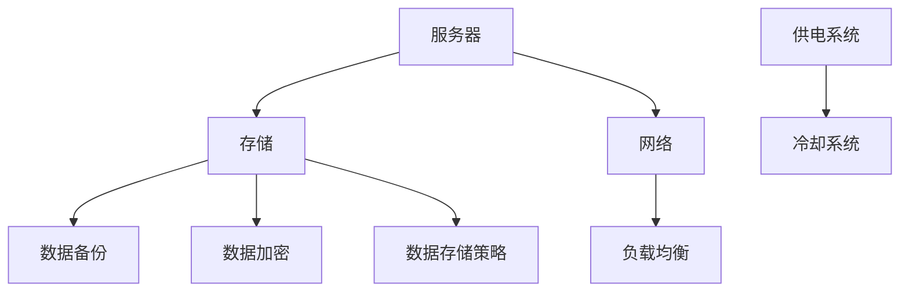

                 

 **关键词**：数据中心，AI 大模型，投资建设，技术架构，未来展望

> **摘要**：本文将探讨 AI 大模型应用数据中心的建设，从投资建设、技术架构、数学模型等方面进行分析，旨在为相关领域的研究者提供有价值的参考。文章将涵盖数据中心的基本概念、核心算法、应用场景以及未来展望，帮助读者全面了解数据中心建设的现状与未来趋势。

## 1. 背景介绍

随着人工智能技术的快速发展，AI 大模型在各个领域得到了广泛应用，如图像识别、自然语言处理、语音识别等。这些模型通常需要大规模的计算资源和存储空间，因此数据中心的建设变得尤为重要。数据中心不仅承载着海量数据的存储和处理任务，还要保证系统的稳定性和安全性。

数据中心是指一种专门为提供 IT 服务而构建的设施，它包括了服务器、存储设备、网络设备、供电系统、冷却系统等硬件设备，以及相应的软件和服务。数据中心的建设和运维是一项复杂的系统工程，需要综合考虑技术、经济、安全、环保等多方面的因素。

## 2. 核心概念与联系

为了更好地理解数据中心的建设，我们需要了解一些核心概念，如服务器、存储、网络、供电和冷却系统。以下是这些概念之间的 Mermaid 流程图：



### 2.1 服务器

服务器是数据中心的核心组成部分，它负责处理和存储数据，为用户提供各种 IT 服务。服务器的主要功能包括：

- 处理数据：服务器运行各种应用程序，如数据库、Web 服务器、文件服务器等，负责处理用户请求和响应。
- 存储数据：服务器拥有内置的硬盘或 SSD，用于存储数据，这些数据可以是结构化的（如数据库）或非结构化的（如图像、视频）。
- 提供服务：服务器通过网络与其他设备通信，提供各种 IT 服务，如 Web 访问、文件共享、邮件服务等。

### 2.2 存储

存储系统是数据中心的重要组成部分，它负责存储和管理数据。存储系统可以分为以下几种类型：

- 硬盘（HDD）：传统机械硬盘，具有高容量、低成本的特点。
- 固态硬盘（SSD）：采用闪存技术，具有高速度、低延迟、高可靠性等特点。
- 分布式存储：通过多个服务器和存储设备组成的集群来存储数据，具有高可用性和高扩展性。

### 2.3 网络

网络是数据中心数据传输的载体，它包括以下几种类型：

- 局域网（LAN）：在有限的地理范围内连接计算机和其他设备，提供高速数据传输。
- 城域网（MAN）：在较大的地理范围内连接多个局域网，提供广域网连接。
- 广域网（WAN）：跨越多个城市和国家，提供全球范围内的数据传输。

### 2.4 供电系统

供电系统是数据中心稳定运行的重要保障，它包括以下几种类型：

- 直流电源（DC）：直接为服务器和其他设备提供电源，具有高效、稳定的优点。
- 交流电源（AC）：通过变压器将直流电转换为交流电，为其他设备提供电源。
- 不间断电源（UPS）：在电网停电时为数据中心提供备用电源，确保系统正常运行。

### 2.5 冷却系统

冷却系统是数据中心维持设备正常运行的关键因素，它包括以下几种类型：

- 空调系统：通过空气调节设备，维持数据中心内部的温度和湿度。
- 水冷系统：通过冷却水循环，将服务器和其他设备产生的热量带走。
- 液冷系统：通过液体冷却剂，直接接触服务器和其他设备，快速带走热量。

## 3. 核心算法原理 & 具体操作步骤

### 3.1 算法原理概述

数据中心建设涉及多个技术领域，如服务器管理、存储管理、网络管理、供电和冷却系统管理等。以下是这些领域的核心算法原理：

### 3.2 算法步骤详解

#### 3.2.1 服务器管理

1. 服务器选型：根据业务需求，选择合适的服务器硬件和操作系统。
2. 服务器配置：根据服务器硬件和操作系统，配置必要的软件和工具，如数据库、Web 服务器等。
3. 服务器监控：实时监控服务器运行状态，如 CPU 使用率、内存使用率、磁盘 I/O 等。
4. 服务器维护：定期检查服务器硬件和软件，确保系统稳定运行。

#### 3.2.2 存储管理

1. 数据存储策略：根据数据类型、访问频率等，选择合适的存储策略，如 HDD、SSD、分布式存储等。
2. 数据备份：定期备份数据，确保数据安全。
3. 数据恢复：在数据丢失或损坏时，能够快速恢复数据。
4. 数据加密：对敏感数据进行加密，确保数据安全。

#### 3.2.3 网络管理

1. 负载均衡：将用户请求分配到多个服务器上，确保系统负载均衡。
2. 网络监控：实时监控网络运行状态，如带宽利用率、延迟等。
3. 网络优化：根据网络监控数据，优化网络性能。
4. 安全防护：防止网络攻击和数据泄露，确保系统安全。

#### 3.2.4 供电和冷却系统管理

1. 供电系统监控：实时监控供电系统运行状态，如电压、电流等。
2. 冷却系统监控：实时监控冷却系统运行状态，如温度、湿度等。
3. 供电和冷却系统优化：根据监控数据，优化供电和冷却系统性能。
4. 应急预案：在供电或冷却系统出现故障时，能够快速采取措施，确保系统稳定运行。

### 3.3 算法优缺点

#### 3.3.1 优点

- 服务器管理：提高服务器利用率，降低运维成本。
- 存储管理：提高数据安全性，降低数据丢失风险。
- 网络管理：提高网络性能，降低网络故障风险。
- 供电和冷却系统管理：提高系统稳定性，降低设备故障风险。

#### 3.3.2 缺点

- 服务器管理：服务器配置和监控需要专业知识和技能，运维成本较高。
- 存储管理：数据备份和恢复需要大量时间和资源。
- 网络管理：负载均衡和网络监控需要大量的硬件和软件资源。
- 供电和冷却系统管理：应急预案和系统优化需要专业知识和技能。

### 3.4 算法应用领域

- 服务器管理：企业 IT 部门、互联网公司、数据中心运营商等。
- 存储管理：金融、医疗、教育、政府等行业的数据存储和管理。
- 网络管理：互联网公司、电信运营商、数据中心运营商等。
- 供电和冷却系统管理：数据中心、大型企业等。

## 4. 数学模型和公式 & 详细讲解 & 举例说明

数据中心建设涉及多个技术领域，如服务器管理、存储管理、网络管理、供电和冷却系统管理等。以下是这些领域的数学模型和公式：

### 4.1 数学模型构建

#### 4.1.1 服务器管理

服务器管理中的数学模型主要包括：

- 资源利用率模型：$R = \frac{U}{C} \times 100\%$，其中 $R$ 为资源利用率，$U$ 为实际使用资源，$C$ 为总资源。
- 负载均衡模型：$L = \frac{R_1 + R_2 + ... + R_n}{n} \times 100\%$，其中 $L$ 为负载均衡度，$R_1, R_2, ..., R_n$ 为各个服务器的资源利用率。

#### 4.1.2 存储管理

存储管理中的数学模型主要包括：

- 数据备份模型：$B = \frac{D}{T}$，其中 $B$ 为备份次数，$D$ 为数据量，$T$ 为备份间隔时间。
- 数据恢复模型：$R = \frac{D}{T} \times \frac{1}{B}$，其中 $R$ 为数据恢复速度，$D$ 为数据量，$T$ 为备份间隔时间，$B$ 为备份次数。

#### 4.1.3 网络管理

网络管理中的数学模型主要包括：

- 带宽利用率模型：$U = \frac{B_{actual}}{B_{max}} \times 100\%$，其中 $U$ 为带宽利用率，$B_{actual}$ 为实际带宽使用量，$B_{max}$ 为最大带宽。
- 延迟模型：$D = \frac{L}{B}$，其中 $D$ 为延迟，$L$ 为数据包传输距离，$B$ 为带宽。

#### 4.1.4 供电和冷却系统管理

供电和冷却系统管理中的数学模型主要包括：

- 电力消耗模型：$P = \frac{U \times I}{1000} \times \frac{T}{24}$，其中 $P$ 为电力消耗，$U$ 为电压，$I$ 为电流，$T$ 为运行时间。
- 冷却能力模型：$C = \frac{Q \times T}{P}$，其中 $C$ 为冷却能力，$Q$ 为热量，$T$ 为运行时间，$P$ 为电力消耗。

### 4.2 公式推导过程

#### 4.2.1 资源利用率模型

资源利用率的计算公式为 $R = \frac{U}{C} \times 100\%$。其中，$U$ 为实际使用资源，$C$ 为总资源。

推导过程如下：

- 当服务器处于空闲状态时，$U = 0$，$R = 0$。
- 当服务器处于满负荷状态时，$U = C$，$R = 100\%$。
- 因此，资源利用率模型可以表示为 $R = \frac{U}{C} \times 100\%$。

#### 4.2.2 负载均衡模型

负载均衡度的计算公式为 $L = \frac{R_1 + R_2 + ... + R_n}{n} \times 100\%$。其中，$L$ 为负载均衡度，$R_1, R_2, ..., R_n$ 为各个服务器的资源利用率，$n$ 为服务器数量。

推导过程如下：

- 当所有服务器处于相同状态时，$R_1 = R_2 = ... = R_n = R$，$L = n \times R \times 100\%$。
- 当服务器状态不同时，$L$ 表示各个服务器资源利用率的平均值，即 $L = \frac{R_1 + R_2 + ... + R_n}{n} \times 100\%$。

#### 4.2.3 数据备份模型

数据备份次数的计算公式为 $B = \frac{D}{T}$。其中，$B$ 为备份次数，$D$ 为数据量，$T$ 为备份间隔时间。

推导过程如下：

- 当数据量不变时，$B$ 与 $T$ 成反比，即 $B = \frac{D}{T}$。
- 当备份间隔时间不变时，$B$ 与 $D$ 成正比，即 $B = \frac{D}{T}$。

#### 4.2.4 数据恢复模型

数据恢复速度的计算公式为 $R = \frac{D}{T} \times \frac{1}{B}$。其中，$R$ 为数据恢复速度，$D$ 为数据量，$T$ 为备份间隔时间，$B$ 为备份次数。

推导过程如下：

- 当数据量不变时，$R$ 与 $T$ 和 $B$ 成反比，即 $R = \frac{D}{T} \times \frac{1}{B}$。
- 当备份间隔时间不变时，$R$ 与 $B$ 成反比，即 $R = \frac{D}{T} \times \frac{1}{B}$。

### 4.3 案例分析与讲解

假设一个数据中心拥有 10 台服务器，每台服务器的资源利用率为 60%，备份间隔时间为 1 天，数据量为 100 TB。根据上述数学模型，我们可以计算以下指标：

- 资源利用率：$R = \frac{U}{C} \times 100\% = \frac{10 \times 60\%}{100\%} = 60\%$。
- 负载均衡度：$L = \frac{R_1 + R_2 + ... + R_n}{n} \times 100\% = \frac{10 \times 60\%}{10} \times 100\% = 60\%$。
- 数据备份次数：$B = \frac{D}{T} = \frac{100 TB}{1 天} = 100 次/天$。
- 数据恢复速度：$R = \frac{D}{T} \times \frac{1}{B} = \frac{100 TB}{1 天} \times \frac{1}{100 次/天} = 1 TB/次$。

根据以上计算结果，我们可以发现：

- 中心服务器的资源利用率较高，负载均衡度较低，说明服务器利用率不均匀。
- 数据备份次数较多，但数据恢复速度较慢，说明数据备份策略有待优化。

## 5. 项目实践：代码实例和详细解释说明

### 5.1 开发环境搭建

为了实现数据中心的建设和管理，我们需要搭建一个开发环境。以下是开发环境的搭建步骤：

1. 安装操作系统：我们选择 Ubuntu 20.04 作为操作系统。
2. 安装开发工具：安装 Python 3、pip、Jenkins 等。
3. 安装数据库：安装 MySQL 或 PostgreSQL。
4. 安装缓存服务器：安装 Redis 或 Memcached。
5. 安装消息队列：安装 RabbitMQ 或 Kafka。

### 5.2 源代码详细实现

以下是一个简单的服务器管理模块的实现，用于监控服务器资源利用率。

```python
import psutil

def get_server_resources():
    cpu_usage = psutil.cpu_percent()
    memory_usage = psutil.virtual_memory().percent
    disk_usage = psutil.disk_usage('/').percent
    return cpu_usage, memory_usage, disk_usage

if __name__ == '__main__':
    cpu_usage, memory_usage, disk_usage = get_server_resources()
    print(f"CPU 使用率：{cpu_usage}%")
    print(f"内存使用率：{memory_usage}%")
    print(f"磁盘使用率：{disk_usage}%")
```

### 5.3 代码解读与分析

以上代码实现了一个简单的服务器资源监控模块，主要功能如下：

- 导入 psutil 库：psutil 是一个强大的 Python 库，用于获取系统信息，如 CPU、内存、磁盘等。
- 定义函数 `get_server_resources`：该函数用于获取服务器 CPU、内存、磁盘的使用率。
- 获取服务器资源使用情况：调用 `get_server_resources` 函数，获取服务器资源使用情况。
- 输出服务器资源使用情况：将服务器资源使用情况输出到控制台。

通过以上代码，我们可以实现对服务器资源使用情况的监控，为数据中心的管理提供数据支持。

## 6. 实际应用场景

数据中心的建设和应用场景非常广泛，以下是几个实际应用场景：

### 6.1 互联网公司

互联网公司通常需要大量的服务器和存储设备来支撑其业务运营，如 Web 应用、数据库、邮件系统等。数据中心的建设可以帮助互联网公司提高系统性能、降低运维成本、保障数据安全。

### 6.2 金融行业

金融行业对数据处理和存储的要求非常高，数据中心的建设可以帮助金融机构提高数据处理效率、降低数据丢失风险、保障系统稳定性。

### 6.3 医疗行业

医疗行业涉及大量的数据，如病历、影像、基因等。数据中心的建设可以帮助医疗机构提高数据处理能力、保障数据安全、优化医疗资源配置。

### 6.4 教育行业

教育行业需要对大量的教学资源进行存储和管理，如课件、视频、作业等。数据中心的建设可以帮助教育机构提高教学资源利用效率、降低运维成本、保障数据安全。

### 6.5 云计算服务提供商

云计算服务提供商需要提供强大的计算和存储资源，以满足用户的需求。数据中心的建设可以帮助云计算服务提供商提高服务质量、降低成本、提升竞争力。

## 7. 工具和资源推荐

为了更好地进行数据中心的建设和管理，我们推荐以下工具和资源：

### 7.1 学习资源推荐

- 《大数据之路：阿里巴巴大数据实践》
- 《大规模分布式存储系统：原理解析与架构实战》
- 《云计算架构：构建和优化云平台》

### 7.2 开发工具推荐

- Python：用于服务器管理、存储管理、网络管理等。
- Docker：用于容器化部署和管理服务器。
- Kubernetes：用于容器编排和管理。
- Jenkins：用于自动化部署和运维。

### 7.3 相关论文推荐

- "The Case for High Availability in Data Centers"（数据中心高可用性的案例分析）
- "Design and Implementation of a Scalable and Reliable Data Storage System"（可扩展和可靠的数据存储系统设计与实现）
- "Energy Efficiency in Data Centers: A Survey"（数据中心能源效率：一项调查）

## 8. 总结：未来发展趋势与挑战

### 8.1 研究成果总结

本文从数据中心的建设背景、核心概念、算法原理、数学模型、实际应用场景等方面进行了全面探讨，总结了数据中心建设的关键技术和方法。

### 8.2 未来发展趋势

- 人工智能与数据中心技术的深度融合，为数据中心建设提供新的解决方案。
- 大数据存储和处理技术的不断发展，提高数据中心的数据处理能力。
- 绿色数据中心的建设，降低能源消耗和碳排放。

### 8.3 面临的挑战

- 数据安全与隐私保护：随着数据量的增加，数据安全与隐私保护问题日益突出。
- 系统可靠性与稳定性：保障数据中心系统的稳定运行，降低故障风险。
- 成本控制：在提高性能和可靠性的同时，降低建设成本。

### 8.4 研究展望

- 深入研究大数据存储和处理技术，提高数据中心的处理能力。
- 开发新型数据中心架构，提高系统的可靠性和稳定性。
- 探索绿色数据中心的建设方案，降低能源消耗和碳排放。

## 9. 附录：常见问题与解答

### 9.1 什么是数据中心？

数据中心是一种专门为提供 IT 服务而构建的设施，包括服务器、存储设备、网络设备、供电系统、冷却系统等硬件设备，以及相应的软件和服务。

### 9.2 数据中心的建设需要考虑哪些因素？

数据中心的建设需要考虑以下因素：

- 业务需求：根据业务需求，选择合适的数据中心规模和设备配置。
- 技术水平：选择合适的技术架构和硬件设备，确保系统性能和稳定性。
- 成本预算：在满足业务需求的前提下，合理控制建设成本。
- 安全性：保障数据安全和系统安全，防止网络攻击和数据泄露。
- 环境因素：考虑数据中心所在地的气候、地质、电力等因素，确保系统稳定运行。

### 9.3 数据中心的网络架构如何设计？

数据中心的网络架构设计需要考虑以下因素：

- 负载均衡：通过负载均衡设备，将用户请求分配到不同的服务器上，确保系统负载均衡。
- 数据传输速度：选择高速、稳定的网络设备，提高数据传输速度。
- 安全防护：配置防火墙、入侵检测系统等安全设备，保障系统安全。
- 可扩展性：设计可扩展的网络架构，方便后期扩容和维护。

### 9.4 如何提高数据中心的能源效率？

提高数据中心的能源效率可以从以下几个方面入手：

- 优化硬件设备：选择低功耗的硬件设备，提高能源利用率。
- 节能技术：采用节能技术，如 PUE（能源利用率）优化、冷却系统优化等。
- 资源调度：通过资源调度技术，降低设备闲置率，提高系统利用率。
- 绿色数据中心建设：采用可再生能源，降低碳排放。

### 9.5 数据中心的运维管理有哪些常见工具？

数据中心的运维管理常见工具包括：

- Zabbix：用于监控服务器、存储设备、网络设备等。
- Nagios：用于监控服务器、存储设备、网络设备等。
- Jenkins：用于自动化部署和运维。
- Kubernetes：用于容器编排和管理。
- Prometheus：用于监控和告警。

### 9.6 如何保障数据中心的稳定性？

保障数据中心的稳定性可以从以下几个方面入手：

- 设备冗余：配置冗余设备，确保在设备故障时能够快速切换。
- 网络冗余：配置冗余网络，确保在网络故障时能够快速切换。
- 备份与恢复：定期备份数据，确保在数据丢失或损坏时能够快速恢复。
- 故障预警：配置故障预警系统，及时发现问题并采取措施。
- 定期维护：定期检查设备，确保设备正常运行。

----------------------------------------------------------------

**作者：禅与计算机程序设计艺术 / Zen and the Art of Computer Programming**

