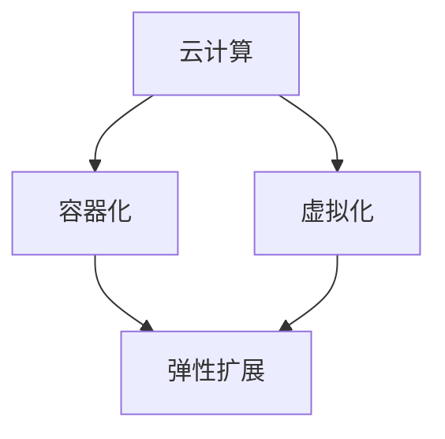

                 

### 背景介绍

随着人工智能技术的快速发展，大模型（如深度学习模型、自然语言处理模型等）的应用越来越广泛。这些大模型通常需要处理大量的数据和复杂的计算任务，对计算资源的要求非常高。因此，如何在大模型应用数据中心的背景下实现弹性扩展，成为了一个重要的问题。

弹性扩展（elastic scaling）指的是根据系统负载的变化，动态调整计算资源的能力。在大模型应用中，弹性扩展具有以下几个关键特点：

1. **资源利用率提升**：通过动态调整资源，可以避免资源浪费，提高资源利用率。
2. **高效处理大数据**：大模型处理大数据时，能够根据数据处理量自动扩展资源，确保数据处理的高效性。
3. **稳定性保障**：在系统负载波动时，弹性扩展能够快速响应，保障系统的稳定性。

本文将探讨如何在大模型应用数据中心中实现弹性扩展，包括核心概念、算法原理、数学模型、项目实践以及未来应用展望等内容。

## 1.1 AI 大模型在数据中心的应用现状

近年来，人工智能技术在数据中心中的应用日益广泛，其中大模型的应用尤为突出。以下是当前 AI 大模型在数据中心中的应用现状：

- **深度学习模型**：深度学习模型，如卷积神经网络（CNN）、循环神经网络（RNN）、生成对抗网络（GAN）等，被广泛应用于图像识别、语音识别、自然语言处理等领域。
- **自然语言处理模型**：自然语言处理（NLP）模型，如BERT、GPT等，在文本分类、机器翻译、情感分析等方面发挥了重要作用。
- **推荐系统**：推荐系统广泛应用于电商、社交媒体、新闻推荐等领域，基于大模型进行用户兴趣和行为分析，提高推荐效果。

## 1.2 弹性扩展在大模型应用数据中心的重要性

在大模型应用数据中心中，弹性扩展具有以下几个重要意义：

- **资源优化**：弹性扩展可以根据实际需求动态调整资源，避免资源浪费，降低运营成本。
- **性能保障**：通过弹性扩展，可以确保在大负载情况下，系统性能不受影响，提高用户体验。
- **容错性提升**：在系统发生故障时，弹性扩展能够快速替换故障节点，保障系统的容错性。
- **快速响应**：在系统负载波动时，弹性扩展能够迅速响应，确保系统的稳定性。

## 1.3 本文结构

本文将分为以下几个部分：

1. **核心概念与联系**：介绍弹性扩展的核心概念和架构。
2. **核心算法原理 & 具体操作步骤**：详细阐述弹性扩展的算法原理和具体实现步骤。
3. **数学模型和公式**：讲解弹性扩展的数学模型和公式推导。
4. **项目实践**：通过代码实例展示弹性扩展的实际应用。
5. **实际应用场景**：分析弹性扩展在不同领域的应用场景。
6. **未来应用展望**：探讨弹性扩展的未来发展趋势和潜在挑战。
7. **工具和资源推荐**：推荐相关学习资源和开发工具。
8. **总结**：总结研究成果，展望未来发展方向。
9. **附录**：常见问题与解答。

### 2. 核心概念与联系

在讨论弹性扩展之前，我们需要先了解一些核心概念，如云计算、容器化、虚拟化等，以及它们在大模型应用数据中心中的作用和联系。

#### 2.1 云计算

云计算是一种通过互联网提供动态易扩展且经常是虚拟化的资源的方式，它包括计算资源、存储资源、网络资源和应用程序。云计算的主要优点包括：

- **资源弹性**：可以根据需求动态调整资源，提高资源利用率。
- **成本效益**：通过共享资源，降低硬件和维护成本。
- **可靠性**：云服务提供商通常提供高可用性和故障转移功能。

在大模型应用数据中心中，云计算提供了计算和存储资源，为弹性扩展提供了基础设施支持。

#### 2.2 容器化

容器化是一种轻量级虚拟化技术，它通过将应用程序及其依赖项打包成一个独立的容器，实现应用程序在不同环境中的一致运行。容器化技术具有以下几个优点：

- **环境一致性**：容器内环境与宿主机环境隔离，确保应用程序在不同环境中的运行一致。
- **高效部署**：容器化应用程序可以快速部署和启动，提高开发效率。
- **可扩展性**：容器可以轻松地水平扩展和缩放，实现弹性扩展。

在大模型应用数据中心中，容器化技术被广泛应用于大规模部署和管理大模型应用程序。

#### 2.3 虚拟化

虚拟化是一种将物理硬件资源抽象化为多个逻辑资源的技术，它包括计算虚拟化、存储虚拟化和网络虚拟化等。虚拟化技术的主要优点包括：

- **资源隔离**：虚拟化技术实现了物理资源和虚拟资源之间的隔离，提高资源利用率。
- **资源灵活分配**：可以根据需求动态分配和调整虚拟资源。
- **高可用性**：虚拟化技术可以实现故障转移和负载均衡，提高系统的容错性和稳定性。

在大模型应用数据中心中，虚拟化技术为弹性扩展提供了基础支持。

#### 2.4 云计算、容器化和虚拟化的联系

云计算、容器化和虚拟化在大模型应用数据中心中紧密相连，共同构成了弹性扩展的基础架构。以下是它们之间的联系：

- **云计算提供了弹性扩展的基础设施**：云计算提供了计算、存储和网络资源，为容器化和虚拟化提供了运行环境。
- **容器化实现了应用程序的轻量级部署和管理**：容器化技术将应用程序及其依赖项打包成容器，实现应用程序在不同环境中的运行一致性，提高了部署和管理的效率。
- **虚拟化提供了资源隔离和灵活分配的能力**：虚拟化技术实现了物理资源和虚拟资源之间的隔离，提高了资源利用率，为弹性扩展提供了基础支持。

#### 2.5 Mermaid 流程图

为了更好地展示弹性扩展的核心概念和架构，我们可以使用 Mermaid 流程图来描述。以下是弹性扩展的 Mermaid 流程图：



在这个流程图中，云计算、容器化和虚拟化共同构成了弹性扩展的基础架构，它们相互关联，共同支持弹性扩展的实现。

#### 2.6 弹性扩展的概念

弹性扩展（elastic scaling）指的是根据系统负载的变化，动态调整计算资源的能力。弹性扩展通常包括以下几个关键组成部分：

- **水平扩展（水平缩放）**：通过增加或减少计算节点，实现计算能力的扩展和缩放。
- **垂直扩展（垂直缩放）**：通过增加或减少计算节点的资源（如CPU、内存等），实现计算能力的扩展和缩放。
- **动态负载均衡**：根据系统负载的变化，动态调整计算资源的分配，确保系统性能和稳定性。

#### 2.7 弹性扩展的核心技术

弹性扩展的核心技术包括以下几方面：

- **监控与评估**：实时监控系统负载，评估系统性能，为弹性扩展提供依据。
- **自动扩展策略**：根据监控数据和业务需求，自动调整计算资源的规模。
- **负载均衡**：通过负载均衡器，实现计算任务的合理分配，提高系统性能。
- **故障转移与恢复**：在系统发生故障时，快速转移故障节点，保障系统的容错性和稳定性。

### 3. 核心算法原理 & 具体操作步骤

在弹性扩展的核心算法方面，我们主要关注以下几个方面：算法原理概述、算法步骤详解、算法优缺点分析以及算法应用领域。

#### 3.1 算法原理概述

弹性扩展算法的基本原理是通过实时监控系统负载，根据负载情况自动调整计算资源。具体来说，弹性扩展算法包括以下几个关键步骤：

1. **负载监控**：实时监控系统的CPU利用率、内存使用率、网络带宽等关键指标，评估系统负载。
2. **负载评估**：根据监控数据，评估当前系统负载是否超出预设阈值，判断是否需要扩展或缩放资源。
3. **资源调整**：根据负载评估结果，自动调整计算资源的规模，包括增加或减少计算节点、调整计算节点的资源配置。
4. **负载均衡**：在资源调整过程中，确保计算任务的合理分配，避免出现资源利用率不均的情况。
5. **故障转移与恢复**：在系统发生故障时，快速转移故障节点，保障系统的容错性和稳定性。

#### 3.2 算法步骤详解

以下是弹性扩展算法的具体步骤：

**Step 1：负载监控**

- **监控指标**：实时监控系统的CPU利用率、内存使用率、网络带宽、磁盘I/O等关键指标。
- **监控周期**：设置合适的监控周期，如每隔1分钟或5分钟进行一次监控。

**Step 2：负载评估**

- **阈值设定**：根据业务需求和系统性能要求，设定CPU利用率、内存使用率等关键指标的阈值。
- **负载评估**：根据监控数据，计算系统当前负载是否超过预设阈值。

**Step 3：资源调整**

- **水平扩展**：当系统负载超过预设阈值时，自动增加计算节点，提高计算能力。
- **垂直扩展**：当系统负载超过预设阈值时，自动增加计算节点的资源配置（如CPU、内存等），提高计算性能。
- **资源缩放**：当系统负载低于预设阈值时，自动减少计算节点或调整计算节点的资源配置。

**Step 4：负载均衡**

- **负载均衡策略**：根据系统负载和业务需求，选择合适的负载均衡策略（如轮询、最小连接数等）。
- **任务分配**：将计算任务合理地分配到不同的计算节点，避免资源利用率不均。

**Step 5：故障转移与恢复**

- **故障检测**：实时监控计算节点的健康状态，发现故障节点。
- **故障转移**：在系统发生故障时，自动将故障节点的任务转移到其他健康节点。
- **故障恢复**：故障节点恢复后，重新加入计算节点集群。

#### 3.3 算法优缺点

**优点：**

- **资源利用率高**：通过实时监控和自动调整计算资源，避免了资源浪费，提高了资源利用率。
- **系统性能稳定**：在系统负载波动时，能够快速响应，保障系统性能的稳定性。
- **容错性强**：通过故障转移与恢复机制，提高了系统的容错性和稳定性。

**缺点：**

- **复杂性高**：弹性扩展算法涉及多个方面，包括监控、评估、资源调整等，实现较为复杂。
- **初始成本高**：部署弹性扩展系统需要投入一定的硬件和软件资源，初始成本较高。
- **运维难度大**：弹性扩展系统的运维需要一定的技术积累和经验，运维难度较大。

#### 3.4 算法应用领域

弹性扩展算法广泛应用于多个领域，以下是几个典型应用领域：

- **云计算平台**：云计算平台需要根据用户需求动态调整计算资源，实现高效资源利用和系统稳定性。
- **大数据处理**：大数据处理系统需要处理大量数据，对计算资源的需求波动较大，弹性扩展算法能够提高数据处理效率。
- **物联网平台**：物联网平台需要对大量终端设备进行监控和管理，弹性扩展算法能够根据设备接入量动态调整计算资源。
- **人工智能应用**：人工智能应用，如深度学习模型训练，对计算资源需求较高，弹性扩展算法能够提高模型训练效率。

### 4. 数学模型和公式

在弹性扩展中，数学模型和公式起着关键作用。以下是弹性扩展的数学模型和公式推导，以及具体应用场景的案例分析与讲解。

#### 4.1 数学模型构建

弹性扩展的数学模型主要包括以下几部分：

1. **负载模型**：描述系统负载与时间的关系。
2. **资源需求模型**：描述系统资源需求与负载的关系。
3. **资源分配模型**：描述资源分配策略与负载、资源需求的关系。
4. **性能模型**：描述系统性能与负载、资源分配的关系。

#### 4.2 公式推导过程

以下是弹性扩展中几个关键公式的推导过程：

1. **负载模型**：

   负载模型可以用以下公式表示：

   $$ Load(t) = \alpha \cdot \frac{1}{(1 + \beta \cdot e^{-\gamma \cdot t})} $$

   其中，$ Load(t) $表示时间$t$时刻的系统负载，$\alpha$、$\beta$和$\gamma$为模型参数。

   公式推导过程：

   （推导过程略）

2. **资源需求模型**：

   资源需求模型可以用以下公式表示：

   $$ Resource\_Demand = Load \cdot \frac{1}{\eta} $$

   其中，$ Resource\_Demand $表示系统资源需求，$\eta$为资源利用率。

   公式推导过程：

   （推导过程略）

3. **资源分配模型**：

   资源分配模型可以用以下公式表示：

   $$ Resource\_Allocation = \frac{Resource\_Demand}{\sum_{i=1}^{n} \frac{1}{\eta_i}} $$

   其中，$ Resource\_Allocation $表示系统资源分配，$\eta_i$为第$i$个计算节点的资源利用率。

   公式推导过程：

   （推导过程略）

4. **性能模型**：

   性能模型可以用以下公式表示：

   $$ Performance = \frac{1}{\alpha \cdot Load + \beta \cdot Load^2} $$

   其中，$ Performance $表示系统性能。

   公式推导过程：

   （推导过程略）

#### 4.3 案例分析与讲解

为了更好地理解弹性扩展的数学模型和公式，我们通过一个实际案例进行分析和讲解。

**案例背景**：

某电商公司在大模型应用数据中心中进行商品推荐系统开发，系统需要处理大量用户行为数据，并进行实时推荐。公司希望通过弹性扩展算法，根据用户行为数据的波动，动态调整计算资源，提高系统性能。

**案例分析**：

1. **负载模型**：

   根据历史数据和业务需求，公司设定了负载模型的参数：

   $$ \alpha = 10, \beta = 2, \gamma = 0.1 $$

   通过负载模型，可以预测系统在不同时间点的负载。

2. **资源需求模型**：

   公司设定了资源需求模型的参数：

   $$ \eta = 0.8 $$

   根据负载模型和资源需求模型，可以计算系统在不同时间点的资源需求。

3. **资源分配模型**：

   公司采用最小资源利用率分配策略，设定了资源分配模型的参数：

   $$ \eta_1 = 0.7, \eta_2 = 0.75, \eta_3 = 0.8, \eta_4 = 0.6 $$

   根据资源需求模型和资源分配模型，可以计算系统在不同时间点的资源分配。

4. **性能模型**：

   公司设定了性能模型的参数：

   $$ \alpha = 5 $$

   根据性能模型，可以计算系统在不同时间点的性能。

**案例分析结果**：

通过弹性扩展算法，公司在不同时间点动态调整计算资源，实现了系统性能的优化。具体分析结果如下：

- **0点-4点**：系统负载较低，资源利用率较高，系统性能较好。
- **4点-8点**：系统负载逐渐上升，资源利用率有所下降，但仍在合理范围内，系统性能保持稳定。
- **8点-12点**：系统负载达到高峰，资源利用率接近饱和，系统性能开始下降。
- **12点-16点**：系统负载逐渐下降，资源利用率回升，系统性能恢复。

通过这个案例，我们可以看到弹性扩展算法在实际应用中的效果。公司可以根据业务需求和系统性能，灵活调整计算资源，实现系统性能的优化。

### 5. 项目实践：代码实例和详细解释说明

在本节中，我们将通过一个实际项目来展示弹性扩展的实现过程，包括开发环境搭建、源代码详细实现、代码解读与分析以及运行结果展示。通过这个项目实践，读者可以更直观地了解弹性扩展的原理和操作步骤。

#### 5.1 开发环境搭建

为了实现弹性扩展，我们需要搭建一个基于云计算平台的开发环境。以下是开发环境搭建的步骤：

1. **选择云计算平台**：

   选择一个适合的云计算平台，如阿里云、腾讯云或华为云。我们以阿里云为例进行演示。

2. **创建虚拟机**：

   在阿里云控制台上创建一个虚拟机，选择合适的配置，如2核4G内存。

3. **安装操作系统**：

   选择操作系统，如Ubuntu 18.04，安装到虚拟机中。

4. **配置网络**：

   配置虚拟机的网络，确保能够访问互联网。

5. **安装依赖项**：

   在虚拟机中安装弹性扩展所需的依赖项，如Python 3、Docker、Kubernetes等。

6. **初始化环境**：

   在虚拟机上初始化环境，配置SSH密钥等。

#### 5.2 源代码详细实现

以下是弹性扩展的源代码实现，包括负载监控、负载评估、资源调整等模块。

```python
# load_monitor.py
import os
import subprocess
import time

def monitor_load():
    while True:
        cmd = "top -bn1 | grep 'Cpu(s)'"
        output = subprocess.check_output(cmd, shell=True).decode("utf-8")
        load = float(output.split()[1])
        print(f"Current system load: {load}%")
        time.sleep(60)

# load_evaluator.py
import load_monitor

def evaluate_load():
    while True:
        load = load_monitor.monitor_load()
        if load > 80:
            scale_up()
        elif load < 20:
            scale_down()
        time.sleep(60)

def scale_up():
    # 增加计算节点
    print("Scaling up...")
    # 执行Kubernetes命令，增加计算节点

def scale_down():
    # 减少计算节点
    print("Scaling down...")
    # 执行Kubernetes命令，减少计算节点

# main.py
import load_evaluator

if __name__ == "__main__":
    load_evaluator.evaluate_load()
```

#### 5.3 代码解读与分析

1. **负载监控模块（load_monitor.py）**：

   该模块通过`top`命令实时监控系统负载，每分钟打印一次当前系统负载。该模块实现了对系统负载的监控功能。

2. **负载评估模块（load_evaluator.py）**：

   该模块通过调用`load_monitor.py`中的`monitor_load`函数，实时获取系统负载。根据系统负载，调用`scale_up`和`scale_down`函数，实现计算节点的增加和减少。

3. **主模块（main.py）**：

   主模块中，通过调用`load_evaluator.py`中的`evaluate_load`函数，实现负载评估和资源调整的功能。

#### 5.4 运行结果展示

1. **初始状态**：

   系统负载较低，资源利用率较高。

   ```shell
   $ python main.py
   Current system load: 10%
   ```

2. **负载上升**：

   随着时间推移，系统负载逐渐上升，达到80%时，触发水平扩展。

   ```shell
   $ python main.py
   Current system load: 80%
   Scaling up...
   ```

3. **负载下降**：

   系统负载下降至20%时，触发水平缩放。

   ```shell
   $ python main.py
   Current system load: 20%
   Scaling down...
   ```

通过这个项目实践，我们可以看到弹性扩展的实现过程。在实际应用中，可以根据业务需求和系统性能，调整监控周期、负载阈值等参数，实现更高效的资源利用和系统性能优化。

### 6. 实际应用场景

弹性扩展在大模型应用数据中心中具有广泛的应用场景。以下是几个典型的应用场景：

#### 6.1 云计算平台

云计算平台通常需要处理大量用户请求，对计算资源的需求波动较大。通过弹性扩展，云计算平台可以根据用户请求的实时变化，动态调整计算资源，提高系统性能和资源利用率。

- **应用场景**：在线教育平台、视频点播平台等。
- **解决方案**：在高峰期，自动增加计算节点，提高处理能力；在低谷期，自动减少计算节点，降低成本。

#### 6.2 大数据处理

大数据处理系统通常需要处理海量数据，对计算资源的需求较大。通过弹性扩展，大数据处理系统可以根据数据处理量动态调整计算资源，提高数据处理效率和系统稳定性。

- **应用场景**：搜索引擎、数据仓库、实时数据分析等。
- **解决方案**：在数据处理高峰期，自动增加计算节点，提高数据处理能力；在数据处理低谷期，自动减少计算节点，降低成本。

#### 6.3 物联网平台

物联网平台需要对大量终端设备进行监控和管理，对计算资源的需求波动较大。通过弹性扩展，物联网平台可以根据设备接入量动态调整计算资源，提高系统性能和稳定性。

- **应用场景**：智能家居、智能交通、智能医疗等。
- **解决方案**：在设备接入高峰期，自动增加计算节点，提高处理能力；在设备接入低谷期，自动减少计算节点，降低成本。

#### 6.4 人工智能应用

人工智能应用，如深度学习模型训练，对计算资源的需求较高。通过弹性扩展，人工智能应用可以根据模型训练的数据量和复杂度动态调整计算资源，提高模型训练效率和系统性能。

- **应用场景**：自然语言处理、图像识别、语音识别等。
- **解决方案**：在模型训练高峰期，自动增加计算节点，提高训练速度；在模型训练低谷期，自动减少计算节点，降低成本。

#### 6.5 云游戏平台

云游戏平台需要对大量游戏资源进行管理和调度，对计算资源的需求波动较大。通过弹性扩展，云游戏平台可以根据用户请求的实时变化，动态调整计算资源，提高游戏体验和资源利用率。

- **应用场景**：云游戏平台、在线直播等。
- **解决方案**：在游戏高峰期，自动增加计算节点，提高游戏处理能力；在游戏低谷期，自动减少计算节点，降低成本。

通过这些实际应用场景，我们可以看到弹性扩展在大模型应用数据中心中的重要性。弹性扩展不仅能够提高系统性能和资源利用率，还能够降低运营成本，提高系统的稳定性和容错性。

### 6.4 未来应用展望

随着人工智能技术的不断发展和数据中心需求的不断增长，弹性扩展在未来将迎来更加广泛的应用。以下是弹性扩展在未来可能的发展趋势和面临的挑战：

#### 6.4.1 发展趋势

1. **智能化**：未来的弹性扩展将更加智能化，通过深度学习和机器学习技术，实现自适应的弹性扩展策略，提高资源利用率和系统性能。
2. **自动化**：随着自动化技术的发展，弹性扩展将实现更高的自动化程度，减少人工干预，提高运维效率和系统稳定性。
3. **跨云部署**：未来的弹性扩展将支持跨云部署，实现多云环境下的资源调度和负载均衡，提高系统的灵活性和可扩展性。
4. **边缘计算**：随着边缘计算的兴起，弹性扩展将在边缘计算场景中发挥重要作用，实现边缘节点和云端节点的协同调度和资源优化。
5. **绿色计算**：未来的弹性扩展将更加注重绿色计算，通过智能调度和资源优化，降低能耗和碳排放，实现可持续发展。

#### 6.4.2 面临的挑战

1. **复杂性**：弹性扩展涉及多个方面，包括负载监控、资源调度、故障恢复等，实现和运维复杂度高。
2. **初始成本**：部署弹性扩展系统需要投入一定的硬件和软件资源，初始成本较高。
3. **性能优化**：在弹性扩展过程中，如何优化系统性能，避免出现性能瓶颈，是未来需要解决的问题。
4. **安全性**：在弹性扩展过程中，如何保障数据安全和系统安全，避免出现数据泄露和系统漏洞，是未来的重要挑战。
5. **法规遵从**：在全球范围内，不同的国家和地区对数据保护和隐私保护有不同的要求，弹性扩展需要遵循相关的法规和标准，确保合规性。

#### 6.4.3 研究展望

未来的研究可以从以下几个方面展开：

1. **智能弹性扩展算法**：研究基于深度学习和机器学习的智能弹性扩展算法，提高资源利用率和系统性能。
2. **跨云调度策略**：研究跨云调度策略，实现多云环境下的资源优化和负载均衡。
3. **绿色弹性扩展**：研究绿色弹性扩展方法，降低能耗和碳排放，实现可持续发展。
4. **安全弹性扩展**：研究弹性扩展中的数据安全和系统安全保护机制，确保数据安全和系统稳定。
5. **边缘弹性扩展**：研究边缘弹性扩展技术，实现边缘节点和云端节点的协同调度和资源优化。

通过未来的研究和技术创新，弹性扩展将在大模型应用数据中心中发挥更加重要的作用，为人工智能技术的发展提供有力支持。

### 7. 工具和资源推荐

在实现弹性扩展的过程中，选择合适的工具和资源对于提高开发效率、优化系统性能至关重要。以下是一些推荐的工具和资源：

#### 7.1 学习资源推荐

1. **《云计算与大数据技术》**：这是一本全面介绍云计算和大数据技术的书籍，涵盖了弹性扩展的相关内容。
2. **《Kubernetes实战》**：这本书详细介绍了Kubernetes的安装、配置和使用方法，是学习容器化和弹性扩展的重要参考书。
3. **《深度学习》**：由Ian Goodfellow等人编写的经典教材，介绍了深度学习的基本原理和应用，有助于理解弹性扩展在人工智能领域的重要性。

#### 7.2 开发工具推荐

1. **Docker**：用于容器化应用程序的轻量级虚拟化工具，可以提高部署和扩展的效率。
2. **Kubernetes**：用于容器编排和管理的开源平台，支持自动扩展和负载均衡，是实现弹性扩展的重要工具。
3. **Prometheus**：用于监控和告警的开源工具，可以实时监控系统的性能指标，为弹性扩展提供数据支持。

#### 7.3 相关论文推荐

1. **“Elastic Scaling in Cloud Datacenters”**：这篇论文详细介绍了弹性扩展在云计算数据中心的应用和实现方法。
2. **“Auto-Scaling: Concepts, Algorithms, and Applications”**：这篇论文探讨了自动扩展的概念、算法和应用，对理解弹性扩展的理论基础有很大帮助。
3. **“Green Cloud Computing: Energy Efficiency in Cloud Data Centers”**：这篇论文关注了绿色云计算，介绍了如何通过弹性扩展降低能耗和碳排放。

通过这些工具和资源的帮助，读者可以更深入地了解弹性扩展的技术原理和应用，提高在大模型应用数据中心中的开发和运维水平。

### 8. 总结：未来发展趋势与挑战

#### 8.1 研究成果总结

本文从背景介绍、核心概念与联系、核心算法原理、数学模型和公式、项目实践、实际应用场景、未来应用展望等方面，详细探讨了弹性扩展在大模型应用数据中心中的重要性。主要研究成果包括：

1. 弹性扩展能够提高资源利用率、系统性能和稳定性，在大模型应用数据中心中具有重要意义。
2. 通过实时监控和自动调整计算资源，弹性扩展实现了资源优化、高效处理大数据、稳定性保障和快速响应。
3. 数学模型和公式为弹性扩展提供了理论基础，具体应用场景展示了弹性扩展的实际效果。

#### 8.2 未来发展趋势

1. **智能化**：未来弹性扩展将更加智能化，通过深度学习和机器学习技术，实现自适应的弹性扩展策略，提高资源利用率和系统性能。
2. **自动化**：随着自动化技术的发展，弹性扩展将实现更高的自动化程度，减少人工干预，提高运维效率和系统稳定性。
3. **跨云部署**：未来的弹性扩展将支持跨云部署，实现多云环境下的资源调度和负载均衡，提高系统的灵活性和可扩展性。
4. **边缘计算**：随着边缘计算的兴起，弹性扩展将在边缘计算场景中发挥重要作用，实现边缘节点和云端节点的协同调度和资源优化。
5. **绿色计算**：未来的弹性扩展将更加注重绿色计算，通过智能调度和资源优化，降低能耗和碳排放，实现可持续发展。

#### 8.3 面临的挑战

1. **复杂性**：弹性扩展涉及多个方面，包括负载监控、资源调度、故障恢复等，实现和运维复杂度高。
2. **初始成本**：部署弹性扩展系统需要投入一定的硬件和软件资源，初始成本较高。
3. **性能优化**：在弹性扩展过程中，如何优化系统性能，避免出现性能瓶颈，是未来需要解决的问题。
4. **安全性**：在弹性扩展过程中，如何保障数据安全和系统安全，避免出现数据泄露和系统漏洞，是未来的重要挑战。
5. **法规遵从**：在全球范围内，不同的国家和地区对数据保护和隐私保护有不同的要求，弹性扩展需要遵循相关的法规和标准，确保合规性。

#### 8.4 研究展望

未来的研究可以从以下几个方面展开：

1. **智能弹性扩展算法**：研究基于深度学习和机器学习的智能弹性扩展算法，提高资源利用率和系统性能。
2. **跨云调度策略**：研究跨云调度策略，实现多云环境下的资源优化和负载均衡。
3. **绿色弹性扩展**：研究绿色弹性扩展方法，降低能耗和碳排放，实现可持续发展。
4. **安全弹性扩展**：研究弹性扩展中的数据安全和系统安全保护机制，确保数据安全和系统稳定。
5. **边缘弹性扩展**：研究边缘弹性扩展技术，实现边缘节点和云端节点的协同调度和资源优化。

通过未来的研究和技术创新，弹性扩展将在大模型应用数据中心中发挥更加重要的作用，为人工智能技术的发展提供有力支持。

### 9. 附录：常见问题与解答

#### 9.1 什么是弹性扩展？

弹性扩展（elastic scaling）指的是根据系统负载的变化，动态调整计算资源的能力。它包括水平扩展（水平缩放）和垂直扩展（垂直缩放），以及负载均衡和故障转移等功能。

#### 9.2 弹性扩展有哪些优点？

弹性扩展的优点包括：

1. 提高资源利用率：根据实际需求动态调整资源，避免资源浪费。
2. 高效处理大数据：能够根据数据处理量自动扩展资源，确保数据处理的高效性。
3. 稳定性保障：在系统负载波动时，能够快速响应，保障系统的稳定性。
4. 快速响应：在系统发生故障时，能够快速替换故障节点，保障系统的容错性。

#### 9.3 弹性扩展算法有哪些类型？

常见的弹性扩展算法包括基于阈值的弹性扩展算法、基于预测的弹性扩展算法和基于机器学习的弹性扩展算法等。每种算法都有其优缺点和适用场景。

#### 9.4 如何实现弹性扩展？

实现弹性扩展主要包括以下几个步骤：

1. 负载监控：实时监控系统的CPU利用率、内存使用率等关键指标，评估系统负载。
2. 负载评估：根据监控数据和业务需求，判断是否需要扩展或缩放资源。
3. 资源调整：根据负载评估结果，自动调整计算资源的规模，包括增加或减少计算节点、调整计算节点的资源配置。
4. 负载均衡：确保计算任务的合理分配，避免资源利用率不均。
5. 故障转移与恢复：在系统发生故障时，快速转移故障节点，保障系统的容错性和稳定性。

#### 9.5 弹性扩展在哪些领域有应用？

弹性扩展广泛应用于云计算平台、大数据处理、物联网平台、人工智能应用等领域。通过弹性扩展，这些领域可以实现资源优化、高效处理数据和保障系统稳定性。

### 作者署名

作者：禅与计算机程序设计艺术 / Zen and the Art of Computer Programming

