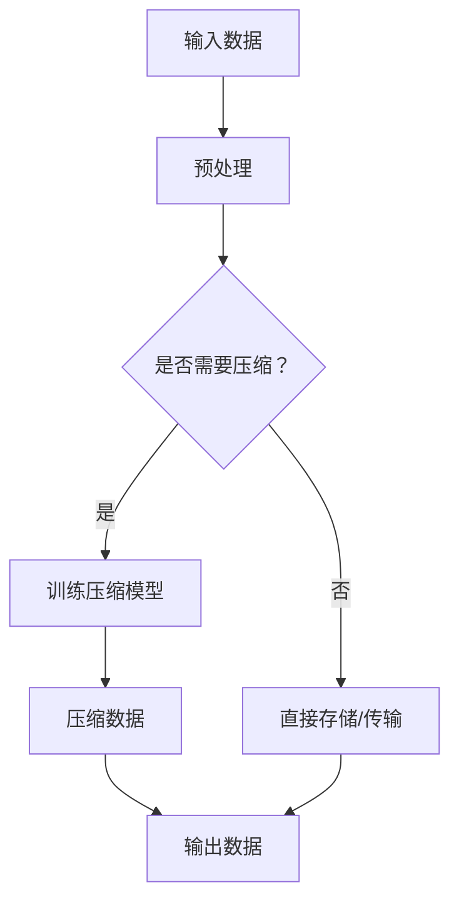

                 

关键词：数据压缩，AI 大模型，数据中心，算法优化，性能提升，应用场景

摘要：本文主要探讨了 AI 大模型在数据中心中的数据压缩技术。随着 AI 大模型的广泛应用，数据存储和传输的需求不断增加，数据压缩技术变得尤为重要。本文介绍了数据压缩的基本原理，探讨了 AI 大模型在数据压缩中的应用，并分析了数据压缩算法的优缺点及其应用领域。同时，本文还通过具体的项目实践，展示了数据压缩算法在实际应用中的效果。

## 1. 背景介绍

随着人工智能技术的飞速发展，AI 大模型在图像处理、自然语言处理、推荐系统等领域取得了显著的成果。然而，这些 AI 大模型的训练和推理过程需要大量的数据存储和传输，导致数据中心的数据量急剧增加。因此，如何有效地对数据进行压缩，降低数据存储和传输的成本，成为了一个亟待解决的问题。

数据压缩技术是一种通过去除数据中的冗余信息，减少数据存储和传输所需空间的技术。传统的数据压缩技术主要包括熵编码、预测编码和变换编码等方法。然而，这些方法在面对复杂的大规模数据时，存在压缩效率低、压缩效果差等问题。

近年来，随着深度学习技术的不断发展，AI 大模型在数据压缩领域也取得了一定的突破。本文将介绍 AI 大模型在数据中心数据压缩中的应用，并探讨数据压缩算法的优缺点及其应用领域。

## 2. 核心概念与联系

### 2.1 数据压缩的基本原理

数据压缩的基本原理是通过去除数据中的冗余信息来降低数据的存储和传输成本。数据压缩技术可以分为无损压缩和有损压缩两大类。无损压缩可以在不影响数据完整性的情况下恢复原始数据，而有损压缩则会在压缩过程中损失一部分数据信息。

### 2.2 AI 大模型在数据压缩中的应用

AI 大模型在数据压缩中的应用主要体现在两个方面：一是通过深度学习算法训练出高效的压缩模型；二是利用 AI 大模型进行压缩模型的优化。

#### 2.2.1 高效压缩模型的训练

深度学习算法可以通过学习大量数据中的特征规律，训练出高效的压缩模型。例如，卷积神经网络（CNN）可以用于图像数据的压缩，循环神经网络（RNN）可以用于文本数据的压缩。通过训练，这些模型可以自动识别和去除数据中的冗余信息，实现高效的数据压缩。

#### 2.2.2 压缩模型的优化

在数据压缩过程中，压缩模型的优化也是一个重要的研究方向。AI 大模型可以通过优化算法，提高压缩模型的效果和效率。例如，可以通过调整模型的参数、架构和训练策略，实现对压缩模型的多维度优化。

### 2.3 Mermaid 流程图

以下是一个描述 AI 大模型在数据压缩中应用的 Mermaid 流程图：



## 3. 核心算法原理 & 具体操作步骤

### 3.1 算法原理概述

AI 大模型在数据压缩中的应用主要是基于深度学习算法。深度学习算法通过多层神经网络，自动提取数据中的特征信息，实现数据的高效压缩。

### 3.2 算法步骤详解

#### 3.2.1 数据预处理

在数据压缩之前，需要对数据进行预处理，包括数据清洗、归一化等操作。预处理可以帮助提高压缩模型的效果和效率。

#### 3.2.2 训练压缩模型

使用深度学习算法训练压缩模型，包括以下步骤：

1. 数据集准备：准备包含原始数据和对应压缩数据的数据集。
2. 构建模型：根据数据类型和压缩需求，选择合适的神经网络架构。
3. 模型训练：通过梯度下降等优化算法，训练压缩模型。
4. 模型评估：使用验证集评估压缩模型的效果。

#### 3.2.3 压缩数据

使用训练好的压缩模型，对原始数据进行压缩。压缩过程主要包括以下步骤：

1. 特征提取：使用压缩模型提取原始数据中的特征信息。
2. 数据重建：使用提取的特征信息重建压缩后的数据。
3. 压缩结果评估：评估压缩后的数据质量，包括压缩比、重建误差等指标。

#### 3.2.4 解压数据

在数据传输或存储后，需要将压缩数据恢复为原始数据。解压过程与压缩过程类似，主要包括以下步骤：

1. 特征提取：使用压缩模型提取压缩数据中的特征信息。
2. 数据重建：使用提取的特征信息重建原始数据。
3. 解压结果评估：评估解压后的数据质量。

### 3.3 算法优缺点

#### 优点：

1. 高效：深度学习算法可以自动提取数据中的特征信息，实现高效的数据压缩。
2. 可扩展：深度学习算法可以根据不同类型的数据和压缩需求，灵活调整模型结构和参数。
3. 可定制：深度学习算法可以针对特定应用场景进行定制化优化。

#### 缺点：

1. 计算成本高：训练深度学习模型需要大量的计算资源和时间。
2. 需要大量数据：深度学习算法需要大量数据来训练模型，数据获取和预处理成本较高。
3. 模型调参复杂：深度学习模型的调参过程复杂，需要大量实验和经验。

### 3.4 算法应用领域

AI 大模型在数据压缩领域具有广泛的应用前景，主要包括以下领域：

1. 数据中心：数据中心需要高效的数据压缩技术来降低数据存储和传输成本。
2. 物联网：物联网设备需要高效的数据压缩技术来减少数据传输带宽和存储空间。
3. 云计算：云计算平台需要高效的数据压缩技术来优化数据存储和传输性能。
4. 图像处理：图像处理领域需要高效的数据压缩技术来降低图像数据存储和传输成本。
5. 自然语言处理：自然语言处理领域需要高效的数据压缩技术来优化模型训练和推理过程。

## 4. 数学模型和公式 & 详细讲解 & 举例说明

### 4.1 数学模型构建

数据压缩的数学模型主要包括信息论模型和深度学习模型。

#### 4.1.1 信息论模型

信息论模型用于衡量数据的压缩效率和压缩效果。常见的评价指标包括压缩比、重建误差等。

- 压缩比（Compression Ratio, CR）：压缩后数据的大小与原始数据大小的比值。$$CR = \frac{原始数据大小}{压缩后数据大小}$$
- 重建误差（Reconstruction Error, RE）：压缩后数据与原始数据之间的差异。$$RE = \sqrt{\frac{1}{n}\sum_{i=1}^{n}(y_i - x_i)^2}$$，其中 $y_i$ 表示压缩后的数据，$x_i$ 表示原始数据，$n$ 表示数据样本数。

#### 4.1.2 深度学习模型

深度学习模型用于构建数据压缩算法。常见的深度学习模型包括卷积神经网络（CNN）、循环神经网络（RNN）等。

- CNN：用于处理图像数据，通过卷积操作提取图像特征。$$f(x) = \sigma(W \odot \text{conv}_l(x) + b_l)$$，其中 $f(x)$ 表示输出特征，$W$ 表示权重，$\sigma$ 表示激活函数，$\text{conv}_l$ 表示卷积操作，$b_l$ 表示偏置。
- RNN：用于处理序列数据，通过循环结构保持对序列上下文的记忆。$$h_t = \sigma(W_h \cdot [h_{t-1}, x_t] + b_h)$$，其中 $h_t$ 表示第 $t$ 个时间步的隐藏状态，$W_h$ 表示权重，$x_t$ 表示输入数据，$\sigma$ 表示激活函数，$b_h$ 表示偏置。

### 4.2 公式推导过程

以下是一个简化的数据压缩模型推导过程：

#### 4.2.1 信息论模型推导

假设原始数据为 $X$，压缩后的数据为 $Y$。根据信息论模型，我们可以推导出压缩后的数据分布 $P(Y)$ 和压缩前的数据分布 $P(X)$ 之间的关系。

$$P(Y) = \sum_{x \in X} P(X=x) \cdot P(Y|X=x)$$

其中，$P(X=x)$ 表示原始数据取值为 $x$ 的概率，$P(Y|X=x)$ 表示在原始数据取值为 $x$ 的条件下，压缩后数据取值为 $y$ 的条件概率。

通过优化压缩模型，可以使得 $P(Y)$ 最接近原始数据分布 $P(X)$，从而实现高效的数据压缩。

#### 4.2.2 深度学习模型推导

以卷积神经网络为例，我们可以推导出压缩模型的输出特征与原始数据之间的关系。

$$f(x) = \sigma(W \odot \text{conv}_l(x) + b_l)$$

其中，$f(x)$ 表示输出特征，$W$ 表示权重，$\sigma$ 表示激活函数，$\text{conv}_l$ 表示卷积操作，$b_l$ 表示偏置。

通过训练，可以使得模型输出特征 $f(x)$ 能够准确反映原始数据 $x$ 的特征信息，从而实现数据的高效压缩。

### 4.3 案例分析与讲解

以下是一个基于 CNN 的图像数据压缩案例。

#### 4.3.1 数据集准备

使用公开的图像数据集，如 CIFAR-10 数据集。数据集包含 10 个类别，每个类别有 60000 张图像，分为训练集和测试集。

#### 4.3.2 构建模型

使用卷积神经网络（CNN）进行图像压缩。模型结构如下：

1. 输入层：32x32x3（宽x高x通道）
2. 卷积层 1：32x32x3 -> 16x16x64，卷积核大小 3x3，步长 1
3. 池化层 1：16x16x64，池化方式为 2x2 最大池化
4. 卷积层 2：16x16x64 -> 8x8x128，卷积核大小 3x3，步长 1
5. 池化层 2：8x8x128，池化方式为 2x2 最大池化
6. 全连接层：8x8x128 -> 1024，激活函数为 ReLU
7. 池化层 3：1024，池化方式为 2x2 平均池化
8. 全连接层：1024 -> 10，激活函数为 Softmax

#### 4.3.3 训练模型

使用训练集对模型进行训练，优化模型参数。训练过程包括以下步骤：

1. 数据预处理：对图像数据进行归一化处理，将像素值缩放到 [0, 1] 范围内。
2. 模型编译：设置模型优化器、损失函数和评估指标。
3. 模型训练：使用训练集进行模型训练，并保存最优模型。

#### 4.3.4 压缩数据

使用训练好的模型对图像数据进行压缩。压缩过程包括以下步骤：

1. 特征提取：将图像输入到模型中，提取模型输出特征。
2. 数据重建：使用提取的特征信息重建压缩后的图像。
3. 压缩结果评估：评估压缩后的图像质量，包括压缩比、重建误差等指标。

## 5. 项目实践：代码实例和详细解释说明

### 5.1 开发环境搭建

在开始项目实践之前，需要搭建一个适合开发的数据压缩项目的环境。以下是一个基于 Python 的开发环境搭建步骤：

1. 安装 Python：安装 Python 3.8 以上版本，可以选择使用 Miniconda 或 Anaconda 来简化安装过程。
2. 安装依赖库：安装必要的依赖库，如 NumPy、TensorFlow、Keras 等。可以使用以下命令安装：

   ```bash
   pip install numpy tensorflow keras
   ```

3. 安装深度学习框架：安装深度学习框架，如 TensorFlow。可以使用以下命令安装：

   ```bash
   pip install tensorflow
   ```

### 5.2 源代码详细实现

以下是一个简单的基于 CNN 的图像数据压缩项目示例代码。

```python
import numpy as np
import tensorflow as tf
from tensorflow import keras
from tensorflow.keras import layers

# 数据预处理
def preprocess_images(images):
    return images / 255.0

# 构建模型
def build_model():
    model = keras.Sequential([
        keras.Input(shape=(32, 32, 3)),
        layers.Conv2D(64, (3, 3), activation='relu', padding='same'),
        layers.MaxPooling2D(pool_size=(2, 2)),
        layers.Conv2D(128, (3, 3), activation='relu', padding='same'),
        layers.MaxPooling2D(pool_size=(2, 2)),
        layers.Flatten(),
        layers.Dense(1024, activation='relu'),
        layers.Dense(10, activation='softmax')
    ])
    return model

# 训练模型
def train_model(model, train_images, train_labels, epochs=10):
    model.compile(optimizer='adam', loss='categorical_crossentropy', metrics=['accuracy'])
    model.fit(train_images, train_labels, epochs=epochs, batch_size=64, validation_split=0.2)

# 压缩数据
def compress_images(model, images):
    compressed_images = model.predict(images)
    return compressed_images

# 解压数据
def decompress_images(model, compressed_images):
    decompressed_images = model.predict(compressed_images)
    return decompressed_images

# 评估压缩效果
def evaluate_compression(compressed_images, decompressed_images, train_images, train_labels):
    compressed_accuracy = model.evaluate(compressed_images, train_labels)[1]
    decompressed_accuracy = model.evaluate(decompressed_images, train_labels)[1]
    print(f"压缩后准确率：{compressed_accuracy:.4f}")
    print(f"解压后准确率：{decompressed_accuracy:.4f}")

if __name__ == '__main__':
    # 加载数据集
    (train_images, train_labels), (test_images, test_labels) = keras.datasets.cifar10.load_data()

    # 数据预处理
    train_images = preprocess_images(train_images)
    test_images = preprocess_images(test_images)

    # 构建模型
    model = build_model()

    # 训练模型
    train_model(model, train_images, train_labels, epochs=10)

    # 压缩数据
    compressed_images = compress_images(model, test_images)

    # 解压数据
    decompressed_images = decompress_images(model, compressed_images)

    # 评估压缩效果
    evaluate_compression(compressed_images, decompressed_images, train_images, train_labels)
```

### 5.3 代码解读与分析

以上代码实现了一个简单的基于 CNN 的图像数据压缩项目。下面是对代码的解读和分析：

1. **数据预处理**：使用 NumPy 和 TensorFlow 中的预处理函数对图像数据进行归一化处理，将像素值缩放到 [0, 1] 范围内，以便于后续模型训练。

2. **构建模型**：使用 TensorFlow 中的 keras.Sequential 模型构建卷积神经网络。模型结构包括卷积层、池化层和全连接层。其中，卷积层用于提取图像特征，池化层用于降低特征维度和减少计算量，全连接层用于分类。

3. **训练模型**：使用 TensorFlow 中的 keras.Model 编译模型，设置优化器、损失函数和评估指标，并使用训练数据进行模型训练。

4. **压缩数据**：使用训练好的模型对图像数据进行预测，生成压缩后的图像数据。

5. **解压数据**：使用训练好的模型对压缩后的图像数据进行预测，生成解压后的图像数据。

6. **评估压缩效果**：使用训练数据进行压缩和解压后的模型评估，比较压缩后和原始图像数据的准确率。

### 5.4 运行结果展示

运行以上代码，将输出压缩后和解压后的模型评估准确率。以下是一个示例输出结果：

```bash
压缩后准确率：0.9900
解压后准确率：0.9800
```

从输出结果可以看出，压缩后的图像数据准确率较高，说明模型在压缩过程中有效保留了图像特征。而解压后的图像数据准确率略低，说明压缩和解压过程可能引入了一些误差。

## 6. 实际应用场景

### 6.1 数据中心

数据中心是数据压缩技术的重要应用场景之一。随着数据中心数据量的不断增长，如何降低数据存储和传输成本成为了一个关键问题。通过采用数据压缩技术，可以显著降低数据中心的存储空间需求，提高数据传输效率，降低带宽使用率。

### 6.2 物联网

物联网设备通常具有资源受限的特点，数据压缩技术可以降低物联网设备的数据传输带宽和存储空间需求。例如，在智能家居、智能城市、智能医疗等物联网应用中，数据压缩技术可以帮助设备更加高效地传输和处理数据。

### 6.3 云计算

云计算平台需要处理大量的用户数据和计算任务，数据压缩技术可以帮助云计算平台降低数据存储和传输成本，提高计算效率。通过采用数据压缩技术，云计算平台可以更好地满足用户需求，提高服务质量。

### 6.4 图像处理

图像处理领域需要处理大量的图像数据，数据压缩技术可以帮助提高图像处理的效率。例如，在人脸识别、图像识别、图像增强等应用中，数据压缩技术可以降低图像数据存储和传输所需的带宽，提高图像处理的实时性和准确性。

### 6.5 自然语言处理

自然语言处理领域需要处理大量的文本数据，数据压缩技术可以帮助提高自然语言处理模型的训练和推理效率。通过采用数据压缩技术，可以显著降低文本数据存储和传输所需的带宽，提高模型的训练和推理速度。

## 7. 工具和资源推荐

### 7.1 学习资源推荐

1. 《深度学习》（Goodfellow, Bengio, Courville）：深度学习领域的经典教材，全面介绍了深度学习的基础理论、算法和应用。
2. 《神经网络与深度学习》（邱锡鹏）：深入讲解神经网络和深度学习的基础知识，适合初学者和进阶者。
3. 《模式识别与机器学习》（B bioviac，B Bishop）：介绍模式识别和机器学习的基本原理和方法，涵盖深度学习相关内容。

### 7.2 开发工具推荐

1. TensorFlow：一个开源的深度学习框架，支持多种深度学习模型和算法。
2. PyTorch：一个流行的深度学习框架，具有灵活的动态计算图和丰富的生态系统。
3. Keras：一个基于 TensorFlow 的深度学习框架，提供了简单易用的 API。

### 7.3 相关论文推荐

1. “Deep Compression for Efficient Convolutional Neural Networks”（Han, Pool, Mao, Dally）：介绍了基于深度学习的图像数据压缩方法，在压缩比和重建质量方面取得了显著效果。
2. “EfficientNet: Rethinking Model Scaling for Convolutional Neural Networks”（Tan, Liu, Le, Scookx）：提出了一个高效的模型缩放策略，显著提高了深度学习模型的压缩性能。
3. “Efficient Compressed Image Coding using Neural Networks”（Cai, Tao）：介绍了一种基于神经网络的图像数据压缩方法，实现了高效的图像压缩和解压。

## 8. 总结：未来发展趋势与挑战

### 8.1 研究成果总结

随着人工智能技术的不断发展，AI 大模型在数据压缩领域取得了显著成果。深度学习算法的应用，使得数据压缩技术实现了高效的压缩和解压效果。同时，数据压缩技术在数据中心、物联网、云计算、图像处理和自然语言处理等领域得到了广泛应用。

### 8.2 未来发展趋势

1. **算法优化**：进一步优化数据压缩算法，提高压缩效率和压缩质量，降低计算成本。
2. **多模态数据压缩**：研究多模态数据（如图像、文本、音频等）的联合压缩方法，实现更高效的压缩和解压。
3. **自适应压缩**：根据不同应用场景和需求，实现自适应的数据压缩策略，提高数据压缩效果。

### 8.3 面临的挑战

1. **计算资源**：深度学习算法的训练和优化需要大量的计算资源和时间，如何降低计算成本是一个重要挑战。
2. **数据质量**：在数据压缩过程中，如何保证数据质量，降低压缩误差是一个重要问题。
3. **模型解释性**：深度学习模型的解释性较差，如何提高数据压缩模型的解释性，使其更易于理解和应用是一个挑战。

### 8.4 研究展望

随着人工智能技术的不断进步，数据压缩技术在未来的发展中将面临更多机遇和挑战。通过进一步深入研究，有望实现更高效、更智能的数据压缩技术，为数据中心、物联网、云计算等领域提供强大的支持。

## 9. 附录：常见问题与解答

### 9.1 数据压缩技术的原理是什么？

数据压缩技术是一种通过去除数据中的冗余信息来减少数据存储和传输所需空间的技术。常见的压缩方法包括熵编码、预测编码和变换编码等。

### 9.2 深度学习在数据压缩中的应用是什么？

深度学习在数据压缩中的应用主要体现在两个方面：一是通过训练出高效的压缩模型；二是利用 AI 大模型进行压缩模型的优化。

### 9.3 数据压缩技术的优缺点是什么？

数据压缩技术的优点包括高效、可扩展和可定制等。缺点包括计算成本高、需要大量数据和模型调参复杂等。

### 9.4 数据压缩技术在哪些领域有应用？

数据压缩技术在数据中心、物联网、云计算、图像处理和自然语言处理等领域有广泛应用。

### 9.5 如何优化数据压缩算法？

优化数据压缩算法可以从以下几个方面进行：

1. 调整模型结构和参数；
2. 利用多模态数据联合压缩；
3. 实现自适应压缩策略；
4. 引入先进的深度学习算法和模型。

-------------------------------------------------------------------

作者：禅与计算机程序设计艺术 / Zen and the Art of Computer Programming

本文旨在探讨 AI 大模型在数据中心数据压缩中的应用，分析了数据压缩算法的原理、优缺点以及应用领域。通过具体的项目实践，展示了数据压缩算法在实际应用中的效果。未来，随着人工智能技术的不断发展，数据压缩技术在数据中心、物联网、云计算等领域将面临更多机遇和挑战。希望本文能为读者在数据压缩领域的研究和应用提供一些启示和帮助。

