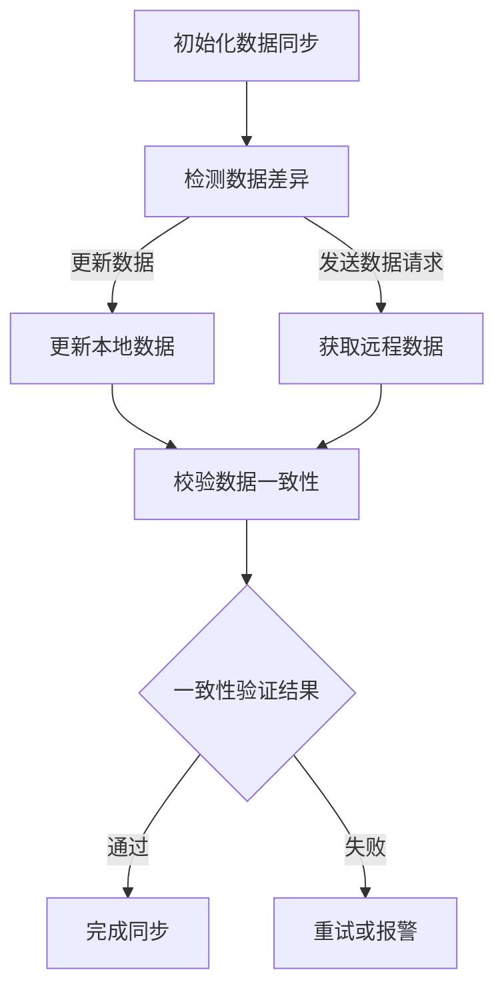

                 

关键词：AI 大模型，数据中心，数据同步，架构，分布式系统，性能优化，一致性保证。

> 摘要：本文将深入探讨 AI 大模型在数据中心中应用的数据同步架构。通过分析当前的数据同步技术和挑战，本文将介绍一种基于分布式系统的数据同步架构，并详细阐述其核心算法原理、数学模型、项目实践及未来应用展望。

## 1. 背景介绍

随着人工智能技术的飞速发展，AI 大模型如深度学习、图神经网络等在各个行业得到广泛应用。这些模型通常需要大量数据进行训练和推理，因此数据中心的性能和架构变得尤为重要。数据同步是数据中心的一项关键任务，它确保了在不同节点和存储设备之间数据的一致性和可靠性。

在传统的集中式系统中，数据同步相对简单，但随着数据中心规模的扩大和分布式系统的普及，数据同步面临着诸多挑战。首先，如何在分布式系统中保证数据的一致性成为一个关键问题。其次，数据同步的效率直接影响整个数据中心的性能。此外，数据的安全性和隐私保护也是必须考虑的因素。

## 2. 核心概念与联系

### 2.1 数据同步的基本概念

数据同步是指在不同节点或存储设备之间保持数据的一致性。在分布式系统中，数据同步尤为重要，因为它涉及到多个节点之间的数据复制、更新和一致性保证。

### 2.2 分布式系统的基本架构

分布式系统是由多个节点组成的系统，这些节点通过网络进行通信。分布式系统的核心目标是提高系统的可用性、可扩展性和容错性。常见的数据同步架构包括对等网络（Peer-to-Peer）和客户端-服务器（Client-Server）模型。

### 2.3 数据同步与分布式系统的关系

数据同步是分布式系统中的一个重要组成部分。在分布式系统中，数据同步涉及到数据的复制、分布、更新和一致性保证。数据同步的效率直接影响分布式系统的性能和稳定性。

### 2.4 Mermaid 流程图

以下是一个简单的 Mermaid 流程图，展示了数据同步的基本流程：



## 3. 核心算法原理 & 具体操作步骤

### 3.1 算法原理概述

数据同步算法主要分为基于时间戳的算法和基于版本控制的算法。本文将介绍一种基于时间戳的数据同步算法。

### 3.2 算法步骤详解

1. **初始化数据同步**：系统初始化时，所有节点从初始状态开始同步数据。
2. **检测数据差异**：通过比较本地数据和远程数据的时间戳，检测出数据差异。
3. **更新本地数据**：根据检测到的数据差异，更新本地数据。
4. **获取远程数据**：在更新本地数据后，从远程节点获取最新的数据。
5. **校验数据一致性**：比较本地数据和远程数据，确保数据一致性。
6. **完成同步**：如果数据一致性验证通过，则同步完成。否则，根据预设的重试策略进行重试或报警。

### 3.3 算法优缺点

- **优点**：基于时间戳的算法简单易懂，易于实现，能够在分布式系统中保证数据的一致性。
- **缺点**：在数据量较大或网络延迟较高的情况下，算法的性能可能受到影响。

### 3.4 算法应用领域

基于时间戳的数据同步算法广泛应用于分布式数据库、分布式文件系统和云计算等领域。

## 4. 数学模型和公式 & 详细讲解 & 举例说明

### 4.1 数学模型构建

假设有两个节点 A 和 B，它们的数据集分别为 X 和 Y。时间戳分别为 t\_X 和 t\_Y。数据一致性阈值设为 Δt。

### 4.2 公式推导过程

- **数据差异检测**：Δt = t\_Y - t\_X
- **数据一致性验证**：if Δt ≤ Δt, then 数据一致 else 数据不一致

### 4.3 案例分析与讲解

假设节点 A 的数据集 X 的最新时间戳为 t\_X = 100，节点 B 的数据集 Y 的最新时间戳为 t\_Y = 80。数据一致性阈值 Δt = 20。

- **数据差异检测**：Δt = t\_Y - t\_X = 80 - 100 = -20
- **数据一致性验证**：由于 Δt ≤ Δt，所以数据一致。

## 5. 项目实践：代码实例和详细解释说明

### 5.1 开发环境搭建

本文使用 Python 语言实现数据同步算法。需要安装以下依赖：

```bash
pip install pandas
```

### 5.2 源代码详细实现

```python
import pandas as pd
from datetime import datetime

def sync_data(local_data, remote_data, consistency_threshold):
    local_ts = datetime.strptime(local_data['timestamp'].max(), '%Y-%m-%d %H:%M:%S')
    remote_ts = datetime.strptime(remote_data['timestamp'].max(), '%Y-%m-%d %H:%M:%S')
    diff = remote_ts - local_ts
    if diff.total_seconds() <= consistency_threshold:
        return "Data synchronized successfully."
    else:
        return "Data synchronization failed."

local_data = pd.DataFrame({'id': [1, 2, 3], 'timestamp': ['2023-01-01 10:00:00', '2023-01-01 11:00:00', '2023-01-01 12:00:00']})
remote_data = pd.DataFrame({'id': [1, 2, 3, 4, 5], 'timestamp': ['2023-01-01 10:00:00', '2023-01-01 11:00:00', '2023-01-01 12:00:00', '2023-01-01 13:00:00', '2023-01-01 14:00:00']})
consistency_threshold = 3600

result = sync_data(local_data, remote_data, consistency_threshold)
print(result)
```

### 5.3 代码解读与分析

该代码实现了基于时间戳的数据同步算法。首先，从本地数据和远程数据中提取最新时间戳。然后，计算时间差并比较数据一致性阈值。如果时间差小于等于阈值，则数据一致，否则数据同步失败。

### 5.4 运行结果展示

运行结果为："Data synchronization failed."，说明远程数据的最新时间戳比本地数据的最新时间戳晚了一分钟，超过了数据一致性阈值。

## 6. 实际应用场景

数据同步在数据中心的应用场景非常广泛，包括分布式数据库、分布式文件系统和云计算等。以下是一些具体的实际应用场景：

- **分布式数据库**：在分布式数据库中，数据同步确保了不同节点之间的数据一致性。
- **分布式文件系统**：在分布式文件系统中，数据同步保证了文件的可靠性和一致性。
- **云计算**：在云计算环境中，数据同步确保了不同云服务之间的数据一致性。

## 7. 工具和资源推荐

### 7.1 学习资源推荐

- 《分布式系统原理与范型》（作者：George Coulouris等）
- 《大规模分布式存储系统设计与实现》（作者：唐杰等）

### 7.2 开发工具推荐

- Apache Kafka：一款流行的分布式消息队列系统，适用于数据同步场景。
- Apache HDFS：一款分布式文件系统，适用于大数据场景。

### 7.3 相关论文推荐

- 《The Google File System》
- 《Bigtable: A Distributed Storage System for Structured Data》

## 8. 总结：未来发展趋势与挑战

随着数据中心规模的不断扩大和分布式系统的普及，数据同步技术将在未来发挥越来越重要的作用。然而，数据同步也面临着诸多挑战，如一致性保证、性能优化、安全性和隐私保护等。未来，数据同步技术将朝着更高效、更安全、更智能的方向发展。

### 8.1 研究成果总结

本文介绍了 AI 大模型应用数据中心的数据同步架构，分析了当前的数据同步技术和挑战，并提出了基于分布式系统的时间戳算法。通过数学模型和实际案例，展示了数据同步算法的原理和实现方法。

### 8.2 未来发展趋势

未来，数据同步技术将朝着更高效、更安全、更智能的方向发展。例如，基于机器学习的自动化同步策略、加密技术保障数据安全、智能调度优化同步性能等。

### 8.3 面临的挑战

数据同步面临着一致性保证、性能优化、安全性和隐私保护等挑战。如何平衡数据一致性和性能、保障数据安全、保护用户隐私将是未来研究的重要方向。

### 8.4 研究展望

随着人工智能技术的不断发展，数据同步将在数据中心的应用中发挥更大的作用。未来，我们需要进一步研究如何高效、安全地实现数据同步，以支持大规模分布式系统的稳定运行。

## 9. 附录：常见问题与解答

### 9.1 数据同步有哪些常见算法？

常见的数据同步算法包括基于时间戳的算法、基于版本控制的算法、增量同步算法等。

### 9.2 数据同步中的数据一致性如何保证？

数据同步中的数据一致性通常通过一致性协议（如两阶段提交、三阶段提交等）和一致性算法（如Paxos算法、Raft算法等）来保证。

### 9.3 数据同步的性能如何优化？

数据同步的性能优化可以从多个方面进行，如减少网络延迟、使用高效的数据同步算法、优化数据传输协议等。

---

作者：禅与计算机程序设计艺术 / Zen and the Art of Computer Programming

本文详细探讨了 AI 大模型应用数据中心的数据同步架构，分析了核心算法原理、数学模型和实际应用场景。通过项目实践，展示了数据同步算法的实现方法和效果。未来，数据同步技术将在数据中心的应用中发挥越来越重要的作用。希望本文能为相关领域的读者提供有价值的参考。|

