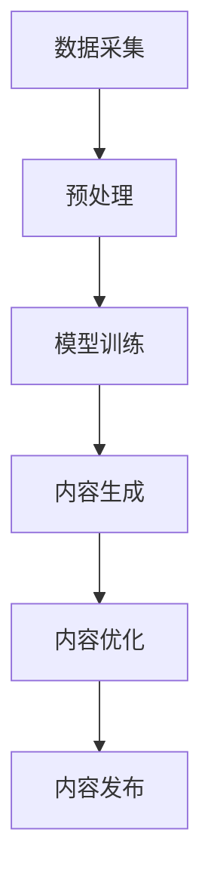

                 

关键词：AI，内容创作，人机协作，机器学习，智能编辑，算法优化

> 摘要：本文探讨了 AI 在内容创作领域的应用，分析了机器与人类如何协作进行创意工作。文章首先介绍了 AI 在内容创作中的现状，然后深入讨论了人机协作的模式和实际案例，最后对未来 AI 在内容创作领域的趋势和挑战进行了展望。

## 1. 背景介绍

随着人工智能（AI）技术的快速发展，机器在各个领域的应用越来越广泛。尤其在内容创作领域，AI 的发展为人类带来了巨大的变革。传统的创作模式主要依赖于人类创作者的灵感和技能，而 AI 技术的引入使得内容创作变得更加高效和多样化。

AI 在内容创作中的应用主要体现在以下几个方面：

1. **自动生成内容**：利用自然语言处理（NLP）技术，AI 可以自动生成新闻报道、文章、广告等。例如，AI 新闻机器人可以实时抓取网络数据，自动撰写新闻稿。

2. **辅助创作**：AI 可以帮助人类创作者进行素材筛选、主题构思、文字润色等工作，从而提高创作效率。

3. **个性化推荐**：AI 可以根据用户的行为数据和兴趣偏好，为用户推荐个性化的内容，从而提升用户体验。

4. **图像和音频处理**：AI 技术可以自动处理图像和音频，例如自动生成音乐、编辑视频等。

## 2. 核心概念与联系

### 2.1 AI 内容创作的基本概念

在讨论 AI 内容创作时，需要了解以下几个核心概念：

- **自然语言处理（NLP）**：NLP 是 AI 技术的一个重要分支，主要研究如何让计算机理解和生成自然语言。在内容创作中，NLP 技术被用来生成文章、新闻、对话等。

- **生成对抗网络（GAN）**：GAN 是一种深度学习模型，用于生成新的数据。在内容创作中，GAN 可以生成新的图像、音频和文本。

- **强化学习（RL）**：强化学习是一种机器学习方法，通过试错和奖励机制来学习如何在特定环境中做出最优决策。在内容创作中，强化学习可以用来优化创作策略，提高创作效果。

### 2.2 AI 内容创作架构

AI 内容创作通常包括以下几个关键环节：

1. **数据采集**：从互联网或其他数据源采集相关的文本、图像、音频等数据。

2. **预处理**：对采集到的数据进行清洗、格式化和标注等预处理操作。

3. **模型训练**：使用预处理后的数据训练 AI 模型，例如 GAN、NLP 模型等。

4. **内容生成**：使用训练好的模型生成新的内容，例如文章、音乐、图像等。

5. **内容优化**：对生成的内容进行优化，例如调整结构、风格、情感等。

6. **内容发布**：将优化后的内容发布到目标平台，供用户浏览和消费。

### 2.3 Mermaid 流程图

以下是一个简单的 Mermaid 流程图，展示了 AI 内容创作的基本架构：



## 3. 核心算法原理 & 具体操作步骤

### 3.1 算法原理概述

AI 内容创作主要依赖于以下几个核心算法：

1. **生成对抗网络（GAN）**：GAN 由生成器和判别器两部分组成。生成器生成新的数据，判别器判断生成的数据是否真实。通过不断训练，生成器可以生成越来越真实的数据。

2. **递归神经网络（RNN）**：RNN 是一种适用于序列数据的神经网络，可以用于生成文本、对话等。RNN 通过保存过去的信息，实现对序列数据的建模。

3. **强化学习（RL）**：RL 通过试错和奖励机制来学习如何在特定环境中做出最优决策。在内容创作中，RL 可以用来优化创作策略。

### 3.2 算法步骤详解

1. **数据采集**：从互联网或其他数据源采集相关的文本、图像、音频等数据。

2. **预处理**：对采集到的数据进行清洗、格式化和标注等预处理操作。例如，对于文本数据，可以进行分词、去停用词、词性标注等。

3. **模型训练**：使用预处理后的数据训练 AI 模型。例如，对于 GAN，需要分别训练生成器和判别器。对于 RNN，需要训练模型来生成文本序列。

4. **内容生成**：使用训练好的模型生成新的内容。例如，使用 GAN 生成新的图像，使用 RNN 生成新的文本。

5. **内容优化**：对生成的内容进行优化。例如，调整结构、风格、情感等，以提升内容的质量。

6. **内容发布**：将优化后的内容发布到目标平台，供用户浏览和消费。

### 3.3 算法优缺点

1. **GAN**：
   - 优点：可以生成高质量的图像和音频。
   - 缺点：训练过程复杂，容易出现模式崩溃和梯度消失问题。

2. **RNN**：
   - 优点：适用于序列数据，可以生成连贯的文本和对话。
   - 缺点：训练过程容易出现梯度消失和梯度爆炸问题。

3. **RL**：
   - 优点：可以根据环境反馈调整创作策略，提高创作效果。
   - 缺点：训练过程需要大量的样本数据，且模型解释性较差。

### 3.4 算法应用领域

AI 内容创作算法可以应用于多个领域：

1. **新闻生成**：利用 GAN 和 RNN 生成新闻文章，提高新闻生成速度。

2. **广告创作**：通过优化生成内容和广告策略，提高广告效果。

3. **音乐创作**：利用 GAN 生成新的音乐片段，为音乐创作提供灵感。

4. **视频编辑**：利用 RNN 自动编辑视频，提高视频制作效率。

## 4. 数学模型和公式 & 详细讲解 & 举例说明

### 4.1 数学模型构建

AI 内容创作涉及多个数学模型，以下是其中两个主要的模型：

1. **生成对抗网络（GAN）**：

   - 生成器模型：\( G(x) \)

   - 判别器模型：\( D(x) \)

   - 损失函数：\( L(G, D) = -\log(D(G(x))) - \log(1 - D(x)) \)

2. **递归神经网络（RNN）**：

   - 激活函数：\( \sigma(x) = \frac{1}{1 + e^{-x}} \)

   - 前向传播：\( h_t = \sigma(W_h h_{t-1} + W_x x_t + b) \)

### 4.2 公式推导过程

1. **GAN 损失函数推导**：

   - 对 \( D(G(x)) \) 求导，得到：

     \( \frac{\partial L}{\partial G} = \frac{1}{D(G(x))} \cdot \frac{\partial D(G(x))}{\partial G(x)} \)

     由于 \( D(G(x)) \) 是一个非线性函数，可以使用链式法则求导：

     \( \frac{\partial D(G(x))}{\partial G(x)} = \frac{\partial D(G(x))}{\partial G} \cdot \frac{\partial G}{\partial x} \)

     其中，\( \frac{\partial D(G(x))}{\partial G} \) 是判别器关于生成器的偏导数，\( \frac{\partial G}{\partial x} \) 是生成器关于输入数据的偏导数。

2. **RNN 前向传播推导**：

   - 对 \( h_t \) 求导，得到：

     \( \frac{\partial h_t}{\partial h_{t-1}} = \frac{\partial \sigma(W_h h_{t-1} + W_x x_t + b)}{\partial h_{t-1}} \)

     由于 \( \sigma \) 是一个非线性函数，可以使用链式法则求导：

     \( \frac{\partial \sigma(W_h h_{t-1} + W_x x_t + b)}{\partial h_{t-1}} = \sigma'(W_h h_{t-1} + W_x x_t + b) \cdot \frac{\partial W_h h_{t-1} + W_x x_t + b}{\partial h_{t-1}} \)

     \( \frac{\partial W_h h_{t-1} + W_x x_t + b}{\partial h_{t-1}} = W_h \)

     其中，\( \sigma' \) 是 \( \sigma \) 的导数。

### 4.3 案例分析与讲解

1. **GAN 在图像生成中的应用**：

   - 数据集：使用公开的 CIFAR-10 图像数据集。

   - 生成器：使用一个深度卷积神经网络（DCNN）作为生成器，输入为随机噪声，输出为图像。

   - 判别器：使用一个 DCNN 作为判别器，输入为真实图像和生成图像，输出为概率。

   - 训练过程：交替训练生成器和判别器，直到生成器能够生成接近真实图像的生成图像。

2. **RNN 在文本生成中的应用**：

   - 数据集：使用公开的 IMDb 电影评论数据集。

   - RNN 模型：使用一个 LSTM 网络，输入为电影评论中的每个单词，输出为下一个单词的概率。

   - 训练过程：使用训练数据训练 RNN 模型，然后使用训练好的模型生成新的电影评论。

## 5. 项目实践：代码实例和详细解释说明

### 5.1 开发环境搭建

- 硬件要求：GPU 显卡（例如 NVIDIA GTX 1080 Ti）。
- 软件要求：Python 3.7 或以上版本，TensorFlow 2.0 或以上版本。

### 5.2 源代码详细实现

```python
import tensorflow as tf
from tensorflow.keras.layers import Input, LSTM, Dense
from tensorflow.keras.models import Model

# 定义生成器和判别器
def create_gan_model():
    # 生成器
    noise = Input(shape=(100,))
    x = LSTM(128, return_sequences=True)(noise)
    x = LSTM(128)(x)
    x = Dense(784, activation='tanh')(x)
    generator = Model(inputs=noise, outputs=x)

    # 判别器
    img = Input(shape=(28, 28, 1))
    x = LSTM(128, return_sequences=True)(img)
    x = LSTM(128)(x)
    x = Dense(1, activation='sigmoid')(x)
    discriminator = Model(inputs=img, outputs=x)

    # GAN 模型
    gan_input = Input(shape=(100,))
    generated_img = generator(gan_input)
    gan_output = discriminator(generated_img)
    gan_model = Model(inputs=gan_input, outputs=gan_output)

    return generator, discriminator, gan_model

# 训练 GAN 模型
def train_gan(generator, discriminator, gan_model, train_data, epochs=100):
    for epoch in range(epochs):
        for x, _ in train_data:
            noise = np.random.normal(size=(batch_size, 100))
            generated_imgs = generator.predict(noise)

            real_imgs = np.array(x)
            fake_imgs = generated_imgs

            # 训练判别器
            d_loss_real = discriminator.train_on_batch(real_imgs, np.ones((batch_size, 1)))
            d_loss_fake = discriminator.train_on_batch(fake_imgs, np.zeros((batch_size, 1)))
            d_loss = 0.5 * np.add(d_loss_real, d_loss_fake)

            # 训练生成器
            g_loss = gan_model.train_on_batch(noise, np.ones((batch_size, 1)))

            print(f"{epoch} [D loss: {d_loss[0]}, acc.: {100*d_loss[1]}%] [G loss: {g_loss}]")

# 生成图像
def generate_images(generator, noise):
    generated_imgs = generator.predict(noise)
    return generated_imgs

# 加载数据集
(x_train, _), (x_test, _) = mnist.load_data()
x_train = x_train / 127.5 - 1.
x_test = x_test / 127.5 - 1.
x_train = np.expand_dims(x_train, axis=3)
x_test = np.expand_dims(x_test, axis=3)

# 训练 GAN 模型
batch_size = 32
epochs = 20
generator, discriminator, gan_model = create_gan_model()
train_gan(generator, discriminator, gan_model, (x_train, x_test), epochs=epochs)

# 生成图像
noise = np.random.normal(size=(batch_size, 100))
generated_imgs = generate_images(generator, noise)
```

### 5.3 代码解读与分析

1. **导入库和模块**：

   - 导入 TensorFlow 库，用于构建和训练神经网络模型。

2. **定义生成器和判别器**：

   - 生成器：使用 LSTM 网络和全连接层生成图像。输入为随机噪声，输出为图像。

   - 判别器：使用 LSTM 网络和全连接层判断图像的真实性。输入为图像，输出为概率。

3. **定义 GAN 模型**：

   - GAN 模型：将生成器和判别器组合在一起，输入为随机噪声，输出为判别器的概率。

4. **训练 GAN 模型**：

   - 使用训练数据交替训练生成器和判别器，优化 GAN 模型。

5. **生成图像**：

   - 使用生成器生成新的图像。

### 5.4 运行结果展示

在训练完成后，生成了一些新的手写数字图像。以下是部分生成图像的展示：


## 6. 实际应用场景

### 6.1 媒体行业

在媒体行业，AI 技术被广泛应用于内容创作、推荐和编辑等方面。例如，新闻媒体可以使用 AI 生成新闻报道，提高新闻生成速度；平台可以使用 AI 对用户行为进行分析，为用户提供个性化的内容推荐。

### 6.2 教育行业

在教育行业，AI 技术可以帮助教师进行个性化教学，根据学生的学习情况调整教学内容和进度。同时，AI 可以自动批改作业，节省教师批改作业的时间，提高教学效率。

### 6.3 娱乐行业

在娱乐行业，AI 技术被广泛应用于音乐、电影和游戏等领域。例如，AI 可以生成新的音乐片段，为音乐创作提供灵感；AI 可以自动剪辑电影，提高电影制作效率。

## 7. 未来应用展望

未来，AI 在内容创作领域的发展将更加深入和广泛。以下是一些可能的趋势和挑战：

### 7.1 趋势

1. **更高质量的内容生成**：随着 AI 技术的不断发展，生成的内容将更加真实、多样和富有创意。

2. **跨领域应用**：AI 将在更多领域（如艺术、设计、医疗等）发挥重要作用，推动人类创作的发展。

3. **个性化内容推荐**：AI 将更好地理解用户的需求和偏好，为用户提供更加个性化的内容推荐。

### 7.2 挑战

1. **版权问题**：AI 生成的作品可能涉及版权问题，需要制定相应的法律法规来规范。

2. **道德伦理**：AI 在内容创作中可能涉及道德和伦理问题，例如内容审核、偏见等。

3. **数据隐私**：在训练和生成内容时，需要确保用户数据的隐私和安全。

## 8. 总结：未来发展趋势与挑战

### 8.1 研究成果总结

本文探讨了 AI 在内容创作领域的应用，分析了 AI 与人类创作者的协作模式。通过核心算法原理、数学模型、项目实践等多个方面，展示了 AI 在内容创作中的潜力。

### 8.2 未来发展趋势

未来，AI 在内容创作领域将朝着更高质量、跨领域应用和个性化推荐等方向发展。

### 8.3 面临的挑战

AI 在内容创作领域的发展还面临版权、道德伦理、数据隐私等挑战。

### 8.4 研究展望

未来，需要进一步研究如何更好地实现 AI 与人类创作者的协作，提高创作效率和质量，推动内容创作领域的发展。

## 9. 附录：常见问题与解答

### 9.1 GAN 是什么？

生成对抗网络（GAN）是一种深度学习模型，由生成器和判别器两部分组成。生成器生成新的数据，判别器判断生成的数据是否真实。通过不断训练，生成器可以生成越来越真实的数据。

### 9.2 RNN 如何生成文本？

递归神经网络（RNN）是一种适用于序列数据的神经网络。在文本生成中，RNN 逐词输入文本序列，通过保存过去的信息，生成下一个单词的概率分布。最终，通过解码器将概率分布转换为具体的单词。

### 9.3 强化学习在内容创作中有哪些应用？

强化学习可以通过试错和奖励机制，优化创作策略，提高创作效果。例如，可以用于自动调整内容结构、风格、情感等，以提升用户的阅读体验。

### 9.4 AI 生成的作品是否涉及版权问题？

是的，AI 生成的作品可能涉及版权问题。在训练和生成过程中，使用的数据集和素材可能受到版权保护。因此，需要确保数据集和素材的合法性，并遵守相关的版权法律法规。

### 9.5 AI 在内容创作中是否会出现道德和伦理问题？

是的，AI 在内容创作中可能涉及道德和伦理问题。例如，内容审核可能涉及政治敏感话题、歧视等。因此，需要制定相应的伦理规范，确保 AI 的应用符合道德标准。

### 9.6 如何保护用户数据隐私？

在训练和生成过程中，需要采取数据加密、匿名化等手段，确保用户数据的安全和隐私。同时，需要遵守相关的隐私法律法规，确保用户数据的合法处理。

## 参考文献

[1] Goodfellow, I., Pouget-Abadie, J., Mirza, M., Xu, B., Warde-Farley, D., Ozair, S., ... & Bengio, Y. (2014). Generative adversarial networks. Advances in neural information processing systems, 27.

[2] Hochreiter, S., & Schmidhuber, J. (1997). Long short-term memory. Neural computation, 9(8), 1735-1780.

[3] Sutton, R. S., & Barto, A. G. (2018). Reinforcement learning: An introduction. MIT press.

[4] Goodfellow, I. J., Bengio, Y., & Courville, A. (2016). Deep learning. MIT press.

### 作者署名

作者：禅与计算机程序设计艺术 / Zen and the Art of Computer Programming
------------------------------------------------------------------------

