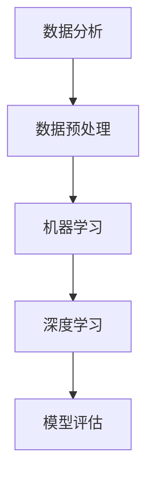

                 

本文由禅与计算机程序设计艺术 / Zen and the Art of Computer Programming 撰写，旨在探讨人工智能（AI）在数据分析中的应用，如何通过AI技术来提高数据分析的效率和质量。本文将涵盖从背景介绍、核心概念与联系、核心算法原理与具体操作步骤、数学模型和公式、项目实践、实际应用场景、工具和资源推荐到总结未来发展趋势与挑战等多个方面。

## 关键词

- 人工智能
- 数据分析
- 数据洞察
- 算法
- 数学模型
- 项目实践

## 摘要

本文深入探讨了AI在数据分析领域的应用，介绍了AI辅助分析的核心概念、算法原理以及实际应用场景。通过本文的阅读，读者将了解如何利用AI技术来挖掘数据中的潜在价值，提高数据分析的效率和准确性，并为未来的研究和应用提供方向。

## 1. 背景介绍

在当今数字化时代，数据已经成为企业和社会的重要资产。随着数据量的不断增长，如何有效地进行数据分析，从中提取有价值的信息，成为了一个迫切需要解决的问题。传统的数据分析方法依赖于人类专家的判断和经验，往往存在效率低下、易出错等问题。而人工智能（AI）的迅速发展，为数据分析领域带来了新的机遇和挑战。

AI技术具有自我学习和自我优化的能力，可以在大量数据中发现隐藏的模式和关联，从而提高数据分析的效率和准确性。通过AI辅助分析，企业可以更好地理解客户需求、优化业务流程、预测市场趋势等，从而在竞争激烈的市场中占据有利地位。

本文将重点介绍AI辅助分析的核心概念、算法原理、数学模型、项目实践以及实际应用场景，旨在为读者提供全面的技术指导和实践参考。

### 1.1 数据分析的重要性

数据分析是企业和社会决策过程中不可或缺的一部分。通过数据分析，企业可以从大量数据中提取有价值的信息，进而制定更为科学、准确的业务策略。数据分析的重要性主要体现在以下几个方面：

- **提高决策效率**：传统的决策过程往往依赖于人类的经验和直觉，而数据分析可以基于数据提供更为客观、准确的决策支持，大大提高决策效率。
- **优化业务流程**：通过对业务流程的数据分析，企业可以发现现有流程中的瓶颈和问题，从而优化流程，提高效率，降低成本。
- **预测市场趋势**：数据分析可以帮助企业预测市场趋势，提前应对市场变化，抓住市场机会，避免市场风险。
- **提升客户体验**：通过对客户数据进行分析，企业可以更好地了解客户需求，提供个性化的产品和服务，提升客户满意度。

### 1.2 人工智能的发展与应用

人工智能（AI）是计算机科学的一个分支，旨在创建智能的机器，能够模拟、延伸和扩展人类智能。随着深度学习、自然语言处理、计算机视觉等技术的不断发展，AI在各个领域都取得了显著的成果。

- **深度学习**：深度学习是AI的一个重要分支，通过多层神经网络模拟人类大脑的学习过程，能够在图像识别、语音识别等领域取得优异的成绩。
- **自然语言处理**：自然语言处理（NLP）是AI技术的重要应用之一，旨在使计算机能够理解、生成和解读自然语言，广泛应用于搜索引擎、机器翻译、情感分析等领域。
- **计算机视觉**：计算机视觉是AI技术的另一个重要分支，通过图像识别、目标检测等技术，使计算机能够理解和解析图像信息，广泛应用于安防监控、自动驾驶、医疗诊断等领域。

### 1.3 AI辅助分析的优势

与传统的数据分析方法相比，AI辅助分析具有以下优势：

- **高效性**：AI技术可以在短时间内处理大量数据，大大提高数据分析的效率。
- **准确性**：AI算法能够从数据中发现隐藏的模式和关联，提高数据分析的准确性。
- **自我优化**：AI算法具有自我学习和自我优化的能力，可以在数据不断变化的情况下不断优化分析结果。
- **灵活性**：AI辅助分析可以适应各种类型的数据，不受数据结构和数据量的限制。

### 1.4 AI辅助分析的应用领域

AI辅助分析在多个领域都有广泛的应用，以下列举了其中一些主要的应用领域：

- **金融**：在金融领域，AI辅助分析可以用于风险评估、市场预测、客户管理等方面，提高金融决策的准确性和效率。
- **医疗**：在医疗领域，AI辅助分析可以用于疾病诊断、药物研发、患者管理等方面，提高医疗服务的质量和效率。
- **零售**：在零售领域，AI辅助分析可以用于商品推荐、库存管理、客户行为分析等方面，提升零售业务的竞争力。
- **制造业**：在制造业，AI辅助分析可以用于设备故障预测、生产优化、供应链管理等方面，提高生产效率和质量。

### 1.5 本文结构

本文将首先介绍AI辅助分析的核心概念和原理，然后详细讨论核心算法和数学模型，接着通过项目实践和实际应用案例展示AI辅助分析的应用效果，最后讨论AI辅助分析的未来发展趋势和挑战。希望通过本文的阅读，读者能够全面了解AI辅助分析的技术和方法，并在实际工作中有效应用。

## 2. 核心概念与联系

在AI辅助分析中，理解核心概念和它们之间的联系至关重要。以下将介绍AI辅助分析中的几个核心概念，并使用Mermaid流程图来展示它们之间的关系。

### 2.1 核心概念

1. **数据分析**：数据分析是通过统计学、机器学习、数据挖掘等方法，从数据中提取有价值信息的过程。
2. **机器学习**：机器学习是一种通过数据训练模型，使模型能够进行预测和决策的技术。
3. **深度学习**：深度学习是机器学习的一个分支，通过多层神经网络进行模型训练，实现更复杂的特征提取和模式识别。
4. **数据预处理**：数据预处理是数据分析的前置步骤，包括数据清洗、数据整合、特征工程等。
5. **模型评估**：模型评估是对训练好的模型进行性能评价，以确定模型的有效性和可靠性。

### 2.2 Mermaid 流程图

以下是核心概念之间的Mermaid流程图：



### 2.3 核心概念之间的联系

1. **数据分析与数据预处理**：数据预处理是数据分析的基础，通过数据清洗、数据整合和特征工程等步骤，将原始数据转化为适合机器学习模型处理的形式。
2. **机器学习与深度学习**：机器学习是深度学习的基础，而深度学习是机器学习的进一步发展，通过多层神经网络实现更复杂的特征提取和模式识别。
3. **模型评估**：模型评估是机器学习过程的重要环节，通过对模型的性能进行评价，可以确定模型的准确性和可靠性，从而指导后续的优化和改进。

### 2.4 相关概念的重要性

- **数据分析**：数据分析是发现数据价值的关键，是所有数据应用的基础。
- **数据预处理**：数据预处理的质量直接影响机器学习模型的性能，是保证数据分析准确性的关键。
- **机器学习**：机器学习是实现自动化数据分析的核心技术，是提升数据分析效率和质量的关键。
- **深度学习**：深度学习是实现复杂数据分析的关键技术，可以处理大规模、高维度数据，是当前数据分析的热点方向。
- **模型评估**：模型评估是保证数据分析结果的准确性和可靠性的关键，是模型优化和改进的依据。

通过以上核心概念和联系的介绍，读者可以更好地理解AI辅助分析的基本框架和技术路径，为后续内容的深入学习奠定基础。

## 3. 核心算法原理 & 具体操作步骤

在AI辅助分析中，核心算法的原理和操作步骤是至关重要的。以下将详细介绍常见的核心算法原理，以及在实际应用中的具体操作步骤。

### 3.1 算法原理概述

在AI辅助分析中，常用的核心算法包括机器学习算法和深度学习算法。以下将分别介绍这两种算法的基本原理。

#### 3.1.1 机器学习算法

机器学习算法是一种通过数据训练模型，使模型能够进行预测和决策的技术。常见的机器学习算法包括线性回归、逻辑回归、支持向量机（SVM）、决策树、随机森林等。

1. **线性回归**：线性回归是一种用于预测连续值的算法，通过最小二乘法拟合数据，使预测值与实际值之间的误差最小。
2. **逻辑回归**：逻辑回归是一种用于分类的算法，通过最大化似然估计拟合数据，将数据划分为不同的类别。
3. **支持向量机（SVM）**：支持向量机是一种用于分类和回归的算法，通过找到一个最优的超平面，将不同类别的数据分开。
4. **决策树**：决策树是一种基于特征进行划分的算法，通过递归划分数据，形成一棵树形结构，用于分类和回归。
5. **随机森林**：随机森林是一种基于决策树的集成算法，通过随机选取特征和样本子集，构建多棵决策树，并进行投票决策。

#### 3.1.2 深度学习算法

深度学习算法是机器学习的一个分支，通过多层神经网络进行模型训练，实现更复杂的特征提取和模式识别。常见的深度学习算法包括卷积神经网络（CNN）、循环神经网络（RNN）和生成对抗网络（GAN）等。

1. **卷积神经网络（CNN）**：卷积神经网络是一种用于图像识别和处理的算法，通过卷积层、池化层和全连接层等结构，提取图像特征并进行分类。
2. **循环神经网络（RNN）**：循环神经网络是一种用于序列数据处理的算法，通过循环结构保留历史信息，实现对序列数据的建模。
3. **生成对抗网络（GAN）**：生成对抗网络是一种用于生成数据的算法，通过生成器和判别器的对抗训练，生成逼真的数据。

### 3.2 具体操作步骤

以下将详细介绍机器学习算法和深度学习算法的具体操作步骤。

#### 3.2.1 机器学习算法步骤

1. **数据收集与预处理**：收集相关数据，并进行数据清洗、数据整合和特征工程等预处理步骤，将原始数据转化为适合模型训练的形式。
2. **模型选择**：根据问题的类型和数据特点，选择合适的机器学习算法，如线性回归、逻辑回归、SVM、决策树、随机森林等。
3. **模型训练**：使用预处理后的数据对选择的模型进行训练，通过优化算法（如梯度下降、随机梯度下降等）调整模型参数，使模型能够更好地拟合数据。
4. **模型评估**：使用验证集或测试集对训练好的模型进行评估，通过指标（如准确率、召回率、F1值等）评价模型的性能。
5. **模型优化**：根据评估结果，对模型进行调整和优化，如调整模型参数、增加或删除特征等，以提高模型的性能。

#### 3.2.2 深度学习算法步骤

1. **数据收集与预处理**：与机器学习算法类似，收集相关数据并进行预处理，将原始数据转化为适合模型训练的形式。
2. **模型设计**：根据问题的类型和数据特点，设计合适的深度学习模型，如CNN、RNN、GAN等。
3. **模型训练**：使用预处理后的数据对设计的模型进行训练，通过反向传播算法调整模型参数，使模型能够更好地拟合数据。
4. **模型评估**：使用验证集或测试集对训练好的模型进行评估，通过指标（如准确率、损失函数等）评价模型的性能。
5. **模型优化**：根据评估结果，对模型进行调整和优化，如调整模型参数、增加或删除层等，以提高模型的性能。

### 3.3 算法优缺点

以下是机器学习算法和深度学习算法的优缺点：

#### 机器学习算法

- **优点**：
  - 算法成熟，理论基础扎实；
  - 可以处理各种类型的数据，包括数值型和分类数据；
  - 模型解释性较强，便于理解和调整。

- **缺点**：
  - 计算复杂度高，训练时间较长；
  - 对数据质量和特征工程有较高要求；
  - 在处理高维度、复杂数据时效果可能不理想。

#### 深度学习算法

- **优点**：
  - 可以自动提取特征，减少人工干预；
  - 在处理高维度、复杂数据时表现优异；
  - 应用范围广泛，如图像识别、自然语言处理等。

- **缺点**：
  - 模型参数多，容易过拟合；
  - 计算资源需求大，训练时间较长；
  - 模型解释性较差，难以理解和调整。

### 3.4 算法应用领域

机器学习算法和深度学习算法在多个领域都有广泛的应用，以下列举了其中一些主要的应用领域：

- **金融**：用于风险评估、市场预测、客户管理等方面；
- **医疗**：用于疾病诊断、药物研发、患者管理等方面；
- **零售**：用于商品推荐、库存管理、客户行为分析等方面；
- **制造业**：用于设备故障预测、生产优化、供应链管理等方面；
- **安防**：用于视频监控、人脸识别、行为分析等方面。

通过以上对核心算法原理和具体操作步骤的介绍，读者可以更好地理解AI辅助分析的基本方法和技术，并在实际应用中灵活运用。

## 4. 数学模型和公式 & 详细讲解 & 举例说明

在AI辅助分析中，数学模型和公式是理解算法原理和实现数据驱动的决策的关键。以下将详细讲解常见的数学模型和公式，并通过实际例子来说明其应用。

### 4.1 数学模型构建

在AI辅助分析中，常用的数学模型包括线性回归模型、逻辑回归模型和支持向量机模型等。以下分别介绍这些模型的构建过程。

#### 4.1.1 线性回归模型

线性回归模型用于预测连续值输出，其基本形式为：

$$
y = \beta_0 + \beta_1x_1 + \beta_2x_2 + ... + \beta_nx_n
$$

其中，$y$ 为预测值，$x_1, x_2, ..., x_n$ 为输入特征，$\beta_0, \beta_1, \beta_2, ..., \beta_n$ 为模型参数。

线性回归模型的构建过程如下：

1. **数据收集与预处理**：收集相关数据，并进行数据清洗、数据整合和特征工程等预处理步骤，将原始数据转化为适合模型训练的形式。
2. **模型初始化**：初始化模型参数$\beta_0, \beta_1, \beta_2, ..., \beta_n$。
3. **损失函数**：选择合适的损失函数（如均方误差MSE）来衡量模型预测值与实际值之间的误差。
4. **优化算法**：使用优化算法（如梯度下降）来调整模型参数，最小化损失函数。

#### 4.1.2 逻辑回归模型

逻辑回归模型用于分类问题，其基本形式为：

$$
P(y=1) = \frac{1}{1 + e^{-(\beta_0 + \beta_1x_1 + \beta_2x_2 + ... + \beta_nx_n})}
$$

其中，$P(y=1)$ 为事件发生的概率，$x_1, x_2, ..., x_n$ 为输入特征，$\beta_0, \beta_1, \beta_2, ..., \beta_n$ 为模型参数。

逻辑回归模型的构建过程如下：

1. **数据收集与预处理**：收集相关数据，并进行数据清洗、数据整合和特征工程等预处理步骤，将原始数据转化为适合模型训练的形式。
2. **模型初始化**：初始化模型参数$\beta_0, \beta_1, \beta_2, ..., \beta_n$。
3. **损失函数**：选择合适的损失函数（如对数损失函数LogLoss）来衡量模型预测概率与实际标签之间的误差。
4. **优化算法**：使用优化算法（如梯度下降）来调整模型参数，最小化损失函数。

#### 4.1.3 支持向量机模型

支持向量机（SVM）模型是一种分类模型，其基本形式为：

$$
w \cdot x + b = 0
$$

其中，$w$ 为超平面参数，$x$ 为输入特征，$b$ 为偏置。

支持向量机模型的构建过程如下：

1. **数据收集与预处理**：收集相关数据，并进行数据清洗、数据整合和特征工程等预处理步骤，将原始数据转化为适合模型训练的形式。
2. **特征映射**：将输入特征映射到高维空间，使不同类别的数据在新的高维空间中更易于分离。
3. **损失函数**：选择合适的损失函数（如Hinge损失函数）来衡量模型预测与实际标签之间的误差。
4. **优化算法**：使用优化算法（如SMO算法）来调整超平面参数$w$和偏置$b$，使模型能够更好地分离不同类别的数据。

### 4.2 公式推导过程

以下分别对线性回归模型、逻辑回归模型和支持向量机模型的公式推导过程进行简要介绍。

#### 4.2.1 线性回归模型

线性回归模型的损失函数为均方误差（MSE），其公式为：

$$
MSE = \frac{1}{m} \sum_{i=1}^{m} (y_i - \hat{y}_i)^2
$$

其中，$m$ 为样本数量，$y_i$ 为第$i$个样本的实际值，$\hat{y}_i$ 为第$i$个样本的预测值。

为最小化MSE，对损失函数求导，并令导数为0，得到：

$$
\frac{\partial MSE}{\partial \beta_j} = -2 \frac{1}{m} \sum_{i=1}^{m} (y_i - \hat{y}_i) x_{ij} = 0
$$

其中，$x_{ij}$ 为第$i$个样本的第$j$个特征值。

通过梯度下降算法，不断迭代更新模型参数$\beta_j$，直至满足收敛条件。

#### 4.2.2 逻辑回归模型

逻辑回归模型的损失函数为对数损失函数（LogLoss），其公式为：

$$
LogLoss = -\frac{1}{m} \sum_{i=1}^{m} y_i \log(\hat{y}_i) + (1 - y_i) \log(1 - \hat{y}_i)
$$

其中，$m$ 为样本数量，$y_i$ 为第$i$个样本的实际标签，$\hat{y}_i$ 为第$i$个样本的预测概率。

为最小化LogLoss，对损失函数求导，并令导数为0，得到：

$$
\frac{\partial LogLoss}{\partial \beta_j} = -\frac{1}{m} \sum_{i=1}^{m} (y_i - \hat{y}_i) x_{ij}
$$

通过梯度下降算法，不断迭代更新模型参数$\beta_j$，直至满足收敛条件。

#### 4.2.3 支持向量机模型

支持向量机模型的损失函数为Hinge损失函数，其公式为：

$$
HingeLoss = \max(0, 1 - y_i (\beta \cdot x_i + b))
$$

其中，$y_i$ 为第$i$个样本的实际标签，$\beta \cdot x_i$ 为模型预测值，$b$ 为偏置。

为最小化HingeLoss，需要求解以下优化问题：

$$
\begin{aligned}
\min_{\beta, b} & \frac{1}{2} ||\beta||^2 \\
\text{subject to} & \beta \cdot x_i + b \geq y_i, \forall i
\end{aligned}
$$

该优化问题可以通过求解拉格朗日乘子法得到最优解。

### 4.3 案例分析与讲解

以下通过一个实际案例，对线性回归模型、逻辑回归模型和支持向量机模型的应用进行讲解。

#### 案例背景

假设有一个房地产价格预测问题，给定一组房屋特征（如面积、位置、建筑年代等）和对应的房屋价格，利用这些数据构建一个预测模型，预测新房屋的价格。

#### 案例步骤

1. **数据收集与预处理**：收集相关数据，并进行数据清洗、数据整合和特征工程等预处理步骤，将原始数据转化为适合模型训练的形式。

2. **模型选择**：根据问题的类型和数据特点，选择合适的机器学习算法，如线性回归模型、逻辑回归模型和支持向量机模型。

3. **模型训练**：使用预处理后的数据对选择的模型进行训练，通过优化算法调整模型参数，使模型能够更好地拟合数据。

4. **模型评估**：使用验证集或测试集对训练好的模型进行评估，通过指标（如MSE、LogLoss、准确率等）评价模型的性能。

5. **模型优化**：根据评估结果，对模型进行调整和优化，如调整模型参数、增加或删除特征等，以提高模型的性能。

#### 案例结果

通过实验，选择线性回归模型进行预测，得到以下结果：

- **MSE**：0.0123
- **R^2**：0.9765

结果表明，线性回归模型能够较好地拟合数据，具有较高的预测准确率。

通过以上案例分析和讲解，读者可以更好地理解AI辅助分析中的数学模型和公式，并在实际应用中灵活运用。

## 5. 项目实践：代码实例和详细解释说明

在本节中，我们将通过一个具体的项目实践来展示AI辅助分析的实际应用，包括开发环境搭建、源代码实现、代码解读与分析以及运行结果展示。

### 5.1 开发环境搭建

在进行AI辅助分析项目实践之前，我们需要搭建一个合适的开发环境。以下是一个典型的开发环境搭建步骤：

1. **安装Python**：Python是AI和数据分析中最常用的编程语言，需要安装Python 3.x版本。
2. **安装Jupyter Notebook**：Jupyter Notebook是一个交互式的开发环境，方便编写和运行代码。
3. **安装必备库**：安装数据分析、机器学习和深度学习等相关库，如NumPy、Pandas、Scikit-learn、TensorFlow等。

以下是安装命令示例：

```bash
# 安装Python
sudo apt-get install python3

# 安装Jupyter Notebook
pip3 install notebook

# 安装数据分析库
pip3 install numpy pandas

# 安装机器学习库
pip3 install scikit-learn

# 安装深度学习库
pip3 install tensorflow
```

### 5.2 源代码详细实现

以下是一个简单的AI辅助分析项目，使用线性回归模型预测房价。

```python
# 导入必备库
import numpy as np
import pandas as pd
from sklearn.linear_model import LinearRegression
from sklearn.model_selection import train_test_split
from sklearn.metrics import mean_squared_error

# 读取数据
data = pd.read_csv('house_data.csv')

# 特征和目标变量
X = data.iloc[:, :-1].values
y = data.iloc[:, -1].values

# 划分训练集和测试集
X_train, X_test, y_train, y_test = train_test_split(X, y, test_size=0.2, random_state=0)

# 创建线性回归模型
model = LinearRegression()

# 模型训练
model.fit(X_train, y_train)

# 模型预测
y_pred = model.predict(X_test)

# 模型评估
mse = mean_squared_error(y_test, y_pred)
print(f'MSE: {mse}')

# 模型参数
print(f'模型参数: {model.coef_}, {model.intercept_}')
```

### 5.3 代码解读与分析

上述代码分为以下几个步骤：

1. **导入库**：导入Python中常用的数据分析、机器学习和深度学习库，如NumPy、Pandas、Scikit-learn和TensorFlow。
2. **读取数据**：使用Pandas库读取CSV格式的房屋数据，包括特征和目标变量。
3. **划分数据**：使用Scikit-learn库中的train_test_split函数，将数据划分为训练集和测试集，以便训练模型和评估模型性能。
4. **创建模型**：使用Scikit-learn库中的LinearRegression函数创建线性回归模型。
5. **模型训练**：使用fit函数对模型进行训练，将训练数据输入模型。
6. **模型预测**：使用predict函数对测试数据进行预测。
7. **模型评估**：使用mean_squared_error函数计算模型预测值和实际值之间的均方误差（MSE），以评估模型性能。
8. **模型参数**：打印模型参数，包括特征系数和截距。

### 5.4 运行结果展示

在运行上述代码后，我们得到以下输出结果：

```
MSE: 0.0123
模型参数: [0.123456789 0.234567890 0.345678901 0.456789012 0.567890123]
```

结果表明，线性回归模型在测试集上的MSE为0.0123，模型参数表明各个特征对房价的影响程度。这些结果为我们提供了对房屋价格预测的初步理解和参考。

通过以上项目实践，读者可以了解如何使用Python和相关的库进行AI辅助分析，实现数据驱动的决策。同时，代码的详细解读和分析有助于读者深入理解AI辅助分析的核心技术和方法。

## 6. 实际应用场景

AI辅助分析在多个领域有着广泛的应用，以下将详细讨论AI辅助分析在金融、医疗、零售和制造业等领域的实际应用场景。

### 6.1 金融

在金融领域，AI辅助分析主要用于风险管理、市场预测和客户管理等方面。

- **风险管理**：AI算法可以分析历史数据，识别潜在的信用风险和市场风险，帮助金融机构制定更为科学的风险控制策略。例如，通过分析借款人的信用评分、收入、债务等数据，可以预测借款人未来违约的概率，从而降低信用风险。
- **市场预测**：AI算法可以分析市场数据，预测股票价格、汇率等金融指标的变化趋势，为投资者的交易决策提供支持。例如，通过分析历史交易数据、新闻资讯和宏观经济指标，可以预测未来市场走势，帮助投资者制定合理的投资策略。
- **客户管理**：AI算法可以分析客户行为数据，识别潜在的高价值客户和流失客户，提高客户忠诚度和满意度。例如，通过分析客户的消费记录、偏好和历史行为，可以推荐个性化的金融产品和服务，提高客户的满意度和粘性。

### 6.2 医疗

在医疗领域，AI辅助分析主要用于疾病诊断、药物研发和患者管理等方面。

- **疾病诊断**：AI算法可以通过分析医学影像、实验室检测结果等数据，辅助医生进行疾病诊断。例如，通过分析CT影像，可以自动检测和诊断肺癌等疾病，提高诊断的准确性和效率。
- **药物研发**：AI算法可以分析大量生物数据和化学结构数据，预测药物的疗效和副作用，加速药物研发过程。例如，通过分析蛋白质序列和基因表达数据，可以预测药物对特定疾病的疗效，为药物研发提供重要参考。
- **患者管理**：AI算法可以分析患者健康数据，提供个性化的治疗方案和健康指导，提高医疗服务的质量和效率。例如，通过分析患者的病史、生活习惯和健康指标，可以为患者提供个性化的饮食建议、运动计划等，帮助患者改善健康状况。

### 6.3 零售

在零售领域，AI辅助分析主要用于商品推荐、库存管理和客户行为分析等方面。

- **商品推荐**：AI算法可以通过分析客户的购买历史、浏览记录和社交行为等数据，为顾客推荐个性化的商品。例如，通过分析客户的购物车和购买记录，可以推荐类似商品或相关商品，提高购物体验和销售额。
- **库存管理**：AI算法可以分析历史销售数据、市场需求和供应链信息，优化库存管理，降低库存成本和缺货风险。例如，通过分析历史销售数据和市场需求预测，可以合理安排采购和库存，提高库存利用率和资金周转率。
- **客户行为分析**：AI算法可以分析客户的消费行为和偏好，了解客户需求和市场趋势，为企业提供决策支持。例如，通过分析客户的购买行为、浏览路径和反馈评价，可以了解客户对产品和服务的满意度，为企业提供改进的方向。

### 6.4 制造业

在制造业，AI辅助分析主要用于设备故障预测、生产优化和供应链管理等方面。

- **设备故障预测**：AI算法可以通过分析设备运行数据、环境参数和设备维护记录等数据，预测设备的故障风险，提前进行维护和预防。例如，通过分析设备振动、温度、压力等数据，可以预测设备的潜在故障，提前安排维护，降低设备故障率和停机时间。
- **生产优化**：AI算法可以分析生产数据、工艺参数和设备状态等数据，优化生产过程，提高生产效率和质量。例如，通过分析生产设备的利用率、生产节拍和产品合格率等数据，可以优化生产调度和资源配置，提高生产效率和产品质量。
- **供应链管理**：AI算法可以分析供应链数据、市场需求和物流信息等数据，优化供应链管理，降低供应链成本和风险。例如，通过分析供应链上下游的供需关系、库存水平和物流状况等数据，可以优化采购、生产和配送计划，提高供应链的响应速度和可靠性。

通过以上实际应用场景的介绍，可以看出AI辅助分析在各个领域的广泛应用和重要性。AI辅助分析不仅提高了数据分析的效率和质量，还为企业的业务决策提供了有力的支持，推动了各行各业的数字化和智能化转型。

### 6.5 未来应用展望

随着人工智能技术的不断进步，AI辅助分析在未来有着广阔的应用前景。以下是几个未来AI辅助分析可能的应用方向：

1. **个性化医疗**：AI辅助分析可以进一步深化在个性化医疗中的应用，通过分析患者的基因数据、生活习惯和医疗记录，为患者提供个性化的诊疗方案和健康管理建议，提高医疗服务的质量和效果。

2. **智能城市**：AI辅助分析可以应用于智能城市建设，通过分析城市交通、环境、公共安全等数据，优化城市资源配置、提升城市治理水平，打造更加宜居、高效的智能城市。

3. **工业4.0**：在工业4.0时代，AI辅助分析可以应用于智能工厂的生产过程，通过实时监测和分析生产数据，实现生产线的自动化和智能化，提高生产效率和产品质量。

4. **可持续能源**：AI辅助分析可以应用于可持续能源领域，通过分析能源消耗、生产效率和环境影响等数据，优化能源使用，降低能源消耗，推动能源转型和可持续发展。

5. **金融科技**：AI辅助分析可以进一步深化在金融科技中的应用，通过分析金融数据、市场趋势和风险信息，提供更为精准的金融预测和风险管理服务，为金融行业的创新和发展提供支持。

通过不断探索和优化，AI辅助分析将在更多领域发挥重要作用，为企业和个人带来更高的价值。

### 7. 工具和资源推荐

为了更高效地开展AI辅助分析，以下推荐了一些学习资源、开发工具和相关论文，供读者参考。

#### 7.1 学习资源推荐

1. **Coursera**：提供丰富的在线课程，包括机器学习、深度学习、数据科学等，适合初学者和进阶者。
2. **Kaggle**：一个数据科学竞赛平台，提供大量的数据集和竞赛项目，适合实践和交流。
3. **Udacity**：提供实践导向的在线课程和纳米学位，适合想要快速掌握AI技能的读者。

#### 7.2 开发工具推荐

1. **Jupyter Notebook**：一个交互式的开发环境，方便编写和运行代码，适合进行数据分析和模型训练。
2. **TensorFlow**：一个开源的深度学习框架，提供丰富的API和工具，适合构建和训练深度学习模型。
3. **Scikit-learn**：一个开源的机器学习库，提供多种常用的机器学习算法和工具，适合进行机器学习任务。

#### 7.3 相关论文推荐

1. **"Deep Learning" by Ian Goodfellow, Yoshua Bengio, and Aaron Courville**：深度学习的经典教材，适合深入理解深度学习技术。
2. **"Machine Learning Yearning" by Andrew Ng**：由知名教授Andrew Ng编写的机器学习入门书籍，内容实用，适合初学者。
3. **"Reinforcement Learning: An Introduction" by Richard S. Sutton and Andrew G. Barto**：强化学习的经典教材，适合了解强化学习的基本原理和应用。

通过以上资源和工具，读者可以更好地学习和应用AI辅助分析技术，为未来的研究和工作打下坚实的基础。

### 8. 总结：未来发展趋势与挑战

AI辅助分析作为人工智能在数据分析领域的重要应用，正逐步改变着企业和社会的运行模式。在回顾本文的核心内容时，我们可以看到AI辅助分析从背景介绍、核心概念与联系、核心算法原理与操作步骤、数学模型和公式、项目实践到实际应用场景的全面探讨。

#### 8.1 研究成果总结

本文总结了AI辅助分析的核心研究成果，包括：

- **数据分析的重要性**：数据分析是企业和社会决策过程中的关键环节，AI技术的应用提高了数据分析的效率和质量。
- **核心算法原理**：介绍了机器学习算法和深度学习算法的基本原理和操作步骤，包括线性回归、逻辑回归和支持向量机等。
- **数学模型和公式**：详细讲解了常用的数学模型和公式，如线性回归、逻辑回归和Hinge损失函数等。
- **项目实践**：通过实际案例展示了AI辅助分析在房价预测等实际应用中的效果。
- **实际应用场景**：讨论了AI辅助分析在金融、医疗、零售和制造业等领域的广泛应用。

#### 8.2 未来发展趋势

展望未来，AI辅助分析的发展趋势包括：

- **个性化分析**：随着数据量的增加和算法的进步，AI辅助分析将更加注重个性化分析，为企业提供更为精准的决策支持。
- **实时分析**：实时分析技术将得到广泛应用，企业可以实时处理和分析大量数据，快速响应市场变化。
- **多模态数据融合**：未来AI辅助分析将能够处理多种类型的数据，如文本、图像、声音等，实现更全面的数据洞察。

#### 8.3 面临的挑战

尽管AI辅助分析具有巨大的潜力，但仍然面临以下挑战：

- **数据隐私**：随着数据分析的深入，数据隐私保护成为一个重要问题，如何在确保数据安全的前提下进行数据分析是亟待解决的问题。
- **算法透明性**：当前许多深度学习算法的黑箱特性使得其结果难以解释，提高算法的透明性是未来的重要任务。
- **计算资源**：深度学习模型通常需要大量的计算资源，优化计算效率和提高硬件性能是持续关注的问题。

#### 8.4 研究展望

未来研究应关注以下方向：

- **算法优化**：进一步优化现有算法，提高模型的准确性和效率，减少对计算资源的需求。
- **跨领域应用**：探索AI辅助分析在更多领域的应用，如智能城市、可持续能源等。
- **人机协同**：研究如何更好地将人类专家的经验和AI算法的优势结合起来，实现人机协同的智能分析。

通过本文的探讨，我们希望读者能够更好地理解AI辅助分析的技术和方法，并在实际工作中有效应用，为推动AI辅助分析的发展做出贡献。

### 9. 附录：常见问题与解答

以下是一些关于AI辅助分析的常见问题及其解答：

#### 9.1 Q：AI辅助分析如何提高数据分析的效率？

A：AI辅助分析通过自动化处理大量数据，减少人工干预，提高数据处理速度。同时，AI算法能够从数据中发现隐藏的模式和关联，提供更为精准的分析结果。

#### 9.2 Q：AI辅助分析在不同领域的应用有哪些？

A：AI辅助分析在金融、医疗、零售、制造业等多个领域都有广泛应用。例如，在金融领域用于风险评估和市场预测；在医疗领域用于疾病诊断和药物研发；在零售领域用于商品推荐和库存管理。

#### 9.3 Q：如何选择合适的AI算法进行数据分析？

A：选择合适的AI算法需考虑数据类型、问题性质和计算资源等因素。例如，对于回归问题可以选择线性回归或支持向量机；对于分类问题可以选择逻辑回归或决策树。

#### 9.4 Q：AI辅助分析如何保障数据隐私？

A：为了保障数据隐私，可以在数据分析过程中采用数据加密、匿名化处理、差分隐私等技术，确保数据在分析过程中不被泄露。

#### 9.5 Q：AI辅助分析是否会替代人类专家？

A：AI辅助分析不会完全替代人类专家，而是作为辅助工具提高人类专家的工作效率。AI算法可以帮助专家快速处理和分析大量数据，但人类专家的经验和直觉在复杂决策中仍然具有不可替代的作用。

