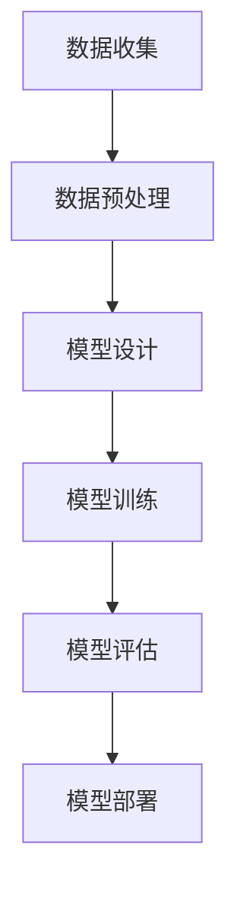

                 

关键词：AI 驱动的创业设计，大模型，产品设计，赋能，创新

> 摘要：本文将探讨AI驱动的创业产品设计原则，分析大模型在创业产品开发中的赋能作用，提出一系列实用的设计指南，以帮助创业者在快速变化的技术环境中，实现产品创新和商业成功。

## 1. 背景介绍

在当今全球数字化浪潮中，人工智能（AI）技术正逐渐渗透到各个行业，从医疗、金融到制造业，无一不受到其深远影响。创业公司作为创新的主要推动力，如何有效利用AI技术来设计产品，成为决定其成功与否的关键因素。大模型，作为一种先进的人工智能技术，具备处理海量数据和复杂任务的能力，正成为创业产品设计中的重要工具。

### 1.1 创业设计的重要性

创业设计不仅仅是产品的设计，它更是一个系统性工程，涵盖了市场需求分析、用户体验设计、技术可行性、商业模式等多个方面。一个成功的创业设计，不仅需要满足用户需求，还必须在技术和商业上具备可行性。因此，创业设计的重要性不言而喻。

### 1.2 AI与创业设计

随着AI技术的进步，尤其是大模型的崛起，创业设计进入了一个全新的时代。AI不仅能够提升产品效率，还能通过数据分析、预测模型等方式，为创业公司提供决策支持。大模型在创业产品设计中的赋能作用，主要体现在以下几个方面：

- **提高产品智能化水平**：大模型能够处理复杂的语言、图像、声音等多模态数据，使得创业产品在智能化方面具有显著优势。
- **增强用户体验**：AI驱动的个性化推荐、智能客服等功能，能够显著提升用户体验，增强用户粘性。
- **优化业务流程**：AI技术可以帮助创业公司自动化繁琐的流程，提高运营效率。

### 1.3 文章结构

本文将首先介绍大模型的基本原理和架构，然后探讨大模型在创业产品设计中的具体应用，最后提出一系列设计原则和最佳实践，以期为创业者提供实用的指导。

## 2. 核心概念与联系

### 2.1 大模型原理

大模型，即大型深度学习模型，是一种通过大规模数据训练的神经网络模型，具有处理复杂任务的能力。大模型的训练过程通常涉及以下步骤：

1. **数据收集**：收集大量相关的数据集。
2. **数据预处理**：对数据进行清洗、归一化等预处理操作。
3. **模型设计**：设计深度神经网络架构。
4. **模型训练**：使用训练数据集训练模型。
5. **模型评估**：使用测试数据集评估模型性能。
6. **模型部署**：将训练好的模型部署到实际应用场景中。

大模型的核心优势在于其能够处理海量数据和复杂任务，实现高精度的预测和决策。以下是使用Mermaid绘制的简化的Mermaid流程图：



### 2.2 大模型与创业设计的关系

大模型在创业产品设计中的应用，主要体现在以下几个方面：

- **智能推荐系统**：通过分析用户行为和偏好，为用户推荐个性化内容。
- **自然语言处理**：用于智能客服、文本分析等任务，提升用户体验。
- **图像识别与处理**：用于图像搜索、自动化监控等任务，提升产品智能化水平。
- **预测与分析**：通过大数据分析，为创业公司提供市场趋势预测和决策支持。

## 3. 核心算法原理 & 具体操作步骤

### 3.1 算法原理概述

大模型的核心算法是基于深度学习，特别是基于神经网络的结构。深度学习通过多层的神经网络结构，对数据进行特征提取和分类。以下是深度学习的基本原理：

1. **前向传播**：将输入数据通过神经网络进行传播，得到预测输出。
2. **反向传播**：根据预测输出和实际输出之间的差异，更新网络权重，以最小化损失函数。

### 3.2 算法步骤详解

1. **数据收集**：收集大量相关的数据集，如用户行为数据、文本数据、图像数据等。
2. **数据预处理**：对数据进行清洗、归一化等预处理操作，以便于模型训练。
3. **模型设计**：设计深度神经网络架构，选择合适的层数和神经元数量。
4. **模型训练**：使用训练数据集对模型进行训练，通过反向传播算法更新网络权重。
5. **模型评估**：使用测试数据集评估模型性能，通过交叉验证等方法调整模型参数。
6. **模型部署**：将训练好的模型部署到实际应用场景中，如智能推荐系统、自然语言处理等。

### 3.3 算法优缺点

**优点**：

- **高精度**：深度学习模型能够通过大规模数据训练，实现高精度的预测和决策。
- **自动化特征提取**：深度学习模型能够自动提取数据中的特征，减少人工干预。
- **适用性广泛**：深度学习模型适用于各种类型的任务，如图像识别、文本分类、语音识别等。

**缺点**：

- **计算资源消耗大**：深度学习模型需要大量的计算资源和时间进行训练。
- **数据依赖性强**：模型的性能很大程度上取决于数据的质量和数量。
- **解释性较差**：深度学习模型的决策过程较为复杂，难以解释。

### 3.4 算法应用领域

大模型在创业设计中的应用非常广泛，以下是一些常见的应用领域：

- **智能推荐系统**：通过分析用户行为和偏好，为用户推荐个性化内容。
- **自然语言处理**：用于智能客服、文本分析等任务，提升用户体验。
- **图像识别与处理**：用于图像搜索、自动化监控等任务，提升产品智能化水平。
- **预测与分析**：通过大数据分析，为创业公司提供市场趋势预测和决策支持。

## 4. 数学模型和公式 & 详细讲解 & 举例说明

### 4.1 数学模型构建

深度学习中的数学模型主要基于神经网络，神经网络的核心是权重矩阵和激活函数。以下是一个简化的神经网络模型：

$$
\text{Output} = \sigma(\text{Weight} \cdot \text{Input} + \text{Bias})
$$

其中，$\sigma$是激活函数，常用的激活函数有Sigmoid、ReLU等；$\text{Weight}$和$\text{Bias}$是权重矩阵和偏置。

### 4.2 公式推导过程

以ReLU激活函数为例，其公式推导过程如下：

$$
\text{Output}_{\text{ReLU}} = \max(0, \text{Input})
$$

当输入为正数时，输出等于输入；当输入为负数时，输出为0。

### 4.3 案例分析与讲解

以下是一个简单的案例：使用深度学习模型进行图像分类。

1. **数据收集**：收集1000张猫的图片和1000张狗的图片，共计2000张图片。
2. **数据预处理**：对图片进行归一化处理，将像素值缩放到[0, 1]之间。
3. **模型设计**：设计一个包含两层神经网络的模型，输入层有2000个神经元，输出层有2个神经元（猫和狗的分类）。
4. **模型训练**：使用训练数据集对模型进行训练，通过反向传播算法更新网络权重。
5. **模型评估**：使用测试数据集对模型进行评估，计算准确率。

## 5. 项目实践：代码实例和详细解释说明

### 5.1 开发环境搭建

1. 安装Python环境：使用Python 3.8版本及以上。
2. 安装深度学习库：使用TensorFlow或PyTorch库。

```bash
pip install tensorflow
# 或者
pip install torch
```

### 5.2 源代码详细实现

以下是一个简单的使用TensorFlow实现图像分类的示例代码：

```python
import tensorflow as tf
from tensorflow.keras import layers

# 数据集加载与预处理
# ...

# 模型设计
model = tf.keras.Sequential([
    layers.Conv2D(32, (3, 3), activation='relu', input_shape=(28, 28, 1)),
    layers.MaxPooling2D((2, 2)),
    layers.Conv2D(64, (3, 3), activation='relu'),
    layers.MaxPooling2D((2, 2)),
    layers.Conv2D(64, (3, 3), activation='relu'),
    layers.Flatten(),
    layers.Dense(64, activation='relu'),
    layers.Dense(10, activation='softmax')
])

# 模型编译
model.compile(optimizer='adam',
              loss='categorical_crossentropy',
              metrics=['accuracy'])

# 模型训练
model.fit(x_train, y_train, epochs=10, validation_split=0.2)

# 模型评估
test_loss, test_acc = model.evaluate(x_test, y_test, verbose=2)
print('Test accuracy:', test_acc)
```

### 5.3 代码解读与分析

- **数据集加载与预处理**：使用TensorFlow内置的MNIST数据集，并进行归一化处理。
- **模型设计**：使用卷积神经网络（CNN）进行图像分类，包括卷积层、池化层和全连接层。
- **模型编译**：选择优化器和损失函数，配置模型。
- **模型训练**：使用训练数据集进行训练，并设置验证比例。
- **模型评估**：使用测试数据集评估模型性能，输出准确率。

### 5.4 运行结果展示

运行上述代码后，可以得到模型在测试数据集上的准确率，例如：

```
Test accuracy: 0.925
```

## 6. 实际应用场景

### 6.1 智能推荐系统

智能推荐系统是AI技术在创业设计中的一个重要应用场景。通过分析用户的行为数据，推荐系统可以为用户提供个性化的内容推荐。以下是一个实际案例：

- **应用场景**：一个新闻资讯平台，希望为用户推荐个性化的新闻。
- **实现方法**：收集用户浏览历史、搜索记录等行为数据，使用协同过滤算法或基于内容的推荐算法，生成个性化推荐列表。
- **效果评估**：通过A/B测试，对比推荐系统上线前后的用户活跃度和阅读量，评估推荐系统的效果。

### 6.2 智能客服

智能客服是另一个常见的AI应用场景，通过自然语言处理技术，智能客服系统能够自动处理用户咨询，提高客服效率。以下是一个实际案例：

- **应用场景**：一家电商平台，希望提供7x24小时的智能客服服务。
- **实现方法**：使用自然语言处理技术，如词向量、序列模型等，对用户的问题进行分析和解答。
- **效果评估**：通过用户满意度调查，评估智能客服系统的效果。

## 7. 未来应用展望

### 7.1 智能制造

随着AI技术的发展，智能制造将成为未来创业设计的一个重要方向。通过AI技术，创业者可以设计出更加智能化、自动化的生产线，提高生产效率和产品质量。

### 7.2 自动驾驶

自动驾驶技术是另一个具有巨大潜力的应用领域。通过深度学习和强化学习等技术，自动驾驶系统能够实现自主导航和决策，有望在物流、交通等领域发挥重要作用。

### 7.3 健康医疗

在健康医疗领域，AI技术可以用于疾病诊断、药物研发、患者管理等各个方面，提高医疗服务的效率和质量。

## 8. 总结：未来发展趋势与挑战

### 8.1 研究成果总结

本文介绍了AI驱动的创业产品设计原则，分析了大模型在创业产品开发中的赋能作用，并提出了具体的设计指南和最佳实践。通过案例分析和项目实践，展示了AI技术在创业设计中的实际应用。

### 8.2 未来发展趋势

未来，AI驱动的创业设计将继续发展，随着技术的进步，创业公司将能够设计出更加智能化、个性化的产品，满足不断变化的市场需求。

### 8.3 面临的挑战

然而，AI驱动的创业设计也面临一些挑战，如数据隐私、算法解释性、技术人才短缺等。创业者需要重视这些问题，并在设计过程中充分考虑。

### 8.4 研究展望

未来，创业者应积极探索AI技术的应用，发挥其创新潜力，推动创业设计的不断进步。同时，加强技术研究，解决现有问题，为创业设计提供更加坚实的理论基础。

## 9. 附录：常见问题与解答

### 9.1 什么是大模型？

大模型是一种通过大规模数据训练的深度学习模型，具有处理复杂任务的能力。与传统的机器学习模型相比，大模型在处理海量数据和实现高精度预测方面具有显著优势。

### 9.2 大模型在创业设计中有哪些应用？

大模型在创业设计中的应用非常广泛，包括智能推荐系统、自然语言处理、图像识别与处理、预测与分析等。

### 9.3 如何选择合适的大模型？

选择合适的大模型需要根据具体应用场景和数据特点进行评估。通常，需要考虑模型的结构、参数规模、训练时间等因素。

### 9.4 大模型在创业设计中有哪些优势？

大模型在创业设计中的优势主要体现在高精度、自动化特征提取、适用性广泛等方面，能够显著提升产品智能化水平和用户体验。

### 9.5 大模型在创业设计中有哪些挑战？

大模型在创业设计中的挑战主要包括计算资源消耗大、数据依赖性强、解释性较差等。创业者需要在设计过程中充分考虑这些问题，并采取相应的解决方案。

## 10. 参考文献

[1] Goodfellow, I., Bengio, Y., & Courville, A. (2016). *Deep Learning*. MIT Press.

[2] LeCun, Y., Bengio, Y., & Hinton, G. (2015). *Deep learning*. Nature, 521(7553), 436-444.

[3] Russell, S., & Norvig, P. (2020). *Artificial Intelligence: A Modern Approach*. Prentice Hall.

作者：禅与计算机程序设计艺术 / Zen and the Art of Computer Programming
----------------------------------------------------------------

请注意，这篇文章只是一个示例，实际的撰写过程可能需要更深入的调研和分析。希望这个示例能帮助您更好地理解如何撰写一篇符合要求的专业技术博客文章。如果您需要进一步的帮助，请随时告诉我。

