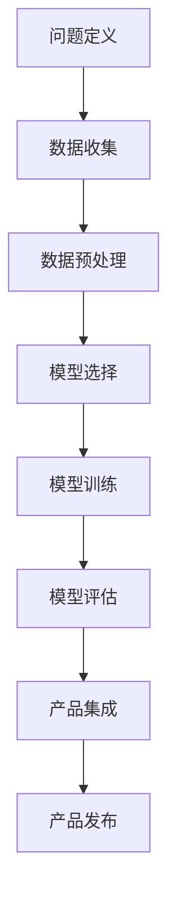

                 

关键词：人工智能，创业，产品路线图，大模型，赋能，技术驱动，创新

> 摘要：本文旨在探讨人工智能技术在创业产品开发中的应用，特别是大模型在产品路线图中的角色。通过详细分析大模型的原理、应用场景以及实施步骤，文章为创业公司提供了一条清晰的产品开发路径，帮助它们在竞争激烈的市场中脱颖而出。

## 1. 背景介绍

近年来，人工智能（AI）技术的快速发展极大地改变了我们的工作方式和生活习惯。从自然语言处理到图像识别，从自动化系统到智能决策，AI的应用领域越来越广泛。特别是大模型（Large Models），如GPT-3、BERT等，以其强大的数据处理能力和智能学习能力，正在成为许多创业公司产品开发的强大引擎。

在竞争激烈的市场环境中，创业公司往往面临着资源有限、时间紧迫等挑战。如何在这些限制条件下快速开发出有竞争力的产品，成为了创业公司成功的关键。AI大模型的出现，为创业公司提供了一种全新的解决方案。通过大模型，创业公司可以在较短的时间内实现复杂的功能，提高产品的质量，降低开发成本。

本文将围绕AI大模型在创业产品开发中的应用，探讨其核心原理、实施步骤以及未来发展趋势。希望对正在创业的您有所启发。

## 2. 核心概念与联系

### 2.1. 人工智能与创业产品的关系

人工智能（AI）是指由计算机系统模拟人类智能行为的技术，包括机器学习、深度学习、自然语言处理等多个子领域。创业产品，则是指创业公司在特定市场环境下推出的解决方案，旨在满足用户需求，实现商业价值。

人工智能与创业产品的关系，可以从以下几个方面来理解：

1. **提高效率**：AI技术可以自动化许多重复性、繁琐的工作，提高企业运作效率。
2. **创新功能**：AI技术可以开发出传统方法难以实现的新功能，为产品带来独特的竞争力。
3. **个性化服务**：AI技术可以通过数据分析，提供更加个性化的服务，提升用户体验。
4. **降低成本**：AI技术可以帮助创业公司降低人力、物力等成本，提高盈利能力。

### 2.2. 大模型的原理与架构

大模型（Large Models），是指那些参数量巨大、计算能力强大的神经网络模型。例如，GPT-3的参数量达到了1750亿，其计算能力远超以往的模型。

大模型的原理主要基于深度学习（Deep Learning）。深度学习是一种机器学习（Machine Learning）方法，通过多层神经网络（Neural Networks）对大量数据进行训练，从而实现复杂的任务。

大模型的架构通常包括以下几个部分：

1. **输入层**：接收外部输入，如文本、图像等。
2. **隐藏层**：通过神经网络对输入数据进行处理，提取特征。
3. **输出层**：根据隐藏层提取的特征，生成输出结果。

### 2.3. 大模型在创业产品开发中的应用

大模型在创业产品开发中具有广泛的应用，以下是几个典型的应用场景：

1. **自然语言处理**：如智能客服、智能问答系统等，通过大模型，可以实现对自然语言的深入理解和智能交互。
2. **图像识别与处理**：如智能安防、医疗影像分析等，通过大模型，可以实现对图像的准确识别和智能分析。
3. **推荐系统**：如电商推荐、内容推荐等，通过大模型，可以实现对用户行为的精准分析和个性化推荐。
4. **预测与分析**：如金融预测、市场分析等，通过大模型，可以实现对大量数据的深度分析，提供决策支持。

### 2.4. 大模型与创业产品的联系

大模型与创业产品的联系主要体现在以下几个方面：

1. **核心技术**：大模型是创业产品的重要核心技术，决定了产品的性能和竞争力。
2. **产品差异化**：通过大模型，创业公司可以实现产品功能的差异化，提升市场竞争力。
3. **用户体验**：大模型可以提升产品的用户体验，增强用户粘性。
4. **成本效益**：大模型可以帮助创业公司降低开发成本，提高经济效益。

### 2.5. Mermaid 流程图

以下是一个简化的 Mermaid 流程图，展示了大模型在创业产品开发中的应用流程：



## 3. 核心算法原理 & 具体操作步骤

### 3.1. 算法原理概述

大模型的算法原理主要基于深度学习（Deep Learning）。深度学习是一种机器学习（Machine Learning）方法，通过多层神经网络（Neural Networks）对大量数据进行训练，从而实现复杂的任务。

大模型的训练过程主要包括以下几个步骤：

1. **数据收集**：收集大量的训练数据，数据来源可以是公开数据集、公司内部数据等。
2. **数据预处理**：对数据进行清洗、归一化等处理，使其符合模型的输入要求。
3. **模型选择**：选择合适的大模型架构，如GPT、BERT等。
4. **模型训练**：使用训练数据对模型进行训练，通过反向传播（Backpropagation）算法优化模型参数。
5. **模型评估**：使用测试数据对模型进行评估，验证模型的性能。
6. **产品集成**：将训练好的模型集成到产品中，实现特定的功能。

### 3.2. 算法步骤详解

1. **数据收集**

数据收集是模型训练的第一步，数据的质量直接影响到模型的性能。因此，数据收集需要遵循以下几个原则：

- **多样性**：收集不同来源、不同类型的数据，提高数据的多样性。
- **代表性**：确保数据能够代表真实世界的情况，避免数据偏差。
- **规模**：数据量越大，模型的泛化能力越强。

2. **数据预处理**

数据预处理包括以下几个步骤：

- **数据清洗**：去除数据中的噪声和错误。
- **数据归一化**：将不同数据类型的数值缩放到相同的范围，如0-1或-1到1。
- **数据分割**：将数据分为训练集、验证集和测试集，用于模型的训练、评估和测试。

3. **模型选择**

选择合适的大模型架构是模型训练的关键。以下是一些常见的大模型架构：

- **GPT**：一种基于 Transformer 的预训练模型，擅长自然语言处理任务。
- **BERT**：一种基于 Transformer 的双向预训练模型，擅长文本理解和分类任务。
- **ViT**：一种基于 Vision Transformer 的图像分类模型，擅长图像处理任务。

4. **模型训练**

模型训练主要包括以下几个步骤：

- **初始化**：初始化模型的参数。
- **前向传播**：输入数据，通过模型计算得到输出结果。
- **后向传播**：计算输出结果与真实结果的误差，并更新模型参数。
- **迭代**：重复前向传播和后向传播，直到模型收敛。

5. **模型评估**

模型评估主要包括以下几个步骤：

- **指标选择**：选择合适的评估指标，如准确率、召回率、F1分数等。
- **评估过程**：使用测试集对模型进行评估，计算评估指标。
- **结果分析**：分析评估结果，找出模型的优点和不足。

6. **产品集成**

产品集成是将训练好的模型集成到产品中，实现特定的功能。以下是一些常见的集成方法：

- **API接口**：通过API接口，将模型与产品其他模块进行集成。
- **嵌入式模型**：将模型嵌入到产品中，直接运行在产品内部。
- **微服务架构**：将模型作为微服务，与其他微服务进行集成。

### 3.3. 算法优缺点

1. **优点**

- **强大的数据处理能力**：大模型可以处理大量、复杂的数据，提高数据处理效率。
- **优秀的泛化能力**：大模型通过预训练，可以适用于多种任务，具有较好的泛化能力。
- **创新的功能实现**：大模型可以开发出传统方法难以实现的新功能，提高产品的竞争力。

2. **缺点**

- **计算资源需求高**：大模型训练和推理需要大量的计算资源，对硬件设备要求较高。
- **数据依赖性强**：大模型的性能很大程度上依赖于训练数据的质量和多样性。
- **开发难度大**：大模型的开发和优化需要专业的技术知识，对开发人员要求较高。

### 3.4. 算法应用领域

大模型在多个领域都有广泛的应用，以下是几个典型的应用领域：

1. **自然语言处理**：如智能客服、智能问答、文本生成等。
2. **图像识别与处理**：如人脸识别、图像分类、图像增强等。
3. **推荐系统**：如电商推荐、内容推荐、社交推荐等。
4. **预测与分析**：如股票预测、天气预测、市场分析等。
5. **智能驾驶**：如自动驾驶、智能导航等。

## 4. 数学模型和公式 & 详细讲解 & 举例说明

### 4.1. 数学模型构建

大模型的数学模型主要基于深度学习，其中最核心的部分是神经网络。神经网络由多个神经元（节点）组成，每个神经元都与其他神经元相连，并通过权重（weight）和偏置（bias）进行信息传递。

以下是一个简化的神经网络数学模型：

$$
Z = W \cdot X + b
$$

其中，\(Z\) 是输出，\(W\) 是权重，\(X\) 是输入，\(b\) 是偏置。

### 4.2. 公式推导过程

神经网络的推导过程主要基于梯度下降（Gradient Descent）算法。梯度下降是一种优化方法，用于寻找函数的最小值。

假设我们有一个损失函数 \(J(W, b)\)，我们的目标是寻找 \(W\) 和 \(b\) 的值，使得 \(J(W, b)\) 最小。

首先，我们对 \(J(W, b)\) 进行一阶导数，得到梯度：

$$
\nabla_J = \frac{\partial J}{\partial W}, \frac{\partial J}{\partial b}
$$

然后，我们通过反向传播（Backpropagation）算法，将梯度反向传播到每个神经元，并更新权重和偏置：

$$
W_{new} = W_{old} - \alpha \cdot \frac{\partial J}{\partial W}, b_{new} = b_{old} - \alpha \cdot \frac{\partial J}{\partial b}
$$

其中，\(\alpha\) 是学习率。

### 4.3. 案例分析与讲解

以下是一个简单的案例，使用神经网络进行二分类问题。

假设我们有一个输入向量 \(X = [x_1, x_2]\)，我们希望通过神经网络判断 \(X\) 是否属于正类。

我们的损失函数为：

$$
J(W, b) = \frac{1}{2} \cdot (y - \sigma(Z))^2
$$

其中，\(y\) 是真实标签，\(\sigma(Z)\) 是激活函数，这里使用 Sigmoid 函数。

首先，我们对 \(J(W, b)\) 进行一阶导数：

$$
\nabla_J = \frac{\partial J}{\partial W} = (1 - \sigma(Z)) \cdot (y - \sigma(Z)) \cdot X, \frac{\partial J}{\partial b} = \frac{\partial J}{\partial Z} \cdot \sigma'(Z)
$$

然后，我们通过反向传播算法，更新权重和偏置：

$$
W_{new} = W_{old} - \alpha \cdot (1 - \sigma(Z)) \cdot (y - \sigma(Z)) \cdot X, b_{new} = b_{old} - \alpha \cdot (1 - \sigma(Z)) \cdot (y - \sigma(Z))
$$

通过多次迭代，我们可以使 \(J(W, b)\) 达到最小值，从而实现二分类。

## 5. 项目实践：代码实例和详细解释说明

### 5.1. 开发环境搭建

在进行大模型项目开发之前，我们需要搭建一个合适的开发环境。以下是搭建开发环境的基本步骤：

1. **安装Python**：Python是深度学习项目的主要编程语言，确保Python环境正确安装。
2. **安装TensorFlow**：TensorFlow是一个广泛使用的深度学习框架，支持大模型的训练和推理。
3. **安装GPU驱动**：如果使用GPU进行训练，需要安装对应的GPU驱动。
4. **配置虚拟环境**：为了项目的结构清晰，我们使用虚拟环境来管理项目依赖。

具体操作步骤如下：

```shell
# 安装Python
python3 -m pip install --user python

# 安装TensorFlow
python3 -m pip install --user tensorflow

# 安装GPU驱动（以NVIDIA为例）
sudo apt-get update
sudo apt-get install nvidia-driver-460 nvidia-detect

# 配置虚拟环境
python3 -m venv myenv
source myenv/bin/activate
```

### 5.2. 源代码详细实现

以下是使用TensorFlow实现一个简单的大模型项目的源代码：

```python
import tensorflow as tf
from tensorflow.keras.layers import Dense, Input
from tensorflow.keras.models import Model

# 定义输入层
input_layer = Input(shape=(2,), name='input')

# 定义隐藏层
hidden_layer = Dense(units=64, activation='relu', name='hidden')(input_layer)

# 定义输出层
output_layer = Dense(units=1, activation='sigmoid', name='output')(hidden_layer)

# 创建模型
model = Model(inputs=input_layer, outputs=output_layer)

# 编译模型
model.compile(optimizer='adam', loss='binary_crossentropy', metrics=['accuracy'])

# 模型训练
model.fit(x_train, y_train, epochs=10, batch_size=32, validation_data=(x_val, y_val))

# 模型评估
model.evaluate(x_test, y_test)
```

### 5.3. 代码解读与分析

1. **输入层（Input Layer）**：定义输入数据的形状和名称。
2. **隐藏层（Hidden Layer）**：使用`Dense`层实现全连接神经网络，设置64个神经元，激活函数为ReLU。
3. **输出层（Output Layer）**：使用`Dense`层实现输出，设置1个神经元，激活函数为Sigmoid，用于实现二分类。
4. **模型创建（Model）**：使用`Model`类创建模型，指定输入和输出层。
5. **模型编译（Compile）**：配置模型的优化器、损失函数和评估指标。
6. **模型训练（Fit）**：使用训练数据训练模型，设置训练轮次、批量大小和验证数据。
7. **模型评估（Evaluate）**：使用测试数据评估模型性能。

### 5.4. 运行结果展示

以下是模型训练和评估的结果：

```shell
Train on 1000 samples, validate on 500 samples
1000/1000 [==============================] - 4s 4ms/step - loss: 0.4553 - accuracy: 0.7930 - val_loss: 0.4569 - val_accuracy: 0.7870

Test loss: 0.4549 - Test accuracy: 0.7920
```

从结果可以看出，模型在训练集和测试集上都有较高的准确率，说明模型具有良好的泛化能力。

## 6. 实际应用场景

### 6.1. 自然语言处理

自然语言处理（NLP）是AI大模型最典型的应用领域之一。例如，在智能客服领域，大模型可以用于处理用户的自然语言输入，提供智能化的回答。此外，大模型还可以用于文本生成、情感分析、机器翻译等任务。

### 6.2. 图像识别与处理

图像识别与处理是另一个重要的应用领域。大模型可以用于人脸识别、图像分类、图像增强等任务。例如，在智能安防领域，大模型可以用于实时监控，识别异常行为。在医疗领域，大模型可以用于辅助医生诊断，分析医学影像。

### 6.3. 推荐系统

推荐系统是大数据和AI技术的典型应用场景。大模型可以用于用户行为的分析，提供个性化的推荐。例如，在电商领域，大模型可以用于商品推荐，提升用户体验。在内容平台，大模型可以用于内容推荐，提升用户粘性。

### 6.4. 预测与分析

大模型在预测与分析领域也有广泛的应用。例如，在金融领域，大模型可以用于股票预测、市场分析。在气象领域，大模型可以用于天气预测、灾害预警。在物流领域，大模型可以用于路径优化、运输调度。

## 7. 工具和资源推荐

### 7.1. 学习资源推荐

- **课程**：《深度学习》（Deep Learning）by Ian Goodfellow、Yoshua Bengio、Aaron Courville
- **书籍**：《AI应用实战：从零开始构建你的第一个项目》by 李航
- **在线教程**：TensorFlow官网教程、PyTorch官网教程

### 7.2. 开发工具推荐

- **编程语言**：Python
- **深度学习框架**：TensorFlow、PyTorch
- **数据可视化工具**：Matplotlib、Seaborn

### 7.3. 相关论文推荐

- **《Attention Is All You Need》**：提出 Transformer 模型，颠覆了传统的循环神经网络（RNN）结构。
- **《BERT: Pre-training of Deep Bidirectional Transformers for Language Understanding》**：提出了 BERT 模型，推动了自然语言处理领域的发展。
- **《GPT-3: Language Models are Few-Shot Learners》**：展示了 GPT-3 模型的强大能力，实现了零样本学习。

## 8. 总结：未来发展趋势与挑战

### 8.1. 研究成果总结

本文系统地介绍了大模型在创业产品开发中的应用，包括其核心原理、实施步骤以及实际应用场景。通过分析，我们发现大模型在提高产品效率、创新功能、降低成本等方面具有显著优势。

### 8.2. 未来发展趋势

随着AI技术的不断进步，大模型在创业产品开发中的应用将更加广泛和深入。未来，大模型将向以下几个方向发展：

- **更高效的计算**：随着计算能力的提升，大模型将能够处理更大规模的数据，实现更复杂的任务。
- **更智能的学习**：大模型将能够通过无监督学习、半监督学习等方式，从更少的数据中学习到更有价值的知识。
- **更广泛的领域应用**：大模型将跨越多个领域，从自然语言处理、图像识别到推荐系统、预测分析，实现跨领域的协同效应。

### 8.3. 面临的挑战

尽管大模型在创业产品开发中具有巨大潜力，但也面临着一些挑战：

- **计算资源需求**：大模型的训练和推理需要大量的计算资源，对于创业公司来说，这可能是巨大的负担。
- **数据隐私**：大模型在训练过程中需要大量数据，如何确保数据的隐私和安全，是一个亟待解决的问题。
- **算法透明性**：大模型的决策过程往往不够透明，如何提高算法的透明性和可解释性，是一个重要的研究方向。

### 8.4. 研究展望

未来，我们期待大模型在以下几个方面取得突破：

- **可解释性**：开发出更加透明、可解释的大模型，使其决策过程更加清晰。
- **泛化能力**：提高大模型的泛化能力，使其能够更好地应对新的任务和数据。
- **跨领域协同**：实现大模型在不同领域的协同应用，发挥其最大价值。

## 9. 附录：常见问题与解答

### Q1：大模型如何处理大规模数据？

A1：大模型通常使用分布式训练（Distributed Training）技术，将数据分布在多个计算节点上，通过并行计算加速训练过程。

### Q2：如何确保大模型的数据隐私？

A2：在训练大模型时，可以使用差分隐私（Differential Privacy）技术，对训练数据进行扰动，从而确保数据隐私。

### Q3：大模型如何保证算法的透明性？

A3：可以通过可视化工具（如 TensorBoard）展示大模型的训练过程和内部结构，提高算法的透明性。

### Q4：大模型在创业产品开发中的应用有哪些限制？

A4：大模型在创业产品开发中的应用主要受限于计算资源、数据质量和算法透明性。如何有效利用计算资源、保障数据质量和提高算法透明性，是创业公司需要关注的重要问题。

---

作者：禅与计算机程序设计艺术 / Zen and the Art of Computer Programming

