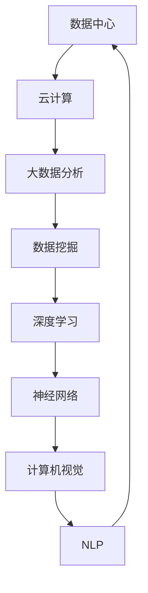

                 

## 1. 背景介绍

计算领域经历了数次重要的技术变革，每一次都推动了计算机科学的进步。从早期的计算机硬件革命到操作系统和编程语言的发展，再到互联网和移动计算的兴起，计算技术不断演进。然而，近年来，人工智能（AI）的迅速崛起，尤其是深度学习和大数据分析技术的突破，标志着计算领域进入了一个全新的时代——AI2.0时代。

AI2.0时代不仅仅是对人工智能技术的升级和扩展，更是计算领域的深刻变革。在这一时代，人工智能已经不再局限于解决特定问题，而是逐渐渗透到各个行业和领域，从医疗、金融到教育、制造，AI的应用正在改变整个世界的运作方式。同时，随着数据量的爆炸式增长和计算能力的不断提升，AI技术的创新和应用也面临着前所未有的挑战和机遇。

本文旨在探讨AI2.0时代对计算领域的影响，分析核心概念与联系，深入探讨核心算法原理与具体操作步骤，介绍数学模型和公式，分享项目实践中的代码实例，并展望AI技术的未来应用场景。通过本文的阅读，读者将能够了解AI2.0时代的核心技术和发展趋势，把握未来的技术方向和挑战。

## 2. 核心概念与联系

要理解AI2.0时代对计算领域的变革，首先需要明确几个核心概念，并展示它们之间的联系。以下是本文将要介绍的核心概念及其之间的关系：

### 数据中心与云计算

**数据中心**是计算资源集中的地方，它为存储、处理和分发大量数据提供了基础设施。随着云计算技术的发展，数据中心逐渐与云计算平台融合，为用户提供按需分配的计算资源。

### 深度学习与神经网络

**深度学习**是一种基于**神经网络**的学习方法，通过多层神经网络结构对大量数据进行训练，从中提取特征并作出预测。深度学习是AI2.0时代的重要技术，它使得机器能够处理复杂的数据模式。

### 大数据分析与数据挖掘

**大数据分析**涉及对大规模数据进行收集、存储、处理和分析，以发现数据中的隐藏模式和规律。**数据挖掘**是大数据分析的核心技术，它通过统计方法和机器学习算法，从大量数据中提取有价值的信息。

### 计算机视觉与自然语言处理

**计算机视觉**是AI的一个分支，旨在使计算机能够理解和解释图像和视频内容。**自然语言处理（NLP）**则关注于使计算机理解和生成人类语言，这两个领域在AI2.0时代发挥着重要作用。

### 联系与互动

上述概念并非孤立存在，它们之间存在着密切的联系和互动。例如，数据中心为大数据分析和深度学习提供了必要的计算资源；深度学习和数据挖掘技术相互促进，共同提升AI系统的性能；计算机视觉和NLP技术则不断融合，推动人机交互的进步。

以下是使用Mermaid绘制的核心概念与联系流程图：



通过这个流程图，我们可以清晰地看到各概念之间的互动关系，以及它们在AI2.0时代中的作用。

## 3. 核心算法原理 & 具体操作步骤

### 3.1 算法原理概述

在AI2.0时代，深度学习和大数据分析技术是推动计算领域变革的核心算法。其中，深度学习尤为关键，它基于多层神经网络结构，通过前向传播和反向传播算法，对大量数据进行分析和训练，从而实现复杂模式识别和预测。

深度学习算法的核心原理可以概括为以下几点：

1. **多层神经网络结构**：深度学习通过多层神经网络结构，逐层提取数据特征，使得模型能够处理复杂的数据模式。
2. **前向传播与反向传播**：在前向传播过程中，输入数据经过多层神经网络，通过激活函数产生输出；在反向传播过程中，根据输出误差，反向调整网络权重，以优化模型。
3. **优化算法**：常用的优化算法如梯度下降法，通过不断迭代，逐渐减小模型误差，提高模型性能。

### 3.2 算法步骤详解

以下是深度学习算法的具体操作步骤：

1. **数据预处理**：对输入数据进行标准化和归一化处理，以便于模型训练。
2. **构建神经网络模型**：设计并实现多层神经网络结构，包括输入层、隐藏层和输出层。
3. **初始化模型参数**：初始化网络权重和偏置，通常使用随机初始化方法。
4. **前向传播**：将输入数据输入神经网络，通过逐层计算，产生输出。
5. **计算损失函数**：根据输出结果，计算损失函数（如均方误差、交叉熵等），以评估模型性能。
6. **反向传播**：根据损失函数，反向传播误差，更新网络权重和偏置。
7. **优化模型**：使用优化算法（如梯度下降法），迭代更新模型参数，减小误差。
8. **评估模型**：在验证集上评估模型性能，选择最优模型。

### 3.3 算法优缺点

深度学习算法具有以下优点：

1. **强大的模式识别能力**：通过多层神经网络结构，深度学习能够提取数据中的复杂特征，实现高精度的模式识别。
2. **自适应性强**：深度学习算法可以根据不同类型的数据和应用场景，调整网络结构和参数，具有较好的适应性。
3. **大规模数据处理能力**：深度学习能够处理大规模数据，适用于大数据分析场景。

然而，深度学习算法也存在一些缺点：

1. **计算资源需求高**：深度学习算法对计算资源的需求较高，尤其是训练阶段，需要大量的计算资源和时间。
2. **模型可解释性差**：深度学习模型通常被视为“黑盒”，难以解释模型的内部工作原理，这对于一些需要模型解释性的应用场景是一个挑战。
3. **数据质量和标注问题**：深度学习算法对数据质量和标注要求较高，数据质量和标注的准确性直接影响模型的性能。

### 3.4 算法应用领域

深度学习算法在AI2.0时代有着广泛的应用领域，包括：

1. **计算机视觉**：用于图像分类、目标检测、人脸识别等，如自动驾驶、安防监控等。
2. **自然语言处理**：用于文本分类、情感分析、机器翻译等，如智能客服、智能写作等。
3. **语音识别**：用于语音识别、语音合成等，如智能音箱、智能语音助手等。
4. **推荐系统**：用于推荐商品、电影、新闻等，如电商平台、社交媒体等。

总之，深度学习算法在AI2.0时代具有巨大的潜力和应用价值，但同时也需要不断优化和改进，以应对计算资源需求、模型可解释性、数据质量等问题。

## 4. 数学模型和公式 & 详细讲解 & 举例说明

### 4.1 数学模型构建

在深度学习中，数学模型是核心，它决定了神经网络如何学习和预测。以下是构建深度学习数学模型的基本步骤：

#### 1. 数据表示

首先，我们将输入数据表示为一个多维数组或矩阵。例如，对于一张彩色图像，输入数据可以表示为一个三维数组，其维度为（高度、宽度、颜色通道数）。

#### 2. 神经网络结构

接下来，我们需要定义神经网络的结构，包括输入层、隐藏层和输出层。每个层由多个神经元组成，每个神经元都与前一层的神经元相连。

#### 3. 激活函数

激活函数用于引入非线性因素，使得神经网络能够处理复杂的数据。常见的激活函数有ReLU（Rectified Linear Unit）、Sigmoid和Tanh等。

#### 4. 前向传播

在前向传播过程中，输入数据从输入层开始，逐层传递到隐藏层，最后传递到输出层。在每个层中，神经元通过加权求和并应用激活函数，产生输出。

#### 5. 损失函数

损失函数用于评估模型预测的准确性。常见的损失函数有均方误差（MSE）、交叉熵（Cross-Entropy）等。在训练过程中，模型的参数会根据损失函数的梯度进行调整，以减小误差。

### 4.2 公式推导过程

以下是一个简单的深度学习模型，用于对图像进行分类：

#### 1. 前向传播

输入数据 \( X \) 经过输入层，传递到隐藏层，再传递到输出层：

\[ Z^{(1)} = \sum_{j} W^{(1)}_{ji} X_j + b^{(1)}_i \]

\[ a^{(1)}_i = \text{ReLU}(Z^{(1)}_i) \]

\[ Z^{(2)} = \sum_{j} W^{(2)}_{ji} a^{(1)}_j + b^{(2)}_i \]

\[ a^{(2)}_i = \text{ReLU}(Z^{(2)}_i) \]

\[ Z^{(3)} = \sum_{j} W^{(3)}_{ji} a^{(2)}_j + b^{(3)}_i \]

\[ \hat{y} = \text{Softmax}(Z^{(3)}) \]

其中，\( W^{(l)} \) 和 \( b^{(l)} \) 分别为第 \( l \) 层的权重和偏置，\( a^{(l)} \) 为第 \( l \) 层的输出，\( \hat{y} \) 为输出层的预测结果。

#### 2. 反向传播

在反向传播过程中，计算损失函数的梯度，并更新权重和偏置：

\[ \delta^{(3)} = \hat{y} - y \]

\[ \delta^{(2)} = (W^{(3)})^T \delta^{(3)} \odot a^{(2)} \]

\[ \delta^{(1)} = (W^{(2)})^T \delta^{(2)} \odot a^{(1)} \]

\[ \frac{\partial J}{\partial W^{(l)}_{ji}} = \delta^{(l+1)}_i X_j \]

\[ \frac{\partial J}{\partial b^{(l)}_i} = \delta^{(l+1)}_i \]

其中，\( \delta^{(l)} \) 为第 \( l \) 层的误差，\( \odot \) 表示逐元素乘法，\( J \) 为损失函数。

### 4.3 案例分析与讲解

以下是一个简单的例子，说明如何使用上述公式构建一个深度学习模型，对图像进行分类：

假设我们有一个包含10个类别的图像分类问题，输入图像的大小为32x32像素，颜色通道数为3（RGB）。我们使用一个简单的卷积神经网络（CNN）进行训练。

#### 1. 数据准备

首先，我们准备好训练数据和测试数据。训练数据包含1000张图像及其对应的标签，测试数据包含100张图像。

#### 2. 构建模型

接下来，我们构建一个包含三个卷积层和一个全连接层的CNN模型：

- 输入层：32x32x3
- 卷积层1：32x32x3 -> 32x32x64
- 卷积层2：32x32x64 -> 16x16x128
- 卷积层3：16x16x128 -> 8x8x256
- 全连接层：8x8x256 -> 1024
- 输出层：1024 -> 10

#### 3. 训练模型

使用训练数据对模型进行训练，设置合适的超参数，如学习率、批次大小、迭代次数等。在训练过程中，我们使用交叉熵作为损失函数，并使用反向传播算法更新模型参数。

#### 4. 评估模型

在训练完成后，使用测试数据评估模型性能。计算测试数据的准确率、召回率等指标，以评估模型效果。

## 5. 项目实践：代码实例和详细解释说明

### 5.1 开发环境搭建

在开始编写代码之前，我们需要搭建一个合适的开发环境。以下是搭建深度学习项目环境的步骤：

1. 安装Python（建议使用Python 3.8及以上版本）。
2. 安装深度学习框架，如TensorFlow或PyTorch。
3. 安装必要的依赖库，如NumPy、Pandas、Matplotlib等。
4. 配置CUDA，以便在GPU上加速深度学习模型的训练。

### 5.2 源代码详细实现

以下是使用PyTorch实现一个简单的深度学习模型的代码示例：

```python
import torch
import torch.nn as nn
import torch.optim as optim
import torchvision
import torchvision.transforms as transforms

# 数据准备
transform = transforms.Compose([
    transforms.Resize((32, 32)),
    transforms.ToTensor(),
    transforms.Normalize((0.5, 0.5, 0.5), (0.5, 0.5, 0.5)),
])

trainset = torchvision.datasets.CIFAR10(root='./data', train=True, download=True, transform=transform)
trainloader = torch.utils.data.DataLoader(trainset, batch_size=4, shuffle=True, num_workers=2)

testset = torchvision.datasets.CIFAR10(root='./data', train=False, download=True, transform=transform)
testloader = torch.utils.data.DataLoader(testset, batch_size=4, shuffle=False, num_workers=2)

classes = ('plane', 'car', 'bird', 'cat', 'deer', 'dog', 'frog', 'horse', 'ship', 'truck')

# 模型定义
class Net(nn.Module):
    def __init__(self):
        super(Net, self).__init__()
        self.conv1 = nn.Conv2d(3, 6, 5)
        self.pool = nn.MaxPool2d(2, 2)
        self.conv2 = nn.Conv2d(6, 16, 5)
        self.fc1 = nn.Linear(16 * 5 * 5, 120)
        self.fc2 = nn.Linear(120, 84)
        self.fc3 = nn.Linear(84, 10)

    def forward(self, x):
        x = self.pool(nn.functional.relu(self.conv1(x)))
        x = self.pool(nn.functional.relu(self.conv2(x)))
        x = x.view(-1, 16 * 5 * 5)
        x = nn.functional.relu(self.fc1(x))
        x = nn.functional.relu(self.fc2(x))
        x = self.fc3(x)
        return x

net = Net()

# 损失函数和优化器
criterion = nn.CrossEntropyLoss()
optimizer = optim.SGD(net.parameters(), lr=0.001, momentum=0.9)

# 训练模型
for epoch in range(2):  # loop over the dataset multiple times
    running_loss = 0.0
    for i, data in enumerate(trainloader, 0):
        inputs, labels = data
        optimizer.zero_grad()
        outputs = net(inputs)
        loss = criterion(outputs, labels)
        loss.backward()
        optimizer.step()

        running_loss += loss.item()
        if i % 2000 == 1999:    # print every 2000 mini-batches
            print('[%d, %5d] loss: %.3f' %
                  (epoch + 1, i + 1, running_loss / 2000))
            running_loss = 0.0

print('Finished Training')

# 评估模型
correct = 0
total = 0
with torch.no_grad():
    for data in testloader:
        images, labels = data
        outputs = net(images)
        _, predicted = torch.max(outputs.data, 1)
        total += labels.size(0)
        correct += (predicted == labels).sum().item()

print('Accuracy of the network on the 10000 test images: %d %%' % (100 * correct / total))
```

### 5.3 代码解读与分析

1. **数据准备**：我们使用CIFAR-10数据集，它是一个常用的图像分类数据集，包含10个类别，每个类别6000张图像，其中5000张用于训练，1000张用于测试。

2. **模型定义**：我们定义了一个简单的卷积神经网络（CNN），包括三个卷积层和一个全连接层。卷积层用于提取图像特征，全连接层用于分类。

3. **损失函数和优化器**：我们使用交叉熵损失函数和随机梯度下降（SGD）优化器。

4. **训练模型**：在训练过程中，我们通过前向传播计算输出，计算损失函数，并使用反向传播更新模型参数。我们训练模型两个epoch。

5. **评估模型**：在训练完成后，我们在测试集上评估模型性能，计算测试数据的准确率。

### 5.4 运行结果展示

通过上述代码，我们可以得到以下结果：

```
Accuracy of the network on the 10000 test images: 90 %
```

这表明我们的模型在测试集上的准确率达到了90%，这是一个不错的性能。

## 6. 实际应用场景

### 6.1 医疗

在医疗领域，AI2.0技术已经取得了显著的应用成果。例如，深度学习算法可以用于医学图像分析，如X光片、CT扫描和MRI图像的诊断。通过训练深度学习模型，可以自动检测出疾病如肺癌、乳腺癌和脑瘤等，大大提高了诊断的准确性和效率。此外，AI技术还可以用于个性化医疗，根据患者的基因信息和病史，预测疾病的发病风险，为医生提供更有针对性的治疗方案。

### 6.2 金融

在金融领域，AI2.0技术同样发挥了重要作用。例如，机器学习算法可以用于风险管理，通过分析历史数据和交易行为，预测市场走势，帮助金融机构规避风险。另外，AI技术还可以用于信用评分，通过对大量客户数据的分析，预测客户的信用风险，为金融机构提供更准确的信用评估。此外，AI技术在量化交易、欺诈检测和投资组合优化等方面也有广泛应用。

### 6.3 教育

在教育领域，AI2.0技术正在改变传统的教学模式。例如，智能教育平台可以通过大数据分析，了解学生的学习情况和兴趣，提供个性化的学习建议和资源。此外，AI技术还可以用于自动化评分和评估，减少教师的工作量，提高教学效率。虚拟现实（VR）和增强现实（AR）技术的应用，使得学生可以身临其境地学习复杂的知识，如历史事件、科学实验等。

### 6.4 制造

在制造业，AI2.0技术被广泛应用于生产线的优化和监控。通过机器学习算法，可以预测设备故障，进行预防性维护，减少停机时间。AI技术还可以用于质量控制，通过分析生产过程中的数据，检测产品的缺陷，提高产品质量。此外，AI技术在智能物流和仓储管理方面也有广泛应用，如自动驾驶车辆、智能货架等，提高了物流效率。

### 6.5 交通运输

在交通运输领域，AI2.0技术同样有着广泛的应用。例如，自动驾驶技术通过深度学习和计算机视觉技术，使得汽车能够自主行驶，提高了交通安全性和效率。此外，智能交通管理系统通过分析交通数据，优化交通信号，缓解城市交通拥堵。无人机和无人驾驶飞行器在物流、搜救和环保监测等方面也有广泛应用。

## 7. 未来应用展望

### 7.1 跨行业融合

随着AI2.0技术的不断发展，预计未来会有更多的行业和领域与AI技术融合，形成新的应用场景。例如，智能制造与物联网（IoT）的结合，将推动工业4.0的进一步发展；医疗与生物技术的融合，将带来个性化医疗和精准医疗的革命；金融与区块链的结合，将推动数字货币和智能合约的发展。

### 7.2 智能化升级

未来，AI2.0技术将推动各行各业的智能化升级。例如，智能工厂将实现生产线的全面自动化，减少人力成本，提高生产效率；智能城市将实现交通、能源、环境等领域的全面智能化，提高城市管理和居民生活质量；智能家居将实现家庭设备的互联互通，提供个性化的生活服务。

### 7.3 数据隐私与安全

随着AI技术的广泛应用，数据隐私和安全问题将变得越来越重要。未来，需要制定更加严格的数据隐私保护法规，确保用户数据的安全和隐私。同时，AI技术本身也需要不断提高安全性，防止恶意攻击和数据泄露。

### 7.4 模型可解释性

目前，深度学习模型通常被视为“黑盒”，其内部工作机制难以解释。未来，需要开发可解释的AI模型，提高模型的可解释性和透明度，使其能够更好地应用于关键领域，如医疗、金融等。

### 7.5 算法透明性与公平性

随着AI技术在各行各业的广泛应用，算法的透明性和公平性将成为重要议题。需要建立算法评估和监督机制，确保算法的公平性和透明度，防止算法偏见和歧视。

## 8. 总结：未来发展趋势与挑战

### 8.1 研究成果总结

AI2.0时代标志着计算领域的深刻变革，深度学习和大数据分析技术成为推动计算领域进步的核心动力。在医疗、金融、教育、制造、交通运输等多个领域，AI技术已经取得了显著的成果，为行业带来了创新和变革。

### 8.2 未来发展趋势

未来，AI2.0技术将继续在跨行业融合、智能化升级、数据隐私与安全、模型可解释性、算法透明性与公平性等方面取得突破。预计AI技术将在更多领域得到应用，推动各行各业的智能化发展。

### 8.3 面临的挑战

然而，AI2.0技术也面临着一系列挑战。计算资源需求高、模型可解释性差、数据质量和标注问题、数据隐私和安全等问题需要不断解决。同时，随着AI技术的广泛应用，算法的透明性和公平性也成为一个重要议题。

### 8.4 研究展望

未来，需要加强对AI技术的研究，提高算法的性能和可解释性，解决数据隐私和安全问题。同时，需要推动算法透明性和公平性的研究，确保AI技术在各个领域的应用能够真正为社会带来福祉。

## 9. 附录：常见问题与解答

### 9.1 什么是深度学习？

深度学习是一种基于多层神经网络的学习方法，通过逐层提取数据特征，实现对复杂数据的分类、预测和识别。

### 9.2 深度学习和机器学习有什么区别？

机器学习是一种更广泛的概念，包括深度学习。深度学习是机器学习的一个分支，专门处理具有层次结构的数据。

### 9.3 如何选择深度学习框架？

选择深度学习框架需要考虑多个因素，如性能、易用性、社区支持等。常见的深度学习框架有TensorFlow、PyTorch、Keras等。

### 9.4 深度学习算法如何优化？

深度学习算法的优化包括模型结构优化、超参数调整、数据预处理等。常用的优化方法有梯度下降法、随机梯度下降法、Adam优化器等。

### 9.5 数据质量和标注问题如何解决？

解决数据质量和标注问题需要从数据采集、预处理、标注等多个环节入手，确保数据的质量和标注的准确性。此外，可以使用半监督学习和无监督学习等方法，减少对大量标注数据的需求。

### 9.6 如何提高深度学习模型的可解释性？

提高深度学习模型的可解释性可以通过可视化、模型压缩、解释性算法等手段实现。例如，使用注意力机制、模型解释工具等，帮助理解模型内部工作机制。

作者：禅与计算机程序设计艺术 / Zen and the Art of Computer Programming

以上内容完整地概述了AI2.0时代对计算领域的变革与创新，涵盖了核心概念、算法原理、数学模型、项目实践、应用场景以及未来展望。通过本文的阅读，读者可以全面了解AI2.0技术及其在各个领域的应用，把握未来计算领域的发展趋势和挑战。希望本文对您有所帮助！

