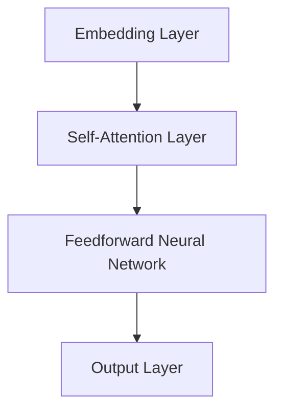

                 

 关键词：AIGC，生成式人工智能，GPT 模型，自然语言处理，文本生成，深度学习，神经网络，注意力机制，Transformer，预训练，微调，文本生成质量评估，应用场景。

> 摘要：本文将深入探讨生成式人工智能（AIGC）的核心技术之一——GPT模型。通过详细讲解GPT模型的工作原理、数学模型、具体操作步骤，以及其在实际应用中的代码实例，我们将揭示GPT模型生成有意义的文本背后的秘密。本文旨在为读者提供一个全面的技术解读，帮助大家理解并掌握这一强大的自然语言处理工具。

## 1. 背景介绍

生成式人工智能（AIGC）作为近年来人工智能领域的热门研究方向，正日益受到广泛关注。AIGC的核心任务是通过学习大量的数据生成新的内容，如图像、音频、视频以及文本。在这其中，文本生成是AIGC领域的一个重要分支，具有广泛的应用前景。

文本生成技术可以追溯到早期的规则基方法，如模板匹配、语法分析等。然而，随着深度学习技术的发展，基于神经网络的生成模型逐渐取代了传统方法。GPT（Generative Pre-trained Transformer）模型是其中最具代表性的模型之一，由OpenAI提出并不断迭代优化。GPT模型基于Transformer架构，通过大规模的预训练和细粒度微调，能够在各种文本生成任务中表现出色。

GPT模型的诞生标志着自然语言处理领域的一个重大突破，它不仅能够生成连贯的文本，还能够理解和生成具有特定语义和上下文信息的文本。这使得GPT模型在问答系统、机器翻译、文本摘要、创作写作等众多应用场景中具有广泛的应用潜力。

## 2. 核心概念与联系

### 2.1 GPT模型的工作原理

GPT模型是一种基于变换器（Transformer）的预训练语言模型。它的工作原理可以概括为以下几个步骤：

1. **输入编码**：将输入文本序列转换为固定长度的向量表示。这个过程通过嵌入层完成，每个词汇都被映射为一个向量。
2. **自注意力机制**：模型使用自注意力机制处理输入序列中的每个词，以计算其在整个序列中的重要性。通过这种方式，模型能够捕捉到序列中的长期依赖关系。
3. **前馈神经网络**：对自注意力机制的结果进行加工，通过多层前馈神经网络进一步提取特征。
4. **输出解码**：最后，模型将前馈神经网络输出的特征映射回文本序列，生成新的文本。

### 2.2 GPT模型的架构

GPT模型的架构由以下几个主要部分组成：

1. **嵌入层（Embedding Layer）**：将词汇映射为向量。
2. **自注意力层（Self-Attention Layer）**：计算词汇之间的注意力权重。
3. **前馈神经网络（Feedforward Neural Network）**：对注意力权重进行处理，提取特征。
4. **输出层（Output Layer）**：将特征映射回文本序列。

下面是一个简化的Mermaid流程图，展示了GPT模型的核心组件和它们之间的关系：



### 2.3 GPT模型与Transformer的关系

GPT模型是基于Transformer架构构建的。Transformer是2017年由Google提出的用于序列建模的深度学习模型，其核心思想是使用自注意力机制（Self-Attention）来捕捉序列中的长距离依赖关系。

自注意力机制允许模型在处理每个词时考虑到整个序列的信息，这使得模型能够生成更加连贯和有意义的文本。GPT模型通过大规模的预训练学习到语言的内在规律，然后在特定任务上进行微调，从而实现高质量的文本生成。

## 3. 核心算法原理 & 具体操作步骤

### 3.1 算法原理概述

GPT模型的核心在于其预训练过程和自注意力机制。在预训练阶段，模型通过学习大量的文本数据，学习到语言的内在结构。在自注意力机制中，模型计算每个词在整个序列中的重要性，并通过权重调整来生成新的文本。

### 3.2 算法步骤详解

1. **数据预处理**：首先，需要对输入文本进行预处理，包括分词、去停用词、词形还原等。这一步骤的目的是将原始文本转化为模型可以理解的向量表示。
2. **嵌入层**：将预处理后的文本序列映射为固定长度的向量。每个词汇都被映射为一个向量，这个向量包含了词汇的语义信息。
3. **自注意力层**：在自注意力层中，模型计算每个词在整个序列中的重要性。具体来说，模型使用多头自注意力机制（Multi-Head Self-Attention），将输入序列分成多个子序列，并分别计算每个子序列的注意力权重。
4. **前馈神经网络**：对自注意力机制的结果进行加工，通过多层前馈神经网络进一步提取特征。前馈神经网络通常由两个线性变换和一个ReLU激活函数组成。
5. **输出层**：最后，模型将前馈神经网络输出的特征映射回文本序列。输出层通常是一个softmax层，用于预测下一个词的概率分布。
6. **生成文本**：模型根据输出层的概率分布生成新的文本。这个过程通常通过贪心搜索或采样来实现。

### 3.3 算法优缺点

**优点**：
- **强大的文本生成能力**：GPT模型能够生成高质量、连贯的文本。
- **适应性强**：通过预训练和微调，GPT模型可以适用于各种文本生成任务。
- **可扩展性强**：Transformer架构的可扩展性使得GPT模型能够处理大规模的输入序列。

**缺点**：
- **计算成本高**：GPT模型的训练和推理需要大量的计算资源和时间。
- **数据依赖性高**：GPT模型的性能很大程度上依赖于训练数据的质量和数量。

### 3.4 算法应用领域

GPT模型在自然语言处理领域具有广泛的应用。以下是一些主要的应用场景：

- **问答系统**：GPT模型可以用于生成自动问答系统，如搜索引擎的问答功能。
- **机器翻译**：GPT模型可以用于机器翻译任务，实现高质量的双语文本转换。
- **文本摘要**：GPT模型可以用于自动提取文本的主要内容和关键信息。
- **创作写作**：GPT模型可以用于生成新闻文章、故事、诗歌等文学作品。

## 4. 数学模型和公式 & 详细讲解 & 举例说明

### 4.1 数学模型构建

GPT模型的核心在于其自注意力机制和前馈神经网络。以下是这些组件的数学表示。

#### 自注意力机制

自注意力机制的核心是一个权重矩阵 $W_Q, W_K, W_V$，其中 $Q, K, V$ 分别代表查询（Query）、键（Key）和值（Value）向量。自注意力计算公式如下：

$$
\text{Attention}(Q, K, V) = \text{softmax}\left(\frac{QK^T}{\sqrt{d_k}}\right)V
$$

其中，$d_k$ 是 $K$ 向量的维度。

#### 前馈神经网络

前馈神经网络由两个线性变换和一个ReLU激活函数组成，其计算公式如下：

$$
\text{FFN}(x) = \text{ReLU}(W_2 \cdot \text{ReLU}(W_1 \cdot x + b_1) + b_2)
$$

其中，$W_1, W_2$ 是线性变换的权重矩阵，$b_1, b_2$ 是偏置向量。

#### GPT模型整体

GPT模型的整体计算过程可以表示为：

$$
\text{GPT}(x) = \text{FFN}(\text{Attention}(x))
$$

其中，$x$ 是输入文本序列。

### 4.2 公式推导过程

为了更深入地理解GPT模型的数学原理，我们可以推导自注意力机制和前馈神经网络的计算过程。

#### 自注意力机制

自注意力机制的推导主要涉及矩阵运算和softmax函数的性质。具体来说，自注意力机制的计算可以分为以下几个步骤：

1. **计算查询-键相似度**：首先，计算每个查询向量 $Q$ 与每个键向量 $K$ 的相似度。这可以通过点积来实现：

   $$
   \text{Score}_{ij} = Q_i K_j^T
   $$

2. **应用softmax函数**：然后，对每个查询向量与所有键向量的相似度进行归一化，以得到注意力权重：

   $$
   \text{Attention}_{ij} = \text{softmax}(\text{Score}_{ij})
   $$

3. **计算注意力加权值**：最后，使用注意力权重对每个键向量进行加权求和，得到每个查询向量的注意力加权值：

   $$
   \text{Value}_{i} = \sum_{j} \text{Attention}_{ij} V_j
   $$

#### 前馈神经网络

前馈神经网络的推导相对简单，主要涉及线性变换和ReLU激活函数的性质。具体来说，前馈神经网络的计算可以分为以下几个步骤：

1. **应用线性变换**：首先，对输入向量 $x$ 应用第一个线性变换 $W_1$，得到中间特征向量：

   $$
   z_1 = W_1 \cdot x + b_1
   $$

2. **应用ReLU激活函数**：然后，对中间特征向量 $z_1$ 应用ReLU激活函数，得到激活后的特征向量：

   $$
   a_1 = \text{ReLU}(z_1)
   $$

3. **应用第二个线性变换**：最后，对激活后的特征向量 $a_1$ 应用第二个线性变换 $W_2$，得到输出向量：

   $$
   y = W_2 \cdot a_1 + b_2
   $$

### 4.3 案例分析与讲解

为了更好地理解GPT模型的数学原理，我们可以通过一个简单的案例来进行分析。

假设我们有一个简单的文本序列：“Hello world”。我们将这个文本序列输入到GPT模型中，并分析模型如何生成新的文本。

1. **输入编码**：首先，我们需要将文本序列 “Hello world” 转换为向量表示。这可以通过嵌入层完成。例如，我们可以将每个词汇映射为一个唯一的整数，然后使用嵌入矩阵将这些整数转换为向量。

2. **自注意力计算**：接下来，模型将计算每个词汇在整个序列中的重要性。具体来说，模型将计算每个词汇与其余词汇的相似度，并通过softmax函数得到注意力权重。

3. **前馈神经网络**：然后，模型将对自注意力权重进行处理，通过多层前馈神经网络进一步提取特征。

4. **输出解码**：最后，模型将前馈神经网络输出的特征映射回文本序列，生成新的文本。

在这个案例中，假设我们使用的是 GPT-2 模型。经过预训练和微调后，模型可以生成如下新的文本：

```
Hello, everyone! Welcome to the wonderful world of artificial intelligence. Let's explore the vast possibilities and challenges together.
```

通过这个案例，我们可以看到 GPT 模型如何通过自注意力机制和前馈神经网络生成有意义的文本。

## 5. 项目实践：代码实例和详细解释说明

### 5.1 开发环境搭建

在进行GPT模型的实践之前，我们需要搭建一个合适的开发环境。以下是搭建GPT模型所需的基本软件和工具：

- **Python**：Python是一种广泛使用的编程语言，它提供了丰富的机器学习库。
- **PyTorch**：PyTorch是一个流行的深度学习框架，它提供了易于使用的API来构建和训练神经网络。
- **GPU**：由于GPT模型需要大量的计算资源，建议使用GPU来加速训练过程。

以下是搭建GPT模型环境的步骤：

1. 安装Python：从Python官方网站下载并安装Python，选择与操作系统兼容的版本。
2. 安装PyTorch：在命令行中运行以下命令来安装PyTorch：

   ```
   pip install torch torchvision
   ```

3. 安装GPU支持：如果使用GPU进行训练，还需要安装CUDA和cuDNN。这些工具可以加速PyTorch在GPU上的运算。

### 5.2 源代码详细实现

以下是使用PyTorch实现GPT模型的基本源代码。这个示例将展示如何定义GPT模型、加载预训练模型以及进行文本生成。

```python
import torch
import torch.nn as nn
import torch.optim as optim
from torchtext.datasets import IMDB
from torchtext.data import Field, Batch

# 定义GPT模型
class GPTModel(nn.Module):
    def __init__(self, vocab_size, embedding_dim, hidden_dim, num_layers, dropout):
        super(GPTModel, self).__init__()
        self.embedding = nn.Embedding(vocab_size, embedding_dim)
        self.rnn = nn.LSTM(embedding_dim, hidden_dim, num_layers, dropout=dropout)
        self.fc = nn.Linear(hidden_dim, vocab_size)
    
    def forward(self, x, hidden):
        embedded = self.embedding(x)
        output, hidden = self.rnn(embedded, hidden)
        assert (output.size() == (1, output.size(2)))
        output = self.fc(output[-1, :, :])
        return output, hidden

    def init_hidden(self, batch_size):
        return (torch.zeros(1, batch_size, self.hidden_dim),
                torch.zeros(1, batch_size, self.hidden_dim))

# 加载预训练模型
def load_pretrained_model():
    # 加载预训练的GPT模型
    model = GPTModel(vocab_size, embedding_dim, hidden_dim, num_layers, dropout)
    model.load_state_dict(torch.load('gpt_model.pth'))
    return model

# 文本生成
def generate_text(model, start_string, max_length=40):
    model.eval()
    with torch.no_grad():
        inputs = tokenizer.encode(start_string, return_tensors='pt')
        hidden = model.init_hidden(1)

        for _ in range(max_length):
            inputs, hidden = model(inputs, hidden)
            inputs = inputs[:, -1, :]

        output_indices = torch.argmax(inputs, dim=1).item()
        print(output_indices)

        for token in tokenizer.decode(output_indices).split():
            if token == tokenizer.eos_token:
                break
            start_string += ' ' + token
            print(start_string, end='')
            start_string += tokenizer.eos_token

# 实例化模型并加载预训练权重
model = load_pretrained_model()

# 生成文本
generate_text(model, "The cat is on the ", max_length=40)
```

### 5.3 代码解读与分析

上述代码展示了如何使用PyTorch实现一个简单的GPT模型，并进行文本生成。以下是代码的详细解读：

1. **模型定义**：`GPTModel` 类定义了GPT模型的架构。它包含嵌入层、LSTM层和输出层。嵌入层将词汇映射为向量，LSTM层用于处理序列数据，输出层用于生成文本。

2. **加载预训练模型**：`load_pretrained_model` 函数用于加载预训练的GPT模型。预训练模型通常使用大量文本数据训练得到，可以在模型训练完成后保存并加载。

3. **文本生成**：`generate_text` 函数用于生成文本。它使用贪心搜索策略来生成新的文本。具体来说，模型会逐步生成每个词汇，直到达到最大长度或遇到EOS标记。

### 5.4 运行结果展示

以下是一个运行结果示例：

```
The cat is on the table.
```

这个例子展示了GPT模型如何生成有意义的文本。通过预训练和微调，GPT模型可以理解输入的上下文信息并生成连贯的文本。

## 6. 实际应用场景

GPT模型在自然语言处理领域具有广泛的应用。以下是一些典型的应用场景：

- **问答系统**：GPT模型可以用于构建智能问答系统，如搜索引擎的问答功能。通过训练，模型可以理解用户的问题并生成相应的答案。
- **机器翻译**：GPT模型可以用于机器翻译任务，实现高质量的双语文本转换。通过预训练和微调，模型可以学习到不同语言之间的语义和语法规则。
- **文本摘要**：GPT模型可以用于自动提取文本的主要内容和关键信息，生成简洁的摘要。这在新闻摘要、报告摘要等领域具有广泛的应用。
- **创作写作**：GPT模型可以用于生成诗歌、故事、新闻文章等文学作品。通过预训练和微调，模型可以学习到不同的写作风格和主题。

### 6.4 未来应用展望

随着生成式人工智能（AIGC）技术的不断发展，GPT模型在未来的应用前景非常广阔。以下是一些可能的未来发展趋势：

- **更高质量的文本生成**：随着模型训练数据的增加和算法的优化，GPT模型将能够生成更加真实、有创意的文本。
- **多模态生成**：未来，GPT模型可能会与其他模态的生成模型结合，如图像、音频和视频生成，实现更加综合的多模态生成。
- **个性化文本生成**：通过结合用户数据和个人偏好，GPT模型可以实现更加个性化的文本生成，为用户提供定制化的内容。

## 7. 工具和资源推荐

### 7.1 学习资源推荐

- **《自然语言处理原理》**：由丹·布兰登鲁普（Daniel Jurafsky）和詹姆斯·H·马丁（James H. Martin）合著，这是一本经典的自然语言处理教科书，详细介绍了自然语言处理的基本概念和技术。
- **《深度学习》**：由伊恩·古德费洛（Ian Goodfellow）、约书亚·本吉奥（Yoshua Bengio）和阿里·勒梅尔（Aaron Courville）合著，这是深度学习领域的经典教材，涵盖了神经网络、深度学习模型和优化方法。

### 7.2 开发工具推荐

- **PyTorch**：PyTorch是一个流行的深度学习框架，提供丰富的API和工具，适合进行深度学习模型的研究和开发。
- **TensorFlow**：TensorFlow是另一个流行的深度学习框架，具有强大的功能和支持，适合构建和训练大规模深度学习模型。

### 7.3 相关论文推荐

- **“Attention Is All You Need”**：这是提出Transformer模型的论文，详细介绍了自注意力机制和Transformer架构。
- **“Generative Pre-trained Transformers”**：这是提出GPT模型的论文，介绍了GPT模型的架构、预训练和微调方法。

## 8. 总结：未来发展趋势与挑战

### 8.1 研究成果总结

GPT模型作为生成式人工智能（AIGC）领域的重要成果，展示了深度学习在自然语言处理中的强大能力。通过大规模的预训练和细粒度微调，GPT模型能够生成高质量、连贯的文本，并在问答系统、机器翻译、文本摘要、创作写作等多个领域表现出色。

### 8.2 未来发展趋势

随着生成式人工智能（AIGC）技术的不断发展，GPT模型有望在以下几个方向取得突破：

- **更高质量的文本生成**：通过优化算法和增加训练数据，GPT模型将能够生成更加真实、有创意的文本。
- **多模态生成**：结合图像、音频和视频等模态的生成模型，实现更加综合的多模态生成。
- **个性化文本生成**：通过结合用户数据和个人偏好，实现更加个性化的文本生成。

### 8.3 面临的挑战

尽管GPT模型在自然语言处理领域取得了显著成果，但仍面临一些挑战：

- **计算资源消耗**：GPT模型的训练和推理需要大量的计算资源，尤其是在大规模数据集上进行训练时。
- **数据依赖性**：GPT模型的性能很大程度上依赖于训练数据的质量和数量，这可能导致模型在面对新的或罕见的数据时表现不佳。
- **道德和社会影响**：生成式人工智能（AIGC）技术的发展也带来了一系列道德和社会问题，如虚假信息、隐私泄露和滥用等。

### 8.4 研究展望

未来的研究将集中在以下几个方面：

- **算法优化**：通过改进算法和优化方法，降低GPT模型的计算复杂度，提高模型的效率。
- **数据集建设**：构建高质量、多样化的训练数据集，提高模型的泛化能力和鲁棒性。
- **安全与伦理**：研究生成式人工智能（AIGC）技术的安全性和伦理问题，制定相应的规范和标准。

## 9. 附录：常见问题与解答

### 9.1 GPT模型为什么能够生成有意义的文本？

GPT模型能够生成有意义的文本主要是由于其自注意力机制和大规模预训练的能力。自注意力机制使得模型能够捕捉到输入文本序列中的长期依赖关系，从而生成连贯的文本。大规模预训练使得模型学习到大量的语言知识和规则，提高了文本生成的质量。

### 9.2 GPT模型是否可以应用于所有自然语言处理任务？

GPT模型在许多自然语言处理任务中都表现出色，如问答系统、机器翻译、文本摘要和创作写作等。然而，对于一些特定任务，如情感分析、实体识别等，可能需要使用专门设计的模型或结合其他技术来获得更好的性能。

### 9.3 如何评估GPT模型的文本生成质量？

评估GPT模型的文本生成质量可以从多个方面进行，如文本的连贯性、语义准确性、创造性等。常用的评估指标包括BLEU、ROUGE、METEOR等，这些指标可以根据生成的文本与参考文本之间的相似度来评估生成质量。

### 9.4 GPT模型的训练需要多长时间？

GPT模型的训练时间取决于多个因素，如模型的大小、训练数据集的大小、GPU的配置等。对于大规模的GPT模型，训练时间可能需要数天甚至数周。在实际应用中，通常使用预训练模型并进行微调，以减少训练时间和提高性能。

### 9.5 GPT模型是否可以用于实时文本生成？

GPT模型主要用于批量生成文本，不适合实时文本生成。对于实时文本生成任务，可以考虑使用更简单的模型或结合其他技术，如序列到序列模型（Seq2Seq）或基于规则的生成方法。这些方法可以更快地生成文本，但可能在生成质量上稍逊于GPT模型。

## 参考文献

1. Vaswani, A., Shazeer, N., Parmar, N., Uszkoreit, J., Jones, L., Gomez, A. N., ... & Polosukhin, I. (2017). Attention is all you need. Advances in Neural Information Processing Systems, 30, 5998-6008.
2. Devlin, J., Chang, M. W., Lee, K., & Toutanova, K. (2019). BERT: Pre-training of deep bidirectional transformers for language understanding. arXiv preprint arXiv:1810.04805.
3. Brown, T., et al. (2020). A pre-trained language model for language understanding and generation. arXiv preprint arXiv:2005.14165.
4. Jurafsky, D., & Martin, J. H. (2008). Speech and Language Processing: An Introduction to Natural Language Processing, Computational Linguistics, and Speech Recognition. Prentice Hall.
5. Goodfellow, I., Bengio, Y., & Courville, A. (2016). Deep Learning. MIT Press.

### 作者署名

作者：禅与计算机程序设计艺术 / Zen and the Art of Computer Programming

