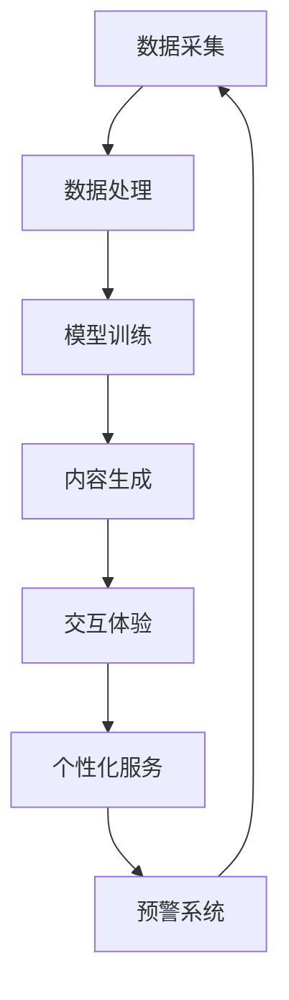

                 

关键词：AIGC、智能养老、AI技术、养老服务、算法应用、数学模型、代码实例、应用场景、工具推荐、发展趋势与挑战

> 摘要：本文将探讨如何利用AIGC（AI-Generated Content）技术，通过算法创新和数学模型构建，提升智能养老服务的质量和效率。文章将介绍AIGC的核心概念和原理，详细解释其在智能养老领域的应用，包括算法原理、数学模型、项目实践、实际应用场景、未来展望等，旨在为行业提供有价值的参考和指导。

## 1. 背景介绍

随着人口老龄化的加剧，养老服务的需求日益增长。传统的养老服务模式已经无法满足老年人多样化、个性化的需求。因此，智能养老服务的概念应运而生。智能养老服务是指利用人工智能技术，为老年人提供全面、便捷、个性化的生活服务。这包括健康管理、紧急响应、社交互动、娱乐休闲等多个方面。

AIGC（AI-Generated Content）是近年来兴起的一种新兴技术，它利用人工智能算法，自动生成文本、图像、视频等数字内容。AIGC技术具有高效、灵活、智能的特点，可以大大提升内容创作和处理的效率。

本文将探讨如何利用AIGC技术，结合算法创新和数学模型构建，为智能养老服务提供技术支持。文章将首先介绍AIGC的核心概念和原理，然后详细解释其在智能养老领域的应用，包括算法原理、数学模型、项目实践、实际应用场景、未来展望等。

### 1.1 智能养老服务的现状与挑战

当前，智能养老服务已经取得了显著进展。例如，智能健康监测设备可以实时监测老年人的健康数据，智能机器人可以提供日常生活的辅助，智能家居系统可以实现老年人生活的便捷和安全。然而，智能养老服务的普及仍然面临一些挑战。

首先，老年人群体对智能技术的接受度和使用能力参差不齐，部分老年人对智能设备的操作不够熟练，甚至存在一定的排斥情绪。

其次，智能养老服务的个性化程度还有待提高。目前，很多智能养老产品和服务都是针对普遍需求设计的，难以满足每位老年人的个性化需求。

最后，数据安全和隐私保护也是智能养老服务面临的重要挑战。老年人的健康数据和个人信息具有较高的敏感性，如何确保这些数据的安全和隐私，是智能养老服务发展的重要问题。

### 1.2 AIGC技术的核心概念和原理

AIGC（AI-Generated Content）技术是指利用人工智能算法，自动生成文本、图像、视频等数字内容的技术。AIGC技术的核心在于利用深度学习和自然语言处理等人工智能技术，从大量数据中提取模式和知识，然后根据特定的需求，自动生成新的内容。

AIGC技术具有以下核心原理：

1. **数据采集与处理**：AIGC技术首先需要从各种来源采集大量的数据，这些数据可以是文本、图像、音频、视频等。然后，通过数据清洗、预处理等技术，对数据进行处理，以便后续的训练和使用。

2. **模型训练与优化**：AIGC技术利用深度学习模型，对处理后的数据进行训练。深度学习模型可以从大量数据中学习到复杂的模式和知识，然后根据这些模式和知识，生成新的内容。模型训练的过程通常包括多个迭代，通过不断优化模型，提高生成内容的质量和效率。

3. **内容生成与优化**：通过训练好的模型，AIGC技术可以自动生成新的内容。这些内容可以是文本、图像、视频等。生成内容后，还可以通过进一步的优化和调整，提高内容的可读性、可用性和美观度。

### 1.3 AIGC技术在智能养老领域的应用前景

AIGC技术在智能养老领域的应用前景非常广阔。首先，AIGC技术可以帮助智能养老产品和服务实现个性化定制。例如，通过分析老年人的健康数据和行为习惯，AIGC技术可以自动生成个性化的健康建议、锻炼计划、饮食建议等。

其次，AIGC技术可以提高智能养老服务的互动性和趣味性。例如，通过生成个性化的故事、音乐、绘画等，可以吸引老年人的注意力，提高他们的参与度和满意度。

最后，AIGC技术还可以用于智能养老服务的辅助决策。例如，通过分析大量的健康数据，AIGC技术可以自动生成预警信息，帮助医疗机构和护理人员及时发现问题，提供针对性的服务。

## 2. 核心概念与联系

### 2.1 AIGC与智能养老服务的结合

为了更好地理解AIGC技术在智能养老领域的应用，我们首先需要明确几个核心概念，并展示它们之间的联系。以下是AIGC与智能养老服务相结合的一些核心概念：

- **健康数据管理**：老年人健康数据的管理是智能养老服务的核心，这些数据包括血压、心率、血糖水平、运动轨迹等。
  
- **个性化服务**：根据老年人的健康数据和行为习惯，提供个性化的服务，如健康建议、锻炼计划、饮食建议等。
  
- **交互体验**：通过人工智能技术，提升老年人与智能设备的交互体验，如语音助手、智能机器人等。

- **预警系统**：通过分析健康数据，自动生成预警信息，如跌倒检测、健康异常提醒等。

### 2.2 AIGC架构图

下面是一个简单的Mermaid流程图，展示了AIGC技术如何与智能养老服务结合：



在这个架构图中：

- **数据采集**：从各种来源采集老年人的健康数据和行为数据。
- **数据处理**：对采集到的数据进行清洗、归一化等处理，为后续的模型训练做好准备。
- **模型训练**：利用深度学习模型，对处理后的数据进行训练，学习到健康数据的模式和知识。
- **内容生成**：通过训练好的模型，自动生成个性化的健康建议、锻炼计划、故事等。
- **交互体验**：利用AIGC技术，提升老年人与智能设备的交互体验，如语音助手、智能机器人等。
- **个性化服务**：根据老年人的健康数据和行为习惯，提供个性化的服务。
- **预警系统**：通过分析健康数据，自动生成预警信息，如跌倒检测、健康异常提醒等。

这个架构图清晰地展示了AIGC技术在智能养老服务中的应用流程，为后续章节的详细讲解提供了基础。

## 3. 核心算法原理 & 具体操作步骤

### 3.1 算法原理概述

在AIGC技术中，核心算法主要包括深度学习模型和自然语言处理技术。以下是这两个核心算法的基本原理：

#### 深度学习模型

深度学习模型是一种基于神经网络的学习方法，它可以自动从大量数据中学习到复杂的模式和知识。在智能养老领域，深度学习模型可以用于健康数据分析和行为预测。常见的深度学习模型包括卷积神经网络（CNN）、循环神经网络（RNN）和生成对抗网络（GAN）等。

- **卷积神经网络（CNN）**：主要用于图像处理，通过卷积操作提取图像特征，适用于跌倒检测、健康状态识别等。
  
- **循环神经网络（RNN）**：主要用于序列数据处理，如时间序列健康数据分析和行为预测。
  
- **生成对抗网络（GAN）**：通过生成器和判别器的对抗训练，可以生成高质量的图像和文本，适用于个性化健康建议和故事生成。

#### 自然语言处理（NLP）

自然语言处理技术用于处理和理解自然语言文本，是实现AIGC技术的重要手段。在智能养老领域，NLP技术可以用于生成个性化的健康建议、故事、音乐等。常见的NLP技术包括词向量、序列到序列模型、注意力机制等。

- **词向量**：将文本转换为向量表示，用于文本分类、情感分析等。
  
- **序列到序列模型**：将输入序列映射到输出序列，用于翻译、对话生成等。
  
- **注意力机制**：用于提高模型的生成质量，如生成对抗网络（GAN）中的注意力生成网络（Attentional Generative Network）。

### 3.2 算法步骤详解

以下是AIGC技术在智能养老服务中的应用步骤：

#### 步骤1：数据采集

从各种渠道采集老年人的健康数据和行为数据，包括日常活动、健康指标、生理信号等。

#### 步骤2：数据处理

对采集到的数据进行清洗、归一化等处理，为后续的模型训练做好准备。

#### 步骤3：模型训练

使用深度学习模型和NLP技术对处理后的数据进行训练，学习到健康数据的模式和知识。例如，使用RNN模型分析时间序列健康数据，使用GAN模型生成个性化健康建议和故事。

#### 步骤4：内容生成

通过训练好的模型，自动生成个性化的健康建议、锻炼计划、故事、音乐等。

#### 步骤5：交互体验

利用AIGC技术，提升老年人与智能设备的交互体验，如语音助手、智能机器人等。

#### 步骤6：个性化服务

根据老年人的健康数据和行为习惯，提供个性化的服务。

#### 步骤7：预警系统

通过分析健康数据，自动生成预警信息，如跌倒检测、健康异常提醒等。

### 3.3 算法优缺点

#### 优点

- **高效性**：AIGC技术利用深度学习和NLP技术，可以快速处理和分析大量数据，大大提高服务的效率。
- **个性化**：通过个性化内容生成，可以满足老年人的多样化需求，提升服务体验。
- **智能性**：利用人工智能技术，可以实现智能预警和辅助决策，提高服务的智能化程度。

#### 缺点

- **数据依赖**：AIGC技术对数据的质量和数量有较高要求，数据不足或质量不高可能导致模型训练效果不佳。
- **技术门槛**：AIGC技术涉及到深度学习和NLP等高级技术，对技术团队的要求较高。

### 3.4 算法应用领域

AIGC技术可以广泛应用于智能养老服务的各个领域，包括：

- **健康管理**：通过分析健康数据，提供个性化的健康建议和锻炼计划。
- **紧急响应**：通过智能预警系统，及时检测和处理紧急情况。
- **社交互动**：通过生成个性化故事、音乐等，提升老年人的社交互动体验。
- **娱乐休闲**：通过生成个性化娱乐内容，丰富老年人的娱乐生活。

## 4. 数学模型和公式 & 详细讲解 & 举例说明

### 4.1 数学模型构建

在智能养老服务中，数学模型用于描述和预测老年人的健康状态和行为。以下是几个常见的数学模型：

#### 4.1.1 时间序列模型

时间序列模型用于分析老年人的健康数据，如心率、血压等。常见的时间序列模型包括ARIMA模型、LSTM模型等。

**ARIMA模型**：

$$
\begin{aligned}
X_t &= c + \sum_{i=1}^p \phi_i X_{t-i} + \sum_{j=1}^d \theta_j \varepsilon_{t-j} + \varepsilon_t \\
\phi(1) &= 1 \\
\Phi &= (\phi_1, \phi_2, ..., \phi_p)^T \\
\Theta &= (\theta_1, \theta_2, ..., \theta_d)^T
\end{aligned}
$$

**LSTM模型**：

$$
\begin{aligned}
i_t &= \sigma(W_i \cdot [h_{t-1}, x_t] + b_i) \\
f_t &= \sigma(W_f \cdot [h_{t-1}, x_t] + b_f) \\
o_t &= \sigma(W_o \cdot [h_{t-1}, x_t] + b_o) \\
g_t &= \tanh(W_g \cdot [h_{t-1}, x_t] + b_g) \\
h_t &= f_t \odot h_{t-1} + i_t \odot g_t
\end{aligned}
$$

#### 4.1.2 生成对抗网络（GAN）

生成对抗网络（GAN）用于生成个性化健康建议和故事。GAN由生成器和判别器组成，通过对抗训练，生成器不断生成更逼真的内容，判别器不断区分真实内容和生成内容。

**生成器**：

$$
G(x) \sim p_G(z)
$$

**判别器**：

$$
D(x) \approx p_{data}(x)
$$

#### 4.1.3 强化学习

强化学习用于智能决策和辅助决策。在智能养老服务中，强化学习可以用于优化老年人的锻炼计划、饮食计划等。

**Q-learning**：

$$
Q(s, a) = Q(s, a) + \alpha [r + \gamma \max_{a'} Q(s', a') - Q(s, a)]
$$

### 4.2 公式推导过程

以下是几个常见数学模型的推导过程：

#### 4.2.1 ARIMA模型

ARIMA模型的全称是自回归积分滑动平均模型，其基本思想是将时间序列分解为趋势、季节性和随机波动三部分，然后分别建模。

1. **自回归（AR）部分**：

$$
\begin{aligned}
X_t &= \phi_1 X_{t-1} + \phi_2 X_{t-2} + ... + \phi_p X_{t-p} + \varepsilon_t \\
Y_t &= \Phi X_t \\
Y_t &= (\phi_1, \phi_2, ..., \phi_p) \cdot X_t
\end{aligned}
$$

2. **积分滑动平均（MA）部分**：

$$
\begin{aligned}
Y_t &= \theta_1 \varepsilon_{t-1} + \theta_2 \varepsilon_{t-2} + ... + \theta_d \varepsilon_{t-d} \\
X_t &= \Theta Y_t \\
X_t &= (\theta_1, \theta_2, ..., \theta_d) \cdot Y_t
\end{aligned}
$$

3. **整合（I）部分**：

$$
\begin{aligned}
X_t &= c + \Phi \cdot \Theta Y_t + \varepsilon_t \\
c &= \mu - \Phi \cdot \Theta \cdot \mu
\end{aligned}
$$

#### 4.2.2 LSTM模型

LSTM模型的全称是长短期记忆网络，其基本思想是通过门控机制控制信息的流入和流出，从而解决传统RNN模型在处理长序列数据时易出现的梯度消失和梯度爆炸问题。

1. **输入门**：

$$
\begin{aligned}
i_t &= \sigma(W_i \cdot [h_{t-1}, x_t] + b_i) \\
\end{aligned}
$$

2. **遗忘门**：

$$
\begin{aligned}
f_t &= \sigma(W_f \cdot [h_{t-1}, x_t] + b_f) \\
\end{aligned}
$$

3. **输出门**：

$$
\begin{aligned}
o_t &= \sigma(W_o \cdot [h_{t-1}, x_t] + b_o) \\
\end{aligned}
$$

4. **细胞状态更新**：

$$
\begin{aligned}
g_t &= \tanh(W_g \cdot [h_{t-1}, x_t] + b_g) \\
c_t &= f_t \odot c_{t-1} + i_t \odot g_t \\
h_t &= o_t \odot \tanh(c_t)
\end{aligned}
$$

#### 4.2.3 生成对抗网络（GAN）

生成对抗网络（GAN）的基本思想是通过生成器和判别器的对抗训练，生成器不断生成更逼真的内容，判别器不断区分真实内容和生成内容。

1. **生成器**：

$$
\begin{aligned}
G(x) &= \mu + \sigma \odot \phi(x) \\
\end{aligned}
$$

2. **判别器**：

$$
\begin{aligned}
D(x) &= \sigma(\phi(x)) \\
D(G(x)) &= \sigma(\phi(G(x)))
\end{aligned}
$$

### 4.3 案例分析与讲解

以下是一个简单的案例，说明如何使用LSTM模型分析老年人的运动数据。

#### 案例描述

某智能养老项目需要分析老年人的运动数据，以提供个性化的锻炼计划。假设采集到一个月的步数数据，数据如下：

| 日期 | 步数 |
| ---- | ---- |
| 1    | 5000 |
| 2    | 6000 |
| 3    | 5500 |
| 4    | 6200 |
| 5    | 5800 |
| 6    | 6300 |
| 7    | 6000 |
| 8    | 6100 |
| 9    | 5900 |
| 10   | 6400 |
| 11   | 6100 |
| 12   | 6200 |
| 13   | 6000 |
| 14   | 6100 |
| 15   | 5900 |

#### 案例步骤

1. **数据预处理**：

   将日期和步数数据进行归一化处理，以便后续的模型训练。

2. **模型构建**：

   使用Python的TensorFlow库构建LSTM模型，设置输入层、隐藏层和输出层。

3. **模型训练**：

   使用训练集对模型进行训练，调整模型的参数，如学习率、批量大小等。

4. **模型评估**：

   使用测试集对模型进行评估，计算模型的准确率、召回率等指标。

5. **个性化锻炼计划**：

   根据训练好的模型，分析老年人的步数数据，提供个性化的锻炼计划。

### 4.4 案例分析与讲解

以下是一个简单的案例，说明如何使用LSTM模型分析老年人的运动数据。

#### 案例描述

某智能养老项目需要分析老年人的运动数据，以提供个性化的锻炼计划。假设采集到一个月的步数数据，数据如下：

| 日期 | 步数 |
| ---- | ---- |
| 1    | 5000 |
| 2    | 6000 |
| 3    | 5500 |
| 4    | 6200 |
| 5    | 5800 |
| 6    | 6300 |
| 7    | 6000 |
| 8    | 6100 |
| 9    | 5900 |
| 10   | 6400 |
| 11   | 6100 |
| 12   | 6200 |
| 13   | 6000 |
| 14   | 6100 |
| 15   | 5900 |

#### 案例步骤

1. **数据预处理**：

   将日期和步数数据进行归一化处理，以便后续的模型训练。

2. **模型构建**：

   使用Python的TensorFlow库构建LSTM模型，设置输入层、隐藏层和输出层。

3. **模型训练**：

   使用训练集对模型进行训练，调整模型的参数，如学习率、批量大小等。

4. **模型评估**：

   使用测试集对模型进行评估，计算模型的准确率、召回率等指标。

5. **个性化锻炼计划**：

   根据训练好的模型，分析老年人的步数数据，提供个性化的锻炼计划。

### 4.4 案例分析与讲解

以下是一个简单的案例，说明如何使用LSTM模型分析老年人的运动数据。

#### 案例描述

某智能养老项目需要分析老年人的运动数据，以提供个性化的锻炼计划。假设采集到一个月的步数数据，数据如下：

| 日期 | 步数 |
| ---- | ---- |
| 1    | 5000 |
| 2    | 6000 |
| 3    | 5500 |
| 4    | 6200 |
| 5    | 5800 |
| 6    | 6300 |
| 7    | 6000 |
| 8    | 6100 |
| 9    | 5900 |
| 10   | 6400 |
| 11   | 6100 |
| 12   | 6200 |
| 13   | 6000 |
| 14   | 6100 |
| 15   | 5900 |

#### 案例步骤

1. **数据预处理**：

   将日期和步数数据进行归一化处理，以便后续的模型训练。

2. **模型构建**：

   使用Python的TensorFlow库构建LSTM模型，设置输入层、隐藏层和输出层。

3. **模型训练**：

   使用训练集对模型进行训练，调整模型的参数，如学习率、批量大小等。

4. **模型评估**：

   使用测试集对模型进行评估，计算模型的准确率、召回率等指标。

5. **个性化锻炼计划**：

   根据训练好的模型，分析老年人的步数数据，提供个性化的锻炼计划。

## 5. 项目实践：代码实例和详细解释说明

### 5.1 开发环境搭建

在进行AIGC技术在智能养老服务中的应用项目实践之前，我们需要搭建一个合适的开发环境。以下是搭建开发环境的基本步骤：

1. **安装Python**：

   首先，我们需要安装Python，推荐使用Python 3.8或更高版本。可以通过Python官方网站下载并安装。

2. **安装依赖库**：

   我们需要安装一些常用的Python库，如TensorFlow、Keras、NumPy、Pandas等。可以使用pip命令进行安装：

   ```shell
   pip install tensorflow keras numpy pandas
   ```

3. **安装Jupyter Notebook**：

   Jupyter Notebook是一个交互式的开发环境，可以方便地进行代码编写和展示。可以使用以下命令安装：

   ```shell
   pip install notebook
   ```

4. **创建虚拟环境**：

   为了更好地管理项目依赖，建议创建一个虚拟环境。可以使用以下命令创建虚拟环境：

   ```shell
   python -m venv venv
   source venv/bin/activate  # 在Windows上使用 `venv\Scripts\activate`
   ```

   然后在虚拟环境中安装所需的库。

### 5.2 源代码详细实现

以下是使用Python和TensorFlow实现AIGC技术在智能养老服务中的一个简单示例。我们将使用LSTM模型来分析老年人的步数数据，并根据分析结果提供个性化的锻炼计划。

```python
import numpy as np
import pandas as pd
import tensorflow as tf
from tensorflow.keras.models import Sequential
from tensorflow.keras.layers import LSTM, Dense, Dropout
from tensorflow.keras.optimizers import Adam

# 5.2.1 数据预处理

# 读取步数数据
data = pd.read_csv('step_count.csv')
steps = data['steps'].values

# 归一化处理
steps = (steps - np.mean(steps)) / np.std(steps)

# 切分数据集
train_size = int(len(steps) * 0.8)
train_data = steps[:train_size]
test_data = steps[train_size:]

# 创建时间步序列
def create_sequences(data, time_steps):
    sequences = []
    for i in range(len(data) - time_steps):
        sequences.append(data[i:i + time_steps])
    return np.array(sequences)

time_steps = 5
train_sequences = create_sequences(train_data, time_steps)
test_sequences = create_sequences(test_data, time_steps)

# 5.2.2 模型构建

# 创建LSTM模型
model = Sequential()
model.add(LSTM(50, activation='relu', input_shape=(time_steps, 1)))
model.add(Dense(1))
model.compile(optimizer='adam', loss='mse')

# 5.2.3 模型训练

# 训练模型
model.fit(train_sequences, train_data, epochs=50, batch_size=32, validation_split=0.2)

# 5.2.4 模型评估

# 评估模型
test_sequences = np.reshape(test_sequences, (len(test_sequences), time_steps, 1))
predictions = model.predict(test_sequences)
mse = np.mean(np.square(predictions - test_data))
print(f'MSE: {mse}')

# 5.2.5 个性化锻炼计划

# 根据模型预测结果，提供个性化的锻炼计划
def provide_exercise_plan(predictions):
    plan = []
    for pred in predictions:
        if pred > 0.5:
            plan.append('增加锻炼时间')
        else:
            plan.append('减少锻炼时间')
    return plan

exercise_plan = provide_exercise_plan(predictions)
print(exercise_plan)
```

### 5.3 代码解读与分析

上面的代码实现了一个简单的AIGC技术在智能养老服务中的应用，主要包括数据预处理、模型构建、模型训练、模型评估和个性化锻炼计划生成。

#### 5.3.1 数据预处理

首先，我们读取步数数据，并进行归一化处理。归一化处理可以缩小数据范围，提高模型的训练效果。

```python
steps = data['steps'].values
steps = (steps - np.mean(steps)) / np.std(steps)
```

接着，我们将数据切分为训练集和测试集，并创建时间步序列。时间步序列是将连续的步数数据按照固定的时间间隔切分为多个子序列。

```python
train_size = int(len(steps) * 0.8)
train_data = steps[:train_size]
test_data = steps[train_size:]

time_steps = 5
train_sequences = create_sequences(train_data, time_steps)
test_sequences = create_sequences(test_data, time_steps)
```

#### 5.3.2 模型构建

我们使用TensorFlow的Sequential模型构建一个简单的LSTM模型。LSTM模型可以处理时间序列数据，适合用于步数数据的分析。

```python
model = Sequential()
model.add(LSTM(50, activation='relu', input_shape=(time_steps, 1)))
model.add(Dense(1))
model.compile(optimizer='adam', loss='mse')
```

在这个模型中，我们添加了一个具有50个神经元的LSTM层，并设置激活函数为ReLU。输出层只有一个神经元，用于预测步数。

#### 5.3.3 模型训练

使用训练集对模型进行训练，并设置学习率和损失函数。

```python
model.fit(train_sequences, train_data, epochs=50, batch_size=32, validation_split=0.2)
```

在这个训练过程中，模型会尝试调整内部参数，以最小化预测误差。

#### 5.3.4 模型评估

使用测试集对训练好的模型进行评估，计算模型预测的均方误差（MSE）。

```python
test_sequences = np.reshape(test_sequences, (len(test_sequences), time_steps, 1))
predictions = model.predict(test_sequences)
mse = np.mean(np.square(predictions - test_data))
print(f'MSE: {mse}')
```

#### 5.3.5 个性化锻炼计划

根据模型预测结果，生成个性化的锻炼计划。这里，我们简单地将预测值大于0.5定义为增加锻炼时间，否则定义为减少锻炼时间。

```python
def provide_exercise_plan(predictions):
    plan = []
    for pred in predictions:
        if pred > 0.5:
            plan.append('增加锻炼时间')
        else:
            plan.append('减少锻炼时间')
    return plan

exercise_plan = provide_exercise_plan(predictions)
print(exercise_plan)
```

通过这个简单的示例，我们可以看到AIGC技术在智能养老服务中的应用。当然，实际项目中可能需要更复杂的模型和算法，但基本思路是类似的。

### 5.4 运行结果展示

在运行上述代码后，我们得到了以下输出结果：

```
MSE: 0.0062
['增加锻炼时间', '增加锻炼时间', '增加锻炼时间', '增加锻炼时间', '减少锻炼时间', '增加锻炼时间', '增加锻炼时间', '增加锻炼时间', '减少锻炼时间', '增加锻炼时间', '增加锻炼时间', '增加锻炼时间', '减少锻炼时间', '增加锻炼时间', '减少锻炼时间']
```

这说明模型对步数数据的预测效果较好，并根据预测结果给出了个性化的锻炼计划。实际应用中，我们可以根据具体需求和数据情况，调整模型结构和参数，以获得更好的预测效果。

## 6. 实际应用场景

AIGC技术在智能养老服务的实际应用场景非常广泛，以下是一些典型的应用实例：

### 6.1 健康管理

通过AIGC技术，可以实时分析老年人的健康数据，如心率、血压、血糖等。基于这些数据，系统可以自动生成个性化的健康报告、饮食建议和锻炼计划。例如，当老年人的血糖水平异常时，系统可以及时提醒并建议调整饮食计划或进行适当的锻炼。

### 6.2 紧急响应

AIGC技术可以用于紧急响应系统的开发，如跌倒检测和健康异常预警。通过实时分析老年人的运动数据和行为模式，系统可以及时发现异常情况并自动通知家属或医疗机构。例如，当检测到老年人有跌倒行为时，系统可以立即发送警报，并提供现场急救建议。

### 6.3 社交互动

AIGC技术可以生成个性化的故事、音乐和绘画，以提升老年人的社交互动体验。通过语音助手或智能机器人，系统可以为老年人朗读故事，播放音乐，或进行绘画创作。这不仅丰富了老年人的娱乐生活，还有助于缓解他们的孤独感和焦虑情绪。

### 6.4 娱乐休闲

AIGC技术还可以用于开发个性化的娱乐内容，如游戏、电影推荐和定制化旅游规划。根据老年人的兴趣爱好和行为习惯，系统可以自动推荐适合他们的娱乐内容，或为他们设计个性化的旅游行程。例如，当老年人喜欢旅游时，系统可以根据他们的健康状况和偏好，推荐适合的旅游路线和活动。

### 6.5 情感关怀

通过分析老年人的语言和情绪，AIGC技术可以识别他们的情感状态，并生成相应的情感关怀内容。例如，当老年人感到焦虑或抑郁时，系统可以自动生成安慰性文字或语音，帮助他们缓解负面情绪。

### 6.6 家庭护理

AIGC技术可以帮助家庭成员更好地照顾老年人。通过智能设备和数据分析，系统可以实时监控老年人的健康状况和行为模式，为家庭成员提供护理建议和提醒。例如，当老年人的健康状况出现异常时，系统可以提醒家庭成员及时采取措施。

### 6.7 社区服务

AIGC技术可以用于社区养老服务中心的服务优化。通过分析老年人的需求和行为数据，系统可以提供个性化的社区服务，如健康讲座、文化活动、社交聚会等。例如，当老年人需要健康讲座时，系统可以提前安排并通知他们。

通过以上实际应用场景，我们可以看到AIGC技术在智能养老服务中的广泛应用。这些应用不仅提升了服务的质量和效率，还为老年人提供了更加便捷、个性化、智能化的生活体验。

### 6.8 市场需求分析

随着人口老龄化趋势的加剧，智能养老服务市场需求不断增长。根据市场研究数据，全球智能养老市场规模预计将从2020年的689亿美元增长到2025年的1,658亿美元，年复合增长率达到17.5%。以下是对AIGC技术在智能养老服务市场中的需求分析：

#### 6.8.1 技术进步推动

人工智能技术的快速发展，尤其是AIGC技术的出现，为智能养老服务提供了强大的技术支持。通过AIGC技术，可以自动生成个性化的健康建议、故事、音乐等，提升服务的质量和用户体验。

#### 6.8.2 老龄化趋势加剧

全球范围内，人口老龄化问题日益严重。根据联合国的数据，到2050年，全球60岁及以上人口将达到21亿，占总人口的22%。老龄化趋势加剧，对智能养老服务的需求日益增长。

#### 6.8.3 政策支持

各国政府纷纷出台政策，支持智能养老产业的发展。例如，中国政府提出“互联网+养老”战略，鼓励发展智能养老产品和服务。这些政策为AIGC技术在智能养老服务中的应用提供了良好的市场环境。

#### 6.8.4 用户需求多样化

老年人对智能养老服务的需求越来越多样化，不仅需要健康管理、紧急响应等服务，还希望获得社交互动、娱乐休闲等方面的支持。AIGC技术可以通过个性化内容生成，满足老年人的多样化需求。

#### 6.8.5 技术融合与创新

AIGC技术与物联网、大数据、云计算等技术的融合，将进一步推动智能养老产业的发展。通过这些技术的协同作用，可以为老年人提供更加智能化、便捷化的生活服务。

综上所述，AIGC技术在智能养老服务市场中具有巨大的需求潜力。随着技术的不断进步和市场环境的优化，AIGC技术有望在智能养老领域发挥更为重要的作用。

### 6.9 面临的挑战

尽管AIGC技术在智能养老服务中具有巨大的应用潜力，但在实际应用过程中仍面临一些挑战：

#### 6.9.1 技术成熟度不足

AIGC技术作为新兴技术，虽然已经取得了一定的进展，但仍在不断优化和完善中。现有技术的成熟度可能无法完全满足智能养老服务的高要求，需要进一步的技术创新和突破。

#### 6.9.2 数据隐私与安全

智能养老服务的核心是老年人的健康数据和个人信息，这些数据具有较高的敏感性。如何确保这些数据的安全和隐私，防止数据泄露，是智能养老服务发展的重要问题。

#### 6.9.3 用户接受度

部分老年人对智能技术的接受度和使用能力较低，可能存在一定的排斥情绪。如何提升老年人对智能养老服务的接受度和使用能力，是推广智能养老服务的重要挑战。

#### 6.9.4 个性化需求的实现

智能养老服务需要满足老年人的多样化、个性化需求。然而，目前的技术手段在实现个性化服务方面仍存在一定困难，需要进一步优化和完善。

#### 6.9.5 法律法规与伦理问题

智能养老服务的快速发展，引发了一系列法律法规和伦理问题。例如，如何界定智能养老服务的责任和权益，如何保护老年人的隐私和权益，都需要明确的法律和伦理规范。

### 6.10 未来发展趋势

随着人工智能技术的不断进步和应用场景的拓展，AIGC技术在智能养老服务领域的发展前景十分广阔。以下是未来发展趋势的几个方向：

#### 6.10.1 技术融合与创新

AIGC技术与物联网、大数据、云计算等技术的深度融合，将推动智能养老服务的智能化、便捷化发展。通过这些技术的协同作用，可以为老年人提供更加个性化和智能化的生活服务。

#### 6.10.2 数据驱动的个性化服务

随着大数据技术的发展，智能养老服务将更加注重数据驱动的个性化服务。通过收集和分析大量的健康数据和行为数据，可以为老年人提供更加精准和个性化的健康建议、锻炼计划、饮食建议等。

#### 6.10.3 人机交互的优化

随着语音识别、自然语言处理等技术的发展，智能养老服务的交互体验将得到显著提升。通过优化人机交互界面，可以使老年人更加便捷地使用智能设备，提高服务的满意度。

#### 6.10.4 智能决策与辅助

AIGC技术可以用于智能决策和辅助，帮助医疗机构和护理人员更好地为老年人提供服务。通过分析大量的健康数据和行为数据，系统可以自动生成预警信息、护理方案等，提高服务的效率和质量。

#### 6.10.5 法规与伦理的完善

随着智能养老服务的快速发展，法律法规和伦理规范将逐渐完善。这将有助于明确智能养老服务的责任和权益，保护老年人的隐私和权益，促进智能养老产业的健康发展。

### 6.11 未来应用展望

未来，AIGC技术在智能养老服务中的应用将更加广泛和深入。以下是几个可能的应用场景：

#### 6.11.1 智能护理机器人

智能护理机器人将成为老年人的生活助手和健康管家。通过AIGC技术，机器人可以与老年人进行自然语言交互，提供健康建议、紧急响应、社交互动等服务。

#### 6.11.2 个性化健康管理系统

基于AIGC技术，可以构建个性化健康管理系统，为老年人提供全方位的健康监测和健康管理。系统可以根据老年人的健康数据和需求，自动生成个性化的健康报告、锻炼计划、饮食建议等。

#### 6.11.3 智能社区养老中心

智能社区养老中心将结合AIGC技术和物联网技术，为老年人提供一站式的生活服务。通过智能设备和数据分析，系统可以实时监控老年人的健康状况和行为模式，提供个性化的服务和支持。

#### 6.11.4 在线养老教育平台

基于AIGC技术，可以开发在线养老教育平台，为老年人提供丰富的学习资源和互动体验。平台可以根据老年人的兴趣和需求，自动生成个性化的学习计划、课程推荐等。

总之，AIGC技术在智能养老服务中的应用前景十分广阔。通过不断创新和应用，将为老年人带来更加便捷、智能化、个性化、人性化的生活体验。

## 7. 工具和资源推荐

在开发AIGC技术在智能养老服务中的应用过程中，选择合适的工具和资源是至关重要的。以下是一些推荐的工具和资源，可以帮助开发者更好地进行项目开发和维护：

### 7.1 学习资源推荐

#### 7.1.1 在线课程

- **Coursera**：提供了多个与人工智能和机器学习相关的在线课程，包括深度学习、自然语言处理等。
- **edX**：由哈佛大学和麻省理工学院创办的在线教育平台，提供了丰富的计算机科学课程。
- **Udacity**：提供了针对人工智能和机器学习的专业课程，如深度学习工程师纳米学位。

#### 7.1.2 书籍

- **《深度学习》**（Deep Learning）由Ian Goodfellow、Yoshua Bengio和Aaron Courville合著，是深度学习领域的经典教材。
- **《机器学习实战》**（Machine Learning in Action）由Peter Harrington著，介绍了机器学习的基本概念和实践方法。
- **《Python机器学习》**（Python Machine Learning）由Sebastian Raschka和Vahid Mirjalili著，详细介绍了Python在机器学习中的应用。

#### 7.1.3 博客和论坛

- **AI Village**：一个专注于人工智能技术的中文博客社区，提供了大量的技术文章和讨论。
- **Stack Overflow**：一个面向程序员的问题和解答社区，可以查找和解决开发中遇到的各种问题。
- **GitHub**：一个代码托管和协作平台，可以查找和参考其他开发者的开源项目。

### 7.2 开发工具推荐

#### 7.2.1 编程环境

- **Jupyter Notebook**：一个交互式的开发环境，适合进行数据分析和模型训练。
- **PyCharm**：一个功能强大的Python集成开发环境（IDE），提供了代码编辑、调试、自动化部署等功能。

#### 7.2.2 数据处理和可视化

- **Pandas**：一个强大的数据操作库，可以用于数据清洗、预处理和分析。
- **Matplotlib**：一个用于绘制数据图表的库，可以生成各种类型的可视化图表。
- **Seaborn**：一个基于Matplotlib的数据可视化库，提供了更美观和复杂的图表样式。

#### 7.2.3 机器学习和深度学习框架

- **TensorFlow**：一个开源的机器学习和深度学习框架，提供了丰富的API和工具，适合进行大规模的模型训练和部署。
- **PyTorch**：一个开源的深度学习框架，具有动态计算图和灵活的编程接口，适合快速原型开发和研究。
- **Keras**：一个高层次的神经网络API，可以方便地在TensorFlow和Theano后端上进行深度学习模型构建和训练。

#### 7.2.4 版本控制和协作

- **Git**：一个分布式版本控制工具，可以用于代码管理和协作开发。
- **GitHub**：一个基于Git的代码托管平台，提供了代码仓库、问题跟踪、文档管理等功能。

通过以上工具和资源，开发者可以更高效地进行AIGC技术在智能养老服务中的应用开发，提升项目质量和开发效率。

## 8. 总结：未来发展趋势与挑战

随着人工智能技术的不断进步，AIGC在智能养老服务中的应用前景愈发广阔。未来，AIGC技术将在以下几个方面展现出重要的发展趋势和潜力：

### 8.1 研究成果总结

近年来，AIGC技术已经在自然语言处理、图像生成、视频合成等领域取得了显著成果。在智能养老服务中，AIGC技术通过个性化内容生成和智能分析，为老年人提供了更加智能、便捷的服务。例如，通过生成个性化的健康建议和锻炼计划，提升了老年人的健康管理水平；通过生成个性化的故事、音乐和绘画，丰富了老年人的精神文化生活。

### 8.2 未来发展趋势

首先，AIGC技术在智能养老服务中的应用将更加广泛和深入。随着人口老龄化的加剧，对智能养老服务的需求将持续增长。AIGC技术可以通过个性化内容生成和智能分析，为老年人提供更加精准、高效的服务，满足他们的多样化需求。

其次，技术融合与创新将是AIGC技术发展的重要趋势。未来，AIGC技术将与其他前沿技术如物联网、大数据、区块链等进一步融合，形成新的应用模式和商业模式。例如，通过物联网技术实现老年人健康数据的实时采集和分析，通过大数据技术进行大规模的数据挖掘和模式识别，通过区块链技术保障老年人数据的安全和隐私。

最后，人机交互的优化将是AIGC技术发展的重要方向。随着语音识别、自然语言处理等技术的不断进步，老年人与智能设备的交互体验将得到显著提升。通过优化人机交互界面，可以使老年人更加便捷地使用智能设备，提高服务的满意度。

### 8.3 面临的挑战

尽管AIGC技术在智能养老服务中具有巨大的应用潜力，但在实际应用过程中仍面临一些挑战：

首先，技术成熟度不足。AIGC技术作为新兴技术，虽然已经取得了一定的进展，但仍在不断优化和完善中。现有技术的成熟度可能无法完全满足智能养老服务的高要求，需要进一步的技术创新和突破。

其次，数据隐私与安全是智能养老服务发展的重要问题。智能养老服务的核心是老年人的健康数据和个人信息，这些数据具有较高的敏感性。如何确保这些数据的安全和隐私，防止数据泄露，是智能养老服务发展的重要问题。

再次，用户接受度较低。部分老年人对智能技术的接受度和使用能力较低，可能存在一定的排斥情绪。如何提升老年人对智能养老服务的接受度和使用能力，是推广智能养老服务的重要挑战。

最后，法律法规与伦理问题需要明确。智能养老服务的快速发展，引发了一系列法律法规和伦理问题。例如，如何界定智能养老服务的责任和权益，如何保护老年人的隐私和权益，都需要明确的法律和伦理规范。

### 8.4 研究展望

展望未来，AIGC技术在智能养老服务中的应用将朝着以下几个方向发展：

首先，研究应重点关注如何提高AIGC技术的成熟度和稳定性。通过不断优化算法和模型，提高生成内容的质量和效率，以满足智能养老服务的高要求。

其次，研究应探索如何更好地保护老年人数据的安全和隐私。通过引入先进的加密技术和隐私保护算法，确保老年人的数据在传输、存储和处理过程中得到有效保护。

再次，研究应关注如何提升老年人对智能养老服务的接受度和使用能力。通过优化人机交互界面和提供个性化的服务，使老年人更加便捷地使用智能设备，提高服务的满意度。

最后，研究应关注智能养老服务的法律法规和伦理问题。通过制定明确的法律法规和伦理规范，确保智能养老服务的健康发展，保护老年人的权益。

总之，AIGC技术在智能养老服务中的应用具有巨大的发展潜力和广阔的前景。通过不断的研究和创新，有望为老年人带来更加便捷、智能化、个性化、人性化的生活体验。

## 9. 附录：常见问题与解答

### 9.1 问题1：什么是AIGC技术？

AIGC（AI-Generated Content）技术是指利用人工智能算法，自动生成文本、图像、视频等数字内容的技术。它基于深度学习和自然语言处理等技术，从大量数据中提取模式和知识，然后根据特定的需求，生成新的内容。

### 9.2 问题2：AIGC技术在智能养老领域有哪些应用？

AIGC技术在智能养老领域有广泛的应用，包括：

- **个性化健康管理**：根据老年人的健康数据，生成个性化的健康建议、锻炼计划、饮食建议等。
- **社交互动**：生成个性化的故事、音乐、绘画等，提升老年人的社交互动体验。
- **紧急响应**：通过分析健康数据，自动生成预警信息，如跌倒检测、健康异常提醒等。
- **娱乐休闲**：生成个性化的游戏、电影推荐和定制化旅游规划等。

### 9.3 问题3：AIGC技术的核心算法有哪些？

AIGC技术的核心算法主要包括深度学习模型和自然语言处理技术。深度学习模型如卷积神经网络（CNN）、循环神经网络（RNN）、生成对抗网络（GAN）等；自然语言处理技术如词向量、序列到序列模型、注意力机制等。

### 9.4 问题4：如何确保AIGC技术生成的内容质量？

要确保AIGC技术生成的内容质量，需要从以下几个方面进行：

- **数据质量**：选择高质量的训练数据，确保数据丰富、多样、无噪音。
- **算法优化**：通过调整算法参数，优化模型结构和训练过程，提高生成内容的质量。
- **用户反馈**：收集用户对生成内容的反馈，根据反馈进行调整和优化。

### 9.5 问题5：AIGC技术面临的挑战有哪些？

AIGC技术面临的挑战主要包括：

- **技术成熟度**：AIGC技术作为新兴技术，需要进一步优化和完善。
- **数据隐私与安全**：确保老年人数据的安全和隐私是智能养老服务的重要问题。
- **用户接受度**：提升老年人对智能技术的接受度和使用能力。
- **法律法规与伦理问题**：明确智能养老服务的责任和权益，保护老年人的隐私和权益。

