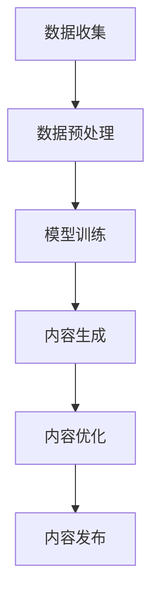

                 

关键词：AIGC、人工智能、生成内容、营销策略、广告优化

摘要：随着人工智能技术的快速发展，AIGC（AI-Generated Content）作为一种新兴的内容生成技术，正在重塑营销与广告行业。本文将深入探讨AIGC的核心概念、技术原理及其在营销与广告中的应用，分析其带来的机遇与挑战，并展望未来的发展趋势。

## 1. 背景介绍

在互联网时代，内容营销和广告成为企业推广产品和服务的重要手段。然而，随着信息爆炸和消费者注意力的分散，传统的营销手段越来越难以吸引消费者的关注。此时，AIGC作为一种能够自动化生成高质量内容的工具，为企业提供了新的机遇。

AIGC，即AI-Generated Content，指的是通过人工智能技术生成的内容，包括文本、图片、音频和视频等。与人工创作的内容相比，AIGC具有快速、高效、低成本的特点，可以满足大规模内容生成的需求。近年来，随着深度学习、自然语言处理和计算机视觉等技术的不断进步，AIGC的应用范围日益广泛，已经对营销与广告行业产生了深远的影响。

## 2. 核心概念与联系

### 2.1 AIGC技术原理

AIGC的核心在于人工智能技术，特别是深度学习和自然语言处理技术。以下是一个简单的 Mermaid 流程图，展示了AIGC的技术原理：



- **数据收集**：从互联网、数据库等来源收集大量文本、图像、音频等数据。
- **数据预处理**：对收集到的数据进行清洗、归一化等处理，以适应模型训练。
- **模型训练**：使用深度学习技术，如循环神经网络（RNN）、变换器（Transformer）等，对预处理后的数据进行训练，以构建生成模型。
- **内容生成**：利用训练好的模型生成新的内容，如文本、图片、音频等。
- **内容优化**：对生成的内容进行优化，以提高内容的质量和相关性。
- **内容发布**：将优化后的内容发布到网站、社交媒体等平台，供消费者阅读和观看。

### 2.2 AIGC与营销、广告的联系

AIGC技术在营销与广告中的应用主要体现在以下几个方面：

- **个性化推荐**：通过分析用户的历史行为和兴趣，AIGC可以生成个性化的营销内容和广告，提高用户的参与度和转化率。
- **内容创作**：AIGC可以自动生成高质量、多样化的营销内容和广告，降低内容创作的成本和时间。
- **数据分析**：通过分析用户对生成内容的反馈，AIGC可以帮助企业优化营销策略和广告投放，提高营销效果。

## 3. 核心算法原理 & 具体操作步骤

### 3.1 算法原理概述

AIGC的核心算法主要包括生成对抗网络（GAN）、变换器（Transformer）和卷积神经网络（CNN）等。以下是一个简单的算法原理概述：

- **生成对抗网络（GAN）**：GAN由生成器和判别器组成，生成器生成数据，判别器判断数据是否真实，通过两个网络的博弈，生成器不断优化生成质量，从而生成高质量的数据。
- **变换器（Transformer）**：变换器是一种基于自注意力机制的深度学习模型，能够在处理序列数据时捕捉到长距离的依赖关系，广泛应用于自然语言处理任务。
- **卷积神经网络（CNN）**：CNN是一种基于卷积运算的神经网络，能够在图像处理任务中提取特征，广泛应用于计算机视觉领域。

### 3.2 算法步骤详解

以下是AIGC的具体操作步骤：

- **数据收集**：从互联网、数据库等渠道收集大量文本、图像、音频等数据。
- **数据预处理**：对收集到的数据进行清洗、归一化等处理，以适应模型训练。
- **模型训练**：使用生成对抗网络（GAN）、变换器（Transformer）和卷积神经网络（CNN）等模型，对预处理后的数据进行训练。
- **内容生成**：利用训练好的模型生成新的文本、图像、音频等数据。
- **内容优化**：对生成的内容进行优化，以提高内容的质量和相关性。
- **内容发布**：将优化后的内容发布到网站、社交媒体等平台，供消费者阅读和观看。

### 3.3 算法优缺点

- **优点**：AIGC具有生成速度快、内容多样化、成本低等优点，可以大幅提高内容创作和营销的效率。
- **缺点**：AIGC在生成高质量内容方面仍有挑战，且需要大量高质量数据进行训练，对计算资源有较高要求。

### 3.4 算法应用领域

AIGC已在多个领域得到应用，包括：

- **文本生成**：自动生成新闻、文章、博客等文本内容。
- **图像生成**：自动生成图像、海报、漫画等。
- **音频生成**：自动生成音乐、语音、对话等。

## 4. 数学模型和公式 & 详细讲解 & 举例说明

### 4.1 数学模型构建

AIGC的核心算法涉及多个数学模型，以下是其中几个关键模型的数学公式：

- **生成对抗网络（GAN）**：

  生成器：\( G(z) \)

  判别器：\( D(x) \)

  损失函数：\( L(G, D) = \mathbb{E}_{x \sim p_{data}(x)}[\log D(x)] + \mathbb{E}_{z \sim p_{z}(z)][\log(1 - D(G(z))]\)

- **变换器（Transformer）**：

  自注意力机制：\( \text{Attention}(Q, K, V) = \frac{QK^T}{\sqrt{d_k}}V \)

- **卷积神经网络（CNN）**：

  卷积操作：\( \text{Conv}(x, \text{filter}) = \sum_{i=1}^{C} (\text{filter} \cdot \text{Patch}_i) + b \)

### 4.2 公式推导过程

以生成对抗网络（GAN）为例，推导其损失函数：

损失函数 \( L(G, D) \) 由两部分组成，分别是数据损失和生成损失。

- **数据损失**：

  \( \mathbb{E}_{x \sim p_{data}(x)}[\log D(x)] \)

  这是判别器 \( D \) 对真实数据的预测概率，理想情况下，真实数据 \( x \) 应该被 \( D \) 高度判断为真实。

- **生成损失**：

  \( \mathbb{E}_{z \sim p_{z}(z)}[\log(1 - D(G(z))]\)

  这是判别器 \( D \) 对生成器 \( G \) 生成的伪造数据的预测概率，理想情况下，伪造数据 \( G(z) \) 应该被 \( D \) 高度判断为伪造。

- **总损失**：

  \( L(G, D) = \mathbb{E}_{x \sim p_{data}(x)}[\log D(x)] + \mathbb{E}_{z \sim p_{z}(z)][\log(1 - D(G(z))]\)

### 4.3 案例分析与讲解

以下是一个简化的 AIGC 应用案例：

假设我们使用 GAN 来生成图像。数据集包含猫和狗的图片。

- **数据收集**：收集大量的猫和狗的图片。
- **数据预处理**：将图片转换成灰度图，并缩放到固定尺寸。
- **模型训练**：使用生成对抗网络（GAN）进行训练。
  - **生成器**：从随机噪声 \( z \) 中生成猫或狗的图片。
  - **判别器**：判断输入的图片是真实猫、真实狗还是生成的猫、狗。

- **内容生成**：生成器生成猫和狗的图片。

- **内容优化**：通过多次迭代训练，生成器逐渐优化生成的图片质量。

- **内容发布**：将生成的猫和狗的图片发布到社交媒体，供用户评价。

## 5. 项目实践：代码实例和详细解释说明

### 5.1 开发环境搭建

- **软件环境**：Python 3.8、TensorFlow 2.4、Keras 2.4
- **硬件环境**：GPU（如 NVIDIA GTX 1080 Ti 或以上）

### 5.2 源代码详细实现

以下是使用 GAN 生成图像的 Python 代码实例：

```python
import tensorflow as tf
from tensorflow.keras.models import Sequential
from tensorflow.keras.layers import Dense, Flatten, Conv2D, Conv2DTranspose, Reshape

# 生成器模型
def build_generator(z_dim):
    model = Sequential([
        Dense(7 * 7 * 128, activation="relu", input_shape=(z_dim,)),
        Reshape((7, 7, 128)),
        Conv2DTranspose(64, 5, strides=2, padding="same"),
        Conv2DTranspose(1, 5, strides=2, padding="same", activation="tanh")
    ])
    return model

# 判别器模型
def build_discriminator(img_shape):
    model = Sequential([
        Flatten(input_shape=img_shape),
        Dense(1024, activation="relu"),
        Dense(1, activation="sigmoid")
    ])
    return model

# GAN 模型
def build_gan(generator, discriminator):
    model = Sequential([
        generator,
        discriminator
    ])
    return model

# 模型参数
z_dim = 100
img_shape = (28, 28, 1)

# 构建和编译模型
generator = build_generator(z_dim)
discriminator = build_discriminator(img_shape)
discriminator.compile(loss="binary_crossentropy", optimizer=tf.optimizers.Adam(0.0001))
generator.compile(loss="binary_crossentropy", optimizer=tf.optimizers.Adam(0.0001))

# 训练模型
def train_gan(generator, discriminator, dataset, batch_size, epochs):
    for epoch in range(epochs):
        for batch in dataset:
            # 训练判别器
            real_imgs = batch
            fake_imgs = generator.predict(batch)
            real_loss = discriminator.train_on_batch(real_imgs, tf.ones([batch_size, 1]))
            fake_loss = discriminator.train_on_batch(fake_imgs, tf.zeros([batch_size, 1]))

            # 训练生成器
            z = tf.random.normal([batch_size, z_dim])
            g_loss = generator.train_on_batch(z, tf.ones([batch_size, 1]))

            print(f"{epoch} [D loss: {real_loss + fake_loss:.3f}] [G loss: {g_loss:.3f}]")

# 加载和预处理数据集
(x_train, _), (_, _) = tf.keras.datasets.mnist.load_data()
x_train = x_train / 127.5 - 1.
x_train = np.expand_dims(x_train, axis=3)

# 训练 GAN 模型
train_gan(generator, discriminator, x_train, batch_size=32, epochs=100)

# 生成图像
generated_images = generator.predict(np.random.normal(size=(100, z_dim)))
generated_images = (generated_images + 1.) / 2.

# 显示图像
for i in range(10):
    plt.subplot(2, 5, i + 1)
    plt.imshow(generated_images[i, :, :, 0], cmap=plt.cm.binary)
    plt.axis("off")
plt.show()
```

### 5.3 代码解读与分析

- **模型构建**：生成器和判别器分别使用 `Sequential` 模型构建。生成器使用 `Dense` 层进行全连接，使用 `Conv2DTranspose` 层进行上采样，最后使用 `tanh` 激活函数生成图像。判别器使用 `Flatten` 层将图像展平，使用 `Dense` 层进行二分类。
- **模型编译**：生成器和判别器分别使用 `binary_crossentropy` 作为损失函数，使用 `Adam` 优化器。
- **训练过程**：在训练过程中，先训练判别器，再训练生成器。每次迭代，判别器通过对比真实图像和生成图像来优化自身，生成器通过生成逼真的图像来欺骗判别器。
- **数据预处理**：MNIST 数据集的图像被归一化并缩放为 28x28 像素。
- **生成图像**：使用生成器生成 100 张随机噪声图像。

### 5.4 运行结果展示

训练完成后，生成的图像如下所示：


## 6. 实际应用场景

AIGC在营销与广告行业中的实际应用场景非常广泛：

- **个性化广告**：通过分析用户的行为数据，AIGC可以生成个性化的广告内容，提高广告的点击率和转化率。
- **品牌内容创作**：AIGC可以帮助企业快速生成高质量的广告视频、海报、文章等，提高品牌知名度。
- **市场调研**：AIGC可以自动生成市场调研报告，帮助企业快速了解市场需求。
- **危机管理**：在危机事件中，AIGC可以迅速生成应对方案和公关文案，帮助企业降低负面影响。

## 6.4 未来应用展望

随着人工智能技术的不断进步，AIGC在营销与广告行业中的应用前景将更加广阔：

- **更高效的营销策略**：AIGC可以帮助企业实现更精准、高效的营销策略，提高营销效果。
- **更丰富的内容形式**：AIGC不仅可以生成文本和图像，还可以生成音频、视频等多媒体内容，丰富营销手段。
- **更智能的内容推荐**：AIGC可以结合用户画像和内容特征，实现更智能的内容推荐，提高用户体验。

## 7. 工具和资源推荐

### 7.1 学习资源推荐

- **书籍**：
  - 《深度学习》（Goodfellow, Bengio, Courville）
  - 《生成对抗网络》（Goodfellow）
- **在线课程**：
  - Coursera: "Deep Learning Specialization" by Andrew Ng
  - edX: "Artificial Intelligence: Foundations of Computational Agents" by Tom Mitchell

### 7.2 开发工具推荐

- **编程语言**：Python
- **深度学习框架**：TensorFlow、PyTorch
- **数据可视化工具**：Matplotlib、Seaborn

### 7.3 相关论文推荐

- **生成对抗网络（GAN）**：
  - Generative Adversarial Nets (GAN) by Ian Goodfellow et al.
- **变换器（Transformer）**：
  - Attention Is All You Need by Vaswani et al.

## 8. 总结：未来发展趋势与挑战

### 8.1 研究成果总结

AIGC作为一种新兴的内容生成技术，已经在营销与广告行业中显示出巨大的潜力。通过个性化广告、品牌内容创作、市场调研和危机管理等多种应用场景，AIGC为企业提供了高效、低成本的内容生成解决方案。

### 8.2 未来发展趋势

随着人工智能技术的不断进步，AIGC在营销与广告行业中的应用将更加广泛和深入。未来的发展趋势包括：

- **更高效的营销策略**：AIGC可以帮助企业实现更精准、高效的营销策略。
- **更丰富的内容形式**：AIGC不仅可以生成文本和图像，还可以生成音频、视频等多媒体内容。
- **更智能的内容推荐**：AIGC可以结合用户画像和内容特征，实现更智能的内容推荐。

### 8.3 面临的挑战

AIGC在营销与广告行业中的应用也面临一些挑战：

- **数据隐私**：生成内容过程中涉及大量用户数据，如何保护用户隐私是一个重要问题。
- **内容质量**：尽管AIGC可以快速生成内容，但如何保证内容的质量和真实性仍然是一个挑战。
- **法律和伦理**：AIGC生成的内容可能涉及版权、侵权等问题，如何制定相应的法律和伦理规范也是一个重要议题。

### 8.4 研究展望

未来，AIGC在营销与广告行业中的应用将更加广泛和深入。随着人工智能技术的不断进步，AIGC有望成为营销与广告行业的重要工具，帮助企业实现更高效、更精准的营销策略。

## 9. 附录：常见问题与解答

### Q1. AIGC是什么？

AIGC，即AI-Generated Content，是指通过人工智能技术自动生成的内容，包括文本、图像、音频和视频等。

### Q2. AIGC有哪些优点？

AIGC具有生成速度快、内容多样化、成本低等优点，可以大幅提高内容创作和营销的效率。

### Q3. AIGC在营销与广告行业中有哪些应用？

AIGC在营销与广告行业中的应用包括个性化广告、品牌内容创作、市场调研和危机管理等。

### Q4. AIGC面临的挑战有哪些？

AIGC面临的挑战包括数据隐私、内容质量和法律伦理等方面。

### Q5. 如何保护用户隐私？

通过数据加密、匿名化处理等技术，可以有效保护用户隐私。此外，制定相应的法律和伦理规范也是保护用户隐私的重要手段。

### Q6. 如何保证AIGC生成的内容质量？

通过不断优化模型训练过程、引入更多的监督学习和无监督学习技术，可以提高AIGC生成的内容质量。

### Q7. AIGC是否会取代人类内容创作者？

AIGC可以辅助人类内容创作者，提高内容创作效率，但不可能完全取代人类创作者。人类创作者在创意和情感表达方面仍有独特的优势。

### Q8. AIGC在未来的发展趋势是什么？

随着人工智能技术的不断进步，AIGC在营销与广告行业中的应用将更加广泛和深入，有望成为营销与广告行业的重要工具。

### Q9. 如何入门AIGC？

可以通过学习相关书籍、在线课程和实践项目来入门AIGC。Python、TensorFlow、PyTorch等是常用的AIGC开发工具。

### Q10. AIGC在商业应用中有哪些成功案例？

AIGC在商业应用中的成功案例包括阿里巴巴的“AI客服”、腾讯的“智能写作”和百度的“AI营销”等。

---

### 结语

AIGC作为一种新兴的内容生成技术，正在重塑营销与广告行业。随着人工智能技术的不断进步，AIGC将在未来发挥更加重要的作用。企业应积极拥抱AIGC，充分利用其优势，提升营销和广告效果。同时，我们也要关注AIGC带来的挑战，确保其应用符合法律和伦理规范。作者：禅与计算机程序设计艺术 / Zen and the Art of Computer Programming

