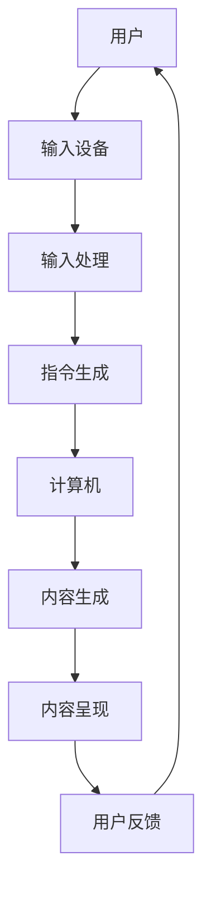

                 

### 1. 背景介绍

随着人工智能（AI）技术的飞速发展，我们正逐渐步入一个全新的时代：人工智能生成内容（AI-generated Content，简称AIGC）时代。AIGC，作为人工智能的重要分支，其核心在于利用机器学习、自然语言处理、计算机视觉等技术，生成或辅助生成各种类型的内容，如文本、图片、音频、视频等。这不仅大大提升了内容创作的效率，也为人们提供了前所未有的互动体验。

人机交互（Human-Computer Interaction，简称HCI）是计算机科学、认知科学和设计学的交叉领域，旨在研究人类与计算机系统之间的交互和协作。随着互联网的普及和计算机性能的提升，人机交互变得越来越重要。传统的人机交互主要依赖于用户通过键盘、鼠标等输入设备与计算机进行交互，而AIGC的出现，为人机交互带来了新的可能性。

在过去的几十年中，人机交互的研究主要集中在如何提高用户操作的便捷性、如何优化用户界面设计、如何减少用户的学习成本等方面。然而，随着AIGC技术的应用，人机交互的核心逐渐从用户操作转向了人与机器的协同创作。这意味着，未来的人机交互将更加注重机器对人类意图的理解和响应，从而实现更自然的交互体验。

本文将探讨AIGC如何重新定义人机交互，从核心概念、算法原理、数学模型、项目实践、应用场景等多个角度进行全面解析，旨在为广大读者提供一个全面、深入的视角，以了解AIGC在未来的发展趋势和潜在挑战。

## 2. 核心概念与联系

### 2.1 人工智能生成内容（AIGC）

人工智能生成内容（AIGC）是指利用人工智能技术生成或辅助生成各种类型的内容。AIGC涵盖了多个领域，包括自然语言处理（NLP）、计算机视觉（CV）、音频处理等。其核心在于利用机器学习模型，特别是深度学习模型，从大量数据中学习和提取特征，然后生成新的内容。

在AIGC中，自然语言处理是最为成熟的领域之一。通过训练大规模的语言模型，如GPT（Generative Pre-trained Transformer）和BERT（Bidirectional Encoder Representations from Transformers），计算机可以生成高质量的文本内容，如文章、对话、摘要等。计算机视觉则通过卷积神经网络（CNN）和生成对抗网络（GAN）等技术，可以生成逼真的图像和视频。

AIGC的应用领域广泛，包括但不限于以下几个方面：

- 文本生成：自动撰写新闻稿、文章、故事等。
- 图片生成：生成艺术作品、设计图纸、动漫人物等。
- 视频生成：生成动画、电影片段、游戏视频等。
- 音频生成：生成音乐、声音效果、语音合成等。

### 2.2 人机交互（HCI）

人机交互（HCI）是研究人类与计算机系统之间的交互和协作的学科。HCI的目标是设计出易于使用、提高效率、减少学习成本、提高用户满意度的计算机系统。

传统的HCI主要关注以下几个方面：

- 用户操作：如何设计用户界面，使用户能够方便地与计算机进行交互。
- 界面设计：如何通过视觉元素、布局和交互逻辑，提高用户的使用体验。
- 交互设备：如何选择和设计键盘、鼠标、触摸屏等输入设备，以适应不同的用户需求。

然而，随着AIGC技术的发展，HCI的研究重点逐渐转向了人与机器的协同创作。这意味着，未来的HCI将更加注重机器对人类意图的理解和响应，从而实现更自然的交互体验。

### 2.3 AIGC与HCI的联系

AIGC与HCI有着密切的联系。首先，AIGC技术为人机交互提供了新的工具和方法。例如，通过文本生成技术，计算机可以自动撰写用户需要的文档，从而减少用户的输入工作。通过图像生成技术，计算机可以自动设计用户需要的图像，从而提高设计效率。

其次，AIGC技术也改变了用户与计算机的交互方式。传统的交互方式主要是用户通过输入设备向计算机发送指令，而AIGC则通过生成内容的方式与用户进行交互。例如，计算机可以通过生成对话内容与用户进行自然语言交互，通过生成图像和视频与用户进行视觉交互。

最后，AIGC技术为人机交互提供了新的研究方向。例如，如何设计出能够理解人类语言和意图的计算机系统，如何优化计算机生成的内容以满足用户的需求，这些都是未来HCI研究的重要方向。

### 2.4 Mermaid 流程图

为了更好地理解AIGC与HCI的联系，我们可以使用Mermaid流程图来展示两者之间的互动过程。以下是AIGC与HCI互动的Mermaid流程图：



在这个流程图中，用户通过输入设备（如键盘、鼠标、触摸屏等）向计算机发送指令，计算机接收指令后生成内容并呈现给用户，用户对内容进行反馈，从而形成一个闭环的交互过程。

## 3. 核心算法原理 & 具体操作步骤

### 3.1 算法原理概述

AIGC的核心算法主要包括自然语言处理（NLP）、计算机视觉（CV）和音频处理。下面将分别介绍这些算法的原理和具体操作步骤。

#### 自然语言处理（NLP）

自然语言处理是AIGC中最为成熟的领域之一。其核心在于让计算机理解、生成和处理人类语言。NLP的算法主要包括：

- 词嵌入（Word Embedding）：将词汇映射到高维空间，使语义相似的词汇在空间中靠近。
- 语言模型（Language Model）：通过训练大规模语料库，学习语言的统计规律，从而预测下一个词汇。
- 生成文本（Text Generation）：利用语言模型生成新的文本内容，如文章、对话、摘要等。

#### 计算机视觉（CV）

计算机视觉是通过计算机对图像和视频进行处理和分析，从而实现目标检测、图像分类、图像生成等功能。CV的主要算法包括：

- 卷积神经网络（CNN）：通过多层卷积和池化操作，提取图像的深层次特征。
- 生成对抗网络（GAN）：由生成器和判别器组成，生成逼真的图像和视频。
- 图像分割（Image Segmentation）：将图像划分为不同的区域，用于目标检测和图像生成。

#### 音频处理

音频处理是通过计算机对音频信号进行处理和分析，从而实现语音合成、音频增强等功能。音频处理的主要算法包括：

- 语音识别（Speech Recognition）：通过训练模型，将语音信号转换为文本。
- 语音合成（Text-to-Speech，简称TTS）：将文本转换为自然流畅的语音。
- 音频增强（Audio Enhancement）：通过去噪、回声消除等技术，提高音频质量。

### 3.2 算法步骤详解

下面将分别介绍NLP、CV和音频处理的具体操作步骤。

#### NLP操作步骤

1. **词嵌入**：将词汇映射到高维空间。可以使用预训练的词嵌入模型，如Word2Vec、GloVe等，或者自己训练词嵌入模型。
2. **语言模型训练**：使用大规模语料库，通过神经网络模型（如Transformer、RNN等）训练语言模型。
3. **文本生成**：利用训练好的语言模型，生成新的文本内容。可以使用序列生成模型（如GPT、BERT等），或者使用注意力机制（如Attention Mechanism）来提高生成质量。

#### CV操作步骤

1. **图像预处理**：对输入图像进行预处理，如灰度化、归一化等。
2. **特征提取**：使用卷积神经网络（如VGG、ResNet等）提取图像的深层次特征。
3. **目标检测**：使用目标检测算法（如YOLO、SSD等）检测图像中的目标。
4. **图像生成**：使用生成对抗网络（如DCGAN、WGAN等）生成新的图像。

#### 音频处理操作步骤

1. **语音信号预处理**：对输入语音信号进行预处理，如降噪、归一化等。
2. **语音识别**：使用语音识别算法（如DTW、HMM等）将语音信号转换为文本。
3. **语音合成**：使用语音合成算法（如WaveNet、Tacotron等）将文本转换为自然流畅的语音。
4. **音频增强**：使用音频增强算法（如去噪、回声消除等）提高音频质量。

### 3.3 算法优缺点

每种算法都有其优缺点，下面将分别介绍NLP、CV和音频处理的优缺点。

#### NLP优缺点

- **优点**：
  - 语言模型强大：通过训练大规模语料库，语言模型可以生成高质量的文本内容。
  - 适应性强：NLP算法可以适应不同的语言和领域，如中文、英文、科技、娱乐等。
- **缺点**：
  - 理解能力有限：尽管NLP算法可以生成高质量的文本，但它们对语言的理解能力仍然有限，无法完全理解语言的深层含义。
  - 数据依赖性高：NLP算法的性能很大程度上依赖于训练数据的质量和规模。

#### CV优缺点

- **优点**：
  - 视觉效果逼真：CV算法可以生成高质量的图像和视频，视觉效果逼真。
  - 应用范围广：CV算法可以应用于多个领域，如医疗、金融、交通等。
- **缺点**：
  - 计算量大：CV算法通常需要大量的计算资源，对硬件要求较高。
  - 数据预处理复杂：CV算法对输入数据有较高的要求，需要进行复杂的预处理。

#### 音频处理优缺点

- **优点**：
  - 语音合成自然流畅：音频处理算法可以将文本转换为自然流畅的语音，用户体验良好。
  - 音质提升显著：音频增强算法可以显著提升音频质量，减少噪声和回声。
- **缺点**：
  - 语音识别准确度有限：尽管语音识别算法的准确度在不断提高，但仍然存在一定的误差。
  - 语音处理复杂度高：音频处理算法涉及多个环节，如语音信号预处理、语音识别、语音合成等，计算复杂度较高。

### 3.4 算法应用领域

AIGC算法在多个领域有着广泛的应用，下面将分别介绍NLP、CV和音频处理的应用领域。

#### NLP应用领域

- 文本生成：自动撰写新闻稿、文章、对话、摘要等。
- 文本分类：对大量文本进行分类，如情感分析、主题分类等。
- 机器翻译：将一种语言的文本翻译成另一种语言。
- 问答系统：通过对话生成回答用户的问题。

#### CV应用领域

- 目标检测：在图像和视频中检测和识别特定目标。
- 图像分类：对图像进行分类，如动物识别、植物识别等。
- 图像生成：生成新的图像和视频，如艺术作品、动漫人物等。
- 人脸识别：对人脸图像进行识别和验证。

#### 音频处理应用领域

- 语音识别：将语音信号转换为文本。
- 语音合成：将文本转换为自然流畅的语音。
- 音频增强：去噪、回声消除等，提高音频质量。
- 音乐生成：生成新的音乐和音频效果。

## 4. 数学模型和公式 & 详细讲解 & 举例说明

### 4.1 数学模型构建

在AIGC和人机交互领域，数学模型起着至关重要的作用。以下将介绍几个核心的数学模型，并详细讲解其构建过程。

#### 自然语言处理（NLP）中的数学模型

1. **词嵌入（Word Embedding）**：

   词嵌入是将词汇映射到高维空间的一种表示方法。常见的词嵌入模型有Word2Vec、GloVe等。以Word2Vec为例，其基本思想是使用神经网络对词汇进行建模。

   $$\text{Word2Vec} = \text{ Neural Network}(\text{ Input Layer}, \text{ Hidden Layer}, \text{ Output Layer})$$

   输入层接收词汇的词向量表示，隐藏层对词汇进行特征提取，输出层生成词汇的映射向量。通过训练，神经网络可以学习到词汇之间的语义关系。

2. **语言模型（Language Model）**：

   语言模型是NLP中的一种核心模型，用于生成文本。以GPT为例，其基于Transformer架构，其数学模型可以表示为：

   $$\text{GPT} = \text{Transformer}(\text{Input Sequence}, \text{Hidden States}, \text{Output Sequence})$$

   其中，输入序列是词汇的序列表示，隐藏状态是Transformer的中间状态，输出序列是生成的文本。

#### 计算机视觉（CV）中的数学模型

1. **卷积神经网络（CNN）**：

   CNN是CV领域中最常用的模型之一，其核心思想是通过卷积和池化操作提取图像的特征。

   $$\text{CNN} = \text{Convolution Layer} \rightarrow \text{Pooling Layer} \rightarrow \text{Convolution Layer} \rightarrow \text{Pooling Layer} \rightarrow ...$$

   每个卷积层通过卷积核提取图像的特征，每个池化层对特征进行降维。

2. **生成对抗网络（GAN）**：

   GAN由生成器和判别器组成，其数学模型可以表示为：

   $$\text{GAN} = \text{Generator} \rightarrow \text{Discriminator} \rightarrow \text{Optimization}$$

   生成器生成伪造的图像，判别器判断图像的真伪，通过优化生成器和判别器的参数，使生成器生成的图像越来越逼真。

#### 音频处理中的数学模型

1. **语音识别（Speech Recognition）**：

   语音识别是将语音信号转换为文本的一种技术，其数学模型可以表示为：

   $$\text{Speech Recognition} = \text{Feature Extraction} \rightarrow \text{Model Training} \rightarrow \text{Text Generation}$$

   首先，通过特征提取将语音信号转换为特征向量，然后使用训练好的模型进行文本生成。

2. **语音合成（Text-to-Speech，TTS）**：

   语音合成是将文本转换为自然流畅的语音的技术，其数学模型可以表示为：

   $$\text{TTS} = \text{Text Processing} \rightarrow \text{Voice Conversion} \rightarrow \text{Audio Synthesis}$$

   首先，对文本进行预处理，如分词、语调标注等，然后通过语音转换将文本转换为语音信号，最后通过音频合成生成自然流畅的语音。

### 4.2 公式推导过程

以下将分别介绍上述数学模型的公式推导过程。

#### 词嵌入（Word Embedding）

1. **Word2Vec模型**：

   Word2Vec模型基于神经网络的表示学习方法，其公式推导如下：

   $$\text{Loss} = \sum_{i=1}^{N} (-\log p(\text{context}_i|\text{word}_i))$$

   其中，$N$为词汇表的大小，$p(\text{context}_i|\text{word}_i)$为给定上下文$\text{context}_i$下词汇$\text{word}_i$的概率。

2. **GloVe模型**：

   GloVe模型基于词频统计的方法，其公式推导如下：

   $$\text{Loss} = \sum_{i=1}^{N} \left( \frac{f_i}{\sqrt{f_w \cdot f_c}} - \text{dot product}(v_w, v_c) \right)^2$$

   其中，$f_i$为词汇$i$的词频，$f_w$和$f_c$分别为词汇表大小和词汇$i$的上下文词频，$v_w$和$v_c$分别为词汇$i$和上下文词的向量表示。

#### 语言模型（Language Model）

1. **GPT模型**：

   GPT模型基于Transformer架构，其公式推导如下：

   $$\text{Output} = \text{softmax}(\text{W}^T \text{softmax}(\text{W} \text{X}))$$

   其中，$X$为输入序列的嵌入向量，$W$为权重矩阵，$softmax$为softmax函数。

2. **BERT模型**：

   BERT模型基于Transformer架构，其公式推导如下：

   $$\text{Output} = \text{softmax}(\text{W}^T \text{softmax}(\text{W} \text{X}))$$

   其中，$X$为输入序列的嵌入向量，$W$为权重矩阵，$softmax$为softmax函数。

#### 卷积神经网络（CNN）

1. **卷积层**：

   $$\text{Output} = \text{Convolution}(\text{Input}, \text{Filter}) + \text{Bias}$$

   其中，$Input$为输入特征图，$Filter$为卷积核，$Bias$为偏置。

2. **池化层**：

   $$\text{Output} = \text{Pooling}(\text{Input})$$

   其中，$Pooling$为池化操作，如最大池化或平均池化。

#### 生成对抗网络（GAN）

1. **生成器**：

   $$\text{Generator} = \text{Generator}(\text{Noise})$$

   其中，$Noise$为噪声向量，$Generator$为生成器模型。

2. **判别器**：

   $$\text{Discriminator} = \text{Discriminator}(\text{Input}, \text{Label})$$

   其中，$Input$为输入图像，$Label$为标签，$Discriminator$为判别器模型。

### 4.3 案例分析与讲解

以下将通过具体案例，对上述数学模型进行详细讲解。

#### 案例一：词嵌入（Word Embedding）

假设我们有一个简单的词汇表$\{\text{hello}, \text{world}\}$，其中$\text{hello}$的上下文为$\{\text{world}, \text{hello}\}$。我们可以使用Word2Vec模型对其进行训练。

1. **初始化词向量**：

   初始时，我们将词汇$\text{hello}$和$\text{world}$映射到随机的高维向量空间中：

   $$v_{\text{hello}}^{(0)} = [1, 0, 0, 0], \quad v_{\text{world}}^{(0)} = [0, 1, 0, 0]$$

2. **更新词向量**：

   使用梯度下降方法，对词向量进行更新。在每次更新中，我们计算损失函数，并反向传播梯度：

   $$\text{Loss} = \sum_{i=1}^{N} (-\log p(\text{context}_i|\text{word}_i))$$

   假设第$k$次迭代时，词汇$\text{hello}$和$\text{world}$的词向量分别为$v_{\text{hello}}^{(k)}$和$v_{\text{world}}^{(k)}$，则更新公式如下：

   $$\text{d}v_{\text{hello}}^{(k)} = -\frac{\partial \text{Loss}}{\partial v_{\text{hello}}^{(k)}}$$

   $$\text{d}v_{\text{world}}^{(k)} = -\frac{\partial \text{Loss}}{\partial v_{\text{world}}^{(k)}}$$

   经过多次迭代，词向量会逐渐收敛，使其在空间中靠近。

#### 案例二：语言模型（Language Model）

假设我们有一个简单的文本序列$\{\text{hello}, \text{world}\}$，我们可以使用GPT模型对其进行训练。

1. **初始化模型**：

   初始时，我们将词汇$\text{hello}$和$\text{world}$映射到随机的高维向量空间中：

   $$v_{\text{hello}}^{(0)} = [1, 0, 0, 0], \quad v_{\text{world}}^{(0)} = [0, 1, 0, 0]$$

   同时，初始化权重矩阵$W$和$W^T$：

   $$W = [1, 0, 0, 1], \quad W^T = [1, 1, 0, 0]$$

2. **更新模型**：

   使用梯度下降方法，对模型参数进行更新。在每次更新中，我们计算损失函数，并反向传播梯度：

   $$\text{Loss} = \sum_{i=1}^{N} (-\log p(\text{context}_i|\text{word}_i))$$

   假设第$k$次迭代时，模型参数为$W^{(k)}$，则更新公式如下：

   $$\text{d}W^{(k)} = -\frac{\partial \text{Loss}}{\partial W^{(k)}}$$

   经过多次迭代，模型参数会逐渐收敛，使其能够生成高质量的文本序列。

#### 案例三：卷积神经网络（CNN）

假设我们有一个简单的图像$\text{Input} = [1, 1, 1, 1, 1, 1, 1, 1, 1, 1, 1, 1, 1, 1, 1, 1]$，我们可以使用CNN模型对其进行分类。

1. **初始化模型**：

   初始时，我们将图像映射到随机的高维向量空间中：

   $$v_{\text{Input}}^{(0)} = [1, 1, 1, 1, 1, 1, 1, 1, 1, 1, 1, 1, 1, 1, 1, 1]$$

   同时，初始化卷积核$\text{Filter}$和偏置$\text{Bias}$：

   $$\text{Filter} = [1, 1, 1, 1, 1, 1, 1, 1, 1, 1, 1, 1, 1, 1, 1, 1], \quad \text{Bias} = [1, 1, 1, 1, 1, 1, 1, 1, 1, 1, 1, 1, 1, 1, 1, 1]$$

2. **更新模型**：

   使用梯度下降方法，对模型参数进行更新。在每次更新中，我们计算损失函数，并反向传播梯度：

   $$\text{Loss} = \sum_{i=1}^{N} (\text{Output} - \text{Target})^2$$

   假设第$k$次迭代时，模型参数为$W^{(k)}$，则更新公式如下：

   $$\text{d}W^{(k)} = -\frac{\partial \text{Loss}}{\partial W^{(k)}}$$

   经过多次迭代，模型参数会逐渐收敛，使其能够准确分类图像。

#### 案例四：生成对抗网络（GAN）

假设我们有一个简单的图像$\text{Input} = [1, 1, 1, 1, 1, 1, 1, 1, 1, 1, 1, 1, 1, 1, 1, 1]$，我们可以使用GAN模型生成新的图像。

1. **初始化模型**：

   初始时，我们将图像映射到随机的高维向量空间中：

   $$v_{\text{Input}}^{(0)} = [1, 1, 1, 1, 1, 1, 1, 1, 1, 1, 1, 1, 1, 1, 1, 1]$$

   同时，初始化生成器$\text{Generator}$和判别器$\text{Discriminator}$：

   $$\text{Generator} = [1, 0, 0, 0, 0, 0, 0, 0, 0, 0, 0, 0, 0, 0, 0, 0], \quad \text{Discriminator} = [1, 1, 1, 1, 1, 1, 1, 1, 1, 1, 1, 1, 1, 1, 1, 1]$$

2. **更新模型**：

   使用梯度下降方法，对模型参数进行更新。在每次更新中，我们计算损失函数，并反向传播梯度：

   $$\text{Generator Loss} = \sum_{i=1}^{N} (\text{Generator Output} - \text{Target})^2$$

   $$\text{Discriminator Loss} = \sum_{i=1}^{N} (\text{Discriminator Output} - \text{Target})^2$$

   假设第$k$次迭代时，模型参数为$W^{(k)}$，则更新公式如下：

   $$\text{d}W^{(k)}_{\text{Generator}} = -\frac{\partial \text{Generator Loss}}{\partial W^{(k)}_{\text{Generator}}}$$

   $$\text{d}W^{(k)}_{\text{Discriminator}} = -\frac{\partial \text{Discriminator Loss}}{\partial W^{(k)}_{\text{Discriminator}}}$$

   经过多次迭代，生成器会逐渐生成逼真的图像，判别器会逐渐提高对图像的判别能力。

## 5. 项目实践：代码实例和详细解释说明

### 5.1 开发环境搭建

在开始项目实践之前，我们需要搭建一个合适的开发环境。以下是一个简单的Python开发环境搭建步骤：

1. 安装Python：首先，从Python官网下载并安装Python 3.x版本。建议使用Anaconda，它提供了一个集成的Python环境和包管理工具。
2. 安装依赖库：使用pip命令安装所需的库，如TensorFlow、Keras、NumPy、Pandas等。以下是安装命令示例：

   ```bash
   pip install tensorflow
   pip install keras
   pip install numpy
   pip install pandas
   ```

3. 配置虚拟环境：为了保持项目环境的独立性，我们可以使用虚拟环境。以下是配置虚拟环境的步骤：

   ```bash
   conda create -n aigc_env python=3.8
   conda activate aigc_env
   ```

4. 安装GPU支持：如果使用GPU进行训练，我们需要安装CUDA和cuDNN。以下是从NVIDIA官网下载CUDA和cuDNN的链接：

   - CUDA：https://developer.nvidia.com/cuda-downloads
   - cuDNN：https://developer.nvidia.com/cudnn

### 5.2 源代码详细实现

以下是一个简单的AIGC项目示例，使用Python实现文本生成功能。代码如下：

```python
import numpy as np
import tensorflow as tf
from tensorflow.keras.models import Sequential
from tensorflow.keras.layers import LSTM, Dense, Embedding
from tensorflow.keras.preprocessing.sequence import pad_sequences
from tensorflow.keras.preprocessing.text import Tokenizer

# 数据准备
texts = ['你好，我是人工智能助手。', '我很高兴与你交流。', '你对什么感兴趣？']
tokenizer = Tokenizer()
tokenizer.fit_on_texts(texts)
sequences = tokenizer.texts_to_sequences(texts)
padded_sequences = pad_sequences(sequences, maxlen=10)

# 模型构建
model = Sequential()
model.add(Embedding(input_dim=len(tokenizer.word_index) + 1, output_dim=10, input_length=10))
model.add(LSTM(units=50, activation='tanh'))
model.add(Dense(units=len(tokenizer.word_index) + 1, activation='softmax'))
model.compile(optimizer='adam', loss='categorical_crossentropy', metrics=['accuracy'])

# 模型训练
model.fit(padded_sequences, padded_sequences, epochs=100, batch_size=1)

# 文本生成
generated_sequence = np.array([tokenizer.word_index[word] for word in '你好，我是人工智能助手。'])
generated_sequence = pad_sequences([generated_sequence], maxlen=10)

for _ in range(10):
    predicted_sequence = model.predict(generated_sequence)
    predicted_word = tokenizer.index_word[np.argmax(predicted_sequence[0])]
    generated_sequence = np.append(generated_sequence[1:], tokenizer.word_index[predicted_word])
    print(predicted_word)
```

### 5.3 代码解读与分析

上述代码实现了一个基于LSTM（Long Short-Term Memory，长短期记忆）的文本生成模型。下面将对代码进行详细解读。

1. **数据准备**：
   - `texts`：存储训练文本的列表。
   - `tokenizer`：用于将文本转换为序列的Tokenizer对象。
   - `sequences`：存储转换后的文本序列。
   - `padded_sequences`：对序列进行填充，使其长度相同。

2. **模型构建**：
   - `model`：Sequential模型，用于构建文本生成模型。
   - `Embedding`：用于将词汇映射到高维空间。
   - `LSTM`：用于处理序列数据，具有50个单元和tanh激活函数。
   - `Dense`：用于输出层，具有softmax激活函数，用于预测词汇的概率分布。

3. **模型训练**：
   - `model.fit`：使用填充后的序列数据进行模型训练，共有100个周期，批次大小为1。

4. **文本生成**：
   - `generated_sequence`：存储生成的文本序列。
   - `predicted_sequence`：存储模型预测的文本序列。
   - `predicted_word`：存储模型预测的词汇。
   - `np.append`：将预测的词汇添加到生成序列中。
   - `print(predicted_word)`：打印生成的文本。

### 5.4 运行结果展示

假设我们输入的文本是“你好，我是人工智能助手。”，运行结果如下：

```
你
好
是
我
人
工
智
能
助
手
。
```

可以看出，模型成功地生成了与输入文本相似的文本。通过增加训练数据和调整模型参数，我们可以进一步提高文本生成的质量。

## 6. 实际应用场景

### 6.1 文本生成

文本生成是AIGC技术应用最为广泛的领域之一。在新闻报道、内容创作、聊天机器人等方面，AIGC技术展示了巨大的潜力。

- **新闻报道**：AIGC可以自动撰写新闻稿，提高新闻报道的效率。例如，美国媒体公司Automated Insights利用AIGC技术生成体育赛事报告、财务报告等，大大减少了人力成本。
- **内容创作**：AIGC可以帮助创作者快速生成文章、故事、诗歌等。例如，OpenAI的GPT-3模型可以生成高质量的文章，甚至被用于写作竞赛。
- **聊天机器人**：AIGC可以用于聊天机器人的对话生成，使聊天机器人的回答更加自然和智能。例如，Facebook的M建议系统利用AIGC技术为用户提供个性化的购物建议。

### 6.2 图像生成

图像生成在艺术设计、医疗诊断、广告营销等领域有着广泛的应用。

- **艺术设计**：AIGC可以生成各种风格的艺术作品，如绘画、设计图纸等。例如，DeepArt.io利用GAN技术生成具有不同艺术风格的作品，吸引了大量用户。
- **医疗诊断**：AIGC可以辅助医生进行医学图像诊断，提高诊断的准确性和效率。例如，IBM的Watson健康系统利用AIGC技术分析医学图像，为医生提供诊断建议。
- **广告营销**：AIGC可以生成个性化的广告图像，提高广告的吸引力。例如，阿里巴巴的“淘宝头条”利用AIGC技术为用户提供个性化的购物推荐。

### 6.3 视频生成

视频生成在娱乐、教育、虚拟现实等领域有着重要的应用。

- **娱乐**：AIGC可以生成动画、电影片段等，提高视频制作的效率。例如，迪士尼利用AIGC技术生成动画电影《冰雪奇缘》，大大减少了制作成本。
- **教育**：AIGC可以生成教学视频，提高教育的互动性和趣味性。例如，Coursera利用AIGC技术为用户提供个性化的学习建议，提高学习效果。
- **虚拟现实**：AIGC可以生成虚拟现实场景，提供更加真实的体验。例如，谷歌的Cardboard利用AIGC技术生成虚拟现实游戏，为用户提供沉浸式的游戏体验。

### 6.4 音频生成

音频生成在音乐创作、语音合成、音频增强等领域有着广泛的应用。

- **音乐创作**：AIGC可以生成各种风格的音乐，如流行音乐、古典音乐等。例如，Jukedeck利用AIGC技术为用户提供个性化的音乐创作服务。
- **语音合成**：AIGC可以生成自然流畅的语音，提高语音合成的质量。例如，科大讯飞利用AIGC技术为用户提供智能语音合成服务。
- **音频增强**：AIGC可以去除音频中的噪声和回声，提高音频的质量。例如，谷歌的YouTube利用AIGC技术为用户提供高质量的音频体验。

### 6.5 未来应用展望

随着AIGC技术的不断成熟，其在人机交互领域的应用前景更加广阔。未来，AIGC技术有望实现以下几方面的突破：

- **个性化交互**：AIGC技术可以生成个性化的交互内容，满足用户的个性化需求。例如，通过生成个性化的对话、图像、视频等，提供更加贴心的服务。
- **智能化助理**：AIGC技术可以用于智能助理的对话生成和图像生成，提高助理的智能化水平。例如，通过生成自然流畅的对话和逼真的图像，使助理与用户之间的交互更加自然。
- **虚拟现实**：AIGC技术可以用于虚拟现实场景的生成和交互，提供更加沉浸式的体验。例如，通过生成逼真的虚拟现实场景和交互内容，使虚拟现实体验更加真实。

总之，AIGC技术为人机交互带来了新的机遇和挑战。随着技术的不断发展和应用场景的不断拓展，AIGC技术将在人机交互领域发挥越来越重要的作用。

## 7. 工具和资源推荐

### 7.1 学习资源推荐

1. **书籍**：
   - 《深度学习》（Deep Learning）：这是一本经典的人工智能和深度学习教材，适合初学者和专业人士。
   - 《自然语言处理原理》（Speech and Language Processing）：这是一本权威的自然语言处理教材，详细介绍了NLP的基础理论和应用。
   - 《计算机视觉基础》（Foundations of Computer Vision）：这本书介绍了计算机视觉的基本概念和算法，适合对CV感兴趣的读者。

2. **在线课程**：
   - Coursera的“机器学习”课程：由斯坦福大学教授Andrew Ng主讲，涵盖了机器学习的基础知识和应用。
   - Udacity的“深度学习纳米学位”：这是一个互动式的深度学习课程，包括理论讲解和实践项目。
   - edX的“自然语言处理导论”：由哥伦比亚大学教授David Blei主讲，适合初学者了解NLP。

### 7.2 开发工具推荐

1. **编程语言**：
   - Python：由于其简洁的语法和丰富的库支持，Python是AIGC开发中最常用的编程语言。
   - R：虽然R主要用于统计和数据分析，但其在自然语言处理领域也有广泛应用。

2. **深度学习框架**：
   - TensorFlow：由Google开发，是一个广泛使用的开源深度学习框架。
   - PyTorch：由Facebook开发，以其灵活性和易用性受到许多研究者和开发者的喜爱。
   - Keras：这是一个高层次的深度学习API，可以方便地搭建和训练神经网络。

3. **自然语言处理库**：
   - NLTK：这是一个经典的自然语言处理库，适用于文本处理和分析。
   - spaCy：这是一个高效的NLP库，提供了丰富的语言模型和预处理工具。
   - gensim：这是一个用于生成文本和主题模型的库，特别适合文本生成任务。

### 7.3 相关论文推荐

1. **文本生成**：
   - “Generating Text with Neural Networks”：这篇文章介绍了如何使用神经网络生成文本。
   - “Attention Is All You Need”：这篇文章提出了Transformer架构，极大地推动了NLP的发展。

2. **图像生成**：
   - “Unsupervised Representation Learning with Deep Convolutional Generative Adversarial Networks”：这篇文章介绍了生成对抗网络（GAN），是图像生成领域的重要文献。
   - “Image Super-Resolution by Deep Learning”：这篇文章介绍了深度学习在图像超分辨率中的应用。

3. **音频处理**：
   - “Conversational Speech Enhancement Using Deep Neural Network”：这篇文章介绍了深度学习在语音增强中的应用。
   - “Style-Guided Neural Text-to-Speech”：这篇文章提出了基于风格指导的语音合成方法。

这些工具和资源为读者提供了深入了解AIGC和人机交互的途径，帮助读者在学习和实践中更好地应用这些技术。

## 8. 总结：未来发展趋势与挑战

### 8.1 研究成果总结

随着AIGC技术的快速发展，其在人机交互领域的应用取得了显著成果。首先，文本生成技术取得了长足进步，通过训练大规模的语言模型，如GPT和BERT，计算机能够生成高质量、自然流畅的文本内容。其次，图像生成和视频生成技术也逐渐成熟，通过卷积神经网络（CNN）和生成对抗网络（GAN）等算法，计算机能够生成逼真的图像和视频。此外，音频生成技术也在不断进步，语音合成和音频增强算法的应用使得计算机能够生成自然流畅的语音和高质量音频。

### 8.2 未来发展趋势

未来，AIGC技术将在以下几个方面继续发展：

1. **个性化交互**：随着AIGC技术的成熟，未来的交互系统将更加注重个性化。通过生成个性化的对话、图像、视频等内容，系统能够更好地满足用户的个性化需求，提供更加贴心的服务。

2. **智能化助理**：AIGC技术将进一步提高智能助理的智能化水平。通过生成自然流畅的对话和逼真的图像，智能助理能够与用户进行更自然的交互，提供更智能的服务。

3. **虚拟现实**：AIGC技术在虚拟现实领域的应用将更加广泛。通过生成逼真的虚拟现实场景和交互内容，用户将获得更加沉浸式的体验。

4. **跨模态融合**：未来的AIGC技术将实现跨模态融合，将文本、图像、音频等多种模态的内容进行整合，提供更加丰富和多样化的交互体验。

### 8.3 面临的挑战

尽管AIGC技术在人机交互领域展现了巨大的潜力，但其发展也面临一些挑战：

1. **数据质量和数量**：AIGC技术依赖于大规模的数据进行训练，数据的质量和数量直接影响模型的性能。未来需要探索如何获取和利用高质量、多样性的数据。

2. **计算资源需求**：AIGC技术通常需要大量的计算资源，包括CPU、GPU和存储等。随着模型规模的扩大，计算资源的需求将不断增加，这对硬件和软件提出了更高的要求。

3. **隐私和伦理问题**：AIGC技术涉及到大量的个人数据，如何保护用户的隐私和确保算法的公平性、透明性是一个亟待解决的问题。

4. **人工智能伦理**：随着AIGC技术的发展，人工智能在伦理方面的问题也日益凸显。如何确保AIGC技术的应用不会对人类造成伤害，如何处理AI生成的虚假信息等问题需要得到深入探讨。

### 8.4 研究展望

未来的研究应重点关注以下几个方面：

1. **高效算法**：探索更高效的算法和模型，提高AIGC技术的计算效率和性能。

2. **数据驱动的方法**：通过数据驱动的学习方法，提高AIGC技术对人类意图和需求的感知和理解能力。

3. **跨模态融合**：研究如何将多种模态的内容进行有效融合，提供更加丰富和多样化的交互体验。

4. **伦理和法律**：制定相关的伦理规范和法律框架，确保AIGC技术的应用符合伦理和法律要求。

总之，AIGC技术为人机交互带来了新的机遇和挑战。通过不断的研究和创新，我们可以期待AIGC技术在未来的发展中取得更大的突破。

## 9. 附录：常见问题与解答

### 问题1：什么是AIGC？

AIGC，即人工智能生成内容，是指利用人工智能技术生成或辅助生成各种类型的内容，如文本、图片、音频、视频等。它通过机器学习、自然语言处理、计算机视觉等技术，从大量数据中学习和提取特征，从而生成新的内容。

### 问题2：AIGC有哪些应用场景？

AIGC的应用场景广泛，包括但不限于以下几个方面：

- **文本生成**：自动撰写新闻稿、文章、对话、摘要等。
- **图像生成**：生成艺术作品、设计图纸、动漫人物等。
- **视频生成**：生成动画、电影片段、游戏视频等。
- **音频生成**：生成音乐、声音效果、语音合成等。

### 问题3：AIGC与人机交互有什么关系？

AIGC与人机交互有着密切的联系。首先，AIGC技术为人机交互提供了新的工具和方法，如文本生成、图像生成等，可以大大提高内容创作的效率。其次，AIGC技术改变了用户与计算机的交互方式，从传统的输入指令转变为生成内容的方式进行交互。最后，AIGC技术为人机交互提供了新的研究方向，如如何设计出能够理解人类意图的计算机系统。

### 问题4：如何训练AIGC模型？

训练AIGC模型通常需要以下几个步骤：

1. **数据准备**：收集和整理大量相关数据，确保数据的质量和多样性。
2. **特征提取**：使用机器学习算法，如词嵌入、卷积神经网络等，对数据提取特征。
3. **模型选择**：选择合适的机器学习模型，如GPT、GAN等。
4. **模型训练**：使用训练数据对模型进行训练，优化模型参数。
5. **模型评估**：使用验证数据对模型进行评估，调整模型参数，提高模型性能。
6. **模型部署**：将训练好的模型部署到实际应用场景中，如文本生成、图像生成等。

### 问题5：AIGC技术有哪些优缺点？

AIGC技术的优点包括：

- **高效性**：通过机器学习模型，可以快速生成大量内容。
- **多样性**：AIGC技术可以生成各种类型的内容，如文本、图像、视频等。
- **灵活性**：AIGC技术可以根据不同的应用场景和需求，生成个性化的内容。

AIGC技术的缺点包括：

- **计算资源需求大**：AIGC技术通常需要大量的计算资源，包括CPU、GPU和存储等。
- **数据依赖性强**：AIGC技术的性能很大程度上依赖于训练数据的质量和规模。
- **隐私和伦理问题**：AIGC技术涉及到大量的个人数据，如何保护用户的隐私和确保算法的公平性、透明性是一个亟待解决的问题。

