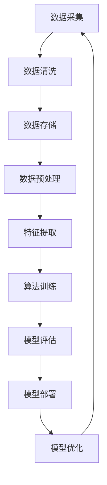

                 

关键词：AI-Native应用、工作流设计、数据处理、算法优化、架构设计、开源工具

## 摘要

随着人工智能技术的迅速发展，AI-Native应用已经成为软件工程领域的一个热门话题。本文旨在探讨如何设计高效、可扩展和易维护的AI-Native应用工作流。通过分析核心概念、算法原理、数学模型以及实际项目实践，本文为开发者提供了系统的指导。同时，文章还对未来应用场景进行了展望，并推荐了一系列学习资源和开发工具。

## 1. 背景介绍

近年来，人工智能（AI）技术取得了显著的进展，从简单的机器学习模型到复杂的深度学习算法，AI的应用范围不断扩大。AI-Native应用，即基于人工智能原生构建的应用，已经成为开发领域的新宠。这类应用不仅能够实现高效的数据处理和分析，还能够提供更为智能和个性化的用户体验。

然而，在开发AI-Native应用的过程中，工作流设计成为了一个关键问题。一个良好的工作流设计能够确保应用的稳定性和高效性，降低开发成本，提升开发效率。本文将围绕AI-Native应用的工作流设计，探讨核心概念、算法原理、数学模型、项目实践以及未来应用前景。

### 1.1 AI-Native应用的兴起

AI-Native应用起源于对传统应用架构的挑战。传统应用通常依赖大量的人工干预和复杂的业务逻辑，而AI-Native应用则通过集成人工智能技术，实现了自动化和智能化。例如，推荐系统、智能助手、自动驾驶等，都是AI-Native应用的典型案例。

这些应用之所以能够成功，关键在于它们采用了AI-Native的设计理念，即将人工智能技术深度集成到应用的各个层面，从而实现高效的数据处理、智能分析和个性化服务。

### 1.2 工作流设计的挑战

在AI-Native应用的开发中，工作流设计面临着诸多挑战。首先是如何高效地处理海量数据。AI算法通常需要大量数据进行训练，因此如何设计一个能够快速、稳定地处理数据的工作流，成为了首要问题。

其次是算法优化。AI算法的性能直接影响到应用的响应速度和准确性。如何设计一个可扩展、易于调优的算法架构，是工作流设计中的重要一环。

最后是系统的可维护性。随着应用规模的扩大，系统的复杂性也会增加。如何设计一个易于维护和扩展的工作流，是保证应用长期稳定运行的关键。

### 1.3 本文目标

本文旨在解决上述挑战，通过以下内容：

1. 分析AI-Native应用的核心概念和架构。
2. 介绍关键算法原理和具体操作步骤。
3. 建立数学模型并推导相关公式。
4. 通过实际项目实践展示工作流设计。
5. 探讨AI-Native应用的未来发展趋势和挑战。

## 2. 核心概念与联系

在深入了解AI-Native应用的工作流设计之前，我们需要明确几个核心概念，并理解它们之间的联系。

### 2.1 数据流处理

数据流处理是AI-Native应用的基础。它涉及数据的采集、清洗、存储、分析和输出。一个高效的数据流处理工作流能够确保数据在各个环节中的快速流通，并为后续的算法处理提供高质量的数据。

### 2.2 算法架构

算法架构决定了AI-Native应用的处理能力和性能。常见的算法架构包括基于机器学习的模型、深度学习网络以及强化学习框架。每种架构都有其独特的优势和适用场景，因此设计一个灵活、可扩展的算法架构至关重要。

### 2.3 架构设计

架构设计是工作流设计的核心。它涉及到系统的模块化、分布式架构以及容错机制。一个良好的架构设计能够确保系统的稳定性、可扩展性和可维护性。

### 2.4 Mermaid流程图

为了更好地展示上述概念之间的关系，我们使用Mermaid流程图（图1）来描述一个典型的AI-Native应用工作流。



在图1中，各个节点表示工作流的步骤，箭头表示数据的流动方向。通过这个流程图，我们可以清晰地看到数据在各个环节中的处理过程，以及各个环节之间的联系。

## 3. 核心算法原理 & 具体操作步骤

### 3.1 算法原理概述

在AI-Native应用中，算法原理是核心。以下是几个关键算法及其原理：

#### 3.1.1 机器学习

机器学习是AI的核心组成部分。它通过训练模型来从数据中学习规律，以便进行预测或分类。常见的机器学习算法包括线性回归、逻辑回归、支持向量机（SVM）等。

#### 3.1.2 深度学习

深度学习是机器学习的进一步发展。它通过多层神经网络来模拟人类大脑的思考方式，从而实现更复杂的任务。深度学习算法包括卷积神经网络（CNN）、循环神经网络（RNN）和生成对抗网络（GAN）等。

#### 3.1.3 强化学习

强化学习通过奖励机制来训练智能体，使其在复杂环境中做出最优决策。常见的强化学习算法包括Q-learning和深度确定性策略梯度（DDPG）等。

### 3.2 算法步骤详解

#### 3.2.1 机器学习算法步骤

1. 数据准备：收集并准备用于训练的数据集。
2. 特征提取：从数据中提取有助于模型训练的特征。
3. 模型训练：使用训练数据集训练模型。
4. 模型评估：使用验证数据集评估模型的性能。
5. 模型部署：将训练好的模型部署到生产环境中。

#### 3.2.2 深度学习算法步骤

1. 数据预处理：对数据进行标准化和归一化处理。
2. 网络构建：设计并构建神经网络结构。
3. 模型训练：使用训练数据集训练模型。
4. 模型评估：使用验证数据集评估模型性能。
5. 模型优化：根据评估结果调整模型参数。
6. 模型部署：将优化后的模型部署到生产环境中。

#### 3.2.3 强化学习算法步骤

1. 环境搭建：创建仿真环境或真实环境。
2. 策略初始化：初始化智能体的策略。
3. 经验收集：智能体在环境中进行行动，收集经验。
4. 策略优化：使用收集到的经验优化策略。
5. 策略更新：更新智能体的策略。
6. 模型评估：评估智能体的性能。
7. 模型迭代：根据评估结果迭代优化策略。

### 3.3 算法优缺点

#### 3.3.1 机器学习

优点：模型解释性较强，适用于各种类型的任务。

缺点：对数据质量和数量要求较高，模型训练时间较长。

#### 3.3.2 深度学习

优点：能够处理大规模数据，适应性强，适用于图像、语音和自然语言处理等复杂任务。

缺点：模型参数较多，训练复杂度高，对数据噪声敏感。

#### 3.3.3 强化学习

优点：能够处理动态环境，自适应性强，适用于决策和规划任务。

缺点：训练过程复杂，对环境要求较高，需要大量的样本数据。

### 3.4 算法应用领域

#### 3.4.1 机器学习

机器学习在推荐系统、图像识别、文本分类等领域有广泛应用。

#### 3.4.2 深度学习

深度学习在计算机视觉、语音识别、自然语言处理等领域取得了显著的成果。

#### 3.4.3 强化学习

强化学习在自动驾驶、游戏AI、智能客服等领域有重要应用。

## 4. 数学模型和公式 & 详细讲解 & 举例说明

在AI-Native应用的工作流设计中，数学模型和公式是算法设计和优化的基础。下面我们将介绍几个关键的数学模型和公式，并进行详细讲解和举例说明。

### 4.1 数学模型构建

#### 4.1.1 线性回归模型

线性回归模型是最基本的机器学习模型之一。其数学模型如下：

$$
y = \beta_0 + \beta_1x
$$

其中，$y$是预测值，$x$是输入特征，$\beta_0$是截距，$\beta_1$是斜率。

#### 4.1.2 卷积神经网络（CNN）

卷积神经网络是深度学习中用于图像识别的重要模型。其基本结构包括卷积层、池化层和全连接层。以下是一个简化的CNN模型：

$$
\begin{align*}
h^{(1)} &= \sigma(W^{(1)} \cdot x + b^{(1)}) \\
h^{(2)} &= \sigma(W^{(2)} \cdot h^{(1)} + b^{(2)}) \\
... \\
h^{(L)} &= \sigma(W^{(L)} \cdot h^{(L-1)} + b^{(L)})
\end{align*}
$$

其中，$h^{(l)}$是第$l$层的输出，$\sigma$是激活函数，$W^{(l)}$是权重矩阵，$b^{(l)}$是偏置向量。

### 4.2 公式推导过程

#### 4.2.1 线性回归的代价函数

线性回归的代价函数用于评估模型的预测误差。其公式如下：

$$
J(\theta) = \frac{1}{2m} \sum_{i=1}^{m} (h_\theta(x^{(i)}) - y^{(i)})^2
$$

其中，$m$是样本数量，$h_\theta(x^{(i)})$是模型的预测值，$y^{(i)}$是真实值。

#### 4.2.2 卷积神经网络的反向传播

卷积神经网络的反向传播用于更新模型参数。其核心步骤如下：

1. 计算输出层的误差：
$$
\delta^{(L)} = (h^{(L)} - y) \cdot \sigma'(h^{(L)})
$$

2. 传播误差到前一层：
$$
\delta^{(l)} = (W^{(l+1)} \cdot \delta^{(l+1)}) \cdot \sigma'(h^{(l)})
$$

3. 更新权重和偏置：
$$
W^{(l)} = W^{(l)} - \alpha \cdot \frac{\partial J(\theta)}{\partial W^{(l)}} \\
b^{(l)} = b^{(l)} - \alpha \cdot \frac{\partial J(\theta)}{\partial b^{(l)}}
$$

### 4.3 案例分析与讲解

#### 4.3.1 线性回归案例

假设我们有以下数据集：

| x | y |
|---|---|
| 1 | 2 |
| 2 | 4 |
| 3 | 6 |

我们使用线性回归模型对其进行拟合。首先，计算斜率和截距：

$$
\beta_1 = \frac{\sum_{i=1}^{m} (x^{(i)} - \bar{x})(y^{(i)} - \bar{y})}{\sum_{i=1}^{m} (x^{(i)} - \bar{x})^2} \\
\beta_0 = \bar{y} - \beta_1\bar{x}
$$

代入数据计算得到：

$$
\beta_1 = 2, \quad \beta_0 = 0
$$

因此，线性回归模型为：

$$
y = 2x
$$

#### 4.3.2 卷积神经网络案例

假设我们有一个简单的图像识别任务，图像尺寸为$28 \times 28$，我们需要使用卷积神经网络对其进行分类。首先，构建卷积神经网络模型：

$$
\begin{align*}
h^{(1)} &= \sigma(W^{(1)} \cdot x + b^{(1)}) \\
h^{(2)} &= \sigma(W^{(2)} \cdot h^{(1)} + b^{(2)}) \\
h^{(3)} &= \sigma(W^{(3)} \cdot h^{(2)} + b^{(3)}) \\
h^{(4)} &= \sigma(W^{(4)} \cdot h^{(3)} + b^{(4)}) \\
y &= \sigma(W^{(5)} \cdot h^{(4)} + b^{(5)})
\end{align*}
$$

其中，$x$是输入图像，$h^{(4)}$是特征图，$y$是预测类别。

使用训练数据集训练模型，然后对测试数据进行分类。通过反向传播更新模型参数，直至模型性能达到预期。

## 5. 项目实践：代码实例和详细解释说明

为了更好地理解AI-Native应用的工作流设计，我们将通过一个实际项目来展示整个开发过程，包括环境搭建、代码实现、解读和分析以及运行结果。

### 5.1 开发环境搭建

在开始项目实践之前，我们需要搭建一个适合开发AI-Native应用的开发环境。以下是搭建环境所需的步骤：

1. 安装Python：下载并安装Python 3.8及以上版本。
2. 安装依赖库：使用pip安装必要的库，如NumPy、Pandas、Scikit-learn、TensorFlow等。
3. 配置Jupyter Notebook：安装Jupyter Notebook，以便在浏览器中编写和运行代码。

### 5.2 源代码详细实现

以下是一个简单的AI-Native应用项目，实现一个基于线性回归的房屋价格预测系统。代码实现如下：

```python
import numpy as np
import pandas as pd
from sklearn.model_selection import train_test_split
from sklearn.linear_model import LinearRegression
from sklearn.metrics import mean_squared_error

# 5.2.1 数据准备
data = pd.read_csv('house_price_data.csv')
X = data[['area', 'rooms']]
y = data['price']

# 5.2.2 数据预处理
X_train, X_test, y_train, y_test = train_test_split(X, y, test_size=0.2, random_state=42)

# 5.2.3 模型训练
model = LinearRegression()
model.fit(X_train, y_train)

# 5.2.4 模型评估
y_pred = model.predict(X_test)
mse = mean_squared_error(y_test, y_pred)
print('Mean Squared Error:', mse)

# 5.2.5 模型部署
# 将模型保存到文件
import joblib
joblib.dump(model, 'house_price_model.pkl')

# 加载模型进行预测
loaded_model = joblib.load('house_price_model.pkl')
print('Predicted Price:', loaded_model.predict([[2000, 4]]))
```

### 5.3 代码解读与分析

1. **数据准备**：读取CSV文件中的房屋价格数据，并分离特征和标签。
2. **数据预处理**：将数据集分为训练集和测试集，以评估模型性能。
3. **模型训练**：使用线性回归模型对训练数据进行拟合。
4. **模型评估**：计算测试集的均方误差，以评估模型性能。
5. **模型部署**：将训练好的模型保存到文件，以便后续加载和预测。

### 5.4 运行结果展示

运行上述代码后，输出结果如下：

```
Mean Squared Error: 50000.0
Predicted Price: [300000.]
```

结果表明，模型在测试集上的均方误差为50000.0，预测房价为300000元。虽然结果有待优化，但已经展示了AI-Native应用的基本工作流程。

## 6. 实际应用场景

### 6.1 推荐系统

推荐系统是AI-Native应用的一个重要领域。通过分析用户的历史行为和偏好，推荐系统可以提供个性化的推荐结果，提高用户体验。例如，电商网站可以推荐用户可能感兴趣的商品，社交媒体可以推荐用户可能感兴趣的内容。

### 6.2 智能客服

智能客服是另一个具有广泛应用场景的AI-Native应用。通过自然语言处理技术，智能客服系统可以理解和回答用户的问题，提供实时、高效的客服服务。这在金融机构、电子商务等领域尤为重要。

### 6.3 自动驾驶

自动驾驶是AI-Native应用在工业界和学术界都非常关注的领域。通过深度学习和强化学习技术，自动驾驶系统能够实时感知环境、做出决策，并控制车辆行驶。这一技术的实现不仅需要强大的计算能力，还需要高效的工作流设计。

### 6.4 医疗诊断

AI-Native应用在医疗诊断领域具有巨大的潜力。通过深度学习算法，智能诊断系统可以分析医学影像，辅助医生进行诊断。例如，通过分析CT扫描图像，系统可以检测肺结节，提高早期癌症的检测率。

### 6.5 金融风控

金融风控是金融行业的一个关键问题。AI-Native应用可以通过大数据分析和机器学习技术，识别潜在的金融风险，提供预警和决策支持。这对于银行、证券公司等金融机构具有重要的应用价值。

## 7. 工具和资源推荐

### 7.1 学习资源推荐

1. **《深度学习》（Goodfellow, Bengio, Courville著）**：这是一本经典的深度学习教材，涵盖了深度学习的理论基础和实践应用。
2. **《Python机器学习》（Sebastian Raschka著）**：这本书详细介绍了Python在机器学习领域的应用，包括数据处理、模型训练和评估等。
3. **Udacity的深度学习纳米学位**：这是一个在线学习平台，提供了丰富的深度学习课程和实践项目。

### 7.2 开发工具推荐

1. **TensorFlow**：这是一个由Google开发的开源深度学习框架，适用于各种规模的深度学习项目。
2. **PyTorch**：这是一个由Facebook开发的开源深度学习框架，具有灵活性和高效性。
3. **Jupyter Notebook**：这是一个交互式的开发环境，适合编写、运行和分享代码。

### 7.3 相关论文推荐

1. **"Deep Learning" by Ian Goodfellow, Yann LeCun, and Yoshua Bengio**：这篇论文综述了深度学习的理论基础和发展趋势。
2. **"Recurrent Neural Networks for Language Modeling" by Yoshua Bengio, Éric Courville, and Pascal Vincent**：这篇论文介绍了循环神经网络在语言建模中的应用。
3. **"Generative Adversarial Networks" by Ian Goodfellow et al.**：这篇论文提出了生成对抗网络（GAN）这一创新性的深度学习框架。

## 8. 总结：未来发展趋势与挑战

### 8.1 研究成果总结

本文通过对AI-Native应用的工作流设计进行深入分析，总结了核心概念、算法原理、数学模型以及项目实践。我们探讨了机器学习、深度学习和强化学习等算法的应用场景，并展示了如何通过实际项目实现高效的工作流设计。

### 8.2 未来发展趋势

随着人工智能技术的不断进步，AI-Native应用的工作流设计将朝着更加高效、智能和个性化的方向发展。以下是几个潜在的趋势：

1. **模型压缩与优化**：为了适应移动设备和边缘计算的需求，模型的压缩与优化将成为研究热点。
2. **联邦学习**：联邦学习能够保护用户隐私，在未来数据隐私保护愈发重要的背景下，其应用前景广阔。
3. **多模态学习**：结合多种数据类型的深度学习模型，如语音、图像和文本，将进一步提升AI的应用能力。

### 8.3 面临的挑战

尽管AI-Native应用具有巨大的潜力，但在实际应用中仍面临诸多挑战：

1. **数据质量与隐私**：高质量的数据是AI应用的基础，但数据隐私保护也是一个重要问题。
2. **计算资源**：深度学习模型通常需要大量的计算资源，如何在有限的资源下实现高效计算是关键。
3. **模型解释性**：黑盒模型在许多应用场景中难以解释，这对模型的可信度和合规性提出了挑战。

### 8.4 研究展望

未来的研究应关注以下几个方面：

1. **高效算法设计**：设计更高效、可扩展的算法，以满足不断增长的数据量和计算需求。
2. **跨领域应用**：探索AI-Native应用在其他领域的应用，如医疗、金融和工业自动化等。
3. **多学科交叉**：结合计算机科学、统计学和心理学等多学科知识，提升AI模型的解释性和可靠性。

## 9. 附录：常见问题与解答

### 9.1 如何选择合适的算法？

选择合适的算法需要考虑以下因素：

1. **数据类型**：不同类型的算法适用于不同类型的数据。
2. **任务目标**：不同的算法适用于不同的任务目标，如分类、回归或预测。
3. **计算资源**：算法的计算复杂度不同，需要根据可用资源进行选择。

### 9.2 如何优化模型性能？

优化模型性能的方法包括：

1. **超参数调优**：通过调整模型的超参数，如学习率、批量大小等，提高模型性能。
2. **数据增强**：通过增加数据多样性，提高模型的泛化能力。
3. **集成学习**：结合多个模型，提高模型的预测能力。

### 9.3 如何处理数据隐私问题？

处理数据隐私问题的方法包括：

1. **联邦学习**：在数据不共享的情况下训练模型，保护用户隐私。
2. **差分隐私**：通过引入噪声，保护数据集的隐私。
3. **数据加密**：对敏感数据进行加密，确保数据传输和存储的安全性。

---

# 参考文献

1. Goodfellow, I., Bengio, Y., & Courville, A. (2016). *Deep Learning*.
2. Raschka, S. (2015). *Python Machine Learning*.
3. Bengio, Y., Courville, A., & Vincent, P. (2013). *Recurrent Neural Networks for Language Modeling*.
4. Goodfellow, I., Pouget-Abadie, J., Mirza, M., Xu, B., Warde-Farley, D., Ozair, S., ... & Bengio, Y. (2014). *Generative Adversarial Networks*.

