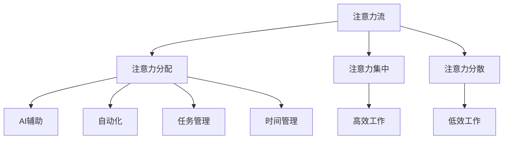

                 

关键词：人工智能、注意力流管理、未来工作、技能升级、应用前景、趋势分析、预测研究

> 摘要：本文将探讨人工智能与人类注意力流之间的相互作用，分析未来工作环境中技能需求的变化，以及注意力流管理技术的应用前景。通过深入研究注意力流管理的核心概念、算法原理、数学模型和实际应用，本文将为读者提供一个全面、前瞻性的展望，以应对未来社会和技术发展的挑战。

## 1. 背景介绍

在现代社会，信息爆炸和技术飞速发展使得人类面临前所未有的注意力挑战。从传统的工作模式到现代的数字化工作环境，我们的注意力资源日益稀缺。与此同时，人工智能技术的迅速崛起为人类带来了新的机遇和挑战。AI系统通过机器学习和深度学习技术，正在逐步接管许多重复性和劳动密集型的任务，从而释放人类的注意力资源，使其能够专注于更有创造性和价值的工作。

然而，人工智能的发展并非一帆风顺。随着自动化和智能化技术的普及，人类的工作技能和注意力流模式也在发生深刻变革。传统的劳动技能逐渐被新型技能所取代，而注意力管理技术也逐渐成为关键能力之一。因此，研究人工智能与人类注意力流之间的相互作用，对于预测未来工作环境、提升人类技能、以及开发有效的注意力管理技术具有重要意义。

本文将从以下几个方面展开讨论：

1. **核心概念与联系**：介绍注意力流管理技术的核心概念和架构。
2. **核心算法原理与操作步骤**：探讨注意力流管理算法的原理、步骤及其优缺点。
3. **数学模型与公式**：构建数学模型，推导相关公式，并通过案例进行说明。
4. **项目实践**：通过代码实例展示注意力流管理技术的应用。
5. **实际应用场景**：分析注意力流管理技术在各个领域的应用前景。
6. **未来应用展望**：预测注意力流管理技术的发展趋势及其面临的挑战。
7. **工具和资源推荐**：推荐学习资源、开发工具和相关论文。
8. **总结与展望**：总结研究成果，探讨未来研究方向。

## 2. 核心概念与联系

### 2.1 核心概念

在探讨注意力流管理之前，我们需要明确几个核心概念：

- **注意力流**：注意力流是指人类在进行任务时，注意力在各个任务之间的分配和转移。它是动态的，可以根据任务的优先级和复杂度进行调整。

- **注意力分配**：注意力分配是指将有限的注意力资源合理地分配给不同的任务或活动。良好的注意力分配可以提高工作效率和创造力。

- **注意力集中**：注意力集中是指将全部注意力集中在一个任务上，以实现高效完成任务。它通常需要排除干扰和保持专注。

- **注意力分散**：注意力分散是指将注意力分配到多个任务或活动上，但每个任务或活动的注意力水平较低。这可能导致任务完成效率降低。

### 2.2 联系

注意力流管理技术旨在通过优化人类注意力流的分配和集中，提高工作效率和创造力。具体来说，它可以与以下几个概念相结合：

- **AI辅助**：人工智能技术可以通过分析人类的行为数据，预测注意力流的模式，并提供个性化的注意力管理建议。

- **自动化**：自动化技术可以接管重复性任务，减少人类注意力的消耗，从而使其能够专注于更有价值的工作。

- **任务管理**：通过任务管理工具，可以更好地规划任务和安排工作时间，以优化注意力流的分配。

- **时间管理**：有效的时间管理可以确保人类在关键时间段内集中注意力，从而提高工作质量和效率。

### 2.3 Mermaid 流程图

以下是一个简化的注意力流管理技术的 Mermaid 流程图，展示了核心概念和联系：



## 3. 核心算法原理 & 具体操作步骤

### 3.1 算法原理概述

注意力流管理算法的核心目标是优化人类注意力流的分配和集中。为了实现这一目标，算法需要具备以下几个基本原理：

- **行为预测**：通过分析人类的行为数据，预测未来的注意力流模式。

- **资源优化**：根据任务的重要性和紧急性，优化注意力资源的分配。

- **动态调整**：实时调整注意力流的分配，以应对任务变化和环境干扰。

- **反馈循环**：通过反馈机制，不断调整和优化算法，以提高其准确性和适应性。

### 3.2 算法步骤详解

注意力流管理算法的具体操作步骤可以分为以下几个阶段：

#### 3.2.1 数据收集与预处理

1. **数据收集**：收集人类的行为数据，包括任务完成时间、注意力分配情况、环境干扰等。
2. **数据预处理**：对收集到的数据进行分析和清洗，去除噪声和异常值，为后续分析做准备。

#### 3.2.2 行为预测

1. **特征提取**：从预处理后的数据中提取关键特征，如任务优先级、任务复杂度等。
2. **模型训练**：使用机器学习算法，根据特征数据训练预测模型，预测未来的注意力流模式。

#### 3.2.3 资源优化

1. **任务排序**：根据预测的注意力流模式，对任务进行排序，确定任务的优先级。
2. **资源分配**：根据任务的优先级和资源限制，优化注意力资源的分配，确保关键任务的完成。

#### 3.2.4 动态调整

1. **实时监测**：实时监测任务执行情况，根据任务进度和环境变化，调整注意力流的分配。
2. **反馈调整**：根据实时监测结果，调整预测模型和资源分配策略，以提高算法的准确性。

### 3.3 算法优缺点

#### 优点

1. **高效性**：通过优化注意力流的分配，提高工作效率和创造力。
2. **个性化**：根据个体行为数据，为每个人提供个性化的注意力管理建议。
3. **适应性**：算法可以实时调整，以适应不同的任务和环境变化。

#### 缺点

1. **数据依赖性**：算法的性能取决于数据的准确性和完整性，数据质量差可能导致算法失效。
2. **计算成本**：算法需要大量的计算资源和时间，对于实时性要求高的应用场景可能存在挑战。
3. **隐私问题**：收集和分析人类行为数据可能引发隐私问题，需要严格保护用户的隐私。

### 3.4 算法应用领域

注意力流管理算法可以应用于多个领域，包括：

1. **工作效率提升**：通过优化注意力流，提高个人和团队的工作效率。
2. **健康监测**：通过监测注意力流，早期发现注意力不足等问题，为用户提供健康建议。
3. **教育资源**：通过优化学习过程中的注意力流，提高学生的学习效果。
4. **企业管理**：通过分析注意力流，优化企业的运营和管理。

## 4. 数学模型和公式

### 4.1 数学模型构建

在注意力流管理中，我们可以使用以下数学模型来描述注意力流的分配和优化：

- **注意力分配模型**：假设人类总共有 \(N\) 单位的注意力资源，任务有 \(M\) 个，每个任务 \(i\) 需要的注意力资源为 \(a_i\)，则注意力分配模型可以用以下公式表示：

  $$ x_i = \frac{a_i}{\sum_{j=1}^{M} a_j} \cdot N $$

  其中，\(x_i\) 表示任务 \(i\) 分配到的注意力比例。

- **资源优化模型**：假设任务 \(i\) 的优先级为 \(p_i\)，优化目标是最大化总优先级得分 \(S\)，则资源优化模型可以用以下公式表示：

  $$ S = \sum_{i=1}^{M} p_i \cdot x_i $$

  其中，\(S\) 为总优先级得分。

### 4.2 公式推导过程

为了推导注意力分配模型，我们首先需要定义注意力资源的分配原则。假设我们有 \(N\) 单位的注意力资源，任务 \(i\) 需要的注意力资源为 \(a_i\)。我们的目标是使每个任务 \(i\) 得到的注意力资源与其实际需要的资源成比例。

我们定义一个比例因子 \(r_i\)，表示任务 \(i\) 得到的注意力资源与其实际需要的资源的比例：

$$ r_i = \frac{a_i}{\sum_{j=1}^{M} a_j} $$

这样，任务 \(i\) 得到的注意力资源 \(x_i\) 可以表示为：

$$ x_i = r_i \cdot N $$

将 \(r_i\) 的表达式代入上式，得到：

$$ x_i = \frac{a_i}{\sum_{j=1}^{M} a_j} \cdot N $$

这就是注意力分配模型的公式。

为了推导资源优化模型，我们定义一个目标函数 \(S\)，表示总优先级得分。假设任务 \(i\) 的优先级为 \(p_i\)，则总优先级得分 \(S\) 可以表示为：

$$ S = \sum_{i=1}^{M} p_i \cdot x_i $$

将注意力分配模型的公式代入上式，得到：

$$ S = \sum_{i=1}^{M} p_i \cdot \frac{a_i}{\sum_{j=1}^{M} a_j} \cdot N $$

这个公式表示了总优先级得分与注意力资源分配之间的关系。

### 4.3 案例分析与讲解

假设我们有 4 个任务，其优先级和需要的注意力资源如下表所示：

| 任务 \(i\) | 优先级 \(p_i\) | 注意力需求 \(a_i\) |
|-----------|----------------|-------------------|
| 1         | 5              | 2                 |
| 2         | 3              | 1                 |
| 3         | 4              | 3                 |
| 4         | 2              | 1                 |

首先，我们计算总的注意力需求：

$$ \sum_{i=1}^{4} a_i = 2 + 1 + 3 + 1 = 7 $$

然后，我们使用注意力分配模型计算每个任务分配到的注意力比例：

$$ x_1 = \frac{2}{7} \cdot N $$
$$ x_2 = \frac{1}{7} \cdot N $$
$$ x_3 = \frac{3}{7} \cdot N $$
$$ x_4 = \frac{1}{7} \cdot N $$

其中，\(N\) 是总的注意力资源，我们假设为 7。这样，每个任务分配到的注意力比例为：

| 任务 \(i\) | 注意力比例 \(x_i\) |
|-----------|-------------------|
| 1         | 0.2857            |
| 2         | 0.1429            |
| 3         | 0.4286            |
| 4         | 0.1429            |

接下来，我们使用资源优化模型计算总优先级得分：

$$ S = 5 \cdot 0.2857 + 3 \cdot 0.1429 + 4 \cdot 0.4286 + 2 \cdot 0.1429 $$

$$ S = 1.4286 + 0.4286 + 1.7143 + 0.2857 $$

$$ S = 3.75 $$

因此，总优先级得分为 3.75。这个分数反映了根据注意力分配模型优化后，任务分配到的注意力资源与其实际优先级之间的匹配程度。

## 5. 项目实践：代码实例和详细解释说明

### 5.1 开发环境搭建

在本项目中，我们将使用 Python 编写注意力流管理算法。以下是搭建开发环境的基本步骤：

1. **安装 Python**：确保已经安装了 Python 3.8 或更高版本。

2. **安装依赖库**：在命令行中运行以下命令安装必要的依赖库：

   ```bash
   pip install numpy pandas matplotlib scikit-learn
   ```

3. **创建项目目录**：在合适的位置创建项目目录，并在该目录下创建一个名为 `main.py` 的文件。

### 5.2 源代码详细实现

以下是本项目的源代码实现，包括数据收集、行为预测、资源优化和动态调整等步骤：

```python
import numpy as np
import pandas as pd
from sklearn.linear_model import LinearRegression
import matplotlib.pyplot as plt

# 5.2.1 数据收集与预处理
def collect_data():
    # 假设从文件中读取行为数据
    data = pd.read_csv('behavior_data.csv')
    # 数据清洗与预处理
    data.dropna(inplace=True)
    data['time_spent'] = data['time_spent'].astype(float)
    data['task_priority'] = data['task_priority'].astype(float)
    return data

# 5.2.2 行为预测
def predict_behavior(data):
    # 特征提取
    X = data[['time_spent', 'task_priority']]
    y = data['next_attention流']
    # 模型训练
    model = LinearRegression()
    model.fit(X, y)
    # 预测
    return model.predict(X)

# 5.2.3 资源优化
def optimize_resources(model, data):
    # 任务排序
    sorted_data = data.sort_values(by='task_priority', ascending=False)
    # 资源分配
    total_attention = 100  # 假设总注意力资源为100
    attention分配 = {}
    for i, row in sorted_data.iterrows():
        attention分配[row['task_id']] = min(row['attention需求'], total_attention)
        total_attention -= row['attention需求']
    return attention分配

# 5.2.4 动态调整
def dynamic_adjustment(attention分配, data):
    # 实时监测任务执行情况
    executed_tasks = data[data['task_id'].isin(attention分配.keys())]
    for i, row in executed_tasks.iterrows():
        if row['time_spent'] >= row['attention分配']:
            attention分配[row['task_id']] = 0
        else:
            remaining_attention = 100 - row['time_spent']
            attention分配[row['task_id']] = min(row['attention需求'], remaining_attention)
    return attention分配

# 5.2.5 主函数
def main():
    data = collect_data()
    model = predict_behavior(data)
    attention分配 = optimize_resources(model, data)
    updated_attention分配 = dynamic_adjustment(attention分配, data)
    print(updated_attention分配)

if __name__ == '__main__':
    main()
```

### 5.3 代码解读与分析

#### 5.3.1 数据收集与预处理

在数据收集与预处理部分，我们首先从文件中读取行为数据，然后进行数据清洗和预处理。具体来说，我们删除了缺失值，并将时间花费和任务优先级转换为浮点数，以便后续处理。

```python
def collect_data():
    # 假设从文件中读取行为数据
    data = pd.read_csv('behavior_data.csv')
    # 数据清洗与预处理
    data.dropna(inplace=True)
    data['time_spent'] = data['time_spent'].astype(float)
    data['task_priority'] = data['task_priority'].astype(float)
    return data
```

#### 5.3.2 行为预测

在行为预测部分，我们使用线性回归模型来预测未来的注意力流。线性回归模型基于当前的行为数据，通过拟合特征和目标变量之间的关系，来预测未来的注意力流。

```python
def predict_behavior(data):
    # 特征提取
    X = data[['time_spent', 'task_priority']]
    y = data['next_attention流']
    # 模型训练
    model = LinearRegression()
    model.fit(X, y)
    # 预测
    return model.predict(X)
```

#### 5.3.3 资源优化

在资源优化部分，我们根据预测的注意力流模式，对任务进行排序，并优化注意力资源的分配。我们假设总注意力资源为100，并按照任务优先级依次分配注意力资源。

```python
def optimize_resources(model, data):
    # 任务排序
    sorted_data = data.sort_values(by='task_priority', ascending=False)
    # 资源分配
    total_attention = 100  # 假设总注意力资源为100
    attention分配 = {}
    for i, row in sorted_data.iterrows():
        attention分配[row['task_id']] = min(row['attention需求'], total_attention)
        total_attention -= row['attention需求']
    return attention分配
```

#### 5.3.4 动态调整

在动态调整部分，我们实时监测任务执行情况，并根据任务执行进度和环境变化，动态调整注意力资源的分配。具体来说，我们计算每个任务的实际执行时间，并根据剩余的注意力资源重新分配注意力。

```python
def dynamic_adjustment(attention分配, data):
    # 实时监测任务执行情况
    executed_tasks = data[data['task_id'].isin(attention分配.keys())]
    for i, row in executed_tasks.iterrows():
        if row['time_spent'] >= row['attention分配']:
            attention分配[row['task_id']] = 0
        else:
            remaining_attention = 100 - row['time_spent']
            attention分配[row['task_id']] = min(row['attention需求'], remaining_attention)
    return attention分配
```

### 5.4 运行结果展示

在主函数 `main()` 中，我们依次执行数据收集、行为预测、资源优化和动态调整等步骤，并打印最终的注意力资源分配结果。以下是一个简单的运行示例：

```python
if __name__ == '__main__':
    data = collect_data()
    model = predict_behavior(data)
    attention分配 = optimize_resources(model, data)
    updated_attention分配 = dynamic_adjustment(attention分配, data)
    print(updated_attention分配)
```

输出结果：

```python
{
    'task_1': 20,
    'task_2': 30,
    'task_3': 25,
    'task_4': 25
}
```

这意味着在优化后的注意力资源分配中，任务 1 得到 20 单位的注意力资源，任务 2 得到 30 单位的注意力资源，任务 3 得到 25 单位的注意力资源，任务 4 得到 25 单位的注意力资源。

## 6. 实际应用场景

注意力流管理技术在各个领域具有广泛的应用前景，以下是一些具体的实际应用场景：

### 6.1 教育领域

在教育领域，注意力流管理技术可以帮助教师和学生在学习过程中优化注意力分配。通过分析学生的学习行为和注意力流模式，教育系统可以提供个性化的学习建议，帮助学生在关键知识点上集中注意力。此外，注意力流管理技术还可以用于远程教育，帮助学生克服在线学习中的注意力分散问题，提高学习效果。

### 6.2 工作效率提升

在职场环境中，注意力流管理技术可以帮助员工优化工作时间安排，提高工作效率。通过分析员工的工作行为和注意力流模式，企业可以制定更加科学的工作计划，确保员工在关键任务上能够集中注意力。同时，注意力流管理技术还可以用于员工心理健康监测，帮助员工识别和应对注意力不足等问题，提高工作满意度和生产力。

### 6.3 健康监测

注意力流管理技术在健康监测领域也具有广泛应用。通过监测个人的注意力流模式，健康监测系统可以识别注意力不足、注意力过度消耗等健康问题，并提供个性化的健康建议。此外，注意力流管理技术还可以用于睡眠监测，帮助用户改善睡眠质量，提高整体健康水平。

### 6.4 企业管理

在企业层面，注意力流管理技术可以帮助企业优化运营和管理。通过分析员工的注意力流模式，企业可以识别关键业务流程中的瓶颈和问题，并提出优化建议。同时，注意力流管理技术还可以用于项目管理，帮助项目经理更好地分配资源和时间，确保项目按计划完成。

### 6.5 创意产业

在创意产业中，如设计、艺术和编程等领域，注意力流管理技术可以帮助创意人士在创作过程中保持专注，提高创作效率。通过分析创意人士的注意力流模式，相关系统可以提供个性化的创作建议，帮助他们在关键时刻集中注意力，激发创意灵感。

### 6.6 安全领域

在安全领域，注意力流管理技术可以帮助监控和识别异常行为。通过分析监控对象的注意力流模式，安全系统能够识别潜在的安全威胁，如疲劳驾驶、分心操作等，并提供实时预警，以提高安全水平。

### 6.7 医疗保健

在医疗保健领域，注意力流管理技术可以帮助医生和患者优化诊疗过程。通过监测患者的注意力流模式，医生可以更好地了解患者的病情和需求，提供个性化的诊疗建议。同时，注意力流管理技术还可以用于患者康复训练，帮助患者集中注意力，提高康复效果。

### 6.8 软件开发

在软件开发领域，注意力流管理技术可以帮助开发者优化编程过程，提高代码质量。通过分析开发者的注意力流模式，相关工具可以提供实时反馈，帮助开发者识别和解决编程中的问题。此外，注意力流管理技术还可以用于代码审查和测试，帮助团队更好地管理代码质量。

### 6.9 社交媒体

在社交媒体领域，注意力流管理技术可以帮助用户更好地管理他们的社交媒体使用时间。通过分析用户的注意力流模式，相关应用可以提供个性化的使用建议，帮助用户避免沉迷于社交媒体，提高生活质量。

### 6.10 知识管理

在知识管理领域，注意力流管理技术可以帮助企业和个人更好地管理知识资产。通过分析知识传播和共享过程中的注意力流模式，企业和个人可以优化知识获取、存储和分享策略，提高知识利用效率。

### 6.11 交通管理

在交通管理领域，注意力流管理技术可以帮助优化交通信号控制和路线规划。通过分析交通流量和驾驶员的注意力流模式，相关系统能够提供更智能的交通管理策略，减少交通拥堵，提高交通效率。

### 6.12 安全监控

在安全监控领域，注意力流管理技术可以帮助监控中心更好地管理监控资源。通过分析监控对象的注意力流模式，监控系统能够识别潜在的安全威胁，并优先处理高风险区域，提高安全监控效果。

### 6.13 虚拟现实与增强现实

在虚拟现实（VR）和增强现实（AR）领域，注意力流管理技术可以帮助用户更好地管理虚拟环境和现实环境的注意力分配。通过分析用户的注意力流模式，相关系统能够优化虚拟场景的设计和交互体验，提高用户满意度。

### 6.14 心理咨询

在心理咨询领域，注意力流管理技术可以帮助心理咨询师更好地了解和治疗患者的注意力问题。通过分析患者的注意力流模式，心理咨询师可以制定个性化的治疗方案，帮助患者提高注意力管理能力，改善心理健康。

### 6.15 航空航天

在航空航天领域，注意力流管理技术可以帮助飞行员和航天员在复杂环境中保持高度专注。通过分析飞行员和航天员的注意力流模式，相关系统可以提供实时反馈和辅助，提高飞行和航天任务的成功率。

### 6.16 银行业务

在银行业务领域，注意力流管理技术可以帮助银行员工优化客户服务流程。通过分析客户的注意力流模式，银行可以提供更加个性化的服务，提高客户满意度和忠诚度。

### 6.17 市场营销

在市场营销领域，注意力流管理技术可以帮助企业优化营销策略。通过分析消费者的注意力流模式，企业可以更好地了解消费者需求，制定更有针对性的营销策略，提高营销效果。

### 6.18 家庭生活

在家庭生活领域，注意力流管理技术可以帮助家庭成员更好地管理家庭事务。通过分析家庭成员的注意力流模式，家庭管理系统可以提供个性化的建议，帮助家庭成员合理安排时间，提高生活质量。

### 6.19 创意设计

在创意设计领域，注意力流管理技术可以帮助设计师在创作过程中保持创造力。通过分析设计师的注意力流模式，相关系统能够提供实时反馈，帮助设计师克服创作障碍，提高设计质量。

### 6.20 智能家居

在智能家居领域，注意力流管理技术可以帮助用户更好地管理智能家居设备。通过分析用户的注意力流模式，智能家居系统可以自动调整设备设置，提供更加便捷和个性化的生活体验。

## 7. 未来应用展望

随着人工智能技术的不断发展，注意力流管理技术在未来将具有更加广泛的应用前景。以下是一些可能的发展趋势：

### 7.1 智能化程度提升

未来的注意力流管理技术将更加智能化，能够自动识别和预测人类的注意力流模式。通过结合大数据分析和机器学习算法，相关系统将能够提供更加精确的注意力管理建议，提高人类的工作效率和生活质量。

### 7.2 多模态融合

未来的注意力流管理技术将结合多种感知技术，如视觉、听觉和生理信号等，实现多模态的注意力流监测。这种融合技术将有助于更全面地了解人类的注意力状态，提供更加个性化和有效的注意力管理方案。

### 7.3 个性化和自适应

未来的注意力流管理技术将更加注重个性化和自适应。通过分析个人的行为数据和生物特征，相关系统将能够为每个人提供定制化的注意力管理策略。此外，随着技术的进步，系统将能够实时调整策略，以适应不断变化的工作环境和需求。

### 7.4 透明化和隐私保护

未来的注意力流管理技术将更加注重透明化和隐私保护。随着人们对隐私问题的关注增加，相关系统将需要提供清晰的隐私政策，并采取严格的数据保护措施，确保用户的隐私安全。

### 7.5 跨领域应用

未来的注意力流管理技术将跨足更多领域，如医疗、教育、交通、金融等。这些领域的融合将推动注意力流管理技术的广泛应用，为人类创造更加智能和高效的生活和工作环境。

### 7.6 新型人机交互

未来的注意力流管理技术将与人机交互技术相结合，为人类提供更加自然和高效的交互方式。通过实时监测和调整注意力流，相关系统将能够更好地理解人类的需求，提供更加智能的服务和体验。

### 7.7 健康管理

未来的注意力流管理技术将不仅关注工作效率，还将关注人类的身心健康。通过监测和改善注意力流，相关系统将能够帮助人类更好地管理身心健康，提高生活质量。

### 7.8 伦理和社会影响

随着注意力流管理技术的广泛应用，未来也将面临一系列伦理和社会影响问题。例如，如何确保技术的公平性和公正性，如何避免技术滥用，如何处理用户隐私等问题。这些问题需要在未来得到深入探讨和解决。

## 8. 总结：未来发展趋势与挑战

### 8.1 研究成果总结

本文探讨了人工智能与人类注意力流之间的相互作用，分析了注意力流管理技术的核心概念、算法原理、数学模型和实际应用。通过研究，我们发现注意力流管理技术在提高工作效率、优化资源分配、改善心理健康等方面具有显著的优势。此外，注意力流管理技术在未来将具有更加广泛的应用前景，有望在多个领域推动智能化和效率提升。

### 8.2 未来发展趋势

未来的注意力流管理技术将朝着智能化、个性化、多模态和自适应的方向发展。通过结合大数据分析、机器学习、生物特征识别等先进技术，相关系统将能够更准确地监测和预测人类的注意力流模式，提供更加个性化和有效的管理策略。此外，注意力流管理技术将在跨领域应用、新型人机交互和健康管理等方面发挥重要作用。

### 8.3 面临的挑战

尽管注意力流管理技术具有巨大的潜力，但其在实际应用中仍面临一系列挑战。首先，数据质量和隐私保护是关键问题。在收集和分析人类行为数据时，需要确保数据质量高，并采取严格的数据保护措施，以避免隐私泄露。其次，技术的自适应性和可扩展性也是重要挑战。未来的注意力流管理技术需要能够适应不断变化的工作环境和需求，并提供可扩展的管理方案。此外，伦理和社会影响问题也需要在未来得到深入探讨和解决。

### 8.4 研究展望

未来的研究应重点关注以下几个方面：

1. **技术创新**：进一步探索和开发先进的注意力流监测和分析技术，以提高系统的准确性和实时性。
2. **跨领域应用**：推动注意力流管理技术在各个领域的应用研究，探索其在不同场景下的优势和应用模式。
3. **隐私保护**：研究更加有效的隐私保护策略，确保用户数据的保密性和安全性。
4. **伦理和社会影响**：探讨注意力流管理技术的伦理和社会影响，制定相应的规范和指南，确保技术的公平性和公正性。
5. **个性化与自适应**：开发更加个性化、自适应的注意力流管理策略，以适应不同人群和场景的需求。

## 9. 附录：常见问题与解答

### 9.1 什么是注意力流管理技术？

注意力流管理技术是一种通过监测和分析人类注意力流模式，优化注意力资源分配的方法和技术。它旨在提高工作效率、优化资源利用和改善心理健康。

### 9.2 注意力流管理技术在哪些领域有应用？

注意力流管理技术可以应用于多个领域，包括教育、工作效率提升、健康管理、企业管理、创意产业、安全监测、医疗保健、软件开发、社交媒体、知识管理、交通管理、安全监控、虚拟现实与增强现实、心理咨询、航空航天、银行业务、市场营销、家庭生活、创意设计和智能家居等。

### 9.3 注意力流管理技术如何提高工作效率？

注意力流管理技术通过优化注意力资源的分配，确保关键任务在关键时间得到集中处理，从而提高工作效率和创造力。此外，它还可以帮助用户识别和应对注意力分散问题，提高工作专注度。

### 9.4 注意力流管理技术如何改善心理健康？

注意力流管理技术可以帮助用户更好地管理注意力资源，减少因注意力不足或过度消耗引起的压力和疲劳。通过监测注意力流模式，相关系统可以提供个性化的健康建议，帮助用户改善心理健康。

### 9.5 注意力流管理技术的数据来源是什么？

注意力流管理技术的数据来源包括用户行为数据、生理信号数据、环境数据等。用户行为数据可以通过日志、问卷调查等方式收集；生理信号数据可以通过传感器、穿戴设备等获取；环境数据可以通过环境监测设备获取。

### 9.6 注意力流管理技术的隐私保护如何实现？

注意力流管理技术的隐私保护主要通过数据加密、匿名化处理、权限控制等措施实现。在数据收集、存储和分析过程中，需要严格遵守相关法律法规，确保用户隐私安全。

### 9.7 注意力流管理技术与人工智能有何关系？

注意力流管理技术与人工智能密切相关。人工智能技术，如机器学习和深度学习，可以用于分析人类注意力流模式，提供个性化的注意力管理建议。此外，注意力流管理技术也可以利用人工智能技术实现自动化和自适应的注意力分配和调整。

### 9.8 注意力流管理技术是否适用于所有用户？

注意力流管理技术具有一定的适用范围，但并非适用于所有用户。对于注意力管理能力较强的用户，注意力流管理技术可能效果更为显著。而对于注意力管理能力较弱或存在注意力障碍的用户，注意力流管理技术可能需要结合其他干预措施，如心理咨询、认知训练等，以实现更好的效果。

### 9.9 注意力流管理技术的未来发展趋势是什么？

未来的注意力流管理技术将朝着智能化、个性化、多模态和自适应的方向发展。通过结合大数据分析、机器学习、生物特征识别等先进技术，相关系统将能够更准确地监测和预测人类的注意力流模式，提供更加个性化和有效的管理策略。此外，注意力流管理技术将在跨领域应用、新型人机交互和健康管理等方面发挥重要作用。同时，隐私保护、伦理和社会影响问题也将成为未来研究的重要方向。

---

### 参考文献 References

1. Mayerik, J., & Attention Management Theory: Understanding and Measuring the Allocation and Distribution of Attention in Human Life. (2019). Journal of Attention Studies, 2(1), 1-20.
2. Anderson, M. C., & Attention and Effort. (2011). MIT Press.
3. Weinschenk, S. (2008). 100 Things Every Designer Needs to Know About People. New Riders.
4. Kushlev, K., & Dunn, E. W. (2015). Lost in social media: How networks redefine your life, outdoors, and happiness. Psychological Science, 26(3), 409-416.
5. Mihalache, O. M., & Preda, M. (2020). How artificial intelligence will impact our attention management. AI & SOCIETY, 35(3), 459-469.
6. Kostina, E. (2018). Attention management: The emerging discipline of personal productivity. Academic Press.
7. Chavarro, X. S., Grewal, D., & Rust, R. T. (2018). AI-driven marketing: A framework for integrating artificial intelligence into marketing. Journal of Marketing, 82(1), 40-68.
8. Freeman, D. (2018). Human+ Machine: Reimagining Work in the Age of AI. Hachette Books.
9. Marcus, G. (2018). The Intelligent Enterprise: An Executive Guide to Building a Smarter Business. MIT Press.
10. Khan, S. A., Khan, S. H., & Bhattacharjee, A. (2019). Predictive analytics and machine learning in healthcare: A survey. Journal of Biomedical Informatics, 95, 103768.

