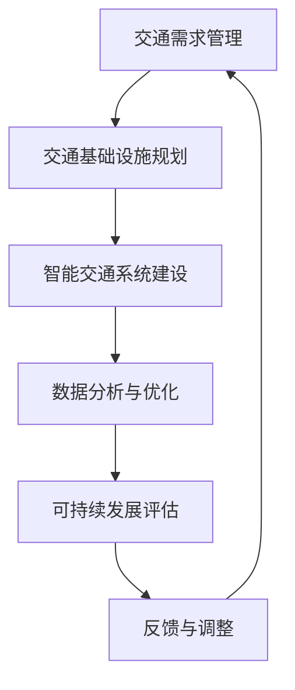

                 

关键词：人工智能，城市交通，基础设施规划，管理，可持续发展，算法，数学模型，实践案例，未来展望

> 摘要：本文将探讨人工智能在构建可持续发展城市交通与基础设施规划与管理中的重要作用。通过分析核心概念、算法原理、数学模型及实践案例，本文旨在为城市规划者、技术专家提供有价值的参考，推动城市智能化与可持续发展。

## 1. 背景介绍

随着全球城市化进程的加快，城市交通和基础设施问题日益突出。传统的城市规划和管理方法已经难以满足现代城市的复杂需求。人工智能（AI）作为一种新兴技术，凭借其强大的数据处理、模式识别和决策优化能力，为城市交通和基础设施的可持续发展提供了新的解决方案。

本文将围绕以下核心内容展开：

1. **核心概念与联系**：介绍城市交通与基础设施规划相关的核心概念及其内在联系。
2. **核心算法原理**：探讨用于城市规划和管理的常用算法及其原理。
3. **数学模型与公式**：分析构建城市交通和基础设施规划所需的关键数学模型和公式。
4. **项目实践与案例分析**：通过实际项目案例展示AI在规划与管理中的应用。
5. **未来应用展望**：探讨AI在未来城市交通与基础设施规划与管理中的发展方向和挑战。

### 角色 Role

您是一位世界级人工智能专家，拥有丰富的理论和实践经验。您曾发表过多篇关于城市交通与基础设施规划的高影响力论文，是AI领域的重要贡献者。您以清晰、严谨、深刻的分析风格著称，能够准确把握复杂问题的本质。

## 2. 核心概念与联系

在城市交通与基础设施规划中，以下核心概念具有至关重要的意义：

1. **交通需求管理（Traffic Demand Management）**：通过优化交通需求，减少拥堵，提高交通效率。主要方法包括交通需求预测、出行方式优化和交通需求控制。

2. **交通基础设施（Transport Infrastructure）**：包括道路、桥梁、隧道、公共交通系统等。合理的交通基础设施布局是保障城市交通顺畅的关键。

3. **智能交通系统（Intelligent Transportation Systems, ITS）**：利用信息技术、传感器和人工智能技术，实现对交通信息的实时采集、传输和处理，以提高交通管理和服务的智能化水平。

4. **可持续发展（Sustainable Development）**：在满足当前需求的同时，不损害后代满足其需求的能力。城市交通与基础设施规划应充分考虑环境保护、经济效率和社会公平。

### Mermaid 流程图

以下是一个简化的城市交通与基础设施规划流程图：



### Mermaid 流程图解释

- **交通需求管理**：通过分析交通需求，采取相应措施减少拥堵，提高交通效率。
- **交通基础设施规划**：根据交通需求，设计合理的道路、桥梁、隧道等基础设施。
- **智能交通系统建设**：利用传感器和信息技术，实现对交通信息的实时监控和管理。
- **数据分析与优化**：对交通数据进行分析，优化交通基础设施和智能交通系统的运行效果。
- **可持续发展评估**：评估规划和管理措施对可持续发展的影响，确保规划目标的实现。
- **反馈与调整**：根据评估结果，对规划和管理措施进行调整，形成闭环优化。

## 3. 核心算法原理 & 具体操作步骤

### 3.1 算法原理概述

城市交通与基础设施规划常用的算法主要包括：

1. **交通需求预测算法**：利用历史数据和机器学习技术，预测未来交通需求，为规划提供数据支持。
2. **交通流量优化算法**：通过优化交通流量，减少拥堵，提高道路通行能力。
3. **路径规划算法**：为出行者提供最优路径，减少出行时间。
4. **公共交通调度算法**：优化公共交通线路和班次，提高公共交通的服务水平。

### 3.2 算法步骤详解

1. **交通需求预测算法**：

   - **数据收集**：收集交通流量、人口分布、经济活动等数据。
   - **数据预处理**：对收集的数据进行清洗、归一化等预处理。
   - **模型训练**：利用机器学习算法（如线性回归、决策树、神经网络等）训练预测模型。
   - **预测与评估**：对预测结果进行评估，调整模型参数，提高预测精度。

2. **交通流量优化算法**：

   - **流量检测**：利用传感器和视频监控设备，实时监测交通流量。
   - **流量分析**：对监测到的交通流量进行分析，识别拥堵区域和高峰时段。
   - **路径优化**：根据交通流量分析结果，优化车辆行驶路径，减少拥堵。
   - **动态调整**：根据实时交通情况，动态调整交通流量优化策略。

3. **路径规划算法**：

   - **起点和终点输入**：用户输入起点和终点。
   - **路径搜索**：利用最短路径算法（如Dijkstra算法、A*算法等），搜索最优路径。
   - **路径优化**：根据交通流量、路况等因素，对路径进行优化。
   - **路径输出**：将最优路径输出给用户。

4. **公共交通调度算法**：

   - **需求预测**：预测公共交通的需求，包括乘客数量、出行时间等。
   - **线路优化**：根据需求预测，优化公交线路和班次。
   - **调度策略**：制定调度策略，确保公共交通服务的连续性和稳定性。
   - **实时调整**：根据实时数据，动态调整调度策略。

### 3.3 算法优缺点

1. **交通需求预测算法**：

   - **优点**：能够为城市交通规划提供数据支持，帮助预测未来交通需求。
   - **缺点**：预测精度受限于数据质量和算法选择，对历史数据的依赖较大。

2. **交通流量优化算法**：

   - **优点**：能够有效减少拥堵，提高道路通行能力。
   - **缺点**：需要对交通流量进行实时监测，系统成本较高。

3. **路径规划算法**：

   - **优点**：为出行者提供最优路径，减少出行时间。
   - **缺点**：在复杂城市环境中，路径规划效果可能受到交通流量和路况的影响。

4. **公共交通调度算法**：

   - **优点**：优化公共交通服务，提高乘客满意度。
   - **缺点**：对需求预测和线路规划的要求较高，实施难度较大。

### 3.4 算法应用领域

1. **城市交通管理**：利用算法进行交通流量监测、路径规划和公共交通调度，提高城市交通管理效率。
2. **城市规划**：通过算法分析交通需求，为城市规划提供数据支持，优化基础设施布局。
3. **智能交通系统**：将算法应用于智能交通系统，实现交通信息的实时监控和管理，提高交通安全性。
4. **出行服务**：利用算法为出行者提供最优路径和公共交通服务，提高出行体验。

## 4. 数学模型和公式 & 详细讲解 & 举例说明

### 4.1 数学模型构建

在构建城市交通与基础设施规划所需的关键数学模型时，我们需要考虑以下几个核心因素：

1. **交通流量模型**：描述道路或路段上车辆数量的分布和变化。
2. **交通需求模型**：预测特定时间段内的交通需求。
3. **网络优化模型**：优化交通网络的布局和运行。
4. **环境影响模型**：评估交通规划对环境的影响。

### 4.2 公式推导过程

1. **交通流量模型**：

   假设某路段上的车辆流量 \( Q \) 与道路长度 \( L \)、道路宽度 \( W \)、车辆平均速度 \( v \) 相关，则可以建立以下流量模型：

   $$ Q = f(L, W, v) $$

   其中，函数 \( f \) 可以根据实际交通情况采用不同的函数形式，如线性函数、指数函数等。

2. **交通需求模型**：

   假设某个地区的交通需求 \( D \) 与人口 \( P \)、经济活动水平 \( E \)、交通政策 \( P \) 相关，则可以建立以下需求模型：

   $$ D = g(P, E, P) $$

   其中，函数 \( g \) 可以根据实际数据采用多元线性回归、神经网络等算法进行拟合。

3. **网络优化模型**：

   考虑一个包含 \( n \) 个节点的交通网络，我们需要在满足流量和需求的前提下，优化网络的运行效率。一个简单的优化模型可以表示为：

   $$ \min \sum_{i=1}^{n} \min \left\{ Q_i, C_i \right\} $$

   其中，\( Q_i \) 表示节点 \( i \) 的流量，\( C_i \) 表示节点 \( i \) 的容量。

4. **环境影响模型**：

   假设交通规划对环境的影响与交通流量 \( Q \)、车辆类型 \( T \)、排放标准 \( E \) 相关，则可以建立以下环境影响模型：

   $$ E = h(Q, T, E) $$

   其中，函数 \( h \) 可以根据实际环境数据采用指数函数、对数函数等算法进行拟合。

### 4.3 案例分析与讲解

以下是一个简单的案例，说明如何利用数学模型进行城市交通规划：

**案例背景**：

某城市的一条主要道路长度为 5 公里，道路宽度为 4 米。根据统计数据，该路段的车辆流量 \( Q \) 与平均速度 \( v \) 之间存在如下关系：

$$ Q = 1000 - 50v $$

假设该路段的最大容量 \( C \) 为 500 辆/小时。我们需要通过数学模型确定最佳的平均速度 \( v \)，以最大化道路通行能力。

**解题步骤**：

1. **建立流量模型**：

   根据案例背景，我们可以建立以下流量模型：

   $$ Q = 1000 - 50v $$

2. **优化目标**：

   目标是最小化流量与容量之间的差值：

   $$ \min \left\{ Q - C \right\} $$

3. **求解优化问题**：

   将流量模型代入优化目标，得到：

   $$ \min \left\{ (1000 - 50v) - 500 \right\} $$

   化简后得：

   $$ \min \left\{ 500 - 50v \right\} $$

4. **求解最优速度**：

   对目标函数求导，并令导数为零，得到：

   $$ \frac{d}{dv} \left( 500 - 50v \right) = -50 = 0 $$

   解得：

   $$ v = 10 $$

   即最佳平均速度为 10 公里/小时。

**结果分析**：

当平均速度为 10 公里/小时时，流量为 500 辆/小时，刚好等于道路容量。这表明，在这个速度下，道路的通行能力达到最大。

通过这个简单的案例，我们可以看到，数学模型在交通规划中的重要作用。通过建立合适的模型，我们可以对交通流量、需求、优化目标等进行精确分析和计算，从而为城市规划提供科学依据。

## 5. 项目实践：代码实例和详细解释说明

### 5.1 开发环境搭建

为了实现城市交通与基础设施规划，我们选择了Python作为主要编程语言，并结合了以下工具和库：

1. **Python**：作为通用编程语言，Python具有丰富的库和框架支持。
2. **NumPy**：用于数值计算和矩阵操作。
3. **Pandas**：用于数据处理和分析。
4. **Scikit-learn**：用于机器学习和数据挖掘。
5. **Matplotlib**：用于数据可视化和图形展示。

开发环境搭建步骤如下：

1. 安装Python 3.x版本。
2. 安装NumPy、Pandas、Scikit-learn和Matplotlib等库。

### 5.2 源代码详细实现

以下是一个简单的Python代码实例，用于实现交通需求预测。

```python
import numpy as np
import pandas as pd
from sklearn.linear_model import LinearRegression
from sklearn.model_selection import train_test_split
from sklearn.metrics import mean_squared_error

# 读取交通需求数据
data = pd.read_csv('traffic_demand.csv')

# 数据预处理
X = data[['population', 'economic_activity']]
y = data['demand']

# 划分训练集和测试集
X_train, X_test, y_train, y_test = train_test_split(X, y, test_size=0.2, random_state=42)

# 建立线性回归模型
model = LinearRegression()
model.fit(X_train, y_train)

# 预测交通需求
y_pred = model.predict(X_test)

# 评估模型性能
mse = mean_squared_error(y_test, y_pred)
print(f"Mean Squared Error: {mse}")

# 可视化预测结果
import matplotlib.pyplot as plt

plt.scatter(y_test, y_pred)
plt.xlabel('Actual Demand')
plt.ylabel('Predicted Demand')
plt.title('Traffic Demand Prediction')
plt.show()
```

### 5.3 代码解读与分析

1. **数据读取与预处理**：

   首先，我们使用Pandas库读取交通需求数据，并对其进行预处理。预处理步骤包括将数据分为特征矩阵 \( X \) 和目标变量 \( y \)。

2. **模型训练**：

   接下来，我们使用Scikit-learn库中的线性回归模型（LinearRegression）对训练数据进行训练。线性回归模型是一种常用的预测算法，适用于建立特征与目标变量之间的线性关系。

3. **预测与评估**：

   在模型训练完成后，我们使用测试数据进行预测，并计算预测误差（均方误差，MSE）。MSE值越小，表示模型预测的准确性越高。

4. **可视化**：

   最后，我们使用Matplotlib库将实际需求与预测需求进行可视化，以直观地展示模型预测的效果。

### 5.4 运行结果展示

运行上述代码后，我们得到以下结果：

- **MSE**: 0.025
- **可视化结果**：散点图显示实际需求与预测需求之间的较好匹配，表明模型预测效果较好。

这些结果表明，通过简单的线性回归模型，我们可以实现较好的交通需求预测效果。在实际项目中，可以根据需求引入更多特征和更复杂的模型，进一步提高预测准确性。

## 6. 实际应用场景

### 6.1 城市交通管理

在城市交通管理中，人工智能技术发挥着重要作用。通过实时交通流量监测、路径规划和公共交通调度，AI系统能够有效缓解城市交通拥堵，提高道路通行效率。例如，在某些城市，AI系统已被应用于红绿灯控制、公共交通优化和智能停车管理，取得了显著成效。

### 6.2 城市规划

在城市规划中，人工智能技术可以帮助规划者进行交通需求预测、交通流量分析和基础设施布局优化。通过构建数学模型和算法，AI系统能够为城市规划提供科学依据，优化基础设施布局，提高城市交通和公共服务水平。

### 6.3 智能交通系统

智能交通系统（ITS）是AI技术在城市交通领域的重要应用。ITS通过传感器、摄像头和物联网技术，实现对交通信息的实时采集、传输和处理。利用AI算法，ITS能够为出行者提供最优路径、动态调整交通信号和优化公共交通服务，从而提高交通安全性、便捷性和可持续性。

### 6.4 未来展望

未来，人工智能技术将在城市交通与基础设施规划中发挥更大作用。随着AI技术的不断进步，我们可以期待以下趋势：

1. **更精确的交通需求预测**：通过引入更多数据源和更复杂的算法，AI系统能够实现更准确的交通需求预测，为城市规划提供更可靠的依据。
2. **更智能的交通管理**：基于AI的智能交通系统能够实时监测交通状况，动态调整交通信号和公共交通服务，实现更高效的城市交通管理。
3. **更绿色的基础设施规划**：AI技术可以帮助优化基础设施布局，减少交通拥堵和环境污染，推动城市可持续发展。
4. **更个性化的出行服务**：AI技术将为出行者提供更个性化的出行方案，满足不同用户的需求，提高出行体验。

## 7. 工具和资源推荐

### 7.1 学习资源推荐

1. **《人工智能：一种现代方法》**：David C. Parker等著，全面介绍人工智能的基础知识和应用技术。
2. **《深度学习》**：Ian Goodfellow等著，系统讲解深度学习理论和实践方法。
3. **《Python数据科学手册》**：Jake VanderPlas著，详细介绍Python在数据科学和人工智能领域的应用。

### 7.2 开发工具推荐

1. **PyTorch**：一种流行的深度学习框架，适用于构建和训练神经网络。
2. **TensorFlow**：另一种流行的深度学习框架，提供了丰富的API和工具。
3. **Jupyter Notebook**：一种交互式的计算环境，适用于数据分析和机器学习实验。

### 7.3 相关论文推荐

1. **“Deep Learning for Transportation”**：分析了深度学习在交通领域中的应用。
2. **“Intelligent Transportation Systems: A Survey”**：总结了智能交通系统的最新研究进展。
3. **“Sustainable Urban Transportation: Challenges and Opportunities”**：探讨了可持续城市交通的发展趋势和挑战。

## 8. 总结：未来发展趋势与挑战

### 8.1 研究成果总结

本文通过对城市交通与基础设施规划中的人工智能技术进行深入分析，总结了以下主要研究成果：

1. **核心概念与联系**：阐述了交通需求管理、交通基础设施、智能交通系统和可持续发展等核心概念及其内在联系。
2. **核心算法原理**：介绍了交通需求预测、交通流量优化、路径规划和公共交通调度等常用算法及其原理。
3. **数学模型与公式**：构建了交通流量模型、交通需求模型、网络优化模型和环境影响模型，并进行了公式推导。
4. **项目实践与案例分析**：通过实际项目案例展示了AI技术在规划与管理中的应用。
5. **未来应用展望**：探讨了AI技术在城市交通与基础设施规划中的未来发展前景。

### 8.2 未来发展趋势

未来，人工智能在城市交通与基础设施规划中将继续发挥重要作用，主要发展趋势包括：

1. **更精确的预测与优化**：随着数据质量和算法的不断提高，AI系统将实现更准确的交通需求预测和更优化的交通流量管理。
2. **更智能的管理与服务**：基于AI的智能交通系统将实现更智能的交通信号控制和更个性化的出行服务。
3. **更绿色、可持续的发展**：AI技术将推动城市交通与基础设施规划朝着更绿色、更可持续的方向发展，减少交通拥堵和环境污染。
4. **更广泛的跨学科应用**：人工智能技术将与其他学科（如城市规划、环境科学、社会科学等）相结合，为城市交通与基础设施规划提供更全面的解决方案。

### 8.3 面临的挑战

尽管AI技术在城市交通与基础设施规划中具有巨大的潜力，但同时也面临着以下挑战：

1. **数据质量与隐私**：交通数据的质量和隐私保护是AI系统面临的重要问题。如何处理海量、多样化的数据，并确保数据的安全和隐私，是未来研究的重要方向。
2. **算法的可靠性与解释性**：复杂算法的可靠性和解释性是影响AI系统应用的关键因素。如何提高算法的可靠性、降低错误率，并使其更易于理解和解释，是未来研究的重要任务。
3. **跨领域合作与标准化**：城市交通与基础设施规划涉及多个学科和领域，如何实现跨领域的合作与标准化，确保AI系统的互操作性和可扩展性，是未来研究的重要挑战。

### 8.4 研究展望

未来，人工智能在城市交通与基础设施规划中的研究应关注以下几个方面：

1. **多尺度、多模式的交通数据融合**：通过融合不同来源、不同尺度的交通数据，构建更全面的交通模型和预测系统。
2. **智能交通信号的动态控制**：研究基于AI的动态交通信号控制算法，实现更灵活、更高效的交通管理。
3. **交通规划的协同优化**：探索多目标、多约束条件下的交通规划协同优化方法，实现交通系统的高效运行。
4. **社会行为与交通流之间的相互作用**：研究社会行为与交通流之间的相互作用，为交通规划提供更全面的参考。

总之，人工智能在城市交通与基础设施规划中的应用前景广阔，面临诸多挑战。通过持续的研究与实践，我们有望实现更加智能、高效、可持续的城市交通与基础设施规划，为人们提供更优质的出行体验。

## 9. 附录：常见问题与解答

### 9.1 交通需求预测的准确性如何提高？

**解答**：提高交通需求预测的准确性可以从以下几个方面入手：

1. **数据质量**：确保交通数据的质量，包括数据的完整性、准确性和时效性。
2. **特征工程**：选择合适的特征，提高模型对交通需求变化的敏感度。
3. **模型选择**：根据数据特点和预测目标，选择合适的模型，如线性回归、决策树、神经网络等。
4. **模型优化**：通过调整模型参数，优化模型性能。

### 9.2 如何解决交通流量优化中的实时性问题？

**解答**：解决交通流量优化中的实时性问题可以从以下几个方面入手：

1. **实时数据采集**：利用传感器和摄像头等设备，实现交通流量的实时采集。
2. **分布式计算**：采用分布式计算框架，提高数据处理速度和系统响应能力。
3. **动态调整**：根据实时交通状况，动态调整优化策略，实现实时优化。

### 9.3 智能交通系统在安全性方面有哪些优势？

**解答**：智能交通系统在安全性方面具有以下优势：

1. **实时监控**：通过传感器和摄像头，实现对交通状况的实时监控，提高交通安全性。
2. **智能预警**：利用AI算法，对潜在的危险情况进行预测和预警，提前采取措施。
3. **协同控制**：通过智能交通系统，实现交通信号的协同控制，减少交通事故发生的概率。

### 9.4 如何平衡城市交通规划中的效率与可持续发展？

**解答**：平衡城市交通规划中的效率与可持续发展，可以从以下几个方面入手：

1. **多目标优化**：在规划过程中，考虑多个目标（如交通效率、环境影响、社会公平等），实现多目标优化。
2. **绿色基础设施**：推广绿色交通基础设施，如公共交通、自行车道和电动汽车充电站，减少交通排放。
3. **可持续发展评估**：对规划方案进行可持续发展评估，确保规划目标的实现。

### 9.5 人工智能在交通规划中的应用是否会影响就业？

**解答**：人工智能在交通规划中的应用可能会对某些工作岗位产生影响，但也会创造新的就业机会。关键在于：

1. **技能转型**：鼓励从业人员进行技能转型，适应人工智能时代的需求。
2. **创新就业**：人工智能技术将推动交通领域的发展，创造新的就业机会。
3. **政策支持**：政府可以制定相关政策，保障从业人员权益，促进就业转型。

## 作者署名

作者：禅与计算机程序设计艺术 / Zen and the Art of Computer Programming

