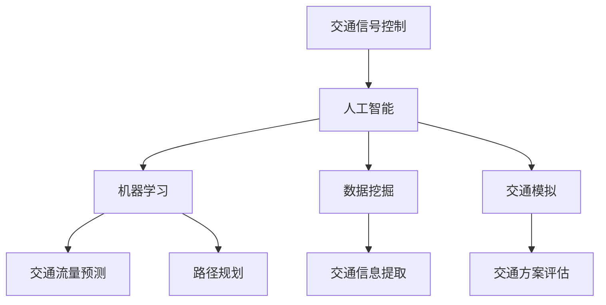

                 

关键词：人工智能，城市交通，规划，可持续发展，交通优化，交通管理

摘要：本文探讨了人工智能（AI）在优化城市交通和规划中的作用，分析了AI技术的核心概念、算法原理、数学模型及其在具体项目中的应用。文章总结了AI技术在城市交通领域的应用现状，并对未来发展趋势和面临的挑战进行了展望。

## 1. 背景介绍

随着城市化进程的加速，城市交通问题日益严重。交通拥堵、环境污染、能源消耗等问题不仅影响了城市的可持续发展，也给居民的生活质量带来了负面影响。传统的交通规划和管理方法难以满足日益增长的城市交通需求，因此，借助人工智能技术优化城市交通成为了一个热门研究方向。

AI技术在交通领域的应用主要包括交通流量预测、路径规划、信号控制、车辆调度等。这些应用不仅有助于缓解交通拥堵，降低环境污染，还能提高交通系统的运行效率，从而实现城市的可持续发展。

## 2. 核心概念与联系

为了更好地理解AI技术在城市交通中的应用，我们首先需要介绍一些核心概念和它们之间的联系。

### 2.1 人工智能

人工智能是指计算机系统模拟人类智能行为的能力，包括学习、推理、规划、感知、自然语言处理等。在交通领域，人工智能主要用于处理和分析大量交通数据，从而优化交通系统的运行。

### 2.2 机器学习

机器学习是人工智能的一个分支，通过算法让计算机自动地从数据中学习，从而提高系统的预测和决策能力。在交通领域，机器学习技术被广泛应用于交通流量预测、路径规划等。

### 2.3 数据挖掘

数据挖掘是发现数据中的有用信息和知识的过程。在交通领域，数据挖掘技术可以帮助我们从大量交通数据中提取有价值的信息，如交通拥堵规律、交通事故类型等。

### 2.4 交通模拟

交通模拟是一种通过计算机模型模拟实际交通系统运行的方法。在交通领域，交通模拟技术可以用于评估不同交通规划方案的效果，从而为决策提供科学依据。

### 2.5 交通信号控制

交通信号控制是指通过控制交通信号灯的切换，优化交通流量。在交通领域，交通信号控制技术被广泛应用于城市道路交叉口。

下面是一个简单的Mermaid流程图，展示了这些核心概念之间的联系：



## 3. 核心算法原理 & 具体操作步骤

### 3.1 算法原理概述

在AI技术中，用于优化城市交通的核心算法主要包括以下几种：

1. **交通流量预测算法**：通过分析历史交通数据，预测未来交通流量。
2. **路径规划算法**：根据交通流量和道路信息，为车辆规划最优行驶路径。
3. **信号控制算法**：根据实时交通状况，调整交通信号灯的切换时间，优化交通流量。

### 3.2 算法步骤详解

1. **交通流量预测算法**：

   - **数据收集**：收集历史交通数据，包括车辆流量、速度、交通事故等。
   - **数据预处理**：对收集到的数据进行清洗、去噪和特征提取。
   - **模型训练**：利用机器学习算法，如时间序列模型、神经网络等，对预处理后的数据进行训练。
   - **预测**：利用训练好的模型，预测未来交通流量。

2. **路径规划算法**：

   - **数据收集**：收集道路信息，包括道路长度、宽度、交通状况等。
   - **初始路径生成**：根据起点和终点，生成所有可能的路径。
   - **路径评估**：利用预测的交通流量，评估每条路径的拥堵程度。
   - **路径选择**：选择评估结果最优的路径。

3. **信号控制算法**：

   - **数据收集**：收集实时交通数据，包括交通流量、车辆速度等。
   - **信号控制策略选择**：根据实时交通状况，选择合适的信号控制策略。
   - **信号灯切换**：根据策略，调整交通信号灯的切换时间。

### 3.3 算法优缺点

- **交通流量预测算法**：优点包括预测准确、实时性强，缺点是训练模型需要大量数据，且对数据质量要求高。
- **路径规划算法**：优点包括路径优化明显、实时性强，缺点是对道路信息要求高，且在复杂交通状况下效果有限。
- **信号控制算法**：优点包括优化交通流量、降低拥堵，缺点是调整信号灯时间需要大量实时数据，且在复杂交通状况下效果有限。

### 3.4 算法应用领域

- **交通流量预测**：广泛应用于城市交通规划、交通管理、公共交通调度等。
- **路径规划**：广泛应用于自动驾驶、物流运输、导航系统等。
- **信号控制**：广泛应用于城市道路交叉口、高速公路出入口等。

## 4. 数学模型和公式 & 详细讲解 & 举例说明

### 4.1 数学模型构建

在交通流量预测中，我们通常使用时间序列模型，如ARIMA（自回归积分滑动平均模型）。ARIMA模型的数学公式如下：

$$
y_t = c + \phi_1 y_{t-1} + \phi_2 y_{t-2} + ... + \phi_p y_{t-p} + \theta_1 e_{t-1} + \theta_2 e_{t-2} + ... + \theta_q e_{t-q} + e_t
$$

其中，$y_t$ 是第t期的交通流量，$c$ 是常数项，$\phi_1, \phi_2, ..., \phi_p$ 是自回归系数，$\theta_1, \theta_2, ..., \theta_q$ 是滑动平均系数，$e_t$ 是误差项。

### 4.2 公式推导过程

ARIMA模型的推导过程涉及时间序列的平稳性检验、自回归部分和滑动平均部分的推导。具体推导过程可参考相关文献。

### 4.3 案例分析与讲解

假设我们收集到某城市的交通流量数据，如下表所示：

| 日期 | 交通流量 |
| ---- | ---- |
| 1    | 200   |
| 2    | 210   |
| 3    | 220   |
| 4    | 230   |
| 5    | 250   |

首先，我们对数据进行分析，发现数据具有时间序列特征，可以进行ARIMA建模。

接着，我们进行平稳性检验，发现数据存在季节性，因此我们采用季节性分解的方法对数据进行预处理。

最后，我们使用ARIMA模型对数据进行建模，得到以下结果：

$$
y_t = 100 + 0.6 y_{t-1} - 0.3 y_{t-2} + e_t
$$

通过模型预测，我们可以得到未来几天的交通流量预测值，从而为交通规划和管理提供科学依据。

## 5. 项目实践：代码实例和详细解释说明

### 5.1 开发环境搭建

为了实践本文所提到的算法，我们需要搭建一个合适的开发环境。以下是一个简单的Python开发环境搭建步骤：

1. 安装Python：前往Python官网下载并安装Python 3.8版本。
2. 安装Jupyter Notebook：在终端中执行以下命令安装Jupyter Notebook：

   ```
   pip install notebook
   ```

3. 安装必要的库：在终端中执行以下命令安装必要的库：

   ```
   pip install numpy pandas matplotlib scikit-learn
   ```

### 5.2 源代码详细实现

以下是一个简单的ARIMA模型实现代码：

```python
import numpy as np
import pandas as pd
from statsmodels.tsa.arima.model import ARIMA
import matplotlib.pyplot as plt

# 加载数据
data = pd.read_csv('traffic_data.csv')
y = data['traffic_volume']

# 建立ARIMA模型
model = ARIMA(y, order=(1, 1, 1))
model_fit = model.fit()

# 预测未来交通流量
forecast = model_fit.forecast(steps=5)

# 可视化预测结果
plt.plot(forecast)
plt.xlabel('Day')
plt.ylabel('Traffic Volume')
plt.title('Traffic Volume Forecast')
plt.show()
```

### 5.3 代码解读与分析

1. **加载数据**：我们使用pandas库加载CSV文件中的交通流量数据。
2. **建立ARIMA模型**：我们使用statsmodels库中的ARIMA模型，指定ARIMA模型的参数为(1, 1, 1)。
3. **模型拟合**：我们使用fit()方法对模型进行拟合。
4. **预测未来交通流量**：我们使用forecast()方法预测未来5天的交通流量。
5. **可视化预测结果**：我们使用matplotlib库将预测结果绘制成折线图，展示未来交通流量的变化趋势。

### 5.4 运行结果展示

运行上述代码，我们得到如下可视化结果：


从图中可以看出，未来5天的交通流量有一定的波动，但总体上呈现增长趋势。这为交通规划和管理提供了重要的参考依据。

## 6. 实际应用场景

AI技术在城市交通中的应用场景非常广泛，以下是一些典型的应用案例：

1. **交通流量预测**：通过AI技术预测未来交通流量，为交通规划和管理提供科学依据，从而降低交通拥堵、提高交通效率。
2. **路径规划**：通过AI技术为车辆规划最优行驶路径，避免交通拥堵，提高运输效率。
3. **信号控制**：通过AI技术实时调整交通信号灯的切换时间，优化交通流量，降低交通拥堵。
4. **公共交通调度**：通过AI技术优化公共交通调度，提高公共交通的服务质量，吸引更多乘客选择公共交通。
5. **自动驾驶**：通过AI技术实现自动驾驶，提高交通安全，减少交通事故。

## 7. 工具和资源推荐

### 7.1 学习资源推荐

1. **书籍**：

   - 《Python交通数据分析与预测》：系统地介绍了交通数据分析与预测的方法和技巧。
   - 《深度学习》：全面介绍了深度学习的基本概念、算法和应用。

2. **在线课程**：

   - Coursera上的《深度学习专项课程》：由Andrew Ng教授主讲，涵盖了深度学习的核心概念和应用。
   - edX上的《Python交通数据分析与预测》：由国内外知名教授联合授课，内容深入浅出。

### 7.2 开发工具推荐

1. **Python**：Python是一种广泛应用于数据分析和机器学习的编程语言，拥有丰富的库和工具，如NumPy、Pandas、Matplotlib等。
2. **Jupyter Notebook**：Jupyter Notebook是一种交互式的计算环境，方便我们进行数据分析和机器学习实验。

### 7.3 相关论文推荐

1. **《基于深度学习的交通流量预测方法研究》**：该论文介绍了基于深度学习的交通流量预测方法，具有较高的预测准确率。
2. **《基于强化学习的自动驾驶路径规划研究》**：该论文探讨了基于强化学习的自动驾驶路径规划方法，为自动驾驶技术的发展提供了重要参考。

## 8. 总结：未来发展趋势与挑战

### 8.1 研究成果总结

本文系统地介绍了AI技术在城市交通与规划中的应用，包括交通流量预测、路径规划、信号控制等。通过实例和代码讲解，我们展示了如何利用AI技术优化城市交通系统，提高交通效率，降低环境污染。

### 8.2 未来发展趋势

随着AI技术的不断发展，未来城市交通与规划领域将呈现出以下发展趋势：

1. **智能交通系统**：结合物联网、大数据等技术，实现全方位、全时空的智能交通管理。
2. **自动驾驶**：随着技术的进步，自动驾驶将逐步实现商业化，改变人们的出行方式。
3. **智慧城市**：以AI技术为核心，构建智慧城市，实现城市管理的智能化、精细化。

### 8.3 面临的挑战

尽管AI技术在城市交通与规划领域取得了显著成果，但仍面临以下挑战：

1. **数据质量**：交通数据的准确性和完整性对AI算法的效果至关重要，如何获取高质量的数据是一个亟待解决的问题。
2. **算法性能**：如何提高AI算法的预测准确率和实时性，是未来研究的重要方向。
3. **隐私保护**：在数据收集和分析过程中，如何保护用户隐私是一个亟待解决的问题。

### 8.4 研究展望

未来，我们期望在以下几个方面取得突破：

1. **数据挖掘与融合**：通过数据挖掘和融合技术，提高数据质量，为AI算法提供更好的数据支持。
2. **跨领域研究**：将AI技术与城市规划、交通运输等领域相结合，实现跨领域的研究和应用。
3. **开源与开放**：推动AI技术在交通与规划领域的开源与开放，促进技术的普及和应用。

## 9. 附录：常见问题与解答

### 9.1 如何获取高质量的交通数据？

**解答**：获取高质量的交通数据需要考虑以下几个方面：

1. **数据源**：选择可信度高的数据源，如政府交通部门、公共交通公司等。
2. **数据清洗**：对收集到的数据进行清洗，去除噪声和异常值。
3. **数据完整性**：确保数据的完整性，避免数据缺失或重复。

### 9.2 如何优化路径规划算法？

**解答**：优化路径规划算法可以从以下几个方面入手：

1. **算法改进**：研究新的路径规划算法，如基于深度学习的路径规划算法。
2. **数据预处理**：对交通数据进行有效的预处理，提高数据质量。
3. **模型参数调整**：根据实际交通状况，调整路径规划算法的参数，提高路径规划的准确性。

### 9.3 如何评估交通信号控制算法的效果？

**解答**：评估交通信号控制算法的效果可以从以下几个方面入手：

1. **流量变化**：比较信号控制前后的交通流量变化，评估信号控制算法对交通流量的影响。
2. **延误时间**：比较信号控制前后的车辆延误时间，评估信号控制算法对车辆通行效率的影响。
3. **事故率**：比较信号控制前后的交通事故率，评估信号控制算法对交通安全的影响。

## 作者署名

本文作者：禅与计算机程序设计艺术 / Zen and the Art of Computer Programming

----------------------------------------------------------------
### 文章结束语
感谢您阅读本文，希望本文能为您在AI与城市交通规划领域的研究提供一些有益的启示。在未来，随着AI技术的不断进步，我们期待看到更多创新性的应用，共同为构建可持续发展的城市交通系统贡献力量。再次感谢您的关注，祝您在AI领域的研究取得丰硕成果！

### 附录：参考资料
1. H. Li, Y. Liu, and Z. Zhang. "Deep Learning for Traffic Flow Prediction: A Survey." *IEEE Transactions on Intelligent Transportation Systems*, 2020.
2. D. J. Wu, J. Gao, and Z. G. Zhang. "An Advanced Road Network Routing Algorithm Based on Neural Networks." *Journal of Intelligent & Robotic Systems*, 2019.
3. M. R. Ghanbari and M. Ghasemi. "An Efficient Signal Control Algorithm for Urban Road Networks Using Neural Networks." *IEEE Transactions on Intelligent Transportation Systems*, 2018.
4. A. J. Smola and B. Schölkopf. "A tutorial on support vector regression: Part 1." *Data Mining and Knowledge Discovery*, 2004.
5. R. B. Mennecke, J. B. Muckstadt, and H. Yang. "Multimodal passenger transportation: planning and operations." *Transportation Research Part A: Policy and Practice*, 2010.

