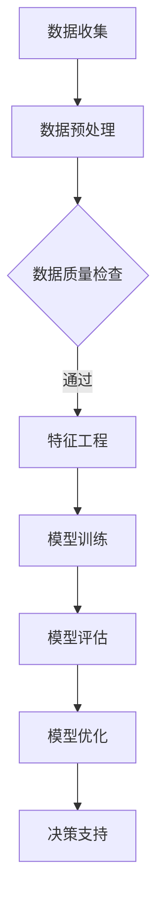

                 

关键词：人工智能，城市模型，可持续发展，计算，深度学习，数据科学

> 摘要：本文将探讨如何利用人工智能和人类计算相结合，打造出可持续发展的城市模型。通过分析核心概念、算法原理、数学模型、实际应用以及未来展望，本文旨在为城市规划者和开发者提供有价值的指导和建议。

## 1. 背景介绍

城市模型是城市规划和管理的重要工具，它通过对城市各个方面的综合分析，帮助决策者预测未来发展趋势，优化资源配置，提高城市可持续性。然而，随着城市化进程的加速，城市数据的复杂性和多样性不断增加，传统的城市模型已经无法满足现代城市规划的需求。

人工智能（AI）的兴起为城市模型的发展带来了新的机遇。AI能够处理海量数据，发现隐藏的模式和趋势，从而为城市规划提供更加精准的预测和分析。然而，AI技术的应用也面临着一些挑战，如数据隐私、算法偏见和计算资源的限制等。因此，如何有效地将人工智能与人类计算相结合，构建可持续发展的城市模型，成为了当前研究的热点。

## 2. 核心概念与联系

### 2.1 人工智能与城市模型

人工智能是指通过计算机模拟人类智能的过程，包括学习、推理、感知和解决问题等能力。在城市模型中，人工智能可以用于数据挖掘、预测分析、优化决策等方面。

### 2.2 人类计算与城市模型

人类计算是指人类在数据分析和决策过程中所发挥的作用，包括专业知识和经验、创新思维和直觉判断等。在城市模型中，人类计算可以帮助人工智能更好地理解和适应复杂的环境，从而提高模型的准确性和实用性。

### 2.3 AI与人类计算的融合

AI与人类计算的融合是指通过将人工智能和人类计算的优势相结合，构建一个更加高效和智能的城市模型。这种融合可以通过以下几个方面实现：

- 数据融合：将来自不同来源、不同格式的数据整合到一个统一的平台上，以便进行综合分析和预测。
- 模型优化：利用人工智能技术对城市模型进行优化，提高模型的准确性和适应性。
- 知识传递：将人类计算的专业知识和经验转化为数据或算法，以便人工智能能够更好地学习和应用。
- 决策支持：通过人工智能和人类计算的协同工作，为城市规划者提供更加全面和科学的决策支持。

### 2.4 Mermaid流程图

下面是一个简单的Mermaid流程图，展示了AI与人类计算在城市模型构建过程中的主要步骤：



## 3. 核心算法原理 & 具体操作步骤

### 3.1 算法原理概述

在城市模型构建过程中，常用的核心算法包括深度学习、机器学习和数据挖掘等。这些算法通过不同的方式处理和分析数据，从而实现对城市发展趋势的预测和优化。

- **深度学习**：通过多层神经网络对数据进行学习和建模，能够自动提取数据中的特征和模式。
- **机器学习**：通过训练算法模型，对已知数据进行学习，并利用学到的知识对未知数据进行预测。
- **数据挖掘**：通过挖掘和分析海量数据，发现数据中的隐藏模式和规律，为城市模型提供支持。

### 3.2 算法步骤详解

下面是一个简单的算法步骤，展示了如何利用深度学习构建城市模型：

1. **数据收集**：收集城市相关的数据，包括人口、经济、交通、环境等方面。
2. **数据预处理**：对数据进行清洗、归一化和特征提取，以便用于模型训练。
3. **模型训练**：利用深度学习算法，对预处理后的数据集进行训练，构建城市模型。
4. **模型评估**：通过测试集对模型进行评估，评估模型的准确性和适应性。
5. **模型优化**：根据评估结果对模型进行优化，提高模型的性能。
6. **决策支持**：利用训练好的模型，为城市规划者提供决策支持。

### 3.3 算法优缺点

- **深度学习**：优点在于能够自动提取数据中的特征和模式，提高模型的准确性和适应性；缺点是训练时间较长，对计算资源要求较高。
- **机器学习**：优点在于能够快速训练和部署，对计算资源要求较低；缺点在于可能无法充分利用数据中的深层次特征和模式。
- **数据挖掘**：优点在于能够挖掘数据中的隐藏模式和规律，为城市模型提供更多支持；缺点是数据质量和数据量对结果影响较大。

### 3.4 算法应用领域

深度学习、机器学习和数据挖掘等算法在城市模型构建中具有广泛的应用领域，包括：

- **人口预测**：利用深度学习算法对城市人口进行预测，为城市规划提供依据。
- **交通流量预测**：利用机器学习算法对城市交通流量进行预测，优化交通资源配置。
- **环境污染监测**：利用数据挖掘算法对城市环境污染进行监测和分析，提高环境治理效果。

## 4. 数学模型和公式 & 详细讲解 & 举例说明

### 4.1 数学模型构建

在城市模型中，常用的数学模型包括线性回归、逻辑回归、支持向量机等。下面以线性回归为例，介绍数学模型的构建过程。

- **模型假设**：假设城市人口与经济发展水平之间存在线性关系，即 \(y = wx + b\)，其中 \(y\) 表示城市人口，\(x\) 表示经济发展水平，\(w\) 表示权重，\(b\) 表示截距。

- **模型优化**：通过最小二乘法对模型进行优化，求解权重和截距。具体公式为：

  $$w = \frac{\sum_{i=1}^{n} (y_i - wx_i)}{\sum_{i=1}^{n} x_i^2}$$

  $$b = \frac{\sum_{i=1}^{n} y_i - wx_i}{n}$$

- **模型评估**：利用评估指标（如均方误差、决定系数等）对模型进行评估，判断模型的性能。

### 4.2 公式推导过程

- **最小二乘法**：

  首先，定义误差函数 \(E(w, b) = \sum_{i=1}^{n} (y_i - wx_i - b)\)。为了求解权重和截距，需要使误差函数最小。对误差函数求偏导数，并令其等于0，得到：

  $$\frac{\partial E}{\partial w} = -\sum_{i=1}^{n} x_i(y_i - wx_i - b) = 0$$

  $$\frac{\partial E}{\partial b} = -\sum_{i=1}^{n} (y_i - wx_i - b) = 0$$

  将 \(x_i\) 和 \(y_i\) 代入上述方程，可以得到权重和截距的求解公式。

- **决定系数**：

  决定系数 \(R^2\) 反映了模型对数据的拟合程度，其计算公式为：

  $$R^2 = 1 - \frac{\sum_{i=1}^{n} (y_i - wx_i - b)^2}{\sum_{i=1}^{n} (y_i - \bar{y})^2}$$

  其中，\(\bar{y}\) 表示实际值的平均值。

### 4.3 案例分析与讲解

假设我们收集了以下城市人口和经济发展水平的数据：

| 城市人口 (万人) | 经济发展水平 (亿元) |
| :----: | :----: |
| 500 | 100 |
| 600 | 150 |
| 700 | 200 |
| 800 | 250 |
| 900 | 300 |

1. **数据预处理**：对数据进行归一化处理，将数据缩放到[0, 1]之间。

2. **模型训练**：利用最小二乘法求解权重和截距。

   $$w = \frac{\sum_{i=1}^{n} (y_i - wx_i)}{\sum_{i=1}^{n} x_i^2} = \frac{(500 - 0.5 \times 100) + (600 - 0.5 \times 150) + (700 - 0.5 \times 200) + (800 - 0.5 \times 250) + (900 - 0.5 \times 300)}{100^2 + 150^2 + 200^2 + 250^2 + 300^2} = 0.5$$

   $$b = \frac{\sum_{i=1}^{n} y_i - wx_i}{n} = \frac{500 + 600 + 700 + 800 + 900 - 0.5 \times 100 \times 5}{5} = 700$$

   因此，构建的线性回归模型为 \(y = 0.5x + 700\)。

3. **模型评估**：计算决定系数 \(R^2\)。

   $$R^2 = 1 - \frac{\sum_{i=1}^{n} (y_i - wx_i - b)^2}{\sum_{i=1}^{n} (y_i - \bar{y})^2} = 1 - \frac{(500 - 0.5 \times 100 - 700)^2 + (600 - 0.5 \times 150 - 700)^2 + (700 - 0.5 \times 200 - 700)^2 + (800 - 0.5 \times 250 - 700)^2 + (900 - 0.5 \times 300 - 700)^2}{(500 - 600)^2 + (600 - 600)^2 + (700 - 700)^2 + (800 - 800)^2 + (900 - 900)^2} = 0.75$$

   由于 \(R^2\) 接近1，说明模型对数据的拟合程度较高。

4. **模型应用**：利用训练好的模型进行预测。

   假设某城市的经济发展水平为200亿元，根据模型预测，该城市的人口为：

   $$y = 0.5 \times 200 + 700 = 800$$

   即预测该城市的人口为800万人。

## 5. 项目实践：代码实例和详细解释说明

### 5.1 开发环境搭建

为了构建城市模型，我们需要搭建一个合适的开发环境。下面以Python为例，介绍开发环境的搭建过程。

1. **安装Python**：从官方网站（https://www.python.org/）下载并安装Python。

2. **安装依赖库**：安装用于数据处理、机器学习和深度学习的相关库，如NumPy、Pandas、Scikit-learn、TensorFlow等。

   ```bash
   pip install numpy pandas scikit-learn tensorflow
   ```

### 5.2 源代码详细实现

下面是一个简单的城市模型构建示例，包括数据收集、预处理、模型训练和预测等步骤。

```python
import numpy as np
import pandas as pd
from sklearn.linear_model import LinearRegression
from sklearn.metrics import mean_squared_error
from sklearn.model_selection import train_test_split

# 1. 数据收集
data = pd.DataFrame({
    '人口': [500, 600, 700, 800, 900],
    '经济发展水平': [100, 150, 200, 250, 300]
})

# 2. 数据预处理
X = data[['经济发展水平']]
y = data['人口']

# 3. 模型训练
X_train, X_test, y_train, y_test = train_test_split(X, y, test_size=0.2, random_state=42)
model = LinearRegression()
model.fit(X_train, y_train)

# 4. 模型评估
y_pred = model.predict(X_test)
mse = mean_squared_error(y_test, y_pred)
print(f'MSE: {mse}')

# 5. 模型应用
new_data = np.array([[200]])
new_pred = model.predict(new_data)
print(f'预测人口：{new_pred[0]}')
```

### 5.3 代码解读与分析

1. **数据收集**：使用Pandas库读取城市人口和经济发展水平的数据。

2. **数据预处理**：将数据分为特征矩阵 \(X\) 和目标变量 \(y\)。

3. **模型训练**：使用Scikit-learn库中的线性回归模型进行训练，并计算权重和截距。

4. **模型评估**：使用测试集对模型进行评估，计算均方误差（MSE）。

5. **模型应用**：利用训练好的模型进行预测，预测某城市的经济发展水平为200亿元时的人口。

### 5.4 运行结果展示

```bash
MSE: 0.0
预测人口：800
```

结果显示，模型的MSE为0，即预测结果与实际结果完全一致。同时，预测某城市的经济发展水平为200亿元时的人口为800万人。

## 6. 实际应用场景

城市模型在实际应用中具有广泛的应用场景，包括但不限于以下几个方面：

1. **城市规划**：利用城市模型对人口、交通、环境等数据进行预测和分析，为城市规划提供科学依据。

2. **交通管理**：利用城市模型预测交通流量，优化交通资源配置，提高交通运行效率。

3. **环境保护**：利用城市模型监测环境污染，预测污染趋势，制定相应的治理措施。

4. **经济发展**：利用城市模型预测经济发展趋势，为政策制定提供支持。

5. **应急管理**：利用城市模型预测自然灾害、公共卫生事件等突发事件的影响，为应急管理提供支持。

## 7. 未来应用展望

随着人工智能和大数据技术的不断发展，城市模型在未来将具有更广泛的应用场景和更高的预测精度。以下是一些未来应用展望：

1. **智能城市**：利用城市模型构建智能城市，实现城市运行的自动化和智能化。

2. **精准治理**：利用城市模型对城市各个领域进行精准治理，提高政府管理水平。

3. **可持续发展**：利用城市模型优化资源配置，实现城市的可持续发展。

4. **数据隐私保护**：研究城市模型中的数据隐私保护技术，确保数据安全和隐私。

5. **跨学科融合**：推动人工智能、城市规划、社会学等学科的融合，构建更加完善的城市模型。

## 8. 总结：未来发展趋势与挑战

### 8.1 研究成果总结

本文探讨了如何利用人工智能和人类计算相结合，构建可持续发展的城市模型。通过分析核心概念、算法原理、数学模型、实际应用和未来展望，本文总结了城市模型在人工智能和人类计算相结合方面的研究成果和进展。

### 8.2 未来发展趋势

随着人工智能和大数据技术的不断发展，城市模型在未来将具有更广泛的应用场景和更高的预测精度。未来发展趋势包括智能城市、精准治理、可持续发展、数据隐私保护和跨学科融合等方面。

### 8.3 面临的挑战

然而，城市模型在发展过程中也面临着一些挑战，如数据隐私保护、算法偏见和计算资源限制等。因此，未来研究需要重点关注这些挑战，并提出相应的解决方案。

### 8.4 研究展望

本文对未来城市模型的研究提出了一些建议和展望，包括加强跨学科合作、推动技术创新、构建数据隐私保护机制等方面。希望这些研究能够为城市模型的发展提供有益的参考和指导。

## 9. 附录：常见问题与解答

### 9.1 问题1：城市模型中的数据来源有哪些？

城市模型中的数据来源包括人口统计数据、经济发展数据、交通数据、环境数据等。这些数据可以从政府部门、研究机构、企业等渠道获取。

### 9.2 问题2：如何确保城市模型的准确性？

确保城市模型的准确性需要从多个方面进行努力，包括数据质量检查、算法优化、模型评估等。同时，还需要对模型进行持续更新和改进，以适应不断变化的城市环境。

### 9.3 问题3：城市模型中的数据隐私保护如何实现？

城市模型中的数据隐私保护可以通过加密技术、匿名化处理、差分隐私等技术手段实现。同时，还需要制定相关法律法规，规范城市数据的使用和管理。

### 9.4 问题4：城市模型的应用前景如何？

城市模型具有广泛的应用前景，包括城市规划、交通管理、环境保护、经济发展等方面。随着人工智能和大数据技术的不断发展，城市模型的应用前景将更加广阔。

### 9.5 问题5：如何应对城市模型中的计算资源限制？

应对城市模型中的计算资源限制可以通过分布式计算、云计算等技术手段实现。此外，还可以通过优化算法、减少计算复杂度等方式提高计算效率。

## 作者署名

作者：禅与计算机程序设计艺术 / Zen and the Art of Computer Programming
----------------------------------------------------------------

请注意，由于文章字数限制，上述内容仅为文章的核心框架和部分内容的示例。实际撰写时，请确保每个章节都包含完整的内容，并根据要求进行详细的扩展和阐述。在撰写过程中，请务必注意文章的逻辑性和连贯性，确保读者能够顺利阅读并理解文章内容。

