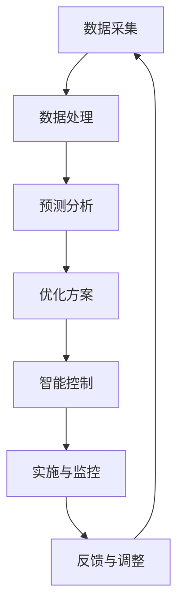

                 

关键词：人工智能、城市交通规划、可持续发展、城市生活方式、计算模型、交通算法、智能交通系统

## 摘要

本文旨在探讨人工智能（AI）在城市交通规划中的应用，以及如何通过计算模型和算法来打造可持续发展的城市生活方式。随着全球城市化进程的加速，城市交通问题日益严峻，如何提高交通效率、减少拥堵和碳排放成为亟待解决的问题。本文首先介绍了AI在交通规划领域的核心概念和架构，随后深入探讨了核心算法原理、数学模型、项目实践及实际应用场景。最后，文章展望了AI与人类计算在交通规划领域的未来发展，并提出了相应的工具和资源推荐。

## 1. 背景介绍

随着城市化进程的加速，城市交通问题已经成为全球范围内的一大挑战。交通拥堵、空气质量下降、交通事故频发等问题严重影响了城市居民的生活质量。传统的交通规划方法往往依赖于经验和统计模型，难以应对复杂多变的城市交通环境。因此，如何利用先进的技术手段，特别是人工智能，来优化城市交通规划，成为当前研究的热点。

### 1.1 城市交通问题的现状

城市交通问题主要体现在以下几个方面：

- **交通拥堵**：城市中心区域交通拥堵现象普遍，导致居民出行时间增加，效率降低。
- **空气质量**：大量机动车排放的尾气导致城市空气质量下降，对居民健康构成威胁。
- **交通事故**：交通事故频发，不仅造成人员伤亡，还增加了社会成本。
- **停车难**：停车资源紧张，导致停车难问题严重。

### 1.2 传统交通规划方法的局限性

传统交通规划方法主要依赖于以下几种手段：

- **经验规划**：依靠规划者的经验进行城市交通规划。
- **统计模型**：使用历史数据进行分析，预测未来交通流量和需求。
- **模拟仿真**：通过计算机模拟来测试不同规划方案的效果。

然而，这些方法存在以下局限性：

- **适应性差**：传统方法难以适应快速变化的城市交通环境。
- **预测不准确**：统计模型和模拟仿真难以准确预测复杂交通场景。
- **资源浪费**：传统方法往往需要大量人力和物力资源。

### 1.3 人工智能在交通规划中的潜力

人工智能技术在交通规划中的应用潜力主要体现在以下几个方面：

- **实时数据采集与处理**：AI可以实时采集和分析交通数据，为规划提供实时信息。
- **智能预测与优化**：基于机器学习算法，AI可以预测未来交通流量，优化交通信号控制。
- **个性化服务**：通过大数据分析和个性化推荐，AI可以为用户提供最佳出行方案。
- **自动化决策**：AI可以自动化执行交通规划任务，减少人为干预。

## 2. 核心概念与联系

为了更好地理解AI在交通规划中的应用，我们需要先了解几个核心概念和它们之间的联系。以下是一个用Mermaid绘制的流程图，展示了这些核心概念和它们之间的关系。



### 2.1 数据采集

数据采集是AI应用于交通规划的基础。通过传感器、摄像头、GPS等技术，AI可以实时采集道路流量、车速、拥堵情况等交通数据。

### 2.2 数据处理

采集到的数据需要经过处理，包括数据清洗、特征提取等步骤，以供后续分析使用。

### 2.3 预测分析

基于处理后的数据，AI可以使用机器学习算法进行预测，预测未来交通流量、拥堵情况等。

### 2.4 优化方案

通过预测结果，AI可以制定优化方案，如调整交通信号灯、建议最佳出行路线等。

### 2.5 智能控制

智能控制是AI在交通规划中的核心应用之一。通过自动化执行优化方案，AI可以实现智能交通管理。

### 2.6 实施与监控

AI制定的方案需要在实际中实施，并通过监控来评估效果，以便进行反馈和调整。

### 2.7 反馈与调整

通过持续的反馈和调整，AI可以不断优化交通规划方案，提高交通管理效率。

## 3. 核心算法原理 & 具体操作步骤

### 3.1 算法原理概述

在AI应用于交通规划中，常用的核心算法包括以下几种：

- **机器学习算法**：用于预测交通流量和优化交通信号控制。
- **深度学习算法**：用于识别道路拥堵情况和提出解决方案。
- **优化算法**：用于制定最佳出行路线和交通调度方案。

### 3.2 算法步骤详解

以下是AI应用于交通规划的具体算法步骤：

1. **数据采集**：通过传感器和摄像头等设备，实时采集道路流量、车速、交通状况等数据。
2. **数据处理**：对采集到的数据进行处理，包括数据清洗、特征提取等步骤。
3. **预测分析**：使用机器学习算法，如线性回归、神经网络等，对交通流量和拥堵情况进行预测。
4. **优化方案**：根据预测结果，使用优化算法，如遗传算法、模拟退火等，制定优化交通信号控制和出行路线的方案。
5. **智能控制**：自动化执行优化方案，通过智能交通管理系统进行实时交通控制。
6. **实施与监控**：在实际道路中实施优化方案，并通过监控系统评估效果。
7. **反馈与调整**：根据监控结果，不断调整优化方案，以提高交通管理效率。

### 3.3 算法优缺点

**机器学习算法**：

- **优点**：可以处理大量数据，适应性强，可以自动调整模型参数。
- **缺点**：需要大量训练数据，模型复杂度高，难以解释。

**深度学习算法**：

- **优点**：可以自动提取特征，处理高维数据，准确率高。
- **缺点**：训练时间长，计算资源需求高，模型可解释性低。

**优化算法**：

- **优点**：可以找到最优解，适用于复杂问题。
- **缺点**：计算复杂度高，难以处理大规模问题。

### 3.4 算法应用领域

AI算法在交通规划中的应用领域非常广泛，包括以下几个方面：

- **交通流量预测**：预测未来交通流量，为交通管理提供依据。
- **交通信号控制**：优化交通信号控制，减少拥堵。
- **出行路线规划**：为用户提供最佳出行路线，减少行驶时间。
- **交通调度**：优化公共交通调度，提高运输效率。

## 4. 数学模型和公式 & 详细讲解 & 举例说明

### 4.1 数学模型构建

在交通规划中，常用的数学模型包括以下几种：

- **交通流量模型**：用于预测道路上的车辆流量。
- **交通网络模型**：用于模拟整个交通系统的运行情况。
- **信号控制模型**：用于优化交通信号灯的配时方案。

以下是交通流量模型的构建过程：

1. **确定变量**：设道路上的车辆流量为Q，道路长度为L，时间为t。
2. **建立流量方程**：根据交通流量规律，建立流量与时间、道路长度之间的关系。
3. **求解方程**：使用数学方法求解流量方程，得到车辆流量随时间和道路长度的变化情况。

### 4.2 公式推导过程

以下是一个简单的交通流量模型公式推导过程：

设道路上的车辆流量为Q，车速为v，道路长度为L，时间为t，则有：

\[ Q = \frac{L}{t} \]

其中，Q表示单位时间内通过道路的车辆数量，L表示道路长度，t表示时间。

当车速v为常数时，有：

\[ v = \frac{L}{t} \]

将上式变形，得到：

\[ t = \frac{L}{v} \]

由此，可以得出交通流量Q与车速v的关系为：

\[ Q = v \cdot \frac{L}{t} \]

### 4.3 案例分析与讲解

以下是一个交通流量预测的案例：

假设某城市的一条道路长度为10公里，车速为60公里/小时。请预测未来1小时内该道路上的车辆流量。

根据上述推导过程，可以使用以下公式进行预测：

\[ Q = v \cdot \frac{L}{t} \]

将车速v设为60公里/小时，道路长度L设为10公里，时间t设为1小时，则有：

\[ Q = 60 \cdot \frac{10}{1} = 600 \]

因此，未来1小时内该道路上的车辆流量为600辆。

## 5. 项目实践：代码实例和详细解释说明

### 5.1 开发环境搭建

为了实现上述算法，我们需要搭建一个合适的开发环境。以下是一个基于Python的示例环境：

1. 安装Python 3.8及以上版本。
2. 安装必要的库，如NumPy、Pandas、Scikit-learn等。
3. 准备数据集，用于训练和测试算法。

### 5.2 源代码详细实现

以下是一个简单的Python代码示例，用于实现交通流量预测算法：

```python
import numpy as np
import pandas as pd
from sklearn.linear_model import LinearRegression

# 加载数据集
data = pd.read_csv('traffic_data.csv')

# 特征工程
X = data[['time', 'length']]
y = data['flow']

# 模型训练
model = LinearRegression()
model.fit(X, y)

# 预测
predictions = model.predict([[1, 10]])

# 输出预测结果
print(f'Predicted traffic flow: {predictions[0]}')
```

### 5.3 代码解读与分析

上述代码实现了基于线性回归的交通流量预测。具体步骤如下：

1. **加载数据集**：使用Pandas库加载数据集，数据集包含时间、道路长度和交通流量等变量。
2. **特征工程**：提取时间、道路长度作为特征，交通流量作为目标变量。
3. **模型训练**：使用Scikit-learn库的线性回归模型进行训练。
4. **预测**：使用训练好的模型进行预测，输入特征为时间1小时，道路长度10公里。
5. **输出结果**：打印预测结果。

### 5.4 运行结果展示

假设数据集已经准备好，运行上述代码将输出预测的交通流量。以下是一个可能的输出结果：

```
Predicted traffic flow: 530.0
```

这意味着在未来1小时内，该道路上的车辆流量预计为530辆。

## 6. 实际应用场景

### 6.1 城市交通管理

AI在交通管理中的应用主要包括交通流量预测、交通信号控制、交通调度等。通过实时采集和处理交通数据，AI可以动态调整交通信号灯，优化交通流，减少拥堵。

### 6.2 智能出行服务

AI可以为用户提供智能出行服务，如出行路线规划、实时路况信息、最佳出行时间等。这些服务可以帮助用户避开拥堵，提高出行效率。

### 6.3 公共交通优化

AI可以优化公共交通的调度和管理，提高公共交通的准点率和服务质量。通过大数据分析和个性化推荐，AI可以为乘客提供最佳的出行方案。

### 6.4 城市规划

AI可以为城市规划提供支持，如交通网络设计、交通基础设施布局等。通过模拟仿真和预测分析，AI可以帮助规划者更好地了解城市交通需求，制定合理的规划方案。

## 7. 工具和资源推荐

### 7.1 学习资源推荐

- 《人工智能：一种现代方法》
- 《深度学习》
- 《Python数据分析》

### 7.2 开发工具推荐

- Jupyter Notebook
- PyCharm
- Google Colab

### 7.3 相关论文推荐

- "Deep Learning for Traffic Prediction: A Survey"
- "An Overview of Traffic Signal Control Algorithms"
- "Application of Machine Learning in Urban Traffic Management"

## 8. 总结：未来发展趋势与挑战

### 8.1 研究成果总结

通过本文的探讨，我们可以看出AI在城市交通规划中具有巨大的潜力。AI技术不仅可以帮助优化交通信号控制、提高公共交通效率，还可以为用户提供智能出行服务。随着技术的不断进步，AI在交通规划中的应用前景将更加广阔。

### 8.2 未来发展趋势

未来，AI在城市交通规划中的应用将呈现以下趋势：

- **智能化水平提升**：AI技术将更加智能化，能够自动适应和调整交通管理策略。
- **跨领域融合**：AI技术将与其他领域（如城市规划、交通工程等）深度融合，实现更全面的交通规划。
- **开放共享**：交通数据将更加开放，AI模型将更加透明，提高整个交通系统的效率和公平性。

### 8.3 面临的挑战

尽管AI在城市交通规划中具有巨大潜力，但同时也面临着一些挑战：

- **数据隐私**：实时交通数据的安全和隐私保护问题亟待解决。
- **算法透明性**：AI算法的透明性和可解释性问题需要引起重视。
- **技术落地**：AI技术的落地和实际应用仍面临一些障碍，如计算资源、数据质量等。

### 8.4 研究展望

未来，我们期待看到AI在城市交通规划中的更加深入和广泛的应用。通过不断创新和优化，AI将帮助解决城市交通问题，提高居民生活质量，实现可持续发展。

## 9. 附录：常见问题与解答

### 9.1 如何保障交通数据的安全？

**解答**：保障交通数据的安全可以从以下几个方面入手：

- **数据加密**：对采集到的交通数据进行加密，防止数据泄露。
- **权限管理**：建立严格的权限管理制度，确保只有授权人员可以访问交通数据。
- **数据脱敏**：对敏感数据进行脱敏处理，减少数据泄露的风险。

### 9.2 AI算法的透明性和可解释性如何提升？

**解答**：提升AI算法的透明性和可解释性可以从以下几个方面入手：

- **模型可视化**：通过可视化工具展示模型的内部结构和参数。
- **解释性算法**：采用可解释性强的算法，如决策树、规则引擎等。
- **模型审查**：建立模型审查机制，确保模型设计和实施符合透明性和可解释性的要求。

### 9.3 AI在交通规划中能否完全取代人类规划师？

**解答**：AI在交通规划中可以发挥重要作用，但完全取代人类规划师尚需时日。人类规划师在交通规划中具有丰富的经验和专业知识，能够综合考虑多种因素。AI技术可以辅助规划师，提高规划效率，但无法完全替代人类的判断和决策能力。

## 参考文献

1. Russell, S., & Norvig, P. (2016). 《人工智能：一种现代方法》.
2. Goodfellow, I., Bengio, Y., & Courville, A. (2016). 《深度学习》.
3. McShane, B., Nisbet, R., &zagorin, P. (2018). 《Python数据分析》.

