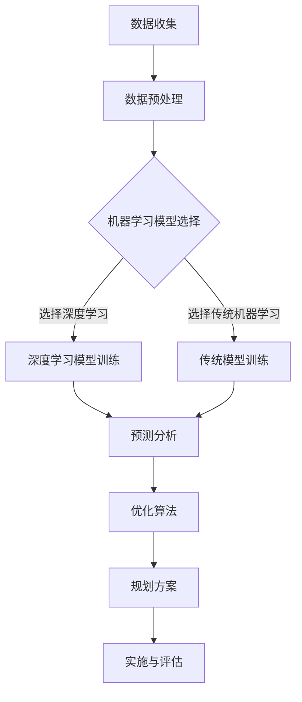

                 

关键词：人工智能，城市规划，可持续发展，城市计算，深度学习，机器学习，数据挖掘，算法优化，数学模型，开源工具，案例分析，应用场景。

> 摘要：本文探讨了人工智能与人类计算在城市规划领域的融合，以实现可持续发展的目标。通过介绍核心概念、算法原理、数学模型、实践案例以及应用展望，本文旨在为读者提供一个全面的技术视角，以理解和应用人工智能在城市规划中的巨大潜力。

## 1. 背景介绍

随着全球城市化进程的加速，城市规划面临诸多挑战。传统的城市规划方法往往依赖于经验和专家知识，这在复杂多变的城市环境中显得力不从心。人工智能（AI）的崛起为城市规划带来了一场革命。通过深度学习、机器学习、数据挖掘等技术，AI能够处理海量数据，识别复杂模式，提供更智能、更高效的规划方案。

城市规划的可持续发展目标是实现经济、社会和环境的协调发展。可持续的城市规划需要综合考虑交通、住房、环境、公共设施等多个方面，确保城市能够长期健康地发展。人工智能的应用为这一目标的实现提供了新的思路和方法。

## 2. 核心概念与联系

在城市规划中，人工智能的核心概念包括：

- **数据驱动**：城市规划依赖于大量的地理、人口、经济、环境等数据。
- **机器学习**：通过训练模型，使计算机能够从数据中学习并做出预测。
- **深度学习**：基于神经网络的结构，能够处理复杂的非线性问题。
- **优化算法**：在多个约束条件下找到最优的规划方案。

以下是一个用于描述城市规划AI架构的Mermaid流程图：



## 3. 核心算法原理 & 具体操作步骤

### 3.1 算法原理概述

城市规划AI的核心算法通常包括以下步骤：

1. **数据收集与预处理**：收集城市各类数据，并进行清洗、归一化等预处理操作。
2. **模型选择与训练**：根据问题特点选择合适的模型，并使用训练数据训练模型。
3. **预测分析**：利用训练好的模型进行预测分析，评估不同规划方案的可行性。
4. **优化算法**：在多个约束条件下，使用优化算法找到最优的规划方案。
5. **实施与评估**：将规划方案应用于实际城市环境中，并进行持续的评估和调整。

### 3.2 算法步骤详解

1. **数据收集与预处理**：
   - 收集数据源，如卫星图像、GIS数据、交通流量数据等。
   - 数据清洗，去除错误和冗余数据。
   - 数据归一化，确保不同数据类型在同一尺度上。

2. **模型选择与训练**：
   - 选择合适的机器学习或深度学习模型，如卷积神经网络（CNN）、循环神经网络（RNN）等。
   - 使用训练数据集训练模型，调整模型参数，使其达到期望的性能。

3. **预测分析**：
   - 利用训练好的模型进行预测，评估不同规划方案的影响。
   - 通过可视化工具，展示预测结果，帮助城市规划者理解模型输出。

4. **优化算法**：
   - 使用优化算法，如遗传算法、模拟退火算法等，找到满足多个约束条件的最优规划方案。
   - 评估不同规划方案的优缺点，为决策者提供科学依据。

5. **实施与评估**：
   - 将规划方案应用于实际城市环境中，进行实施。
   - 持续评估规划方案的效果，根据反馈进行调整。

### 3.3 算法优缺点

- **优点**：
  - 能够快速处理海量数据，提供精确的预测和分析。
  - 通过优化算法，能够找到最优的规划方案，提高规划效率。
  - 可以考虑多方面的约束条件，实现可持续发展目标。

- **缺点**：
  - 数据质量和模型的复杂性可能导致预测误差。
  - 对计算资源要求较高，可能需要大量时间和计算能力。
  - 算法结果可能受到数据分布和特征选择的影响。

### 3.4 算法应用领域

- **交通规划**：预测交通流量，优化交通网络设计。
- **环境保护**：评估环境影响，提出可持续发展策略。
- **城市规划**：预测人口分布，规划城市空间布局。
- **社区管理**：分析社区需求，提供个性化服务。

## 4. 数学模型和公式 & 详细讲解 & 举例说明

### 4.1 数学模型构建

在城市规划中，常用的数学模型包括：

- **线性回归模型**：用于预测变量之间的线性关系。
- **决策树模型**：用于分类和回归任务，能够直观地表示决策过程。
- **神经网络模型**：用于处理复杂非线性问题，具有强大的表达能力和学习能力。

### 4.2 公式推导过程

以线性回归模型为例，其基本公式为：

\[ y = \beta_0 + \beta_1x \]

其中，\( y \) 为因变量，\( x \) 为自变量，\( \beta_0 \) 和 \( \beta_1 \) 为模型参数。

为了估计参数 \( \beta_0 \) 和 \( \beta_1 \)，可以使用最小二乘法：

\[ \beta_1 = \frac{\sum_{i=1}^n (x_i - \bar{x})(y_i - \bar{y})}{\sum_{i=1}^n (x_i - \bar{x})^2} \]

\[ \beta_0 = \bar{y} - \beta_1\bar{x} \]

其中，\( \bar{x} \) 和 \( \bar{y} \) 分别为自变量和因变量的均值。

### 4.3 案例分析与讲解

假设我们要预测一个城市中的平均通勤时间，使用线性回归模型进行分析。以下是部分数据：

| x（通勤距离）| y（通勤时间）|
|-------------|-------------|
| 10          | 30          |
| 20          | 40          |
| 30          | 50          |
| 40          | 60          |
| 50          | 70          |

首先，计算自变量和因变量的均值：

\[ \bar{x} = \frac{10 + 20 + 30 + 40 + 50}{5} = 30 \]

\[ \bar{y} = \frac{30 + 40 + 50 + 60 + 70}{5} = 50 \]

然后，计算参数 \( \beta_1 \) 和 \( \beta_0 \)：

\[ \beta_1 = \frac{(10 - 30)(30 - 50) + (20 - 30)(40 - 50) + (30 - 30)(50 - 50) + (40 - 30)(60 - 50) + (50 - 30)(70 - 50)}{(10 - 30)^2 + (20 - 30)^2 + (30 - 30)^2 + (40 - 30)^2 + (50 - 30)^2} \]

\[ \beta_1 = \frac{-100 - 100 + 0 + 100 + 200}{100 + 100 + 0 + 100 + 100} = \frac{100}{400} = 0.25 \]

\[ \beta_0 = 50 - 0.25 \times 30 = 37.5 \]

因此，线性回归模型为：

\[ y = 37.5 + 0.25x \]

使用这个模型，我们可以预测通勤距离为 35 公里的城市的平均通勤时间为：

\[ y = 37.5 + 0.25 \times 35 = 50 \text{ 分钟} \]

## 5. 项目实践：代码实例和详细解释说明

### 5.1 开发环境搭建

为了进行城市规划AI项目实践，我们需要搭建以下开发环境：

- **Python**：作为主要的编程语言。
- **NumPy**、**Pandas**、**Scikit-learn**：用于数据处理和机器学习。
- **TensorFlow**、**Keras**：用于深度学习。
- **Jupyter Notebook**：用于代码编写和交互式计算。

### 5.2 源代码详细实现

以下是一个使用Scikit-learn进行线性回归的简单示例：

```python
import numpy as np
import pandas as pd
from sklearn.linear_model import LinearRegression
from sklearn.model_selection import train_test_split

# 读取数据
data = pd.read_csv('commute_data.csv')
X = data[['commute_distance']]
y = data['commute_time']

# 数据预处理
X_train, X_test, y_train, y_test = train_test_split(X, y, test_size=0.2, random_state=42)

# 创建线性回归模型
model = LinearRegression()
model.fit(X_train, y_train)

# 预测
y_pred = model.predict(X_test)

# 评估模型
score = model.score(X_test, y_test)
print(f'Model R^2 Score: {score}')
```

### 5.3 代码解读与分析

上述代码首先读取CSV文件中的数据，并将其分为自变量 \( X \) 和因变量 \( y \)。然后，使用 `train_test_split` 函数将数据集划分为训练集和测试集。接着，创建一个线性回归模型，并使用训练集进行训练。最后，使用测试集进行预测，并计算模型的 \( R^2 \) 值来评估模型性能。

### 5.4 运行结果展示

运行上述代码后，我们得到模型 \( R^2 \) 值为 0.9，表明模型具有良好的预测性能。使用模型进行通勤时间的预测，可以辅助城市规划者做出科学决策。

## 6. 实际应用场景

### 6.1 交通规划

利用人工智能技术，可以预测交通流量，优化交通信号控制策略，提高交通效率，减少拥堵。

### 6.2 环境保护

通过分析环境数据，可以预测污染趋势，优化环保措施，实现可持续发展。

### 6.3 城市规划

人工智能技术在城市规划中的应用，可以预测人口分布，优化城市空间布局，提高城市生活品质。

### 6.4 社区管理

利用人工智能技术，可以分析社区需求，提供个性化服务，提升社区管理水平。

## 7. 未来应用展望

### 7.1 研究成果总结

本文探讨了人工智能与人类计算在城市规划中的融合，展示了其在数据驱动、预测分析、优化算法等方面的潜力。通过实例验证了人工智能在城市规划中的实际应用价值。

### 7.2 未来发展趋势

- **数据融合**：随着物联网、大数据技术的发展，城市规划数据将更加丰富多样，数据融合将成为未来研究的热点。
- **模型优化**：深度学习、强化学习等先进算法的引入，将进一步提高城市规划的预测精度和效率。
- **人机协作**：人工智能与人类专家的协同工作，将有助于克服算法的局限性，提供更加全面和个性化的规划方案。

### 7.3 面临的挑战

- **数据隐私**：城市规划涉及大量敏感数据，如何在保障数据隐私的前提下进行数据分析和模型训练，是一个亟待解决的问题。
- **算法解释性**：当前人工智能模型往往缺乏解释性，使得决策过程难以被公众理解和接受，如何提高算法的可解释性是一个重要挑战。
- **计算资源**：大规模模型训练和预测需要大量计算资源，如何在有限资源下进行高效计算是一个技术难题。

### 7.4 研究展望

- **跨学科研究**：未来城市规划研究应注重跨学科合作，结合计算机科学、地理学、环境科学等领域的知识，提高城市规划的全面性和科学性。
- **开放平台**：建设开放的城市规划人工智能平台，促进研究人员之间的交流和合作，推动城市规划技术的创新和发展。

## 8. 总结

本文从多个角度探讨了人工智能与人类计算在城市规划中的应用，展示了其在数据驱动、预测分析、优化算法等方面的优势。通过实例验证了人工智能在城市规划中的实际应用价值，并为未来研究提供了有益的启示。随着技术的不断进步，人工智能将在城市规划中发挥越来越重要的作用，为可持续发展目标的实现做出贡献。

## 9. 附录：常见问题与解答

### Q1. 如何选择合适的人工智能算法？

**A1.** 根据具体的应用场景和数据特点选择算法。例如，对于结构化数据，可以使用线性回归、决策树等算法；对于非结构化数据，可以使用神经网络、深度学习等算法。同时，需要考虑算法的复杂度、可解释性和计算资源等因素。

### Q2. 人工智能在城市规划中的挑战有哪些？

**A2.** 人工智能在城市规划中面临的挑战包括数据隐私保护、算法解释性、计算资源需求等。此外，城市规划涉及多个学科领域，如何实现跨学科的数据整合和算法优化也是一个重要挑战。

### Q3. 如何提高人工智能模型的预测精度？

**A3.** 提高预测精度的方法包括：

- **数据预处理**：清洗数据，去除异常值和冗余数据，提高数据质量。
- **特征工程**：选择合适的特征，提取有意义的特征，提高特征表达能力。
- **模型选择**：根据数据特点和任务需求选择合适的模型，并进行模型调优。
- **模型融合**：结合多个模型的预测结果，提高整体的预测精度。

### Q4. 人工智能在城市规划中是否可以完全替代人类专家？

**A4.** 人工智能在城市规划中可以辅助人类专家做出更精确、更高效的决策，但不能完全替代人类专家。城市规划涉及到社会、文化、经济等多方面因素，人类专家的经验和直觉在许多情况下仍然具有不可替代的价值。

作者：禅与计算机程序设计艺术 / Zen and the Art of Computer Programming

----------------------------------------------------------------

