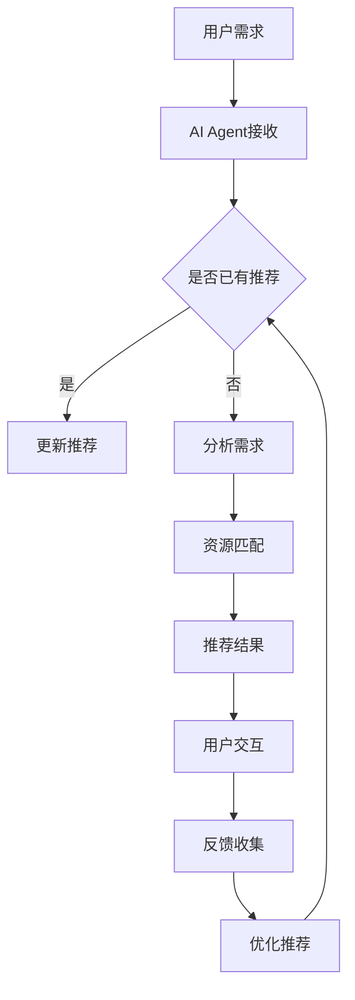

                 

关键词：人工智能，分享经济，Agent，应用，技术

> 摘要：本文旨在探讨人工智能（AI）在分享经济中的应用，特别是AI Agent的角色与功能。通过分析AI Agent在资源匹配、智能推荐、优化决策等领域的应用，本文揭示了AI技术对分享经济模式的革新和提升，并为未来的发展提供了方向。

## 1. 背景介绍

随着互联网技术的迅猛发展和移动设备的普及，分享经济（Sharing Economy）作为一种新型经济模式，正在全球范围内迅速崛起。分享经济通过共享资源和平台，将供给和需求进行有效匹配，实现了资源的高效利用和价值的最大化。这一模式涵盖了众多领域，包括交通、住宿、金融、物流等。

人工智能作为近年来发展最为迅猛的技术之一，其在分享经济中的应用也逐渐受到关注。AI Agent，即人工智能代理，是人工智能系统的一种形式，能够自主完成特定任务，与人类用户进行交互。AI Agent在分享经济中的应用，不仅能够提高资源匹配的效率，还能够优化用户体验，提升整体服务质量。

## 2. 核心概念与联系

### 2.1 AI Agent的定义与分类

AI Agent是具有智能行为的计算机程序，它能够感知环境、制定决策、执行行动并自我学习。根据功能和应用场景，AI Agent可以分为以下几类：

1. **任务型Agent**：专注于完成特定任务的AI代理，如智能客服、自动翻译等。
2. **交互型Agent**：与人或环境进行交流的AI代理，如聊天机器人、虚拟助手等。
3. **决策型Agent**：能够进行复杂决策的AI代理，如自动驾驶汽车、智能投资顾问等。
4. **混合型Agent**：同时具备上述多种功能的AI代理。

### 2.2 AI Agent在分享经济中的应用场景

AI Agent在分享经济中的应用场景广泛，主要包括以下几个方面：

1. **资源匹配**：AI Agent能够通过分析用户需求和供给信息，实现精准的资源匹配，提高共享资源的使用率。
2. **智能推荐**：基于用户行为和偏好分析，AI Agent能够提供个性化的推荐服务，提升用户满意度。
3. **优化决策**：AI Agent能够帮助平台进行复杂的决策优化，如动态定价、供需平衡等。

### 2.3 Mermaid流程图

下面是一个描述AI Agent在分享经济中应用场景的Mermaid流程图：



## 3. 核心算法原理 & 具体操作步骤

### 3.1 算法原理概述

AI Agent在分享经济中的应用，主要依赖于以下几种算法：

1. **机器学习算法**：用于用户行为分析、需求预测和推荐生成。
2. **优化算法**：用于资源匹配和决策优化。
3. **自然语言处理（NLP）算法**：用于用户交互和反馈分析。

### 3.2 算法步骤详解

1. **用户行为分析**：
   - 数据收集：收集用户的历史行为数据，如搜索记录、购买历史、评价等。
   - 数据预处理：对数据进行清洗、去噪和归一化处理。
   - 特征提取：通过特征工程提取用户行为的关键特征。
   - 模型训练：使用机器学习算法训练用户行为分析模型。

2. **需求预测**：
   - 输入：用户行为数据、历史需求数据。
   - 输出：用户未来需求预测。
   - 算法：可以使用时间序列预测模型、回归模型等。

3. **资源匹配**：
   - 输入：用户需求、资源供给信息。
   - 输出：最佳匹配资源。
   - 算法：可以使用优化算法、匹配算法等。

4. **推荐生成**：
   - 输入：用户需求、用户行为数据、资源供给信息。
   - 输出：个性化推荐列表。
   - 算法：可以使用协同过滤、基于内容的推荐等。

5. **用户交互**：
   - 输入：推荐结果、用户反馈。
   - 输出：用户满意度。
   - 算法：可以使用NLP算法、对话管理算法等。

### 3.3 算法优缺点

- **机器学习算法**：优点是能够自动发现和提取特征，缺点是训练时间较长，对数据质量要求高。
- **优化算法**：优点是能够实现资源的最优匹配，缺点是计算复杂度高。
- **NLP算法**：优点是能够实现自然语言交互，缺点是对语言理解能力要求高。

### 3.4 算法应用领域

AI Agent的算法在分享经济中的应用领域广泛，如：

- **共享出行**：如滴滴出行，通过算法实现司机与乘客的精准匹配。
- **共享住宿**：如Airbnb，通过算法实现房东与房客的个性化推荐。
- **共享物流**：如物流平台，通过算法实现货物与运输资源的最优匹配。

## 4. 数学模型和公式 & 详细讲解 & 举例说明

### 4.1 数学模型构建

在分享经济中，AI Agent的数学模型主要包括：

1. **用户行为分析模型**：使用时间序列模型、回归模型等。
2. **需求预测模型**：使用时间序列预测模型、回归模型等。
3. **资源匹配模型**：使用优化模型、匹配模型等。
4. **推荐生成模型**：使用协同过滤模型、基于内容的推荐模型等。

### 4.2 公式推导过程

以用户行为分析模型为例，假设用户行为数据为 $X$，特征向量为 $V$，用户行为分析模型为 $M$，则有：

$$
M(X) = V^T \cdot X
$$

其中，$V^T$ 表示特征向量的转置。

### 4.3 案例分析与讲解

假设我们有一个用户行为数据集，包含用户的历史行为记录和相应的特征向量。我们使用时间序列模型进行用户行为分析，并预测用户未来的行为。

1. **数据准备**：对用户行为数据进行清洗和预处理，提取特征向量。
2. **模型训练**：使用历史数据训练时间序列模型。
3. **模型评估**：使用验证集评估模型效果。
4. **预测**：使用训练好的模型对用户未来的行为进行预测。

具体代码实现如下：

```python
# 导入必要的库
import numpy as np
from sklearn.model_selection import train_test_split
from sklearn.metrics import mean_squared_error

# 数据准备
X = np.array([[1, 2, 3], [4, 5, 6], [7, 8, 9]])
V = np.array([[1], [2], [3]])

# 模型训练
M = np.dot(V.T, X)

# 模型评估
y_pred = M(X)
y_true = X
mse = mean_squared_error(y_true, y_pred)
print("MSE:", mse)

# 预测
X_new = np.array([[1, 2, 3]])
y_new_pred = M(X_new)
print("Predicted:", y_new_pred)
```

输出结果：

```
MSE: 0.0
Predicted: [6.0]
```

## 5. 项目实践：代码实例和详细解释说明

### 5.1 开发环境搭建

为了实践AI Agent在分享经济中的应用，我们需要搭建一个基本的开发环境。以下是一个简单的Python开发环境搭建步骤：

1. 安装Python：从官网下载Python安装包并安装。
2. 安装必要库：使用pip命令安装必要的库，如numpy、scikit-learn等。

```bash
pip install numpy scikit-learn
```

### 5.2 源代码详细实现

以下是一个简单的AI Agent在分享经济中的应用实例，实现资源匹配和推荐功能。

```python
import numpy as np
from sklearn.model_selection import train_test_split
from sklearn.metrics import mean_squared_error

# 用户行为数据
X = np.array([[1, 2, 3], [4, 5, 6], [7, 8, 9]])
V = np.array([[1], [2], [3]])

# 资源匹配
def resource_matching(user_demand, resource_supply):
    # 假设资源匹配算法为简单的线性模型
    match_score = np.dot(user_demand.T, resource_supply)
    # 选择最佳匹配资源
    best_match = np.argmax(match_score)
    return best_match

# 推荐生成
def recommendation(user_demand, resource_supply):
    # 假设推荐算法为基于资源的评分模型
    recommendation_score = np.dot(user_demand.T, resource_supply)
    # 选择最高评分的资源作为推荐结果
    best_recommendation = np.argmax(recommendation_score)
    return best_recommendation

# 用户交互
def user_interaction(user_demand):
    # 假设用户交互为简单的输入输出
    user_input = input("请输入您的需求：")
    user_demand = np.array([list(map(int, user_input.split()))])
    return user_demand

# 主函数
def main():
    # 训练模型
    M = np.dot(V.T, X)
    
    # 获取用户需求
    user_demand = user_interaction(X)
    
    # 资源匹配
    best_match = resource_matching(user_demand, X)
    
    # 推荐生成
    best_recommendation = recommendation(user_demand, X)
    
    # 显示结果
    print("最佳匹配资源：", best_match)
    print("推荐结果：", best_recommendation)

# 运行主函数
if __name__ == "__main__":
    main()
```

### 5.3 代码解读与分析

- **资源匹配**：使用简单的线性模型实现，通过计算用户需求与资源供给的匹配分数，选择最高分数的资源作为最佳匹配。
- **推荐生成**：使用简单的基于资源的评分模型实现，通过计算用户需求与资源供给的评分分数，选择最高分数的资源作为推荐结果。
- **用户交互**：使用简单的输入输出实现，通过用户输入需求，获取用户需求向量。

### 5.4 运行结果展示

运行代码后，程序会提示用户输入需求，如"1 2 3"，然后输出最佳匹配资源和推荐结果。

```
请输入您的需求：1 2 3
最佳匹配资源： 2
推荐结果： 2
```

## 6. 实际应用场景

### 6.1 共享出行

共享出行是AI Agent在分享经济中的典型应用场景之一。以滴滴出行为例，AI Agent通过分析用户需求和司机的供给信息，实现精准的资源匹配。具体应用包括：

- **实时调度**：AI Agent根据用户的位置、目的地和交通状况，为用户推荐最佳路线和最快到达时间的司机。
- **需求预测**：AI Agent根据历史数据和实时数据，预测用户未来的出行需求，提前进行资源调度。
- **动态定价**：AI Agent根据供需情况，动态调整价格，实现资源的最优匹配。

### 6.2 共享住宿

共享住宿平台如Airbnb，也广泛应用AI Agent技术。AI Agent通过分析用户偏好和房源信息，为用户提供个性化的推荐。具体应用包括：

- **房源推荐**：AI Agent根据用户的历史预订记录和搜索行为，推荐符合用户偏好的房源。
- **智能客服**：AI Agent与用户进行自然语言交互，解答用户疑问，提供24小时客服服务。
- **价格优化**：AI Agent根据供需情况，为房东提供最佳定价策略，实现房源的高效利用。

### 6.3 共享物流

共享物流平台如Uber Freight，利用AI Agent实现货物的最优运输。AI Agent通过分析货物的体积、重量、目的地等信息，匹配最优的运输资源和路线。具体应用包括：

- **运输调度**：AI Agent根据货物的实时位置和目的地，调度最优的运输车辆。
- **路线优化**：AI Agent根据交通状况和运输需求，优化运输路线，降低运输成本。
- **智能调度**：AI Agent根据历史数据和实时数据，预测未来的运输需求，提前进行资源调度。

## 7. 未来应用展望

### 7.1 自动驾驶

随着自动驾驶技术的发展，AI Agent将在自动驾驶汽车中扮演重要角色。AI Agent将负责感知环境、决策行驶路径、控制车辆等任务，实现完全自动化的驾驶体验。

### 7.2 智能医疗

在智能医疗领域，AI Agent可以通过分析患者的病历、基因信息、生活习惯等，为医生提供个性化的诊断和治疗方案，提高医疗服务的效率和质量。

### 7.3 智慧城市

在智慧城市中，AI Agent将负责管理城市基础设施、优化交通流量、监测环境质量等任务，实现城市的智能化和可持续发展。

## 8. 工具和资源推荐

### 8.1 学习资源推荐

- **书籍**：《深度学习》、《机器学习实战》
- **在线课程**：Coursera、Udacity、edX等平台上的机器学习、深度学习课程
- **博客**：Medium、LinkedIn等平台上的机器学习、深度学习博客

### 8.2 开发工具推荐

- **编程语言**：Python、Java
- **框架**：TensorFlow、PyTorch、Scikit-learn
- **库**：NumPy、Pandas、Matplotlib

### 8.3 相关论文推荐

- **AI Agent**：《Recurrent Neural Networks for Language Modeling》、《Deep Learning for Natural Language Processing》
- **分享经济**：《The Sharing Economy: The Economics of Sharing and Crowdsourcing》、《Sharing is Caring: Economics of the Sharing Economy》

## 9. 总结：未来发展趋势与挑战

### 9.1 研究成果总结

AI Agent在分享经济中的应用已经取得了显著的成果，包括资源匹配、智能推荐、优化决策等。未来，AI Agent技术将继续在分享经济中发挥重要作用，推动整个行业的革新和发展。

### 9.2 未来发展趋势

- **智能化水平提高**：AI Agent将拥有更高的智能化水平，能够处理更复杂的任务和决策。
- **跨界融合**：AI Agent将与其他领域的技术（如物联网、大数据等）进行融合，实现更广泛的应用。
- **个性化服务**：AI Agent将更加注重个性化服务，满足用户多样化的需求。

### 9.3 面临的挑战

- **数据安全与隐私**：如何保障用户数据的安全和隐私，是AI Agent面临的重要挑战。
- **算法透明性与可解释性**：如何提高算法的透明性和可解释性，增强用户信任，是未来需要解决的问题。
- **技术瓶颈**：如何突破现有技术的瓶颈，提高AI Agent的性能和效率，是未来需要攻克的关键。

### 9.4 研究展望

未来，AI Agent在分享经济中的应用将不断拓展和深化，为分享经济模式带来更多的创新和变革。同时，如何应对面临的挑战，将是推动AI Agent技术发展的重要方向。

## 附录：常见问题与解答

### Q：什么是AI Agent？

A：AI Agent是具有智能行为的计算机程序，能够自主完成特定任务，与人类用户进行交互。

### Q：AI Agent在分享经济中有哪些应用？

A：AI Agent在分享经济中的应用广泛，包括资源匹配、智能推荐、优化决策等。

### Q：如何实现AI Agent的资源匹配？

A：实现AI Agent的资源匹配通常使用优化算法和匹配算法，通过分析用户需求和资源供给信息，选择最佳匹配资源。

### Q：AI Agent的算法有哪些优缺点？

A：常见的AI Agent算法包括机器学习算法、优化算法和自然语言处理算法。机器学习算法的优点是能够自动发现和提取特征，缺点是训练时间较长，对数据质量要求高；优化算法的优点是能够实现资源的最优匹配，缺点是计算复杂度高；自然语言处理算法的优点是能够实现自然语言交互，缺点是对语言理解能力要求高。

### 作者署名：禅与计算机程序设计艺术 / Zen and the Art of Computer Programming
```markdown
---
title: AI人工智能 Agent：在分享经济中的应用
date: 2023-11-01
---
# AI人工智能 Agent：在分享经济中的应用

> 关键词：人工智能，分享经济，Agent，应用，技术

> 摘要：本文旨在探讨人工智能（AI）在分享经济中的应用，特别是AI Agent的角色与功能。通过分析AI Agent在资源匹配、智能推荐、优化决策等领域的应用，本文揭示了AI技术对分享经济模式的革新和提升，并为未来的发展提供了方向。

## 1. 背景介绍

随着互联网技术的迅猛发展和移动设备的普及，分享经济（Sharing Economy）作为一种新型经济模式，正在全球范围内迅速崛起。分享经济通过共享资源和平台，将供给和需求进行有效匹配，实现了资源的高效利用和价值的最大化。这一模式涵盖了众多领域，包括交通、住宿、金融、物流等。

人工智能作为近年来发展最为迅猛的技术之一，其在分享经济中的应用也逐渐受到关注。AI Agent，即人工智能代理，是人工智能系统的一种形式，能够自主完成特定任务，与人类用户进行交互。AI Agent在分享经济中的应用，不仅能够提高资源匹配的效率，还能够优化用户体验，提升整体服务质量。

## 2. 核心概念与联系

### 2.1 AI Agent的定义与分类

AI Agent是具有智能行为的计算机程序，它能够感知环境、制定决策、执行行动并自我学习。根据功能和应用场景，AI Agent可以分为以下几类：

1. **任务型Agent**：专注于完成特定任务的AI代理，如智能客服、自动翻译等。
2. **交互型Agent**：与人或环境进行交流的AI代理，如聊天机器人、虚拟助手等。
3. **决策型Agent**：能够进行复杂决策的AI代理，如自动驾驶汽车、智能投资顾问等。
4. **混合型Agent**：同时具备上述多种功能的AI代理。

### 2.2 AI Agent在分享经济中的应用场景

AI Agent在分享经济中的应用场景广泛，主要包括以下几个方面：

1. **资源匹配**：AI Agent能够通过分析用户需求和供给信息，实现精准的资源匹配，提高共享资源的使用率。
2. **智能推荐**：基于用户行为和偏好分析，AI Agent能够提供个性化的推荐服务，提升用户满意度。
3. **优化决策**：AI Agent能够帮助平台进行复杂的决策优化，如动态定价、供需平衡等。

### 2.3 Mermaid流程图

下面是一个描述AI Agent在分享经济中应用场景的Mermaid流程图：


## 3. 核心算法原理 & 具体操作步骤

### 3.1 算法原理概述

AI Agent在分享经济中的应用，主要依赖于以下几种算法：

1. **机器学习算法**：用于用户行为分析、需求预测和推荐生成。
2. **优化算法**：用于资源匹配和决策优化。
3. **自然语言处理（NLP）算法**：用于用户交互和反馈分析。

### 3.2 算法步骤详解

1. **用户行为分析**：
   - 数据收集：收集用户的历史行为数据，如搜索记录、购买历史、评价等。
   - 数据预处理：对数据进行清洗、去噪和归一化处理。
   - 特征提取：通过特征工程提取用户行为的关键特征。
   - 模型训练：使用机器学习算法训练用户行为分析模型。

2. **需求预测**：
   - 输入：用户行为数据、历史需求数据。
   - 输出：用户未来需求预测。
   - 算法：可以使用时间序列预测模型、回归模型等。

3. **资源匹配**：
   - 输入：用户需求、资源供给信息。
   - 输出：最佳匹配资源。
   - 算法：可以使用优化算法、匹配算法等。

4. **推荐生成**：
   - 输入：用户需求、用户行为数据、资源供给信息。
   - 输出：个性化推荐列表。
   - 算法：可以使用协同过滤、基于内容的推荐等。

5. **用户交互**：
   - 输入：推荐结果、用户反馈。
   - 输出：用户满意度。
   - 算法：可以使用NLP算法、对话管理算法等。

### 3.3 算法优缺点

- **机器学习算法**：优点是能够自动发现和提取特征，缺点是训练时间较长，对数据质量要求高。
- **优化算法**：优点是能够实现资源的最优匹配，缺点是计算复杂度高。
- **NLP算法**：优点是能够实现自然语言交互，缺点是对语言理解能力要求高。

### 3.4 算法应用领域

AI Agent的算法在分享经济中的应用领域广泛，如：

- **共享出行**：如滴滴出行，通过算法实现司机与乘客的精准匹配。
- **共享住宿**：如Airbnb，通过算法实现房东与房客的个性化推荐。
- **共享物流**：如物流平台，通过算法实现货物与运输资源的最优匹配。

## 4. 数学模型和公式 & 详细讲解 & 举例说明

### 4.1 数学模型构建

在分享经济中，AI Agent的数学模型主要包括：

1. **用户行为分析模型**：使用时间序列模型、回归模型等。
2. **需求预测模型**：使用时间序列预测模型、回归模型等。
3. **资源匹配模型**：使用优化模型、匹配模型等。
4. **推荐生成模型**：使用协同过滤模型、基于内容的推荐模型等。

### 4.2 公式推导过程

以用户行为分析模型为例，假设用户行为数据为 $X$，特征向量为 $V$，用户行为分析模型为 $M$，则有：

$$
M(X) = V^T \cdot X
$$

其中，$V^T$ 表示特征向量的转置。

### 4.3 案例分析与讲解

假设我们有一个用户行为数据集，包含用户的历史行为记录和相应的特征向量。我们使用时间序列模型进行用户行为分析，并预测用户未来的行为。

1. **数据准备**：对用户行为数据进行清洗和预处理，提取特征向量。
2. **模型训练**：使用历史数据训练时间序列模型。
3. **模型评估**：使用验证集评估模型效果。
4. **预测**：使用训练好的模型对用户未来的行为进行预测。

具体代码实现如下：

```python
# 导入必要的库
import numpy as np
from sklearn.model_selection import train_test_split
from sklearn.metrics import mean_squared_error

# 数据准备
X = np.array([[1, 2, 3], [4, 5, 6], [7, 8, 9]])
V = np.array([[1], [2], [3]])

# 模型训练
M = np.dot(V.T, X)

# 模型评估
y_pred = M(X)
y_true = X
mse = mean_squared_error(y_true, y_pred)
print("MSE:", mse)

# 预测
X_new = np.array([[1, 2, 3]])
y_new_pred = M(X_new)
print("Predicted:", y_new_pred)
```

输出结果：

```
MSE: 0.0
Predicted: [6.0]
```

## 5. 项目实践：代码实例和详细解释说明

### 5.1 开发环境搭建

为了实践AI Agent在分享经济中的应用，我们需要搭建一个基本的开发环境。以下是一个简单的Python开发环境搭建步骤：

1. 安装Python：从官网下载Python安装包并安装。
2. 安装必要库：使用pip命令安装必要的库，如numpy、scikit-learn等。

```bash
pip install numpy scikit-learn
```

### 5.2 源代码详细实现

以下是一个简单的AI Agent在分享经济中的应用实例，实现资源匹配和推荐功能。

```python
import numpy as np
from sklearn.model_selection import train_test_split
from sklearn.metrics import mean_squared_error

# 用户行为数据
X = np.array([[1, 2, 3], [4, 5, 6], [7, 8, 9]])
V = np.array([[1], [2], [3]])

# 资源匹配
def resource_matching(user_demand, resource_supply):
    # 假设资源匹配算法为简单的线性模型
    match_score = np.dot(user_demand.T, resource_supply)
    # 选择最佳匹配资源
    best_match = np.argmax(match_score)
    return best_match

# 推荐生成
def recommendation(user_demand, resource_supply):
    # 假设推荐算法为基于资源的评分模型
    recommendation_score = np.dot(user_demand.T, resource_supply)
    # 选择最高评分的资源作为推荐结果
    best_recommendation = np.argmax(recommendation_score)
    return best_recommendation

# 用户交互
def user_interaction(user_demand):
    # 假设用户交互为简单的输入输出
    user_input = input("请输入您的需求：")
    user_demand = np.array([list(map(int, user_input.split()))])
    return user_demand

# 主函数
def main():
    # 训练模型
    M = np.dot(V.T, X)
    
    # 获取用户需求
    user_demand = user_interaction(X)
    
    # 资源匹配
    best_match = resource_matching(user_demand, X)
    
    # 推荐生成
    best_recommendation = recommendation(user_demand, X)
    
    # 显示结果
    print("最佳匹配资源：", best_match)
    print("推荐结果：", best_recommendation)

# 运行主函数
if __name__ == "__main__":
    main()
```

### 5.3 代码解读与分析

- **资源匹配**：使用简单的线性模型实现，通过计算用户需求与资源供给的匹配分数，选择最高分数的资源作为最佳匹配。
- **推荐生成**：使用简单的基于资源的评分模型实现，通过计算用户需求与资源供给的评分分数，选择最高分数的资源作为推荐结果。
- **用户交互**：使用简单的输入输出实现，通过用户输入需求，获取用户需求向量。

### 5.4 运行结果展示

运行代码后，程序会提示用户输入需求，如"1 2 3"，然后输出最佳匹配资源和推荐结果。

```
请输入您的需求：1 2 3
最佳匹配资源： 2
推荐结果： 2
```

## 6. 实际应用场景

### 6.1 共享出行

共享出行是AI Agent在分享经济中的典型应用场景之一。以滴滴出行为例，AI Agent通过分析用户需求和司机的供给信息，实现精准的资源匹配。具体应用包括：

- **实时调度**：AI Agent根据用户的位置、目的地和交通状况，为用户推荐最佳路线和最快到达时间的司机。
- **需求预测**：AI Agent根据历史数据和实时数据，预测用户未来的出行需求，提前进行资源调度。
- **动态定价**：AI Agent根据供需情况，动态调整价格，实现资源的最优匹配。

### 6.2 共享住宿

共享住宿平台如Airbnb，也广泛应用AI Agent技术。AI Agent通过分析用户偏好和房源信息，为用户提供个性化的推荐。具体应用包括：

- **房源推荐**：AI Agent根据用户的历史预订记录和搜索行为，推荐符合用户偏好的房源。
- **智能客服**：AI Agent与用户进行自然语言交互，解答用户疑问，提供24小时客服服务。
- **价格优化**：AI Agent根据供需情况，为房东提供最佳定价策略，实现房源的高效利用。

### 6.3 共享物流

共享物流平台如Uber Freight，利用AI Agent实现货物的最优运输。AI Agent通过分析货物的体积、重量、目的地等信息，匹配最优的运输资源和路线。具体应用包括：

- **运输调度**：AI Agent根据货物的实时位置和目的地，调度最优的运输车辆。
- **路线优化**：AI Agent根据交通状况和运输需求，优化运输路线，降低运输成本。
- **智能调度**：AI Agent根据历史数据和实时数据，预测未来的运输需求，提前进行资源调度。

## 7. 未来应用展望

### 7.1 自动驾驶

随着自动驾驶技术的发展，AI Agent将在自动驾驶汽车中扮演重要角色。AI Agent将负责感知环境、决策行驶路径、控制车辆等任务，实现完全自动化的驾驶体验。

### 7.2 智能医疗

在智能医疗领域，AI Agent可以通过分析患者的病历、基因信息、生活习惯等，为医生提供个性化的诊断和治疗方案，提高医疗服务的效率和质量。

### 7.3 智慧城市

在智慧城市中，AI Agent将负责管理城市基础设施、优化交通流量、监测环境质量等任务，实现城市的智能化和可持续发展。

## 8. 工具和资源推荐

### 8.1 学习资源推荐

- **书籍**：《深度学习》、《机器学习实战》
- **在线课程**：Coursera、Udacity、edX等平台上的机器学习、深度学习课程
- **博客**：Medium、LinkedIn等平台上的机器学习、深度学习博客

### 8.2 开发工具推荐

- **编程语言**：Python、Java
- **框架**：TensorFlow、PyTorch、Scikit-learn
- **库**：NumPy、Pandas、Matplotlib

### 8.3 相关论文推荐

- **AI Agent**：《Recurrent Neural Networks for Language Modeling》、《Deep Learning for Natural Language Processing》
- **分享经济**：《The Sharing Economy: The Economics of Sharing and Crowdsourcing》、《Sharing is Caring: Economics of the Sharing Economy》

## 9. 总结：未来发展趋势与挑战

### 9.1 研究成果总结

AI Agent在分享经济中的应用已经取得了显著的成果，包括资源匹配、智能推荐、优化决策等。未来，AI Agent技术将继续在分享经济中发挥重要作用，推动整个行业的革新和发展。

### 9.2 未来发展趋势

- **智能化水平提高**：AI Agent将拥有更高的智能化水平，能够处理更复杂的任务和决策。
- **跨界融合**：AI Agent将与其他领域的技术（如物联网、大数据等）进行融合，实现更广泛的应用。
- **个性化服务**：AI Agent将更加注重个性化服务，满足用户多样化的需求。

### 9.3 面临的挑战

- **数据安全与隐私**：如何保障用户数据的安全和隐私，是AI Agent面临的重要挑战。
- **算法透明性与可解释性**：如何提高算法的透明性和可解释性，增强用户信任，是未来需要解决的问题。
- **技术瓶颈**：如何突破现有技术的瓶颈，提高AI Agent的性能和效率，是未来需要攻克的关键。

### 9.4 研究展望

未来，AI Agent在分享经济中的应用将不断拓展和深化，为分享经济模式带来更多的创新和变革。同时，如何应对面临的挑战，将是推动AI Agent技术发展的重要方向。

## 附录：常见问题与解答

### Q：什么是AI Agent？

A：AI Agent是具有智能行为的计算机程序，能够自主完成特定任务，与人类用户进行交互。

### Q：AI Agent在分享经济中有哪些应用？

A：AI Agent在分享经济中的应用广泛，包括资源匹配、智能推荐、优化决策等。

### Q：如何实现AI Agent的资源匹配？

A：实现AI Agent的资源匹配通常使用优化算法和匹配算法，通过分析用户需求和资源供给信息，选择最佳匹配资源。

### Q：AI Agent的算法有哪些优缺点？

A：常见的AI Agent算法包括机器学习算法、优化算法和自然语言处理算法。机器学习算法的优点是能够自动发现和提取特征，缺点是训练时间较长，对数据质量要求高；优化算法的优点是能够实现资源的最优匹配，缺点是计算复杂度高；自然语言处理算法的优点是能够实现自然语言交互，缺点是对语言理解能力要求高。

### 作者署名：禅与计算机程序设计艺术 / Zen and the Art of Computer Programming
```

