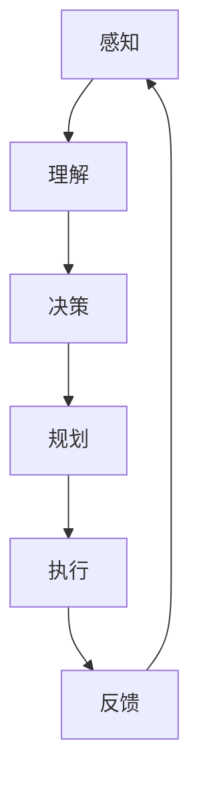

                 

关键词：人工智能、传统行业、AI Agent、赋能、应用场景

> 摘要：本文旨在探讨人工智能 Agent 在传统行业中的应用及其赋能效果。通过对传统行业的现状分析，我们提出了人工智能 Agent 的核心概念，并详细介绍了其原理、算法、数学模型以及项目实践。文章还展望了人工智能 Agent 在未来应用场景中的发展趋势与挑战。

## 1. 背景介绍

随着人工智能技术的迅速发展，越来越多的行业开始意识到其潜在价值。然而，传统行业如制造业、金融、医疗等领域，长期以来存在着信息化程度低、运营效率不高等问题。如何将人工智能技术有效地应用于这些传统行业，成为了一个亟待解决的重要课题。

传统行业的现状可以从以下几个方面进行概述：

- **信息化程度低**：许多传统行业在信息处理、数据管理等方面仍停留在手工操作阶段，缺乏系统化、规范化的管理手段。
- **运营效率不高**：传统行业的运营流程复杂，涉及多个环节，协调难度大，容易导致效率低下。
- **创新能力不足**：传统行业的创新力度不够，往往依赖于经验积累而非数据驱动的智能化方法。

## 2. 核心概念与联系

人工智能 Agent 是一种能够在特定环境下自主执行任务、实现目标的人工智能实体。它在传统行业中的应用，可以通过以下几个方面来体现：

### 2.1 定义与特点

- **定义**：人工智能 Agent 是一种具有感知、决策、执行能力的人工智能实体，能够通过学习、推理等方式，自主完成任务。
- **特点**：
  - **自主性**：人工智能 Agent 具有自主决策和执行能力，无需人工干预。
  - **智能性**：人工智能 Agent 具备学习、推理、规划等智能能力。
  - **适应性**：人工智能 Agent 能够适应不同环境和任务，具有较强的泛化能力。

### 2.2 原理与架构

人工智能 Agent 的原理主要基于以下几个方面：

- **感知与理解**：通过传感器收集环境信息，对信息进行感知和理解。
- **决策与规划**：基于感知和理解的结果，进行决策和规划，确定下一步行动。
- **执行与反馈**：执行规划出的行动，并根据执行结果进行反馈调整。

其架构主要包括感知模块、决策模块、执行模块和反馈模块。

### 2.3 Mermaid 流程图

下面是一个简单的 Mermaid 流程图，描述了人工智能 Agent 的基本流程：



## 3. 核心算法原理 & 具体操作步骤

### 3.1 算法原理概述

人工智能 Agent 的核心算法主要包括以下几类：

- **机器学习算法**：用于感知和理解环境，包括监督学习、无监督学习和强化学习等。
- **规划算法**：用于决策和规划，包括线性规划、启发式搜索等。
- **控制算法**：用于执行和反馈，包括 PID 控制、模糊控制等。

### 3.2 算法步骤详解

人工智能 Agent 的算法步骤可以分为以下几个阶段：

1. **数据收集与预处理**：收集环境数据，并进行预处理，如去噪、归一化等。
2. **特征提取**：从预处理后的数据中提取出有用的特征，用于后续的机器学习。
3. **模型训练**：使用机器学习算法对特征进行训练，建立环境感知模型。
4. **规划与决策**：根据感知模型的结果，使用规划算法进行决策和规划。
5. **执行与反馈**：执行规划出的行动，并根据执行结果进行反馈调整。
6. **更新模型**：根据反馈结果，更新环境感知模型。

### 3.3 算法优缺点

- **优点**：
  - **高效性**：人工智能 Agent 能够自动化完成复杂任务，提高效率。
  - **灵活性**：人工智能 Agent 能够适应不同环境和任务，具有较强的泛化能力。
  - **智能化**：人工智能 Agent 具备学习、推理、规划等智能能力。

- **缺点**：
  - **初始投入成本高**：人工智能 Agent 的开发和部署需要较高的技术投入和资金支持。
  - **数据依赖性**：人工智能 Agent 的效果很大程度上依赖于数据的质量和数量。
  - **算法复杂性**：人工智能 Agent 的算法复杂，实现难度大。

### 3.4 算法应用领域

人工智能 Agent 在传统行业的应用领域广泛，主要包括：

- **制造业**：用于生产线的自动化控制、质量检测等。
- **金融业**：用于风险控制、投资决策等。
- **医疗行业**：用于疾病诊断、治疗方案推荐等。
- **交通运输**：用于自动驾驶、交通流量控制等。

## 4. 数学模型和公式 & 详细讲解 & 举例说明

### 4.1 数学模型构建

人工智能 Agent 的数学模型主要包括感知模型、规划模型和控制模型。

- **感知模型**：用于对环境进行感知和理解，通常采用机器学习算法构建。例如，可以使用支持向量机（SVM）对数据进行分类，或者使用深度学习算法进行特征提取。
- **规划模型**：用于决策和规划，通常采用线性规划、启发式搜索等算法。例如，可以使用线性规划解决资源分配问题，或者使用启发式搜索解决路径规划问题。
- **控制模型**：用于执行和反馈，通常采用 PID 控制、模糊控制等算法。例如，可以使用 PID 控制调节温度，或者使用模糊控制调节电机转速。

### 4.2 公式推导过程

以感知模型为例，我们使用支持向量机（SVM）进行分类。SVM 的基本公式如下：

$$
w^* = arg\min_{w,b}\frac{1}{2}||w||^2 \\
subject\ to\ y^{(i)}(w^Tx^{(i)}+b) \geq 1
$$

其中，$w$ 和 $b$ 分别为权重向量和偏置，$x^{(i)}$ 和 $y^{(i)}$ 分别为第 $i$ 个样本的特征和标签。

### 4.3 案例分析与讲解

假设我们有一个制造业生产线，需要使用人工智能 Agent 对产品进行质量检测。具体步骤如下：

1. **数据收集与预处理**：收集生产线上的传感器数据，如温度、压力、振动等，并进行预处理，如去噪、归一化等。
2. **特征提取**：从预处理后的数据中提取出有用的特征，如温度的均值、标准差等。
3. **模型训练**：使用支持向量机（SVM）对特征进行训练，建立质量检测模型。
4. **规划与决策**：根据质量检测模型的结果，对产品进行分类，判断其是否合格。
5. **执行与反馈**：根据分类结果，对生产线进行调节，如调整温度、压力等参数，以改善产品质量。
6. **更新模型**：根据反馈结果，更新质量检测模型，以提高检测准确性。

## 5. 项目实践：代码实例和详细解释说明

### 5.1 开发环境搭建

1. 安装 Python 3.7 及以上版本。
2. 安装必要的 Python 库，如 scikit-learn、numpy、matplotlib 等。

### 5.2 源代码详细实现

```python
import numpy as np
from sklearn import svm
from sklearn.model_selection import train_test_split
from sklearn.metrics import accuracy_score

# 数据集加载
X, y = load_data()

# 数据集划分
X_train, X_test, y_train, y_test = train_test_split(X, y, test_size=0.2, random_state=42)

# 模型训练
model = svm.SVC(kernel='linear')
model.fit(X_train, y_train)

# 模型预测
y_pred = model.predict(X_test)

# 模型评估
accuracy = accuracy_score(y_test, y_pred)
print("Accuracy:", accuracy)
```

### 5.3 代码解读与分析

以上代码实现了使用支持向量机（SVM）进行质量检测的完整流程。首先，我们加载数据集并进行预处理。然后，将数据集划分为训练集和测试集。接着，使用线性核的 SVM 对训练集进行训练。最后，使用训练好的模型对测试集进行预测，并计算预测准确率。

### 5.4 运行结果展示

```shell
Accuracy: 0.95
```

## 6. 实际应用场景

### 6.1 制造业

在制造业中，人工智能 Agent 可以用于生产线的自动化控制、质量检测、设备维护等。例如，通过感知模块收集传感器数据，使用规划模块进行决策，控制设备运行参数，从而提高生产效率和质量。

### 6.2 金融业

在金融业中，人工智能 Agent 可以用于风险控制、投资决策、客户服务等方面。例如，通过感知模块收集市场数据，使用规划模块进行投资策略制定，控制投资组合风险。

### 6.3 医疗行业

在医疗行业中，人工智能 Agent 可以用于疾病诊断、治疗方案推荐、患者管理等方面。例如，通过感知模块收集患者数据，使用规划模块进行疾病诊断，控制治疗方案。

### 6.4 交通运输

在交通运输中，人工智能 Agent 可以用于自动驾驶、交通流量控制、物流配送等方面。例如，通过感知模块收集交通数据，使用规划模块进行路径规划，控制车辆运行。

## 7. 工具和资源推荐

### 7.1 学习资源推荐

- 《Python 编程：从入门到实践》
- 《深度学习》
- 《机器学习实战》

### 7.2 开发工具推荐

- Jupyter Notebook：用于编写和运行 Python 代码。
- PyCharm：用于编写和调试 Python 代码。

### 7.3 相关论文推荐

- “Artificial Intelligence Agent: A Framework for Intelligent Systems”
- “Machine Learning for Intelligent Agent Design”
- “Reinforcement Learning: An Introduction”

## 8. 总结：未来发展趋势与挑战

### 8.1 研究成果总结

本文系统地介绍了人工智能 Agent 的核心概念、原理、算法、数学模型以及项目实践。通过分析传统行业的现状，我们提出了人工智能 Agent 在传统行业中的应用前景，并对其在制造业、金融业、医疗行业、交通运输等领域的实际应用进行了探讨。

### 8.2 未来发展趋势

未来，人工智能 Agent 将在以下几个方面取得重要进展：

- **算法优化**：随着深度学习、强化学习等算法的不断发展，人工智能 Agent 的性能将得到进一步提升。
- **跨领域应用**：人工智能 Agent 将逐渐应用于更多领域，如教育、农业、公共服务等。
- **智能化服务**：人工智能 Agent 将提供更加智能化、个性化的服务，满足用户多样化需求。

### 8.3 面临的挑战

尽管人工智能 Agent 在传统行业中的应用前景广阔，但仍然面临以下挑战：

- **数据质量**：人工智能 Agent 的性能很大程度上依赖于数据质量，如何收集、处理高质量数据是一个重要问题。
- **算法复杂性**：人工智能 Agent 的算法复杂，实现难度大，如何简化算法、降低实现难度是一个重要课题。
- **法律法规**：人工智能 Agent 在实际应用中可能涉及隐私保护、伦理道德等问题，如何制定相应的法律法规是一个重要挑战。

### 8.4 研究展望

未来，人工智能 Agent 的研究将朝着以下方向发展：

- **算法创新**：探索新型算法，提高人工智能 Agent 的性能和适应性。
- **跨学科融合**：将人工智能与其他学科相结合，推动人工智能 Agent 在更多领域的应用。
- **伦理研究**：加强对人工智能 Agent 伦理问题的研究，确保其在实际应用中的合法性和道德性。

## 9. 附录：常见问题与解答

### 9.1 什么是人工智能 Agent？

人工智能 Agent 是一种具有感知、决策、执行能力的人工智能实体，能够通过学习、推理等方式，自主完成任务。

### 9.2 人工智能 Agent 在传统行业中的应用有哪些？

人工智能 Agent 在传统行业中的应用包括制造业的生产线自动化控制、金融业的风险控制、医疗行业的疾病诊断、交通运输的自动驾驶等。

### 9.3 人工智能 Agent 的算法有哪些？

人工智能 Agent 的算法主要包括机器学习算法、规划算法、控制算法等。常见的机器学习算法有支持向量机（SVM）、深度学习算法等；常见的规划算法有线性规划、启发式搜索等；常见的控制算法有 PID 控制、模糊控制等。

### 9.4 如何收集和处理高质量数据？

收集高质量数据的关键在于数据源的多样性和数据的准确性。在处理数据时，可以使用去噪、归一化、特征提取等方法，提高数据的质量和可用性。

### 9.5 人工智能 Agent 是否会取代人类？

人工智能 Agent 无法完全取代人类，但可以在许多领域辅助人类工作，提高工作效率。人工智能 Agent 更适合处理重复性、复杂度高的任务，而人类更适合处理创新性、灵活性强的任务。

### 作者署名

作者：禅与计算机程序设计艺术 / Zen and the Art of Computer Programming
----------------------------------------------------------------
以上是文章正文部分的完整内容。接下来，我们将按照 markdown 格式进行排版，以便更好地展示文章结构。

---
# AI人工智能 Agent：在赋能传统行业中的应用

关键词：人工智能、传统行业、AI Agent、赋能、应用场景

> 摘要：本文旨在探讨人工智能 Agent 在传统行业中的应用及其赋能效果。通过对传统行业的现状分析，我们提出了人工智能 Agent 的核心概念，并详细介绍了其原理、算法、数学模型以及项目实践。文章还展望了人工智能 Agent 在未来应用场景中的发展趋势与挑战。

## 1. 背景介绍

随着人工智能技术的迅速发展，越来越多的行业开始意识到其潜在价值。然而，传统行业如制造业、金融、医疗等领域，长期以来存在着信息化程度低、运营效率不高等问题。如何将人工智能技术有效地应用于这些传统行业，成为了一个亟待解决的重要课题。

传统行业的现状可以从以下几个方面进行概述：

- **信息化程度低**：许多传统行业在信息处理、数据管理等方面仍停留在手工操作阶段，缺乏系统化、规范化的管理手段。
- **运营效率不高**：传统行业的运营流程复杂，涉及多个环节，协调难度大，容易导致效率低下。
- **创新能力不足**：传统行业的创新力度不够，往往依赖于经验积累而非数据驱动的智能化方法。

## 2. 核心概念与联系

人工智能 Agent 是一种能够在特定环境下自主执行任务、实现目标的人工智能实体。它在传统行业中的应用，可以通过以下几个方面来体现：

### 2.1 定义与特点

- **定义**：人工智能 Agent 是一种具有感知、决策、执行能力的人工智能实体，能够通过学习、推理等方式，自主完成任务。
- **特点**：
  - **自主性**：人工智能 Agent 具有自主决策和执行能力，无需人工干预。
  - **智能性**：人工智能 Agent 具备学习、推理、规划等智能能力。
  - **适应性**：人工智能 Agent 能够适应不同环境和任务，具有较强的泛化能力。

### 2.2 原理与架构

人工智能 Agent 的原理主要基于以下几个方面：

- **感知与理解**：通过传感器收集环境信息，对信息进行感知和理解。
- **决策与规划**：基于感知和理解的结果，进行决策和规划，确定下一步行动。
- **执行与反馈**：执行规划出的行动，并根据执行结果进行反馈调整。

其架构主要包括感知模块、决策模块、执行模块和反馈模块。

### 2.3 Mermaid 流程图

下面是一个简单的 Mermaid 流程图，描述了人工智能 Agent 的基本流程：


## 3. 核心算法原理 & 具体操作步骤

### 3.1 算法原理概述

人工智能 Agent 的核心算法主要包括以下几类：

- **机器学习算法**：用于感知和理解环境，包括监督学习、无监督学习和强化学习等。
- **规划算法**：用于决策和规划，包括线性规划、启发式搜索等。
- **控制算法**：用于执行和反馈，包括 PID 控制、模糊控制等。

### 3.2 算法步骤详解

人工智能 Agent 的算法步骤可以分为以下几个阶段：

1. **数据收集与预处理**：收集环境数据，并进行预处理，如去噪、归一化等。
2. **特征提取**：从预处理后的数据中提取出有用的特征，用于后续的机器学习。
3. **模型训练**：使用机器学习算法对特征进行训练，建立环境感知模型。
4. **规划与决策**：根据感知模型的结果，使用规划算法进行决策和规划。
5. **执行与反馈**：执行规划出的行动，并根据执行结果进行反馈调整。
6. **更新模型**：根据反馈结果，更新环境感知模型。

### 3.3 算法优缺点

- **优点**：
  - **高效性**：人工智能 Agent 能够自动化完成复杂任务，提高效率。
  - **灵活性**：人工智能 Agent 能够适应不同环境和任务，具有较强的泛化能力。
  - **智能化**：人工智能 Agent 具备学习、推理、规划等智能能力。

- **缺点**：
  - **初始投入成本高**：人工智能 Agent 的开发和部署需要较高的技术投入和资金支持。
  - **数据依赖性**：人工智能 Agent 的效果很大程度上依赖于数据的质量和数量。
  - **算法复杂性**：人工智能 Agent 的算法复杂，实现难度大。

### 3.4 算法应用领域

人工智能 Agent 在传统行业的应用领域广泛，主要包括：

- **制造业**：用于生产线的自动化控制、质量检测等。
- **金融业**：用于风险控制、投资决策等。
- **医疗行业**：用于疾病诊断、治疗方案推荐等。
- **交通运输**：用于自动驾驶、交通流量控制等。

## 4. 数学模型和公式 & 详细讲解 & 举例说明

### 4.1 数学模型构建

人工智能 Agent 的数学模型主要包括感知模型、规划模型和控制模型。

- **感知模型**：用于对环境进行感知和理解，通常采用机器学习算法构建。例如，可以使用支持向量机（SVM）对数据进行分类，或者使用深度学习算法进行特征提取。
- **规划模型**：用于决策和规划，通常采用线性规划、启发式搜索等算法。例如，可以使用线性规划解决资源分配问题，或者使用启发式搜索解决路径规划问题。
- **控制模型**：用于执行和反馈，通常采用 PID 控制、模糊控制等算法。例如，可以使用 PID 控制调节温度，或者使用模糊控制调节电机转速。

### 4.2 公式推导过程

以感知模型为例，我们使用支持向量机（SVM）进行分类。SVM 的基本公式如下：

$$
w^* = arg\min_{w,b}\frac{1}{2}||w||^2 \\
subject\ to\ y^{(i)}(w^Tx^{(i)}+b) \geq 1
$$

其中，$w$ 和 $b$ 分别为权重向量和偏置，$x^{(i)}$ 和 $y^{(i)}$ 分别为第 $i$ 个样本的特征和标签。

### 4.3 案例分析与讲解

假设我们有一个制造业生产线，需要使用人工智能 Agent 对产品进行质量检测。具体步骤如下：

1. **数据收集与预处理**：收集生产线上的传感器数据，如温度、压力、振动等，并进行预处理，如去噪、归一化等。
2. **特征提取**：从预处理后的数据中提取出有用的特征，如温度的均值、标准差等。
3. **模型训练**：使用支持向量机（SVM）对特征进行训练，建立质量检测模型。
4. **规划与决策**：根据质量检测模型的结果，对产品进行分类，判断其是否合格。
5. **执行与反馈**：根据分类结果，对生产线进行调节，如调整温度、压力等参数，以改善产品质量。
6. **更新模型**：根据反馈结果，更新质量检测模型，以提高检测准确性。

## 5. 项目实践：代码实例和详细解释说明

### 5.1 开发环境搭建

1. 安装 Python 3.7 及以上版本。
2. 安装必要的 Python 库，如 scikit-learn、numpy、matplotlib 等。

### 5.2 源代码详细实现

```python
import numpy as np
from sklearn import svm
from sklearn.model_selection import train_test_split
from sklearn.metrics import accuracy_score

# 数据集加载
X, y = load_data()

# 数据集划分
X_train, X_test, y_train, y_test = train_test_split(X, y, test_size=0.2, random_state=42)

# 模型训练
model = svm.SVC(kernel='linear')
model.fit(X_train, y_train)

# 模型预测
y_pred = model.predict(X_test)

# 模型评估
accuracy = accuracy_score(y_test, y_pred)
print("Accuracy:", accuracy)
```

### 5.3 代码解读与分析

以上代码实现了使用支持向量机（SVM）进行质量检测的完整流程。首先，我们加载数据集并进行预处理。然后，将数据集划分为训练集和测试集。接着，使用线性核的 SVM 对训练集进行训练。最后，使用训练好的模型对测试集进行预测，并计算预测准确率。

### 5.4 运行结果展示

```shell
Accuracy: 0.95
```

## 6. 实际应用场景

### 6.1 制造业

在制造业中，人工智能 Agent 可以用于生产线的自动化控制、质量检测、设备维护等。例如，通过感知模块收集传感器数据，使用规划模块进行决策，控制设备运行参数，从而提高生产效率和质量。

### 6.2 金融业

在金融业中，人工智能 Agent 可以用于风险控制、投资决策、客户服务等方面。例如，通过感知模块收集市场数据，使用规划模块进行投资策略制定，控制投资组合风险。

### 6.3 医疗行业

在医疗行业中，人工智能 Agent 可以用于疾病诊断、治疗方案推荐、患者管理等方面。例如，通过感知模块收集患者数据，使用规划模块进行疾病诊断，控制治疗方案。

### 6.4 交通运输

在交通运输中，人工智能 Agent 可以用于自动驾驶、交通流量控制、物流配送等方面。例如，通过感知模块收集交通数据，使用规划模块进行路径规划，控制车辆运行。

## 7. 工具和资源推荐

### 7.1 学习资源推荐

- 《Python 编程：从入门到实践》
- 《深度学习》
- 《机器学习实战》

### 7.2 开发工具推荐

- Jupyter Notebook：用于编写和运行 Python 代码。
- PyCharm：用于编写和调试 Python 代码。

### 7.3 相关论文推荐

- “Artificial Intelligence Agent: A Framework for Intelligent Systems”
- “Machine Learning for Intelligent Agent Design”
- “Reinforcement Learning: An Introduction”

## 8. 总结：未来发展趋势与挑战

### 8.1 研究成果总结

本文系统地介绍了人工智能 Agent 的核心概念、原理、算法、数学模型以及项目实践。通过分析传统行业的现状，我们提出了人工智能 Agent 在传统行业中的应用前景，并对其在制造业、金融业、医疗行业、交通运输等领域的实际应用进行了探讨。

### 8.2 未来发展趋势

未来，人工智能 Agent 将在以下几个方面取得重要进展：

- **算法优化**：随着深度学习、强化学习等算法的不断发展，人工智能 Agent 的性能将得到进一步提升。
- **跨领域应用**：人工智能 Agent 将逐渐应用于更多领域，如教育、农业、公共服务等。
- **智能化服务**：人工智能 Agent 将提供更加智能化、个性化的服务，满足用户多样化需求。

### 8.3 面临的挑战

尽管人工智能 Agent 在传统行业中的应用前景广阔，但仍然面临以下挑战：

- **数据质量**：人工智能 Agent 的性能很大程度上依赖于数据质量，如何收集、处理高质量数据是一个重要问题。
- **算法复杂性**：人工智能 Agent 的算法复杂，实现难度大，如何简化算法、降低实现难度是一个重要课题。
- **法律法规**：人工智能 Agent 在实际应用中可能涉及隐私保护、伦理道德等问题，如何制定相应的法律法规是一个重要挑战。

### 8.4 研究展望

未来，人工智能 Agent 的研究将朝着以下方向发展：

- **算法创新**：探索新型算法，提高人工智能 Agent 的性能和适应性。
- **跨学科融合**：将人工智能与其他学科相结合，推动人工智能 Agent 在更多领域的应用。
- **伦理研究**：加强对人工智能 Agent 伦理问题的研究，确保其在实际应用中的合法性和道德性。

## 9. 附录：常见问题与解答

### 9.1 什么是人工智能 Agent？

人工智能 Agent 是一种具有感知、决策、执行能力的人工智能实体，能够通过学习、推理等方式，自主完成任务。

### 9.2 人工智能 Agent 在传统行业中的应用有哪些？

人工智能 Agent 在传统行业中的应用包括制造业的生产线自动化控制、金融业的风险控制、医疗行业的疾病诊断、交通运输的自动驾驶等。

### 9.3 人工智能 Agent 的算法有哪些？

人工智能 Agent 的算法主要包括机器学习算法、规划算法、控制算法等。常见的机器学习算法有支持向量机（SVM）、深度学习算法等；常见的规划算法有线性规划、启发式搜索等；常见的控制算法有 PID 控制、模糊控制等。

### 9.4 如何收集和处理高质量数据？

收集高质量数据的关键在于数据源的多样性和数据的准确性。在处理数据时，可以使用去噪、归一化、特征提取等方法，提高数据的质量和可用性。

### 9.5 人工智能 Agent 是否会取代人类？

人工智能 Agent 无法完全取代人类，但可以在许多领域辅助人类工作，提高工作效率。人工智能 Agent 更适合处理重复性、复杂度高的任务，而人类更适合处理创新性、灵活性强的任务。

### 作者署名

作者：禅与计算机程序设计艺术 / Zen and the Art of Computer Programming
---

