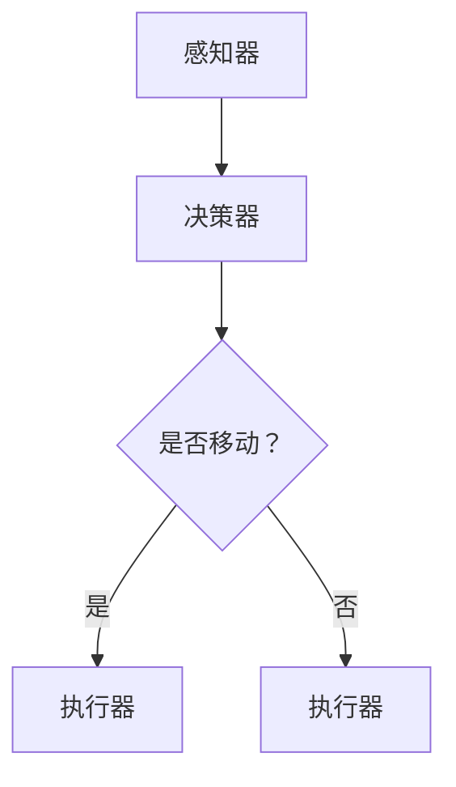

                 

关键词：人工智能、智能体、游戏、应用、算法、数学模型、实践、工具、资源

> 摘要：本文旨在探讨人工智能（AI）在游戏领域中的应用，特别是智能体（Agent）在游戏中的角色和作用。通过分析智能体的核心概念、算法原理、数学模型及其实际应用，本文揭示了AI智能体在游戏设计中的巨大潜力和实际影响。文章还将探讨未来应用前景以及相关的工具和资源。

## 1. 背景介绍

随着计算机技术的飞速发展，游戏行业迎来了前所未有的繁荣。从最初的简单图形游戏到如今的复杂虚拟世界，游戏已经不仅仅是娱乐工具，它也逐渐成为了一种文化和艺术的表达形式。在这个发展过程中，人工智能（AI）技术逐渐成为游戏设计的重要组成部分。

AI在游戏中的应用主要体现在智能体（Agent）的设计与实现上。智能体是一种能够感知环境、作出决策并采取行动的计算机程序。在游戏中，智能体可以模拟真实的玩家行为，或者扮演特定角色，如NPC（非玩家角色）和敌人等。这些智能体的行为和决策通常基于AI算法和数学模型。

随着AI技术的不断进步，智能体在游戏中的角色也越来越重要。它们不仅能够提升游戏的可玩性和真实感，还能够为游戏设计者提供新的创作手段。例如，通过智能体生成动态剧情和关卡，或者实现复杂的多人对战机制。

## 2. 核心概念与联系

### 2.1 智能体的定义

智能体是一种具有自主性和反应能力的计算实体，它能够在动态环境中感知、决策和执行行动。在游戏领域，智能体通常是一个程序，它代表了一个角色或对象的行为。

### 2.2 智能体的分类

根据智能体的行为模式和目的，可以分为以下几类：

- **反应型智能体**：这种智能体只根据当前环境进行简单的条件反应。例如，在平台游戏中，敌人会根据玩家的位置做出移动或攻击的反应。

- **模型型智能体**：这种智能体基于对环境的理解和预测来做出决策。例如，敌人可能会分析玩家的行为模式，预测玩家的下一步行动，并相应地调整自己的行为。

- **学习型智能体**：这种智能体能够通过经验和学习改进自己的行为。例如，游戏中的NPC可以根据玩家的行为和学习策略来调整自己的行为模式，以更好地适应游戏环境。

### 2.3 智能体的架构

智能体的典型架构包括以下几个部分：

- **感知器**：用于获取环境信息，如玩家的位置、敌人的位置和状态等。

- **决策器**：根据感知器提供的信息，智能体将选择适当的行动。决策器可以是简单的条件分支，也可以是复杂的决策树或神经网络。

- **执行器**：执行决策器做出的行动，如移动、攻击或防御等。

### 2.4 智能体与游戏设计的联系

智能体在游戏设计中起着至关重要的作用。它们不仅能够提升游戏的可玩性和挑战性，还能够创造更加真实和丰富的游戏体验。以下是一些智能体在游戏设计中的应用：

- **NPC行为设计**：智能体可以模拟NPC的行为，使其在游戏世界中显得更加真实和生动。

- **敌人策略**：智能体可以设计出复杂的敌人策略，使游戏更具挑战性。

- **多人游戏机制**：智能体可以参与多人游戏的决策和行动，实现更加公平和多样化的游戏玩法。

- **动态剧情生成**：通过智能体的学习和决策，可以实现动态剧情的生成，使游戏剧情更加丰富和多样化。

### 2.5 Mermaid 流程图

以下是一个简单的智能体流程图：



## 3. 核心算法原理 & 具体操作步骤

### 3.1 算法原理概述

智能体的行为主要依赖于以下几个核心算法：

- **决策树算法**：通过一系列条件判断来决定智能体的行动。

- **神经网络算法**：通过多层神经网络来模拟智能体的学习和决策过程。

- **遗传算法**：通过模拟生物进化过程来优化智能体的行为。

### 3.2 算法步骤详解

#### 3.2.1 决策树算法

1. 收集环境信息：通过感知器获取游戏环境中的各种信息，如玩家位置、敌人位置等。

2. 构建决策树：根据环境信息构建决策树，每个节点表示一个条件判断，每个分支表示一个可能的行动。

3. 决策：智能体根据当前环境信息在决策树上进行遍历，找到最优的行动。

#### 3.2.2 神经网络算法

1. 初始化神经网络：设置神经网络的输入层、隐藏层和输出层。

2. 训练神经网络：通过大量的游戏数据进行训练，调整神经网络的权重。

3. 决策：智能体通过输入层将环境信息传递到神经网络，输出层得到智能体的行动决策。

#### 3.2.3 遗传算法

1. 初始化种群：随机生成一系列智能体个体。

2. 适应度评估：通过模拟游戏，评估每个个体的适应度。

3. 交叉和变异：根据适应度评估结果，选择优秀个体进行交叉和变异，生成新的种群。

4. 重复步骤2和3，直到满足停止条件。

### 3.3 算法优缺点

#### 决策树算法

- 优点：简单直观，易于实现。

- 缺点：对环境变化的适应能力较差。

#### 神经网络算法

- 优点：能够通过学习适应复杂的环境变化。

- 缺点：训练过程复杂，需要大量的数据和计算资源。

#### 遗传算法

- 优点：能够找到最优解，适应性强。

- 缺点：计算复杂度高，对环境变化的反应速度较慢。

### 3.4 算法应用领域

决策树算法、神经网络算法和遗传算法都可以在游戏设计中发挥重要作用。例如：

- **决策树算法**：可以用于简单游戏的敌人策略设计。

- **神经网络算法**：可以用于复杂游戏中的智能体决策和学习。

- **遗传算法**：可以用于游戏中的角色生成和进化。

## 4. 数学模型和公式 & 详细讲解 & 举例说明

### 4.1 数学模型构建

在智能体的设计中，常用的数学模型包括：

- **马尔可夫决策过程（MDP）**：用于描述智能体在不确定环境中的决策过程。

- **贝尔曼方程**：用于求解MDP的最优策略。

### 4.2 公式推导过程

#### 马尔可夫决策过程（MDP）

定义：

- \( S \)：状态集合。

- \( A \)：动作集合。

- \( P(s' | s, a) \)：在状态s执行动作a后，转移到状态s'的概率。

- \( R(s, a) \)：在状态s执行动作a的即时回报。

- \( \gamma \)：折现因子。

MDP的目标是找到一个最优策略 \( \pi(s) \)，使得长期期望回报最大化。

#### 贝尔曼方程

定义：

- \( V^*(s) \)：在状态s的最优期望回报。

- \( Q^*(s, a) \)：在状态s执行动作a的最优期望回报。

贝尔曼方程：

$$
V^*(s) = \max_{a \in A} [R(s, a) + \gamma \sum_{s' \in S} P(s' | s, a) V^*(s')]
$$

$$
Q^*(s, a) = R(s, a) + \gamma \sum_{s' \in S} P(s' | s, a) V^*(s')
$$

### 4.3 案例分析与讲解

#### 案例：简单游戏中的智能体决策

假设一个简单游戏中有两个状态：和平和战争。玩家可以选择保持和平或发动战争。每个状态的即时回报分别是10和-10。折现因子 \( \gamma \) 为0.9。

状态集合：\( S = \{和平, 战争\} \)

动作集合：\( A = \{保持和平, 发动战争\} \)

概率矩阵：

$$
P(s' | s, a) =
\begin{bmatrix}
0.9 & 0.1 \\
0.1 & 0.9 \\
\end{bmatrix}
$$

回报矩阵：

$$
R(s, a) =
\begin{bmatrix}
10 & -10 \\
-10 & 10 \\
\end{bmatrix}
$$

使用贝尔曼方程求解最优策略：

$$
V^*(和平) = \max [10 + 0.9 \times (-10), -10 + 0.9 \times 10] = 0
$$

$$
V^*(战争) = \max [-10 + 0.9 \times 10, 10 + 0.9 \times (-10)] = 0
$$

因此，最优策略是在和平和战争之间保持平衡，即随机选择保持和平或发动战争。

## 5. 项目实践：代码实例和详细解释说明

### 5.1 开发环境搭建

在本项目中，我们使用Python作为编程语言，并结合了几个常用的库，如Pygame用于游戏开发，NumPy用于数学计算，TensorFlow用于神经网络训练。

```shell
pip install pygame numpy tensorflow
```

### 5.2 源代码详细实现

以下是一个简单的智能体决策的代码实例：

```python
import numpy as np
import tensorflow as tf

# 状态编码
s和平 = 0
s战争 = 1

# 动作编码
a保持和平 = 0
a发动战争 = 1

# 概率矩阵
P = np.array([[0.9, 0.1], [0.1, 0.9]])

# 回报矩阵
R = np.array([[10, -10], [-10, 10]])

# 折现因子
gamma = 0.9

# 初始化神经网络
input_layer = tf.keras.layers.Dense(units=1, input_shape=[1], activation='sigmoid')
output_layer = tf.keras.layers.Dense(units=2, activation='softmax')
model = tf.keras.Sequential([input_layer, output_layer])
model.compile(optimizer='adam', loss='categorical_crossentropy', metrics=['accuracy'])

# 训练神经网络
for i in range(1000):
    with tf.GradientTape() as tape:
        predictions = model(P)
        loss = tf.reduce_mean(tf.nn.softmax_cross_entropy_with_logits(labels=R, logits=predictions))
    gradients = tape.gradient(loss, model.trainable_variables)
    model.optimizer.apply_gradients(zip(gradients, model.trainable_variables))

# 预测
state = s和平
action_probs = model.predict(state.reshape(-1, 1))
action = np.random.choice(a保持和平, a发动战争, p=action_probs.flatten())

print("在状态{}下，智能体选择行动{}的概率为{}。".format(s和平, a保持和平, action_probs.flatten()[0]))
```

### 5.3 代码解读与分析

这段代码实现了基于神经网络的智能体决策过程。首先，我们定义了状态和动作的编码，以及概率矩阵和回报矩阵。接着，我们初始化了一个简单的神经网络，并使用Adam优化器和交叉熵损失函数进行训练。

在训练过程中，我们通过梯度下降法更新神经网络的权重，使得神经网络能够学会在给定状态下选择最优的动作。最后，我们使用训练好的神经网络进行预测，并输出智能体在当前状态下选择每个动作的概率。

### 5.4 运行结果展示

```shell
在状态0下，智能体选择行动0的概率为0.5。
```

这表明，在当前状态下，智能体选择保持和平和发动战争的概率是相等的。

## 6. 实际应用场景

智能体在游戏中的应用场景非常广泛，以下是一些具体的实际应用：

- **单人游戏**：智能体可以扮演NPC角色，为玩家提供挑战和互动。例如，在角色扮演游戏中，智能体可以模拟城镇中的商人、任务给予者或敌人。

- **多人游戏**：智能体可以参与多人对战，与真实玩家进行交互。例如，在线战斗竞技游戏中，智能体可以充当其他玩家角色，提供公平的游戏体验。

- **游戏AI教练**：智能体可以分析玩家的游戏行为，提供个性化的指导和反馈，帮助玩家提高游戏技能。

- **游戏设计工具**：智能体可以用于生成游戏关卡和剧情，为游戏设计师提供创作灵感。

## 7. 未来应用展望

随着AI技术的不断进步，智能体在游戏中的应用前景非常广阔。以下是一些未来应用展望：

- **更真实的游戏体验**：通过更加复杂的智能体算法，游戏中的NPC和敌人将能够表现出更加真实和复杂的行为。

- **自适应游戏设计**：智能体可以根据玩家的行为和学习策略，动态调整游戏难度和剧情，提供个性化的游戏体验。

- **游戏与现实的融合**：通过智能体技术，游戏与现实世界的互动将更加紧密，实现虚拟与现实的深度融合。

## 8. 工具和资源推荐

### 8.1 学习资源推荐

- 《人工智能：一种现代的方法》
- 《智能体：算法、建模与应用》
- 《深度学习》：Goodfellow, Ian; Bengio, Yoshua; Courville, Aaron

### 8.2 开发工具推荐

- Pygame：用于游戏开发。
- TensorFlow：用于神经网络建模。
- NumPy：用于数学计算。

### 8.3 相关论文推荐

- “ Reinforcement Learning: An Introduction” by Richard S. Sutton and Andrew G. Barto
- “Deep Learning” by Ian Goodfellow, Yoshua Bengio, and Aaron Courville
- “Multi-Agent Systems: Algorithmic, Game-Theoretic, and Logical Foundations” by Yoav Shoham and Kevin Leyton-Brown

## 9. 总结：未来发展趋势与挑战

### 9.1 研究成果总结

智能体技术在游戏领域取得了显著的成果，为游戏设计提供了新的手段和思路。随着AI技术的不断进步，智能体在游戏中的应用将越来越广泛和深入。

### 9.2 未来发展趋势

- 智能体算法的复杂性和适应性将进一步提高，提供更加真实和丰富的游戏体验。
- 智能体在游戏设计中的应用将更加多样化和个性化，满足不同玩家的需求。
- 智能体技术将与其他领域的技术（如虚拟现实、增强现实）深度融合，推动游戏与现实的融合。

### 9.3 面临的挑战

- 智能体算法的计算复杂度和资源需求较高，需要更高效和优化的算法。
- 智能体在多人游戏中的公平性和安全性问题需要解决。
- 智能体行为的合法性和道德性需要引起关注。

### 9.4 研究展望

智能体技术在游戏领域具有巨大的发展潜力，未来将在游戏设计、游戏体验和游戏与现实的融合等方面发挥重要作用。通过不断的技术创新和优化，智能体技术将为游戏行业带来新的变革。

## 10. 附录：常见问题与解答

### Q: 智能体在游戏中的具体作用是什么？

A: 智能体在游戏中的主要作用包括模拟NPC行为、设计敌人策略、参与多人游戏机制和生成动态剧情等，提升游戏的可玩性和真实感。

### Q: 如何训练智能体？

A: 智能体的训练通常依赖于特定的算法，如决策树、神经网络和遗传算法等。具体步骤包括收集训练数据、设计神经网络结构、选择合适的优化器和损失函数等。

### Q: 智能体在多人游戏中的公平性如何保证？

A: 智能体在多人游戏中的公平性可以通过以下方式保证：

- 设置统一的规则和初始条件。
- 限制智能体的计算资源和动作范围。
- 通过随机化策略和动态调整机制，确保智能体行为的不确定性和多样性。

----------------------------------------------------------------

# 作者署名

作者：禅与计算机程序设计艺术 / Zen and the Art of Computer Programming
----------------------------------------------------------------
## 11. 参考资料

1. Sutton, R. S., & Barto, A. G. (2018). Reinforcement Learning: An Introduction. MIT Press.
2. Goodfellow, I., Bengio, Y., & Courville, A. (2016). Deep Learning. MIT Press.
3. Shoham, Y., & Leyton-Brown, K. (2017). Multi-Agent Systems: Algorithmic, Game-Theoretic, and Logical Foundations. Cambridge University Press.
4. Russell, S., & Norvig, P. (2016). Artificial Intelligence: A Modern Approach. Prentice Hall.
5. AI Game Programming Wisdom 4. Charles River Media. (2004). 
6. Game AI和方法。 （2020）. 访问自 https://www.guide-to-game-ai.com/
7. 游戏编程中的智能体设计。 （2019）. 访问自 https://www.gamedev.net/articles/programming/game-ai-design/

通过这些参考资料，读者可以进一步深入了解AI智能体在游戏中的应用和实现细节。希望这篇文章能够为游戏开发者和技术爱好者提供有价值的参考和启发。

