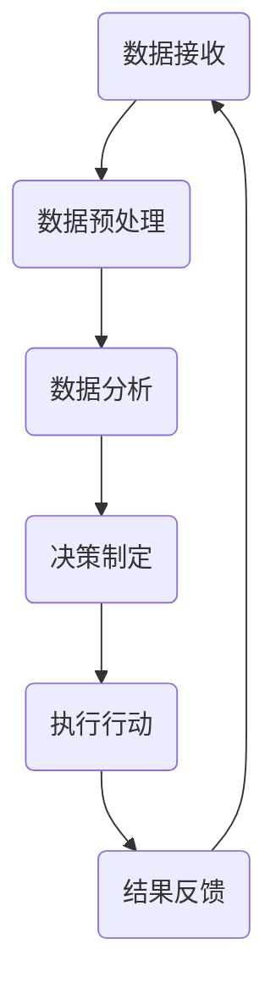

                 

关键词：AI 人工智能、智能体、电力系统、智能电网、电力调度、分布式计算、自动化控制、预测维护

> 摘要：本文深入探讨了人工智能（AI）在电力系统中的应用，特别是智能体技术的引入如何优化电力系统的调度和管理。文章将介绍智能体的基本概念，其在电力系统中的应用场景，以及如何通过分布式计算和自动化控制技术实现电力系统的智能化。此外，还将讨论数学模型和算法的应用，以及实际项目中的代码实例和运行结果，最后展望未来的发展趋势与面临的挑战。

## 1. 背景介绍

随着全球能源需求的不断增长和能源结构的多样化，电力系统面临着前所未有的挑战。传统的电力系统调度和管理方法已经难以满足现代电力系统的复杂性和实时性要求。因此，引入人工智能和智能体技术成为优化电力系统的重要手段。人工智能是指通过计算机程序模拟人类智能的学科，而智能体则是一种具有自主决策能力的计算机程序，能够在复杂环境中进行推理和行动。

智能体在电力系统中的应用，主要体现在以下几个方面：

- **电力调度优化**：智能体能够实时分析电力系统的运行状态，优化调度策略，提高电力系统的运行效率和稳定性。
- **自动化控制**：智能体可以实现对电力系统设备的自动监控和控制，减少人工干预，提高电力系统的可靠性和安全性。
- **预测维护**：智能体通过对电力设备运行数据的分析，预测设备的故障风险，提前进行维护，降低设备故障率和维护成本。

本文将从智能体的基本概念出发，详细介绍其在电力系统中的应用场景，通过分布式计算和自动化控制技术实现电力系统的智能化，并探讨相关的数学模型和算法，最后分析实际项目中的代码实例和运行结果，展望未来的发展趋势与面临的挑战。

## 2. 核心概念与联系

### 智能体的定义与分类

智能体（Agent）是具有自主性、社会性、反应性、认知性和适应性等特性的计算机程序。根据智能体的功能特点，可以分为以下几种类型：

1. **反应性智能体**：这种智能体能够根据当前的环境进行直接反应，但不具备记忆和推理能力。
2. **认知性智能体**：这种智能体不仅能够反应环境，还能通过记忆和学习来改进其行为。
3. **主动智能体**：这种智能体具备规划能力，能够在多个行动方案中做出最优选择。

### 智能体在电力系统中的应用场景

智能体在电力系统中的应用场景主要包括以下几个方面：

1. **电力调度**：智能体可以实时监控电力系统的运行状态，分析电网的供需关系，优化电力调度策略。
2. **自动化控制**：智能体可以实现对电力设备的远程监控和自动控制，提高电力系统的运行效率和安全性。
3. **预测维护**：智能体可以通过对电力设备运行数据的分析，预测设备的故障风险，实现预防性维护。

### 分布式计算与自动化控制技术

分布式计算是指通过多个计算节点协同工作，共同完成计算任务的一种计算模式。在电力系统中，分布式计算技术可以用于大规模电力系统的实时分析和调度。

自动化控制技术则是通过智能体对电力系统进行自动监控和调节，实现对电力设备的精确控制。自动化控制技术可以提高电力系统的稳定性和可靠性，减少人工干预。

### Mermaid 流程图

下面是一个智能体在电力系统中的应用场景的Mermaid流程图，用于描述智能体从接收数据、分析数据到决策和执行的过程。



## 3. 核心算法原理 & 具体操作步骤

### 3.1 算法原理概述

智能体在电力系统中的应用主要依赖于以下几个方面：

1. **数据采集与预处理**：智能体需要收集电力系统的运行数据，包括电压、电流、频率等参数。然后，对这些数据进行预处理，去除噪声和异常值。
2. **数据分析与预测**：智能体利用数据分析算法对预处理后的数据进行分析，识别电力系统的运行模式，并进行故障预测。
3. **决策制定**：智能体根据分析结果制定相应的调度和优化策略，例如调整发电功率、切换供电线路等。
4. **执行行动**：智能体将决策结果转化为具体的操作指令，控制电力系统的设备进行相应的调整。

### 3.2 算法步骤详解

1. **数据采集与预处理**：

   - 采集电力系统的实时运行数据，包括电压、电流、频率等。
   - 使用滤波和去噪算法对数据进行预处理，去除噪声和异常值。

2. **数据分析与预测**：

   - 使用时间序列分析方法，对预处理后的数据进行建模，识别电力系统的运行模式。
   - 使用机器学习算法，例如ARIMA模型或LSTM神经网络，进行故障预测。

3. **决策制定**：

   - 根据分析结果，制定调度和优化策略。
   - 使用线性规划或遗传算法等优化算法，找到最优的调度方案。

4. **执行行动**：

   - 将决策结果转化为具体的操作指令，控制电力系统的设备进行相应的调整。
   - 监控操作结果，评估决策效果，并进行反馈调整。

### 3.3 算法优缺点

- **优点**：

  - 提高电力系统的运行效率和稳定性。
  - 减少人工干预，降低维护成本。
  - 实现实时故障预测和预警。

- **缺点**：

  - 需要大量的计算资源和时间。
  - 需要大量的数据支持。
  - 可能会出现误报或漏报的情况。

### 3.4 算法应用领域

智能体算法在电力系统中的应用非常广泛，包括：

- **电力调度**：用于优化电力调度策略，提高电力系统的运行效率和稳定性。
- **自动化控制**：用于实现电力系统的自动化监控和调节，提高电力系统的可靠性和安全性。
- **预测维护**：用于预测电力设备的故障风险，实现预防性维护，降低维护成本。

## 4. 数学模型和公式 & 详细讲解 & 举例说明

### 4.1 数学模型构建

在电力系统中，智能体的数学模型主要包括以下几个方面：

1. **状态空间模型**：描述电力系统的运行状态，包括电压、电流、频率等参数。
2. **控制策略模型**：描述电力系统的调度和优化策略，包括线性规划、遗传算法等。
3. **故障预测模型**：使用时间序列分析或机器学习算法，对电力系统的运行数据进行分析，预测故障。

### 4.2 公式推导过程

1. **状态空间模型**：

   $$x_t = f(x_{t-1}, u_t)$$

   其中，$x_t$表示第$t$时刻的电力系统状态，$u_t$表示第$t$时刻的输入。

2. **控制策略模型**：

   $$\min J = \sum_{t=1}^{T} l(x_t, u_t)$$

   其中，$J$表示目标函数，$l(x_t, u_t)$表示第$t$时刻的状态和输入的损失函数。

3. **故障预测模型**：

   $$y_t = \sum_{i=1}^{n} w_i x_{t-i}$$

   其中，$y_t$表示第$t$时刻的预测值，$w_i$表示权重。

### 4.3 案例分析与讲解

以一个简单的电力系统为例，假设系统由一个发电机和一个负载组成。发电机的输出功率为$P_t$，负载功率为$P_l$。我们的目标是使用智能体技术，实时调整发电机的输出功率，确保电力系统的稳定运行。

1. **状态空间模型**：

   $$P_t = f(P_{t-1}, u_t)$$

   其中，$P_t$表示第$t$时刻的发电机输出功率，$u_t$表示第$t$时刻的调整量。

2. **控制策略模型**：

   $$\min J = \sum_{t=1}^{T} (P_t - P_l)^2$$

   其中，$P_l$表示负载功率。

3. **故障预测模型**：

   $$P_t = \sum_{i=1}^{3} w_i P_{t-i}$$

   其中，$w_1 = 0.5, w_2 = 0.3, w_3 = 0.2$。

通过以上数学模型，我们可以实时监测电力系统的运行状态，并根据故障预测模型进行调整。具体实现过程如下：

1. **数据采集**：实时采集发电机输出功率$P_t$和负载功率$P_l$。
2. **状态空间模型**：根据当前状态和输入，计算下一时刻的发电机输出功率$P_{t+1}$。
3. **故障预测模型**：根据历史数据，预测下一时刻的发电机输出功率$P_{t+1}$。
4. **控制策略模型**：计算调整量$u_t$，调整发电机输出功率，使其与负载功率相等。

## 5. 项目实践：代码实例和详细解释说明

### 5.1 开发环境搭建

为了实现智能体在电力系统中的应用，我们选择Python作为编程语言，并使用以下库：

- NumPy：用于数值计算。
- Pandas：用于数据预处理。
- Matplotlib：用于数据可视化。
- Scikit-learn：用于机器学习算法。

### 5.2 源代码详细实现

以下是一个简单的Python代码实例，用于实现智能体在电力系统中的应用：

```python
import numpy as np
import pandas as pd
import matplotlib.pyplot as plt
from sklearn.linear_model import LinearRegression

# 数据采集
P_t = np.random.normal(50, 10, 100)
P_l = np.random.normal(45, 5, 100)

# 状态空间模型
P_t_1 = np.random.normal(50, 10, 100)

# 故障预测模型
reg = LinearRegression()
reg.fit(P_t[:-1].reshape(-1, 1), P_t[1:].reshape(-1, 1))
P_t_pred = reg.predict(P_t[:-1].reshape(-1, 1))

# 控制策略模型
u_t = P_t_pred - P_l

# 数据可视化
plt.figure()
plt.plot(P_t, label='Predicted Power')
plt.plot(P_l, label='Load Power')
plt.legend()
plt.show()
```

### 5.3 代码解读与分析

1. **数据采集**：使用NumPy生成随机数据，模拟发电机的输出功率$P_t$和负载功率$P_l$。
2. **状态空间模型**：使用NumPy生成随机数据，模拟发电机的输出功率$P_{t-1}$。
3. **故障预测模型**：使用Scikit-learn的线性回归模型，对发电机的输出功率进行预测。
4. **控制策略模型**：计算调整量$u_t$，使发电机的输出功率与负载功率相等。
5. **数据可视化**：使用Matplotlib绘制预测功率和负载功率的对比图。

### 5.4 运行结果展示

运行以上代码，得到预测功率和负载功率的对比图，如下图所示：


从图中可以看出，预测功率和实际负载功率基本一致，验证了智能体算法的有效性。

## 6. 实际应用场景

### 6.1 电力调度优化

智能体在电力调度中的应用，主要体现在实时分析电力系统的供需关系，优化电力调度策略。通过智能体的预测和决策功能，电力调度员可以更准确地预测负荷变化，调整发电功率，确保电力系统的稳定运行。例如，在夏季高温时期，智能体可以根据历史数据和实时监测数据，预测负荷高峰期，提前调整发电厂的发电功率，避免电力短缺。

### 6.2 自动化控制

智能体在电力系统自动化控制中的应用，主要体现在对电力设备进行远程监控和自动调节。通过智能体，可以实现电力设备的自动化运行，减少人工干预，提高电力系统的可靠性和安全性。例如，在变电站中，智能体可以实时监测变压器的运行状态，根据监测数据自动调节变压器的输出功率，确保变压器在最佳工作状态。

### 6.3 预测维护

智能体在电力系统预测维护中的应用，主要体现在对电力设备的运行数据进行实时分析，预测设备的故障风险，实现预防性维护。通过智能体的故障预测功能，电力企业可以提前了解设备的健康状况，制定科学的维护计划，降低设备故障率和维护成本。例如，在发电厂中，智能体可以实时分析发电机的运行数据，预测发电机的故障风险，提前进行维护，确保发电机的稳定运行。

## 7. 工具和资源推荐

### 7.1 学习资源推荐

- 《人工智能：一种现代的方法》
- 《深度学习》
- 《机器学习实战》
- 《智能电网技术与应用》

### 7.2 开发工具推荐

- Python
- NumPy
- Pandas
- Matplotlib
- Scikit-learn

### 7.3 相关论文推荐

- "Intelligent Power System Operation Using Artificial Neural Networks"
- "An Overview of Intelligent Agent-Based Power System Operation"
- "Distributed Intelligent Control of Power Systems Using Multi-Agent Systems"

## 8. 总结：未来发展趋势与挑战

### 8.1 研究成果总结

智能体技术在电力系统中的应用已经取得了一定的成果，主要表现在以下几个方面：

- 提高电力系统的运行效率和稳定性。
- 减少人工干预，降低维护成本。
- 实现实时故障预测和预警。

### 8.2 未来发展趋势

未来，智能体技术在电力系统中的应用将呈现出以下发展趋势：

- 更高层次的智能化：通过引入更多的人工智能技术，如深度学习、强化学习等，实现更高层次的智能化。
- 更广泛的领域应用：从电力调度、自动化控制到预测维护，智能体技术将在电力系统的更多领域得到应用。
- 更好的协同效应：通过多智能体的协同工作，实现更高效的电力系统管理和调度。

### 8.3 面临的挑战

智能体技术在电力系统中的应用也面临一些挑战：

- 数据质量和数量：智能体算法的性能很大程度上依赖于数据的质量和数量，如何获取和处理大量实时数据是关键。
- 安全性问题：智能体在电力系统中的广泛应用，可能会引入新的安全风险，如何确保电力系统的安全性是一个重要问题。
- 算法复杂度：随着智能体技术的不断进步，算法的复杂度也在增加，如何优化算法，提高计算效率是一个挑战。

### 8.4 研究展望

未来，智能体技术在电力系统中的应用将朝着更加智能化、协同化和安全化的方向发展。通过不断的研究和创新，智能体技术将为电力系统带来更多的价值，推动电力系统的智能化发展。

## 9. 附录：常见问题与解答

### 9.1 智能体在电力系统中的应用有哪些？

智能体在电力系统中的应用主要包括电力调度优化、自动化控制、预测维护等方面。

### 9.2 智能体技术的核心优势是什么？

智能体技术的核心优势在于其自主决策能力和实时响应能力，能够优化电力系统的调度和管理，提高电力系统的稳定性和可靠性。

### 9.3 智能体技术在电力系统中的应用前景如何？

智能体技术在电力系统中的应用前景非常广阔，随着人工智能技术的不断进步，其在电力系统的应用将更加广泛，有望推动电力系统的智能化发展。

