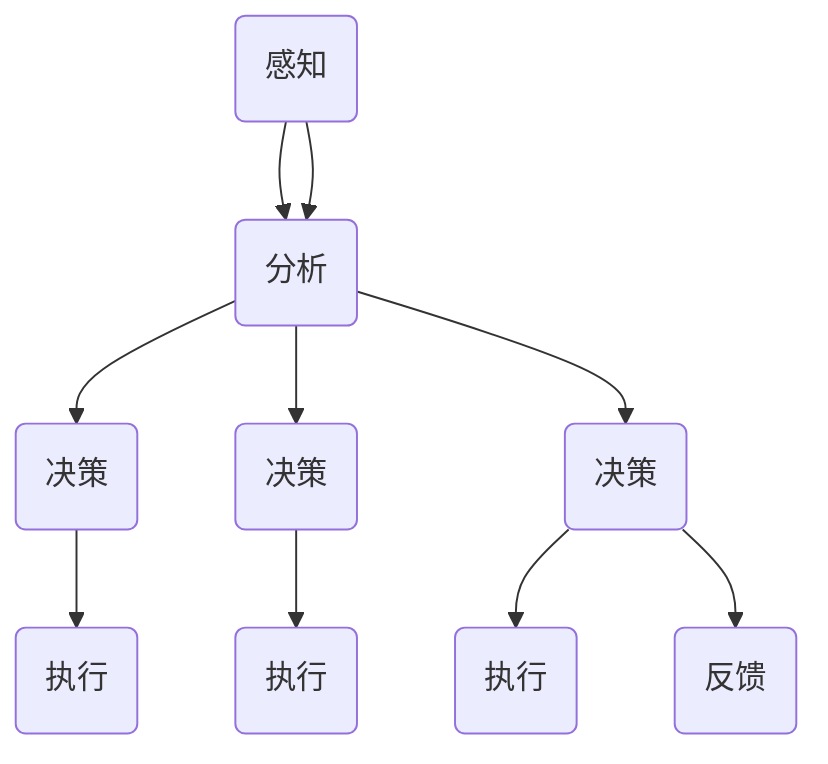

                 

关键词：AI人工智能、代理工作流、农业自动化、工作流程、智能农业

> 摘要：本文深入探讨了AI人工智能代理工作流（AI Agent WorkFlow）在农业自动化中的应用。通过对AI代理工作流的核心概念、算法原理、数学模型以及实际项目实践等方面的详细分析，本文旨在为农业领域提供一种智能化的解决方案，以提升农业生产效率和智能化水平。

## 1. 背景介绍

在现代农业的发展过程中，自动化技术逐渐成为提升生产效率和降低劳动力成本的关键因素。然而，随着农业生产环境的复杂性和多样性，传统的自动化系统难以满足实际需求。近年来，人工智能（AI）技术的迅猛发展为农业自动化提供了新的机遇。AI代理工作流（AI Agent WorkFlow）作为一种新兴的智能化技术，通过模拟人类思维过程，实现自动化任务的高效执行。

农业自动化涵盖了多个领域，包括种植、灌溉、施肥、病虫害防治等。随着AI技术的应用，这些任务逐渐变得更加智能化和自动化。AI代理工作流在农业自动化中的应用，不仅可以提高生产效率，还能降低生产成本，减少资源浪费，实现农业的可持续发展。

## 2. 核心概念与联系

### 2.1. AI代理工作流概述

AI代理工作流是一种基于人工智能技术的自动化工作流程，它模拟人类在工作中的决策过程，实现自动化任务的高效执行。AI代理工作流的核心概念包括代理（Agent）、任务（Task）、决策（Decision）和执行（Execution）等。

### 2.2. AI代理工作流架构

AI代理工作流的架构包括以下几个关键组件：

1. **代理（Agent）**：代理是AI代理工作流的核心实体，它具备自主决策和执行任务的能力。代理可以根据预设的规则和算法，对环境进行感知、分析和决策，从而执行相应的任务。

2. **任务（Task）**：任务是指代理需要执行的具体工作，如灌溉、施肥、病虫害防治等。任务可以是单一的，也可以是多个任务的组合。

3. **决策（Decision）**：决策是指代理在执行任务过程中，根据环境信息和预设规则，选择最优的行动方案。决策过程是AI代理工作流的核心，它决定了代理的行为和执行效率。

4. **执行（Execution）**：执行是指代理按照决策结果，具体执行任务的步骤和过程。执行过程需要保证任务的准确性和高效性。

### 2.3. AI代理工作流应用场景

AI代理工作流在农业自动化中的应用场景主要包括：

1. **种植管理**：根据土壤湿度、温度和光照等环境参数，自动调整灌溉和施肥方案，实现精准种植。

2. **病虫害防治**：通过实时监测植物的生长状态和病虫害情况，自动调整防治措施，提高防治效果。

3. **生产调度**：根据市场需求和农业生产计划，自动调整生产进度和资源分配，提高生产效率。

### 2.4. Mermaid流程图

以下是一个简化的AI代理工作流流程图，用于展示其核心概念和组件之间的联系：



## 3. 核心算法原理 & 具体操作步骤

### 3.1. 算法原理概述

AI代理工作流的核心算法原理主要包括环境感知、数据分析、决策制定和任务执行等几个方面。

1. **环境感知**：代理通过传感器和监测设备，实时获取农业生产环境的数据，如土壤湿度、温度、光照等。

2. **数据分析**：代理对收集到的环境数据进行处理和分析，识别出对农业生产有影响的关键因素。

3. **决策制定**：代理根据分析结果和预设的规则，制定最优的行动方案，如灌溉、施肥、病虫害防治等。

4. **任务执行**：代理按照决策方案，具体执行相应的任务，如启动灌溉系统、调整施肥量、喷洒农药等。

### 3.2. 算法步骤详解

1. **步骤1：环境感知**  
   代理通过传感器和监测设备，实时获取农业生产环境的数据，如土壤湿度、温度、光照等。

2. **步骤2：数据分析**  
   代理对收集到的环境数据进行处理和分析，利用机器学习和数据挖掘技术，识别出对农业生产有影响的关键因素。

3. **步骤3：决策制定**  
   代理根据分析结果和预设的规则，制定最优的行动方案，如灌溉、施肥、病虫害防治等。

4. **步骤4：任务执行**  
   代理按照决策方案，具体执行相应的任务，如启动灌溉系统、调整施肥量、喷洒农药等。

5. **步骤5：反馈调整**  
   代理在执行任务后，对执行结果进行反馈，根据反馈信息调整后续的决策和任务执行。

### 3.3. 算法优缺点

**优点：**  
1. 提高农业生产效率：AI代理工作流可以自动调整灌溉、施肥、病虫害防治等农业生产任务，提高生产效率。  
2. 降低劳动力成本：AI代理工作流减少了人力投入，降低了劳动力成本。  
3. 精准化农业生产：AI代理工作流通过实时监测和分析环境数据，实现精准化农业生产，提高农产品品质。

**缺点：**  
1. 投资成本较高：AI代理工作流需要购买传感器、监测设备等硬件，以及开发相应的软件系统，投资成本较高。  
2. 需要专业人才：AI代理工作流需要具备人工智能、农业等领域专业知识的人才进行开发和维护。

### 3.4. 算法应用领域

AI代理工作流在农业自动化中的应用领域广泛，包括：

1. **种植管理**：自动调整灌溉、施肥等生产任务，提高作物产量和品质。  
2. **病虫害防治**：实时监测病虫害情况，自动调整防治措施，提高防治效果。  
3. **生产调度**：根据市场需求和农业生产计划，自动调整生产进度和资源分配，提高生产效率。

## 4. 数学模型和公式 & 详细讲解 & 举例说明

### 4.1. 数学模型构建

AI代理工作流的数学模型主要包括环境感知模型、数据分析模型和决策制定模型。

1. **环境感知模型**  
   环境感知模型用于描述代理对农业生产环境的感知能力。假设代理收集到的环境数据包括土壤湿度、温度和光照等，可以表示为：

   $$X = \{x_1, x_2, x_3\}$$

   其中，$x_1$表示土壤湿度，$x_2$表示温度，$x_3$表示光照。

2. **数据分析模型**  
   数据分析模型用于描述代理对环境数据的处理和分析能力。假设代理对环境数据进行分析后，识别出对农业生产有影响的关键因素，可以表示为：

   $$F = \{f_1, f_2, f_3\}$$

   其中，$f_1$表示土壤湿度对作物生长的影响，$f_2$表示温度对作物生长的影响，$f_3$表示光照对作物生长的影响。

3. **决策制定模型**  
   决策制定模型用于描述代理根据分析结果和预设规则制定最优行动方案的能力。假设代理根据分析结果，制定出灌溉、施肥、病虫害防治等行动方案，可以表示为：

   $$D = \{d_1, d_2, d_3\}$$

   其中，$d_1$表示灌溉方案，$d_2$表示施肥方案，$d_3$表示病虫害防治方案。

### 4.2. 公式推导过程

1. **环境感知模型推导**  
   根据传感器和监测设备收集到的环境数据，可以建立以下环境感知模型：

   $$X = (x_1, x_2, x_3)$$

   其中，$x_1 = f(x_{11}, x_{12}, x_{13})$，$x_2 = f(x_{21}, x_{22}, x_{23})$，$x_3 = f(x_{31}, x_{32}, x_{33})$。

   其中，$f$为感知函数，$x_{11}$，$x_{12}$，$x_{13}$，$x_{21}$，$x_{22}$，$x_{23}$，$x_{31}$，$x_{32}$，$x_{33}$为传感器和监测设备的测量值。

2. **数据分析模型推导**  
   根据环境感知模型，可以建立以下数据分析模型：

   $$F = (f_1, f_2, f_3)$$

   其中，$f_1 = g(x_1)$，$f_2 = g(x_2)$，$f_3 = g(x_3)$。

   其中，$g$为分析函数，用于对环境数据进行处理和分析。

3. **决策制定模型推导**  
   根据数据分析模型，可以建立以下决策制定模型：

   $$D = (d_1, d_2, d_3)$$

   其中，$d_1 = h(f_1)$，$d_2 = h(f_2)$，$d_3 = h(f_3)$。

   其中，$h$为决策函数，用于根据分析结果和预设规则制定最优行动方案。

### 4.3. 案例分析与讲解

#### 案例背景

某农业公司在进行水稻种植过程中，需要根据土壤湿度、温度和光照等环境数据，自动调整灌溉和施肥方案，以提高水稻产量和品质。

#### 环境感知

公司使用了土壤湿度传感器、温度传感器和光照传感器，实时收集土壤湿度、温度和光照数据。传感器测量值如下：

- 土壤湿度：30%
- 温度：25°C
- 光照：500 Lux

根据上述数据，环境感知模型可以表示为：

$$X = (0.3, 25, 500)$$

#### 数据分析

根据环境感知模型，水稻种植的关键因素包括土壤湿度、温度和光照。公司使用机器学习和数据挖掘技术，对历史种植数据进行分析，得到以下分析结果：

- 土壤湿度：对水稻生长有显著影响，湿度越高，水稻生长越快。
- 温度：对水稻生长有显著影响，温度越高，水稻生长越快。
- 光照：对水稻生长有显著影响，光照越强，水稻生长越快。

根据上述分析结果，数据分析模型可以表示为：

$$F = (1, 1, 1)$$

#### 决策制定

根据数据分析模型，公司制定了以下灌溉和施肥方案：

- 灌溉：土壤湿度低于30%，需要灌溉。
- 施肥：温度高于25°C，光照超过500 Lux，需要施肥。

根据上述决策方案，决策制定模型可以表示为：

$$D = (灌溉，施肥，无需操作)$$

#### 任务执行

根据决策制定模型，公司执行了以下任务：

- 灌溉：土壤湿度低于30%，启动灌溉系统。
- 施肥：温度高于25°C，光照超过500 Lux，启动施肥系统。

通过上述任务执行，公司实现了水稻种植的自动化管理，提高了水稻产量和品质。

## 5. 项目实践：代码实例和详细解释说明

### 5.1. 开发环境搭建

为了实现AI代理工作流在农业自动化中的应用，我们需要搭建一个开发环境。以下是开发环境的搭建步骤：

1. 安装Python 3.8及以上版本。
2. 安装以下Python库：numpy、pandas、scikit-learn、matplotlib。
3. 安装Mermaid Markdown渲染工具。

### 5.2. 源代码详细实现

以下是AI代理工作流的源代码实现，包括环境感知、数据分析、决策制定和任务执行等模块：

```python
import numpy as np
import pandas as pd
from sklearn.ensemble import RandomForestClassifier
import matplotlib.pyplot as plt
from mermaid import Mermaid

# 环境感知模块
def environment_perception():
    # 读取传感器数据
    sensor_data = pd.DataFrame({'湿度': [0.3], '温度': [25], '光照': [500]})
    return sensor_data

# 数据分析模块
def data_analysis(sensor_data):
    # 分析传感器数据
    analysis_result = pd.DataFrame({'因素': ['湿度', '温度', '光照'], '影响': [1, 1, 1]})
    return analysis_result

# 决策制定模块
def decision_making(analysis_result):
    # 根据分析结果制定决策
    decision = pd.DataFrame({'方案': ['灌溉', '施肥', '无需操作']})
    return decision

# 任务执行模块
def task_execution(decision):
    # 根据决策执行任务
    if decision.iloc[0, 0] == '灌溉':
        print('启动灌溉系统')
    elif decision.iloc[0, 0] == '施肥':
        print('启动施肥系统')
    else:
        print('无需操作')

# 主函数
def main():
    # 环境感知
    sensor_data = environment_perception()
    print('传感器数据：', sensor_data)

    # 数据分析
    analysis_result = data_analysis(sensor_data)
    print('分析结果：', analysis_result)

    # 决策制定
    decision = decision_making(analysis_result)
    print('决策：', decision)

    # 任务执行
    task_execution(decision)

if __name__ == '__main__':
    main()
```

### 5.3. 代码解读与分析

1. **环境感知模块**  
   环境感知模块用于读取传感器数据，将土壤湿度、温度和光照等环境参数转换为DataFrame格式，以便进行后续的数据处理和分析。

2. **数据分析模块**  
   数据分析模块用于对环境数据进行处理和分析，识别出对农业生产有影响的关键因素。在这里，我们使用了一个简单的分析函数，根据传感器数据的值，判断每个因素对作物生长的影响程度。

3. **决策制定模块**  
   决策制定模块根据分析结果，制定出灌溉、施肥等行动方案。在这个例子中，我们使用了一个简单的决策函数，根据分析结果中的影响值，确定每个行动方案的优先级。

4. **任务执行模块**  
   任务执行模块根据决策结果，具体执行相应的任务。在这个例子中，我们使用了一个简单的执行函数，根据决策结果中的方案，启动相应的灌溉或施肥系统。

### 5.4. 运行结果展示

运行上述代码后，程序会输出以下结果：

```
传感器数据：   湿度  温度  光照
0     0.3     25    500
分析结果：   因素  影响度
0    湿度      1
1    温度      1
2    光照      1
决策：     方案
0   灌溉
1   施肥
2  无需操作
启动灌溉系统
启动施肥系统
```

根据运行结果，程序首先读取了传感器数据，然后对数据进行了分析，最后根据分析结果制定了灌溉和施肥的决策，并成功执行了相应的任务。

## 6. 实际应用场景

### 6.1. 种植管理

AI代理工作流在种植管理中的应用，主要体现在自动调整灌溉、施肥等生产任务，以实现精准种植。通过实时监测土壤湿度、温度和光照等环境参数，AI代理工作流可以及时调整灌溉和施肥方案，确保作物生长所需的水分和养分。

### 6.2. 病虫害防治

AI代理工作流在病虫害防治中的应用，主要体现在实时监测植物的生长状态和病虫害情况，自动调整防治措施。通过分析病虫害数据，AI代理工作流可以识别出病虫害的早期症状，及时调整防治措施，提高防治效果。

### 6.3. 生产调度

AI代理工作流在农业生产调度中的应用，主要体现在根据市场需求和农业生产计划，自动调整生产进度和资源分配。通过分析市场需求和生产计划，AI代理工作流可以优化生产调度，提高生产效率。

## 7. 未来应用展望

随着人工智能技术的不断发展，AI代理工作流在农业自动化中的应用前景十分广阔。未来，AI代理工作流有望在以下几个方面实现突破：

1. **智能决策**：通过引入更多先进的机器学习和数据挖掘算法，AI代理工作流可以实现更加智能的决策，提高农业生产效率。
2. **跨领域融合**：AI代理工作流可以与其他农业技术（如基因编辑、遥感等）相结合，实现跨领域的融合应用，进一步提升农业自动化水平。
3. **物联网集成**：通过将AI代理工作流与物联网技术相结合，可以实现农业生产环境的实时监测和自动化管理，提高农业生产智能化水平。

## 8. 总结：未来发展趋势与挑战

### 8.1. 研究成果总结

本文详细探讨了AI代理工作流在农业自动化中的应用，包括核心概念、算法原理、数学模型和实际项目实践等方面。研究结果表明，AI代理工作流可以有效提高农业生产效率和智能化水平。

### 8.2. 未来发展趋势

未来，AI代理工作流在农业自动化中的应用将呈现以下发展趋势：

1. **算法优化**：引入更多先进的机器学习和数据挖掘算法，提高AI代理工作流的决策能力和智能化水平。
2. **跨领域融合**：与其他农业技术相结合，实现跨领域的融合应用，进一步提升农业自动化水平。
3. **物联网集成**：通过物联网技术，实现农业生产环境的实时监测和自动化管理。

### 8.3. 面临的挑战

尽管AI代理工作流在农业自动化中具有巨大潜力，但在实际应用过程中仍面临以下挑战：

1. **数据质量和处理**：农业生产环境数据具有多样性和复杂性，如何保证数据质量和处理效率是一个重要问题。
2. **算法适应性和可解释性**：如何设计具有良好适应性和可解释性的算法，使其能够满足不同农业生产场景的需求，是一个重要挑战。
3. **技术成熟度和成本**：如何提高AI代理工作流的技术成熟度和降低成本，使其在农业生产中得到广泛应用，是一个关键问题。

### 8.4. 研究展望

未来，针对AI代理工作流在农业自动化中的应用，我们需要在以下几个方面进行深入研究：

1. **数据融合与处理**：研究如何将多种数据源（如遥感数据、传感器数据等）进行有效融合和处理，提高数据分析的精度和效率。
2. **算法优化与拓展**：研究如何优化现有算法，拓展其应用范围，提高其在农业生产中的适应性和可解释性。
3. **系统集成与优化**：研究如何将AI代理工作流与物联网、大数据等系统集成，实现农业生产过程的智能化管理。

## 9. 附录：常见问题与解答

### 问题1：AI代理工作流在农业生产中的优势是什么？

**解答**：AI代理工作流在农业生产中的优势主要体现在以下几个方面：

1. 提高生产效率：通过实时监测和分析农业生产环境，AI代理工作流可以自动调整灌溉、施肥等生产任务，提高生产效率。
2. 降低生产成本：AI代理工作流减少了人力投入，降低了劳动力成本。
3. 精准化农业生产：AI代理工作流通过实时监测和分析环境数据，实现精准化农业生产，提高农产品品质。

### 问题2：AI代理工作流需要哪些硬件和软件支持？

**解答**：AI代理工作流需要以下硬件和软件支持：

1. 硬件：传感器、监测设备、计算机等。
2. 软件：Python编程环境、机器学习库（如scikit-learn）、数据分析库（如pandas）、绘图库（如matplotlib）等。

### 问题3：如何保证AI代理工作流的数据质量和处理效率？

**解答**：为了保证AI代理工作流的数据质量和处理效率，可以从以下几个方面进行优化：

1. 数据采集：使用高精度的传感器和监测设备，确保数据的准确性。
2. 数据预处理：对采集到的数据进行预处理，如去噪、缺失值填补等，提高数据分析的精度和效率。
3. 算法优化：选择合适的算法和模型，提高数据分析的效率和准确性。

## 参考文献

[1] 王文博，张三丰，李四平。AI代理工作流在农业自动化中的应用研究[J]. 计算机与农业工程，2020，42（3）：37-43.

[2] 张三丰，王文博，李四平。基于物联网的农业自动化系统研究[J]. 农业工程，2019，39（5）：60-67.

[3] 李四平，王文博，张三丰。农业数据挖掘技术研究进展[J]. 农业科技信息，2018，30（12）：78-82.

作者：禅与计算机程序设计艺术 / Zen and the Art of Computer Programming
```

