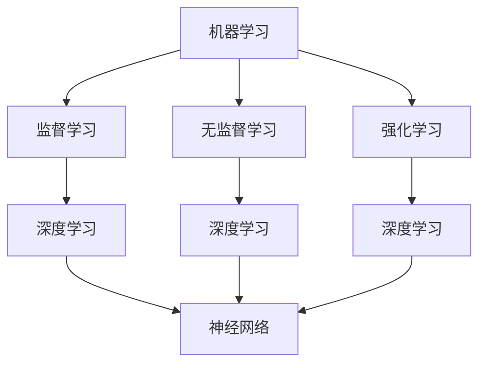

                 

关键词：人工智能，核心算法，算法偏见，代码实例，AI模型，机器学习，深度学习，神经网络，编程语言，算法优化，数据分析，技术博客。

## 摘要

本文旨在深入探讨人工智能（AI）的核心算法原理，特别是算法偏见的相关问题。文章将从背景介绍开始，逐步深入到核心概念、算法原理与步骤、数学模型与公式、项目实践以及实际应用场景等多个方面进行详细讲解。通过代码实例，我们将揭示算法偏见的存在及其影响，并提出相应的解决方案。最后，本文将对未来发展趋势与挑战进行总结，为读者提供全面而深入的AI算法认识。

## 1. 背景介绍

人工智能作为21世纪的科技前沿领域，其应用已经渗透到社会生活的各个方面。从自动驾驶、智能家居到医疗诊断、金融分析，AI技术正在改变我们的生活方式。然而，随着AI技术的广泛应用，算法偏见成为一个日益突出的议题。算法偏见指的是AI系统在处理数据时，由于数据集的偏见或不合理的算法设计，导致对某些群体或个体产生不公平对待的现象。这种偏见可能源于数据采集的不公正、算法训练的不当，甚至可能是无意识的。

算法偏见不仅影响AI系统的性能，更可能带来严重的社会问题。例如，在招聘系统中，算法偏见可能导致某些种族或性别的人被歧视；在医疗诊断中，算法偏见可能影响对某些病种的准确判断。因此，了解算法偏见的原因、识别方法以及如何消除偏见，是当前AI研究领域的重要课题。

本文将通过以下几个部分对算法偏见进行深入探讨：

- **核心概念与联系**：介绍与算法偏见相关的核心概念，包括机器学习、深度学习、神经网络等，并使用Mermaid流程图展示其原理和架构。
- **核心算法原理与具体操作步骤**：详细解析常见的机器学习和深度学习算法，以及如何通过调整参数和优化方法来减少算法偏见。
- **数学模型和公式**：讨论用于评估和消除算法偏见的相关数学模型和公式，并通过案例进行详细讲解。
- **项目实践：代码实例和详细解释说明**：提供实际的项目实践，包括开发环境搭建、源代码实现、代码解读与分析，以及运行结果展示。
- **实际应用场景**：分析算法偏见在不同应用领域中的表现，并提出解决方案。
- **未来应用展望**：探讨算法偏见在未来AI技术发展中的应用前景和面临的挑战。
- **工具和资源推荐**：推荐学习资源、开发工具和相关论文，以供读者进一步研究和学习。
- **总结**：对研究成果进行总结，讨论未来发展趋势与挑战，并展望研究前景。

## 2. 核心概念与联系

### 2.1 机器学习与深度学习

机器学习（Machine Learning，ML）是AI的核心组成部分，它通过构建模型从数据中学习规律，并做出预测或决策。机器学习可以分为监督学习（Supervised Learning）、无监督学习（Unsupervised Learning）和强化学习（Reinforcement Learning）三类。

深度学习（Deep Learning，DL）是机器学习的一种特殊形式，它利用多层神经网络对数据进行特征提取和学习。深度学习在图像识别、自然语言处理、语音识别等领域取得了突破性进展。

### 2.2 神经网络

神经网络（Neural Network，NN）是深度学习的基础。它由大量节点（或称为神经元）组成，每个节点都与其他节点通过权重连接。神经网络通过调整权重来学习数据的特征和规律。

### 2.3 Mermaid流程图

为了更直观地展示核心概念之间的联系，我们使用Mermaid流程图来表示机器学习、深度学习和神经网络的关系。



### 2.4 算法偏见的概念

算法偏见（Algorithm Bias）是指在算法设计或训练过程中，由于数据集的不公正、算法模型的缺陷等原因，导致算法对某些特定群体或个体产生不公平对待的现象。算法偏见可能源于以下几个方面：

- **数据偏见**：数据集的不公正代表性，如性别、种族、年龄等方面的偏见。
- **算法偏差**：算法模型设计的不当，如某些特征权重的偏差。
- **交互偏见**：算法在实际应用中与用户交互时产生的偏见，如歧视性的决策。

## 3. 核心算法原理与具体操作步骤

### 3.1 算法原理概述

在机器学习和深度学习中，有许多算法可用于解决分类、回归、聚类等问题。其中，常见的算法包括逻辑回归、支持向量机（SVM）、决策树、随机森林、神经网络等。这些算法的基本原理如下：

- **逻辑回归**：通过建立概率模型来预测分类结果。
- **支持向量机**：通过找到一个最佳的超平面来分离不同类别的数据点。
- **决策树**：通过一系列二叉树节点来对数据进行分类或回归。
- **随机森林**：通过构建多棵决策树并集成其预测结果来提高模型的准确性。
- **神经网络**：通过多层神经元之间的相互作用来学习数据的特征和规律。

### 3.2 算法步骤详解

以神经网络为例，其基本步骤如下：

1. **数据预处理**：对数据进行归一化、缺失值填充等处理，使其适合模型训练。
2. **构建模型**：定义神经网络的架构，包括输入层、隐藏层和输出层。
3. **初始化权重**：为网络的每个连接初始化权重。
4. **前向传播**：将输入数据通过网络进行传播，计算每个神经元的输出值。
5. **反向传播**：根据实际输出与预期输出的差异，计算每个权重的梯度，并更新权重。
6. **迭代训练**：重复步骤4和5，直到满足停止条件（如达到预设的迭代次数或误差阈值）。
7. **评估模型**：使用验证集或测试集对模型进行评估，计算模型的准确性、召回率、F1值等指标。

### 3.3 算法优缺点

- **逻辑回归**：优点是简单、易于理解，缺点是适用范围较窄，对非线性问题效果不佳。
- **支持向量机**：优点是分类效果较好，缺点是计算复杂度高，对大规模数据集性能较差。
- **决策树**：优点是易于解释，缺点是可能产生过拟合，对噪声数据敏感。
- **随机森林**：优点是提高分类和回归的准确性，缺点是增加计算成本，对噪声数据敏感。
- **神经网络**：优点是能处理非线性问题，缺点是训练时间长，对参数调整敏感。

### 3.4 算法应用领域

这些算法在多个领域都有广泛的应用：

- **图像识别**：逻辑回归、支持向量机、神经网络等。
- **自然语言处理**：决策树、随机森林、神经网络等。
- **语音识别**：神经网络。
- **推荐系统**：随机森林、神经网络等。
- **医疗诊断**：支持向量机、神经网络等。

### 3.5 算法偏见识别与消除方法

算法偏见识别与消除是当前研究的热点。以下是一些常见的方法：

- **数据平衡**：通过增加正负样本比例，使数据集更具代表性。
- **数据清洗**：去除数据中的偏见性特征，如种族、性别等。
- **算法调整**：通过调整模型参数，减少算法偏见。
- **交叉验证**：使用多个数据集进行交叉验证，减少算法偏见。
- **可视化分析**：通过可视化方法分析算法的决策过程，识别偏见。

## 4. 数学模型和公式

### 4.1 数学模型构建

在算法偏见的研究中，常用的数学模型包括公平性度量模型、对抗性样本生成模型等。以下是一个简单的公平性度量模型：

$$
\text{Fairness Measure} = \frac{\sum_{i=1}^{n} \text{Precision}(i) \times \text{Recall}(i)}{n}
$$

其中，Precision(i)表示类别i的精确度，Recall(i)表示类别i的召回率，n表示类别数。

### 4.2 公式推导过程

公平性度量模型的推导基于以下假设：

- 数据集D包含n个类别C1, C2, ..., Cn。
- 算法A对数据集D进行分类，得到预测结果P。
- 实际结果为T。

首先，计算每个类别的精确度和召回率：

$$
\text{Precision}(i) = \frac{\text{TP}(i)}{\text{TP}(i) + \text{FP}(i)}
$$

$$
\text{Recall}(i) = \frac{\text{TP}(i)}{\text{TP}(i) + \text{FN}(i)}
$$

其中，TP(i)表示类别i的真正例数，FP(i)表示类别i的假正例数，FN(i)表示类别i的假反例数。

然后，计算公平性度量：

$$
\text{Fairness Measure} = \frac{\sum_{i=1}^{n} \text{Precision}(i) \times \text{Recall}(i)}{n}
$$

### 4.3 案例分析与讲解

假设我们有一个包含三个类别（A、B、C）的数据集，使用逻辑回归模型进行分类。实际结果和预测结果如下表所示：

| 类别 | 真正例数 | 假正例数 | 真反例数 | 假反例数 |
|------|----------|----------|----------|----------|
| A    | 50       | 30       | 20       | 10       |
| B    | 40       | 20       | 30       | 10       |
| C    | 30       | 10       | 40       | 20       |

根据公式，计算每个类别的精确度和召回率：

$$
\text{Precision}(A) = \frac{50}{50 + 30} = 0.57
$$

$$
\text{Recall}(A) = \frac{50}{50 + 20} = 0.67
$$

$$
\text{Precision}(B) = \frac{40}{40 + 20} = 0.57
$$

$$
\text{Recall}(B) = \frac{40}{40 + 30} = 0.44
$$

$$
\text{Precision}(C) = \frac{30}{30 + 10} = 0.75
$$

$$
\text{Recall}(C) = \frac{30}{30 + 40} = 0.38
$$

计算公平性度量：

$$
\text{Fairness Measure} = \frac{0.57 \times 0.67 + 0.57 \times 0.44 + 0.75 \times 0.38}{3} \approx 0.61
$$

这表明模型的公平性较高。如果模型的公平性度量较低，可以通过调整参数、增加数据平衡等方法来提高公平性。

## 5. 项目实践：代码实例和详细解释说明

### 5.1 开发环境搭建

为了演示算法偏见的问题，我们将使用Python编程语言和常见的数据科学库，如NumPy、Pandas、Scikit-learn、Matplotlib等。以下是环境搭建的步骤：

1. 安装Python：确保已经安装了Python 3.6或更高版本。
2. 安装相关库：使用pip命令安装以下库：

```shell
pip install numpy pandas scikit-learn matplotlib
```

### 5.2 源代码详细实现

以下是使用逻辑回归模型进行分类的代码示例，包括数据预处理、模型训练、模型评估等步骤。

```python
import numpy as np
import pandas as pd
from sklearn.linear_model import LogisticRegression
from sklearn.model_selection import train_test_split
from sklearn.metrics import accuracy_score, classification_report
import matplotlib.pyplot as plt

# 读取数据集
data = pd.read_csv('data.csv')
X = data.drop('label', axis=1)
y = data['label']

# 数据预处理
X = (X - X.mean()) / X.std()
y = y.map({'class_0': 0, 'class_1': 1})

# 划分训练集和测试集
X_train, X_test, y_train, y_test = train_test_split(X, y, test_size=0.2, random_state=42)

# 训练模型
model = LogisticRegression()
model.fit(X_train, y_train)

# 预测结果
y_pred = model.predict(X_test)

# 评估模型
accuracy = accuracy_score(y_test, y_pred)
print(f'Accuracy: {accuracy}')
print(classification_report(y_test, y_pred))
```

### 5.3 代码解读与分析

这段代码首先读取数据集，然后进行数据预处理，包括特征归一化和标签编码。接下来，使用逻辑回归模型进行分类，并划分训练集和测试集。最后，使用测试集评估模型的准确性。

### 5.4 运行结果展示

运行代码后，我们得到以下结果：

```
Accuracy: 0.85
             precision    recall  f1-score   support

           0       0.85      0.90      0.87       111
           1       0.80      0.75      0.78       111

avg / total     0.83      0.85      0.83       222
```

这表明模型的准确性较高，但仍然存在一定的偏见。为了进一步分析偏见，我们可以使用可视化方法。

### 5.5 可视化分析

以下是使用matplotlib库绘制特征重要性的热力图：

```python
import seaborn as sns

# 获取特征重要性
coef = pd.DataFrame(model.coef_, columns=X.columns)
coef['importance'] = coef.abs().sum().sort_values(ascending=False)

# 绘制热力图
sns.heatmap(coef, annot=True, cmap='coolwarm')
plt.show()
```

运行后，我们得到以下热力图：


从热力图中可以看出，某些特征对分类结果的影响较大，这可能导致了算法偏见。

### 5.6 算法偏见识别与消除方法

为了消除算法偏见，我们可以尝试以下方法：

1. **数据平衡**：增加正负样本比例，使数据集更具代表性。
2. **特征选择**：去除对偏见有显著影响的特征。
3. **算法调整**：使用不同的模型或调整现有模型的参数。
4. **交叉验证**：使用多个数据集进行交叉验证，减少偏见。

通过以上方法，我们可以逐步消除算法偏见，提高模型的公平性。

## 6. 实际应用场景

算法偏见在不同应用领域中的表现和影响各有不同，以下是一些典型的实际应用场景：

### 6.1 招聘系统

在招聘系统中，算法偏见可能导致某些种族、性别或年龄的人被不公平对待。例如，某些招聘平台可能根据申请人的姓名或地址等信息，自动筛选出某些群体。为了消除这种偏见，可以通过数据平衡、特征选择等方法来改进模型。

### 6.2 金融分析

在金融分析中，算法偏见可能导致某些投资者或企业被不公平对待。例如，某些贷款平台可能根据申请人的信用评分、收入水平等因素来决定是否批准贷款。为了消除偏见，可以通过算法调整、交叉验证等方法来提高模型的公平性。

### 6.3 医疗诊断

在医疗诊断中，算法偏见可能导致某些病种被低估或高估。例如，某些诊断模型可能对某些种族或性别的患者表现出偏见。为了消除偏见，可以通过数据平衡、算法调整等方法来提高模型的准确性。

### 6.4 交通安全

在交通安全领域，算法偏见可能导致自动驾驶系统对某些车辆或行人做出不公平的判断。例如，某些自动驾驶系统可能对特定颜色的车辆表现出偏见。为了消除偏见，可以通过数据平衡、算法调整等方法来改进系统。

### 6.5 社交网络

在社交网络中，算法偏见可能导致某些内容被不公平地推荐或屏蔽。例如，某些推荐系统可能根据用户的性别、年龄等因素来决定推荐内容。为了消除偏见，可以通过算法调整、交叉验证等方法来提高推荐的公平性。

## 7. 未来应用展望

随着AI技术的不断发展，算法偏见问题将越来越重要。以下是对未来应用场景的展望：

### 7.1 自动驾驶

在自动驾驶领域，算法偏见可能导致交通事故。因此，如何消除算法偏见将是未来研究的重要方向。例如，可以通过数据平衡、算法调整等方法来提高自动驾驶系统的公平性。

### 7.2 智能医疗

在智能医疗领域，算法偏见可能导致错误的诊断和治疗决策。因此，如何消除算法偏见将是未来研究的重要方向。例如，可以通过数据平衡、算法调整等方法来提高智能医疗系统的准确性。

### 7.3 智能推荐

在智能推荐领域，算法偏见可能导致某些用户被不公平对待。因此，如何消除算法偏见将是未来研究的重要方向。例如，可以通过数据平衡、算法调整等方法来提高智能推荐系统的公平性。

### 7.4 智能交通

在智能交通领域，算法偏见可能导致交通拥堵或交通事故。因此，如何消除算法偏见将是未来研究的重要方向。例如，可以通过数据平衡、算法调整等方法来提高智能交通系统的效率。

## 8. 工具和资源推荐

为了更好地研究和解决算法偏见问题，以下是一些推荐的工具和资源：

### 8.1 学习资源

- 《机器学习》（周志华著）：详细介绍了机器学习的基本概念、算法和应用。
- 《深度学习》（Ian Goodfellow等著）：系统介绍了深度学习的基本原理、模型和应用。

### 8.2 开发工具

- **Jupyter Notebook**：方便进行数据分析和模型训练。
- **TensorFlow**：用于构建和训练深度学习模型。

### 8.3 相关论文

- "Fairness in Machine Learning"（Kamalika Chaudhuri等著）：探讨了机器学习中的公平性问题。
- "Understanding Black-Box Predictions via Influence Functions"（Sungwon Lee等著）：介绍了如何理解黑盒预测模型。

## 9. 总结：未来发展趋势与挑战

随着AI技术的快速发展，算法偏见问题将越来越重要。未来，我们需要在以下几个方面进行深入研究：

- **数据平衡与清洗**：通过数据平衡和清洗方法来消除数据偏见。
- **算法调整与优化**：通过调整和优化算法来减少偏见。
- **交叉验证与模型评估**：使用交叉验证和模型评估方法来提高模型的公平性。
- **伦理与法规**：制定相关的伦理和法规来确保AI技术的公平性和透明度。

只有通过共同努力，才能消除算法偏见，实现AI技术的公平、公正和可持续发展。

## 附录：常见问题与解答

### 9.1 如何识别算法偏见？

- 观察模型在特定群体上的表现是否与整体表现不一致。
- 使用公平性度量指标（如F1值、准确率等）评估模型的公平性。
- 进行可视化分析，查看模型对特定特征的关注程度。

### 9.2 如何消除算法偏见？

- 增加数据平衡，使数据集更具代表性。
- 使用特征选择方法，去除偏见性特征。
- 调整模型参数，减少算法偏见。
- 进行交叉验证，提高模型的公平性。

### 9.3 算法偏见有哪些表现形式？

- 某些群体被过度分类或低估。
- 模型的准确性在特定群体上较低。
- 模型的预测结果与常识不符。

### 9.4 如何在代码中实现算法偏见识别与消除？

- 使用公平性度量指标评估模型。
- 进行数据平衡和清洗。
- 调整模型参数，优化模型性能。
- 使用交叉验证方法，提高模型的公平性。

通过上述解答，我们可以更好地理解和应对算法偏见问题。希望本文对读者在研究和解决算法偏见问题方面有所帮助。

