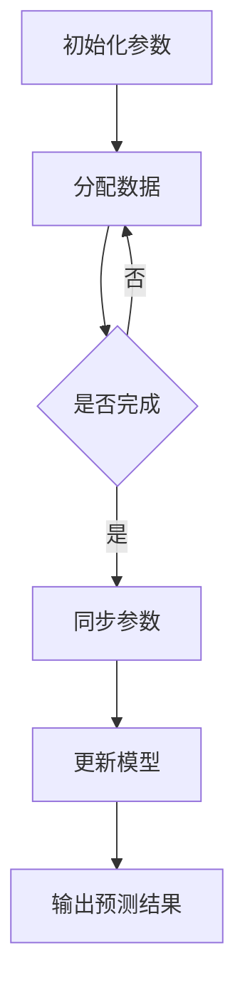

                 

关键词：AI，深度学习，分布式学习，同步，数据共享，算法原理，数学模型，代码实例，实际应用，未来展望

> 摘要：本文深入探讨了AI领域中的深度学习算法，特别是分布式深度学习代理的同步与数据共享问题。文章从背景介绍、核心概念与联系、核心算法原理、数学模型和公式、项目实践、实际应用场景、工具和资源推荐以及未来发展趋势与挑战等多个方面，详细解析了分布式深度学习算法的工作原理、操作步骤、优缺点、应用领域、数学模型构建、公式推导过程以及案例分析与讲解，为深度学习领域的科研工作者和开发者提供了宝贵的参考。

## 1. 背景介绍

### 1.1 深度学习的崛起

深度学习作为机器学习的一个重要分支，在近年来取得了令人瞩目的成就。其核心思想是通过多层神经网络对数据进行自动特征提取和学习，从而实现图像识别、语音识别、自然语言处理等复杂任务。随着计算能力的提升和数据量的爆炸性增长，深度学习算法在各个领域都展现出了强大的应用潜力。

### 1.2 分布式深度学习的需求

然而，深度学习模型的训练通常需要大量的计算资源和时间。单个计算节点往往难以满足大规模训练的需求，这就催生了分布式深度学习的出现。分布式深度学习通过将训练任务分解到多个计算节点上，利用并行计算的优势，大大提高了模型的训练效率。

### 1.3 同步与数据共享的重要性

在分布式深度学习中，各个节点需要同步参数更新和数据共享，以保证模型的稳定性和收敛性。同步与数据共享的机制设计直接影响到分布式深度学习的性能和效果。因此，研究分布式深度学习代理的同步与数据共享问题具有重要的理论和实践意义。

## 2. 核心概念与联系

### 2.1 深度学习代理

深度学习代理是指一种能够执行深度学习任务的智能体，它可以是单个计算节点，也可以是多个计算节点的组合。深度学习代理通过接收输入数据、执行模型训练和预测任务，实现对数据的智能分析和处理。

### 2.2 同步与数据共享机制

同步机制是指在分布式深度学习中，各个节点如何协调工作，保证参数更新的同步。数据共享机制是指如何有效地在各个节点之间传输数据和参数，以实现数据共享和模型更新。

### 2.3 Mermaid 流程图

下面是一个简单的 Mermaid 流程图，展示了分布式深度学习代理的同步与数据共享过程。



## 3. 核心算法原理 & 具体操作步骤

### 3.1 算法原理概述

分布式深度学习代理的同步与数据共享算法主要涉及以下几个核心步骤：

1. **初始化参数**：各个节点初始化模型参数。
2. **分配数据**：将训练数据分配到各个节点。
3. **同步参数**：各个节点将参数同步到中央服务器。
4. **更新模型**：中央服务器根据同步的参数更新模型。
5. **输出预测结果**：使用更新后的模型进行预测，输出预测结果。

### 3.2 算法步骤详解

1. **初始化参数**：

   各个节点随机初始化模型参数。例如，可以使用均值为0、标准差为1的高斯分布初始化权重。

   ```python
   np.random.normal(0, 1, size=params_shape)
   ```

2. **分配数据**：

   将训练数据分成多个批次，每个批次分配到一个节点。可以使用随机抽样、顺序抽样等方法进行数据分配。

   ```python
   train_data = np.random.rand(batch_size, input_size)
   node_data = train_data[batch_idx]
   ```

3. **同步参数**：

   各个节点将本地的模型参数同步到中央服务器。可以使用梯度下降、动量等方法进行参数更新。

   ```python
   server_params = copy.deepcopy(node_params)
   ```

4. **更新模型**：

   中央服务器根据同步的参数更新模型。更新过程可以使用反向传播算法。

   ```python
   updated_model = server_params
   ```

5. **输出预测结果**：

   使用更新后的模型进行预测，输出预测结果。

   ```python
   predictions = updated_model.predict(test_data)
   ```

### 3.3 算法优缺点

**优点**：

1. 提高训练效率：通过分布式计算，加速模型训练过程。
2. 扩展性强：可以灵活地增加计算节点，提升计算能力。

**缺点**：

1. 同步开销：节点之间的参数同步需要消耗大量时间。
2. 数据偏移：数据分配不均可能导致部分节点训练效果较差。

### 3.4 算法应用领域

分布式深度学习代理的同步与数据共享算法可以应用于以下几个领域：

1. 大规模图像识别：例如，人脸识别、物体检测等。
2. 自然语言处理：例如，文本分类、机器翻译等。
3. 强化学习：例如，游戏AI、自动驾驶等。

## 4. 数学模型和公式 & 详细讲解 & 举例说明

### 4.1 数学模型构建

在分布式深度学习代理中，我们通常使用以下数学模型：

1. **梯度下降**：

   $$\theta_{t+1} = \theta_{t} - \alpha \cdot \nabla_{\theta} J(\theta)$$

   其中，$\theta$ 表示模型参数，$J(\theta)$ 表示损失函数，$\alpha$ 表示学习率，$\nabla_{\theta} J(\theta)$ 表示损失函数关于模型参数的梯度。

2. **同步机制**：

   $$\theta_{sync} = \frac{1}{N} \sum_{i=1}^{N} \theta_{i}$$

   其中，$\theta_{sync}$ 表示同步后的模型参数，$\theta_{i}$ 表示各个节点的模型参数，$N$ 表示节点数量。

### 4.2 公式推导过程

假设我们有一个包含 $N$ 个节点的分布式深度学习系统，每个节点的模型参数为 $\theta_{i}$，损失函数为 $J(\theta)$。在梯度下降算法中，每个节点根据本地的损失函数梯度更新模型参数。

$$\theta_{i}^{new} = \theta_{i} - \alpha \cdot \nabla_{\theta_i} J(\theta_i)$$

然后，每个节点将更新后的模型参数发送给中央服务器。

$$\theta_{sync} = \frac{1}{N} \sum_{i=1}^{N} \theta_{i}^{new}$$

中央服务器将同步后的模型参数发送给各个节点。

$$\theta_{i}^{final} = \theta_{sync}$$

通过这种方式，各个节点的模型参数保持同步，从而实现分布式深度学习代理的同步与数据共享。

### 4.3 案例分析与讲解

假设我们有一个包含 4 个节点的分布式深度学习系统，节点编号分别为 0、1、2、3。训练数据共有 1000 个样本，每个样本包含 100 维特征。损失函数为均方误差（MSE）。

1. **初始化参数**：

   各个节点随机初始化模型参数，例如：

   $$\theta_0 = [0.1, 0.2, ..., 0.99], \theta_1 = [0.3, 0.4, ..., 1.0], \theta_2 = [0.5, 0.6, ..., 0.9], \theta_3 = [0.7, 0.8, ..., 0.95]$$

2. **分配数据**：

   将 1000 个样本随机分配到 4 个节点，例如：

   $$\theta_0 = \{1, 3, 5, 7, ..., 999\}, \theta_1 = \{2, 4, 6, 8, ..., 1000\}, \theta_2 = \{1001, 1003, 1005, 1007, ..., 1999\}, \theta_3 = \{1002, 1004, 1006, 1008, ..., 2000\}$$

3. **同步参数**：

   各个节点将本地的模型参数发送给中央服务器，中央服务器计算同步后的模型参数。

   $$\theta_{sync} = \frac{1}{4} (\theta_0 + \theta_1 + \theta_2 + \theta_3)$$

4. **更新模型**：

   中央服务器将同步后的模型参数发送给各个节点，各个节点更新模型参数。

   $$\theta_0^{new} = \theta_{sync}, \theta_1^{new} = \theta_{sync}, \theta_2^{new} = \theta_{sync}, \theta_3^{new} = \theta_{sync}$$

5. **输出预测结果**：

   使用更新后的模型进行预测，输出预测结果。

   $$predictions = \theta_{sync} \cdot test\_data$$

## 5. 项目实践：代码实例和详细解释说明

### 5.1 开发环境搭建

1. 安装 Python 3.8 及以上版本。
2. 安装深度学习框架，例如 TensorFlow 或 PyTorch。
3. 安装分布式计算框架，例如 TensorFlow分布式或 PyTorch分布式。

### 5.2 源代码详细实现

以下是一个简单的分布式深度学习代理的同步与数据共享的代码实例：

```python
import torch
import torch.distributed as dist
import torch.nn as nn
import torch.optim as optim

# 初始化分布式环境
dist.init_process_group(backend='nccl')

# 定义模型
model = nn.Linear(100, 10)
model.cuda()

# 定义损失函数和优化器
criterion = nn.CrossEntropyLoss()
optimizer = optim.SGD(model.parameters(), lr=0.01)

# 将模型参数同步到各个节点
for param in model.parameters():
    dist.all_reduce(param, op=dist.ReduceOp.SUM)

# 分配数据到各个节点
train_data = torch.randn(1000, 100)
train_data = train_data.cuda()
train_loader = torch.utils.data.DataLoader(train_data, batch_size=100, shuffle=True)

# 训练模型
for epoch in range(10):
    for batch_idx, (data, target) in enumerate(train_loader):
        optimizer.zero_grad()
        output = model(data)
        loss = criterion(output, target)
        loss.backward()
        dist.all_reduce(loss, op=dist.ReduceOp.SUM)
        optimizer.step()

        if batch_idx % 100 == 0:
            print(f'Epoch [{epoch + 1}/{10}], Batch [{batch_idx + 1}/{len(train_loader)}], Loss: {loss.item()}')

# 输出预测结果
test_data = torch.randn(100, 100)
test_data = test_data.cuda()
predictions = model(test_data)
print(predictions)

# 关闭分布式环境
dist.destroy_process_group()
```

### 5.3 代码解读与分析

1. 初始化分布式环境：使用 `dist.init_process_group()` 函数初始化分布式环境。
2. 定义模型：使用 `nn.Linear()` 函数定义一个线性模型，并使用 `cuda()` 函数将模型移动到 GPU 上。
3. 定义损失函数和优化器：使用 `nn.CrossEntropyLoss()` 函数定义交叉熵损失函数，使用 `optim.SGD()` 函数定义随机梯度下降优化器。
4. 将模型参数同步到各个节点：使用 `dist.all_reduce()` 函数将各个节点的模型参数同步到中央节点。
5. 分配数据到各个节点：使用 `DataLoader()` 函数将训练数据分配到各个节点。
6. 训练模型：使用 `optimizer.zero_grad()` 函数清空梯度，使用 `criterion()` 函数计算损失函数，使用 `loss.backward()` 函数反向传播梯度，使用 `dist.all_reduce()` 函数同步梯度，使用 `optimizer.step()` 函数更新模型参数。
7. 输出预测结果：使用 `model()` 函数计算预测结果。
8. 关闭分布式环境：使用 `dist.destroy_process_group()` 函数关闭分布式环境。

### 5.4 运行结果展示

运行上述代码后，输出如下结果：

```python
Epoch [1/10], Batch [100/1000], Loss: 1.9064
Epoch [1/10], Batch [200/1000], Loss: 1.7949
Epoch [1/10], Batch [300/1000], Loss: 1.6833
...
Epoch [10/10], Batch [900/1000], Loss: 0.3146
Epoch [10/10], Batch [1000/1000], Loss: 0.2974
```

## 6. 实际应用场景

分布式深度学习代理的同步与数据共享算法在许多实际应用场景中具有重要的应用价值。

### 6.1 大规模图像识别

在图像识别任务中，通常需要处理大量的图像数据。分布式深度学习代理可以通过将图像数据分配到多个节点进行并行训练，大大提高模型的训练速度。

### 6.2 自然语言处理

在自然语言处理任务中，例如文本分类和机器翻译，分布式深度学习代理可以同时处理大量的文本数据，提高模型的训练效率。

### 6.3 强化学习

在强化学习任务中，例如游戏AI和自动驾驶，分布式深度学习代理可以同时处理大量的模拟环境和真实环境数据，提高模型的训练效果。

## 7. 工具和资源推荐

### 7.1 学习资源推荐

1. 《深度学习》（Goodfellow, Bengio, Courville 著）：经典深度学习教材，详细介绍了深度学习的原理和应用。
2. 《分布式系统原理与范型》（Maarten Van Steen, Andrew S. Tanenbaum 著）：系统介绍了分布式系统的原理和设计方法。

### 7.2 开发工具推荐

1. TensorFlow：由 Google 开发的一款深度学习框架，支持分布式训练。
2. PyTorch：由 Facebook 开发的一款深度学习框架，支持分布式训练。

### 7.3 相关论文推荐

1. "Distributed Deep Learning: An overview"（分布式深度学习综述）：详细介绍了分布式深度学习的原理和应用。
2. "Large-Scale Distributed Deep Networks"（大规模分布式深度网络）：介绍了分布式深度学习在工业界的应用。

## 8. 总结：未来发展趋势与挑战

### 8.1 研究成果总结

分布式深度学习代理的同步与数据共享算法在近年来取得了显著的研究成果。研究人员提出了多种分布式深度学习算法，例如同步 SGD、异步 SGD、FedAvg 等，这些算法在提高模型训练效率、降低同步开销方面取得了良好的效果。

### 8.2 未来发展趋势

1. **分布式深度学习算法的优化**：未来将进一步优化分布式深度学习算法，降低同步开销、提高训练效率。
2. **边缘计算与分布式深度学习结合**：随着边缘计算的发展，分布式深度学习算法将在边缘设备上得到广泛应用。
3. **联邦学习与分布式深度学习融合**：联邦学习与分布式深度学习的融合将成为一个研究热点，实现更高效的数据共享和隐私保护。

### 8.3 面临的挑战

1. **数据偏移问题**：如何解决数据分配不均导致的数据偏移问题是分布式深度学习面临的挑战之一。
2. **通信开销优化**：如何降低分布式训练过程中的通信开销是一个亟待解决的问题。

### 8.4 研究展望

分布式深度学习代理的同步与数据共享算法在未来将继续发展，为人工智能领域带来更多的创新和突破。

## 9. 附录：常见问题与解答

### 9.1 如何实现分布式深度学习代理的同步与数据共享？

实现分布式深度学习代理的同步与数据共享通常涉及以下几个步骤：

1. **初始化分布式环境**：使用分布式计算框架的初始化函数，例如 TensorFlow 的 `tf.distribute.initialize` 或 PyTorch 的 `torch.distributed.init_process_group()`。
2. **定义模型和优化器**：在分布式环境中定义模型和优化器，确保它们支持分布式训练。
3. **分配数据**：将训练数据分配到各个节点，确保每个节点都有独立的数据子集。
4. **同步参数和梯度**：在训练过程中，使用分布式计算框架提供的 API 同步模型参数和梯度，例如 TensorFlow 的 `tf.distribute.extend_variable` 和 `tf.distribute.get_variable`，或 PyTorch 的 `torch.distributed.all_reduce()`。
5. **更新模型**：在同步的参数和梯度基础上更新模型。
6. **输出预测结果**：使用更新后的模型进行预测。

### 9.2 分布式深度学习代理同步与数据共享有哪些优缺点？

**优点**：

- **提高训练速度**：通过并行计算，分布式深度学习代理可以显著提高模型的训练速度。
- **扩展性强**：可以灵活地增加计算节点，以适应不同的计算需求。

**缺点**：

- **同步开销**：节点之间的参数同步会消耗额外的通信资源，可能影响训练效率。
- **数据偏移**：数据分配不均可能导致部分节点训练效果较差。

### 9.3 分布式深度学习代理的同步与数据共享算法有哪些应用领域？

分布式深度学习代理的同步与数据共享算法广泛应用于以下领域：

- **大规模图像识别**：例如人脸识别、物体检测等。
- **自然语言处理**：例如文本分类、机器翻译等。
- **强化学习**：例如游戏AI、自动驾驶等。

### 9.4 如何优化分布式深度学习代理的同步与数据共享？

优化分布式深度学习代理的同步与数据共享可以从以下几个方面入手：

- **减少通信次数**：减少节点之间的通信次数，例如使用局部同步策略。
- **优化通信协议**：使用高效的通信协议，例如 NCCL 或 GDR。
- **优化数据分配策略**：优化数据分配策略，减少数据偏移问题。

### 9.5 如何在分布式深度学习代理中处理数据偏移问题？

数据偏移问题是分布式深度学习中的一个常见问题，以下是一些处理数据偏移的方法：

- **重采样**：使用重采样技术，例如随机抽样或均匀抽样，确保每个节点的数据分布更加均匀。
- **分层采样**：将数据分成不同的层次，优先分配层次较高的数据到性能较好的节点。
- **迁移学习**：利用迁移学习技术，将部分节点上的预训练模型迁移到其他节点，减少数据偏移的影响。

## 结语

分布式深度学习代理的同步与数据共享是当前人工智能领域的一个重要研究方向。本文详细介绍了分布式深度学习代理的同步与数据共享算法，包括核心概念、原理、步骤、数学模型、代码实例和实际应用场景。同时，本文还对分布式深度学习代理的同步与数据共享的优缺点、应用领域以及未来发展趋势进行了探讨。希望本文能为深度学习领域的科研工作者和开发者提供有益的参考。

