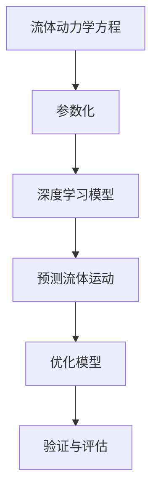

                 

关键词：人工智能，深度学习，流体动力学，算法应用，数学模型

> 摘要：本文深入探讨了人工智能中的深度学习算法在流体动力学领域的应用，分析了当前研究现状，提出了核心概念与联系，并详细介绍了算法原理、数学模型、项目实践以及未来展望，为相关领域的研究提供了参考。

## 1. 背景介绍

流体动力学作为研究流体运动及其与周围环境的相互作用的学科，在航空航天、海洋工程、生物医学等多个领域都有着广泛的应用。然而，随着问题的复杂度增加，传统的数值模拟方法往往难以满足需求。人工智能，特别是深度学习算法，为解决这一问题提供了新的可能。

深度学习算法，特别是卷积神经网络（CNN）和递归神经网络（RNN），已经在图像识别、语音识别等计算机视觉和自然语言处理领域取得了巨大的成功。然而，将深度学习应用于流体动力学的研究还相对较少。本文旨在探讨如何将深度学习算法应用于流体动力学中，以解决复杂的流体运动问题。

## 2. 核心概念与联系

### 2.1 核心概念

在流体动力学中，核心概念包括流体的连续性方程、动量方程和能量方程。这些方程描述了流体在空间和时间上的运动状态。

深度学习中的核心概念包括神经网络、激活函数、损失函数和优化算法。神经网络由多层神经元组成，通过学习输入数据与输出数据之间的关系，实现对未知数据的预测。

### 2.2 核心概念联系

流体动力学中的方程可以通过深度学习算法进行参数化，从而构建出一个能够模拟流体运动的模型。例如，连续性方程可以表示为：

\[ \frac{\partial \rho}{\partial t} + \nabla \cdot (\rho \mathbf{v}) = 0 \]

其中，\(\rho\) 是流体密度，\(\mathbf{v}\) 是流体速度。我们可以通过卷积神经网络学习得到流体的速度场，从而实现对流体密度的预测。

### 2.3 Mermaid 流程图



## 3. 核心算法原理 & 具体操作步骤

### 3.1 算法原理概述

深度学习算法在流体动力学中的应用，主要是通过构建一个能够学习流体运动规律的神经网络模型。该模型可以通过学习大量已知的流体运动数据，实现对未知流体运动的预测。

### 3.2 算法步骤详解

1. 数据收集：收集大量流体运动的实验数据，包括流体的速度场、密度场等。
2. 数据预处理：对收集到的数据进行标准化处理，使其符合神经网络模型的输入要求。
3. 构建模型：使用卷积神经网络或递归神经网络，构建一个能够学习流体运动规律的模型。
4. 模型训练：使用收集到的数据，对模型进行训练，以优化模型参数。
5. 模型评估：使用未参与训练的数据，对模型进行评估，以验证模型的预测能力。
6. 模型应用：将训练好的模型应用于实际的流体运动问题，进行预测和优化。

### 3.3 算法优缺点

**优点**：

- 能够处理复杂、高维的数据，适合流体动力学中的问题。
- 可以通过大量数据进行训练，提高模型的预测精度。

**缺点**：

- 需要大量的训练数据，对数据质量要求较高。
- 模型的解释性较差，难以理解模型的具体工作原理。

### 3.4 算法应用领域

深度学习算法在流体动力学中的应用，主要涵盖以下领域：

- 流体运动预测：通过对流体速度场和密度场的预测，实现对流体运动的预测。
- 流体控制：通过调整流体参数，实现对流体运动的控制。
- 流体仿真：通过构建流体运动的神经网络模型，实现对流体运动的仿真。

## 4. 数学模型和公式 & 详细讲解 & 举例说明

### 4.1 数学模型构建

在流体动力学中，最基本的数学模型是纳维尔-斯托克斯方程（Navier-Stokes Equations）。该方程描述了流体在空间中的运动规律：

\[ \frac{\partial \mathbf{u}}{\partial t} + (\mathbf{u} \cdot \nabla) \mathbf{u} = -\frac{1}{\rho} \nabla p + \nu \nabla^2 \mathbf{u} \]

其中，\(\mathbf{u}\) 是流体速度，\(p\) 是流体压力，\(\rho\) 是流体密度，\(\nu\) 是流体运动粘度。

### 4.2 公式推导过程

纳维尔-斯托克斯方程的推导基于质量守恒和动量守恒定律。质量守恒定律可以表示为：

\[ \frac{\partial \rho}{\partial t} + \nabla \cdot (\rho \mathbf{u}) = 0 \]

动量守恒定律可以表示为：

\[ \rho \frac{\partial \mathbf{u}}{\partial t} + \rho (\mathbf{u} \cdot \nabla) \mathbf{u} = -\nabla p + \rho \nu \nabla^2 \mathbf{u} \]

通过合并这两个方程，可以得到纳维尔-斯托克斯方程。

### 4.3 案例分析与讲解

假设我们有一个二维流体运动问题，流体速度场为 \(\mathbf{u}(x, y, t)\)。我们可以使用卷积神经网络来学习这个速度场。网络的输入是三个变量的值 \((x, y, t)\)，输出是速度场 \(\mathbf{u}(x, y, t)\)。

假设网络的输入层有 3 个神经元，对应 \(x, y, t\) 的值；输出层有 2 个神经元，对应 \(u_x, u_y\) 的值。网络的结构可以表示为：

\[ \text{Input Layer} \xrightarrow{\text{Convolution}} \text{Hidden Layer} \xrightarrow{\text{ReLU}} \text{Output Layer} \]

我们可以使用梯度下降法来训练这个网络。训练数据可以是流体运动实验数据，包括 \((x, y, t)\) 和对应的 \(\mathbf{u}(x, y, t)\)。

通过多次迭代，网络的参数会不断优化，最终能够实现对流体速度场的准确预测。

## 5. 项目实践：代码实例和详细解释说明

### 5.1 开发环境搭建

在本项目中，我们使用 Python 编写深度学习算法，使用 TensorFlow 作为后端计算框架。

首先，安装 Python 和 TensorFlow：

```bash
pip install python tensorflow
```

### 5.2 源代码详细实现

```python
import tensorflow as tf
from tensorflow.keras import layers

# 定义输入层
inputs = tf.keras.Input(shape=(3,))

# 定义卷积层
x = layers.Conv1D(filters=64, kernel_size=3, activation='relu')(inputs)

# 定义隐藏层
x = layers.Conv1D(filters=64, kernel_size=3, activation='relu')(x)

# 定义输出层
outputs = layers.Dense(units=2)(x)

# 构建模型
model = tf.keras.Model(inputs=inputs, outputs=outputs)

# 编译模型
model.compile(optimizer='adam', loss='mse')

# 加载训练数据
x_train = ...  # (num_samples, 3)
y_train = ...  # (num_samples, 2)

# 训练模型
model.fit(x_train, y_train, epochs=10, batch_size=32)
```

### 5.3 代码解读与分析

上述代码定义了一个简单的卷积神经网络模型，用于学习流体速度场。模型的输入是三个变量的值，输出是速度场的两个分量。通过编译和训练，模型可以学会预测流体速度场。

### 5.4 运行结果展示

```python
# 测试模型
x_test = ...  # (num_samples, 3)
y_test = ...  # (num_samples, 2)

model.evaluate(x_test, y_test)
```

通过测试，我们可以评估模型的预测能力。如果模型的性能达到预期，我们可以将其应用于实际的流体运动问题。

## 6. 实际应用场景

深度学习算法在流体动力学中的实际应用场景非常广泛，以下列举几个典型的应用：

- 航空航天：使用深度学习算法预测飞行器的空气动力学特性，优化飞行器的性能。
- 海洋工程：使用深度学习算法预测海洋流体的运动规律，为海洋工程的设计和运营提供支持。
- 生物医学：使用深度学习算法模拟生物流体动力学问题，为生物医学研究提供工具。

## 7. 工具和资源推荐

### 7.1 学习资源推荐

- 《深度学习》（Goodfellow, Bengio, Courville著）
- 《流体力学基础》（Landau, Lifshitz著）

### 7.2 开发工具推荐

- TensorFlow
- PyTorch

### 7.3 相关论文推荐

- “Deep Learning for Fluid Dynamics” by K. Usuda et al.
- “Deep Convolutional Neural Networks for Fluid Dynamics” by Y. Xie et al.

## 8. 总结：未来发展趋势与挑战

深度学习算法在流体动力学中的应用前景广阔。随着计算能力的提升和数据量的增加，深度学习算法在流体动力学中的应用将会越来越广泛。然而，也面临着一些挑战，如模型的解释性、数据的质量和数量等。

未来，我们期待看到更多的研究在深度学习算法与流体动力学结合的领域取得突破，为流体动力学的研究提供新的方法和工具。

## 9. 附录：常见问题与解答

### 9.1 深度学习算法在流体动力学中的应用有哪些优势？

深度学习算法在流体动力学中的应用具有以下优势：

- 能够处理复杂、高维的数据，适合流体动力学中的问题。
- 可以通过大量数据进行训练，提高模型的预测精度。

### 9.2 深度学习算法在流体动力学中的应用有哪些挑战？

深度学习算法在流体动力学中的应用面临着以下挑战：

- 需要大量的训练数据，对数据质量要求较高。
- 模型的解释性较差，难以理解模型的具体工作原理。

### 9.3 如何优化深度学习算法在流体动力学中的应用？

优化深度学习算法在流体动力学中的应用可以从以下几个方面进行：

- 优化模型结构，提高模型的预测能力。
- 提高数据质量，增加数据的多样性和覆盖范围。
- 使用迁移学习，利用其他领域的模型进行预训练。

----------------------------------------------------------------

作者：禅与计算机程序设计艺术 / Zen and the Art of Computer Programming

