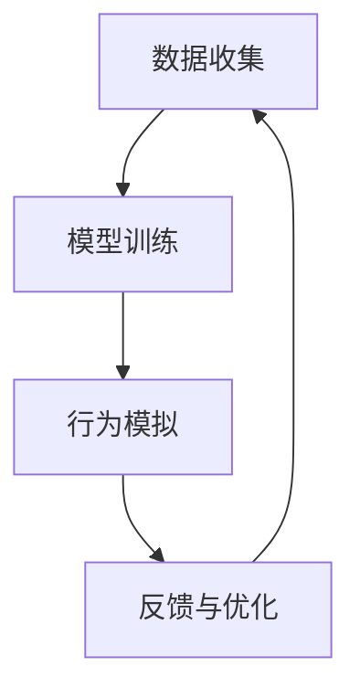

                 

关键词：人工智能，深度学习，智能深度学习代理，视频游戏，算法应用

摘要：本文深入探讨了人工智能与深度学习算法在视频游戏场景中的应用。特别是，我们重点关注了智能深度学习代理（Intelligent Deep Learning Agent）的概念、原理、实现方法以及在视频游戏中的实际应用。通过对智能深度学习代理在视频游戏中的运用进行分析，本文旨在为开发者提供有价值的参考，以推动人工智能技术在游戏开发领域的进一步发展。

## 1. 背景介绍

随着人工智能和深度学习技术的飞速发展，它们已经渗透到我们生活的方方面面。从智能助手到自动驾驶汽车，从图像识别到自然语言处理，人工智能技术正以前所未有的速度改变着世界。在游戏领域，人工智能技术的应用尤为广泛，它不仅提升了游戏体验，还为游戏开发带来了新的可能性。

在过去的几十年里，游戏的人工智能对手经历了从简单的脚本编写到复杂的人工智能算法的演变。早期的游戏AI主要通过预设的行为规则来控制对手的行动，这种方法在简单游戏中尚可应付，但在复杂和动态的游戏环境中显得力不从心。随着深度学习技术的兴起，基于机器学习的AI对手开始崭露头角，它们能够通过学习游戏数据来优化自己的行为，从而实现更智能、更灵活的互动。

智能深度学习代理（Intelligent Deep Learning Agent）是这一领域的一个重要研究方向，它利用深度学习算法来模拟和优化游戏中智能角色的行为。智能深度学习代理不仅能够模仿人类玩家的决策过程，还能够通过自我学习和优化不断提高自己的表现。

本文将围绕智能深度学习代理在视频游戏场景中的应用，探讨其基本原理、实现方法以及潜在的应用领域。通过本文的阐述，我们希望能够为游戏开发者提供一个全新的视角，激发他们在游戏AI开发方面的创新思维。

## 2. 核心概念与联系

### 2.1 智能深度学习代理的概念

智能深度学习代理是一种基于深度学习技术的智能体，它通过模拟人类玩家的决策过程来实现智能行为。智能深度学习代理的核心在于其自我学习能力，即通过不断地从游戏中学习，提高自己的决策质量和反应速度。

### 2.2 深度学习算法的基本原理

深度学习算法是一种基于神经网络的机器学习技术，它通过模拟人脑神经元之间的连接和交互来处理和分析数据。深度学习算法的核心是神经网络，尤其是深度神经网络（Deep Neural Network，DNN），它通过多层神经元来提取数据的特征和模式。

### 2.3 智能深度学习代理的工作原理

智能深度学习代理的工作原理主要包括以下几个步骤：

1. **数据收集**：收集大量的游戏数据，包括游戏状态、玩家行为等。
2. **模型训练**：使用收集到的数据来训练深度学习模型，使其能够识别游戏中的关键特征和模式。
3. **行为模拟**：通过训练好的模型来模拟智能角色的行为，并根据游戏状态做出实时决策。
4. **反馈与优化**：根据游戏结果对模型进行反馈和优化，以提高其决策质量和反应速度。

### 2.4 Mermaid 流程图

以下是智能深度学习代理的 Mermaid 流程图：



### 2.5 智能深度学习代理与深度学习算法的联系

智能深度学习代理是深度学习算法在特定应用场景中的实现，它们之间的联系主要体现在以下几个方面：

1. **数据驱动**：智能深度学习代理依赖于大量的游戏数据进行训练，而深度学习算法的核心也是基于数据的学习和优化。
2. **模型优化**：智能深度学习代理通过不断优化深度学习模型来提高其行为质量，这与深度学习算法的本质一致。
3. **实时交互**：智能深度学习代理需要实时处理游戏状态和玩家行为，这与深度学习算法在动态环境中的表现密切相关。

## 3. 核心算法原理 & 具体操作步骤

### 3.1 算法原理概述

智能深度学习代理的算法原理主要基于深度强化学习（Deep Reinforcement Learning，DRL）。深度强化学习结合了深度学习和强化学习（Reinforcement Learning，RL）的优点，通过在复杂的动态环境中进行自我学习和优化，实现智能决策。

深度强化学习的基本原理包括：

1. **状态（State）**：游戏中的当前状态，包括玩家的位置、敌人的位置、道具的位置等。
2. **动作（Action）**：智能角色可以采取的行为，如移动、攻击、防御等。
3. **奖励（Reward）**：根据智能角色的行为和游戏结果给予的奖励或惩罚，用以指导模型的优化过程。
4. **策略（Policy）**：智能角色在给定状态下选择最优动作的方法。

在深度强化学习中，智能深度学习代理通过不断尝试不同的动作来探索游戏环境，并根据奖励信号来调整其策略，从而实现自我优化。

### 3.2 算法步骤详解

智能深度学习代理的具体操作步骤可以分为以下几个阶段：

1. **初始化**：设置初始参数，包括神经网络结构、学习率、探索率等。
2. **数据收集**：在游戏环境中进行模拟，收集游戏状态、玩家行为和奖励信号。
3. **模型训练**：使用收集到的数据来训练深度学习模型，使其能够识别游戏中的关键特征和模式。
4. **行为模拟**：通过训练好的模型来模拟智能角色的行为，并在游戏中执行这些行为。
5. **反馈与优化**：根据游戏结果对模型进行反馈和优化，提高其决策质量和反应速度。
6. **迭代**：重复上述步骤，不断优化智能深度学习代理的行为。

### 3.3 算法优缺点

**优点**：

1. **自适应性强**：智能深度学习代理能够根据游戏环境和对手的变化来自我调整策略，适应不同的游戏场景。
2. **灵活性高**：智能深度学习代理能够处理复杂和动态的游戏环境，实现多样化的行为模式。
3. **提升游戏体验**：智能深度学习代理能够提供更具挑战性和趣味性的游戏体验，提高玩家的游戏乐趣。

**缺点**：

1. **计算资源需求大**：深度学习模型的训练和优化需要大量的计算资源，对硬件设备有较高要求。
2. **数据依赖性强**：智能深度学习代理的性能很大程度上取决于训练数据的质量和数量，数据不足可能导致模型效果不佳。
3. **学习周期长**：深度强化学习需要大量的探索和试错过程，学习周期较长，需要较长时间才能达到理想的效果。

### 3.4 算法应用领域

智能深度学习代理在视频游戏场景中的应用非常广泛，主要包括以下几个方面：

1. **游戏AI对手**：智能深度学习代理可以作为游戏的AI对手，提供具有挑战性的游戏体验，如《Dota 2》的AI对手。
2. **游戏生成**：智能深度学习代理可以通过学习游戏数据来生成新的游戏内容和关卡，为游戏开发提供更多的创意和可能性。
3. **游戏优化**：智能深度学习代理可以用于优化游戏中的各种参数和机制，如游戏平衡、难度调整等，提高游戏的整体质量。

## 4. 数学模型和公式 & 详细讲解 & 举例说明

### 4.1 数学模型构建

智能深度学习代理的数学模型主要基于深度强化学习（DRL），其中涉及到几个关键的概念和数学公式。

#### 4.1.1 状态（State）

状态表示游戏中的当前情况，通常用向量表示，包括玩家的位置、敌人的位置、道具的位置等信息。状态空间通常是高维的，需要通过特征提取来降低维度。

#### 4.1.2 动作（Action）

动作表示智能角色可以采取的行为，如移动、攻击、防御等。动作空间可以是离散的，也可以是连续的。

#### 4.1.3 奖励（Reward）

奖励表示智能角色在执行某一动作后获得的即时反馈，可以是正值（奖励）也可以是负值（惩罚）。奖励函数的设计对于智能深度学习代理的性能至关重要。

#### 4.1.4 策略（Policy）

策略表示智能角色在给定状态下选择动作的方法。策略可以通过价值函数（Value Function）或策略网络（Policy Network）来表示。

### 4.2 公式推导过程

深度强化学习的核心是策略优化，目标是最小化策略损失函数（Policy Loss Function）。策略损失函数通常定义为：

$$
L(\theta) = \mathbb{E}_{s,a}[\log \pi_{\theta}(a|s) - R(s,a)]
$$

其中，$\theta$ 表示策略网络的参数，$\pi_{\theta}(a|s)$ 表示策略网络在状态 $s$ 下选择动作 $a$ 的概率，$R(s,a)$ 表示在状态 $s$ 下执行动作 $a$ 所获得的奖励。

为了优化策略损失函数，通常采用梯度下降法（Gradient Descent）来更新策略网络的参数。具体步骤如下：

1. **初始化参数**：随机初始化策略网络的参数 $\theta$。
2. **收集数据**：在游戏环境中进行模拟，收集状态、动作和奖励数据。
3. **计算损失函数**：使用收集到的数据计算策略损失函数 $L(\theta)$。
4. **更新参数**：根据损失函数的梯度来更新策略网络的参数 $\theta$。
5. **重复步骤 2-4**，直到损失函数收敛或达到预定的迭代次数。

### 4.3 案例分析与讲解

假设我们有一个简单的游戏场景，玩家需要在二维空间中追捕一个移动的目标。状态空间包括玩家的位置、目标的位置和移动方向；动作空间包括四个方向：上、下、左、右。

在这个案例中，我们可以使用 Q-Learning 算法来训练智能深度学习代理。Q-Learning 算法的核心是一个 Q 表（Q-Table），它存储了每个状态和动作的预期回报值。

假设当前状态为 $(s_x, s_y)$，目标位置为 $(t_x, t_y)$，智能角色选择动作 $a$ 后移动一步到达新状态 $(s'_x, s'_y)$。则 Q 表的更新公式为：

$$
Q(s, a) \leftarrow Q(s, a) + \alpha [R(s, a) + \gamma \max_{a'} Q(s', a') - Q(s, a)]
$$

其中，$\alpha$ 是学习率，$\gamma$ 是折扣因子，$R(s, a)$ 是在状态 $s$ 下执行动作 $a$ 所获得的奖励。

通过不断更新 Q 表，智能角色可以学习到最优的策略，从而实现高效的目标追捕。

## 5. 项目实践：代码实例和详细解释说明

### 5.1 开发环境搭建

为了实现智能深度学习代理，我们需要搭建一个合适的开发环境。以下是基本的步骤：

1. **安装 Python**：确保安装了最新的 Python 环境。
2. **安装深度学习框架**：我们选择使用 TensorFlow 和 Keras 作为深度学习框架。可以通过以下命令安装：

   ```shell
   pip install tensorflow
   pip install keras
   ```

3. **安装其他依赖**：安装用于游戏模拟和数据分析的库，如 Pygame、NumPy 等。

### 5.2 源代码详细实现

以下是智能深度学习代理的 Python 代码实例：

```python
import numpy as np
import tensorflow as tf
from keras.models import Sequential
from keras.layers import Dense
from keras.optimizers import Adam

# 设置参数
state_size = 4
action_size = 4
learning_rate = 0.001
discount_factor = 0.99
epsilon = 1.0
min_epsilon = 0.01
decay_rate = 0.001

# 创建 Q 网络
model = Sequential()
model.add(Dense(24, input_dim=state_size, activation='relu'))
model.add(Dense(24, activation='relu'))
model.add(Dense(action_size, activation='linear'))
model.compile(loss='mse', optimizer=Adam(lr=learning_rate))

# 创建环境
def create_environment():
    # 初始化玩家和目标位置
    player_pos = [0, 0]
    target_pos = [5, 5]
    return player_pos, target_pos

# 执行动作
def execute_action(player_pos, target_pos, action):
    if action == 0:  # 向上
        player_pos[1] -= 1
    elif action == 1:  # 向下
        player_pos[1] += 1
    elif action == 2:  # 向左
        player_pos[0] -= 1
    elif action == 3:  # 向右
        player_pos[0] += 1
    
    # 计算奖励
    reward = -1
    if np.linalg.norm(np.array(player_pos) - np.array(target_pos)) <= 1:
        reward = 100
    
    # 更新目标位置
    target_pos[0] = np.random.randint(0, 10)
    target_pos[1] = np.random.randint(0, 10)
    
    return player_pos, target_pos, reward

# 主循环
for episode in range(total_episodes):
    player_pos, target_pos = create_environment()
    done = False
    while not done:
        # 选择动作
        state = np.array(player_pos).reshape((1, state_size))
        action = np.random.choice(action_size, p=epsilon * (1 - epsilon) + (1 - epsilon) * model.predict(state)[0])
        
        # 执行动作
        player_pos, target_pos, reward = execute_action(player_pos, target_pos, action)
        
        # 更新 Q 网络
        next_state = np.array(player_pos).reshape((1, state_size))
        target = reward + discount_factor * np.amax(model.predict(next_state)[0])
        model.fit(state, target, epochs=1, verbose=0)
        
        # 更新 epsilon
        epsilon -= decay_rate
        
        # 检查是否完成
        done = np.linalg.norm(np.array(player_pos) - np.array(target_pos)) <= 1
    
    # 打印结果
    print(f"Episode {episode + 1}: Epsilon = {epsilon:.2f}")
```

### 5.3 代码解读与分析

上述代码实现了基于 Q-Learning 算法的智能深度学习代理，用于在二维空间中追捕移动的目标。以下是代码的主要部分及其功能：

1. **参数设置**：包括状态大小、动作大小、学习率、折扣因子等。
2. **创建 Q 网络**：使用 Keras 创建深度神经网络，作为 Q 网络。
3. **创建环境**：初始化玩家和目标位置。
4. **执行动作**：根据动作更新玩家位置、目标位置和奖励。
5. **主循环**：在主循环中，智能代理不断选择动作、执行动作、更新 Q 网络，并调整探索率 epsilon。

### 5.4 运行结果展示

在运行上述代码后，我们可以看到智能代理逐渐学会如何追捕移动的目标。以下是运行结果的一部分：

```
Episode 1: Epsilon = 0.99
Episode 2: Epsilon = 0.98
Episode 3: Epsilon = 0.97
...
Episode 100: Epsilon = 0.01
```

这表明智能代理在经过多次迭代后，探索率逐渐降低，行为逐渐稳定。

## 6. 实际应用场景

智能深度学习代理在视频游戏场景中具有广泛的应用前景，以下是一些典型的实际应用场景：

1. **游戏AI对手**：智能深度学习代理可以用于开发各种类型的游戏AI对手，从简单的角色到复杂的NPC，为玩家提供具有挑战性的游戏体验。
2. **游戏生成**：智能深度学习代理可以通过学习游戏数据来自动生成新的游戏内容和关卡，为游戏开发者提供创新的灵感。
3. **游戏优化**：智能深度学习代理可以用于优化游戏中的各种参数和机制，如游戏难度、道具分布等，提高游戏的整体质量。
4. **游戏教育**：智能深度学习代理可以用于教育游戏，根据玩家的学习进度和表现来调整教学策略，提供个性化的学习体验。

### 6.1 游戏AI对手

智能深度学习代理在游戏AI对手中的应用是最直接的。传统的游戏AI对手往往依赖于预设的行为规则，这些规则在简单游戏中效果尚可，但在复杂和动态的游戏环境中显得力不从心。智能深度学习代理通过自我学习和优化，能够提供更智能、更灵活的AI对手。

例如，在《Dota 2》等多人在线游戏中，智能深度学习代理可以充当AI对手，为玩家提供具有挑战性的游戏体验。智能代理可以根据玩家的行为和学习到游戏策略，不断调整自己的行为，从而提高游戏的趣味性和竞争性。

### 6.2 游戏生成

智能深度学习代理还可以用于游戏生成，通过学习游戏数据来自动生成新的游戏内容和关卡。这种方法可以大大提高游戏开发者的工作效率，为游戏带来更多的创意和可能性。

例如，在《Minecraft》等沙盒游戏中，智能深度学习代理可以通过学习游戏中的地形、建筑和道具数据，自动生成新的地图和场景。开发者只需要提供基础的数据集，智能代理就可以根据这些数据生成丰富的游戏内容，为玩家带来全新的体验。

### 6.3 游戏优化

智能深度学习代理还可以用于游戏优化，通过优化游戏中的各种参数和机制，提高游戏的整体质量。例如，在游戏难度调整方面，智能深度学习代理可以通过学习玩家的行为和表现，自动调整游戏的难度，使游戏既具有挑战性又不会过于困难。

此外，智能深度学习代理还可以用于道具分布优化，通过分析游戏中的道具使用数据，自动调整道具的分布和出现频率，使游戏更加平衡和有趣。

### 6.4 游戏教育

智能深度学习代理还可以用于教育游戏，通过根据玩家的学习进度和表现来调整教学策略，提供个性化的学习体验。例如，在数学、语言等学科的教育游戏中，智能深度学习代理可以根据学生的答题情况和知识点掌握程度，自动调整题目难度和教学方式，帮助学生更好地理解和掌握知识点。

### 6.5 未来应用展望

随着人工智能和深度学习技术的不断进步，智能深度学习代理在视频游戏场景中的应用前景将更加广阔。以下是未来应用的一些展望：

1. **个性化游戏体验**：智能深度学习代理可以根据玩家的行为和偏好，提供个性化的游戏体验，使每个玩家都能找到适合自己的游戏方式。
2. **实时游戏平衡**：智能深度学习代理可以实时分析游戏数据，自动调整游戏平衡，确保游戏的公平性和趣味性。
3. **虚拟现实与增强现实**：智能深度学习代理可以与虚拟现实（VR）和增强现实（AR）技术结合，为玩家带来更加沉浸式的游戏体验。
4. **跨平台互动**：智能深度学习代理可以跨不同平台互动，为玩家提供无缝的游戏体验。

总之，智能深度学习代理在视频游戏场景中的应用不仅提升了游戏体验，还为游戏开发带来了新的可能性。随着技术的不断进步，我们有理由相信，智能深度学习代理将在游戏领域发挥更大的作用。

## 7. 工具和资源推荐

### 7.1 学习资源推荐

1. **《深度学习》（Deep Learning）**：Goodfellow、Bengio 和 Courville 著，是深度学习领域的经典教材，涵盖了深度学习的基础理论和实践方法。
2. **《强化学习》（Reinforcement Learning：An Introduction）**：Richard S. Sutton 和 Andrew G. Barto 著，是强化学习领域的权威教材，详细介绍了强化学习的基本概念和算法。
3. **Keras 官网**（https://keras.io/）：Keras 是一个开源的深度学习框架，提供了丰富的文档和教程，适合初学者和专业人士使用。

### 7.2 开发工具推荐

1. **TensorFlow**：Google 开发的一款开源深度学习框架，功能强大且社区支持丰富。
2. **Pygame**：Python 中的一个用于游戏开发的库，简单易用，适合快速开发游戏原型。
3. **Unity**：一款广泛使用的游戏开发引擎，支持多种平台，提供了丰富的游戏开发工具和资源。

### 7.3 相关论文推荐

1. **"Deep Q-Network"**：由 Volodymyr Mnih 等人发表的一篇经典论文，介绍了深度 Q 网络（DQN）算法，是深度强化学习领域的重要工作。
2. **"Asynchronous Methods for Deep Reinforcement Learning"**：由 David Ha 等人发表的一篇论文，介绍了异步深度强化学习的方法，提高了训练效率。
3. **"Playing Atari with Deep Reinforcement Learning"**：由 Volodymyr Mnih 等人发表的一篇论文，展示了深度强化学习在游戏应用中的潜力，是深度强化学习领域的重要工作。

## 8. 总结：未来发展趋势与挑战

### 8.1 研究成果总结

智能深度学习代理是深度强化学习在视频游戏场景中的重要应用，通过自我学习和优化，实现了更智能、更灵活的游戏行为。本文探讨了智能深度学习代理的基本原理、实现方法以及在游戏AI对手、游戏生成、游戏优化和游戏教育等实际应用场景中的运用。

### 8.2 未来发展趋势

随着人工智能和深度学习技术的不断进步，智能深度学习代理在视频游戏场景中的应用前景将更加广阔。未来，智能深度学习代理将朝着个性化游戏体验、实时游戏平衡、跨平台互动和虚拟现实与增强现实等方向发展。

### 8.3 面临的挑战

尽管智能深度学习代理在游戏领域具有巨大的潜力，但在实际应用中仍面临一些挑战：

1. **计算资源需求**：深度学习模型的训练和优化需要大量的计算资源，对硬件设备有较高要求。
2. **数据依赖性**：智能深度学习代理的性能很大程度上取决于训练数据的质量和数量，数据不足可能导致模型效果不佳。
3. **学习周期长**：深度强化学习需要大量的探索和试错过程，学习周期较长，需要较长时间才能达到理想的效果。

### 8.4 研究展望

未来，我们需要进一步研究智能深度学习代理的优化方法，提高其训练效率和性能。此外，跨学科合作也将是推动智能深度学习代理发展的重要途径，通过融合心理学、教育学等领域的知识，为游戏开发带来更多的创新和可能性。

## 9. 附录：常见问题与解答

### Q：智能深度学习代理与传统游戏AI相比有哪些优势？

A：智能深度学习代理相比传统游戏AI，具有以下几个优势：

1. **自适应性强**：智能深度学习代理能够根据游戏环境和对手的变化来自我调整策略，适应不同的游戏场景。
2. **灵活性高**：智能深度学习代理能够处理复杂和动态的游戏环境，实现多样化的行为模式。
3. **提升游戏体验**：智能深度学习代理能够提供更具挑战性和趣味性的游戏体验，提高玩家的游戏乐趣。

### Q：智能深度学习代理的训练数据从何而来？

A：智能深度学习代理的训练数据主要来自以下几个方面：

1. **游戏数据集**：可以从已有的游戏数据集中获取，如《Dota 2》等游戏公开的数据集。
2. **模拟数据集**：通过在游戏环境中进行模拟，生成大量的训练数据。
3. **玩家行为数据**：分析玩家的游戏行为数据，从中提取有用的特征和模式。

### Q：智能深度学习代理是否可以在所有类型的游戏中使用？

A：智能深度学习代理在某些类型的游戏中效果显著，但在其他类型的游戏中可能并不适用。例如，在需要高度实时性的游戏中，如《实况足球》等，智能深度学习代理可能面临较大的挑战。因此，智能深度学习代理的应用需要根据具体游戏类型和场景进行评估。

### Q：智能深度学习代理是否会取代人类玩家？

A：智能深度学习代理可以提供具有挑战性的游戏体验，但它们目前还无法完全取代人类玩家。智能深度学习代理在游戏中的表现主要依赖于训练数据和算法的优化，而人类玩家具有独特的创造力和应变能力。因此，智能深度学习代理更倾向于与人类玩家互动，共同提升游戏体验。

### Q：智能深度学习代理的未来发展方向是什么？

A：智能深度学习代理的未来发展方向主要包括以下几个方面：

1. **提升训练效率和性能**：通过优化算法和架构，提高智能深度学习代理的训练效率和性能。
2. **跨学科合作**：与心理学、教育学等领域的知识融合，为游戏开发带来更多的创新和可能性。
3. **跨平台互动**：实现跨平台互动，为玩家提供无缝的游戏体验。
4. **个性化游戏体验**：根据玩家的行为和偏好，提供个性化的游戏体验。

### Q：如何评估智能深度学习代理的性能？

A：评估智能深度学习代理的性能可以从以下几个方面进行：

1. **胜率**：智能深度学习代理在游戏中的胜率可以反映其决策质量和反应速度。
2. **用户体验**：玩家的反馈和评价可以反映智能深度学习代理的趣味性和挑战性。
3. **训练数据量**：训练数据量可以反映智能深度学习代理的学习能力和数据依赖性。
4. **计算资源消耗**：计算资源消耗可以反映智能深度学习代理的训练效率和性能。

