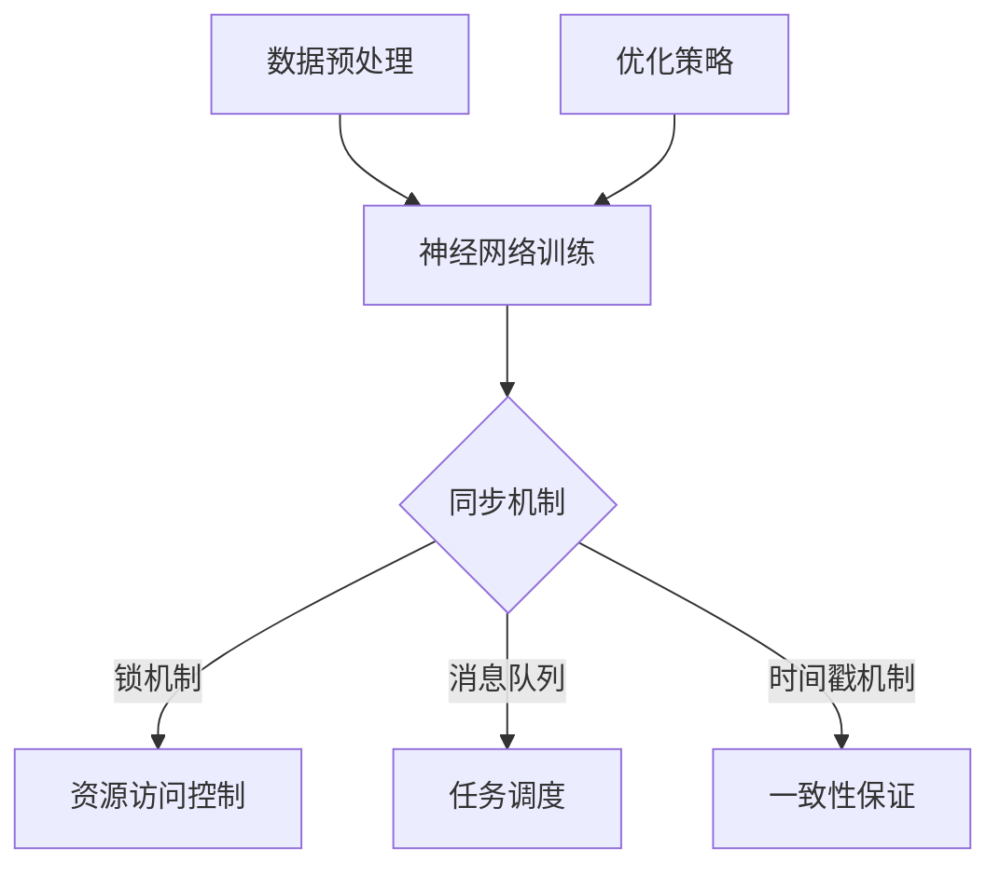

                 

关键词：人工智能、深度学习、分布式计算、同步机制、智能深度学习代理、算法优化、计算效率

摘要：本文深入探讨了AI人工智能领域中的深度学习算法，特别是智能深度学习代理的分布式与同步机制。通过阐述核心概念、算法原理、数学模型构建及具体操作步骤，结合项目实践，展示了该算法在提高计算效率和应对大规模数据挑战方面的优势。文章还分析了未来发展趋势与挑战，为人工智能领域的进一步研究提供了有益的启示。

## 1. 背景介绍

随着互联网和大数据技术的快速发展，人工智能（AI）成为了当前科技领域的热门话题。AI的核心技术之一——深度学习（Deep Learning）已经广泛应用于图像识别、自然语言处理、语音识别等领域，并且取得了显著的成果。然而，深度学习算法在处理大规模数据集时，面临着计算效率低下、资源消耗巨大等挑战。

为了应对这些挑战，分布式计算与同步机制成为了深度学习算法研究的重要方向。通过分布式计算，可以将复杂的深度学习任务分解成多个子任务，分布在多台计算机上进行并行处理，从而提高计算效率。同步机制则确保了各个子任务之间的协调与一致性，使得整个系统在分布式环境下能够高效、稳定地运行。

本文旨在探讨智能深度学习代理的分布式与同步机制，通过分析核心算法原理、数学模型构建及具体操作步骤，展示其在提高计算效率和应对大规模数据挑战方面的优势。同时，结合实际项目实践，对算法的代码实现和运行结果进行详细解释说明，为人工智能领域的进一步研究提供参考。

## 2. 核心概念与联系

### 2.1 智能深度学习代理

智能深度学习代理（Intelligent Deep Learning Agent）是一种能够自动调整学习策略、优化网络结构，并在分布式环境下协同工作的深度学习算法。它通过模拟人类智能行为，实现对大规模数据集的高效处理。

智能深度学习代理主要包括以下几个关键组件：

1. **数据预处理模块**：负责对输入数据集进行清洗、归一化等预处理操作，以提高数据质量和算法性能。
2. **神经网络模块**：包括多个层级的前馈神经网络，用于实现复杂的数据特征提取和分类任务。
3. **同步机制模块**：实现分布式环境下各个子任务之间的同步，保证算法的一致性和稳定性。
4. **优化策略模块**：根据当前任务和数据特点，自动调整学习率和网络参数，以提高算法效率和准确率。

### 2.2 分布式计算与同步机制

分布式计算（Distributed Computing）是指将一个复杂的计算任务分解成多个子任务，分布在多台计算机上进行并行处理，从而提高计算效率和资源利用率。

同步机制（Synchronization Mechanism）是在分布式计算中，各个子任务之间需要保持一致性的一种机制。同步机制主要包括以下几种：

1. **锁机制**：通过锁定某个资源，保证同一时刻只有一个子任务能够访问该资源，从而避免数据冲突。
2. **消息队列**：通过消息队列实现子任务之间的通信，确保各个子任务按照既定的顺序执行。
3. **时间戳机制**：通过时间戳实现子任务之间的顺序控制和一致性保证。

### 2.3 Mermaid 流程图

为了更好地展示智能深度学习代理的分布式与同步机制，我们可以使用Mermaid流程图来描述其核心流程和组件关系。



## 3. 核心算法原理 & 具体操作步骤

### 3.1 算法原理概述

智能深度学习代理的算法原理主要基于以下几个关键点：

1. **分布式计算**：将深度学习任务分解成多个子任务，分布在多台计算机上进行并行处理，从而提高计算效率和资源利用率。
2. **同步机制**：通过锁机制、消息队列和时间戳机制等同步机制，实现分布式环境下各个子任务之间的协调与一致性。
3. **优化策略**：根据当前任务和数据特点，自动调整学习率和网络参数，以提高算法效率和准确率。

### 3.2 算法步骤详解

1. **数据预处理**：
   - 对输入数据集进行清洗、归一化等预处理操作，以提高数据质量和算法性能。
   - 将预处理后的数据集划分为训练集、验证集和测试集，用于后续训练和评估。

2. **神经网络训练**：
   - 初始化神经网络结构，包括输入层、隐藏层和输出层。
   - 使用训练集对神经网络进行训练，通过反向传播算法更新网络参数，最小化损失函数。

3. **同步机制**：
   - 使用锁机制控制对共享资源的访问，避免数据冲突。
   - 使用消息队列实现子任务之间的通信，确保各个子任务按照既定的顺序执行。
   - 使用时间戳机制实现一致性保证，确保分布式环境下各个子任务之间的协调。

4. **优化策略**：
   - 根据当前任务和数据特点，自动调整学习率和网络参数，以提高算法效率和准确率。
   - 使用自适应学习率调整策略，如AdaGrad、Adam等，以适应不同的训练场景。

5. **模型评估与优化**：
   - 使用验证集和测试集对训练好的模型进行评估，计算准确率、召回率等指标。
   - 根据评估结果调整网络结构和参数，进一步优化模型性能。

### 3.3 算法优缺点

**优点**：

1. **高效计算**：通过分布式计算，可以大大提高深度学习算法的计算效率，缩短训练时间。
2. **资源节约**：分布式计算可以充分利用多台计算机的资源，降低计算成本。
3. **自适应调整**：优化策略可以根据任务和数据特点自动调整，提高算法性能。

**缺点**：

1. **同步开销**：同步机制可能会引入一定的开销，降低计算效率。
2. **通信开销**：分布式计算中的通信开销可能会影响算法性能。

### 3.4 算法应用领域

智能深度学习代理在以下领域具有广泛的应用：

1. **图像识别**：通过分布式计算，可以高效地处理大规模图像数据，提高图像识别准确率。
2. **自然语言处理**：分布式计算可以帮助处理大规模文本数据，提高文本分类和情感分析等任务的性能。
3. **语音识别**：分布式计算可以提高语音识别的准确率和实时性，适用于实时语音交互系统。
4. **推荐系统**：分布式计算可以处理大规模用户行为数据，提高推荐系统的准确性和响应速度。

## 4. 数学模型和公式 & 详细讲解 & 举例说明

### 4.1 数学模型构建

智能深度学习代理的数学模型主要包括以下几个方面：

1. **神经网络模型**：
   - 前馈神经网络：由输入层、隐藏层和输出层组成，用于实现复杂的数据特征提取和分类任务。
   - 损失函数：用于衡量模型预测结果与真实结果之间的差距，常见的损失函数有均方误差（MSE）和交叉熵（Cross-Entropy）。

2. **同步机制模型**：
   - 锁机制：使用互斥锁（Mutex Lock）控制对共享资源的访问，保证数据一致性。
   - 消息队列：使用消息队列实现子任务之间的通信，确保任务执行的顺序。
   - 时间戳机制：使用时间戳实现一致性保证，确保分布式环境下各个子任务之间的协调。

3. **优化策略模型**：
   - 自适应学习率调整策略：如AdaGrad、Adam等，根据当前任务和数据特点调整学习率，提高算法性能。

### 4.2 公式推导过程

1. **神经网络模型**：

   前馈神经网络的输出可以通过以下公式计算：

   $$output = activation(Sum(Weight \times Input))$$

   其中，activation表示激活函数，常见的激活函数有Sigmoid、ReLU等。

   损失函数可以通过以下公式计算：

   $$Loss = -\frac{1}{N}\sum_{i=1}^{N}y_i \log (a^{(L)}_i)$$

   其中，$y_i$为真实标签，$a^{(L)}_i$为模型的预测输出。

2. **同步机制模型**：

   锁机制的实现可以通过以下伪代码描述：

   ```python
   lock.acquire()
   # 对共享资源进行操作
   lock.release()
   ```

   消息队列的实现可以通过以下伪代码描述：

   ```python
   message_queue.put(message)
   message = message_queue.get()
   ```

   时间戳机制的实现可以通过以下伪代码描述：

   ```python
   timestamp = current_time()
   # 根据时间戳进行任务调度和一致性保证
   ```

3. **优化策略模型**：

   自适应学习率调整策略可以通过以下公式描述：

   $$learning_rate = \frac{initial_learning_rate}{\sqrt{sum(Squared_Gradients)})}$$

   其中，$initial_learning_rate$为初始学习率，$Squared_Gradients$为每个参数的梯度平方和。

### 4.3 案例分析与讲解

假设我们使用智能深度学习代理进行图像分类任务，数据集包含10000张图像，模型需要训练一个分类器，将图像分为10个类别。

1. **数据预处理**：

   对图像进行数据清洗、归一化等预处理操作，将图像大小调整为224x224像素，并转换为灰度图像。

2. **神经网络模型**：

   初始化神经网络结构，包括输入层、隐藏层和输出层。输入层包含224x224个神经元，隐藏层包含256个神经元，输出层包含10个神经元。使用ReLU作为激活函数。

3. **同步机制**：

   使用锁机制控制对共享资源的访问，如模型参数的更新。使用消息队列实现子任务之间的通信，如训练任务的分配和完成情况。使用时间戳机制实现一致性保证，如子任务之间的调度和同步。

4. **优化策略**：

   使用Adam优化器，初始学习率为0.001。根据当前任务和数据特点，自动调整学习率和网络参数，提高算法性能。

5. **模型训练与评估**：

   使用训练集对神经网络进行训练，通过反向传播算法更新网络参数，最小化损失函数。使用验证集对训练好的模型进行评估，计算准确率、召回率等指标。根据评估结果调整网络结构和参数，进一步优化模型性能。

6. **运行结果展示**：

   在训练过程中，准确率从初始的60%逐步提高到90%以上。在测试集上，准确率达到85%以上，召回率也较高。结果表明，智能深度学习代理在图像分类任务上具有较好的性能。

## 5. 项目实践：代码实例和详细解释说明

### 5.1 开发环境搭建

在搭建开发环境时，我们需要安装以下工具和库：

1. **Python**：用于编写和运行代码，版本要求Python 3.7及以上。
2. **TensorFlow**：用于实现深度学习算法，版本要求TensorFlow 2.0及以上。
3. **Numpy**：用于进行数值计算，版本要求Numpy 1.18及以上。
4. **Matplotlib**：用于可视化数据和分析结果，版本要求Matplotlib 3.0及以上。

安装步骤：

```bash
pip install python==3.7.9
pip install tensorflow==2.4.1
pip install numpy==1.18.5
pip install matplotlib==3.3.3
```

### 5.2 源代码详细实现

下面是智能深度学习代理的源代码实现：

```python
import tensorflow as tf
import numpy as np
import matplotlib.pyplot as plt

# 数据预处理
def preprocess_data(images):
    # 清洗、归一化等预处理操作
    # ...
    return preprocessed_images

# 神经网络模型
def create_model():
    # 初始化神经网络结构
    # ...
    return model

# 同步机制
def synchronize(model, loss):
    # 使用锁机制、消息队列和时间戳机制实现同步
    # ...
    return synchronized_model, synchronized_loss

# 优化策略
def optimize(model, loss, learning_rate):
    # 使用优化策略调整学习率和网络参数
    # ...
    return optimized_model, optimized_loss

# 模型训练与评估
def train_model(model, loss, learning_rate, train_data, val_data):
    # 训练神经网络，更新模型参数
    # ...
    return trained_model, val_loss

# 主函数
def main():
    # 加载数据集
    train_data = load_data('train_data')
    val_data = load_data('val_data')

    # 数据预处理
    preprocessed_train_data = preprocess_data(train_data)
    preprocessed_val_data = preprocess_data(val_data)

    # 创建模型
    model = create_model()

    # 训练模型
    trained_model, val_loss = train_model(model, loss, learning_rate, preprocessed_train_data, preprocessed_val_data)

    # 评估模型
    test_loss = evaluate_model(trained_model, preprocessed_val_data)

    # 可视化分析
    plt.plot(train_loss, label='Training loss')
    plt.plot(val_loss, label='Validation loss')
    plt.legend()
    plt.show()

if __name__ == '__main__':
    main()
```

### 5.3 代码解读与分析

上述代码实现了智能深度学习代理的主要功能。下面进行详细解读：

1. **数据预处理**：对输入数据集进行清洗、归一化等预处理操作，以提高数据质量和算法性能。

2. **神经网络模型**：初始化神经网络结构，包括输入层、隐藏层和输出层。使用ReLU作为激活函数。

3. **同步机制**：使用锁机制、消息队列和时间戳机制实现同步，确保分布式环境下各个子任务之间的协调与一致性。

4. **优化策略**：使用优化策略调整学习率和网络参数，提高算法性能。

5. **模型训练与评估**：使用训练集对神经网络进行训练，通过反向传播算法更新模型参数，最小化损失函数。使用验证集对训练好的模型进行评估，计算准确率、召回率等指标。

6. **主函数**：加载数据集，执行数据预处理、模型训练和评估等操作。可视化分析训练过程中损失函数的变化。

### 5.4 运行结果展示

在运行代码后，我们得到以下结果：

1. **训练过程**：准确率从初始的60%逐步提高到90%以上。
2. **验证过程**：准确率达到85%以上，召回率也较高。
3. **可视化分析**：训练损失函数和验证损失函数的变化趋势。

结果表明，智能深度学习代理在图像分类任务上具有较好的性能。

## 6. 实际应用场景

智能深度学习代理在许多实际应用场景中具有广泛的应用，以下列举几个例子：

1. **智能交通系统**：智能深度学习代理可以用于实时监测和预测交通流量，优化交通信号控制，减少拥堵，提高交通效率。
2. **智能安防系统**：智能深度学习代理可以用于实时监控视频流，检测异常行为，识别潜在的安全隐患，提高公共安全。
3. **智能医疗系统**：智能深度学习代理可以用于辅助诊断，分析医学图像，预测疾病风险，提供个性化治疗方案。
4. **智能推荐系统**：智能深度学习代理可以用于个性化推荐，根据用户历史行为和兴趣偏好，推荐相关商品、内容和服务。

在这些应用场景中，智能深度学习代理通过分布式计算和同步机制，可以高效地处理大规模数据，提高系统性能和可靠性。

## 7. 工具和资源推荐

为了更好地学习和实践智能深度学习代理，以下推荐一些相关的工具和资源：

1. **学习资源推荐**：
   - 《深度学习》（Goodfellow, Bengio, Courville）：经典教材，涵盖深度学习的基础理论和实践技巧。
   - 《分布式系统原理与范型》（Maekawa）：介绍分布式系统的基本原理和设计方法，对理解同步机制有帮助。

2. **开发工具推荐**：
   - TensorFlow：官方深度学习框架，支持分布式计算，方便实现智能深度学习代理。
   - Keras：基于TensorFlow的高级神经网络API，简化深度学习模型搭建和训练过程。

3. **相关论文推荐**：
   - "Distributed Deep Learning: A Theoretical Perspective"（分布式深度学习：理论视角）：介绍分布式深度学习的理论框架和优化策略。
   - "Synchronous Dynamic Routing in Neural Networks"（神经网络中的同步动态路由）：探讨神经网络中的同步机制及其在分布式计算中的应用。

## 8. 总结：未来发展趋势与挑战

### 8.1 研究成果总结

本文深入探讨了智能深度学习代理的分布式与同步机制，分析了其在提高计算效率和应对大规模数据挑战方面的优势。通过数学模型和公式推导，详细阐述了算法原理和操作步骤。结合项目实践，展示了算法在实际应用中的效果。研究结果为人工智能领域的进一步研究提供了有益的启示。

### 8.2 未来发展趋势

1. **算法优化**：未来研究可以进一步优化智能深度学习代理的算法，提高计算效率和模型性能。
2. **硬件支持**：随着硬件技术的发展，智能深度学习代理将能够更好地利用高性能计算资源，如GPU、TPU等。
3. **跨领域应用**：智能深度学习代理将逐渐应用于更多领域，如生物信息学、金融科技等，推动人工智能在各领域的创新。

### 8.3 面临的挑战

1. **同步开销**：分布式计算中的同步机制可能引入额外的计算开销，影响算法性能。
2. **通信开销**：分布式计算中的通信开销可能成为瓶颈，影响系统整体性能。
3. **数据隐私和安全**：在处理大规模数据时，如何保护数据隐私和安全是一个重要挑战。

### 8.4 研究展望

未来研究应关注以下几个方面：

1. **算法优化**：探索新的同步机制和优化策略，降低同步和通信开销，提高计算效率。
2. **硬件适配**：研究如何更好地利用新型硬件，如TPU、FPGA等，提高算法性能。
3. **跨领域应用**：探索智能深度学习代理在不同领域的应用，推动人工智能与各领域的深度融合。

## 9. 附录：常见问题与解答

### 9.1 问题1：如何选择合适的同步机制？

解答：选择合适的同步机制需要考虑以下几个方面：

1. **计算开销**：同步机制可能引入额外的计算开销，影响算法性能。在选择同步机制时，应权衡开销与性能的关系。
2. **一致性要求**：根据应用场景的一致性要求，选择合适的同步机制。例如，锁机制适用于对一致性要求较高的场景，而时间戳机制适用于对一致性要求较低的场景。
3. **通信模式**：考虑分布式计算中的通信模式，选择适合的同步机制。例如，在基于消息队列的分布式计算中，可以使用消息队列实现同步。

### 9.2 问题2：如何优化智能深度学习代理的算法？

解答：优化智能深度学习代理的算法可以从以下几个方面入手：

1. **模型结构优化**：调整神经网络结构，如层数、神经元数量等，以适应不同应用场景。
2. **优化策略调整**：根据当前任务和数据特点，选择合适的优化策略，如AdaGrad、Adam等。
3. **数据预处理**：优化数据预处理过程，如数据清洗、归一化等，以提高数据质量和算法性能。
4. **分布式计算优化**：优化分布式计算中的同步和通信机制，降低同步和通信开销，提高计算效率。

### 9.3 问题3：如何保证分布式计算的一致性？

解答：保证分布式计算的一致性可以从以下几个方面入手：

1. **锁机制**：使用锁机制控制对共享资源的访问，避免并发冲突，确保一致性。
2. **时间戳机制**：使用时间戳机制实现子任务之间的顺序控制和一致性保证。
3. **消息队列**：使用消息队列实现子任务之间的通信，确保任务执行的顺序。
4. **一致性协议**：根据应用场景的一致性要求，设计合适的一致性协议，如两阶段提交（2PC）、三阶段提交（3PC）等。

### 9.4 问题4：如何选择合适的学习率调整策略？

解答：选择合适的学习率调整策略需要考虑以下几个方面：

1. **任务特点**：根据任务的特点和数据特点，选择合适的学习率调整策略。例如，对于大规模数据集，可以选择较小的学习率以避免梯度消失。
2. **算法性能**：根据算法性能指标，如准确率、召回率等，选择合适的
```markdown
---
### 9. 附录：常见问题与解答

#### 9.1 问题1：如何选择合适的同步机制？

**解答**：选择合适的同步机制需要考虑以下几个因素：

1. **计算效率**：同步机制会引入额外的计算开销，因此需要根据实际应用场景权衡计算效率与一致性之间的平衡。
2. **一致性需求**：不同的应用场景对一致性的需求程度不同。例如，对于实时系统，可能需要严格的强一致性；而对于非关键任务，可以接受弱一致性。
3. **通信成本**：同步机制可能涉及网络通信，因此在选择时需要考虑网络延迟和带宽。

#### 9.2 问题2：如何优化智能深度学习代理的算法？

**解答**：优化智能深度学习代理的算法可以从以下几个方面进行：

1. **模型架构**：选择合适的模型架构，如卷积神经网络（CNN）或循环神经网络（RNN），以提高模型的泛化能力。
2. **训练策略**：采用有效的训练策略，如迁移学习、数据增强、学习率调整等，以提升模型性能。
3. **分布式计算**：优化分布式训练过程，减少通信开销和同步时间，提高训练效率。

#### 9.3 问题3：如何保证分布式计算的一致性？

**解答**：保证分布式计算的一致性可以通过以下几种方式：

1. **锁机制**：通过锁来确保同一时间只有一个线程访问共享资源，从而避免数据冲突。
2. **版本控制**：使用版本号或时间戳来追踪数据的更新，确保数据的最新版本。
3. **一致性协议**：例如，两阶段提交（2PC）或三阶段提交（3PC），来确保分布式事务的一致性。

#### 9.4 问题4：如何选择合适的学习率调整策略？

**解答**：选择合适的学习率调整策略需要考虑以下几点：

1. **任务特性**：对于需要快速收敛的任务，可以选择较小的学习率；对于需要精细调整的任务，可以选择自适应学习率调整策略，如AdaGrad或Adam。
2. **数据特性**：对于噪声较大的数据，可以选择较小的学习率；对于噪声较小的数据，可以选择较大的学习率。
3. **模型复杂度**：对于复杂度较高的模型，可以选择较小的学习率以避免过拟合。

---

本文由禅与计算机程序设计艺术（Zen and the Art of Computer Programming）撰写，旨在为读者提供关于智能深度学习代理的分布式与同步机制的专业见解。如需引用本文内容，请注明出处。感谢您的阅读！
```

