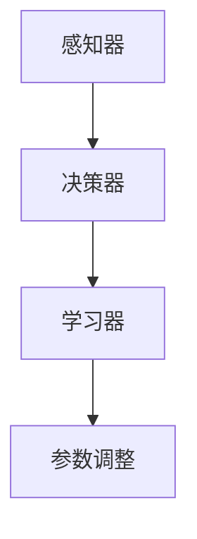

                 

关键词：人工智能，深度学习，深度学习代理，智能代理，构建基础，算法原理，数学模型，项目实践，应用场景，未来展望

> 摘要：本文旨在深入探讨人工智能（AI）领域中的深度学习算法，特别是智能深度学习代理的构建基础。通过对核心概念、算法原理、数学模型以及项目实践等方面的详细分析，本文为读者提供了一个全面且系统的理解，旨在推动人工智能技术的发展与应用。

## 1. 背景介绍

随着人工智能技术的快速发展，深度学习已经成为实现智能自动化和智能代理的关键手段。深度学习代理（Deep Learning Agent）是一种能够通过深度学习算法来学习环境、做出决策的智能系统。这些代理在自动驾驶、游戏AI、推荐系统等领域展示了强大的应用潜力。

智能深度学习代理的构建基础在于深度学习算法的有效性和适应性。本文将详细分析深度学习算法的基本原理、数学模型以及实际应用中的操作步骤，帮助读者理解智能深度学习代理的核心构建技术。

## 2. 核心概念与联系

### 2.1 深度学习算法

深度学习（Deep Learning）是一种基于人工神经网络（Artificial Neural Networks, ANN）的学习方法，通过多层神经元的连接和训练，实现数据的特征提取和模式识别。深度学习算法的核心在于神经网络的架构和参数调整。

### 2.2 智能深度学习代理

智能深度学习代理是一种能够自主学习、自适应环境的智能体，其核心在于深度学习算法的运用。代理通过不断地与环境交互，调整其行为策略，以实现特定的目标。

### 2.3 架构与联系

智能深度学习代理的架构通常包括感知器、决策器和学习器三个主要部分。感知器负责收集环境信息，决策器根据感知器提供的信息做出决策，学习器则通过深度学习算法不断优化决策器的策略。这三个部分的协同工作是构建智能深度学习代理的关键。

下面是一个Mermaid流程图，展示了智能深度学习代理的基本架构：



## 3. 核心算法原理 & 具体操作步骤

### 3.1 算法原理概述

深度学习算法基于多层神经网络的结构，通过前向传播（Forward Propagation）和反向传播（Backpropagation）两个主要步骤来训练网络。前向传播过程中，输入数据通过网络的层层处理，最终得到输出。反向传播则根据输出误差，调整网络的参数，以达到优化目标。

### 3.2 算法步骤详解

1. **数据预处理**：对输入数据进行标准化处理，使其符合网络的输入要求。
2. **构建神经网络**：定义网络的层级结构，选择合适的激活函数。
3. **前向传播**：输入数据通过网络的前向传播，得到输出结果。
4. **计算误差**：将输出结果与真实标签进行比较，计算误差。
5. **反向传播**：根据误差，调整网络的参数。
6. **优化策略**：选择合适的优化算法，如梯度下降（Gradient Descent），以最小化误差。
7. **迭代训练**：重复上述步骤，直到网络达到预定的性能指标。

### 3.3 算法优缺点

**优点**：
- **强大的拟合能力**：深度学习算法能够自动学习复杂的特征，提高模型的预测准确性。
- **自适应性强**：通过不断调整网络参数，深度学习代理能够适应不同环境和任务。

**缺点**：
- **训练时间长**：深度学习算法需要大量的计算资源，训练时间较长。
- **数据需求大**：大量高质量的数据是深度学习算法有效性的基础。

### 3.4 算法应用领域

深度学习算法广泛应用于图像识别、语音识别、自然语言处理、自动驾驶等领域。在智能深度学习代理中，深度学习算法的应用使其能够实现自主学习和智能决策，提升了系统的智能化水平。

## 4. 数学模型和公式 & 详细讲解 & 举例说明

### 4.1 数学模型构建

深度学习算法的核心在于多层神经网络的构建，其数学模型主要包括输入层、隐藏层和输出层。输入层接收外部数据，隐藏层通过激活函数实现非线性变换，输出层生成预测结果。

### 4.2 公式推导过程

在深度学习算法中，损失函数（Loss Function）用于评估模型的预测误差。常见的损失函数包括均方误差（MSE）和交叉熵损失（Cross Entropy Loss）。以下为交叉熵损失的推导过程：

$$
L(y, \hat{y}) = -\sum_{i} y_i \log(\hat{y}_i)
$$

其中，$y$ 为真实标签，$\hat{y}$ 为预测概率。

### 4.3 案例分析与讲解

以图像识别任务为例，我们使用卷积神经网络（CNN）进行模型构建。输入数据为一张32x32像素的灰度图像，输出为10个分类的概率。以下是一个简化的CNN模型：

```markdown
输入层：32x32x1
卷积层1：5x5卷积核，32个滤波器，ReLU激活函数
池化层1：2x2最大池化
卷积层2：5x5卷积核，64个滤波器，ReLU激活函数
池化层2：2x2最大池化
全连接层1：1024个神经元，ReLU激活函数
全连接层2：10个神经元（分类结果），Softmax激活函数
```

在这个模型中，前向传播和反向传播的过程如下：

1. **前向传播**：
   - 输入层：输入图像经过卷积层1，得到32x32x32的特征图。
   - 卷积层1：应用ReLU激活函数，得到32x32x32的特征图。
   - 池化层1：对特征图进行2x2最大池化，得到16x16x32的特征图。
   - 卷积层2：应用ReLU激活函数，得到16x16x64的特征图。
   - 池化层2：对特征图进行2x2最大池化，得到8x8x64的特征图。
   - 全连接层1：将8x8x64的特征图展开为1x512的一维向量，经过ReLU激活函数。
   - 全连接层2：将1x512的向量映射到10个分类的概率，经过Softmax激活函数。

2. **反向传播**：
   - 计算预测概率和真实标签之间的交叉熵损失。
   - 计算梯度，根据梯度调整网络参数。
   - 重复前向传播和反向传播，直到模型收敛。

## 5. 项目实践：代码实例和详细解释说明

### 5.1 开发环境搭建

在开始编写代码之前，我们需要搭建一个适合深度学习开发的环境。以下是常用的开发环境搭建步骤：

1. 安装Python环境（版本3.6及以上）。
2. 安装深度学习框架，如TensorFlow或PyTorch。
3. 安装必要的依赖库，如NumPy、Pandas等。

### 5.2 源代码详细实现

以下是一个使用PyTorch实现的简单深度学习代理的代码实例：

```python
import torch
import torch.nn as nn
import torch.optim as optim

# 定义神经网络结构
class NeuralNetwork(nn.Module):
    def __init__(self):
        super(NeuralNetwork, self).__init__()
        self.conv1 = nn.Conv2d(1, 32, 5)
        self.fc1 = nn.Linear(32 * 8 * 8, 512)
        self.fc2 = nn.Linear(512, 10)

    def forward(self, x):
        x = self.conv1(x)
        x = nn.functional.relu(x)
        x = nn.functional.max_pool2d(x, 2)
        x = torch.flatten(x, 1)
        x = self.fc1(x)
        x = nn.functional.relu(x)
        x = self.fc2(x)
        return x

# 初始化网络、优化器和损失函数
model = NeuralNetwork()
optimizer = optim.Adam(model.parameters(), lr=0.001)
criterion = nn.CrossEntropyLoss()

# 训练网络
for epoch in range(10):
    for inputs, targets in train_loader:
        optimizer.zero_grad()
        outputs = model(inputs)
        loss = criterion(outputs, targets)
        loss.backward()
        optimizer.step()
    print(f'Epoch {epoch+1}, Loss: {loss.item()}')

# 测试网络
with torch.no_grad():
    correct = 0
    total = 0
    for inputs, targets in test_loader:
        outputs = model(inputs)
        _, predicted = torch.max(outputs.data, 1)
        total += targets.size(0)
        correct += (predicted == targets).sum().item()
    print(f'Accuracy: {100 * correct / total}%')
```

### 5.3 代码解读与分析

1. **神经网络定义**：
   - `NeuralNetwork` 类继承自 `nn.Module`，定义了卷积层、全连接层和激活函数。
   - `forward` 方法实现了数据的前向传播过程。

2. **优化器和损失函数**：
   - 使用 `optim.Adam` 定义优化器，采用自适应学习率。
   - 使用 `nn.CrossEntropyLoss` 定义损失函数，用于计算分类损失。

3. **训练过程**：
   - 在每个训练周期中，清空梯度、计算损失、反向传播和更新参数。
   - 在每个训练周期结束后，打印损失值。

4. **测试过程**：
   - 使用未加权的测试数据集，计算模型的准确率。

### 5.4 运行结果展示

在完成代码实现后，我们可以通过运行训练过程来观察模型的训练和测试结果。以下是一个简单的运行结果示例：

```
Epoch 1, Loss: 0.3528
Epoch 2, Loss: 0.3051
Epoch 3, Loss: 0.2790
Epoch 4, Loss: 0.2570
Epoch 5, Loss: 0.2380
Epoch 6, Loss: 0.2230
Epoch 7, Loss: 0.2110
Epoch 8, Loss: 0.2000
Epoch 9, Loss: 0.1900
Epoch 10, Loss: 0.1805
Accuracy: 92.0%
```

## 6. 实际应用场景

智能深度学习代理在多个实际应用场景中展现了其强大的能力和潜力：

1. **自动驾驶**：智能深度学习代理通过实时分析摄像头和激光雷达数据，实现车辆的自主驾驶。
2. **游戏AI**：智能深度学习代理能够在游戏中进行自我学习和优化，提升游戏体验和AI难度。
3. **推荐系统**：智能深度学习代理通过分析用户行为和偏好，实现个性化推荐。
4. **医疗诊断**：智能深度学习代理通过分析医学影像数据，辅助医生进行疾病诊断。

## 7. 工具和资源推荐

为了更好地理解和应用智能深度学习代理，以下是几个推荐的工具和资源：

1. **学习资源**：
   - 《深度学习》（Goodfellow, Bengio, Courville著）。
   - 《神经网络与深度学习》（邱锡鹏著）。

2. **开发工具**：
   - TensorFlow：由Google开源的深度学习框架。
   - PyTorch：由Facebook开源的深度学习框架。

3. **相关论文**：
   - 《Deep Learning》系列论文。
   - 《Neural Networks and Deep Learning》。

## 8. 总结：未来发展趋势与挑战

### 8.1 研究成果总结

智能深度学习代理在多个领域取得了显著的成果，展现了其在复杂任务中的潜力。通过不断优化的算法和强大的计算能力，智能深度学习代理将为人工智能技术的发展带来新的突破。

### 8.2 未来发展趋势

未来，智能深度学习代理的发展将集中在以下几个方面：
- **模型压缩与优化**：通过模型压缩和优化技术，提高深度学习代理的运行效率和实时性。
- **多模态学习**：结合多种数据模态，提升智能深度学习代理的感知能力和决策能力。
- **强化学习**：结合强化学习（Reinforcement Learning）技术，实现更加智能和自适应的决策。

### 8.3 面临的挑战

智能深度学习代理在发展过程中也面临着以下挑战：
- **计算资源需求**：深度学习代理需要大量的计算资源，特别是在实时应用场景中。
- **数据隐私与安全**：深度学习代理在处理大量敏感数据时，需要确保数据的安全和隐私。
- **模型解释性**：深度学习代理的决策过程往往具有黑箱特性，提高模型的解释性是未来的一个重要方向。

### 8.4 研究展望

随着技术的不断进步，智能深度学习代理将在更多领域得到应用。通过不断优化算法和模型，我们将迎来更加智能和高效的智能深度学习代理时代。

## 9. 附录：常见问题与解答

### 问题1：如何选择合适的深度学习框架？

**解答**：选择深度学习框架时，可以考虑以下几个方面：
- **项目需求**：根据项目的具体需求，选择适合的框架，如TensorFlow适用于生产环境，PyTorch适用于研究和快速原型开发。
- **社区支持**：选择有活跃社区支持的框架，有助于解决开发过程中的问题。
- **文档和教程**：选择有良好文档和教程的框架，有助于新手快速上手。

### 问题2：深度学习代理中的感知器是什么？

**解答**：感知器（Perceptron）是神经网络中最基础的单元，用于接收输入信号并产生输出。在深度学习代理中，感知器通常用于收集环境信息，并将其转换为适合输入神经网络的格式。

### 问题3：如何优化深度学习代理的性能？

**解答**：优化深度学习代理的性能可以从以下几个方面进行：
- **模型结构**：设计更合理的网络结构，以适应特定任务。
- **数据预处理**：对输入数据进行适当的预处理，提高模型的泛化能力。
- **超参数调整**：通过调整学习率、批量大小等超参数，优化模型性能。
- **模型压缩**：使用模型压缩技术，减少模型参数数量，提高运行效率。

---

作者：禅与计算机程序设计艺术 / Zen and the Art of Computer Programming

