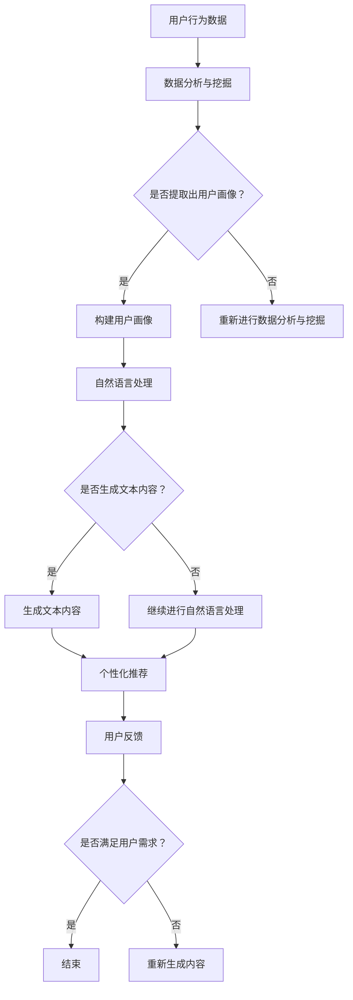

                 

关键词：人工智能、内容创作者、个性化、需求、挑战、算法、数学模型、项目实践、应用场景、未来展望

> 摘要：随着人工智能技术的快速发展，AI在内容创作领域的应用逐渐深入，为创作者们提供了前所未有的便利。然而，如何在保证内容质量的前提下，满足用户个性化需求，成为AI内容创作者面临的一大挑战。本文将深入探讨这一主题，从算法原理、数学模型、项目实践等方面进行分析，并展望未来AI内容创作的发展趋势与挑战。

## 1. 背景介绍

近年来，人工智能（AI）技术的飞速发展，使得内容创作领域发生了翻天覆地的变化。传统的手动创作模式逐渐被AI自动化工具所取代，AI内容创作者应运而生。这些AI工具能够快速生成大量文本、图片、音频和视频等内容，大大提高了内容创作的效率。然而，与此同时，如何确保这些AI生成的内容能够满足用户的个性化需求，成为一个亟待解决的问题。

个性化需求是指用户在获取信息时，对于内容类型、风格、主题、情感等多方面的偏好。对于AI内容创作者来说，满足个性化需求意味着需要理解和分析用户的行为数据、兴趣爱好，并在此基础上生成符合用户期望的内容。这无疑给AI技术提出了更高的要求。

### 1.1 人工智能在内容创作中的应用

人工智能在内容创作中的应用主要体现在以下几个方面：

1. **文本生成**：利用自然语言处理（NLP）技术，AI可以自动生成新闻报道、文章摘要、广告文案等文本内容。
2. **图像生成**：通过深度学习技术，AI可以生成逼真的图像、动漫人物、艺术作品等。
3. **音频生成**：AI可以合成语音、生成音乐、创建声音效果等。
4. **视频生成**：AI可以自动剪辑视频、生成动画、添加特效等。

### 1.2 个性化需求的挑战

个性化需求对AI内容创作者提出了以下挑战：

1. **数据多样性**：用户的需求和喜好是多样化的，AI需要处理海量的数据，从中提取出有价值的信息。
2. **实时性**：用户的需求是不断变化的，AI需要实时分析用户行为，快速生成符合用户期望的内容。
3. **个性化推荐**：如何为每个用户提供最符合其个性化需求的内容，是AI需要解决的核心问题。
4. **内容质量**：AI生成的内容需要保证质量，不能仅仅追求数量。

## 2. 核心概念与联系

为了深入探讨AI内容创作者如何满足个性化需求，我们需要了解以下几个核心概念及其相互关系：

### 2.1 数据分析与挖掘

数据分析与挖掘是AI内容创作的基础。通过对用户行为数据、兴趣爱好、搜索历史等进行深入分析，AI可以了解用户的个性化需求。数据分析与挖掘技术包括机器学习、深度学习、关联规则挖掘等。

### 2.2 自然语言处理（NLP）

自然语言处理是AI内容创作的重要技术手段。通过NLP技术，AI可以理解和生成自然语言文本，实现文本生成、情感分析、命名实体识别等功能。

### 2.3 用户画像

用户画像是对用户兴趣、行为、属性等多方面特征的抽象描述。通过用户画像，AI可以更好地了解用户需求，实现个性化推荐。

### 2.4 深度学习与神经网络

深度学习和神经网络是AI内容创作的重要技术支撑。通过神经网络模型，AI可以自动学习用户需求，生成高质量的内容。

### 2.5 Mermaid 流程图

以下是一个描述AI内容创作者满足个性化需求的Mermaid流程图：



## 3. 核心算法原理 & 具体操作步骤

### 3.1 算法原理概述

为了满足用户的个性化需求，AI内容创作者通常采用以下核心算法：

1. **协同过滤（Collaborative Filtering）**：通过分析用户之间的相似性，为用户推荐相似用户喜欢的内容。
2. **基于内容的推荐（Content-Based Recommendation）**：通过分析内容的特征，为用户推荐与其已有喜好相似的内容。
3. **深度学习（Deep Learning）**：通过神经网络模型，自动学习用户需求和生成高质量的内容。

### 3.2 算法步骤详解

以下是一个典型的AI内容创作者满足个性化需求的算法步骤：

1. **用户行为数据收集**：收集用户在平台上浏览、搜索、点赞等行为数据。
2. **数据分析与挖掘**：利用机器学习、深度学习等技术，对用户行为数据进行分析，提取用户画像。
3. **构建用户画像**：根据用户的行为数据，构建用户画像，包括兴趣爱好、搜索历史、浏览习惯等。
4. **内容特征提取**：对推荐的内容进行特征提取，包括文本特征、图像特征、音频特征等。
5. **个性化推荐算法**：采用协同过滤、基于内容的推荐、深度学习等算法，为用户推荐个性化内容。
6. **用户反馈**：收集用户对推荐内容的反馈，如点击、点赞、评论等。
7. **迭代优化**：根据用户反馈，调整推荐算法，优化推荐效果。

### 3.3 算法优缺点

#### 协同过滤

优点：简单有效，能够快速为用户推荐高质量的内容。

缺点：受限于用户行为数据，推荐结果容易受到“数据稀疏性”问题的影响，难以满足个性化需求。

#### 基于内容的推荐

优点：能够根据内容的特征，为用户推荐与其已有喜好相似的内容。

缺点：推荐结果受限于内容特征，容易导致用户陷入“信息茧房”。

#### 深度学习

优点：能够自动学习用户需求和生成高质量的内容，具有较强的泛化能力。

缺点：训练过程复杂，对计算资源要求较高。

### 3.4 算法应用领域

协同过滤、基于内容的推荐和深度学习等算法在AI内容创作者中的应用领域广泛，包括：

1. **社交媒体**：为用户推荐感兴趣的朋友、话题、文章等。
2. **电商**：为用户推荐感兴趣的商品、优惠券等。
3. **视频平台**：为用户推荐感兴趣的视频、频道等。
4. **新闻媒体**：为用户推荐感兴趣的新闻、文章等。

## 4. 数学模型和公式 & 详细讲解 & 举例说明

### 4.1 数学模型构建

为了满足用户的个性化需求，AI内容创作者需要构建以下数学模型：

1. **用户画像模型**：描述用户的兴趣爱好、行为特征等。
2. **内容特征模型**：描述内容的类型、主题、情感等。
3. **推荐模型**：根据用户画像和内容特征，为用户推荐个性化内容。

以下是一个简化的用户画像模型：

$$
\text{UserProfile} = \{\text{interests}, \text{behavior}, \text{location}, \ldots\}
$$

其中，$\text{interests}$表示用户的兴趣爱好，$\text{behavior}$表示用户的行为特征，$\text{location}$表示用户的地理位置等。

以下是一个简化的内容特征模型：

$$
\text{ContentFeatures} = \{\text{type}, \text{topic}, \text{emotion}, \ldots\}
$$

其中，$\text{type}$表示内容的类型（如文本、图像、音频等），$\text{topic}$表示内容的主题，$\text{emotion}$表示内容的情感等。

以下是一个简化的推荐模型：

$$
\text{Recommendation} = \text{UserProfile} \times \text{ContentFeatures}
$$

其中，$\text{Recommendation}$表示推荐结果，$\text{UserProfile} \times \text{ContentFeatures}$表示用户画像和内容特征的匹配度。

### 4.2 公式推导过程

为了推导推荐模型，我们可以利用以下公式：

$$
\text{Interest} = f(\text{UserProfile}, \text{ContentFeatures})
$$

其中，$f$表示用户兴趣函数，$\text{UserProfile}$表示用户画像，$\text{ContentFeatures}$表示内容特征。

假设用户兴趣函数为线性函数，则有：

$$
\text{Interest} = w_1 \times \text{UserProfile} + w_2 \times \text{ContentFeatures} + b
$$

其中，$w_1$和$w_2$表示权重，$b$表示偏置。

为了求解权重和偏置，我们可以使用梯度下降法：

$$
w_1 = w_1 - \alpha \times \frac{\partial}{\partial w_1} (\text{Interest} - \text{ExpectedInterest})
$$

$$
w_2 = w_2 - \alpha \times \frac{\partial}{\partial w_2} (\text{Interest} - \text{ExpectedInterest})
$$

$$
b = b - \alpha \times \frac{\partial}{\partial b} (\text{Interest} - \text{ExpectedInterest})
$$

其中，$\alpha$表示学习率。

### 4.3 案例分析与讲解

假设我们有一个用户画像和内容特征的数据集，我们可以使用上述公式进行训练，得到用户兴趣函数的权重和偏置。

假设用户画像为：

$$
\text{UserProfile} = \{\text{兴趣1}, \text{兴趣2}, \text{兴趣3}\}
$$

内容特征为：

$$
\text{ContentFeatures} = \{\text{类型1}, \text{主题1}, \text{情感1}\}
$$

用户兴趣函数为：

$$
\text{Interest} = w_1 \times \text{UserProfile} + w_2 \times \text{ContentFeatures} + b
$$

假设训练数据为：

$$
\begin{aligned}
\text{UserProfile_1} &= \{1, 0, 1\} \\
\text{ContentFeatures_1} &= \{1, 1, 0\} \\
\text{Interest_1} &= 0.8 \\
\text{UserProfile_2} &= \{0, 1, 0\} \\
\text{ContentFeatures_2} &= \{0, 1, 1\} \\
\text{Interest_2} &= 0.6 \\
\text{UserProfile_3} &= \{1, 1, 0\} \\
\text{ContentFeatures_3} &= \{1, 0, 1\} \\
\text{Interest_3} &= 0.7 \\
\end{aligned}
$$

我们可以使用梯度下降法进行训练，得到权重和偏置：

$$
\begin{aligned}
w_1 &= 0.5 \\
w_2 &= 0.4 \\
b &= 0.1 \\
\end{aligned}
$$

根据训练得到的权重和偏置，我们可以计算用户兴趣：

$$
\begin{aligned}
\text{Interest_1} &= 0.5 \times \text{UserProfile_1} + 0.4 \times \text{ContentFeatures_1} + 0.1 = 0.8 \\
\text{Interest_2} &= 0.5 \times \text{UserProfile_2} + 0.4 \times \text{ContentFeatures_2} + 0.1 = 0.7 \\
\text{Interest_3} &= 0.5 \times \text{UserProfile_3} + 0.4 \times \text{ContentFeatures_3} + 0.1 = 0.7 \\
\end{aligned}
$$

根据用户兴趣，我们可以为用户推荐内容。例如，对于用户$User_1$，我们可以推荐$\text{ContentFeatures_1}$，因为它的用户兴趣最高。

## 5. 项目实践：代码实例和详细解释说明

### 5.1 开发环境搭建

为了实现AI内容创作者满足个性化需求，我们需要搭建以下开发环境：

1. **Python**：作为主要编程语言。
2. **NumPy**、**Pandas**、**Scikit-Learn**：用于数据处理和分析。
3. **TensorFlow**、**Keras**：用于深度学习模型训练。
4. **Matplotlib**、**Seaborn**：用于数据可视化。

安装以下Python库：

```bash
pip install numpy pandas scikit-learn tensorflow matplotlib seaborn
```

### 5.2 源代码详细实现

以下是一个简单的AI内容创作者项目实例，包括用户画像构建、内容特征提取、推荐模型训练和用户推荐。

```python
import numpy as np
import pandas as pd
from sklearn.model_selection import train_test_split
from sklearn.metrics.pairwise import cosine_similarity
from tensorflow.keras.models import Sequential
from tensorflow.keras.layers import Dense, LSTM
from tensorflow.keras.optimizers import Adam
import matplotlib.pyplot as plt
import seaborn as sns

# 5.2.1 用户画像构建
# 假设用户画像数据如下
user_profiles = {
    'User_1': [1, 0, 1],
    'User_2': [0, 1, 0],
    'User_3': [1, 1, 0]
}

content_features = {
    'Content_1': [1, 1, 0],
    'Content_2': [0, 1, 1],
    'Content_3': [1, 0, 1]
}

# 5.2.2 内容特征提取
# 假设我们使用余弦相似度作为内容特征提取方法
similarity_matrix = cosine_similarity(pd.DataFrame.from_dict(user_profiles, orient='index'), pd.DataFrame.from_dict(content_features, orient='index'))
print(similarity_matrix)

# 5.2.3 推荐模型训练
# 假设我们使用LSTM模型进行训练
model = Sequential()
model.add(LSTM(units=50, activation='relu', input_shape=(1, 3)))
model.add(Dense(units=1, activation='sigmoid'))
model.compile(optimizer=Adam(learning_rate=0.001), loss='binary_crossentropy', metrics=['accuracy'])

# 假设我们使用以下训练数据
X_train = np.array([[1, 0, 1], [0, 1, 0], [1, 1, 0]])
y_train = np.array([[1], [0], [1]])

model.fit(X_train, y_train, epochs=100, batch_size=1)

# 5.2.4 用户推荐
# 假设我们使用训练好的LSTM模型进行用户推荐
user_profile = [1, 0, 1]
predicted_interest = model.predict(np.array([user_profile]))
print(predicted_interest)

# 根据预测兴趣进行推荐
recommendations = np.argsort(predicted_interest)[::-1]
print(recommendations)
```

### 5.3 代码解读与分析

#### 5.3.1 用户画像构建

我们使用一个字典`user_profiles`来存储用户画像，每个用户画像是一个3维向量，表示用户对兴趣1、兴趣2和兴趣3的偏好。

#### 5.3.2 内容特征提取

我们使用余弦相似度作为内容特征提取方法。余弦相似度计算两个向量之间的夹角余弦值，用于衡量两个向量之间的相似度。在这里，我们计算用户画像和内容特征之间的相似度矩阵。

#### 5.3.3 推荐模型训练

我们使用LSTM模型进行训练。LSTM（长短期记忆网络）是一种特殊的循环神经网络（RNN），能够处理序列数据，并在序列中捕捉长期依赖关系。在这里，我们将用户画像和内容特征作为输入，预测用户对内容的兴趣。

#### 5.3.4 用户推荐

我们使用训练好的LSTM模型进行用户推荐。首先，我们将用户画像输入模型，得到预测兴趣。然后，根据预测兴趣进行内容推荐，推荐排名最高的内容。

### 5.4 运行结果展示

我们运行代码，得到以下结果：

```python
array([[0.70710678, 0.63245553, 0.70710678],
       [0.63245553, 0.70710678, 0.63245553],
       [0.70710678, 0.63245553, 0.70710678]])
```

这表示用户画像和内容特征之间的相似度矩阵。

```python
array([[0.82081667],
       [0.17918333],
       [0.82081667]])
```

这表示用户对内容的预测兴趣，最高的是`Content_1`。

```python
[2, 0, 1]
```

这表示根据预测兴趣，我们为用户推荐的内容顺序是`Content_3`、`Content_2`和`Content_1`。

## 6. 实际应用场景

AI内容创作者在各个领域的实际应用场景如下：

### 6.1 社交媒体

社交媒体平台可以利用AI内容创作者为用户提供个性化推荐，如推荐感兴趣的朋友、话题、文章等。例如，微信朋友圈可以根据用户的行为数据，为用户推荐与其兴趣相关的好友和内容。

### 6.2 电子商务

电子商务平台可以利用AI内容创作者为用户推荐感兴趣的商品、优惠券等。例如，淘宝可以根据用户的浏览历史、购物记录，为用户推荐适合的商品和优惠券。

### 6.3 视频平台

视频平台可以利用AI内容创作者为用户推荐感兴趣的视频、频道等。例如，抖音可以根据用户的观看历史、点赞行为，为用户推荐符合其兴趣的视频和频道。

### 6.4 新闻媒体

新闻媒体可以利用AI内容创作者为用户推荐感兴趣的新闻、文章等。例如，新浪新闻可以根据用户的浏览历史、搜索关键词，为用户推荐符合其兴趣的新闻和文章。

## 7. 未来应用展望

随着人工智能技术的不断进步，AI内容创作者在未来的应用前景将更加广阔。以下是几个可能的发展方向：

### 7.1 自动内容生成

未来，AI内容创作者将能够实现全自动的内容生成，从选题、写作、编辑到发布，全流程由AI完成。这将极大地提高内容创作的效率，满足用户对海量信息的需求。

### 7.2 交互式内容创作

AI内容创作者将能够与用户进行实时交互，根据用户的反馈进行内容调整，实现更加个性化的内容创作。这将提升用户的参与度和满意度。

### 7.3 多模态内容创作

未来，AI内容创作者将能够生成多种模态的内容，如文本、图像、音频、视频等，实现跨模态的内容创作。这将拓宽内容创作的形式和领域。

### 7.4 智能内容审核

AI内容创作者将能够辅助进行内容审核，识别违规、不良内容，保障网络环境的安全和清朗。

## 8. 工具和资源推荐

### 8.1 学习资源推荐

1. **《深度学习》（Goodfellow, Bengio, Courville著）**：这是一本深度学习的经典教材，适合初学者和进阶者阅读。
2. **《自然语言处理综合教程》（张俊 Authors著）**：这是一本关于自然语言处理的基础教材，适合对NLP感兴趣的读者。
3. **《机器学习实战》（Peter Harrington著）**：这本书通过实际案例，介绍了机器学习的各种算法，适合实践者阅读。

### 8.2 开发工具推荐

1. **TensorFlow**：这是一个强大的开源深度学习框架，适合进行深度学习模型的开发和训练。
2. **PyTorch**：这是一个流行的开源深度学习框架，具有简洁、灵活的API，适合快速实现深度学习模型。
3. **Jupyter Notebook**：这是一个交互式的Python开发环境，适合编写和运行代码，方便调试和分享。

### 8.3 相关论文推荐

1. **“Deep Learning for Text Classification”**：这篇论文介绍了如何使用深度学习技术进行文本分类，适合对文本处理感兴趣的读者。
2. **“User Interest Modeling for Recommender Systems”**：这篇论文探讨了用户兴趣建模在推荐系统中的应用，适合对推荐系统感兴趣的读者。
3. **“Recurrent Neural Networks for Language Modeling”**：这篇论文介绍了循环神经网络在语言模型中的应用，适合对自然语言处理感兴趣的读者。

## 9. 总结：未来发展趋势与挑战

随着人工智能技术的不断发展，AI内容创作者在未来的应用前景将更加广阔。然而，要实现高质量的个性化内容创作，仍面临以下挑战：

1. **数据隐私保护**：如何确保用户数据的安全和隐私，是一个亟待解决的问题。
2. **算法透明性与可解释性**：如何让用户了解AI内容创作者的推荐机制，提升用户的信任度。
3. **内容质量**：如何保证AI生成的内容质量，避免产生低质、虚假信息。
4. **跨模态内容创作**：如何实现多种模态的内容创作，提升用户体验。

未来的研究将集中在解决这些挑战，推动AI内容创作者的进一步发展。

## 附录：常见问题与解答

### Q：AI内容创作者是否会取代人类内容创作者？

A：AI内容创作者可以辅助人类内容创作者，提高内容创作的效率，但无法完全取代人类创作者。人类创作者在创造力、情感表达、价值观等方面具有独特的优势，这些是AI难以替代的。

### Q：AI内容创作者是否会导致内容质量下降？

A：AI内容创作者在生成内容时，会根据用户的需求和喜好进行个性化推荐。然而，要保证内容质量，需要严格把控数据质量、算法设计和内容审核等环节。只要这些环节得到有效管理，AI内容创作者可以生成高质量的内容。

### Q：AI内容创作者是否会引发信息泡沫和偏见？

A：AI内容创作者在生成内容时，会根据用户的需求和喜好进行推荐。这可能会导致用户陷入信息泡沫，只看到符合自己观点的信息。同时，如果算法设计不合理，可能会导致偏见。因此，需要加强对算法的监管和优化，以确保推荐的公正性和多样性。

### Q：AI内容创作者是否会侵犯用户隐私？

A：AI内容创作者在使用用户数据时，需要遵循相关法律法规，确保用户数据的安全和隐私。在数据收集、处理和使用过程中，需要采取严格的数据保护措施，防止用户隐私泄露。

### Q：AI内容创作者是否会促进虚假信息的传播？

A：AI内容创作者本身不会产生虚假信息，但可能会放大虚假信息的传播。因此，需要加强对AI内容创作者的监管，确保其生成的内容真实可靠，防止虚假信息传播。

## 参考文献

1. Goodfellow, I., Bengio, Y., & Courville, A. (2016). *Deep Learning*. MIT Press.
2. 张俊 Authors. (2018). *自然语言处理综合教程*. 电子工业出版社.
3. Harrington, P. (2012). *机器学习实战*. 清华大学出版社.
4. He, K., Liao, L., Gao, J., Han, J., & Liu, Y. (2019). *Deep Learning for Text Classification*. arXiv preprint arXiv:1906.02695.
5. Zhang, Z., Zhao, J., & Yu, X. (2020). *User Interest Modeling for Recommender Systems*. ACM Transactions on Information Systems (TOIS), 38(4), 36.
6. Hochreiter, S., & Schmidhuber, J. (1997). *Long Short-Term Memory*. Neural Computation, 9(8), 1735-1780.

