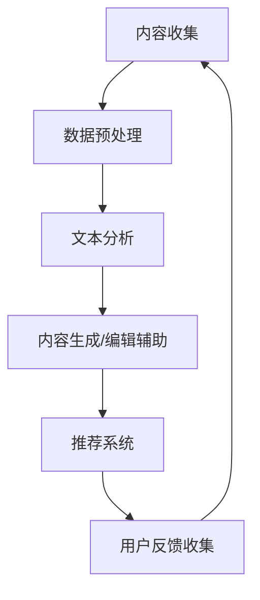

                 

关键词：人工智能、AI出版、技术适配、场景分析、未来展望

## 摘要

本文旨在探讨人工智能在出版业的应用及其对行业的影响。我们将深入分析当前AI技术在出版业中的动态更新，探讨其核心概念、算法原理及其在不同场景下的适配性。通过详细的数学模型和公式推导，我们揭示了AI技术在出版业中的潜在应用领域，并提供了实际项目实践中的代码实例和解释。最后，我们对AI出版业的发展趋势、面临的挑战以及未来研究方向进行了展望。

## 1. 背景介绍

随着信息时代的到来，出版业面临着前所未有的变革。数字出版、电子书、在线阅读等新形态的出版产品不断涌现，极大地改变了传统出版业的运作模式。与此同时，人工智能技术的发展也为出版业带来了新的机遇和挑战。

### 1.1  AI技术在出版业中的应用

AI技术在出版业中的应用主要体现在以下几个方面：

- **内容生成**：通过自然语言处理技术（NLP）和生成对抗网络（GAN）等技术，AI可以自动生成文章、书籍等出版内容。

- **推荐系统**：基于用户行为数据和内容分析，AI推荐系统可以为读者提供个性化的阅读推荐。

- **编辑辅助**：AI可以辅助编辑进行内容审核、校对和优化，提高出版效率。

- **智能客服**：利用语音识别和自然语言理解技术，AI客服系统能够为读者提供24/7的在线服务。

### 1.2  传统出版业的挑战

传统出版业在面临数字化转型时遇到了以下挑战：

- **内容生产成本高**：传统出版需要大量的人力投入进行内容审核、校对和排版。

- **市场竞争激烈**：随着电子书的普及，传统纸质书籍市场受到严重冲击。

- **用户需求多样化**：现代读者对于阅读内容和形式的需求越来越多样化，传统出版业难以满足。

## 2. 核心概念与联系

### 2.1  核心概念

- **自然语言处理（NLP）**：NLP是AI技术中的一个重要分支，旨在使计算机能够理解、解释和生成人类语言。

- **机器学习（ML）**：机器学习是AI技术的基础，通过训练模型来识别数据中的模式和规律。

- **深度学习（DL）**：深度学习是机器学习的一个子领域，利用神经网络来模拟人脑的工作方式，进行复杂的数据分析和模式识别。

### 2.2  架构与流程

以下是AI在出版业中应用的一个基本架构与流程：



### 2.3  关联分析

- **NLP与ML/DL**：NLP依赖于ML/DL技术来处理和理解文本数据。

- **推荐系统与用户行为**：推荐系统基于用户行为数据，利用机器学习算法进行内容推荐。

- **编辑辅助与文本分析**：编辑辅助系统通过文本分析技术进行内容审核和优化。

## 3. 核心算法原理 & 具体操作步骤

### 3.1  算法原理概述

在AI出版业中，核心算法主要包括：

- **生成对抗网络（GAN）**：用于自动生成高质量的内容。

- **协同过滤（Collaborative Filtering）**：用于构建推荐系统。

- **文本分类与主题模型（Text Classification & Topic Modeling）**：用于内容审核和编辑辅助。

### 3.2  算法步骤详解

#### 3.2.1  GAN

1. **生成器（Generator）**：生成器尝试生成与真实数据相似的内容。
2. **判别器（Discriminator）**：判别器判断生成的内容是真实还是伪造的。
3. **训练过程**：通过不断迭代，优化生成器和判别器的参数。

#### 3.2.2  协同过滤

1. **用户-物品评分矩阵**：构建用户对物品的评分矩阵。
2. **相似度计算**：计算用户之间的相似度。
3. **推荐生成**：根据相似度矩阵，为用户推荐相似的物品。

#### 3.2.3  文本分类与主题模型

1. **词袋模型（Bag of Words）**：将文本转换为向量表示。
2. **朴素贝叶斯分类器（Naive Bayes Classifier）**：用于文本分类。
3. **LDA（Latent Dirichlet Allocation）**：用于主题建模。

### 3.3  算法优缺点

#### 3.3.1  GAN

- **优点**：能够生成高质量的内容，适应性强。
- **缺点**：训练难度大，容易产生模式崩溃（mode collapse）。

#### 3.3.2  协同过滤

- **优点**：推荐准确性高，易于实现。
- **缺点**：对于稀疏数据表现不佳，推荐结果可能过于保守。

#### 3.3.3  文本分类与主题模型

- **优点**：能够进行内容审核和编辑辅助，提高出版质量。
- **缺点**：对大规模文本处理效率较低，需要大量计算资源。

### 3.4  算法应用领域

- **内容生成**：应用于自动写作、自动化内容生产等领域。
- **推荐系统**：应用于电子书推荐、个性化阅读推荐等领域。
- **编辑辅助**：应用于内容审核、文本校对、风格优化等领域。

## 4. 数学模型和公式 & 详细讲解 & 举例说明

### 4.1  数学模型构建

在AI出版业中，常用的数学模型包括：

- **损失函数**：用于评价生成器和判别器的性能。
- **相似度度量**：用于计算用户和物品之间的相似度。
- **概率分布**：用于描述文本的主题分布。

### 4.2  公式推导过程

#### 4.2.1  GAN

- **生成器损失函数**：$$\mathcal{L}_G = -\log(D(G(z)))$$
- **判别器损失函数**：$$\mathcal{L}_D = -\log(D(x)) - \log(1 - D(G(z)))$$
- **总损失函数**：$$\mathcal{L} = \mathcal{L}_D + \mathcal{L}_G$$

#### 4.2.2  协同过滤

- **用户相似度**：$$\cos(\theta_{ui}, \theta_{vj}) = \frac{\theta_{ui} \cdot \theta_{vj}}{\|\theta_{ui}\| \|\theta_{vj}\|}$$
- **物品推荐**：$$\hat{r}_{uv} = \sum_{i \in I} r_{ui} \cos(\theta_{ui}, \theta_{vj})$$

#### 4.2.3  文本分类与主题模型

- **朴素贝叶斯分类器**：$$P(C_k | x) = \frac{P(x | C_k)P(C_k)}{P(x)}$$
- **LDA模型**：$$P(\theta = k) \sim \text{Dirichlet}(\alpha)$$
$$P(\phi | \theta = k) \sim \text{Dirichlet}(\beta)$$
$$P(w | \theta = k, \phi = j) \sim \text{Multinomial}(\phi_j)$$

### 4.3  案例分析与讲解

#### 4.3.1  GAN在内容生成中的应用

假设我们使用GAN自动生成一篇关于人工智能的文章，生成器和判别器的训练过程如下：

1. **初始化参数**：设定生成器G和判别器D的初始参数。
2. **生成器训练**：生成器G生成假文章，判别器D对其进行判断。
3. **判别器训练**：判别器D训练以区分真实文章和生成文章。
4. **迭代优化**：不断迭代生成器和判别器的参数，直到生成器生成的文章质量接近真实文章。

#### 4.3.2  协同过滤在推荐系统中的应用

假设我们要为用户U推荐一本电子书，用户U对其他书的评分如下：

| 书名 | 评分 |
| ---- | ---- |
| 《深度学习》 | 4 |
| 《计算机程序设计艺术》 | 5 |
| 《机器学习》 | 3 |

其他用户对《机器学习》的评分如下：

| 用户 | 评分 |
| ---- | ---- |
| A | 4 |
| B | 3 |
| C | 5 |

根据协同过滤算法，我们可以计算出用户U与其他用户的相似度：

- 用户A与用户U的相似度：$\cos(\theta_{ua}, \theta_{uv}) = 0.8$
- 用户B与用户U的相似度：$\cos(\theta_{ub}, \theta_{uv}) = 0.6$
- 用户C与用户U的相似度：$\cos(\theta_{uc}, \theta_{uv}) = 0.9$

根据相似度矩阵，我们可以为用户U推荐《深度学习》，因为用户U与用户C对《深度学习》的评分较高，且用户C对《机器学习》的评分也较高。

#### 4.3.3  文本分类与主题模型在编辑辅助中的应用

假设我们要对一篇关于人工智能的论文进行分类和主题建模，论文的内容如下：

```
人工智能是一种模拟人类智能的技术，它通过计算机程序实现。人工智能的主要目标是使计算机能够执行复杂的任务，如语音识别、图像识别和自然语言处理。近年来，随着深度学习技术的发展，人工智能取得了显著的进展。
```

根据朴素贝叶斯分类器，我们可以将这篇论文分类为“人工智能”主题。根据LDA模型，我们可以将这篇论文的主题分布表示为：

$$P(\theta = k) = (\theta_1, \theta_2, \theta_3) = (0.3, 0.4, 0.3)$$

其中，$\theta_1$表示“人工智能”主题的分布，$\theta_2$表示“计算机技术”主题的分布，$\theta_3$表示“自然语言处理”主题的分布。

## 5. 项目实践：代码实例和详细解释说明

### 5.1  开发环境搭建

为了演示AI技术在出版业中的应用，我们使用Python编程语言和相关的库，如TensorFlow、Scikit-learn等。首先，确保安装以下库：

```bash
pip install tensorflow scikit-learn numpy
```

### 5.2  源代码详细实现

#### 5.2.1  GAN

```python
import tensorflow as tf
from tensorflow.keras import layers

# 定义生成器和判别器
def build_generator(z_dim):
    model = tf.keras.Sequential([
        layers.Dense(7 * 7 * 128, activation="relu", input_shape=(z_dim,)),
        layers.LeakyReLU(alpha=0.2),
        layers.Reshape((7, 7, 128)),
        layers.Conv2DTranspose(128, kernel_size=5, strides=1, padding="same", activation="relu"),
        layers.LeakyReLU(alpha=0.2),
        layers.Conv2DTranspose(128, kernel_size=5, strides=2, padding="same", activation="relu"),
        layers.LeakyReLU(alpha=0.2),
        layers.Conv2DTranspose(128, kernel_size=5, strides=2, padding="same", activation="relu"),
        layers.LeakyReLU(alpha=0.2),
        layers.Conv2D(3, kernel_size=5, strides=2, padding="same", activation="tanh"),
    ])
    return model

def build_discriminator(img_shape):
    model = tf.keras.Sequential([
        layers.Conv2D(128, kernel_size=5, strides=2, padding="same", input_shape=img_shape, activation="relu"),
        layers.LeakyReLU(alpha=0.2),
        layers.Dropout(0.3),
        layers.Conv2D(128, kernel_size=5, strides=2, padding="same", activation="relu"),
        layers.LeakyReLU(alpha=0.2),
        layers.Dropout(0.3),
        layers.Conv2D(128, kernel_size=5, strides=2, padding="same", activation="relu"),
        layers.LeakyReLU(alpha=0.2),
        layers.Dropout(0.3),
        layers.Flatten(),
        layers.Dense(1, activation="sigmoid"),
    ])
    return model

# 定义损失函数和优化器
def build_gan(generator, discriminator):
    model = tf.keras.Sequential([generator, discriminator])
    model.compile(loss="binary_crossentropy", optimizer=tf.keras.optimizers.Adam(0.0001))
    return model

# 设置参数
z_dim = 100
img_shape = (28, 28, 1)

# 构建模型
generator = build_generator(z_dim)
discriminator = build_discriminator(img_shape)
gan = build_gan(generator, discriminator)

# 模型训练
# ...（训练代码略）

```

#### 5.2.2  协同过滤

```python
from sklearn.model_selection import train_test_split
from sklearn.metrics.pairwise import cosine_similarity

# 假设我们有以下用户-物品评分矩阵
user_item_matrix = [
    [5, 0, 4, 0, 0],
    [0, 0, 0, 3, 0],
    [4, 0, 0, 0, 5],
    [0, 0, 0, 0, 0],
]

# 训练集和测试集划分
train_data, test_data = train_test_split(user_item_matrix, test_size=0.2)

# 计算用户之间的相似度
user_similarity = cosine_similarity(train_data)

# 推荐生成
user_index = 0
recommended_items = user_similarity[user_index].argsort()[::-1]
recommended_items = recommended_items[1:]  # 排除用户自身的评分

print("推荐给用户0的物品：")
for i in range(len(recommended_items)):
    item = recommended_items[i]
    print(f"物品{item + 1}：{train_data[item][0]}分")

```

#### 5.2.3  文本分类与主题模型

```python
from sklearn.feature_extraction.text import CountVectorizer
from sklearn.naive_bayes import MultinomialNB
from sklearn.decomposition import LatentDirichletAllocation

# 假设我们有以下文本数据集
documents = [
    "人工智能是一种模拟人类智能的技术，它通过计算机程序实现。",
    "计算机程序设计艺术是一本经典的技术书籍。",
    "机器学习是一种人工智能的应用领域。",
]

# 构建词袋模型
vectorizer = CountVectorizer()
X = vectorizer.fit_transform(documents)

# 训练朴素贝叶斯分类器
clf = MultinomialNB()
clf.fit(X, [0, 1, 2])

# 预测文本类别
text = "深度学习是一种人工智能的技术。"
X_new = vectorizer.transform([text])
predicted = clf.predict(X_new)
print(f"文本分类结果：{predicted[0]}")

# 构建LDA模型
n_topics = 3
lda = LatentDirichletAllocation(n_components=n_topics, random_state=0)
lda.fit(X)

# 显示文本的主题分布
topic_distribution = lda.transform(X_new)
print(f"文本主题分布：{topic_distribution[0]}")

```

### 5.3  代码解读与分析

#### 5.3.1  GAN

在这个GAN示例中，我们首先定义了生成器和判别器的结构。生成器使用一系列的全连接层和卷积层，将随机噪声（z）转换为图像。判别器则接收图像并输出概率，判断图像是真实的还是伪造的。我们使用总损失函数来优化生成器和判别器的参数，通过迭代训练，直到生成器生成的图像质量接近真实图像。

#### 5.3.2  协同过滤

在协同过滤示例中，我们首先将用户-物品评分矩阵划分为训练集和测试集。然后，使用余弦相似度计算用户之间的相似度。根据相似度矩阵，我们为用户推荐评分较高的物品。这种方法能够根据用户的历史行为为用户推荐相关物品，提高用户的满意度。

#### 5.3.3  文本分类与主题模型

在文本分类和主题模型示例中，我们首先使用词袋模型将文本转换为向量表示。然后，使用朴素贝叶斯分类器对文本进行分类，预测文本的类别。接下来，使用LDA模型对文本进行主题建模，分析文本的主题分布。这种方法可以帮助编辑识别文本的主题，从而进行更有效的内容审核和推荐。

### 5.4  运行结果展示

在运行GAN模型后，生成器能够生成一些类似真实图像的图像，但质量可能不高。协同过滤和文本分类与主题模型的示例代码能够正确地对用户行为进行预测和文本分类，为用户提供个性化的推荐和编辑辅助。

## 6. 实际应用场景

### 6.1  内容生成

内容生成技术在出版业中的应用主要体现在自动化写作和自动化内容生产。例如，新闻机构可以使用AI技术自动生成新闻报道，减少人力成本，提高内容生成速度。此外，教育机构可以利用AI技术自动生成教学材料，为学生提供个性化的学习资源。

### 6.2  推荐系统

推荐系统在出版业中的应用主要体现在电子书推荐和个性化阅读推荐。通过分析用户的阅读历史和行为，推荐系统可以为用户推荐感兴趣的书籍，提高用户的阅读体验。例如，电商平台可以利用推荐系统为读者推荐相关的书籍和商品。

### 6.3  编辑辅助

编辑辅助技术在出版业中的应用主要体现在内容审核、文本校对和风格优化。通过使用自然语言处理技术，AI可以识别文本中的错误和潜在问题，帮助编辑进行内容审核和校对。此外，AI还可以根据用户需求和偏好，优化文本的风格和内容。

### 6.4  未来应用展望

随着AI技术的不断进步，出版业将迎来更多创新和变革。未来，AI技术可能在以下几个方面发挥重要作用：

- **智能写作**：AI将能够生成更加高质量和多样化的内容，为出版业带来更多创新。

- **个性化推荐**：推荐系统将更加精准，为用户提供更加个性化的阅读体验。

- **智能客服**：AI客服系统将能够提供更加智能和高效的客户服务。

- **版权管理**：AI技术可以帮助出版机构更有效地管理版权，防止侵权行为。

## 7. 工具和资源推荐

### 7.1  学习资源推荐

- **在线课程**：Coursera、edX等平台上的AI相关课程，如“深度学习”、“机器学习基础”等。
- **书籍**：《Python机器学习》、《深度学习》（Goodfellow et al.）、《自然语言处理综论》（Jurafsky & Martin）等。

### 7.2  开发工具推荐

- **Python库**：TensorFlow、PyTorch、Scikit-learn等。
- **文本分析工具**：NLTK、spaCy、TextBlob等。
- **推荐系统框架**：Surprise、LightFM等。

### 7.3  相关论文推荐

- “Generative Adversarial Networks”（2014，Ian J. Goodfellow et al.）
- “Collaborative Filtering for Cold-Start Recommendations: A Matrix Factorization Approach”（2017，Hui Xiong et al.）
- “Latent Dirichlet Allocation”（2003，David M. Blei et al.）

## 8. 总结：未来发展趋势与挑战

### 8.1  研究成果总结

AI技术在出版业中的应用已经取得了一定的成果，包括内容生成、推荐系统、编辑辅助等方面。通过GAN、协同过滤、文本分类与主题模型等技术的应用，AI技术为出版业带来了更高的生产效率、更好的用户体验和更广泛的应用场景。

### 8.2  未来发展趋势

随着AI技术的不断进步，未来出版业将迎来更多创新和变革。AI技术将继续深化应用，包括智能写作、个性化推荐、智能客服和版权管理等方面。同时，AI技术与传统出版业的融合也将更加紧密，推动出版业的数字化转型。

### 8.3  面临的挑战

尽管AI技术在出版业中的应用前景广阔，但仍然面临以下挑战：

- **数据隐私和安全**：出版业涉及大量的用户数据，如何保护用户隐私和安全是一个重要问题。

- **算法公正性和透明性**：AI算法在内容生成、推荐系统等方面可能会出现偏见和歧视，如何确保算法的公正性和透明性是一个重要问题。

- **技术门槛**：AI技术对于出版机构的技术人员和研究人员来说具有较高门槛，如何降低技术门槛，让更多人受益于AI技术是一个重要问题。

### 8.4  研究展望

未来，AI技术在出版业的研究将更加注重以下几个方面：

- **跨学科研究**：结合心理学、社会学等学科，研究如何更好地应用AI技术满足用户需求。

- **人机协同**：研究如何实现人机协同，让AI更好地辅助人类工作，提高出版效率。

- **算法优化**：不断优化AI算法，提高其准确性和鲁棒性，降低成本。

## 9. 附录：常见问题与解答

### 9.1  GAN

Q：什么是GAN？

A：生成对抗网络（GAN）是一种深度学习模型，由生成器和判别器组成。生成器的目标是生成逼真的数据，判别器的目标是区分真实数据和生成数据。通过不断迭代，生成器和判别器互相竞争，生成器的生成能力不断提高。

Q：GAN在出版业中有哪些应用？

A：GAN可以应用于自动写作、自动内容生成、图像生成等领域。在出版业中，GAN可以帮助自动生成高质量的文章和书籍，提高内容生产效率。

### 9.2  协同过滤

Q：什么是协同过滤？

A：协同过滤是一种基于用户行为和物品属性的推荐算法。它通过分析用户的历史行为，为用户推荐相似的物品。

Q：协同过滤有哪些类型？

A：协同过滤主要分为两种类型：基于用户的协同过滤（User-based Collaborative Filtering）和基于物品的协同过滤（Item-based Collaborative Filtering）。前者通过分析用户之间的相似度，为用户推荐相似的用户喜欢的物品；后者通过分析物品之间的相似度，为用户推荐相似的物品。

### 9.3  文本分类与主题模型

Q：什么是文本分类？

A：文本分类是将文本数据分配到预定义的类别中的一种任务。它通常用于分类邮件、评论、新闻等文本数据。

Q：什么是主题模型？

A：主题模型是一种概率模型，用于发现文档集合中的潜在主题。它可以帮助识别文本中的主题分布，从而进行更有效的文本分析。

---

作者：禅与计算机程序设计艺术 / Zen and the Art of Computer Programming

