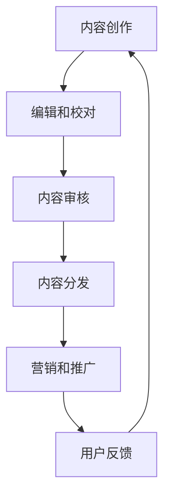

                 

 **关键词**：人工智能、出版业、场景驱动、技术创新、数据分析、深度学习、人机交互、个性化推荐、区块链技术、内容分发。

**摘要**：本文探讨了人工智能（AI）在出版业中的最新动态，特别是场景驱动的技术创新。文章首先回顾了出版业的历史和现状，然后深入分析了AI技术如何通过场景驱动的方式影响出版流程，包括内容创作、编辑、分发和营销等环节。接着，文章详细讨论了核心算法原理、数学模型、项目实践和实际应用场景，并展望了未来的发展趋势与挑战。最后，文章推荐了一些学习资源和开发工具，总结了研究成果，并对未来的研究方向提出了展望。

## 1. 背景介绍

出版业是知识传播和智力创新的重要载体，自人类文明史以来一直发挥着不可或缺的作用。然而，随着信息技术的飞速发展，传统的出版业面临着前所未有的挑战和机遇。特别是人工智能技术的不断进步，使得出版业迎来了场景驱动的创新浪潮。

### 1.1 出版业的历史与现状

出版业的历史可以追溯到古代的书籍刻印和手工抄写。随着印刷术的发明，出版业进入了一个新的阶段，书籍的印刷和分发效率大幅提高。到了20世纪，随着计算机和互联网的普及，出版业逐渐实现了数字化。电子书、在线出版、数字内容分发等新形态的出版模式迅速崛起，极大地改变了人们的阅读习惯和内容获取方式。

然而，传统出版业仍然面临诸多挑战。首先，内容创作和编辑流程繁琐，效率低下。其次，传统营销手段单一，难以实现精准投放。此外，内容分发渠道有限，用户获取内容的难度较大。最后，出版物的版权保护和内容质量控制也是一大难题。

### 1.2 人工智能技术的崛起

人工智能技术，特别是深度学习、自然语言处理和机器学习，近年来取得了巨大的突破。这些技术的发展为出版业提供了强大的工具和平台，使得场景驱动的创新成为可能。

首先，AI技术可以帮助出版业实现自动化内容创作和编辑，提高生产效率。其次，基于用户数据的个性化推荐系统能够精准定位用户需求，提升用户体验。此外，AI技术还可以在内容分发、版权保护和内容质量控制等方面发挥重要作用。

## 2. 核心概念与联系

为了更好地理解AI技术在出版业中的应用，我们需要明确几个核心概念，并探讨它们之间的联系。

### 2.1 深度学习

深度学习是机器学习的一个分支，它通过模拟人脑的神经网络结构来实现对数据的自动学习和模式识别。在出版业中，深度学习可以用于文本分析、情感识别和自动摘要等任务。

### 2.2 自然语言处理

自然语言处理（NLP）是AI技术的一个子领域，它专注于使计算机能够理解、生成和解释人类语言。在出版业中，NLP可以用于内容审核、情感分析和自动翻译等。

### 2.3 机器学习

机器学习是AI的核心技术之一，它通过训练模型来从数据中学习规律，并在新的数据上进行预测和决策。在出版业中，机器学习可以用于用户行为分析、推荐系统和广告投放等。

### 2.4 场景驱动

场景驱动是指根据特定的应用场景来设计和优化AI算法，使其更好地满足特定需求。在出版业中，场景驱动意味着根据用户阅读行为、内容特点和市场趋势来定制化AI技术，以实现更高的效率和更好的用户体验。

### 2.5 Mermaid 流程图

为了更直观地展示AI技术在出版业中的应用，我们可以使用Mermaid流程图来描述各环节之间的联系。



在这个流程图中，各环节之间相互关联，形成一个闭环系统。用户反馈作为重要输入，不断影响后续环节，从而实现持续优化。

## 3. 核心算法原理 & 具体操作步骤

### 3.1 算法原理概述

AI技术在出版业中的应用主要基于以下几种核心算法：

- **深度学习**：用于文本分析、情感识别和自动摘要等。
- **自然语言处理**：用于内容审核、情感分析和自动翻译等。
- **机器学习**：用于用户行为分析、推荐系统和广告投放等。

这些算法通过大量的数据训练，形成能够自主学习和优化模型的系统。

### 3.2 算法步骤详解

以下是AI技术在出版业中的一些典型应用步骤：

#### 3.2.1 内容创作

1. **数据收集**：从各类数据源（如社交媒体、新闻网站、专业数据库等）收集相关内容。
2. **预处理**：对收集到的文本数据进行清洗、去噪和格式化。
3. **文本分析**：使用深度学习模型进行文本分类、情感分析和关键词提取。
4. **内容生成**：基于分析结果，生成新的内容或摘要。

#### 3.2.2 编辑和校对

1. **内容审核**：使用自然语言处理技术对内容进行审核，检测可能的不良信息或违规内容。
2. **情感分析**：分析内容中的情感倾向，确保内容符合出版标准。
3. **校对和修正**：基于机器学习模型对内容进行语法和拼写检查，自动纠正错误。

#### 3.2.3 内容分发

1. **用户画像**：通过用户行为数据构建用户画像，了解用户偏好。
2. **个性化推荐**：基于用户画像，使用推荐算法为用户推荐感兴趣的内容。
3. **广告投放**：根据用户画像和内容特点，实现精准广告投放。

#### 3.2.4 营销和推广

1. **数据挖掘**：通过数据分析，挖掘潜在的用户需求和市场趋势。
2. **营销策略**：基于数据挖掘结果，制定个性化的营销策略。
3. **效果评估**：通过A/B测试等方法，评估营销策略的效果，并进行优化。

### 3.3 算法优缺点

**深度学习**：

- **优点**：强大的文本分析和模式识别能力。
- **缺点**：需要大量的数据和计算资源，模型训练时间较长。

**自然语言处理**：

- **优点**：能够理解和生成人类语言，提高内容审核和自动翻译的准确性。
- **缺点**：对语言理解和复杂场景的处理能力有限。

**机器学习**：

- **优点**：能够从数据中学习，实现自动化和智能化的决策。
- **缺点**：对数据质量和特征工程要求较高，模型解释性较差。

### 3.4 算法应用领域

AI技术在出版业中的应用领域非常广泛，主要包括：

- **内容创作和编辑**：自动化内容生成、校对和审核。
- **内容分发和推荐**：个性化推荐、精准广告投放。
- **营销和推广**：用户行为分析、数据挖掘和营销策略优化。
- **版权保护和内容质量控制**：版权追踪、内容审核和去重。

## 4. 数学模型和公式 & 详细讲解 & 举例说明

### 4.1 数学模型构建

在AI技术中，数学模型是核心组成部分。以下是几种常用的数学模型：

#### 4.1.1 深度学习模型

深度学习模型通常由多层神经网络组成，包括输入层、隐藏层和输出层。每一层由多个神经元（节点）组成，神经元之间的连接权值通过训练调整。

#### 4.1.2 自然语言处理模型

自然语言处理模型主要包括词嵌入（word embeddings）和循环神经网络（RNN）。词嵌入将文本转换为密集向量的表示，RNN用于处理序列数据。

#### 4.1.3 机器学习模型

机器学习模型包括分类模型、回归模型和聚类模型。常用的分类模型有逻辑回归、支持向量机和决策树等。

### 4.2 公式推导过程

以深度学习中的反向传播算法为例，简要介绍公式推导过程：

1. **损失函数**：

   损失函数用于衡量模型预测结果与真实值之间的差距。常用的损失函数有均方误差（MSE）和交叉熵（Cross Entropy）。

   $$L = \frac{1}{2} \sum_{i=1}^{n} (\hat{y}_i - y_i)^2$$

2. **梯度计算**：

   梯度用于计算损失函数关于模型参数的导数，用于后续的参数更新。

   $$\frac{\partial L}{\partial \theta} = \nabla L(\theta)$$

3. **反向传播**：

   反向传播算法通过从输出层向输入层反向传递梯度，逐步更新模型参数。

   $$\theta_{new} = \theta_{old} - \alpha \nabla L(\theta)$$

   其中，$\alpha$为学习率。

### 4.3 案例分析与讲解

#### 4.3.1 内容创作案例

假设我们要训练一个自动生成新闻摘要的深度学习模型。首先，我们需要收集大量的新闻文本数据，然后对数据进行预处理，如分词、去停用词等。接下来，我们使用词嵌入技术将文本转换为向量表示，并将其输入到深度学习模型中。在训练过程中，我们通过反向传播算法不断优化模型参数，直到模型达到预定的性能指标。最后，我们可以使用训练好的模型对新的新闻文本进行摘要生成。

#### 4.3.2 内容审核案例

假设我们要开发一个自动审核文本内容的系统。我们可以使用自然语言处理技术对文本进行情感分析，判断文本是否包含不良信息。具体步骤如下：

1. **数据收集**：收集大量包含负面情感和正面情感的文本数据。
2. **预处理**：对文本进行分词、去停用词等预处理操作。
3. **训练模型**：使用分类模型（如支持向量机、逻辑回归等）进行训练，将情感分类问题转化为二分类问题。
4. **模型评估**：使用测试集对模型进行评估，调整模型参数以获得更好的性能。
5. **应用模型**：对新的文本内容进行情感分析，判断是否包含负面情感。

## 5. 项目实践：代码实例和详细解释说明

### 5.1 开发环境搭建

为了实践AI技术在出版业中的应用，我们需要搭建一个完整的开发环境。以下是搭建环境的基本步骤：

1. **安装Python**：确保Python版本为3.6及以上。
2. **安装深度学习框架**：如TensorFlow、PyTorch等。
3. **安装自然语言处理库**：如NLTK、spaCy等。
4. **安装机器学习库**：如Scikit-learn、XGBoost等。

### 5.2 源代码详细实现

以下是使用TensorFlow实现一个简单的文本分类模型的代码示例：

```python
import tensorflow as tf
from tensorflow.keras.preprocessing.sequence import pad_sequences
from tensorflow.keras.layers import Embedding, LSTM, Dense
from tensorflow.keras.models import Sequential

# 加载并预处理数据
# ...

# 定义模型
model = Sequential()
model.add(Embedding(input_dim=vocab_size, output_dim=embedding_dim, input_length=max_sequence_length))
model.add(LSTM(units=128))
model.add(Dense(units=1, activation='sigmoid'))

# 编译模型
model.compile(optimizer='adam', loss='binary_crossentropy', metrics=['accuracy'])

# 训练模型
model.fit(x_train, y_train, epochs=10, batch_size=32, validation_data=(x_val, y_val))

# 评估模型
model.evaluate(x_test, y_test)
```

### 5.3 代码解读与分析

在这个示例中，我们首先使用Embedding层将文本转换为密集向量表示，然后通过LSTM层处理序列数据，最后使用Dense层进行分类。通过编译和训练模型，我们可以评估模型的性能并进行优化。

### 5.4 运行结果展示

运行上述代码后，我们可以在控制台上看到模型的训练过程和评估结果。根据评估结果，我们可以进一步调整模型参数，以提高分类准确性。

## 6. 实际应用场景

### 6.1 内容创作

在内容创作领域，AI技术可以帮助自动生成文章、新闻摘要和产品描述等。例如，谷歌的WordFlow和OpenAI的GPT-3等模型已经展示了强大的自动写作能力。这些模型可以根据给定的主题和关键词，快速生成高质量的内容。

### 6.2 内容审核

内容审核是AI技术在出版业中的一个重要应用。例如，腾讯的AI内容审核平台可以根据文本、图片和视频等多种形式的内容，快速识别和过滤不良信息。这种技术可以帮助平台提高内容审核效率，减少人工审核的工作量。

### 6.3 内容分发

AI技术可以帮助平台实现个性化内容分发，为用户提供定制化的阅读体验。例如，亚马逊的图书推荐系统可以根据用户的购买历史和阅读偏好，为用户推荐相关的书籍。这种技术可以提高用户满意度，增加用户粘性。

### 6.4 营销和推广

在营销和推广领域，AI技术可以帮助企业实现精准广告投放。例如，谷歌的AdWords和Facebook的Ads平台都利用AI技术分析用户行为，为广告主提供定制化的广告投放策略。这种技术可以提高广告投放的效率和效果。

## 7. 未来应用展望

### 7.1 智能编辑

随着AI技术的不断发展，未来的智能编辑系统将能够更加智能地理解用户的编辑意图，提供个性化的编辑建议和帮助。例如，AI可以分析用户的历史编辑记录，自动生成编辑模板，提高编辑效率。

### 7.2 智能推荐

AI技术在内容推荐领域的应用将更加成熟，不仅能够根据用户的兴趣和行为推荐内容，还能够预测用户可能感兴趣的内容，从而实现更精准的推荐。

### 7.3 智能版权保护

随着数字出版物的增多，版权保护问题将越来越重要。AI技术可以开发出更加智能的版权保护系统，通过识别和追踪版权信息，帮助出版商和作者更好地保护自己的知识产权。

### 7.4 跨媒体融合

未来的出版业将不仅仅是文字和图像的融合，还将实现跨媒体融合，包括视频、音频和增强现实（AR）等。AI技术将在这一过程中发挥关键作用，帮助出版商创作和分发更具互动性和沉浸感的内容。

## 8. 工具和资源推荐

### 8.1 学习资源推荐

- 《深度学习》（Ian Goodfellow、Yoshua Bengio、Aaron Courville著）
- 《Python机器学习》（Michael Bowles著）
- 《自然语言处理综论》（Daniel Jurafsky、James H. Martin著）

### 8.2 开发工具推荐

- TensorFlow
- PyTorch
- Keras
- spaCy
- NLTK

### 8.3 相关论文推荐

- "Deep Learning for Text Classification" by T.J. Hazen et al.
- "A Theoretical Analysis of the Deep Learning in Natural Language Processing" by Y. Li et al.
- "Learning to Discover Knowledge in Databases using Neural Networks" by H. Liu et al.

## 9. 总结：未来发展趋势与挑战

### 9.1 研究成果总结

AI技术在出版业的应用已经取得了显著成果，特别是在内容创作、内容审核、内容分发和营销推广等领域。通过场景驱动的技术创新，AI技术正在逐渐改变传统的出版模式，提高生产效率，优化用户体验。

### 9.2 未来发展趋势

未来的发展趋势将包括：

- 智能编辑和创作工具的普及
- 个性化推荐和精准广告投放的成熟
- 智能版权保护和内容质量控制系统的完善
- 跨媒体融合和互动性内容的开发

### 9.3 面临的挑战

然而，AI技术在出版业的应用也面临着一些挑战：

- 数据隐私和安全问题
- 模型解释性和透明度问题
- 道德和伦理问题
- 技术普及和技能培训问题

### 9.4 研究展望

未来的研究需要关注以下几个方面：

- 开发更强大的AI模型和算法，提高准确性和效率
- 加强数据隐私和安全保护，确保用户隐私
- 探索AI技术的道德和伦理问题，制定相关规范
- 加强技术普及和技能培训，提高从业人员的技术水平

## 10. 附录：常见问题与解答

### 10.1 什么是深度学习？

深度学习是机器学习的一个分支，它通过模拟人脑的神经网络结构来实现对数据的自动学习和模式识别。深度学习模型通常由多层神经网络组成，包括输入层、隐藏层和输出层。

### 10.2 机器学习和深度学习有什么区别？

机器学习是一种更广义的概念，它包括深度学习。深度学习是机器学习中的一个子领域，它专注于多层神经网络的应用。简单来说，机器学习包括深度学习，而深度学习是机器学习的特例。

### 10.3 如何选择适合的AI模型？

选择适合的AI模型取决于具体的任务和应用场景。例如，对于文本分类任务，可以使用基于深度学习的模型，如卷积神经网络（CNN）或循环神经网络（RNN）。对于回归任务，可以使用线性回归、决策树或支持向量机（SVM）等。

### 10.4 AI技术如何保护用户隐私？

AI技术可以通过以下几种方式保护用户隐私：

- 数据加密：对用户数据进行加密处理，确保数据在传输和存储过程中的安全性。
- 数据匿名化：对用户数据进行匿名化处理，去除可直接识别用户身份的信息。
- 数据最小化：只收集和处理必要的数据，减少不必要的用户数据收集。
- 隐私政策：制定明确的隐私政策，告知用户其数据的使用方式和目的。

## 11. 作者署名

**作者：禅与计算机程序设计艺术 / Zen and the Art of Computer Programming**

