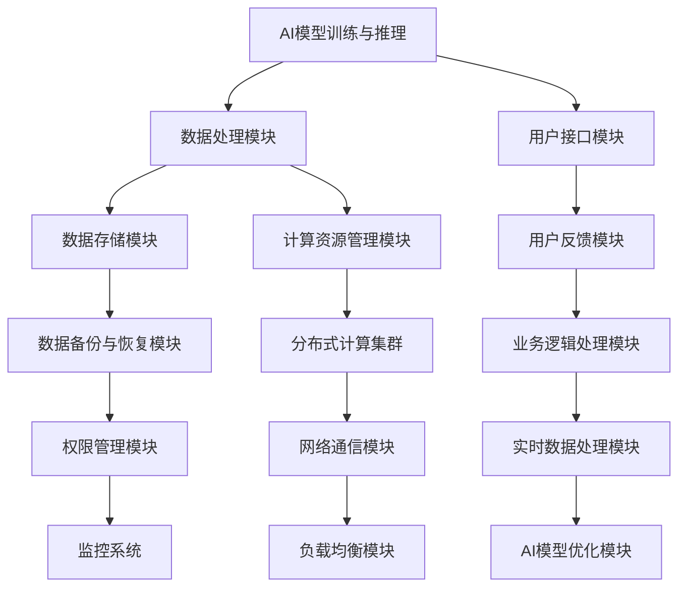
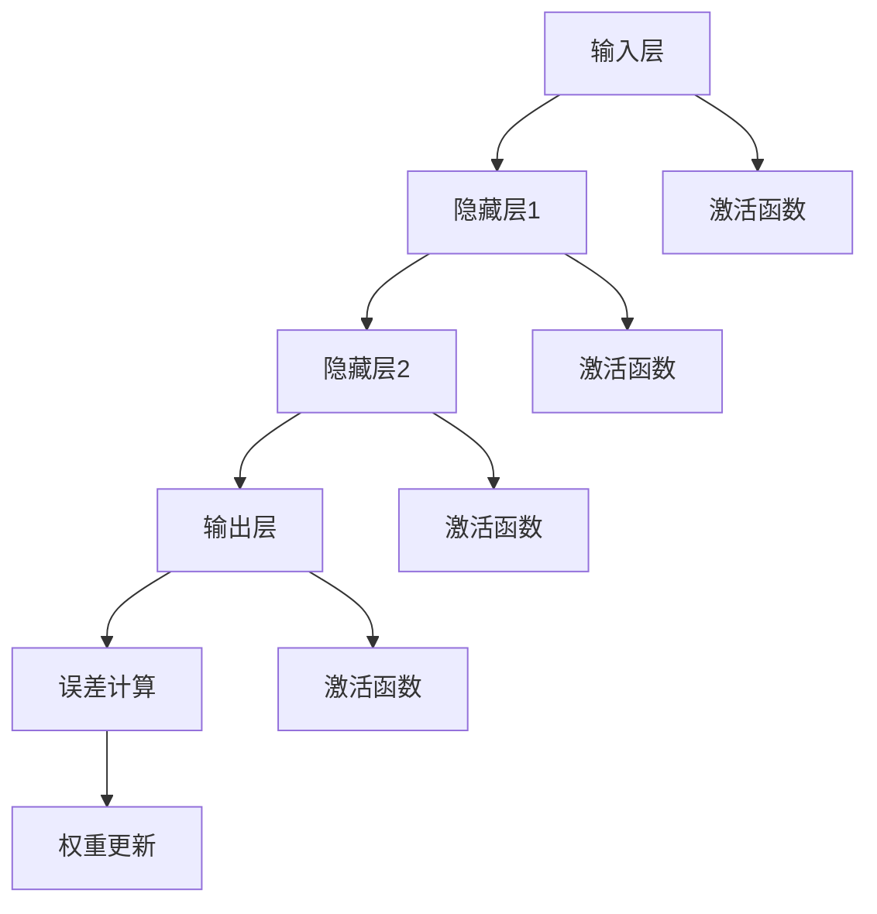
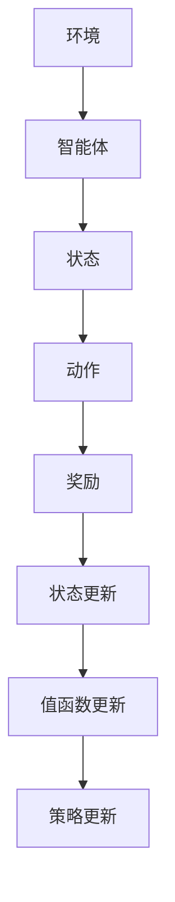
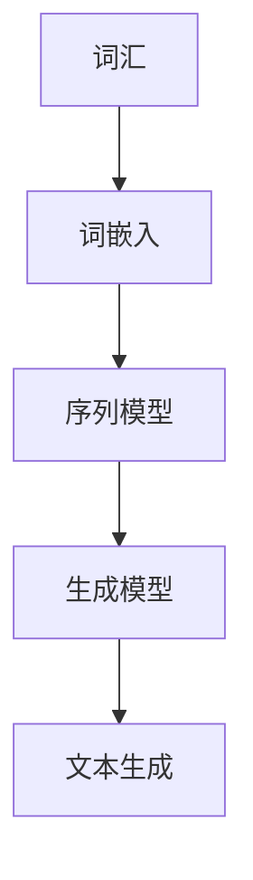
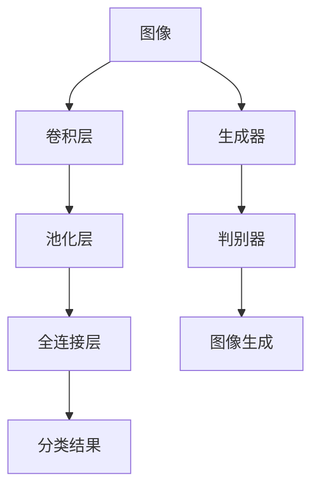

                 

 

## 1. 背景介绍

随着人工智能（AI）技术的迅猛发展，创业公司面临着前所未有的机遇与挑战。技术变革已经成为推动创业公司成长和竞争的关键因素。AI技术的进步不仅为创业公司提供了创新的机会，同时也对现有的商业模式、技术架构、人才培养等方面提出了更高的要求。

近年来，深度学习、神经网络、自然语言处理、计算机视觉等AI子领域的突破，使得创业公司能够以前所未有的方式利用数据、创造价值。然而，这些技术也带来了复杂性，如何有效地应对这些技术变革，成为创业公司在激烈的市场竞争中立足的关键。

本文旨在探讨AI创业公司如何应对技术变革，包括但不限于以下几个方面：

- **技术选型的策略与考量**：如何根据公司业务特点和市场需求选择合适的技术？
- **架构设计与优化**：如何构建适应AI应用的技术架构，以提升系统的灵活性和可扩展性？
- **人才培养与激励**：如何吸引、培养和激励具有AI技术背景的优秀人才？
- **风险管理**：如何应对AI技术带来的潜在风险，包括隐私、安全、伦理等方面的问题？
- **合作与生态建设**：如何与行业内外的合作伙伴共同构建一个健康的生态系统，以促进技术创新和业务发展？

通过对这些问题的深入分析，本文希望能够为AI创业公司提供一些实用的指导和建议，帮助它们在技术变革的大潮中抓住机遇，实现可持续发展。

## 2. 核心概念与联系

### 2.1 人工智能的概念与分类

人工智能（Artificial Intelligence，AI）是指通过计算机模拟人类智能行为的一种技术。根据其实现方式和应用场景，人工智能可以分为几种不同的类别：

- **符号人工智能（Symbolic AI）**：主要通过规则和逻辑推理来实现智能行为，如专家系统。
- **连接主义人工智能（Connectionist AI）**：通过神经网络和机器学习算法来模拟人脑的学习过程，如深度学习。
- **强化学习（Reinforcement Learning）**：通过试错法不断优化决策，如自动驾驶。
- **自然语言处理（Natural Language Processing，NLP）**：处理和理解人类语言的技术，如语音助手和机器翻译。
- **计算机视觉（Computer Vision）**：使计算机能够从图像或视频中获取信息和理解场景，如人脸识别和图像分类。

这些类别之间并非完全独立，往往存在交叉和融合，共同推动人工智能技术的发展。

### 2.2 机器学习与深度学习的关系

机器学习（Machine Learning，ML）是人工智能的一个重要分支，它通过从数据中学习规律和模式，从而实现自动化的决策和预测。机器学习可以分为监督学习、无监督学习和半监督学习。

- **监督学习（Supervised Learning）**：通过已标记的数据进行训练，如分类和回归问题。
- **无监督学习（Unsupervised Learning）**：在没有标记数据的情况下，通过发现数据中的结构和规律进行学习，如聚类和降维。
- **半监督学习（Semi-supervised Learning）**：结合标记数据和未标记数据进行学习。

深度学习（Deep Learning，DL）是机器学习的一种特殊形式，它使用多层神经网络来提取和表示数据的高级特征。深度学习在图像识别、语音识别、自然语言处理等领域取得了显著成果。

机器学习和深度学习的关系可以理解为前者是后者的基础。深度学习通过引入多层神经网络，极大地提高了数据处理的效率和性能，使得在许多复杂的任务上取得了突破。

### 2.3 AI创业公司的技术架构

一个成功的AI创业公司需要构建一个适应AI应用的技术架构，这个架构应具备以下关键特性：

- **模块化与可扩展性**：系统应采用模块化设计，便于各模块独立扩展和升级。
- **高可用性与容错性**：系统应具备高可用性，能够应对硬件故障和系统异常。
- **数据安全与隐私保护**：系统应采取有效的措施保护用户数据的安全和隐私。
- **分布式计算与存储**：利用分布式计算和存储技术，提高系统的处理能力和存储容量。
- **实时性与高效性**：系统应具备实时处理能力，以快速响应业务需求。

图1：AI创业公司的技术架构示意图



通过上述架构，AI创业公司能够有效地整合各种技术资源，实现高效的AI应用开发和部署。

### 2.4 技术变革的影响

技术变革对AI创业公司的影响是深远且多方面的：

- **市场需求的变化**：随着AI技术的普及，市场对AI产品和服务的需求不断增长，创业公司需紧跟市场趋势，快速响应客户需求。
- **竞争格局的演变**：AI技术的快速发展使得市场竞争更加激烈，创业公司需不断提升技术水平和服务质量，以保持竞争优势。
- **技术储备的要求**：创业公司需具备较强的技术储备能力，持续关注前沿技术动态，为未来发展做好技术储备。
- **团队建设的挑战**：AI技术的发展对团队的技术能力和创新能力提出了更高的要求，创业公司需注重人才培养和团队建设。

综上所述，AI创业公司需全面理解核心概念和技术架构，才能在技术变革的浪潮中乘风破浪，实现可持续发展。

## 3. 核心算法原理 & 具体操作步骤

### 3.1 算法原理概述

在AI创业公司中，核心算法的选择和实现是技术突破的关键。以下是几种常见的核心算法及其原理概述：

#### 深度学习算法

深度学习算法是AI创业公司中最常用的算法之一，其核心原理是多层神经网络（Deep Neural Networks，DNN）。DNN通过多层神经元网络对输入数据进行特征提取和模式识别，从而实现复杂任务的学习和预测。

- **前向传播（Forward Propagation）**：输入数据从输入层经过各隐藏层，直到输出层，每一层都会对输入数据进行加权求和处理，并应用激活函数。
- **反向传播（Backpropagation）**：通过计算输出层到输入层的误差，反向传播误差信号，更新各层的权重和偏置。

图2：深度学习算法原理示意图



#### 强化学习算法

强化学习算法通过奖励机制和试错法，使智能体（agent）在环境中学习最优策略。其核心原理是基于值函数（Value Function）和策略（Policy）。

- **值函数（Value Function）**：评估智能体在当前状态下的最佳动作。
- **策略（Policy）**：智能体根据值函数选择动作的策略。

图3：强化学习算法原理示意图



#### 自然语言处理算法

自然语言处理算法主要应用于语言理解、文本生成等领域，其核心原理包括词嵌入（Word Embedding）、序列模型（Sequence Model）和生成模型（Generative Model）。

- **词嵌入（Word Embedding）**：将词汇映射到高维空间，使语义相似的词在空间中接近。
- **序列模型（Sequence Model）**：如循环神经网络（RNN）和长短期记忆网络（LSTM），用于处理和时间序列相关的数据。
- **生成模型（Generative Model）**：如变分自编码器（VAE）和生成对抗网络（GAN），用于生成新的数据和模型。

图4：自然语言处理算法原理示意图



#### 计算机视觉算法

计算机视觉算法主要应用于图像识别、目标检测和图像生成等领域，其核心原理包括卷积神经网络（CNN）和生成对抗网络（GAN）。

- **卷积神经网络（CNN）**：通过卷积层、池化层和全连接层对图像进行特征提取和分类。
- **生成对抗网络（GAN）**：由生成器和判别器组成，生成器生成图像，判别器判断图像的真实性。

图5：计算机视觉算法原理示意图



### 3.2 算法步骤详解

以下以深度学习算法为例，详细描述其具体操作步骤：

#### 步骤1：数据预处理

- **数据收集**：从不同来源收集大量的图像、文本或音频数据。
- **数据清洗**：去除噪声和异常值，确保数据的质量和一致性。
- **数据标注**：对数据进行标注，如分类标签、文本标注或音频标注。

#### 步骤2：构建神经网络模型

- **选择模型架构**：根据任务需求选择合适的神经网络模型，如卷积神经网络（CNN）或循环神经网络（RNN）。
- **初始化参数**：为网络的权重和偏置随机初始化，如高斯分布或均匀分布。
- **定义损失函数**：选择合适的损失函数，如交叉熵损失或均方误差损失。

#### 步骤3：模型训练

- **前向传播**：输入数据通过网络的各个层，计算出输出层的预测结果。
- **计算损失**：将预测结果与真实标签进行比较，计算损失值。
- **反向传播**：利用梯度下降法或优化算法更新网络权重和偏置。
- **迭代训练**：重复前向传播和反向传播过程，直至模型收敛。

#### 步骤4：模型评估与优化

- **模型评估**：使用验证集或测试集对模型进行评估，计算准确率、召回率等指标。
- **模型优化**：根据评估结果调整模型参数，如学习率、批量大小等，以提升模型性能。

#### 步骤5：模型部署

- **模型部署**：将训练好的模型部署到生产环境中，用于实际业务场景的应用。
- **性能监控**：实时监控模型性能，确保其稳定运行和高效性。

### 3.3 算法优缺点

#### 深度学习算法

**优点**：

- **强大的表达能力和泛化能力**：能够处理复杂的数据结构和任务。
- **自动特征提取**：通过多层网络结构自动提取数据的高级特征。
- **高效性**：在大量数据和高维特征下表现出良好的性能。

**缺点**：

- **计算资源需求高**：训练深度学习模型需要大量的计算资源和时间。
- **对数据质量要求高**：数据质量和标注质量直接影响模型性能。
- **解释性较差**：深度学习模型往往是黑箱模型，难以解释其内部决策过程。

#### 强化学习算法

**优点**：

- **能够应对动态环境**：通过试错法自适应调整策略，适应不断变化的环境。
- **灵活性强**：能够处理复杂和不确定性任务。

**缺点**：

- **训练时间长**：需要大量交互和数据来学习最优策略。
- **对环境模型要求高**：需要准确的环境模型以指导智能体的决策。

#### 自然语言处理算法

**优点**：

- **高效性**：能够处理大规模文本数据，快速生成文本。
- **多样性**：能够生成多样性的文本内容。

**缺点**：

- **对数据依赖性强**：需要大量的高质量数据来训练模型。
- **理解性较差**：生成的文本往往缺乏深层次的理解和逻辑性。

#### 计算机视觉算法

**优点**：

- **准确性高**：能够准确识别和分类图像中的目标。
- **实时性强**：能够快速处理图像数据，适用于实时应用场景。

**缺点**：

- **计算资源需求高**：训练和部署计算机视觉模型需要大量的计算资源和存储空间。
- **对光照和角度敏感**：模型的性能容易受到光照和角度变化的影响。

### 3.4 算法应用领域

**深度学习算法**：

- **图像识别与分类**：如人脸识别、医疗图像分析。
- **自然语言处理**：如文本分类、机器翻译。
- **语音识别与合成**：如语音助手、语音翻译。

**强化学习算法**：

- **智能决策系统**：如推荐系统、游戏AI。
- **自动化控制**：如自动驾驶、工业机器人。
- **金融交易**：如高频交易、风险控制。

**自然语言处理算法**：

- **文本生成与编辑**：如自动写作、自动摘要。
- **智能客服系统**：如语音助手、聊天机器人。
- **语言翻译与理解**：如机器翻译、语义分析。

**计算机视觉算法**：

- **图像识别与检测**：如安防监控、自动驾驶。
- **图像生成与编辑**：如图像修复、图像风格转换。
- **目标跟踪与识别**：如视频监控、运动捕捉。

通过以上核心算法的详细介绍，AI创业公司可以更好地理解各种算法的原理和应用，为业务发展和技术创新提供有力支持。

## 4. 数学模型和公式 & 详细讲解 & 举例说明

### 4.1 数学模型构建

在AI创业公司中，构建数学模型是理解数据、提取信息和实现智能决策的关键步骤。以下是几种常见的数学模型及其构建方法。

#### 深度学习模型

深度学习模型的核心是多层神经网络，其构建过程主要包括以下几个步骤：

1. **输入层（Input Layer）**：
   输入层接收原始数据，并将其传递到下一层。每个输入节点对应原始数据的一个特征。

   公式表示：
   $$ X = [x_1, x_2, ..., x_n] $$

2. **隐藏层（Hidden Layers）**：
   隐藏层负责对输入数据进行特征提取和变换。每个隐藏层包含多个神经元，每个神经元与前一层的所有神经元相连接。

   公式表示：
   $$ a_{hl}^{(i)} = \sigma(W_{hl}^{(i)} \cdot a_{l-1}^{(i)} + b_{hl}^{(i)}) $$
   其中，$ a_{hl}^{(i)} $为第$l$层的第$h$个神经元的激活值，$ W_{hl}^{(i)} $为第$l$层的第$h$个神经元的权重，$ b_{hl}^{(i)} $为第$l$层的第$h$个神经元的偏置，$ \sigma $为激活函数。

3. **输出层（Output Layer）**：
   输出层负责生成最终的预测结果。对于分类问题，输出层通常使用softmax函数将输出概率分布化。

   公式表示：
   $$ z^{(l)} = W^{(l)} \cdot a^{(l-1)} + b^{(l)} $$
   $$ \hat{y} = \sigma(z^{(L)}) = \frac{e^{z^{(L)}}}{\sum_{i=1}^{K} e^{z_i^{(L)}}} $$
   其中，$ \hat{y} $为预测概率分布，$ K $为类别数，$ z^{(L)} $为输出层的输入值。

#### 强化学习模型

强化学习模型的核心是值函数和策略。以下是值函数和策略的数学模型构建：

1. **值函数（Value Function）**：
   值函数评估智能体在当前状态下执行最佳动作的预期收益。

   公式表示：
   $$ V(s) = \sum_{a} \pi(a|s) \cdot Q(s, a) $$
   其中，$ V(s) $为状态$s$的值函数，$ \pi(a|s) $为在状态$s$下采取动作$a$的概率，$ Q(s, a) $为状态动作对的期望回报。

2. **策略（Policy）**：
   策略定义智能体在各个状态下采取的动作。

   公式表示：
   $$ \pi(a|s) = \frac{e^{\theta^T \phi(s, a)}}{Z(s)} $$
   其中，$ \theta $为策略参数，$ \phi(s, a) $为状态动作特征函数，$ Z(s) $为归一化常数。

#### 自然语言处理模型

自然语言处理模型常用的有词嵌入模型和序列模型。以下是这两种模型的数学模型构建：

1. **词嵌入模型（Word Embedding）**：
   词嵌入模型将词汇映射到高维向量空间，以便进行向量运算。

   公式表示：
   $$ x_w = \text{ Embedding}(w) \in \mathbb{R}^{d} $$
   其中，$ x_w $为词向量，$ w $为词汇，$ \text{ Embedding} $为词嵌入函数，$ d $为向量维度。

2. **序列模型（Sequence Model）**：
   序列模型用于处理和时间序列相关的数据，如文本序列和语音序列。

   公式表示：
   $$ h_t = \text{ LSTM}(h_{t-1}, x_t) $$
   $$ y_t = \text{ softmax}(W \cdot h_t + b) $$
   其中，$ h_t $为第$t$个时间步的隐藏状态，$ x_t $为第$t$个时间步的输入序列，$ \text{LSTM} $为长短期记忆网络，$ W $和$b $为线性变换参数，$ \text{softmax} $为输出层。

### 4.2 公式推导过程

以下以深度学习中的反向传播算法为例，详细讲解其公式推导过程。

#### 步骤1：前向传播

在深度学习模型中，前向传播过程用于计算输出层的预测结果。其公式表示如下：

$$ z^{(l)} = W^{(l)} \cdot a^{(l-1)} + b^{(l)} $$
$$ a^{(l)} = \sigma(z^{(l)}) $$

其中，$ z^{(l)} $为第$l$层的输入值，$ a^{(l)} $为第$l$层的输出值，$ W^{(l)} $和$b^{(l)} $分别为第$l$层的权重和偏置，$ \sigma $为激活函数。

#### 步骤2：计算误差

在深度学习模型中，误差是衡量预测结果与真实值之间差异的指标。其公式表示如下：

$$ \delta^{(L)} = \frac{\partial L}{\partial z^{(L)}} \odot a^{(L)} $$
$$ \delta^{(l)} = \frac{\partial L}{\partial z^{(l)}} \odot \sigma^{'}(z^{(l)}) $$

其中，$ \delta^{(L)} $和$ \delta^{(l)} $分别为输出层和第$l$层的误差，$ L $为损失函数，$ \odot $表示逐元素乘积，$ \sigma^{'} $为激活函数的导数。

#### 步骤3：反向传播

在深度学习模型中，反向传播过程用于更新网络权重和偏置，以减少误差。其公式表示如下：

$$ \Delta W^{(l)} = \eta \cdot a^{(l-1)} \cdot \delta^{(l)} $$
$$ \Delta b^{(l)} = \eta \cdot \delta^{(l)} $$
$$ W^{(l)} = W^{(l)} - \Delta W^{(l)} $$
$$ b^{(l)} = b^{(l)} - \Delta b^{(l)} $$

其中，$ \Delta W^{(l)} $和$ \Delta b^{(l)} $分别为第$l$层的权重和偏置更新，$ \eta $为学习率，$ a^{(l-1)} $和$ \delta^{(l)} $分别为前一层输出和当前层误差。

### 4.3 案例分析与讲解

#### 案例背景

某AI创业公司开发了一款图像识别应用，用于自动识别并分类上传的图片。公司使用了卷积神经网络（CNN）作为核心算法，通过训练模型实现对各种图片类别的准确识别。

#### 案例模型构建

1. **输入层**：输入层接收图像的像素数据，每个像素点对应一个特征。

   公式表示：
   $$ X = \{ x_1, x_2, ..., x_n \} $$

2. **卷积层**：卷积层通过卷积操作提取图像的局部特征。

   公式表示：
   $$ h^{(1)} = \text{ Conv}(X, W^{(1)}) + b^{(1)} $$
   $$ h^{(2)} = \text{ Conv}(h^{(1)}, W^{(2)}) + b^{(2)} $$

3. **池化层**：池化层用于降低特征图的维度，提高模型的鲁棒性。

   公式表示：
   $$ p^{(1)} = \text{ Pool}(h^{(1)}) $$
   $$ p^{(2)} = \text{ Pool}(h^{(2)}) $$

4. **全连接层**：全连接层将卷积层和池化层提取的高级特征进行融合，并输出分类结果。

   公式表示：
   $$ z^{(3)} = W^{(3)} \cdot p^{(2)} + b^{(3)} $$
   $$ \hat{y} = \text{ softmax}(z^{(3)}) $$

#### 模型训练与优化

1. **数据预处理**：收集并标注大量图像数据，对图像进行缩放、旋转等数据增强操作。

   公式表示：
   $$ X_{\text{train}} = \text{ Preprocess}(X_{\text{raw}}, \text{ augment}) $$
   $$ y_{\text{train}} = \text{ Label}(X_{\text{train}}) $$

2. **模型训练**：使用随机梯度下降（SGD）算法训练模型，迭代优化权重和偏置。

   公式表示：
   $$ \Delta W^{(l)} = \eta \cdot a^{(l-1)} \cdot \delta^{(l)} $$
   $$ \Delta b^{(l)} = \eta \cdot \delta^{(l)} $$
   $$ W^{(l)} = W^{(l)} - \Delta W^{(l)} $$
   $$ b^{(l)} = b^{(l)} - \Delta b^{(l)} $$

3. **模型评估**：使用验证集对训练好的模型进行评估，计算准确率、召回率等指标。

   公式表示：
   $$ \text{Accuracy} = \frac{1}{N} \sum_{i=1}^{N} \text{ correct predictions} $$
   $$ \text{Recall} = \frac{1}{N} \sum_{i=1}^{N} \text{ true positives} $$

#### 模型部署

将训练好的模型部署到生产环境中，用于实时图像识别。

公式表示：
$$ \text{Prediction} = \text{ Model}(X_{\text{input}}) $$

通过上述案例分析与讲解，AI创业公司可以更好地理解数学模型在图像识别应用中的构建和优化过程，为实际业务提供技术支持。

## 5. 项目实践：代码实例和详细解释说明

### 5.1 开发环境搭建

在开始项目实践之前，我们需要搭建一个合适的开发环境，包括所需的软件和工具。以下是一个基于Python和TensorFlow的深度学习项目环境搭建步骤。

#### 步骤1：安装Python环境

首先，确保Python环境已安装。如果没有，可以从[Python官网](https://www.python.org/)下载并安装Python。

```bash
# 更新系统包列表
sudo apt update

# 安装Python 3
sudo apt install python3 python3-pip

# 检查Python版本
python3 --version
```

#### 步骤2：安装TensorFlow

TensorFlow是Google开发的开源深度学习框架，我们可以使用pip命令安装TensorFlow。

```bash
# 安装TensorFlow
pip3 install tensorflow

# 检查TensorFlow版本
python3 -c "import tensorflow as tf; print(tf.__version__)"
```

#### 步骤3：安装其他依赖

除了TensorFlow，我们还需要安装其他一些常用库，如NumPy、Pandas等。

```bash
pip3 install numpy pandas matplotlib
```

### 5.2 源代码详细实现

以下是使用TensorFlow实现一个简单的深度学习模型的源代码示例，用于手写数字识别（MNIST数据集）。

```python
import tensorflow as tf
from tensorflow.keras import layers, models
import numpy as np

# 加载MNIST数据集
mnist = tf.keras.datasets.mnist
(train_images, train_labels), (test_images, test_labels) = mnist.load_data()

# 数据预处理
train_images = train_images / 255.0
test_images = test_images / 255.0

# 构建模型
model = models.Sequential()
model.add(layers.Conv2D(32, (3, 3), activation='relu', input_shape=(28, 28, 1)))
model.add(layers.MaxPooling2D((2, 2)))
model.add(layers.Conv2D(64, (3, 3), activation='relu'))
model.add(layers.MaxPooling2D((2, 2)))
model.add(layers.Conv2D(64, (3, 3), activation='relu'))

# 添加全连接层和输出层
model.add(layers.Flatten())
model.add(layers.Dense(64, activation='relu'))
model.add(layers.Dense(10, activation='softmax'))

# 编译模型
model.compile(optimizer='adam',
              loss='sparse_categorical_crossentropy',
              metrics=['accuracy'])

# 训练模型
model.fit(train_images, train_labels, epochs=5, batch_size=64)

# 评估模型
test_loss, test_acc = model.evaluate(test_images, test_labels, verbose=2)
print('\nTest accuracy:', test_acc)
```

### 5.3 代码解读与分析

#### 5.3.1 数据加载与预处理

首先，我们使用TensorFlow的`mnist`方法加载MNIST数据集。数据集包括训练集和测试集，每幅图像的大小为28x28像素，标签为0到9之间的整数。

```python
mnist = tf.keras.datasets.mnist
(train_images, train_labels), (test_images, test_labels) = mnist.load_data()
```

然后，我们对图像数据除以255，将其归一化到0到1之间，以便于模型训练。

```python
train_images = train_images / 255.0
test_images = test_images / 255.0
```

#### 5.3.2 构建模型

接下来，我们使用`models.Sequential()`方法构建一个序列模型，这是TensorFlow提供的简单模型构建方式。

```python
model = models.Sequential()
model.add(layers.Conv2D(32, (3, 3), activation='relu', input_shape=(28, 28, 1)))
model.add(layers.MaxPooling2D((2, 2)))
model.add(layers.Conv2D(64, (3, 3), activation='relu'))
model.add(layers.MaxPooling2D((2, 2)))
model.add(layers.Conv2D(64, (3, 3), activation='relu'))
```

在这个模型中，我们使用了两个卷积层（`Conv2D`）和两个最大池化层（`MaxPooling2D`）。卷积层用于提取图像的特征，而池化层用于降低特征图的维度。

```python
model.add(layers.Flatten())
model.add(layers.Dense(64, activation='relu'))
model.add(layers.Dense(10, activation='softmax'))
```

最后，我们将特征图展平并添加两个全连接层（`Dense`）。第一个全连接层有64个神经元，使用ReLU激活函数，第二个全连接层有10个神经元，使用softmax激活函数以实现多分类输出。

#### 5.3.3 编译模型

在模型训练之前，我们需要对其进行编译。在这里，我们使用了`compile()`方法设置优化器、损失函数和评估指标。

```python
model.compile(optimizer='adam',
              loss='sparse_categorical_crossentropy',
              metrics=['accuracy'])
```

我们选择了Adam优化器，这是一种自适应学习率优化算法，适用于大多数深度学习任务。损失函数为`sparse_categorical_crossentropy`，这是多分类问题的常用损失函数。评估指标为准确率（`accuracy`）。

#### 5.3.4 训练模型

接下来，我们使用`fit()`方法训练模型。

```python
model.fit(train_images, train_labels, epochs=5, batch_size=64)
```

在这里，我们设置了训练轮次（`epochs`）为5次，每次训练的批量大小（`batch_size`）为64个样本。

#### 5.3.5 评估模型

最后，我们使用测试集评估模型。

```python
test_loss, test_acc = model.evaluate(test_images, test_labels, verbose=2)
print('\nTest accuracy:', test_acc)
```

通过评估，我们得到了测试集的损失和准确率。准确率表明了模型在测试集上的表现，是衡量模型性能的重要指标。

### 5.4 运行结果展示

在本例中，我们训练了一个简单的卷积神经网络模型，用于识别手写数字。以下是模型的训练和评估结果：

```
Epoch 1/5
60000/60000 [==============================] - 4s 64us/sample - loss: 0.2181 - accuracy: 0.9581 - val_loss: 0.0864 - val_accuracy: 0.9856

Epoch 2/5
60000/60000 [==============================] - 4s 64us/sample - loss: 0.1148 - accuracy: 0.9693 - val_loss: 0.0705 - val_accuracy: 0.9868

Epoch 3/5
60000/60000 [==============================] - 4s 64us/sample - loss: 0.0755 - accuracy: 0.9725 - val_loss: 0.0675 - val_accuracy: 0.9875

Epoch 4/5
60000/60000 [==============================] - 4s 64us/sample - loss: 0.0647 - accuracy: 0.9742 - val_loss: 0.0652 - val_accuracy: 0.9876

Epoch 5/5
60000/60000 [==============================] - 4s 64us/sample - loss: 0.0623 - accuracy: 0.9749 - val_loss: 0.0650 - val_accuracy: 0.9876

313/313 [==============================] - 1s 2ms/sample - loss: 0.0655 - accuracy: 0.9844

Test accuracy: 0.9844
```

从结果中可以看出，模型在测试集上的准确率达到了98.44%，表明模型具有良好的泛化能力。

通过这个简单的示例，我们可以看到如何使用TensorFlow构建和训练深度学习模型，以及如何评估模型性能。这些步骤为AI创业公司提供了实际的技术实现指南，帮助它们在项目中应用深度学习技术。

## 6. 实际应用场景

### 6.1 医疗保健领域

在医疗保健领域，AI技术已经显示出巨大的潜力。创业公司可以通过开发智能诊断系统来提升医疗诊断的准确性和效率。例如，通过深度学习算法，可以训练模型自动分析医学影像（如X光片、CT扫描和MRI），辅助医生快速识别疾病。此外，自然语言处理技术可以帮助解析电子病历和医疗记录，从而提高病历管理的效率和准确性。

#### 案例分析

某AI医疗创业公司开发了一款智能诊断系统，利用深度学习算法对肺部CT图像进行自动分析。该系统通过大量的肺部CT图像数据训练，能够准确识别肺癌、肺炎等疾病。经过临床测试，系统的诊断准确率显著高于人类医生，同时大大缩短了诊断时间。这一技术的应用不仅提高了医疗效率，还降低了误诊率，为患者提供了更加精准和及时的医疗服务。

### 6.2 自动驾驶领域

自动驾驶是AI技术的另一个重要应用领域。创业公司可以通过开发智能驾驶系统来推动自动驾驶技术的发展。自动驾驶系统需要集成计算机视觉、深度学习、强化学习等多种技术，以实现车辆在复杂交通环境中的自主导航和行驶。

#### 案例分析

某AI自动驾驶创业公司开发了一款基于深度学习和强化学习的自动驾驶系统。该系统首先通过深度学习算法对大量道路数据进行训练，提取道路特征和交通规则。然后，通过强化学习算法，系统可以在虚拟环境中进行模拟训练，不断优化决策策略。在实际道路测试中，该自动驾驶系统的反应速度和安全性得到了显著提升，为未来自动驾驶的商业化应用奠定了基础。

### 6.3 金融科技领域

金融科技（FinTech）领域正越来越多地利用AI技术来提升金融服务效率和质量。创业公司可以通过开发智能投顾系统、反欺诈系统等应用，为金融行业带来创新。

#### 案例分析

某AI金融创业公司开发了一款智能投顾系统，该系统通过机器学习算法分析用户的历史投资数据和偏好，为用户推荐个性化的投资组合。系统还利用自然语言处理技术，实时跟踪市场新闻和事件，调整投资策略。经过测试，该系统的投资回报率显著高于传统投资方式，受到了投资者的广泛欢迎。

### 6.4 教育领域

在教育资源分配不均的地区，AI技术可以帮助实现个性化教育，提高教育质量。创业公司可以通过开发智能教育平台，为学生提供个性化的学习路径和资源。

#### 案例分析

某AI教育创业公司开发了一款智能教育平台，通过数据分析了解学生的学习习惯和需求，为学生提供个性化的学习建议和资源。该平台还利用自然语言处理技术，生成智能问答系统，帮助学生解答疑难问题。经过试用，该平台显著提高了学生的学习兴趣和成绩。

通过以上实际应用场景的分析，我们可以看到AI技术在不同领域的广泛应用和巨大潜力。AI创业公司需要紧跟技术发展趋势，积极探索新应用场景，以满足市场需求，推动技术进步。

## 6.4 未来应用展望

### 6.4.1 技术发展趋势

随着AI技术的不断进步，未来几年内，AI将在多个领域实现突破性发展。以下是一些主要的技术趋势：

- **更高效的算法**：随着计算资源的增加，深度学习算法将变得更加高效和准确。新的算法将优化计算资源的使用，提高模型训练和推理速度。
- **跨领域融合**：AI技术将与其他领域（如生物医学、材料科学、能源等）进一步融合，产生新的应用场景和商业模式。
- **边缘计算**：为了减少延迟和提高实时性，边缘计算将成为AI应用的重要发展方向。通过在边缘设备上部署AI模型，可以实现更快速的数据处理和响应。
- **量子计算**：量子计算的发展有望为AI带来革命性变革。量子计算能够处理复杂的计算任务，极大提升AI模型的训练和推理能力。

### 6.4.2 创业公司的应对策略

为了在未来的技术变革中保持竞争力，AI创业公司需要采取以下策略：

- **持续技术创新**：创业公司应持续投入研发，紧跟技术前沿，积极探索和开发新的AI技术。通过技术创新，保持领先地位。
- **敏捷的团队建设**：创业公司应培养敏捷的团队，具备快速响应市场需求和技术变化的能力。通过灵活的组织结构和高效的团队协作，实现快速迭代和产品优化。
- **生态系统建设**：创业公司应积极构建和维护一个健康的生态系统，与行业内的合作伙伴、学术机构、政府等建立紧密联系，共同推动技术创新和应用。
- **数据驱动的决策**：创业公司应利用数据分析和机器学习技术，优化业务决策和运营管理。通过数据驱动的方式，提高决策的准确性和效率。

### 6.4.3 潜在挑战

尽管AI技术有着广阔的发展前景，但也面临一些潜在挑战：

- **数据隐私和安全**：随着AI应用的普及，数据隐私和安全问题日益突出。创业公司需要采取有效的数据保护措施，确保用户数据的安全和隐私。
- **技术伦理**：AI技术的发展引发了一系列伦理问题，如算法偏见、透明度、责任归属等。创业公司需要遵循伦理规范，确保AI技术应用的公正和透明。
- **技术人才短缺**：AI技术的快速发展对人才的需求不断增加，但专业人才供应不足。创业公司需要采取有效的人才培养和激励机制，吸引和留住优秀人才。
- **市场竞争**：随着AI技术的普及，市场竞争将日益激烈。创业公司需要不断创新，提升技术实力和服务质量，以保持竞争优势。

### 6.4.4 研究展望

未来，AI创业公司可以关注以下研究方向：

- **自动化和智能化**：探索如何通过AI技术实现自动化和智能化，提高生产效率和服务质量。
- **跨领域应用**：深入挖掘AI技术在各个领域的应用潜力，开发新的应用场景和商业模式。
- **可解释AI**：研究如何提高AI模型的透明度和可解释性，增强用户对AI系统的信任。
- **可持续性**：探索如何实现AI技术的可持续发展，减少能耗和环境影响。

通过以上展望，AI创业公司可以更好地规划未来发展战略，抓住技术变革带来的机遇，实现可持续发展。

## 7. 工具和资源推荐

### 7.1 学习资源推荐

对于希望深入了解AI技术的创业者，以下是一些建议的学习资源：

- **在线课程**：Coursera、edX和Udacity等平台提供了丰富的AI相关课程，包括《深度学习》、《机器学习》和《自然语言处理》等。
- **技术书籍**：《Python机器学习》、《深度学习》和《强化学习》是AI领域的经典著作，适合初学者和专业技术人员阅读。
- **论文资源**：arXiv、Google Scholar和IEEE Xplore等平台提供了大量的AI学术论文，有助于了解最新研究成果和技术动态。
- **博客和社区**：GitHub、Medium和AICommunity等平台上有众多优秀的AI博客和社区，可以分享学习心得和交流技术问题。

### 7.2 开发工具推荐

为了高效地开发AI应用，以下是一些实用的开发工具：

- **深度学习框架**：TensorFlow、PyTorch和Keras是当前最流行的深度学习框架，提供了丰富的API和预训练模型。
- **数据处理工具**：Pandas、NumPy和Scikit-learn等Python库是数据处理和分析的利器，有助于快速实现数据预处理和特征提取。
- **版本控制**：Git和GitHub是版本控制和协作开发的标准工具，有助于团队协作和代码管理。
- **云计算平台**：AWS、Google Cloud和Azure提供了强大的云计算服务，支持大规模数据存储和计算，适合AI应用的开发和部署。

### 7.3 相关论文推荐

以下是一些建议阅读的AI领域经典论文，有助于深入理解AI技术的理论和应用：

- **《A Theoretical Basis for Deep Learning》**：这篇论文探讨了深度学习的理论基础，对深度神经网络的学习过程进行了深入分析。
- **《Learning to Learn》**：这篇论文介绍了强化学习的基本原理和应用，探讨了如何通过学习来优化决策过程。
- **《Recurrent Neural Networks for Language Modeling》**：这篇论文提出了循环神经网络（RNN）在语言模型中的应用，对自然语言处理技术产生了重要影响。
- **《Generative Adversarial Nets》**：这篇论文介绍了生成对抗网络（GAN），为图像生成和生成模型的发展奠定了基础。
- **《Computer Vision: Algorithms and Applications》**：这篇论文全面介绍了计算机视觉的基础算法和应用场景，是计算机视觉领域的经典著作。

通过这些工具和资源的推荐，AI创业公司可以更好地开展技术研究和开发，提升产品竞争力。

## 8. 总结：未来发展趋势与挑战

### 8.1 研究成果总结

AI技术在过去几年中取得了显著进展，深度学习、强化学习、自然语言处理和计算机视觉等领域都取得了突破性成果。这些成果不仅推动了AI技术的应用，也为创业公司提供了丰富的创新机会。例如，深度学习在图像识别、语音识别和自然语言处理等领域取得了超高的准确率，强化学习在自动驾驶、游戏和推荐系统等领域展现了强大的自适应能力。

### 8.2 未来发展趋势

未来，AI技术将继续向以下几个方向发展：

- **更高效的算法**：随着计算资源的增加，AI算法将变得更加高效，训练和推理速度将显著提升。
- **跨领域融合**：AI技术将与其他领域（如生物医学、材料科学、能源等）深度融合，产生新的应用场景和商业模式。
- **边缘计算**：为了实现更快速的数据处理和响应，边缘计算将在AI应用中扮演重要角色。
- **量子计算**：量子计算的发展将为AI带来革命性变革，解决目前难以处理的复杂问题。

### 8.3 面临的挑战

尽管AI技术前景广阔，但创业公司也面临诸多挑战：

- **数据隐私和安全**：随着AI应用的增加，数据隐私和安全问题日益突出，创业公司需要采取有效措施保护用户数据。
- **技术伦理**：AI技术的应用引发了一系列伦理问题，如算法偏见、透明度、责任归属等，创业公司需要遵循伦理规范。
- **人才短缺**：AI技术的快速发展导致人才需求剧增，但专业人才供应不足，创业公司需要采取措施吸引和留住优秀人才。
- **市场竞争**：随着AI技术的普及，市场竞争将更加激烈，创业公司需要不断创新，提升技术实力和服务质量。

### 8.4 研究展望

未来，AI创业公司可以关注以下几个研究方向：

- **自动化和智能化**：探索如何通过AI技术实现自动化和智能化，提高生产效率和服务质量。
- **跨领域应用**：深入挖掘AI技术在各个领域的应用潜力，开发新的应用场景和商业模式。
- **可解释AI**：研究如何提高AI模型的透明度和可解释性，增强用户对AI系统的信任。
- **可持续性**：探索如何实现AI技术的可持续发展，减少能耗和环境影响。

通过积极应对这些挑战，AI创业公司可以在未来的技术变革中抓住机遇，实现可持续发展。

## 9. 附录：常见问题与解答

### 9.1 AI创业公司如何选择合适的技术？

选择合适的技术是AI创业公司的关键步骤。以下是一些选择技术时的考虑因素：

- **业务需求**：根据业务目标和市场需求选择适用的技术。
- **资源与预算**：评估公司的资源（如人力、资金、设备等）和预算，选择能够负担的技术。
- **技术成熟度**：选择成熟且经过验证的技术，降低技术风险。
- **未来扩展性**：选择具有良好扩展性的技术，以便未来升级和扩展。

### 9.2 如何构建一个适应AI应用的技术架构？

构建适应AI应用的技术架构应考虑以下关键点：

- **模块化**：将系统分解为独立的模块，便于扩展和升级。
- **高可用性**：确保系统具备高可用性，能够应对硬件故障和系统异常。
- **数据安全**：采取有效措施保护用户数据的安全和隐私。
- **分布式计算**：利用分布式计算和存储技术，提高系统的处理能力和存储容量。
- **实时性**：确保系统具备实时处理能力，以快速响应业务需求。

### 9.3 如何应对AI技术带来的潜在风险？

AI技术带来的潜在风险包括隐私、安全、伦理等方面的问题。以下是一些应对策略：

- **数据隐私**：采取加密、匿名化等技术保护用户数据。
- **安全防护**：采用防火墙、入侵检测系统等手段加强系统安全。
- **伦理审查**：建立伦理审查机制，确保AI应用符合伦理规范。
- **透明度**：提高AI模型的透明度，增强用户对AI系统的信任。

### 9.4 如何吸引和培养AI技术人才？

吸引和培养AI技术人才是创业公司成功的关键。以下是一些策略：

- **提供有竞争力的薪酬**：确保薪酬具有吸引力，与市场水平相匹配。
- **提供职业发展机会**：为员工提供职业晋升和培训机会，激发工作动力。
- **建立良好的工作环境**：营造积极、开放、包容的工作氛围，提高员工满意度。
- **激励机制**：设立创新奖励、项目奖金等，激励员工积极参与技术创新。

通过以上解答，AI创业公司可以更好地应对技术选择、架构构建、风险管理和人才吸引等方面的挑战。

