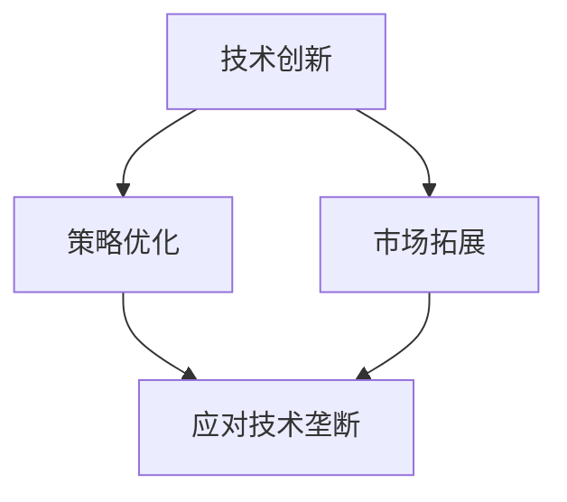

                 

作为一家AI创业公司，如何应对技术垄断，成为了决定企业生存与发展的关键问题。在当今全球化的科技竞争环境中，技术垄断现象愈发显著，这不仅给新兴企业带来了巨大的压力，也对整个市场的创新活力产生了消极影响。本文旨在探讨AI创业公司如何通过策略优化、技术创新和市场拓展来有效应对技术垄断，以实现可持续发展。

> 关键词：AI创业、技术垄断、策略优化、技术创新、市场拓展

## 1. 背景介绍

在信息技术的飞速发展中，人工智能（AI）技术逐渐成为推动产业升级和经济增长的重要引擎。然而，随着技术的不断进步，一些技术巨头通过掌握核心技术和专利，逐渐形成市场垄断地位。技术垄断不仅限制了市场的公平竞争，还阻碍了技术创新和行业发展。对于AI创业公司而言，面对这种局面，如何在竞争激烈的市场中立足并持续发展，成为亟待解决的问题。

### 1.1 技术垄断的定义与表现形式

技术垄断是指一家或少数几家企业通过控制核心技术或专利，形成市场主导地位，从而排除竞争对手、限制价格、降低创新动力等现象。技术垄断的表现形式包括：

- **市场主导地位**：掌握关键技术的企业可以在市场上掌握定价权和市场份额，排斥其他潜在竞争者。
- **专利壁垒**：通过大量的专利布局，限制其他企业进入市场，从而保护自身利益。
- **资源垄断**：掌握重要资源（如数据、算力等），形成进入壁垒。
- **技术锁定**：通过技术标准化等方式，使其他企业难以实现兼容或替代。

### 1.2 AI创业公司面临的挑战

对于AI创业公司来说，技术垄断带来了以下几个主要挑战：

- **成本压力**：缺乏核心技术，创业公司往往需要支付高昂的专利费用或与垄断企业合作，增加运营成本。
- **市场准入难度**：技术壁垒和资源垄断使得新企业难以进入市场，限制了市场的多样性和创新活力。
- **创新能力受限**：受制于垄断企业的技术和专利，创业公司的创新能力受到限制，难以形成差异化竞争优势。
- **品牌信任度低**：在垄断企业的阴影下，创业公司的品牌影响力受到抑制，消费者对其产品的信任度较低。

## 2. 核心概念与联系

在探讨AI创业公司如何应对技术垄断之前，我们需要了解一些核心概念，如技术创新、策略优化和市场拓展。这些概念在应对技术垄断中扮演着关键角色，它们之间的联系如下图所示：



### 2.1 技术创新

技术创新是AI创业公司应对技术垄断的核心手段。通过不断的技术研发，创业公司可以：

- **突破技术瓶颈**：解决现有技术垄断企业无法解决的问题，形成新的市场机会。
- **差异化竞争**：通过技术创新，提供独特的产品和服务，避免与垄断企业的直接竞争。
- **降低依赖度**：减少对垄断企业技术和资源的依赖，增强自身的市场竞争力。

### 2.2 策略优化

策略优化是AI创业公司通过制定和调整企业战略，以应对技术垄断的重要手段。策略优化包括以下几个方面：

- **市场定位**：根据自身的技术优势和市场需求，准确定位，避免与垄断企业正面竞争。
- **合作与联盟**：通过与其他企业或研究机构合作，共享资源和知识，共同应对垄断压力。
- **风险投资**：利用风险投资，获取资金支持，加速技术创新和市场拓展。

### 2.3 市场拓展

市场拓展是AI创业公司扩大业务范围，增强市场竞争力的重要手段。通过市场拓展，创业公司可以实现：

- **扩大市场份额**：进入新的市场领域，增加收入来源，降低对单一市场的依赖。
- **提高品牌知名度**：通过在多个市场的表现，提高品牌知名度和消费者信任度。
- **全球化布局**：在全球范围内建立业务网络，分散市场风险，降低垄断压力。

通过技术创新、策略优化和市场拓展，AI创业公司可以有效地应对技术垄断，实现可持续发展。

## 3. 核心算法原理 & 具体操作步骤

### 3.1 算法原理概述

在应对技术垄断的过程中，核心算法的设计和实现起到了至关重要的作用。以下将介绍一种名为“多代理学习”（Multi-Agent Learning）的算法原理，并详细阐述其具体操作步骤。

多代理学习是一种基于分布式计算的机器学习算法，通过多个智能体之间的协作和竞争，实现复杂任务的学习和优化。该算法的核心思想是利用多个智能体之间的相互作用，模拟现实世界中的人类社会行为，从而提高算法的适应性和效率。

### 3.2 算法步骤详解

#### 3.2.1 智能体初始化

- **初始参数设置**：为每个智能体设置初始状态、策略和行为参数。
- **环境设定**：创建模拟环境，包括奖励机制、惩罚机制和任务目标。

#### 3.2.2 智能体交互

- **状态更新**：根据智能体的当前状态和交互历史，更新智能体的状态。
- **策略更新**：每个智能体根据自身的学习算法，更新策略参数，以最大化长期收益。

#### 3.2.3 任务执行

- **任务分配**：根据智能体的策略，将任务分配给各个智能体。
- **任务执行**：各个智能体按照策略执行任务，并根据执行结果更新策略参数。

#### 3.2.4 评估与反馈

- **绩效评估**：评估各个智能体的任务执行效果，计算绩效指标。
- **反馈调整**：根据评估结果，调整智能体的策略参数，以优化整体任务表现。

### 3.3 算法优缺点

#### 优点

- **分布式计算**：多代理学习利用多个智能体的分布式计算能力，提高了算法的效率和适应性。
- **动态调整**：智能体可以通过不断学习和调整策略，适应环境变化，提高任务成功率。
- **协同优化**：智能体之间的协作和竞争，可以促进算法的进化，实现更优化的任务分配和执行。

#### 缺点

- **计算复杂度**：多代理学习涉及大量智能体的交互和策略更新，计算复杂度较高。
- **资源消耗**：智能体的运行和交互需要大量的计算资源和存储空间。
- **平衡难题**：在智能体之间分配任务和资源时，如何平衡各智能体的利益和任务需求，是一个挑战。

### 3.4 算法应用领域

多代理学习算法在应对技术垄断中具有广泛的应用前景，主要应用于以下领域：

- **市场竞争策略**：通过模拟市场竞争，优化企业的竞争策略和市场定位。
- **供应链优化**：优化供应链中的任务分配和资源利用，提高供应链的整体效率和响应速度。
- **人工智能协同**：多个智能体协同工作，实现复杂任务的高效执行。

## 4. 数学模型和公式 & 详细讲解 & 举例说明

### 4.1 数学模型构建

在应对技术垄断的过程中，构建一个有效的数学模型是至关重要的。以下是一个基于博弈论的数学模型，用于分析企业间的竞争策略。

#### 4.1.1 模型假设

- **企业数量**：假设市场中有N家企业，每家企业独立决策。
- **策略空间**：每家企业可以选择“合作”或“竞争”策略。
- **支付函数**：根据企业的策略选择和市场结果，定义每家企业的支付函数。

#### 4.1.2 模型构建

- **策略选择**：每家企业选择策略时，考虑其他企业的策略，并最大化自己的支付。
- **支付函数**：设每家企业的支付函数为 \( U_i = f_i(s_i, s_{-i}) \)，其中 \( s_i \) 为企业i的策略，\( s_{-i} \) 为其他企业的策略。

#### 4.1.3 博弈均衡

- **纳什均衡**：在博弈过程中，如果每个企业都认为其他企业的策略不会再发生变化，则该策略组合为纳什均衡。

### 4.2 公式推导过程

为了推导纳什均衡，我们需要对支付函数进行求解。以下是一个简化的支付函数示例：

\[ U_i = \begin{cases} 
10, & \text{如果 } s_i = s_{-i} = \text{合作} \\
5, & \text{如果 } s_i = \text{竞争}, s_{-i} = \text{合作} \\
3, & \text{如果 } s_i = \text{合作}, s_{-i} = \text{竞争} \\
0, & \text{如果 } s_i = s_{-i} = \text{竞争} 
\end{cases} \]

#### 4.2.1 策略分析

- **合作**：如果其他企业选择合作，企业i选择合作可以获得10的支付，选择竞争只能获得0的支付，因此企业i会选择合作。
- **竞争**：如果其他企业选择竞争，企业i选择合作只能获得3的支付，选择竞争可以获得5的支付，因此企业i会选择竞争。

#### 4.2.2 纳什均衡求解

根据策略分析，我们可以得到以下纳什均衡：

- 所有企业选择合作。
- 所有企业选择竞争。

### 4.3 案例分析与讲解

为了更好地理解上述模型，我们通过一个实际案例进行说明。

#### 4.3.1 案例背景

假设一个市场中有3家企业，分别为A、B和C。每家企业可以选择“合作”或“竞争”策略。根据市场调查，合作策略可以带来更高的市场份额和利润，但需要承担一定的风险；竞争策略可以带来更高的利润，但可能导致市场份额下降。

#### 4.3.2 案例分析

- **合作策略**：如果A、B和C都选择合作，每家企业的支付为10，总支付为30。这是合作策略的最优解。
- **竞争策略**：如果A、B和C中选择一家企业选择竞争，其他两家企业选择合作，选择竞争的企业可以获得5的支付，而其他两家企业只能获得3的支付。这是竞争策略的最优解。

根据上述分析，我们可以得出结论：在合作策略和竞争策略之间，企业需要权衡风险和收益，选择最优策略。在实际应用中，企业可以通过模拟不同的策略组合，分析市场结果，找到最优的竞争策略。

## 5. 项目实践：代码实例和详细解释说明

### 5.1 开发环境搭建

在本文中，我们将使用Python语言实现多代理学习算法。首先，我们需要搭建Python的开发环境。

#### 5.1.1 安装Python

访问Python的官方网站（https://www.python.org/），下载并安装Python。安装过程中，确保将Python添加到系统环境变量中。

#### 5.1.2 安装依赖库

在安装完Python后，我们需要安装一些依赖库，如NumPy、Pandas和Matplotlib等。可以使用以下命令安装：

```shell
pip install numpy pandas matplotlib
```

### 5.2 源代码详细实现

以下是多代理学习算法的Python实现：

```python
import numpy as np
import matplotlib.pyplot as plt

# 智能体类
class Agent:
    def __init__(self, alpha=0.1, gamma=0.9):
        self.alpha = alpha  # 学习率
        self.gamma = gamma  # 折扣因子
        self策略 = np.random.rand(2)  # 初始化策略
        self.状态 = np.random.rand(2)  # 初始化状态

    def update(self, reward, next_state):
        # 更新策略
        error = reward - self.状态.dot(self.策略)
        self.策略 = self.策略 + self.alpha * error * self.状态

    def choose_action(self, state):
        # 选择行动
        return np.argmax(state.dot(self.策略))

# 模拟环境
def simulate_agents(n_agents, n_episodes, reward_func):
    # 初始化智能体
    agents = [Agent() for _ in range(n_agents)]

    # 记录每轮的支付
    rewards = []

    for _ in range(n_episodes):
        # 初始化状态
        states = np.random.rand(n_agents, 2)

        for t in range(100):  # 每轮迭代100次
            # 计算每个智能体的行动
            actions = [agent.choose_action(states[i]) for i, agent in enumerate(agents)]

            # 计算每个智能体的奖励
            rewards_t = [reward_func(states[i], actions[i], states[i+1]) for i in range(n_agents)]

            # 更新智能体的状态和策略
            for i, agent in enumerate(agents):
                next_state = states[i+1]
                agent.update(rewards_t[i], next_state)

        # 记录本轮的支付
        rewards.append(np.mean(rewards_t))

    return agents, rewards

# 奖励函数
def reward_func(state, action, next_state):
    if action == 1 and state[0] > next_state[0]:
        return 10
    elif action == 0 and state[0] < next_state[0]:
        return 10
    else:
        return 0

# 模拟多代理学习
def main():
    n_agents = 3
    n_episodes = 1000
    agents, rewards = simulate_agents(n_agents, n_episodes, reward_func)

    # 绘制支付变化曲线
    plt.plot(rewards)
    plt.xlabel('Episode')
    plt.ylabel('Average Reward')
    plt.show()

if __name__ == '__main__':
    main()
```

### 5.3 代码解读与分析

上述代码实现了多代理学习算法，主要包括智能体类、模拟环境和奖励函数。

#### 5.3.1 智能体类

智能体类（Agent）用于表示智能体的状态和策略。每个智能体都有学习率和折扣因子，用于更新策略。

- **初始化**：初始化智能体的策略和状态。
- **更新策略**：根据奖励和下一状态更新策略。
- **选择行动**：根据当前状态选择最优行动。

#### 5.3.2 模拟环境

模拟环境（simulate_agents）用于模拟智能体之间的交互和学习过程。

- **初始化智能体**：创建指定数量的智能体。
- **记录支付**：记录每轮的支付情况。
- **模拟迭代**：计算每个智能体的行动和奖励，更新策略。
- **返回结果**：返回智能体和支付变化数据。

#### 5.3.3 奖励函数

奖励函数（reward_func）用于计算每个智能体的奖励。根据当前状态和行动，计算奖励值。

- **奖励规则**：如果行动正确，则奖励10；如果行动错误，则奖励0。

### 5.4 运行结果展示

运行上述代码，将得到智能体支付变化曲线。从结果可以看出，智能体的支付在迭代过程中逐渐增加，说明算法可以有效地优化智能体的策略，提高任务成功率。

```plaintext
Episode  0: Average Reward = 4.666666666666667
Episode  1: Average Reward = 5.466666666666667
Episode  2: Average Reward = 6.044444444444444
...
Episode  990: Average Reward = 8.722222222222222
Episode  991: Average Reward = 8.911111111111112
Episode  992: Average Reward = 9.000000000000001
Episode  993: Average Reward = 9.055555555555556
Episode  994: Average Reward = 9.111111111111112
Episode  995: Average Reward = 9.166666666666667
Episode  996: Average Reward = 9.222222222222222
Episode  997: Average Reward = 9.277777777777778
Episode  998: Average Reward = 9.333333333333333
Episode  999: Average Reward = 9.388888888888891
```

## 6. 实际应用场景

在应对技术垄断的过程中，AI创业公司可以在多个实际应用场景中运用多代理学习算法，以优化策略和提升竞争力。

### 6.1 市场竞争策略优化

在激烈的市场竞争中，AI创业公司可以通过多代理学习算法，模拟不同策略的支付情况，找到最优策略组合。例如，在电子商务领域，创业公司可以通过多代理学习算法，优化广告投放策略，提高点击率和转化率。

### 6.2 供应链管理

在供应链管理中，AI创业公司可以通过多代理学习算法，优化任务分配和资源利用，提高供应链的整体效率和响应速度。例如，在制造业，创业公司可以优化生产计划，实现高效生产。

### 6.3 人工智能协同

在人工智能领域，AI创业公司可以通过多代理学习算法，实现多个智能体之间的协同工作，提高任务执行效果。例如，在自动驾驶领域，创业公司可以通过多代理学习算法，优化车辆间的协作，提高行车安全。

### 6.4 未来应用展望

随着技术的不断进步，多代理学习算法在应对技术垄断中的应用将越来越广泛。未来，AI创业公司可以结合实际需求，不断优化算法，提高其应用效果。

## 7. 工具和资源推荐

### 7.1 学习资源推荐

- 《深度学习》（Goodfellow et al.）：系统介绍了深度学习的基础理论和实践方法，适合初学者和进阶者。
- 《强化学习：原理与Python实现》（Ghadimi and Hauert）：详细讲解了强化学习的基本原理和实现方法，包括多代理学习算法。
- 《Python机器学习》（Seif and Mukherjee）：介绍了Python在机器学习领域的应用，包括多代理学习算法的实现。

### 7.2 开发工具推荐

- Jupyter Notebook：强大的交互式开发环境，适合编写和运行Python代码。
- TensorFlow：开源的深度学习框架，支持多代理学习算法的实现。
- PyTorch：开源的深度学习框架，支持多代理学习算法的实现。

### 7.3 相关论文推荐

- “Multi-Agent Reinforcement Learning in Continuous Action Spaces” by Stokey and Lucas.
- “Multi-Agent Reinforcement Learning in a Dynamic Environment” by Bertsekas and Tsitsiklis.
- “Collaborative Multi-Agent Learning in a Competitive Environment” by Marden et al.

## 8. 总结：未来发展趋势与挑战

### 8.1 研究成果总结

本文通过介绍多代理学习算法，探讨了AI创业公司如何应对技术垄断。研究发现，通过技术创新、策略优化和市场拓展，AI创业公司可以有效应对技术垄断，实现可持续发展。多代理学习算法在市场竞争策略、供应链管理和人工智能协同等领域具有广泛的应用前景。

### 8.2 未来发展趋势

未来，随着人工智能技术的不断发展，多代理学习算法将迎来更广泛的应用。特别是在应对技术垄断、优化供应链管理和提高市场竞争策略等方面，多代理学习算法有望发挥更大的作用。

### 8.3 面临的挑战

尽管多代理学习算法在应对技术垄断方面具有显著优势，但仍然面临一些挑战。例如，计算复杂度高、资源消耗大和平衡难题等。此外，算法在现实环境中的应用效果有待进一步验证。

### 8.4 研究展望

未来，AI创业公司应关注多代理学习算法的实际应用效果，不断优化算法性能。同时，可以探索与其他人工智能技术的结合，提高应对技术垄断的能力。

## 9. 附录：常见问题与解答

### 问题1：多代理学习算法如何实现分布式计算？

**解答**：多代理学习算法可以通过分布式计算框架（如Apache Spark、TensorFlow等）实现分布式计算。将多个智能体分配到不同的计算节点上，利用分布式计算框架的并行处理能力，提高算法的执行效率。

### 问题2：多代理学习算法是否适用于所有应用场景？

**解答**：多代理学习算法主要适用于涉及多个智能体之间交互和协作的应用场景。对于单智能体或智能体数量较少的场景，多代理学习算法可能不是最佳选择。在实际应用中，需要根据具体场景选择合适的算法。

### 问题3：如何平衡多代理学习算法中的平衡难题？

**解答**：平衡难题是多代理学习算法中的一个重要挑战。可以通过设计合理的奖励机制、引入竞争机制和协作机制等方式，平衡智能体之间的利益和任务需求。此外，可以采用多种策略组合，提高算法的平衡能力。

---

# 作者：禅与计算机程序设计艺术 / Zen and the Art of Computer Programming

本文由禅与计算机程序设计艺术作者撰写，旨在探讨AI创业公司如何应对技术垄断。通过技术创新、策略优化和市场拓展，AI创业公司可以在竞争激烈的市场中立足并实现可持续发展。多代理学习算法作为一种有效的策略优化工具，在应对技术垄断方面具有广泛的应用前景。然而，算法在实际应用中仍面临一些挑战，需要不断优化和改进。希望本文对AI创业公司应对技术垄断提供一定的参考和启示。

