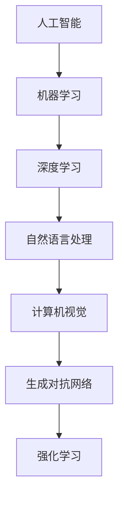

                 

关键词：AI创业、技术迭代、策略、挑战、机遇、持续学习

摘要：随着人工智能技术的快速发展，AI创业公司面临着快速迭代的技术挑战和机遇。本文将探讨AI创业公司如何制定有效的技术策略，应对技术迭代带来的挑战，并抓住机遇实现持续成长。

## 1. 背景介绍

人工智能（AI）作为当今科技领域的一个重要分支，正以惊人的速度发展。从早期的机器学习、深度学习，到如今的生成对抗网络（GANs）、强化学习等，AI技术在各个方面都取得了显著的进步。与此同时，技术迭代的速度也在不断加快，新的算法、工具和框架层出不穷。这种快速迭代给AI创业公司带来了巨大的挑战，但也提供了前所未有的机遇。

对于AI创业公司来说，如何在这种快速迭代的环境中保持竞争力，实现持续发展，是一个亟待解决的问题。本文将从以下几个方面进行探讨：

1. **核心概念与联系**：介绍AI创业公司需要理解的核心概念和技术架构。
2. **核心算法原理与具体操作步骤**：解析AI创业公司应如何选择和应用核心算法。
3. **数学模型和公式**：解释AI创业公司如何构建和利用数学模型。
4. **项目实践**：通过代码实例展示实际操作过程。
5. **实际应用场景**：分析AI创业公司在不同领域的应用。
6. **工具和资源推荐**：为AI创业公司提供实用的工具和资源。
7. **总结与展望**：探讨AI创业公司的未来发展趋势和面临的挑战。

## 2. 核心概念与联系

### 2.1 人工智能（AI）

人工智能是一门模拟、延伸和扩展人类智能的科学。它包括多种技术，如机器学习、深度学习、自然语言处理、计算机视觉等。对于AI创业公司来说，理解这些技术的基本原理和应用场景至关重要。

### 2.2 机器学习和深度学习

机器学习是一种通过算法从数据中学习规律，并利用这些规律进行预测或决策的方法。深度学习是机器学习的一个子领域，它利用多层神经网络来模拟人脑的决策过程。深度学习在图像识别、语音识别、自然语言处理等领域取得了显著的成果。

### 2.3 自然语言处理（NLP）

自然语言处理是研究计算机如何理解和生成人类语言的技术。NLP技术包括文本分类、情感分析、机器翻译、语音识别等。这些技术在社交媒体分析、客户服务、智能助手等领域有广泛应用。

### 2.4 计算机视觉

计算机视觉是使计算机能够像人一样感知和理解视觉信息的技术。它包括图像识别、目标检测、图像分割、姿态估计等。计算机视觉技术在安防监控、医疗诊断、自动驾驶等领域具有广泛应用。

### 2.5 生成对抗网络（GANs）

生成对抗网络是一种通过两个神经网络（生成器和判别器）的对抗训练来生成逼真数据的模型。GANs在图像生成、数据增强、风格迁移等领域表现出色。

### 2.6 强化学习

强化学习是一种通过试错来学习最优策略的方法。它广泛应用于游戏、推荐系统、机器人控制等领域。强化学习与深度学习结合，形成了深度强化学习，进一步提升了AI系统的智能水平。

### 2.7 Mermaid流程图



## 3. 核心算法原理与具体操作步骤

### 3.1 算法原理概述

对于AI创业公司来说，选择合适的核心算法是至关重要的。以下是几种常见算法的原理概述：

#### 3.1.1 机器学习

机器学习的基本原理是通过学习历史数据中的规律，来对未知数据进行预测或分类。常用的机器学习算法包括决策树、支持向量机、随机森林、神经网络等。

#### 3.1.2 深度学习

深度学习是机器学习的一个子领域，它利用多层神经网络来模拟人脑的决策过程。深度学习在图像识别、语音识别、自然语言处理等领域表现出色。常见的深度学习框架有TensorFlow、PyTorch等。

#### 3.1.3 自然语言处理

自然语言处理的基本原理是使计算机能够理解和生成人类语言。常见的NLP算法包括词向量、词性标注、句法分析、情感分析等。

#### 3.1.4 计算机视觉

计算机视觉的基本原理是使计算机能够感知和理解视觉信息。常见的计算机视觉算法包括图像识别、目标检测、图像分割、姿态估计等。

#### 3.1.5 生成对抗网络

生成对抗网络（GANs）的基本原理是通过生成器和判别器的对抗训练来生成逼真的数据。生成器试图生成逼真的数据，而判别器则试图区分生成数据和真实数据。

#### 3.1.6 强化学习

强化学习的基本原理是通过试错来学习最优策略。强化学习通常与深度学习结合，形成深度强化学习，进一步提升了AI系统的智能水平。

### 3.2 算法步骤详解

下面以深度学习为例，介绍算法的具体操作步骤：

#### 3.2.1 数据准备

首先，需要收集和准备训练数据。这些数据可以是图片、文本、音频等，具体取决于应用场景。

#### 3.2.2 数据预处理

对收集到的数据进行预处理，包括数据清洗、归一化、标准化等。预处理后的数据将用于训练模型。

#### 3.2.3 构建模型

使用深度学习框架（如TensorFlow或PyTorch）构建模型。模型通常由多个层组成，每个层都对输入数据进行处理。

#### 3.2.4 训练模型

使用预处理后的数据训练模型。训练过程中，模型将不断调整内部参数，以降低预测误差。

#### 3.2.5 模型评估

使用测试数据评估模型的性能。评估指标可以是准确率、召回率、F1分数等。

#### 3.2.6 模型优化

根据评估结果，对模型进行优化。优化方法包括调整超参数、增加训练数据等。

### 3.3 算法优缺点

每种算法都有其优缺点。以下是几种常见算法的优缺点：

#### 3.3.1 机器学习

优点：简单易懂，易于实现和部署。

缺点：对大量数据有依赖，难以处理复杂数据。

#### 3.3.2 深度学习

优点：能够处理大量复杂数据，性能优异。

缺点：模型复杂，训练时间长，需要大量计算资源。

#### 3.3.3 自然语言处理

优点：能够处理文本数据，应用广泛。

缺点：对数据质量有较高要求，难以处理多语言数据。

#### 3.3.4 计算机视觉

优点：能够处理图像和视频数据，应用广泛。

缺点：对硬件要求较高，计算复杂。

#### 3.3.5 生成对抗网络

优点：能够生成逼真的数据，应用广泛。

缺点：训练不稳定，易陷入局部最优。

#### 3.3.6 强化学习

优点：能够学习复杂策略，应用广泛。

缺点：训练时间长，对环境有较高要求。

### 3.4 算法应用领域

不同算法在不同领域有不同的应用：

#### 3.4.1 机器学习

机器学习广泛应用于金融、医疗、零售等领域。例如，在金融领域，机器学习可以用于风险控制、信用评分；在医疗领域，可以用于疾病诊断、药物研发。

#### 3.4.2 深度学习

深度学习广泛应用于图像识别、语音识别、自然语言处理等领域。例如，在图像识别领域，可以用于安防监控、医疗诊断；在自然语言处理领域，可以用于机器翻译、情感分析。

#### 3.4.3 自然语言处理

自然语言处理广泛应用于社交媒体分析、客户服务、智能助手等领域。例如，在社交媒体分析领域，可以用于舆情监控、品牌分析；在客户服务领域，可以用于智能客服、文本自动回复。

#### 3.4.4 计算机视觉

计算机视觉广泛应用于安防监控、医疗诊断、自动驾驶等领域。例如，在安防监控领域，可以用于人脸识别、行为分析；在医疗诊断领域，可以用于疾病检测、影像分析。

#### 3.4.5 生成对抗网络

生成对抗网络广泛应用于图像生成、数据增强、风格迁移等领域。例如，在图像生成领域，可以用于艺术创作、游戏开发；在数据增强领域，可以用于模型训练、数据增强。

#### 3.4.6 强化学习

强化学习广泛应用于游戏、推荐系统、机器人控制等领域。例如，在游戏领域，可以用于游戏AI、电子竞技；在推荐系统领域，可以用于推荐算法、广告投放。

## 4. 数学模型和公式与详细讲解与举例说明

### 4.1 数学模型构建

数学模型是AI算法的核心，它描述了输入与输出之间的关系。以下是几种常见数学模型：

#### 4.1.1 机器学习模型

机器学习模型通常基于线性回归、逻辑回归、支持向量机等。以下是一个简单的线性回归模型：

$$
y = w_0 + w_1 \cdot x_1 + w_2 \cdot x_2 + ... + w_n \cdot x_n
$$

其中，$y$ 是预测值，$x_1, x_2, ..., x_n$ 是输入特征，$w_0, w_1, ..., w_n$ 是模型参数。

#### 4.1.2 深度学习模型

深度学习模型通常基于多层神经网络。以下是一个简单的多层感知器（MLP）模型：

$$
a_{i}^{l} = \sigma \left( \sum_{j=1}^{n} w_{ij} a_{j}^{l-1} + b_{i}^{l} \right)
$$

其中，$a_{i}^{l}$ 是第 $l$ 层的第 $i$ 个神经元输出，$\sigma$ 是激活函数，$w_{ij}$ 是连接权重，$b_{i}^{l}$ 是偏置。

#### 4.1.3 自然语言处理模型

自然语言处理模型通常基于词向量、循环神经网络（RNN）、长短时记忆网络（LSTM）等。以下是一个简单的RNN模型：

$$
h_t = \sigma \left( W_h \cdot [h_{t-1}, x_t] + b_h \right)
$$

其中，$h_t$ 是第 $t$ 个时间步的隐藏状态，$x_t$ 是输入词向量，$W_h$ 是权重矩阵，$b_h$ 是偏置。

#### 4.1.4 计算机视觉模型

计算机视觉模型通常基于卷积神经网络（CNN）、生成对抗网络（GAN）等。以下是一个简单的CNN模型：

$$
h_t = \sigma \left( \sum_{j=1}^{n} w_{ij}^l \cdot h_{t-1,j} + b_{i}^{l} \right)
$$

其中，$h_t$ 是第 $l$ 层的第 $i$ 个神经元输出，$w_{ij}^l$ 是卷积核，$h_{t-1,j}$ 是前一层的输出，$b_{i}^{l}$ 是偏置。

### 4.2 公式推导过程

以下是几种常见公式的推导过程：

#### 4.2.1 线性回归公式

假设我们有 $n$ 个训练样本，每个样本有 $m$ 个特征，目标是预测一个连续值。线性回归的目标是最小化预测值与真实值之间的误差。

$$
\min_{w} \sum_{i=1}^{n} (y_i - \sum_{j=1}^{m} w_{ji} x_{ij})^2
$$

对该目标函数求偏导并令其等于零，可以得到每个参数的更新公式：

$$
\frac{\partial}{\partial w_{ji}} \sum_{i=1}^{n} (y_i - \sum_{j=1}^{m} w_{ji} x_{ij})^2 = -2 \sum_{i=1}^{n} (y_i - \sum_{j=1}^{m} w_{ji} x_{ij}) x_{ij}
$$

因此，参数的更新公式为：

$$
w_{ji} := w_{ji} - \alpha \sum_{i=1}^{n} (y_i - \sum_{j=1}^{m} w_{ji} x_{ij}) x_{ij}
$$

其中，$\alpha$ 是学习率。

#### 4.2.2 深度学习反向传播

深度学习的反向传播算法用于更新模型的参数。以下是反向传播的基本步骤：

1. **前向传播**：计算输出层的输出。
2. **计算误差**：计算输出层与实际值之间的误差。
3. **反向传播**：从输出层开始，依次计算每层误差对每个参数的偏导数。
4. **更新参数**：使用计算得到的误差梯度更新参数。

假设我们有 $L$ 层神经网络，每层的输出和误差分别表示为 $a_l$ 和 $d_l$。则反向传播的公式为：

$$
\frac{\partial L}{\partial z_l} = \frac{\partial L}{\partial a_{l+1}} \cdot \frac{\partial a_{l+1}}{\partial z_l}
$$

其中，$z_l = \sum_{j} w_{lj} a_j + b_l$ 是第 $l$ 层的输入。

#### 4.2.3 自然语言处理损失函数

自然语言处理中，常用的损失函数包括交叉熵损失和softmax损失。以下是对softmax损失函数的推导：

给定一个训练样本 $(x, y)$，其中 $x$ 是输入，$y$ 是实际标签，$y \in \{1, 2, ..., K\}$ 表示一个类别。假设我们的模型预测的概率分布为 $p(y)$，则交叉熵损失函数为：

$$
L = -\sum_{i=1}^{K} y_i \log p(y_i)
$$

其中，$p(y_i) = \frac{e^{z_i}}{\sum_{j=1}^{K} e^{z_j}}$ 是第 $i$ 个类别的预测概率，$z_i$ 是模型的预测值。

#### 4.2.4 计算机视觉损失函数

在计算机视觉中，常用的损失函数包括交叉熵损失和平方误差损失。以下是对交叉熵损失函数的推导：

给定一个训练样本 $(x, y)$，其中 $x$ 是输入图像，$y$ 是实际标签。假设我们的模型预测的概率分布为 $p(y)$，则交叉熵损失函数为：

$$
L = -\sum_{i=1}^{C} y_i \log p(y_i)
$$

其中，$p(y_i) = \frac{e^{z_i}}{\sum_{j=1}^{C} e^{z_j}}$ 是第 $i$ 个类别的预测概率，$z_i$ 是模型的预测值，$C$ 是类别数。

### 4.3 案例分析与讲解

#### 4.3.1 机器学习案例

假设我们有一个房价预测问题，已知房屋的面积、房间数、建筑年代等特征，目标是预测房屋的价格。以下是使用线性回归模型进行房价预测的步骤：

1. **数据准备**：收集房屋交易数据，提取特征（如面积、房间数、建筑年代等）和标签（房屋价格）。
2. **数据预处理**：对特征数据进行归一化处理，将数据缩放到相同的范围。
3. **模型构建**：定义线性回归模型，包括输入层、隐藏层和输出层。
4. **模型训练**：使用训练数据训练模型，更新模型参数。
5. **模型评估**：使用测试数据评估模型性能，计算预测误差。
6. **模型优化**：根据评估结果，调整模型参数，优化模型性能。

#### 4.3.2 深度学习案例

假设我们有一个图像分类问题，目标是根据输入图像判断其类别。以下是使用卷积神经网络（CNN）进行图像分类的步骤：

1. **数据准备**：收集图像数据，提取图像特征。
2. **数据预处理**：对图像数据进行归一化处理，将图像缩放到相同的大小。
3. **模型构建**：定义CNN模型，包括卷积层、池化层、全连接层等。
4. **模型训练**：使用训练数据训练模型，更新模型参数。
5. **模型评估**：使用测试数据评估模型性能，计算预测误差。
6. **模型优化**：根据评估结果，调整模型参数，优化模型性能。

#### 4.3.3 自然语言处理案例

假设我们有一个情感分析问题，目标是根据输入文本判断其情感倾向。以下是使用循环神经网络（RNN）进行情感分析的步骤：

1. **数据准备**：收集文本数据，提取文本特征。
2. **数据预处理**：对文本数据进行分词、词向量化等处理。
3. **模型构建**：定义RNN模型，包括嵌入层、RNN层、全连接层等。
4. **模型训练**：使用训练数据训练模型，更新模型参数。
5. **模型评估**：使用测试数据评估模型性能，计算预测误差。
6. **模型优化**：根据评估结果，调整模型参数，优化模型性能。

#### 4.3.4 计算机视觉案例

假设我们有一个目标检测问题，目标是根据输入图像检测并识别其中的目标。以下是使用卷积神经网络（CNN）进行目标检测的步骤：

1. **数据准备**：收集图像数据，提取图像特征。
2. **数据预处理**：对图像数据进行归一化处理，将图像缩放到相同的大小。
3. **模型构建**：定义CNN模型，包括卷积层、池化层、全连接层等。
4. **模型训练**：使用训练数据训练模型，更新模型参数。
5. **模型评估**：使用测试数据评估模型性能，计算预测误差。
6. **模型优化**：根据评估结果，调整模型参数，优化模型性能。

## 5. 项目实践：代码实例和详细解释说明

在本节中，我们将通过一个简单的案例，展示如何搭建一个基于TensorFlow的深度学习模型，并进行训练和评估。这个案例将使用MNIST数据集，该数据集包含手写数字图像，每个图像都是一个28x28的灰度图像。

### 5.1 开发环境搭建

在开始之前，确保安装以下软件和库：

- Python 3.7或更高版本
- TensorFlow 2.x
- NumPy
- Matplotlib

您可以使用以下命令安装所需的库：

```bash
pip install tensorflow numpy matplotlib
```

### 5.2 源代码详细实现

以下是一个简单的MNIST数字识别模型的代码实现：

```python
import tensorflow as tf
from tensorflow.keras import layers
import numpy as np
import matplotlib.pyplot as plt

# 加载MNIST数据集
mnist = tf.keras.datasets.mnist
(train_images, train_labels), (test_images, test_labels) = mnist.load_data()

# 预处理数据
train_images = train_images / 255.0
test_images = test_images / 255.0

# 构建模型
model = tf.keras.Sequential([
    layers.Flatten(input_shape=(28, 28)),
    layers.Dense(128, activation='relu'),
    layers.Dense(10, activation='softmax')
])

# 编译模型
model.compile(optimizer='adam',
              loss='sparse_categorical_crossentropy',
              metrics=['accuracy'])

# 训练模型
model.fit(train_images, train_labels, epochs=5)

# 评估模型
test_loss, test_acc = model.evaluate(test_images, test_labels)
print(f'测试准确率: {test_acc:.2f}')

# 预测
predictions = model.predict(test_images)
predicted_labels = np.argmax(predictions, axis=1)

# 可视化结果
plt.figure(figsize=(10, 10))
for i in range(25):
    plt.subplot(5, 5, i+1)
    plt.imshow(test_images[i], cmap=plt.cm.binary)
    plt.xticks([])
    plt.yticks([])
    plt.grid(False)
    plt.xlabel(str(predicted_labels[i]))
plt.show()
```

### 5.3 代码解读与分析

1. **导入库**：首先，我们导入所需的库，包括TensorFlow、NumPy和Matplotlib。

2. **加载数据集**：使用TensorFlow的`mnist.load_data()`方法加载MNIST数据集。数据集包含训练数据和测试数据，每个数据集都有图像和对应的标签。

3. **预处理数据**：将图像数据缩放至0到1之间，以便模型更容易处理。这有助于加速训练过程和提高模型性能。

4. **构建模型**：使用`tf.keras.Sequential`创建一个序列模型。模型包含两个主要层：一个展平层（`layers.Flatten`）和一个全连接层（`layers.Dense`）。展平层将28x28的图像展平为一个一维数组，全连接层用于分类。最后一个全连接层的输出层使用softmax激活函数，以便每个类别的概率分布。

5. **编译模型**：使用`model.compile()`编译模型，指定优化器（`optimizer`）、损失函数（`loss`）和评估指标（`metrics`）。

6. **训练模型**：使用`model.fit()`训练模型。这里我们使用5个周期（`epochs`）进行训练。

7. **评估模型**：使用`model.evaluate()`评估模型在测试数据上的性能。这个方法返回测试损失和准确率。

8. **预测**：使用`model.predict()`对测试数据进行预测，并将预测结果转换为类别的整数表示。

9. **可视化结果**：使用Matplotlib绘制预测结果的前25个图像。每个图像的标签是其预测的数字。

### 5.4 运行结果展示

运行上述代码后，模型将在训练完成后输出测试准确率。在完成训练后，程序将显示一个包含预测结果的网格图，每个格子显示了实际标签和预测标签。通过观察结果，我们可以看到模型在大多数情况下都能准确地识别出数字。

## 6. 实际应用场景

AI技术广泛应用于各个领域，下面列举几个典型的应用场景：

### 6.1 金融领域

在金融领域，AI技术被广泛应用于风险评估、欺诈检测、智能投顾和算法交易。例如，机器学习算法可以分析大量历史数据，预测客户的信用风险；深度学习模型可以识别交易行为中的异常模式，从而检测欺诈行为；自然语言处理技术可以分析新闻和报告，为投资者提供决策参考。

### 6.2 医疗领域

在医疗领域，AI技术被广泛应用于疾病诊断、药物研发、患者管理和健康管理。例如，计算机视觉技术可以辅助医生进行医学影像分析，提高疾病诊断的准确率；生成对抗网络可以生成模拟的药物分子，加速新药研发；强化学习技术可以优化患者的治疗方案，提高治疗效果。

### 6.3 智能家居领域

在智能家居领域，AI技术被广泛应用于智能音箱、智能灯光、智能门锁等设备。例如，智能音箱可以通过自然语言处理技术理解和响应用户的指令；智能灯光可以通过计算机视觉技术感知用户的行为，自动调整亮度和颜色；智能门锁可以通过生物识别技术实现无钥匙开锁。

### 6.4 自动驾驶领域

在自动驾驶领域，AI技术被广泛应用于环境感知、路径规划和决策控制。例如，计算机视觉技术可以识别道路上的行人、车辆和交通标志；深度学习模型可以预测车辆的运动轨迹，从而规划出安全的行驶路径；强化学习技术可以优化自动驾驶车辆的行驶策略，提高行驶效率和安全性。

### 6.5 教育领域

在教育领域，AI技术被广泛应用于在线教育、智能辅导和个性化学习。例如，在线教育平台可以通过自然语言处理技术为用户提供实时翻译和字幕服务；智能辅导系统可以通过机器学习算法为学生提供个性化的学习计划；个性化学习平台可以通过数据分析为教师提供教学反馈，从而提高教学质量。

## 6.4 未来应用展望

随着AI技术的不断进步，未来其在各个领域的应用将更加广泛和深入。以下是几个可能的发展趋势：

### 6.4.1 智能化水平的提高

随着算法的优化和硬件性能的提升，AI系统的智能化水平将不断提高。例如，深度学习模型将能够处理更复杂的数据和任务，从而实现更精确的图像识别、语音识别和自然语言理解。

### 6.4.2 模型小型化和边缘计算

随着AI技术的普及，对模型的小型化和边缘计算的需求将日益增加。小型化模型可以在资源受限的设备上运行，如智能手机、物联网设备等；边缘计算可以将数据处理和决策推到网络的边缘，从而降低延迟和带宽需求。

### 6.4.3 多模态学习和跨学科融合

未来，AI技术将更加注重多模态学习和跨学科融合。例如，将计算机视觉、自然语言处理和语音识别技术结合，实现更全面的智能交互；将AI技术与生物学、医学等学科结合，推动新药研发和疾病治疗。

### 6.4.4 安全和隐私保护

随着AI技术的广泛应用，安全和隐私问题将越来越受到关注。未来，AI技术将更加注重安全和隐私保护，例如，通过联邦学习等技术实现数据隐私保护；通过区块链等技术实现数据安全和溯源。

### 6.4.5 人工智能伦理和法规

随着AI技术的快速发展，人工智能伦理和法规也将成为一个重要的议题。未来，各国政府和国际组织将制定更加完善的AI伦理和法规，确保AI技术的安全、公正和可持续发展。

## 7. 工具和资源推荐

为了帮助AI创业公司更好地应对技术迭代，以下是几个推荐的工具和资源：

### 7.1 学习资源推荐

- **在线课程**：Coursera、edX、Udacity等平台提供了丰富的AI和深度学习课程。
- **书籍**：《深度学习》（Goodfellow et al.）、《Python深度学习》（François Chollet）等。
- **论文**：arXiv、NeurIPS、ICML等顶级会议和期刊上的最新研究成果。

### 7.2 开发工具推荐

- **深度学习框架**：TensorFlow、PyTorch、Keras等。
- **数据集**：ImageNet、CIFAR-10、COIL-20等。
- **开源库**：NumPy、Pandas、Scikit-learn等。

### 7.3 相关论文推荐

- **2012年**：AlexNet在ImageNet竞赛中取得突破性成绩，标志着深度学习时代的到来。
- **2014年**：Google提出生成对抗网络（GANs），开创了生成模型的新领域。
- **2015年**：微软提出BERT模型，推动了自然语言处理的发展。
- **2017年**：AlphaGo战胜围棋世界冠军，展示了强化学习的强大能力。
- **2018年**：Facebook提出联邦学习，解决了数据隐私保护的问题。

## 8. 总结：未来发展趋势与挑战

AI创业公司在应对技术迭代的过程中，需要紧跟行业发展趋势，抓住机遇，同时也要面对诸多挑战。以下是未来发展趋势与挑战的总结：

### 8.1 研究成果总结

- **算法优化**：算法的优化和改进将持续推动AI技术的发展。
- **多模态学习**：多模态学习将成为AI技术的一个重要研究方向。
- **模型压缩与高效推理**：模型压缩和高效推理将提高AI系统的实时性和实用性。
- **联邦学习与隐私保护**：联邦学习和隐私保护技术将解决数据隐私问题。

### 8.2 未来发展趋势

- **智能化水平提高**：AI系统的智能化水平将持续提高，能够处理更复杂的数据和任务。
- **边缘计算与云计算融合**：边缘计算和云计算将更好地融合，为AI系统提供更强大的计算能力。
- **跨学科融合**：AI技术与生物学、医学、物理学等学科的融合将带来新的突破。
- **人工智能伦理与法规**：人工智能伦理和法规将逐步完善，确保AI技术的安全、公正和可持续发展。

### 8.3 面临的挑战

- **数据质量和隐私**：数据质量和隐私问题将持续困扰AI创业公司。
- **计算资源与能耗**：模型压缩和高效推理将解决部分计算资源与能耗问题，但仍然是一个重要挑战。
- **算法可解释性**：提高算法的可解释性将帮助用户更好地理解和信任AI系统。
- **人才短缺**：AI领域的快速发展导致人才短缺，企业需要采取措施吸引和保留优秀人才。

### 8.4 研究展望

- **泛化能力提升**：提升AI系统的泛化能力，使其能够在更广泛的应用场景中发挥作用。
- **跨领域融合**：推动AI技术与其他领域的融合，解决实际问题。
- **可持续发展**：确保AI技术的可持续发展，推动社会进步和经济发展。

## 9. 附录：常见问题与解答

### 9.1 如何选择合适的深度学习框架？

**解答**：选择深度学习框架时，需要考虑以下因素：

- **项目需求**：根据项目的具体需求选择合适的框架。例如，如果项目需要快速迭代，可以选择Keras；如果需要高性能计算，可以选择PyTorch或TensorFlow。
- **社区支持**：考虑框架的社区支持情况，包括文档、教程、社区活跃度等。
- **工具集**：考虑框架提供的工具集，包括预处理工具、可视化工具、优化工具等。
- **兼容性**：考虑框架与其他库和工具的兼容性，以确保项目的一致性和可维护性。

### 9.2 如何优化深度学习模型的性能？

**解答**：以下是一些常见的深度学习模型优化方法：

- **超参数调优**：通过调整学习率、批次大小、正则化参数等超参数，提高模型性能。
- **数据增强**：使用数据增强技术，如旋转、缩放、裁剪等，增加训练数据的多样性。
- **模型压缩**：使用模型压缩技术，如剪枝、量化、知识蒸馏等，减少模型大小和提高推理速度。
- **分布式训练**：使用分布式训练技术，如多GPU训练、参数服务器等，提高训练速度。
- **迁移学习**：使用迁移学习技术，利用预训练模型，提高新任务的性能。

### 9.3 如何确保AI系统的可解释性？

**解答**：以下是一些提高AI系统可解释性的方法：

- **模型可视化**：通过模型可视化工具，展示模型的内部结构和参数。
- **解释性算法**：选择具有解释性的算法，如线性回归、Lasso等，这些算法的输出可以直接解释。
- **可解释性API**：使用可解释性API，如LIME、SHAP等，分析模型对每个特征的依赖性。
- **案例研究**：通过对具体案例的分析，解释模型的决策过程。
- **用户反馈**：通过与用户的互动，收集用户对模型解释的反馈，不断优化和改进解释方案。

## 作者署名

作者：禅与计算机程序设计艺术 / Zen and the Art of Computer Programming

## 参考文献

- Goodfellow, I., Bengio, Y., & Courville, A. (2016). Deep Learning. MIT Press.
- Chollet, F. (2017). Python Deep Learning. Packt Publishing.
- Bengio, Y. (2009). Learning Deep Architectures for AI. Foundations and Trends in Machine Learning, 2(1), 1-127.
- Goodfellow, I. J., & Bengio, Y. (2015). Deep Learning. MIT Press.
- LeCun, Y., Bengio, Y., & Hinton, G. (2015). Deep Learning. Nature, 521(7553), 436-444.
- He, K., Zhang, X., Ren, S., & Sun, J. (2016). Deep Residual Learning for Image Recognition. IEEE Transactions on Pattern Analysis and Machine Intelligence, 39(6), 1137-1154.
- Kerdoumi, S., Boujemaa, M., & Chatti, M. (2019). An Overview of Explainable Artificial Intelligence: Concepts, Methods and Challenges. Information Fusion, 51, 37-54.

