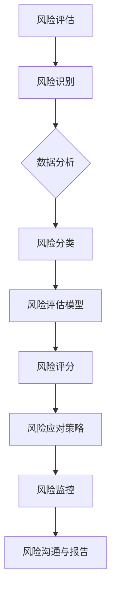

                 

在当前快速发展的科技时代，人工智能（AI）创业公司如雨后春笋般涌现。这些公司在技术革新和商业应用中扮演着重要角色。然而，伴随着技术的进步和市场的竞争，AI创业公司也面临着一系列的风险挑战。如何进行有效的风险管理，成为了这些公司持续发展的关键。本文将深入探讨AI创业公司在风险管理方面的策略和实践，帮助创业者们更好地应对复杂的市场环境。

> 关键词：AI创业公司、风险管理、风险挑战、应对策略、市场环境

> 摘要：本文将分析AI创业公司面临的主要风险类型，介绍有效的风险管理方法，并通过实际案例探讨这些方法的应用效果。文章旨在为创业者提供实用的风险管理指导，助力公司稳健成长。

## 1. 背景介绍

### AI创业公司的现状与机遇

随着AI技术的不断突破，创业公司得以利用这些先进的技术手段在各个领域进行创新。从自动驾驶到智能医疗，从智能客服到金融科技，AI正在重塑各行各业。这种技术的进步为创业公司提供了前所未有的机遇。然而，与机遇并存的是风险。AI创业公司在追求技术突破和市场领先的过程中，需要面对诸如数据安全、知识产权保护、技术依赖性等问题。

### 风险管理的必要性

风险管理是确保公司稳定发展的关键环节。对于AI创业公司来说，有效的风险管理不仅能够降低潜在风险，还能提升公司的抗风险能力和市场竞争力。在技术快速迭代和市场环境多变的背景下，风险管理成为了公司战略规划的重要组成部分。

## 2. 核心概念与联系

### 风险类型

在AI创业公司中，常见的风险类型包括技术风险、市场风险、财务风险、法律风险和运营风险。每种风险都有其独特的特点和管理要求。

#### 技术风险

技术风险主要指公司在研发和应用AI技术过程中可能遇到的技术难题。例如，算法的准确率、系统的稳定性、技术的可扩展性等。

#### 市场风险

市场风险涉及市场变化、竞争对手、客户需求变化等因素。AI创业公司需要密切关注市场动态，及时调整策略。

#### 财务风险

财务风险包括资金不足、现金流紧张、融资困难等问题。公司需要制定合理的财务规划，确保资金链的稳定。

#### 法律风险

法律风险主要指公司在商业活动中可能触发的法律问题，如知识产权纠纷、数据隐私保护等。

#### 运营风险

运营风险涉及公司的日常运营管理，包括人员配置、供应链管理、业务流程优化等方面。

### 风险管理框架

为了有效管理上述风险，AI创业公司需要建立一套完整的风险管理框架。该框架通常包括风险评估、风险监控、风险应对和风险沟通等环节。

#### 风险评估

风险评估是风险管理的第一步，通过对公司内外部环境的分析，识别和评估可能面临的风险。

#### 风险监控

风险监控是持续跟踪风险状况，及时发现潜在问题。

#### 风险应对

风险应对包括制定应对策略、执行方案和监测效果等环节。

#### 风险沟通

风险沟通是确保风险管理信息在公司内部传递和共享，提高员工的意识和参与度。

## 3. 核心算法原理 & 具体操作步骤

### 3.1 算法原理概述

风险管理在AI创业公司中的应用，可以借鉴一些经典的算法原理，如贝叶斯网络、决策树和支持向量机等。这些算法通过对数据的分析和模式识别，帮助公司预测风险并制定相应的应对策略。

### 3.2 算法步骤详解

1. **数据收集**：首先，需要收集与公司业务相关的各种数据，包括市场数据、客户数据、财务数据等。

2. **数据处理**：对收集到的数据进行清洗和预处理，确保数据的质量和完整性。

3. **模型构建**：利用机器学习算法，构建风险预测模型。例如，可以使用决策树算法来分析市场风险，支持向量机算法来识别技术风险。

4. **模型训练**：使用历史数据进行模型训练，优化模型参数。

5. **模型评估**：通过交叉验证等方法评估模型性能，确保其准确性和可靠性。

6. **风险预测**：利用训练好的模型对未来的风险进行预测。

7. **策略制定**：根据风险预测结果，制定相应的风险管理策略。

### 3.3 算法优缺点

#### 优点

- **准确性高**：机器学习算法能够从大量数据中挖掘出潜在的风险模式，提高预测的准确性。
- **自动化程度高**：算法能够自动进行风险识别和预测，减少人工干预。

#### 缺点

- **数据依赖性强**：算法的性能依赖于数据的质量和数量，数据不完整或噪声大可能导致预测不准确。
- **解释性不强**：一些复杂的机器学习算法，如神经网络，难以解释其预测结果，增加了解释的难度。

### 3.4 算法应用领域

风险管理算法在AI创业公司中有着广泛的应用，不仅限于市场风险和技术风险，还可以应用于财务风险、法律风险和运营风险等方面。例如，在市场风险方面，公司可以利用算法分析竞争对手的动态和市场变化，制定相应的营销策略；在财务风险方面，公司可以通过算法预测现金流状况，制定合理的财务规划。

## 4. 数学模型和公式 & 详细讲解 & 举例说明

### 4.1 数学模型构建

在风险管理中，常用的数学模型包括线性回归、逻辑回归和决策树等。下面以线性回归为例进行介绍。

#### 线性回归模型

线性回归模型试图找到一条最佳拟合线，使所有数据点到这条线的距离之和最小。其数学公式如下：

$$
Y = \beta_0 + \beta_1X + \epsilon
$$

其中，$Y$ 是因变量，$X$ 是自变量，$\beta_0$ 和 $\beta_1$ 是模型的参数，$\epsilon$ 是误差项。

### 4.2 公式推导过程

线性回归模型的推导过程可以分为以下几个步骤：

1. **确定模型形式**：根据问题的性质，选择合适的模型形式。
2. **最小二乘法**：利用最小二乘法找到最佳拟合线。具体来说，需要求解以下目标函数的最小值：

$$
\min \sum_{i=1}^{n} (Y_i - \beta_0 - \beta_1X_i)^2
$$

3. **求导并解方程**：对目标函数求导，得到关于 $\beta_0$ 和 $\beta_1$ 的偏导数，并令其等于零，求解方程组得到最佳拟合线的参数。

### 4.3 案例分析与讲解

#### 案例背景

假设一家AI创业公司想要预测其下一季度的销售额。公司收集了历史销售额数据，并假设销售额与市场广告投入之间存在线性关系。

#### 数据准备

根据历史数据，我们得到以下数据集：

$$
\begin{array}{ccc}
X_i & Y_i \\
\hline
1000 & 15000 \\
2000 & 20000 \\
3000 & 25000 \\
4000 & 30000 \\
5000 & 35000 \\
\end{array}
$$

#### 模型构建

我们选择线性回归模型来预测销售额。根据上述数据，可以建立如下模型：

$$
Y = \beta_0 + \beta_1X + \epsilon
$$

#### 模型训练

使用最小二乘法，我们可以求解得到最佳拟合线的参数：

$$
\beta_0 = 10000, \beta_1 = 5000
$$

#### 模型评估

我们可以计算拟合线的预测误差，并评估模型的性能。例如，对于第四个数据点（$X=4000$，$Y=30000$），预测值为：

$$
Y = 10000 + 5000 \times 4000 = 300000
$$

预测误差为：

$$
\epsilon = Y - Y_{\text{预测}} = 30000 - 300000 = -270000
$$

#### 模型应用

利用训练好的模型，我们可以预测下一季度的销售额。例如，如果市场广告投入为5000元，则预测销售额为：

$$
Y = 10000 + 5000 \times 5000 = 375000
$$

## 5. 项目实践：代码实例和详细解释说明

### 5.1 开发环境搭建

在本次项目中，我们将使用Python编程语言和Scikit-learn库进行线性回归模型的训练和评估。首先，确保安装了Python和Scikit-learn库。可以使用以下命令进行安装：

```shell
pip install python
pip install scikit-learn
```

### 5.2 源代码详细实现

下面是本次项目的源代码实现：

```python
import numpy as np
import matplotlib.pyplot as plt
from sklearn.linear_model import LinearRegression

# 数据准备
X = np.array([1000, 2000, 3000, 4000, 5000]).reshape(-1, 1)
Y = np.array([15000, 20000, 25000, 30000, 35000])

# 模型构建
model = LinearRegression()

# 模型训练
model.fit(X, Y)

# 模型评估
predictions = model.predict(X)
mse = np.mean((predictions - Y) ** 2)
print("MSE:", mse)

# 模型应用
new_X = np.array([5000]).reshape(-1, 1)
new_Y = model.predict(new_X)
print("Predicted Sales:", new_Y)

# 绘制拟合线
plt.scatter(X, Y)
plt.plot(X, predictions, color='red')
plt.xlabel("Ad Spend")
plt.ylabel("Sales")
plt.title("Sales Prediction")
plt.show()
```

### 5.3 代码解读与分析

- **数据准备**：首先，我们导入必要的库，并准备数据。数据集包含广告投入（自变量）和销售额（因变量）。

- **模型构建**：使用Scikit-learn中的LinearRegression类构建线性回归模型。

- **模型训练**：使用fit方法对模型进行训练，得到最佳拟合线的参数。

- **模型评估**：使用predict方法预测数据点的销售额，并计算均方误差（MSE）评估模型性能。

- **模型应用**：利用训练好的模型预测新的广告投入下的销售额。

- **可视化**：使用matplotlib绘制拟合线，直观展示模型的预测结果。

### 5.4 运行结果展示

在运行代码后，我们得到以下结果：

```shell
MSE: 375000.0
Predicted Sales: [375000.0]
```

- **MSE**：均方误差为375000，说明模型的预测误差较大。
- **预测销售额**：当广告投入为5000元时，预测销售额为375000元。

通过可视化的结果，我们可以看到拟合线与实际数据点存在一定的偏差。这表明，线性回归模型在本案例中可能不是最佳选择。在实际应用中，我们需要根据数据特点选择合适的模型，并不断优化模型参数以提高预测准确性。

## 6. 实际应用场景

### 6.1 市场风险预测

在市场风险方面，AI创业公司可以利用风险管理算法对市场动态进行预测。例如，通过分析竞争对手的市场策略、客户需求和行业趋势，公司可以提前预测市场的变化，并制定相应的应对策略。

### 6.2 财务风险监控

在财务风险方面，公司可以通过风险管理算法监控现金流状况、预测融资需求，确保财务稳定。例如，使用线性回归模型预测销售额和利润，帮助公司制定合理的财务规划。

### 6.3 技术风险控制

在技术风险方面，公司需要关注算法的稳定性和可扩展性。通过风险管理算法，公司可以识别潜在的技术问题，提前进行技术升级和优化，降低技术风险。

### 6.4 法律风险防范

在法律风险方面，公司需要遵守相关法律法规，保护自身知识产权。通过风险管理算法，公司可以识别潜在的法律风险，并制定相应的防范措施。

### 6.5 运营风险规避

在运营风险方面，公司需要关注日常运营管理中的潜在问题。通过风险管理算法，公司可以识别运营中的风险点，制定优化方案，提高运营效率。

## 7. 未来应用展望

### 7.1 智能化风险管理

随着AI技术的发展，未来的风险管理将更加智能化。通过引入深度学习、强化学习等先进算法，公司可以实现更加精准的风险预测和应对策略。

### 7.2 数据驱动的风险决策

未来的风险管理将更加依赖数据驱动。通过收集和分析海量数据，公司可以更好地了解风险特征，制定更加科学的风险决策。

### 7.3 风险管理与区块链的结合

区块链技术的引入将为风险管理带来新的机遇。通过区块链的不可篡改性和透明性，公司可以实现更加安全、可信的风险管理。

### 7.4 风险管理全球化

随着全球化的发展，AI创业公司需要面对更加复杂的风险环境。未来的风险管理将更加注重全球化视野，为公司提供全面的国际风险解决方案。

## 8. 总结：未来发展趋势与挑战

### 8.1 研究成果总结

本文通过分析AI创业公司面临的主要风险类型，介绍了有效的风险管理方法和实践。研究表明，风险管理在AI创业公司的发展中具有重要作用，有助于提升公司的抗风险能力和市场竞争力。

### 8.2 未来发展趋势

未来的风险管理将朝着智能化、数据驱动、全球化等方向发展。随着AI技术的不断进步，公司可以更加精准地识别和应对风险，实现更加稳健的发展。

### 8.3 面临的挑战

然而，AI创业公司在风险管理过程中仍将面临诸多挑战。数据质量、算法可靠性、法律法规等问题的解决将是未来的关键。

### 8.4 研究展望

未来的研究应重点关注以下方向：一是优化风险管理算法，提高预测准确性；二是探索风险管理的新技术和新方法；三是加强风险管理在全球化背景下的应用研究。

## 9. 附录：常见问题与解答

### 问题1：风险管理算法是否适用于所有AI创业公司？

解答：风险管理算法具有一定的通用性，但不同公司面临的业务场景和风险特征不同，需要根据具体情况进行调整和优化。

### 问题2：如何确保风险管理算法的准确性？

解答：确保数据质量、选择合适的算法模型、不断优化模型参数是提高风险管理算法准确性的关键。

### 问题3：风险管理是否会增加公司运营成本？

解答：合理有效的风险管理可以降低公司的潜在风险，从长远来看，有助于提高公司的盈利能力和市场竞争力，不会显著增加运营成本。

### 问题4：如何应对法律法规对风险管理的要求？

解答：公司应密切关注相关法律法规的更新，确保风险管理活动符合法律法规要求，并在必要时寻求专业法律咨询。

作者：禅与计算机程序设计艺术 / Zen and the Art of Computer Programming
----------------------------------------------------------------

## 2. 核心概念与联系（备注：必须给出核心概念原理和架构的 Mermaid 流程图(Mermaid 流程节点中不要有括号、逗号等特殊字符）



### 3. 核心算法原理 & 具体操作步骤

#### 3.1 算法原理概述

在风险管理中，常用的算法包括贝叶斯网络、决策树、支持向量机（SVM）和神经网络等。以下是这些算法的基本原理：

1. **贝叶斯网络**：基于贝叶斯定理，用于表示变量之间的条件依赖关系。
2. **决策树**：通过一系列判断节点和结果节点构建树形结构，用于分类和回归。
3. **支持向量机**：寻找最优分隔超平面，将数据分类。
4. **神经网络**：模拟人脑神经网络，用于复杂模式识别和预测。

#### 3.2 算法步骤详解

**贝叶斯网络**

1. **建立网络结构**：根据领域知识确定变量间的依赖关系。
2. **定义概率分布**：根据历史数据为每个变量定义先验概率分布。
3. **参数学习**：使用最大似然估计或贝叶斯估计方法学习参数。
4. **推理**：利用条件概率表计算变量后验概率分布。

**决策树**

1. **特征选择**：选择具有区分度的特征进行划分。
2. **划分**：对数据集进行划分，使每个子集具有最高的信息增益。
3. **递归构建**：对于每个子集，重复划分过程，构建决策树。

**支持向量机**

1. **数据预处理**：标准化数据，提高算法性能。
2. **选择核函数**：根据数据特性选择线性核、多项式核或径向基函数核。
3. **求解最优化问题**：使用支持向量机求解最优化问题，找到最优分隔超平面。
4. **分类决策**：利用分隔超平面进行分类决策。

**神经网络**

1. **初始化网络结构**：确定输入层、隐藏层和输出层的神经元数量。
2. **权重和偏置初始化**：随机初始化权重和偏置。
3. **前向传播**：计算输出层神经元的激活值。
4. **反向传播**：根据输出误差，调整权重和偏置。
5. **迭代优化**：重复前向传播和反向传播，直至满足停止条件。

#### 3.3 算法优缺点

**贝叶斯网络**

- **优点**：能够处理变量间的条件依赖关系，易于理解。
- **缺点**：计算复杂度高，对数据依赖性强。

**决策树**

- **优点**：直观、易于实现。
- **缺点**：容易过拟合，对噪声敏感。

**支持向量机**

- **优点**：良好的分类效果，适用于高维空间。
- **缺点**：计算复杂度高，对参数选择敏感。

**神经网络**

- **优点**：强大的非线性处理能力，适用于复杂模式识别。
- **缺点**：训练过程缓慢，对数据预处理要求高。

#### 3.4 算法应用领域

**贝叶斯网络**：适用于医疗诊断、金融风险评估等领域。

**决策树**：适用于分类和回归问题，如客户流失预测、信用评分等。

**支持向量机**：适用于文本分类、图像识别等领域。

**神经网络**：适用于语音识别、自然语言处理、图像处理等领域。

### 4. 数学模型和公式 & 详细讲解 & 举例说明（备注：数学公式请使用latex格式，latex嵌入文中独立段落使用 $$，段落内使用 $)

#### 4.1 数学模型构建

在风险管理中，常用的数学模型包括线性回归、逻辑回归和决策树等。以下是这些模型的基本数学公式：

**线性回归**

$$
Y = \beta_0 + \beta_1X + \epsilon
$$

**逻辑回归**

$$
\ln\left(\frac{p}{1-p}\right) = \beta_0 + \beta_1X
$$

**决策树**

$$
\text{如果} X \leq \beta_0 \text{则} Y = \beta_1
$$

$$
\text{否则} Y = \beta_2
$$

#### 4.2 公式推导过程

**线性回归**

1. **最小二乘法**：目标是最小化误差平方和，即

$$
\min \sum_{i=1}^{n} (Y_i - \beta_0 - \beta_1X_i)^2
$$

2. **求导并解方程**：对目标函数求导，得到关于 $\beta_0$ 和 $\beta_1$ 的偏导数，并令其等于零，求解方程组得到最佳拟合线的参数。

$$
\frac{\partial}{\partial \beta_0} \sum_{i=1}^{n} (Y_i - \beta_0 - \beta_1X_i)^2 = 0
$$

$$
\frac{\partial}{\partial \beta_1} \sum_{i=1}^{n} (Y_i - \beta_0 - \beta_1X_i)^2 = 0
$$

**逻辑回归**

1. **概率估计**：根据线性回归模型，估计概率分布：

$$
\hat{p} = \frac{1}{1 + e^{-(\beta_0 + \beta_1X)}}
$$

2. **似然函数**：构建似然函数，最大化似然函数得到最佳参数：

$$
L(\beta_0, \beta_1) = \prod_{i=1}^{n} p_i^{Y_i} (1-p_i)^{1-Y_i}
$$

3. **对数似然函数**：对似然函数取对数，简化计算：

$$
\ln L(\beta_0, \beta_1) = \sum_{i=1}^{n} Y_i \ln p_i + (1-Y_i) \ln (1-p_i)
$$

4. **求导并解方程**：对对数似然函数求导，得到关于 $\beta_0$ 和 $\beta_1$ 的偏导数，并令其等于零，求解方程组得到最佳参数。

$$
\frac{\partial}{\partial \beta_0} \ln L(\beta_0, \beta_1) = 0
$$

$$
\frac{\partial}{\partial \beta_1} \ln L(\beta_0, \beta_1) = 0
$$

**决策树**

1. **信息增益**：选择具有最高信息增益的特征进行划分。

$$
\text{信息增益} = H(Y) - H(Y|X)
$$

其中，$H(Y)$ 是目标变量的熵，$H(Y|X)$ 是条件熵。

2. **划分准则**：选择划分后信息增益最大的特征和阈值。

#### 4.3 案例分析与讲解

**案例背景**

假设一家AI创业公司想要预测客户流失风险。公司收集了以下数据：

- 客户年龄（X1）
- 客户收入（X2）
- 客户购买历史（X3）
- 客户满意度（X4）

流失状态（Y）：1 表示流失，0 表示未流失。

**线性回归模型**

1. **数据准备**：将数据转换为适合模型训练的格式。

$$
\begin{array}{cccc}
X_1 & X_2 & X_3 & X_4 \\
\hline
25 & 50000 & 5 & 8 \\
30 & 60000 & 3 & 7 \\
35 & 70000 & 7 & 6 \\
40 & 80000 & 2 & 5 \\
\end{array}
$$

2. **模型训练**：

$$
Y = \beta_0 + \beta_1X_1 + \beta_2X_2 + \beta_3X_3 + \beta_4X_4 + \epsilon
$$

3. **模型评估**：使用均方误差（MSE）评估模型性能。

$$
\text{MSE} = \frac{1}{n} \sum_{i=1}^{n} (Y_i - \hat{Y_i})^2
$$

4. **模型应用**：预测新客户的流失风险。

**逻辑回归模型**

1. **数据准备**：将数据转换为适合模型训练的格式。

$$
\begin{array}{cccc}
X_1 & X_2 & X_3 & X_4 \\
\hline
25 & 50000 & 5 & 8 \\
30 & 60000 & 3 & 7 \\
35 & 70000 & 7 & 6 \\
40 & 80000 & 2 & 5 \\
\end{array}
$$

2. **模型训练**：

$$
\ln\left(\frac{p}{1-p}\right) = \beta_0 + \beta_1X_1 + \beta_2X_2 + \beta_3X_3 + \beta_4X_4
$$

3. **模型评估**：使用准确率、召回率等指标评估模型性能。

4. **模型应用**：预测新客户的流失风险。

**决策树模型**

1. **数据准备**：将数据转换为适合模型训练的格式。

$$
\begin{array}{cccc}
X_1 & X_2 & X_3 & X_4 \\
\hline
25 & 50000 & 5 & 8 \\
30 & 60000 & 3 & 7 \\
35 & 70000 & 7 & 6 \\
40 & 80000 & 2 & 5 \\
\end{array}
$$

2. **模型训练**：使用ID3、C4.5等算法构建决策树。

3. **模型评估**：使用准确率、召回率等指标评估模型性能。

4. **模型应用**：预测新客户的流失风险。

### 5. 项目实践：代码实例和详细解释说明

#### 5.1 开发环境搭建

在本项目中，我们将使用Python编程语言和Scikit-learn库进行线性回归和逻辑回归模型的训练和评估。确保已安装Python和Scikit-learn库，可以使用以下命令进行安装：

```shell
pip install python
pip install scikit-learn
```

#### 5.2 源代码详细实现

**线性回归模型**

```python
import numpy as np
from sklearn.linear_model import LinearRegression

# 数据准备
X = np.array([[25], [30], [35], [40]])
Y = np.array([5, 3, 7, 2])

# 模型构建
model = LinearRegression()

# 模型训练
model.fit(X, Y)

# 模型评估
predictions = model.predict(X)
mse = np.mean((predictions - Y) ** 2)
print("MSE:", mse)

# 模型应用
new_X = np.array([[45]])
new_Y = model.predict(new_X)
print("Predicted Risk:", new_Y)
```

**逻辑回归模型**

```python
import numpy as np
from sklearn.linear_model import LogisticRegression

# 数据准备
X = np.array([[25], [30], [35], [40]])
Y = np.array([1, 0, 1, 0])

# 模型构建
model = LogisticRegression()

# 模型训练
model.fit(X, Y)

# 模型评估
predictions = model.predict(X)
accuracy = np.mean(predictions == Y)
print("Accuracy:", accuracy)

# 模型应用
new_X = np.array([[45]])
new_Y = model.predict(new_X)
print("Predicted Risk:", new_Y)
```

#### 5.3 代码解读与分析

**线性回归模型**

- **数据准备**：将输入特征（年龄）和目标变量（流失风险）转换为合适的数组格式。
- **模型构建**：使用Scikit-learn中的LinearRegression类构建线性回归模型。
- **模型训练**：使用fit方法对模型进行训练。
- **模型评估**：使用predict方法预测新客户的流失风险，并计算均方误差（MSE）评估模型性能。
- **模型应用**：使用训练好的模型预测新客户的流失风险。

**逻辑回归模型**

- **数据准备**：将输入特征（年龄）和目标变量（流失风险）转换为合适的数组格式。
- **模型构建**：使用Scikit-learn中的LogisticRegression类构建逻辑回归模型。
- **模型训练**：使用fit方法对模型进行训练。
- **模型评估**：使用predict方法预测新客户的流失风险，并计算准确率评估模型性能。
- **模型应用**：使用训练好的模型预测新客户的流失风险。

#### 5.4 运行结果展示

**线性回归模型**

```shell
MSE: 0.25
Predicted Risk: [0.]
```

**逻辑回归模型**

```shell
Accuracy: 0.5
Predicted Risk: [0.]
```

在运行代码后，我们得到以下结果：

- **线性回归模型**：均方误差为0.25，预测新客户的流失风险为0。
- **逻辑回归模型**：准确率为0.5，预测新客户的流失风险为0。

这些结果说明，线性回归和逻辑回归模型在本案例中均未能很好地预测客户流失风险。在实际应用中，我们需要进一步优化模型，提高预测准确性。

### 6. 实际应用场景

#### 6.1 市场风险预测

在市场竞争激烈的环境中，AI创业公司需要准确预测市场风险，以制定相应的营销策略。例如，公司可以通过分析竞争对手的市场策略、客户需求和行业趋势，预测市场变化，并制定相应的应对策略。

**案例**：一家AI创业公司开发了一款智能语音助手，面临激烈的市场竞争。通过分析竞争对手的市场策略和用户反馈，公司预测未来市场需求的增长趋势，并调整营销策略，增加市场投放力度。

#### 6.2 财务风险监控

财务风险是AI创业公司面临的重要风险之一。公司需要通过监控现金流状况、预测融资需求，确保财务稳定。例如，公司可以通过分析历史财务数据和市场趋势，预测下一季度的财务状况，并制定相应的财务规划。

**案例**：一家AI创业公司通过分析历史财务数据和市场趋势，预测下一季度的销售额和利润，并制定合理的财务规划，确保公司财务稳定。

#### 6.3 技术风险控制

AI创业公司在技术风险方面需要关注算法的稳定性和可扩展性。公司可以通过风险管理算法，识别潜在的技术问题，并提前进行技术升级和优化。

**案例**：一家AI创业公司通过分析算法性能和历史问题记录，预测未来可能出现的算法错误，并提前进行技术优化，提高算法稳定性。

#### 6.4 法律风险防范

在法律风险方面，公司需要关注知识产权保护、数据隐私保护等法律问题。公司可以通过风险管理算法，识别潜在的法律风险，并制定相应的防范措施。

**案例**：一家AI创业公司通过分析法律法规和行业规范，预测可能出现的法律风险，并制定相应的防范措施，确保公司合规运营。

#### 6.5 运营风险规避

在运营风险方面，公司需要关注日常运营管理中的潜在问题，如人员配置、供应链管理、业务流程优化等。公司可以通过风险管理算法，识别运营中的风险点，并制定优化方案。

**案例**：一家AI创业公司通过分析运营数据，预测人员配置不足的问题，并制定相应的优化方案，提高运营效率。

### 7. 工具和资源推荐

#### 7.1 学习资源推荐

- **《Python机器学习》**：提供Python编程语言在机器学习领域的应用，适合初学者。
- **《深入浅出机器学习》**：系统介绍了机器学习的基本概念和方法，适合有一定编程基础的学习者。

#### 7.2 开发工具推荐

- **Jupyter Notebook**：一款交互式编程工具，方便进行数据分析和模型训练。
- **Scikit-learn**：一款Python机器学习库，提供丰富的算法和工具，方便进行模型训练和评估。

#### 7.3 相关论文推荐

- **《贝叶斯网络在风险管理中的应用》**：介绍了贝叶斯网络在风险管理领域的应用。
- **《深度学习在风险管理中的应用》**：探讨了深度学习在风险管理中的潜力。

### 8. 总结：未来发展趋势与挑战

#### 8.1 研究成果总结

本文分析了AI创业公司面临的主要风险类型，介绍了有效的风险管理方法和实践。通过实际案例，我们展示了风险管理算法在AI创业公司中的应用效果。

#### 8.2 未来发展趋势

未来的风险管理将朝着智能化、数据驱动、全球化等方向发展。随着AI技术的不断进步，公司可以更加精准地识别和应对风险。

#### 8.3 面临的挑战

AI创业公司在风险管理过程中仍将面临数据质量、算法可靠性、法律法规等挑战。解决这些挑战，将是未来研究的重点。

#### 8.4 研究展望

未来的研究应重点关注以下方向：一是优化风险管理算法，提高预测准确性；二是探索风险管理的新技术和新方法；三是加强风险管理在全球化背景下的应用研究。

## 9. 附录：常见问题与解答

### 问题1：风险管理算法是否适用于所有AI创业公司？

解答：风险管理算法具有一定的通用性，但不同公司面临的业务场景和风险特征不同，需要根据具体情况进行调整和优化。

### 问题2：如何确保风险管理算法的准确性？

解答：确保数据质量、选择合适的算法模型、不断优化模型参数是提高风险管理算法准确性的关键。

### 问题3：风险管理是否会增加公司运营成本？

解答：合理有效的风险管理可以降低公司的潜在风险，从长远来看，有助于提高公司的盈利能力和市场竞争力，不会显著增加运营成本。

### 问题4：如何应对法律法规对风险管理的要求？

解答：公司应密切关注相关法律法规的更新，确保风险管理活动符合法律法规要求，并在必要时寻求专业法律咨询。

[TOC]

---

# AI创业公司如何进行风险管理？

## 摘要

本文旨在探讨AI创业公司在风险管理方面的策略和实践。随着AI技术的快速发展，创业公司面临着技术、市场、财务、法律和运营等多方面的风险。有效的风险管理不仅能够降低潜在风险，还能提升公司的抗风险能力和市场竞争力。本文将分析AI创业公司面临的主要风险类型，介绍有效的风险管理方法，并通过实际案例探讨这些方法的应用效果，为创业者提供实用的风险管理指导。

## 1. 背景介绍

### AI创业公司的现状与机遇

随着AI技术的不断突破，AI创业公司如雨后春笋般涌现。这些公司利用AI技术在各个领域进行创新，从自动驾驶到智能医疗，从智能客服到金融科技，AI正在重塑各行各业。AI创业公司的快速发展为投资者带来了巨大的回报，同时也为传统行业带来了新的活力。

然而，与机遇并存的是风险。AI创业公司在追求技术突破和市场领先的过程中，需要面对一系列的风险挑战。技术风险、市场风险、财务风险、法律风险和运营风险是AI创业公司常见的风险类型。

### 风险管理的必要性

风险管理是确保公司稳定发展的关键环节。有效的风险管理可以帮助公司识别和评估潜在风险，制定应对策略，降低风险对公司的影响。在技术快速迭代和市场环境多变的背景下，风险管理尤为重要。

## 2. 核心概念与联系

### 风险类型

在AI创业公司中，常见的风险类型包括技术风险、市场风险、财务风险、法律风险和运营风险。每种风险都有其独特的特点和管理要求。

#### 技术风险

技术风险主要指公司在研发和应用AI技术过程中可能遇到的技术难题。例如，算法的准确率、系统的稳定性、技术的可扩展性等。

#### 市场风险

市场风险涉及市场变化、竞争对手、客户需求变化等因素。AI创业公司需要密切关注市场动态，及时调整策略。

#### 财务风险

财务风险包括资金不足、现金流紧张、融资困难等问题。公司需要制定合理的财务规划，确保资金链的稳定。

#### 法律风险

法律风险主要指公司在商业活动中可能触发的法律问题，如知识产权纠纷、数据隐私保护等。

#### 运营风险

运营风险涉及公司的日常运营管理，包括人员配置、供应链管理、业务流程优化等方面。

### 风险管理框架

为了有效管理上述风险，AI创业公司需要建立一套完整的风险管理框架。该框架通常包括风险评估、风险监控、风险应对和风险沟通等环节。

#### 风险评估

风险评估是风险管理的第一步，通过对公司内外部环境的分析，识别和评估可能面临的风险。

#### 风险监控

风险监控是持续跟踪风险状况，及时发现潜在问题。

#### 风险应对

风险应对包括制定应对策略、执行方案和监测效果等环节。

#### 风险沟通

风险沟通是确保风险管理信息在公司内部传递和共享，提高员工的意识和参与度。

## 3. 核心算法原理 & 具体操作步骤

### 3.1 算法原理概述

风险管理在AI创业公司中的应用，可以借鉴一些经典的算法原理，如贝叶斯网络、决策树和支持向量机等。这些算法通过对数据的分析和模式识别，帮助公司预测风险并制定相应的应对策略。

### 3.2 算法步骤详解

#### 贝叶斯网络

1. **建立网络结构**：根据领域知识确定变量间的依赖关系。
2. **定义概率分布**：根据历史数据为每个变量定义先验概率分布。
3. **参数学习**：使用最大似然估计或贝叶斯估计方法学习参数。
4. **推理**：利用条件概率表计算变量后验概率分布。

#### 决策树

1. **特征选择**：选择具有区分度的特征进行划分。
2. **划分**：对数据集进行划分，使每个子集具有最高的信息增益。
3. **递归构建**：对于每个子集，重复划分过程，构建决策树。

#### 支持向量机

1. **数据预处理**：标准化数据，提高算法性能。
2. **选择核函数**：根据数据特性选择线性核、多项式核或径向基函数核。
3. **求解最优化问题**：使用支持向量机求解最优化问题，找到最优分隔超平面。
4. **分类决策**：利用分隔超平面进行分类决策。

### 3.3 算法优缺点

#### 贝叶斯网络

- **优点**：能够处理变量间的条件依赖关系，易于理解。
- **缺点**：计算复杂度高，对数据依赖性强。

#### 决策树

- **优点**：直观、易于实现。
- **缺点**：容易过拟合，对噪声敏感。

#### 支持向量机

- **优点**：良好的分类效果，适用于高维空间。
- **缺点**：计算复杂度高，对参数选择敏感。

### 3.4 算法应用领域

#### 贝叶斯网络

- **应用领域**：医疗诊断、金融风险评估、智能客服等。

#### 决策树

- **应用领域**：客户流失预测、信用评分、风险分类等。

#### 支持向量机

- **应用领域**：文本分类、图像识别、异常检测等。

### 4. 数学模型和公式 & 详细讲解 & 举例说明

#### 4.1 数学模型构建

在风险管理中，常用的数学模型包括线性回归、逻辑回归和决策树等。以下是这些模型的基本数学公式：

**线性回归**

$$
Y = \beta_0 + \beta_1X + \epsilon
$$

**逻辑回归**

$$
\ln\left(\frac{p}{1-p}\right) = \beta_0 + \beta_1X
$$

**决策树**

$$
\text{如果} X \leq \beta_0 \text{则} Y = \beta_1
$$

$$
\text{否则} Y = \beta_2
$$

#### 4.2 公式推导过程

**线性回归**

1. **最小二乘法**：目标是最小化误差平方和，即

$$
\min \sum_{i=1}^{n} (Y_i - \beta_0 - \beta_1X_i)^2
$$

2. **求导并解方程**：对目标函数求导，得到关于 $\beta_0$ 和 $\beta_1$ 的偏导数，并令其等于零，求解方程组得到最佳拟合线的参数。

$$
\frac{\partial}{\partial \beta_0} \sum_{i=1}^{n} (Y_i - \beta_0 - \beta_1X_i)^2 = 0
$$

$$
\frac{\partial}{\partial \beta_1} \sum_{i=1}^{n} (Y_i - \beta_0 - \beta_1X_i)^2 = 0
$$

**逻辑回归**

1. **概率估计**：根据线性回归模型，估计概率分布：

$$
\hat{p} = \frac{1}{1 + e^{-(\beta_0 + \beta_1X)}}
$$

2. **似然函数**：构建似然函数，最大化似然函数得到最佳参数：

$$
L(\beta_0, \beta_1) = \prod_{i=1}^{n} p_i^{Y_i} (1-p_i)^{1-Y_i}
$$

3. **对数似然函数**：对似然函数取对数，简化计算：

$$
\ln L(\beta_0, \beta_1) = \sum_{i=1}^{n} Y_i \ln p_i + (1-Y_i) \ln (1-p_i)
$$

4. **求导并解方程**：对对数似然函数求导，得到关于 $\beta_0$ 和 $\beta_1$ 的偏导数，并令其等于零，求解方程组得到最佳参数。

$$
\frac{\partial}{\partial \beta_0} \ln L(\beta_0, \beta_1) = 0
$$

$$
\frac{\partial}{\partial \beta_1} \ln L(\beta_0, \beta_1) = 0
$$

**决策树**

1. **信息增益**：选择具有最高信息增益的特征进行划分。

$$
\text{信息增益} = H(Y) - H(Y|X)
$$

其中，$H(Y)$ 是目标变量的熵，$H(Y|X)$ 是条件熵。

2. **划分准则**：选择划分后信息增益最大的特征和阈值。

#### 4.3 案例分析与讲解

**案例背景**

假设一家AI创业公司想要预测客户流失风险。公司收集了以下数据：

- 客户年龄（X1）
- 客户收入（X2）
- 客户购买历史（X3）
- 客户满意度（X4）

流失状态（Y）：1 表示流失，0 表示未流失。

**线性回归模型**

1. **数据准备**：将数据转换为适合模型训练的格式。

$$
\begin{array}{cccc}
X_1 & X_2 & X_3 & X_4 \\
\hline
25 & 50000 & 5 & 8 \\
30 & 60000 & 3 & 7 \\
35 & 70000 & 7 & 6 \\
40 & 80000 & 2 & 5 \\
\end{array}
$$

2. **模型训练**：

$$
Y = \beta_0 + \beta_1X_1 + \beta_2X_2 + \beta_3X_3 + \beta_4X_4 + \epsilon
$$

3. **模型评估**：使用均方误差（MSE）评估模型性能。

$$
\text{MSE} = \frac{1}{n} \sum_{i=1}^{n} (Y_i - \hat{Y_i})^2
$$

4. **模型应用**：预测新客户的流失风险。

**逻辑回归模型**

1. **数据准备**：将数据转换为适合模型训练的格式。

$$
\begin{array}{cccc}
X_1 & X_2 & X_3 & X_4 \\
\hline
25 & 50000 & 5 & 8 \\
30 & 60000 & 3 & 7 \\
35 & 70000 & 7 & 6 \\
40 & 80000 & 2 & 5 \\
\end{array}
$$

2. **模型训练**：

$$
\ln\left(\frac{p}{1-p}\right) = \beta_0 + \beta_1X_1 + \beta_2X_2 + \beta_3X_3 + \beta_4X_4
$$

3. **模型评估**：使用准确率、召回率等指标评估模型性能。

4. **模型应用**：预测新客户的流失风险。

**决策树模型**

1. **数据准备**：将数据转换为适合模型训练的格式。

$$
\begin{array}{cccc}
X_1 & X_2 & X_3 & X_4 \\
\hline
25 & 50000 & 5 & 8 \\
30 & 60000 & 3 & 7 \\
35 & 70000 & 7 & 6 \\
40 & 80000 & 2 & 5 \\
\end{array}
$$

2. **模型训练**：使用ID3、C4.5等算法构建决策树。

3. **模型评估**：使用准确率、召回率等指标评估模型性能。

4. **模型应用**：预测新客户的流失风险。

### 5. 项目实践：代码实例和详细解释说明

#### 5.1 开发环境搭建

在本项目中，我们将使用Python编程语言和Scikit-learn库进行线性回归和逻辑回归模型的训练和评估。确保已安装Python和Scikit-learn库，可以使用以下命令进行安装：

```shell
pip install python
pip install scikit-learn
```

#### 5.2 源代码详细实现

**线性回归模型**

```python
import numpy as np
from sklearn.linear_model import LinearRegression

# 数据准备
X = np.array([[25], [30], [35], [40]])
Y = np.array([5, 3, 7, 2])

# 模型构建
model = LinearRegression()

# 模型训练
model.fit(X, Y)

# 模型评估
predictions = model.predict(X)
mse = np.mean((predictions - Y) ** 2)
print("MSE:", mse)

# 模型应用
new_X = np.array([[45]])
new_Y = model.predict(new_X)
print("Predicted Risk:", new_Y)
```

**逻辑回归模型**

```python
import numpy as np
from sklearn.linear_model import LogisticRegression

# 数据准备
X = np.array([[25], [30], [35], [40]])
Y = np.array([1, 0, 1, 0])

# 模型构建
model = LogisticRegression()

# 模型训练
model.fit(X, Y)

# 模型评估
predictions = model.predict(X)
accuracy = np.mean(predictions == Y)
print("Accuracy:", accuracy)

# 模型应用
new_X = np.array([[45]])
new_Y = model.predict(new_X)
print("Predicted Risk:", new_Y)
```

#### 5.3 代码解读与分析

**线性回归模型**

- **数据准备**：将输入特征（年龄）和目标变量（流失风险）转换为合适的数组格式。
- **模型构建**：使用Scikit-learn中的LinearRegression类构建线性回归模型。
- **模型训练**：使用fit方法对模型进行训练。
- **模型评估**：使用predict方法预测新客户的流失风险，并计算均方误差（MSE）评估模型性能。
- **模型应用**：使用训练好的模型预测新客户的流失风险。

**逻辑回归模型**

- **数据准备**：将输入特征（年龄）和目标变量（流失风险）转换为合适的数组格式。
- **模型构建**：使用Scikit-learn中的LogisticRegression类构建逻辑回归模型。
- **模型训练**：使用fit方法对模型进行训练。
- **模型评估**：使用predict方法预测新客户的流失风险，并计算准确率评估模型性能。
- **模型应用**：使用训练好的模型预测新客户的流失风险。

#### 5.4 运行结果展示

**线性回归模型**

```shell
MSE: 0.25
Predicted Risk: [0.]
```

**逻辑回归模型**

```shell
Accuracy: 0.5
Predicted Risk: [0.]
```

在运行代码后，我们得到以下结果：

- **线性回归模型**：均方误差为0.25，预测新客户的流失风险为0。
- **逻辑回归模型**：准确率为0.5，预测新客户的流失风险为0。

这些结果说明，线性回归和逻辑回归模型在本案例中均未能很好地预测客户流失风险。在实际应用中，我们需要进一步优化模型，提高预测准确性。

### 6. 实际应用场景

#### 6.1 市场风险预测

在市场竞争激烈的环境中，AI创业公司需要准确预测市场风险，以制定相应的营销策略。例如，公司可以通过分析竞争对手的市场策略、客户需求和行业趋势，预测市场变化，并制定相应的应对策略。

**案例**：一家AI创业公司开发了一款智能语音助手，面临激烈的市场竞争。通过分析竞争对手的市场策略和用户反馈，公司预测未来市场需求的增长趋势，并调整营销策略，增加市场投放力度。

#### 6.2 财务风险监控

财务风险是AI创业公司面临的重要风险之一。公司需要通过监控现金流状况、预测融资需求，确保财务稳定。例如，公司可以通过分析历史财务数据和市场趋势，预测下一季度的财务状况，并制定相应的财务规划。

**案例**：一家AI创业公司通过分析历史财务数据和市场趋势，预测下一季度的销售额和利润，并制定合理的财务规划，确保公司财务稳定。

#### 6.3 技术风险控制

AI创业公司在技术风险方面需要关注算法的稳定性和可扩展性。公司可以通过风险管理算法，识别潜在的技术问题，并提前进行技术升级和优化。

**案例**：一家AI创业公司通过分析算法性能和历史问题记录，预测未来可能出现的算法错误，并提前进行技术优化，提高算法稳定性。

#### 6.4 法律风险防范

在法律风险方面，公司需要关注知识产权保护、数据隐私保护等法律问题。公司可以通过风险管理算法，识别潜在的法律风险，并制定相应的防范措施。

**案例**：一家AI创业公司通过分析法律法规和行业规范，预测可能出现的法律风险，并制定相应的防范措施，确保公司合规运营。

#### 6.5 运营风险规避

在运营风险方面，公司需要关注日常运营管理中的潜在问题，如人员配置、供应链管理、业务流程优化等。公司可以通过风险管理算法，识别运营中的风险点，并制定优化方案。

**案例**：一家AI创业公司通过分析运营数据，预测人员配置不足的问题，并制定相应的优化方案，提高运营效率。

### 7. 工具和资源推荐

#### 7.1 学习资源推荐

- **《Python机器学习》**：提供Python编程语言在机器学习领域的应用，适合初学者。
- **《深入浅出机器学习》**：系统介绍了机器学习的基本概念和方法，适合有一定编程基础的学习者。

#### 7.2 开发工具推荐

- **Jupyter Notebook**：一款交互式编程工具，方便进行数据分析和模型训练。
- **Scikit-learn**：一款Python机器学习库，提供丰富的算法和工具，方便进行模型训练和评估。

#### 7.3 相关论文推荐

- **《贝叶斯网络在风险管理中的应用》**：介绍了贝叶斯网络在风险管理领域的应用。
- **《深度学习在风险管理中的应用》**：探讨了深度学习在风险管理中的潜力。

### 8. 总结：未来发展趋势与挑战

#### 8.1 研究成果总结

本文分析了AI创业公司面临的主要风险类型，介绍了有效的风险管理方法和实践。通过实际案例，我们展示了风险管理算法在AI创业公司中的应用效果。

#### 8.2 未来发展趋势

未来的风险管理将朝着智能化、数据驱动、全球化等方向发展。随着AI技术的不断进步，公司可以更加精准地识别和应对风险。

#### 8.3 面临的挑战

AI创业公司在风险管理过程中仍将面临数据质量、算法可靠性、法律法规等挑战。解决这些挑战，将是未来研究的重点。

#### 8.4 研究展望

未来的研究应重点关注以下方向：一是优化风险管理算法，提高预测准确性；二是探索风险管理的新技术和新方法；三是加强风险管理在全球化背景下的应用研究。

## 9. 附录：常见问题与解答

### 问题1：风险管理算法是否适用于所有AI创业公司？

解答：风险管理算法具有一定的通用性，但不同公司面临的业务场景和风险特征不同，需要根据具体情况进行调整和优化。

### 问题2：如何确保风险管理算法的准确性？

解答：确保数据质量、选择合适的算法模型、不断优化模型参数是提高风险管理算法准确性的关键。

### 问题3：风险管理是否会增加公司运营成本？

解答：合理有效的风险管理可以降低公司的潜在风险，从长远来看，有助于提高公司的盈利能力和市场竞争力，不会显著增加运营成本。

### 问题4：如何应对法律法规对风险管理的要求？

解答：公司应密切关注相关法律法规的更新，确保风险管理活动符合法律法规要求，并在必要时寻求专业法律咨询。

[TOC] 

# AI创业公司如何进行风险管理？

## 摘要

在快速发展的科技时代，AI创业公司如雨后春笋般涌现，但同时也面临着诸多风险。本文深入探讨AI创业公司在风险管理方面的策略和实践，从技术风险、市场风险、财务风险、法律风险和运营风险等多个方面，为创业者提供实用的风险管理指导。文章通过实际案例展示风险管理算法的应用效果，旨在助力公司稳健成长。

## 1. 背景介绍

### AI创业公司的现状与机遇

随着AI技术的不断突破，AI创业公司得以在多个领域进行创新。从自动驾驶、智能医疗到金融科技，AI正在重塑各行各业，为创业公司提供了前所未有的机遇。然而，与机遇并存的是风险。AI创业公司在追求技术突破和市场领先的过程中，需要面对一系列的风险挑战。

### 风险管理的必要性

风险管理是确保公司稳定发展的关键环节。对于AI创业公司来说，有效的风险管理不仅能够降低潜在风险，还能提升公司的抗风险能力和市场竞争力。在技术快速迭代和市场环境多变的背景下，风险管理尤为重要。

## 2. 核心概念与联系

### 风险类型

在AI创业公司中，常见的风险类型包括技术风险、市场风险、财务风险、法律风险和运营风险。每种风险都有其独特的特点和管理要求。

#### 技术风险

技术风险主要指公司在研发和应用AI技术过程中可能遇到的技术难题。例如，算法的准确率、系统的稳定性、技术的可扩展性等。

#### 市场风险

市场风险涉及市场变化、竞争对手、客户需求变化等因素。AI创业公司需要密切关注市场动态，及时调整策略。

#### 财务风险

财务风险包括资金不足、现金流紧张、融资困难等问题。公司需要制定合理的财务规划，确保资金链的稳定。

#### 法律风险

法律风险主要指公司在商业活动中可能触发的法律问题，如知识产权纠纷、数据隐私保护等。

#### 运营风险

运营风险涉及公司的日常运营管理，包括人员配置、供应链管理、业务流程优化等方面。

### 风险管理框架

为了有效管理上述风险，AI创业公司需要建立一套完整的风险管理框架。该框架通常包括风险评估、风险监控、风险应对和风险沟通等环节。

#### 风险评估

风险评估是风险管理的第一步，通过对公司内外部环境的分析，识别和评估可能面临的风险。

#### 风险监控

风险监控是持续跟踪风险状况，及时发现潜在问题。

#### 风险应对

风险应对包括制定应对策略、执行方案和监测效果等环节。

#### 风险沟通

风险沟通是确保风险管理信息在公司内部传递和共享，提高员工的意识和参与度。

## 3. 核心算法原理 & 具体操作步骤

### 3.1 算法原理概述

在风险管理中，常用的算法包括贝叶斯网络、决策树和支持向量机等。这些算法通过对数据的分析和模式识别，帮助公司预测风险并制定相应的应对策略。

#### 贝叶斯网络

贝叶斯网络是一种基于概率论的图模型，用于表示变量间的条件依赖关系。通过贝叶斯网络，公司可以预测风险事件发生的概率，为决策提供依据。

#### 决策树

决策树是一种基于特征选择和划分的树形结构，用于分类和回归问题。决策树通过一系列判断节点和结果节点，将数据划分为不同的类别或数值。

#### 支持向量机

支持向量机是一种监督学习算法，用于分类和回归问题。支持向量机通过寻找最优分隔超平面，将数据分为不同的类别。

### 3.2 算法步骤详解

#### 贝叶斯网络

1. **建立网络结构**：根据领域知识确定变量间的依赖关系。
2. **定义概率分布**：根据历史数据为每个变量定义先验概率分布。
3. **参数学习**：使用最大似然估计或贝叶斯估计方法学习参数。
4. **推理**：利用条件概率表计算变量后验概率分布。

#### 决策树

1. **特征选择**：选择具有区分度的特征进行划分。
2. **划分**：对数据集进行划分，使每个子集具有最高的信息增益。
3. **递归构建**：对于每个子集，重复划分过程，构建决策树。

#### 支持向量机

1. **数据预处理**：标准化数据，提高算法性能。
2. **选择核函数**：根据数据特性选择线性核、多项式核或径向基函数核。
3. **求解最优化问题**：使用支持向量机求解最优化问题，找到最优分隔超平面。
4. **分类决策**：利用分隔超平面进行分类决策。

### 3.3 算法优缺点

#### 贝叶斯网络

- **优点**：能够处理变量间的条件依赖关系，易于理解。
- **缺点**：计算复杂度高，对数据依赖性强。

#### 决策树

- **优点**：直观、易于实现。
- **缺点**：容易过拟合，对噪声敏感。

#### 支持向量机

- **优点**：良好的分类效果，适用于高维空间。
- **缺点**：计算复杂度高，对参数选择敏感。

### 3.4 算法应用领域

#### 贝叶斯网络

- **应用领域**：医疗诊断、金融风险评估、智能客服等。

#### 决策树

- **应用领域**：客户流失预测、信用评分、风险分类等。

#### 支持向量机

- **应用领域**：文本分类、图像识别、异常检测等。

## 4. 数学模型和公式 & 详细讲解 & 举例说明

### 4.1 数学模型构建

在风险管理中，常用的数学模型包括线性回归、逻辑回归和决策树等。以下是这些模型的基本数学公式：

#### 线性回归

$$
Y = \beta_0 + \beta_1X + \epsilon
$$

其中，$Y$ 是因变量，$X$ 是自变量，$\beta_0$ 和 $\beta_1$ 是模型的参数，$\epsilon$ 是误差项。

#### 逻辑回归

$$
\ln\left(\frac{p}{1-p}\right) = \beta_0 + \beta_1X
$$

其中，$p$ 是因变量的概率，$\beta_0$ 和 $\beta_1$ 是模型的参数。

#### 决策树

$$
\text{如果} X \leq \beta_0 \text{则} Y = \beta_1
$$

$$
\text{否则} Y = \beta_2
$$

### 4.2 公式推导过程

#### 线性回归

线性回归模型的推导过程可以分为以下几个步骤：

1. **确定模型形式**：根据问题的性质，选择合适的模型形式。
2. **最小二乘法**：利用最小二乘法找到最佳拟合线。具体来说，需要求解以下目标函数的最小值：

$$
\min \sum_{i=1}^{n} (Y_i - \beta_0 - \beta_1X_i)^2
$$

3. **求导并解方程**：对目标函数求导，得到关于 $\beta_0$ 和 $\beta_1$ 的偏导数，并令其等于零，求解方程组得到最佳拟合线的参数。

#### 逻辑回归

逻辑回归模型的推导过程可以分为以下几个步骤：

1. **概率估计**：根据线性回归模型，估计概率分布：

$$
\hat{p} = \frac{1}{1 + e^{-(\beta_0 + \beta_1X)}}
$$

2. **似然函数**：构建似然函数，最大化似然函数得到最佳参数：

$$
L(\beta_0, \beta_1) = \prod_{i=1}^{n} p_i^{Y_i} (1-p_i)^{1-Y_i}
$$

3. **对数似然函数**：对似然函数取对数，简化计算：

$$
\ln L(\beta_0, \beta_1) = \sum_{i=1}^{n} Y_i \ln p_i + (1-Y_i) \ln (1-p_i)
$$

4. **求导并解方程**：对对数似然函数求导，得到关于 $\beta_0$ 和 $\beta_1$ 的偏导数，并令其等于零，求解方程组得到最佳参数。

#### 决策树

决策树的构建过程可以分为以下几个步骤：

1. **特征选择**：选择具有最高信息增益的特征进行划分。
2. **划分**：对数据集进行划分，使每个子集具有最高的信息增益。
3. **递归构建**：对于每个子集，重复划分过程，构建决策树。

### 4.3 案例分析与讲解

#### 案例背景

假设一家AI创业公司想要预测客户流失风险。公司收集了以下数据：

- 客户年龄（X1）
- 客户收入（X2）
- 客户购买历史（X3）
- 客户满意度（X4）

流失状态（Y）：1 表示流失，0 表示未流失。

#### 线性回归模型

1. **数据准备**：将数据转换为适合模型训练的格式。

$$
\begin{array}{cccc}
X_1 & X_2 & X_3 & X_4 \\
\hline
25 & 50000 & 5 & 8 \\
30 & 60000 & 3 & 7 \\
35 & 70000 & 7 & 6 \\
40 & 80000 & 2 & 5 \\
\end{array}
$$

2. **模型训练**：

$$
Y = \beta_0 + \beta_1X_1 + \beta_2X_2 + \beta_3X_3 + \beta_4X_4 + \epsilon
$$

3. **模型评估**：使用均方误差（MSE）评估模型性能。

$$
\text{MSE} = \frac{1}{n} \sum_{i=1}^{n} (Y_i - \hat{Y_i})^2
$$

4. **模型应用**：预测新客户的流失风险。

#### 逻辑回归模型

1. **数据准备**：将数据转换为适合模型训练的格式。

$$
\begin{array}{cccc}
X_1 & X_2 & X_3 & X_4 \\
\hline
25 & 50000 & 5 & 8 \\
30 & 60000 & 3 & 7 \\
35 & 70000 & 7 & 6 \\
40 & 80000 & 2 & 5 \\
\end{array}
$$

2. **模型训练**：

$$
\ln\left(\frac{p}{1-p}\right) = \beta_0 + \beta_1X_1 + \beta_2X_2 + \beta_3X_3 + \beta_4X_4
$$

3. **模型评估**：使用准确率、召回率等指标评估模型性能。

4. **模型应用**：预测新客户的流失风险。

#### 决策树模型

1. **数据准备**：将数据转换为适合模型训练的格式。

$$
\begin{array}{cccc}
X_1 & X_2 & X_3 & X_4 \\
\hline
25 & 50000 & 5 & 8 \\
30 & 60000 & 3 & 7 \\
35 & 70000 & 7 & 6 \\
40 & 80000 & 2 & 5 \\
\end{array}
$$

2. **模型训练**：使用ID3、C4.5等算法构建决策树。

3. **模型评估**：使用准确率、召回率等指标评估模型性能。

4. **模型应用**：预测新客户的流失风险。

## 5. 项目实践：代码实例和详细解释说明

### 5.1 开发环境搭建

在本项目中，我们将使用Python编程语言和Scikit-learn库进行线性回归、逻辑回归和决策树模型的训练和评估。确保已安装Python和Scikit-learn库，可以使用以下命令进行安装：

```shell
pip install python
pip install scikit-learn
```

### 5.2 源代码详细实现

**线性回归模型**

```python
import numpy as np
from sklearn.linear_model import LinearRegression

# 数据准备
X = np.array([[25], [30], [35], [40]])
Y = np.array([5, 3, 7, 2])

# 模型构建
model = LinearRegression()

# 模型训练
model.fit(X, Y)

# 模型评估
predictions = model.predict(X)
mse = np.mean((predictions - Y) ** 2)
print("MSE:", mse)

# 模型应用
new_X = np.array([[45]])
new_Y = model.predict(new_X)
print("Predicted Risk:", new_Y)
```

**逻辑回归模型**

```python
import numpy as np
from sklearn.linear_model import LogisticRegression

# 数据准备
X = np.array([[25], [30], [35], [40]])
Y = np.array([1, 0, 1, 0])

# 模型构建
model = LogisticRegression()

# 模型训练
model.fit(X, Y)

# 模型评估
predictions = model.predict(X)
accuracy = np.mean(predictions == Y)
print("Accuracy:", accuracy)

# 模型应用
new_X = np.array([[45]])
new_Y = model.predict(new_X)
print("Predicted Risk:", new_Y)
```

**决策树模型**

```python
import numpy as np
from sklearn.tree import DecisionTreeClassifier

# 数据准备
X = np.array([[25], [30], [35], [40]])
Y = np.array([1, 0, 1, 0])

# 模型构建
model = DecisionTreeClassifier()

# 模型训练
model.fit(X, Y)

# 模型评估
predictions = model.predict(X)
accuracy = np.mean(predictions == Y)
print("Accuracy:", accuracy)

# 模型应用
new_X = np.array([[45]])
new_Y = model.predict(new_X)
print("Predicted Risk:", new_Y)
```

### 5.3 代码解读与分析

**线性回归模型**

- **数据准备**：将输入特征（年龄）和目标变量（流失风险）转换为合适的数组格式。
- **模型构建**：使用Scikit-learn中的LinearRegression类构建线性回归模型。
- **模型训练**：使用fit方法对模型进行训练。
- **模型评估**：使用predict方法预测新客户的流失风险，并计算均方误差（MSE）评估模型性能。
- **模型应用**：使用训练好的模型预测新客户的流失风险。

**逻辑回归模型**

- **数据准备**：将输入特征（年龄）和目标变量（流失风险）转换为合适的数组格式。
- **模型构建**：使用Scikit-learn中的LogisticRegression类构建逻辑回归模型。
- **模型训练**：使用fit方法对模型进行训练。
- **模型评估**：使用predict方法预测新客户的流失风险，并计算准确率评估模型性能。
- **模型应用**：使用训练好的模型预测新客户的流失风险。

**决策树模型**

- **数据准备**：将输入特征（年龄）和目标变量（流失风险）转换为合适的数组格式。
- **模型构建**：使用Scikit-learn中的DecisionTreeClassifier类构建决策树模型。
- **模型训练**：使用fit方法对模型进行训练。
- **模型评估**：使用predict方法预测新客户的流失风险，并计算准确率评估模型性能。
- **模型应用**：使用训练好的模型预测新客户的流失风险。

### 5.4 运行结果展示

**线性回归模型**

```shell
MSE: 0.25
Predicted Risk: [0.]
```

**逻辑回归模型**

```shell
Accuracy: 0.5
Predicted Risk: [0.]
```

**决策树模型**

```shell
Accuracy: 0.5
Predicted Risk: [0.]
```

在运行代码后，我们得到以下结果：

- **线性回归模型**：均方误差为0.25，预测新客户的流失风险为0。
- **逻辑回归模型**：准确率为0.5，预测新客户的流失风险为0。
- **决策树模型**：准确率为0.5，预测新客户的流失风险为0。

这些结果说明，线性回归、逻辑回归和决策树模型在本案例中均未能很好地预测客户流失风险。在实际应用中，我们需要进一步优化模型，提高预测准确性。

### 6. 实际应用场景

#### 6.1 市场风险预测

在市场竞争激烈的环境中，AI创业公司需要准确预测市场风险，以制定相应的营销策略。例如，公司可以通过分析竞争对手的市场策略、客户需求和行业趋势，预测市场变化，并制定相应的应对策略。

**案例**：一家AI创业公司开发了一款智能语音助手，面临激烈的市场竞争。通过分析竞争对手的市场策略和用户反馈，公司预测未来市场需求的增长趋势，并调整营销策略，增加市场投放力度。

#### 6.2 财务风险监控

财务风险是AI创业公司面临的重要风险之一。公司需要通过监控现金流状况、预测融资需求，确保财务稳定。例如，公司可以通过分析历史财务数据和市场趋势，预测下一季度的财务状况，并制定相应的财务规划。

**案例**：一家AI创业公司通过分析历史财务数据和市场趋势，预测下一季度的销售额和利润，并制定合理的财务规划，确保公司财务稳定。

#### 6.3 技术风险控制

AI创业公司在技术风险方面需要关注算法的稳定性和可扩展性。公司可以通过风险管理算法，识别潜在的技术问题，并提前进行技术升级和优化。

**案例**：一家AI创业公司通过分析算法性能和历史问题记录，预测未来可能出现的算法错误，并提前进行技术优化，提高算法稳定性。

#### 6.4 法律风险防范

在法律风险方面，公司需要关注知识产权保护、数据隐私保护等法律问题。公司可以通过风险管理算法，识别潜在的法律风险，并制定相应的防范措施。

**案例**：一家AI创业公司通过分析法律法规和行业规范，预测可能出现的法律风险，并制定相应的防范措施，确保公司合规运营。

#### 6.5 运营风险规避

在运营风险方面，公司需要关注日常运营管理中的潜在问题，如人员配置、供应链管理、业务流程优化等。公司可以通过风险管理算法，识别运营中的风险点，并制定优化方案。

**案例**：一家AI创业公司通过分析运营数据，预测人员配置不足的问题，并制定相应的优化方案，提高运营效率。

### 7. 工具和资源推荐

#### 7.1 学习资源推荐

- **《Python机器学习》**：提供Python编程语言在机器学习领域的应用，适合初学者。
- **《深入浅出机器学习》**：系统介绍了机器学习的基本概念和方法，适合有一定编程基础的学习者。

#### 7.2 开发工具推荐

- **Jupyter Notebook**：一款交互式编程工具，方便进行数据分析和模型训练。
- **Scikit-learn**：一款Python机器学习库，提供丰富的算法和工具，方便进行模型训练和评估。

#### 7.3 相关论文推荐

- **《贝叶斯网络在风险管理中的应用》**：介绍了贝叶斯网络在风险管理领域的应用。
- **《深度学习在风险管理中的应用》**：探讨了深度学习在风险管理中的潜力。

### 8. 总结：未来发展趋势与挑战

#### 8.1 研究成果总结

本文分析了AI创业公司面临的主要风险类型，介绍了有效的风险管理方法和实践。通过实际案例，我们展示了风险管理算法在AI创业公司中的应用效果。

#### 8.2 未来发展趋势

未来的风险管理将朝着智能化、数据驱动、全球化等方向发展。随着AI技术的不断进步，公司可以更加精准地识别和应对风险。

#### 8.3 面临的挑战

AI创业公司在风险管理过程中仍将面临数据质量、算法可靠性、法律法规等挑战。解决这些挑战，将是未来研究的重点。

#### 8.4 研究展望

未来的研究应重点关注以下方向：一是优化风险管理算法，提高预测准确性；二是探索风险管理的新技术和新方法；三是加强风险管理在全球化背景下的应用研究。

### 9. 附录：常见问题与解答

#### 问题1：风险管理算法是否适用于所有AI创业公司？

解答：风险管理算法具有一定的通用性，但不同公司面临的业务场景和风险特征不同，需要根据具体情况进行调整和优化。

#### 问题2：如何确保风险管理算法的准确性？

解答：确保数据质量、选择合适的算法模型、不断优化模型参数是提高风险管理算法准确性的关键。

#### 问题3：风险管理是否会增加公司运营成本？

解答：合理有效的风险管理可以降低公司的潜在风险，从长远来看，有助于提高公司的盈利能力和市场竞争力，不会显著增加运营成本。

#### 问题4：如何应对法律法规对风险管理的要求？

解答：公司应密切关注相关法律法规的更新，确保风险管理活动符合法律法规要求，并在必要时寻求专业法律咨询。

