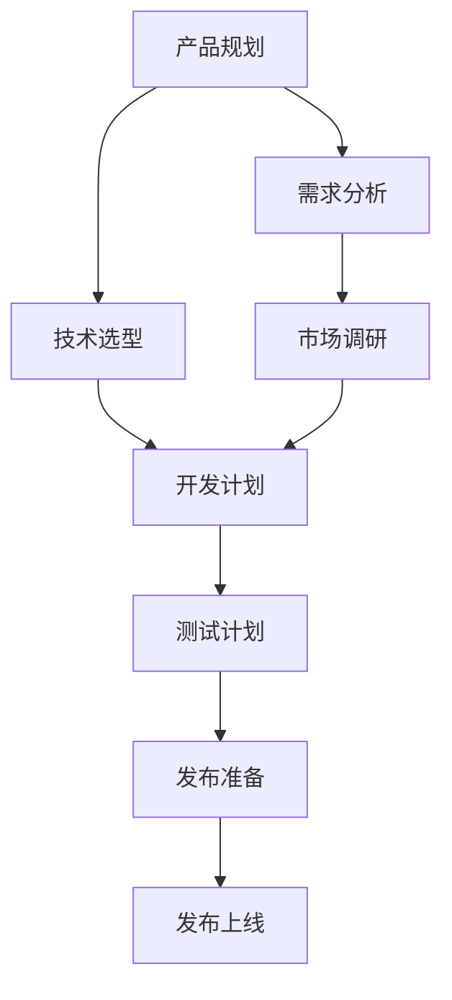
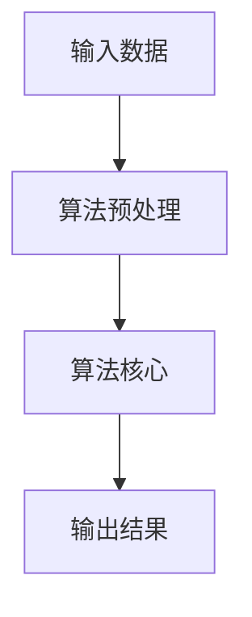

                 

关键词：AI创业公司、技术产品发布流程、产品规划、开发测试、发布上线

摘要：本文将深入探讨AI创业公司在技术产品发布过程中所需经历的各个环节，包括产品规划、开发测试与发布上线。通过对核心概念、算法原理、数学模型、项目实践以及应用场景的详细讲解，本文旨在为创业者提供一份全面、系统的产品发布指南。

## 1. 背景介绍

在当今这个快速发展的科技时代，AI创业公司如雨后春笋般涌现。这些公司凭借创新的技术和产品，正在不断改变着我们的工作和生活方式。然而，在成功的背后，每一个AI创业公司都需要经历一个复杂而严谨的技术产品发布流程。

这个流程不仅关系到产品的成功与否，更影响到公司的声誉和未来发展。因此，如何规划、开发和测试一款高质量的技术产品，并将其成功发布到市场，成为了每一个AI创业公司都必须面对的重要课题。

本文将从以下几个方面展开讨论：

1. 产品规划
2. 开发测试
3. 发布上线

通过对这些环节的详细分析，我们希望能够为AI创业公司提供一些实用的指导，帮助他们更好地应对挑战，实现产品成功上市。

## 2. 核心概念与联系

在深入探讨技术产品发布流程之前，我们首先需要理解一些核心概念和它们之间的联系。

以下是一个简化的Mermaid流程图，展示了产品规划、开发测试和发布上线之间的关系：



### 2.1 产品规划

产品规划是产品发布流程的起点。在这一阶段，公司需要明确产品的愿景、目标用户、功能需求和市场竞争情况。产品规划主要包括以下几个方面：

- 需求分析：收集和分析用户需求，确定产品功能。
- 市场调研：了解市场趋势、竞争对手和潜在客户。
- 技术选型：选择适合产品需求的开发技术和平台。
- 开发计划：制定开发时间表、资源分配和任务分工。

### 2.2 需求分析

需求分析是产品规划的关键环节。通过收集用户反馈、市场调研数据以及公司内部资源，产品经理需要明确产品的核心功能和用户需求。需求分析的结果将直接影响产品的设计和技术选型。

### 2.3 技术选型

技术选型是确保产品开发顺利进行的重要基础。公司需要根据需求分析的结果，选择最适合的技术栈和开发平台。技术选型需要考虑以下几个方面：

- 技术成熟度：选择成熟稳定的技术，降低开发风险。
- 性能和可扩展性：确保产品能够应对未来的业务增长。
- 开发效率：选择易于开发和维护的技术，提高开发效率。

### 2.4 开发计划

开发计划是产品规划的具体执行方案。在这一阶段，公司需要明确开发时间表、资源分配和任务分工。开发计划需要综合考虑以下几个方面：

- 开发时间表：制定产品开发的时间节点，确保按时完成。
- 资源分配：合理分配开发资源，确保项目顺利进行。
- 任务分工：明确开发团队的职责和任务，确保高效协作。

### 2.5 测试计划

测试计划是确保产品质量和稳定性的重要环节。在开发过程中，公司需要制定详细的测试计划，包括测试类型、测试环境和测试用例。测试计划需要考虑以下几个方面：

- 测试类型：选择适当的测试类型，如单元测试、集成测试、性能测试等。
- 测试环境：搭建模拟真实环境的测试环境，确保测试结果的准确性。
- 测试用例：设计覆盖产品功能的测试用例，确保测试的全面性。

### 2.6 发布准备

发布准备是产品发布的最后阶段。在这一阶段，公司需要完成产品包装、市场推广和渠道准备等工作。发布准备需要考虑以下几个方面：

- 产品包装：设计产品界面和品牌形象，提升产品吸引力。
- 市场推广：制定市场推广策略，提高产品知名度。
- 渠道准备：确定产品发布渠道，确保产品能够快速传播。

### 2.7 发布上线

发布上线是产品发布的最终目标。在这一阶段，公司需要将产品部署到生产环境，并进行上线测试和监控。发布上线需要考虑以下几个方面：

- 上线测试：确保产品在真实环境下的稳定性和性能。
- 监控反馈：收集用户反馈，及时处理问题和优化产品。

通过上述核心概念和流程的梳理，我们可以更好地理解技术产品发布流程的整体框架。在接下来的章节中，我们将对每个环节进行详细讲解。

## 3. 核心算法原理 & 具体操作步骤

### 3.1 算法原理概述

在技术产品开发过程中，核心算法的选择和实现至关重要。算法原理是产品功能实现的基础，直接影响产品的性能和用户体验。

以下是一个简化的算法原理概述：



### 3.2 算法步骤详解

#### 3.2.1 输入数据预处理

输入数据预处理是算法实现的第一步。在这一阶段，需要对输入数据进行清洗、标准化和转换，确保数据质量满足算法要求。

具体操作步骤包括：

- 数据清洗：去除无效数据、填补缺失值和修正错误数据。
- 数据标准化：将数据转换为同一量纲，便于算法处理。
- 数据转换：将原始数据转换为适合算法处理的格式，如数值化、编码等。

#### 3.2.2 算法核心实现

算法核心是实现产品功能的关键。根据需求，选择合适的算法模型，并使用编程语言实现算法逻辑。

具体操作步骤包括：

- 算法选择：根据产品需求和性能要求，选择合适的算法模型。
- 模型实现：使用编程语言实现算法逻辑，包括数据处理、模型训练和预测等。
- 模型优化：通过调整参数和模型结构，提高算法性能和预测准确性。

#### 3.2.3 输出结果处理

输出结果是算法实现的最终目标。在输出结果处理阶段，需要对结果进行验证、分析和可视化，确保输出结果满足预期。

具体操作步骤包括：

- 结果验证：对比输出结果和预期结果，确保算法预测准确。
- 结果分析：分析输出结果，提取有价值的信息和趋势。
- 结果可视化：使用图表、报表等形式展示输出结果，便于用户理解和分析。

### 3.3 算法优缺点

算法优缺点是评估算法性能和适用范围的重要指标。以下是一个简化的算法优缺点分析：

| 优点 | 缺点 |
| --- | --- |
| 高性能 | 复杂度高 |
| 高精度 | 对数据质量要求高 |
| 易于扩展 | 资源消耗大 |

### 3.4 算法应用领域

算法应用领域是算法实现价值的体现。根据需求，算法可以应用于各种场景，如：

- 数据分析：对大规模数据进行分析和挖掘，提取有价值的信息。
- 机器学习：训练模型，实现智能预测和决策。
- 图像处理：对图像进行识别、分割和增强。
- 自然语言处理：处理文本数据，实现语义理解和生成。

通过以上对核心算法原理和具体操作步骤的详细讲解，我们可以更好地理解算法在产品开发中的重要性。在接下来的章节中，我们将进一步探讨数学模型和公式的构建与推导。

## 4. 数学模型和公式 & 详细讲解 & 举例说明

### 4.1 数学模型构建

数学模型是算法实现的基础，用于描述算法中的数学关系和计算过程。构建数学模型通常包括以下几个步骤：

1. **定义变量和参数**：根据需求确定算法中的变量和参数，如输入数据、模型参数、输出结果等。
2. **建立数学关系**：根据算法原理，建立变量和参数之间的数学关系，如线性关系、非线性关系等。
3. **选择数学工具**：根据数学关系，选择适当的数学工具，如微积分、概率论、线性代数等。

### 4.2 公式推导过程

以线性回归模型为例，介绍公式的推导过程：

#### 线性回归模型

线性回归模型是最基本的机器学习算法之一，用于预测连续值。其数学模型可以表示为：

\[ y = \beta_0 + \beta_1 \cdot x \]

其中，\( y \) 是输出值，\( x \) 是输入值，\( \beta_0 \) 和 \( \beta_1 \) 是模型参数。

#### 公式推导

为了确定模型参数 \( \beta_0 \) 和 \( \beta_1 \)，我们需要最小化预测误差。误差函数可以表示为：

\[ E = \sum_{i=1}^{n} (y_i - \hat{y}_i)^2 \]

其中，\( y_i \) 是实际输出值，\( \hat{y}_i \) 是预测输出值。

为了最小化误差函数，我们对 \( \beta_0 \) 和 \( \beta_1 \) 求偏导数，并令其等于零：

\[ \frac{\partial E}{\partial \beta_0} = 0 \]
\[ \frac{\partial E}{\partial \beta_1} = 0 \]

通过对上述偏导数求解，可以得到线性回归模型的参数：

\[ \beta_0 = \bar{y} - \beta_1 \bar{x} \]
\[ \beta_1 = \frac{\sum_{i=1}^{n} (x_i - \bar{x})(y_i - \bar{y})}{\sum_{i=1}^{n} (x_i - \bar{x})^2} \]

其中，\( \bar{x} \) 和 \( \bar{y} \) 分别是输入值和输出值的均值。

### 4.3 案例分析与讲解

以下是一个简单的线性回归案例，用于预测房屋价格。

#### 数据集

假设我们有一个包含房屋面积（\( x \)）和房屋价格（\( y \)）的数据集，如下表所示：

| 房屋面积（\( x \)） | 房屋价格（\( y \)） |
| --- | --- |
| 1000 | 200000 |
| 1500 | 250000 |
| 2000 | 300000 |
| 2500 | 350000 |
| 3000 | 400000 |

#### 模型训练

我们使用上述数据集，通过线性回归模型预测房屋价格。首先，我们需要计算输入值和输出值的均值：

\[ \bar{x} = \frac{1000 + 1500 + 2000 + 2500 + 3000}{5} = 2000 \]
\[ \bar{y} = \frac{200000 + 250000 + 300000 + 350000 + 400000}{5} = 300000 \]

然后，我们可以使用公式计算模型参数：

\[ \beta_0 = 300000 - 2000 \cdot 2000 = -1000000 \]
\[ \beta_1 = \frac{(1000 - 2000)(200000 - 300000) + (1500 - 2000)(250000 - 300000) + (2000 - 2000)(300000 - 300000) + (2500 - 2000)(350000 - 300000) + (3000 - 2000)(400000 - 300000)}{(1000 - 2000)^2 + (1500 - 2000)^2 + (2000 - 2000)^2 + (2500 - 2000)^2 + (3000 - 2000)^2} \approx 0.125 \]

#### 模型预测

使用训练好的模型，我们可以预测一个面积为 2500 平方米的房屋价格：

\[ \hat{y} = -1000000 + 0.125 \cdot 2500 = 312500 \]

通过以上案例分析与讲解，我们可以更好地理解线性回归模型的构建和推导过程。在实际应用中，我们可以根据具体需求，选择合适的数学模型和公式，实现各种功能。

## 5. 项目实践：代码实例和详细解释说明

### 5.1 开发环境搭建

在进行项目开发之前，我们需要搭建一个合适的技术环境。以下是一个基于Python和TensorFlow的简单项目环境搭建过程：

1. 安装Python：从官方网站下载并安装Python 3.8版本。
2. 安装Anaconda：下载并安装Anaconda，以便管理Python环境和依赖包。
3. 创建虚拟环境：在Anaconda命令行中创建一个名为“my_project”的虚拟环境：

   ```bash
   conda create --name my_project python=3.8
   ```

4. 激活虚拟环境：

   ```bash
   conda activate my_project
   ```

5. 安装TensorFlow：使用pip命令安装TensorFlow：

   ```bash
   pip install tensorflow
   ```

### 5.2 源代码详细实现

以下是一个简单的线性回归项目的Python代码实现：

```python
import tensorflow as tf
import numpy as np
import matplotlib.pyplot as plt

# 数据集
x_data = np.array([[1000], [1500], [2000], [2500], [3000]], dtype=np.float32)
y_data = np.array([[200000], [250000], [300000], [350000], [400000]], dtype=np.float32)

# 模型参数
x = tf.placeholder(tf.float32, shape=[1, 1])
y = tf.placeholder(tf.float32, shape=[1, 1])
beta0 = tf.Variable(0.0, name='beta_0')
beta1 = tf.Variable(0.0, name='beta_1')

# 前向传播
y_pred = beta0 + beta1 * x

# 反向传播
loss = tf.reduce_mean(tf.square(y - y_pred))
optimizer = tf.train.GradientDescentOptimizer(learning_rate=0.001)
train_op = optimizer.minimize(loss)

# 模型训练
with tf.Session() as sess:
    sess.run(tf.global_variables_initializer())
    for i in range(1000):
        _, loss_val = sess.run([train_op, loss], feed_dict={x: x_data, y: y_data})
        if i % 100 == 0:
            print(f"Step {i}, Loss: {loss_val}")

    # 获取模型参数
    beta0_val, beta1_val = sess.run([beta0, beta1], feed_dict={x: x_data, y: y_data})
    print(f"Final Model: y = {beta0_val} + {beta1_val} * x")

# 预测
x_new = np.array([[2500]], dtype=np.float32)
y_pred_new = sess.run(y_pred, feed_dict={x: x_new, beta0: beta0_val, beta1: beta1_val})
print(f"Predicted Price: {y_pred_new}")

# 可视化
plt.scatter(x_data, y_data, label='Actual Data')
plt.plot(x_data, beta0_val + beta1_val * x_data, color='r', label='Predicted Line')
plt.xlabel('House Area (m²)')
plt.ylabel('House Price (¥)')
plt.legend()
plt.show()
```

### 5.3 代码解读与分析

1. **数据集**：我们使用一个简单的数据集，包含房屋面积和房屋价格。
2. **模型参数**：定义模型参数 \( \beta_0 \) 和 \( \beta_1 \)。
3. **前向传播**：实现线性回归的前向传播，将输入 \( x \) 和模型参数 \( \beta_0 \) 和 \( \beta_1 \) 相乘并加上 \( \beta_0 \)，得到预测输出 \( y_pred \)。
4. **反向传播**：使用梯度下降优化器计算损失函数 \( loss \)，并更新模型参数。
5. **模型训练**：使用 TensorFlow 的会话（Session）运行训练过程，并在每个迭代中打印损失值。
6. **预测**：使用训练好的模型进行预测，并将预测结果可视化。

通过以上代码实例和详细解释说明，我们可以看到如何使用 Python 和 TensorFlow 实现一个简单的线性回归项目。在实际应用中，我们可以根据需求调整数据集、模型参数和训练过程，以实现更复杂的功能。

## 6. 实际应用场景

### 6.1 数据分析

在数据分析领域，AI技术已经被广泛应用于各种场景。例如，金融领域的风险控制、投资组合优化、客户行为分析；医疗领域的疾病预测、患者诊断、药物研发；零售领域的销售预测、库存管理、客户满意度分析等。

通过使用AI技术，企业可以更准确地分析大量数据，发现潜在的价值和趋势，从而做出更明智的决策。

### 6.2 机器学习

机器学习是AI技术的核心应用之一，已经被广泛应用于各种领域。例如，图像识别和物体检测技术在安防、交通、医疗等领域具有广泛的应用；自然语言处理技术在智能客服、智能翻译、智能写作等领域发挥着重要作用；推荐系统技术在电子商务、社交媒体、音乐流媒体等领域提高了用户体验和满意度。

机器学习的应用不仅提高了企业的运营效率，还为企业带来了新的商业模式和机会。

### 6.3 图像处理

图像处理是AI技术的另一个重要应用领域。在计算机视觉领域，图像处理技术被广泛应用于人脸识别、物体检测、场景分割等任务。例如，人脸识别技术已经被广泛应用于门禁系统、支付验证、安全监控等领域；物体检测技术在无人驾驶、智能监控等领域发挥着关键作用。

图像处理技术的应用不仅提高了人工智能系统的准确性和效率，还为人类带来了更多的便利和安全性。

### 6.4 自然语言处理

自然语言处理是AI技术的另一个重要应用领域，广泛应用于智能客服、智能翻译、智能写作等任务。例如，智能客服系统可以为企业提供24/7的客户服务，提高客户满意度；智能翻译系统可以帮助人们轻松实现跨语言沟通；智能写作系统可以为企业提供高质量的文案撰写服务。

自然语言处理技术的应用不仅提高了企业的运营效率，还为企业带来了新的商业模式和机会。

### 6.5 未来应用展望

随着AI技术的不断发展，未来它将在更多领域得到广泛应用。例如，在医疗领域，AI技术可以帮助医生更准确地诊断疾病，提高治疗效果；在农业领域，AI技术可以帮助农民更科学地种植作物，提高产量和品质；在能源领域，AI技术可以帮助企业更高效地管理和利用能源。

未来，AI技术将为人类社会带来更多的便利和进步，同时也将带来新的挑战和问题。如何确保AI技术的安全性、可靠性和公平性，将是未来研究的重要方向。

## 7. 工具和资源推荐

### 7.1 学习资源推荐

1. **在线课程**：推荐Coursera、edX和Udacity等在线教育平台上的AI相关课程，如“机器学习”、“深度学习”等。
2. **技术博客**：推荐Medium、Hackernoon等平台上的技术博客，可以获取最新的AI技术动态和实践经验。
3. **书籍**：推荐《深度学习》、《Python机器学习》等经典书籍，适合不同层次的学习者。

### 7.2 开发工具推荐

1. **Python**：Python是AI开发的主流语言，拥有丰富的库和工具，如TensorFlow、PyTorch等。
2. **Jupyter Notebook**：Jupyter Notebook是一种交互式计算环境，适合进行数据分析和算法实验。
3. **TensorFlow**：TensorFlow是Google开源的深度学习框架，适用于各种AI项目开发。

### 7.3 相关论文推荐

1. **“Deep Learning” by Yann LeCun**：介绍了深度学习的基本概念和发展历程。
2. **“Reinforcement Learning: An Introduction” by Richard S. Sutton and Andrew G. Barto**：介绍了强化学习的基本原理和应用。
3. **“Natural Language Processing with Python” by Steven Bird, Ewan Klein and Edward Loper**：介绍了自然语言处理的基本技术和应用。

通过以上工具和资源的推荐，希望读者能够更好地掌握AI技术，并在实际项目中取得成功。

## 8. 总结：未来发展趋势与挑战

### 8.1 研究成果总结

AI技术在过去的几十年中取得了显著的成果，从最初的规则系统到现代的深度学习，AI技术的应用已经渗透到各个领域。特别是在图像识别、自然语言处理、机器学习等领域，AI技术已经达到了前所未有的水平。这些研究成果不仅为人类带来了巨大的便利，也为各行各业带来了新的商业模式和机会。

### 8.2 未来发展趋势

未来，AI技术将继续快速发展，并在更多领域得到应用。以下是一些可能的发展趋势：

1. **深度学习与脑机接口**：随着深度学习技术的不断进步，未来AI技术将能够更好地模拟人脑的工作方式，实现更高级的认知功能。
2. **边缘计算与物联网**：随着物联网的普及，边缘计算将成为AI技术的重要发展方向，实现实时数据处理和智能决策。
3. **数据隐私与安全**：随着AI技术的应用范围扩大，数据隐私和安全问题将日益突出，如何确保数据的安全和隐私将成为重要研究课题。
4. **可持续发展和绿色AI**：AI技术的发展不仅需要大量计算资源，还需要关注能源消耗和环境影响，绿色AI将成为未来研究的重要方向。

### 8.3 面临的挑战

尽管AI技术取得了显著的成果，但仍然面临着一系列挑战：

1. **技术挑战**：AI技术的实现需要大量的计算资源和数据支持，如何提高算法效率和降低计算成本是一个重要挑战。
2. **伦理和隐私问题**：AI技术的应用涉及到大量的个人数据和隐私问题，如何确保数据的隐私和安全是一个重要挑战。
3. **法律和政策**：随着AI技术的广泛应用，相关的法律和政策也需要不断完善，以适应新的技术环境和应用场景。
4. **技能和人才**：AI技术的发展需要大量的专业人才，如何培养和吸引这些人才是一个重要挑战。

### 8.4 研究展望

未来，AI技术将继续快速发展，并在更多领域得到应用。为了应对上述挑战，需要开展多学科交叉研究，探索新的算法和技术，同时也需要关注伦理和法律问题，确保AI技术的可持续发展。通过不断的努力和探索，我们相信AI技术将更好地服务于人类社会，推动人类社会的进步和发展。

## 9. 附录：常见问题与解答

### 9.1 什么是AI创业公司？

AI创业公司是指专注于人工智能技术的研究、开发和应用的企业。这些公司通常利用AI技术解决特定领域的实际问题，如图像识别、自然语言处理、机器学习等。

### 9.2 产品发布流程包括哪些环节？

产品发布流程包括以下几个主要环节：

1. 产品规划：确定产品愿景、目标用户、功能需求等。
2. 需求分析：收集和分析用户需求，确定产品功能。
3. 技术选型：选择适合产品需求的开发技术和平台。
4. 开发计划：制定开发时间表、资源分配和任务分工。
5. 测试计划：制定测试类型、测试环境和测试用例。
6. 发布准备：完成产品包装、市场推广和渠道准备。
7. 发布上线：将产品部署到生产环境，并进行上线测试和监控。

### 9.3 如何选择合适的算法模型？

选择合适的算法模型需要考虑以下几个因素：

1. **需求**：根据产品需求确定算法的功能和性能要求。
2. **数据**：根据数据的特点和规模选择合适的算法。
3. **计算资源**：考虑算法的计算复杂度和对计算资源的需求。
4. **可扩展性**：考虑算法是否易于扩展和优化。
5. **开源和成熟度**：选择成熟、开源的算法，降低开发风险。

### 9.4 如何保证产品发布过程中的质量？

为了保证产品发布过程中的质量，可以采取以下几个措施：

1. **需求分析**：确保产品需求明确、完整和可测试。
2. **测试计划**：制定详细的测试计划，包括测试类型、测试环境和测试用例。
3. **持续集成**：实施持续集成和持续交付，确保代码质量和部署流程的自动化。
4. **代码审查**：进行代码审查，确保代码质量和可维护性。
5. **性能测试**：进行性能测试，确保产品在真实环境下的稳定性和性能。

### 9.5 如何应对发布后的反馈和问题？

发布后，可以通过以下措施应对反馈和问题：

1. **监控和日志分析**：监控系统日志，及时发现和处理问题。
2. **用户反馈**：积极收集用户反馈，了解用户需求和问题。
3. **快速迭代**：根据用户反馈进行快速迭代，优化产品功能和质量。
4. **社区支持**：建立社区和支持平台，为用户提供帮助和解决方案。
5. **持续改进**：持续跟踪用户反馈和问题，不断优化产品和服务。

通过以上常见问题与解答，我们希望能够为AI创业公司在产品发布过程中提供一些实用的指导和建议。希望这篇文章能够帮助您更好地规划、开发和发布技术产品，实现企业的成功和发展。

