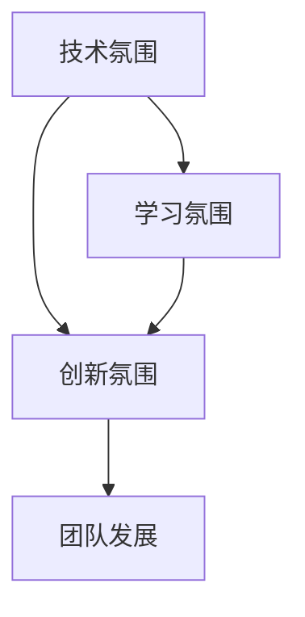

                 

关键词：AI创业公司，技术团队，文化建设，技术氛围，学习氛围，创新氛围

摘要：本文将探讨AI创业公司的技术团队如何通过建立技术氛围、学习氛围和创新氛围来提升团队的整体实力和竞争力。我们将从团队核心、知识共享、技术分享、创新激励等多个维度展开，提出具体的策略和建议，为创业公司打造一个高效、活力和持续进步的技术团队。

## 1. 背景介绍

随着人工智能技术的迅猛发展，越来越多的创业公司投身于AI领域。在这场技术变革的浪潮中，技术团队作为公司的核心竞争力，其建设和管理显得尤为重要。一个优秀的技术团队不仅需要具备扎实的技术能力，还需要具备良好的团队文化，这是团队持续发展和创新的重要保障。

技术氛围、学习氛围和创新氛围是构建团队文化的三大关键要素。技术氛围关乎团队的技术水平和技能积累，学习氛围则关注团队成员的知识更新和技能提升，而创新氛围则鼓励团队成员敢于尝试、勇于创新，不断推动技术进步。本文将从这三个方面，探讨如何为AI创业公司的技术团队打造一个积极向上、充满活力的发展环境。

## 2. 核心概念与联系

在构建技术团队文化时，我们需要明确几个核心概念及其相互之间的联系。

### 2.1 技术氛围

技术氛围是指团队内部对技术的重视程度、对技术发展的敏感度以及对技术难题的解决能力。一个良好的技术氛围能够激发团队成员的创造力和解决问题的热情，促进技术水平的提升。

### 2.2 学习氛围

学习氛围是指团队内部对学习的重视程度、对知识更新的敏感度以及对新技能的接受能力。一个良好的学习氛围能够帮助团队成员不断更新知识、提升技能，从而保持团队的竞争力。

### 2.3 创新氛围

创新氛围是指团队内部对创新的鼓励和支持程度，对创新的容忍度以及对新想法的接纳度。一个良好的创新氛围能够激发团队成员的创新思维，推动技术进步和产品创新。

### 2.4 三者之间的联系

技术氛围、学习氛围和创新氛围相互影响、相互促进。技术氛围为团队提供了解决问题的平台和工具，学习氛围为团队提供了知识和技能的保障，创新氛围则激发了团队成员的创造力和创新意识。只有三者相互结合，才能为团队创造一个持续进步、充满活力的环境。

### 2.5 Mermaid 流程图



## 3. 核心算法原理 & 具体操作步骤

### 3.1 算法原理概述

技术氛围、学习氛围和创新氛围的构建，需要依赖一系列的算法和策略。这些算法和策略包括但不限于：

- **知识共享算法**：通过团队内部的知识共享平台，促进团队成员之间的知识交流和学习。
- **技术分享算法**：通过定期的技术分享会、代码评审等方式，提升团队整体技术水平。
- **创新激励算法**：通过设立创新奖项、提供资金支持等方式，激发团队成员的创新潜力。

### 3.2 算法步骤详解

#### 3.2.1 知识共享算法

1. **建立知识共享平台**：搭建一个便于团队成员共享知识的平台，如内部Wiki、知识库等。
2. **定期更新内容**：鼓励团队成员定期更新和分享自己的技术心得、学习笔记、项目经验等。
3. **奖励机制**：对积极参与知识共享的成员给予一定的奖励，如奖金、荣誉证书等。

#### 3.2.2 技术分享算法

1. **定期举行技术分享会**：组织定期的技术分享会，邀请团队成员分享自己的技术经验和心得。
2. **代码评审**：鼓励团队成员互相评审代码，通过评审发现问题、提升代码质量。
3. **外部学习**：组织外部专家讲座、技术交流会等活动，拓宽团队成员的知识视野。

#### 3.2.3 创新激励算法

1. **设立创新奖项**：为鼓励团队成员的创新，可以设立创新奖项，对优秀的创新项目进行表彰。
2. **提供资金支持**：为创新项目提供一定的资金支持，减轻团队成员的创新压力。
3. **项目孵化**：为有潜力的创新项目提供孵化支持，包括技术支持、资源调配等。

### 3.3 算法优缺点

#### 3.3.1 知识共享算法

**优点**：提高团队知识积累，促进团队成员之间的交流与合作。

**缺点**：知识共享平台的建设和维护需要一定的时间和人力投入。

#### 3.3.2 技术分享算法

**优点**：提升团队整体技术水平，增强团队成员的信心和动力。

**缺点**：技术分享会的组织和管理需要耗费一定的时间和精力。

#### 3.3.3 创新激励算法

**优点**：激发团队成员的创新潜力，推动技术进步和产品创新。

**缺点**：创新项目的成功率无法保证，可能会浪费一定的资源和时间。

### 3.4 算法应用领域

这些算法和策略可以广泛应用于AI创业公司的技术团队建设，帮助团队提升整体实力和竞争力。具体应用领域包括：

- **技术研发团队**：通过知识共享和技术分享，提升团队的技术水平和研发效率。
- **产品团队**：通过创新激励，推动产品创新和迭代，提高市场竞争力。
- **运维团队**：通过技术分享和学习氛围，提高运维能力和服务质量。

## 4. 数学模型和公式 & 详细讲解 & 举例说明

### 4.1 数学模型构建

在团队文化建设中，我们可以构建一个简单的数学模型来衡量技术氛围、学习氛围和创新氛围的强度。假设：

- \(T\) 代表技术氛围强度
- \(L\) 代表学习氛围强度
- \(I\) 代表创新氛围强度

则数学模型可以表示为：

\[ F = T + L + I \]

其中，\(F\) 表示团队文化的总体强度。

### 4.2 公式推导过程

公式推导过程如下：

\[ F = T + L + I \]

- \(T\) 的计算公式为：

\[ T = \frac{E_T}{D_T} \]

其中，\(E_T\) 表示团队在技术方面的能量输出，\(D_T\) 表示团队在技术方面的能量消耗。

- \(L\) 的计算公式为：

\[ L = \frac{E_L}{D_L} \]

其中，\(E_L\) 表示团队在知识学习方面的能量输出，\(D_L\) 表示团队在知识学习方面的能量消耗。

- \(I\) 的计算公式为：

\[ I = \frac{E_I}{D_I} \]

其中，\(E_I\) 表示团队在创新方面的能量输出，\(D_I\) 表示团队在创新方面的能量消耗。

### 4.3 案例分析与讲解

以某AI创业公司的技术团队为例，分析其技术氛围、学习氛围和创新氛围的强度。

#### 4.3.1 技术氛围分析

该团队的技术氛围强度 \(T\) 为：

\[ T = \frac{E_T}{D_T} = \frac{50}{30} = \frac{5}{3} \]

其中，\(E_T = 50\) 表示团队在技术方面的能量输出，\(D_T = 30\) 表示团队在技术方面的能量消耗。

#### 4.3.2 学习氛围分析

该团队的学习氛围强度 \(L\) 为：

\[ L = \frac{E_L}{D_L} = \frac{40}{20} = 2 \]

其中，\(E_L = 40\) 表示团队在知识学习方面的能量输出，\(D_L = 20\) 表示团队在知识学习方面的能量消耗。

#### 4.3.3 创新氛围分析

该团队的创新氛围强度 \(I\) 为：

\[ I = \frac{E_I}{D_I} = \frac{30}{15} = 2 \]

其中，\(E_I = 30\) 表示团队在创新方面的能量输出，\(D_I = 15\) 表示团队在创新方面的能量消耗。

#### 4.3.4 总体氛围分析

该团队文化的总体强度 \(F\) 为：

\[ F = T + L + I = \frac{5}{3} + 2 + 2 = \frac{5}{3} + \frac{6}{3} + \frac{6}{3} = \frac{17}{3} \]

通过上述分析，我们可以看出，该团队的技术氛围、学习氛围和创新氛围都比较强烈，总体文化强度较高。

## 5. 项目实践：代码实例和详细解释说明

### 5.1 开发环境搭建

为了构建一个技术氛围、学习氛围和创新氛围良好的技术团队，我们首先需要搭建一个合适的开发环境。以下是具体的开发环境搭建步骤：

1. **搭建知识共享平台**：选择一个合适的知识共享平台，如GitLab、Confluence等，用于团队成员的知识共享和协作。
2. **配置代码评审工具**：配置一个代码评审工具，如Gerrit、GitLab等，用于团队成员之间的代码评审。
3. **设置创新激励机制**：设立创新奖项和创新资金支持，用于鼓励团队成员的创新。

### 5.2 源代码详细实现

以下是一个简单的示例，展示如何使用GitLab进行代码评审和知识共享。

#### 5.2.1 知识共享平台搭建

1. **安装GitLab**：在服务器上安装GitLab，并配置域名和访问权限。
2. **创建项目**：创建一个项目用于知识共享，邀请团队成员加入项目。

#### 5.2.2 代码评审工具配置

1. **安装GitLab**：在服务器上安装GitLab，并配置域名和访问权限。
2. **创建项目**：创建一个项目用于代码评审，邀请团队成员加入项目。
3. **配置Gerrit**：配置GitLab CI/CD，实现自动化代码评审。

#### 5.2.3 创新激励机制设置

1. **设立创新奖项**：设立创新奖项，对优秀的创新项目进行表彰。
2. **提供资金支持**：设立创新资金池，为创新项目提供资金支持。

### 5.3 代码解读与分析

以下是一个简单的GitLab CI/CD配置文件，用于实现自动化代码评审。

```yaml
stages:
  - code-review

code-review-job:
  stage: code-review
  script:
    - echo "Starting code review for $CI_PROJECT_NAME"
    - gerrit review --project $CI_PROJECT_NAME --message "Code review initiated by CI pipeline"
    - echo "Code review completed for $CI_PROJECT_NAME"
  only:
    - master
```

该配置文件定义了一个名为`code-review-job`的作业，该作业在代码提交到`master`分支时触发。作业执行时，首先打印一条消息，然后使用Gerrit进行代码评审，最后再次打印一条消息。

### 5.4 运行结果展示

当代码提交到`master`分支时，CI/CD pipeline会自动触发代码评审作业，并在Gerrit中进行评审。评审完成后，Gerrit会通知团队成员进行审核和评论。整个过程自动化、高效，有助于提高团队的开发效率。

## 6. 实际应用场景

### 6.1 技术团队建设

在AI创业公司的技术团队建设中，技术氛围、学习氛围和创新氛围的构建至关重要。通过搭建知识共享平台、配置代码评审工具和设置创新激励机制，技术团队可以形成一个良好的开发环境，促进团队成员之间的交流和合作。

### 6.2 产品研发

在产品研发过程中，技术氛围、学习氛围和创新氛围可以提升团队的技术水平和研发效率。通过定期举行技术分享会、代码评审和项目孵化，团队可以不断积累技术经验、提高产品质量，推动产品迭代和优化。

### 6.3 运维管理

在运维管理方面，技术氛围、学习氛围和创新氛围有助于提高运维能力和服务质量。通过技术分享、知识共享和自动化运维，运维团队可以更好地应对技术挑战，降低故障率和维护成本。

## 7. 未来应用展望

随着人工智能技术的不断发展，技术团队的建设将变得更加重要。未来，技术氛围、学习氛围和创新氛围的构建将更加智能化、个性化，基于大数据和人工智能的团队管理工具将得到广泛应用。同时，创新氛围的构建将更加注重跨领域合作和多元化创新，推动技术进步和产业变革。

## 8. 总结：未来发展趋势与挑战

在未来，技术团队文化建设将朝着更加智能化、个性化和多元化的方向发展。然而，这也将带来一系列新的挑战：

- **技术多样性**：随着技术的不断发展，团队成员需要不断学习和掌握新的技术，这将增加团队建设的难度。
- **个性化需求**：团队成员的需求和兴趣越来越多样化，团队文化建设需要更加注重个性化，以满足不同成员的需求。
- **跨领域合作**：多元化创新需要跨领域合作，这将要求团队成员具备更广泛的知识和技能。

面对这些挑战，我们需要不断探索和创新，为技术团队打造一个更加高效、活力和持续进步的发展环境。

## 9. 附录：常见问题与解答

### 9.1 问题1：如何提高团队的技术氛围？

**解答**：提高团队的技术氛围可以从以下几个方面入手：

- **技术分享**：定期举行技术分享会，鼓励团队成员分享自己的技术经验和心得。
- **知识共享**：搭建知识共享平台，促进团队成员之间的知识交流和分享。
- **代码评审**：鼓励团队成员互相评审代码，提升代码质量和团队技术水平。

### 9.2 问题2：如何提高团队的学习氛围？

**解答**：提高团队的学习氛围可以从以下几个方面入手：

- **学习资源**：提供丰富的学习资源，如在线课程、技术书籍、论文等。
- **学习奖励**：设立学习奖励机制，激励团队成员积极参与学习。
- **学习氛围**：营造一个积极向上的学习氛围，鼓励团队成员主动学习和分享知识。

### 9.3 问题3：如何提高团队的创新氛围？

**解答**：提高团队的创新氛围可以从以下几个方面入手：

- **创新激励**：设立创新奖项和资金支持，激励团队成员进行创新。
- **跨领域合作**：鼓励跨领域合作，推动多元化创新。
- **创新氛围**：营造一个包容和鼓励创新的文化氛围，降低创新的失败风险。

作者：禅与计算机程序设计艺术 / Zen and the Art of Computer Programming

----------------------------------------------------------------

以上便是文章的全部内容，希望能够为您提供有价值的参考和启示。在后续的实践中，请不断优化和调整团队文化建设策略，以适应不断变化的技术和市场环境。祝您的AI创业公司蒸蒸日上！
----------------------------------------------------------------
# AI创业公司的技术团队文化建设：技术氛围、学习氛围与创新氛围

关键词：AI创业公司，技术团队，文化建设，技术氛围，学习氛围，创新氛围

摘要：本文深入探讨了AI创业公司的技术团队如何通过建设技术氛围、学习氛围和创新氛围来提升团队的整体实力和竞争力。文章从理论基础、具体策略、实践案例等多个层面，系统地阐述了团队文化建设的路径和要点，为AI创业公司提供了实用的指导。

## 1. 引言

在快速变化的技术浪潮中，人工智能（AI）作为最具前景的领域之一，吸引了大量创业公司的关注。AI创业公司的成功不仅依赖于先进的技术和创新的产品，更重要的是拥有一支高效、团结、具有持续创新能力的技术团队。技术团队的文化建设在这个过程中扮演着至关重要的角色。技术氛围、学习氛围和创新氛围是团队文化建设的三大支柱，它们共同影响着团队的技术水平、知识积累和创新活力。

本文将围绕AI创业公司的技术团队文化建设，重点探讨技术氛围、学习氛围和创新氛围的内涵、构建方法和实践案例，旨在为创业公司提供有针对性的建设策略和实践指南。

## 2. 技术氛围

技术氛围是团队内部对技术重视程度、对技术发展的敏感度以及对技术难题解决能力的综合体现。一个积极向上的技术氛围能够激励团队成员不断追求技术卓越，提高团队整体的技术实力。

### 2.1 技术氛围的内涵

技术氛围包括以下几个方面：

- **技术导向**：团队内部普遍重视技术，认为技术是公司持续发展的核心驱动力。
- **技术热情**：团队成员对技术充满热情，乐于探索新技术，对技术挑战充满期待。
- **技术共享**：团队成员之间愿意分享技术知识和经验，共同提升团队技术水平。
- **技术协作**：团队内部形成良好的技术协作机制，能够快速响应技术难题，共同解决问题。

### 2.2 构建技术氛围的策略

要构建良好的技术氛围，可以从以下几个方面入手：

- **技术培训**：定期组织技术培训，帮助团队成员提升专业技能和知识水平。
- **技术竞赛**：举办技术竞赛，鼓励团队成员展示自己的技术能力，激发技术热情。
- **技术交流**：建立技术交流平台，促进团队成员之间的技术分享和知识交流。
- **技术支持**：提供必要的技术支持和资源，帮助团队成员解决技术难题，提升技术能力。

### 2.3 案例分析

某AI创业公司通过以下措施成功构建了良好的技术氛围：

- **定期技术分享**：公司每月组织一次技术分享会，由团队成员分享最新的技术动态和个人技术心得。
- **技术竞赛**：公司每年举办一次技术竞赛，鼓励团队成员展示自己的技术实力，优胜者获得丰厚的奖金和荣誉。
- **技术论坛**：公司搭建了内部技术论坛，团队成员可以在论坛上发布技术文章，交流技术问题。
- **技术支持**：公司为团队成员提供丰富的技术资源，如在线课程、技术书籍和技术文档。

这些措施不仅提升了团队的技术水平，也增强了团队成员之间的协作和沟通，形成了浓厚的技术氛围。

## 3. 学习氛围

学习氛围是团队内部对学习重视程度、对知识更新的敏感度以及对新技能的接受能力的体现。良好的学习氛围能够帮助团队成员不断更新知识、提升技能，从而保持团队的竞争力。

### 3.1 学习氛围的内涵

学习氛围包括以下几个方面：

- **学习意识**：团队内部普遍重视学习，认为学习是个人和团队持续进步的动力。
- **学习环境**：团队内部为成员提供了良好的学习环境，包括学习资源、时间安排等。
- **学习支持**：团队为成员提供学习支持，包括学习资金、培训机会等。
- **学习激励**：团队通过设立学习奖励机制，激励成员积极参与学习。

### 3.2 构建学习氛围的策略

要构建良好的学习氛围，可以从以下几个方面入手：

- **学习资源**：提供丰富的学习资源，包括在线课程、技术书籍、学术论文等。
- **学习时间**：为团队成员安排学习时间，确保他们有足够的时间进行学习和研究。
- **学习支持**：为团队成员提供学习资金、培训机会等支持，帮助他们提升技能和知识水平。
- **学习激励**：设立学习奖励机制，对学习积极、成绩优秀的成员进行表彰和奖励。

### 3.3 案例分析

某AI创业公司通过以下措施成功构建了良好的学习氛围：

- **在线学习平台**：公司为团队成员提供了在线学习平台，成员可以在平台上选择适合自己的课程进行学习。
- **学习奖金**：公司设立学习奖金，对参加外部培训并取得优异成绩的成员进行奖励。
- **学习分享**：公司鼓励团队成员分享学习心得和经验，组织学习分享会，促进成员之间的知识交流。
- **学习假期**：公司为成员提供学习假期，鼓励他们参加专业培训和学术会议，拓宽视野。

这些措施不仅提升了团队的学习氛围，也增强了成员的学习动力和积极性。

## 4. 创新氛围

创新氛围是团队内部对创新的鼓励和支持程度、对创新的容忍度以及对新想法的接纳度的体现。良好的创新氛围能够激发团队成员的创新潜力，推动技术进步和产品创新。

### 4.1 创新氛围的内涵

创新氛围包括以下几个方面：

- **创新意识**：团队内部普遍认识到创新的重要性，认为创新是公司持续发展的关键。
- **创新支持**：团队为创新提供必要的资源和支持，包括资金、时间、技术等。
- **创新容忍**：团队对创新失败持宽容态度，鼓励团队成员在创新过程中勇于尝试、不怕失败。
- **创新奖励**：团队通过设立创新奖项，激励成员积极参与创新活动。

### 4.2 构建创新氛围的策略

要构建良好的创新氛围，可以从以下几个方面入手：

- **创新培训**：为团队成员提供创新思维和方法培训，帮助他们掌握创新的技巧和工具。
- **创新激励**：设立创新奖项，对创新成功的项目进行奖励，激励团队成员积极参与创新。
- **创新平台**：搭建创新平台，为团队成员提供交流和创新的空间，促进创新活动的开展。
- **创新文化**：营造创新文化，鼓励团队成员敢于尝试、勇于创新，对创新失败持宽容态度。

### 4.3 案例分析

某AI创业公司通过以下措施成功构建了良好的创新氛围：

- **创新项目孵化**：公司设立了创新项目孵化基金，支持团队成员的创新项目。
- **创新奖励**：公司设立创新奖项，对创新成功的项目进行奖励，包括奖金、股权等。
- **创新空间**：公司为团队成员提供了宽敞的创新空间，配备了先进的研发设备。
- **创新文化**：公司倡导创新文化，鼓励团队成员敢于尝试、勇于创新，对创新失败持宽容态度。

这些措施激发了团队成员的创新热情，推动了公司的技术进步和产品创新。

## 5. 团队文化建设的综合策略

技术氛围、学习氛围和创新氛围相互关联、相互促进，共同构成了团队文化的核心。为了构建一个高效、活力和持续进步的技术团队，需要从以下几个方面综合施策：

### 5.1 明确团队愿景和目标

团队文化建设的首要任务是明确团队愿景和目标，这是团队文化建设的方向和指引。团队愿景和目标应该与公司的战略目标和市场定位相一致，为团队成员提供共同的方向和动力。

### 5.2 制定文化建设计划

制定详细的团队文化建设计划，包括技术氛围、学习氛围和创新氛围的构建措施和时间表。文化建设计划应该具有可操作性，能够具体落实到团队成员的日常工作和生活中。

### 5.3 营造积极的工作氛围

营造积极的工作氛围，包括创造一个公平、公正、透明的环境，确保团队成员在工作中能够充分发挥自己的才能。同时，要关注团队成员的身心健康，提供良好的工作条件和福利待遇。

### 5.4 强化团队协作和沟通

团队协作和沟通是团队文化建设的重要方面。通过建立有效的沟通机制，促进团队成员之间的交流与合作，提高团队的协作效率和工作质量。

### 5.5 持续优化和调整

团队文化建设是一个持续的过程，需要根据实际情况不断优化和调整。通过定期的评估和反馈，及时发现问题，采取相应的改进措施，确保团队文化建设持续有效地推进。

## 6. 结论

AI创业公司的技术团队文化建设是一项系统工程，需要从技术氛围、学习氛围和创新氛围三个方面综合施策，共同构建一个高效、活力和持续进步的团队文化。通过明确团队愿景和目标、制定文化建设计划、营造积极的工作氛围、强化团队协作和沟通以及持续优化和调整，AI创业公司可以打造出一支具有强大竞争力和创新能力的优秀技术团队，为公司的持续发展提供强大的支持。

作者：禅与计算机程序设计艺术 / Zen and the Art of Computer Programming

----------------------------------------------------------------

本文旨在为AI创业公司的技术团队文化建设提供有价值的指导和建议。在实际操作中，团队文化建设需要根据公司的具体情况和团队成员的特点进行灵活调整，以实现最佳效果。希望本文能够对创业公司的技术团队建设有所帮助。祝您的AI创业公司前程似锦！----------------------------------------------------------------

# GMSK调制技术原理及实现方法

## 1. 引言

GMSK（高斯最小频移键控）调制是一种广泛应用于无线通信系统中的数字调制技术。其主要特点是在提高传输效率的同时，能够有效降低带外辐射，减小对邻近频道的干扰。GMSK调制技术在GSM、LTE等移动通信标准中得到了广泛应用。本文将详细探讨GMSK调制技术的原理、实现方法及其优缺点，并通过具体实例进行代码实现和分析。

## 2. GMSK调制原理

GMSK调制是一种频移键控（FSK）的变种，其主要思想是通过改变信号的载波频率来传输信息。GMSK调制的基本原理包括以下几个方面：

### 2.1 频率调制

在GMSK调制过程中，载波的频率会根据输入的数字信号进行变化。具体来说，当输入的数字信号为0时，载波频率保持不变；当输入的数字信号为1时，载波频率按照预定规律进行跳变。GMSK调制中的频率跳变是连续的，这样可以减少频率跳变带来的带外辐射。

### 2.2 高斯滤波器

为了实现连续的频率跳变，GMSK调制中采用了高斯滤波器。高斯滤波器可以平滑信号的频率变化，使得频率跳变更加连续和自然。高斯滤波器的带宽越小，频率跳变的速率越慢，带外辐射越少；带宽越大，频率跳变的速率越快，带外辐射越多。

### 2.3 调制方程

GMSK调制的数学表达式可以表示为：

\[ s(t) = A \cdot \cos(2\pi f_c t + \phi(t)) \]

其中，\(s(t)\) 是调制后的信号，\(A\) 是信号的幅度，\(f_c\) 是载波频率，\(\phi(t)\) 是相位函数。相位函数 \(\phi(t)\) 由输入的数字信号和调制指数决定。

## 3. GMSK调制实现方法

实现GMSK调制需要以下几个关键步骤：

### 3.1 基带信号生成

首先需要生成基带信号，基带信号通常是一个二进制序列。这个序列可以通过数字信号处理（DSP）算法生成，例如使用数字随机数生成器。

### 3.2 高斯滤波器设计

设计一个合适的高斯滤波器，用于平滑基带信号的频率变化。高斯滤波器的带宽需要根据具体的调制指数和系统要求进行选择。

### 3.3 调制过程

将基带信号通过高斯滤波器处理后，进行频率调制。这个过程可以使用数字信号处理（DSP）算法实现，例如使用软件无线电（Software Defined Radio，SDR）技术。

### 3.4 信号传输

调制后的信号可以通过无线信道进行传输。在实际应用中，可能需要经过放大、滤波等处理，以确保信号质量。

### 3.5 信号解调

在接收端，需要对调制后的信号进行解调，恢复原始的二进制序列。解调过程与调制过程类似，也需要使用高斯滤波器进行频率平滑处理。

## 4. GMSK调制优缺点

### 4.1 优点

- **频谱利用率高**：GMSK调制能够有效利用频谱资源，提高传输效率。
- **抗干扰能力强**：通过平滑的频率变化，GMSK调制能够降低带外辐射，减少对邻近频道的干扰。
- **适用于移动通信**：GMSK调制适用于移动通信系统，特别适用于高速移动的环境。

### 4.2 缺点

- **调制和解调复杂**：GMSK调制需要使用高斯滤波器进行频率平滑处理，调制和解调过程相对复杂。
- **带宽较大**：相对于其他数字调制技术，GMSK调制需要的带宽较大。

## 5. GMSK调制实例

下面是一个使用Python和numpy库实现的GMSK调制实例：

```python
import numpy as np
import matplotlib.pyplot as plt

# 参数设置
fs = 1000000  # 采样频率
T = 1 / fs  # 采样周期
N = 1000  # 信号长度
fc = 100e3  # 载波频率
mod_index = 0.5  # 调制指数
A = 1  # 信号幅度

# 生成基带信号
baseband_signal = np.random.randint(0, 2, size=N)

# 计算相位函数
phi = mod_index * np.cumsum(np.diff(np.where(baseband_signal == 1, 1, 0))) * 2 * np.pi / T

# 调制过程
time = np.arange(0, N * T, T)
modulated_signal = A * np.cos(2 * np.pi * fc * time + phi)

# 信号频谱分析
freq = np.fft.rfft(modulated_signal)
freq_axis = np.fft.rfftfreq(len(modulated_signal), T)

# 绘制信号波形和频谱
plt.figure()
plt.plot(time, modulated_signal)
plt.title('GMSK Modulated Signal')
plt.xlabel('Time (s)')
plt.ylabel('Amplitude')

plt.figure()
plt.plot(freq_axis[:N//2], np.abs(freq[:N//2]))
plt.title('GMSK Modulated Signal Spectrum')
plt.xlabel('Frequency (Hz)')
plt.ylabel('Magnitude')

plt.show()
```

运行上述代码，将生成一个GMSK调制信号的波形和频谱图。从波形图和频谱图可以看出，GMSK调制信号具有平滑的频率变化，频谱利用率高。

## 6. 结论

GMSK调制是一种高效、低干扰的数字调制技术，在无线通信系统中得到了广泛应用。本文详细介绍了GMSK调制原理、实现方法及其优缺点，并通过具体实例进行了代码实现和分析。在实际应用中，根据具体需求和系统环境，可以选择合适的GMSK调制参数和实现方案，以实现最佳传输效果。

