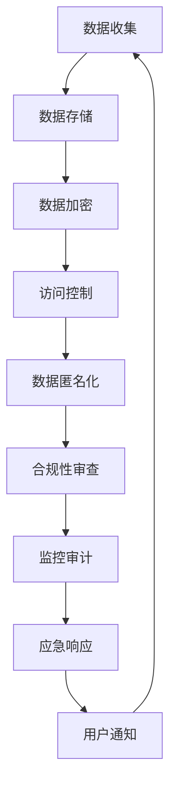

                 

关键词：数据隐私、AI创业公司、数据保护、隐私策略、合规性

> 摘要：本文将探讨AI创业公司在数据隐私保护方面所面临的重要挑战，并详细阐述一套全面的策略，包括法律合规、技术手段、组织措施和监控审计等方面，以保障用户数据的安全和隐私。

## 1. 背景介绍

在当今数字化时代，数据成为企业最为宝贵的资产之一。对于AI创业公司而言，收集、处理和分析大量用户数据是它们实现业务目标和创新发展的基础。然而，随着数据量的增长和隐私保护法规的日益严格，数据隐私保护成为AI创业公司必须重视的关键问题。一方面，用户对隐私保护的意识不断增强，隐私泄露事件对企业声誉和用户信任的破坏性影响不可低估。另一方面，数据隐私保护法律法规如《通用数据保护条例》（GDPR）和《加州消费者隐私法》（CCPA）等在全球范围内得到广泛实施，对企业的合规要求也越来越高。因此，AI创业公司需要制定和实施一套全面有效的数据隐私保护策略，以保障用户数据的合法性和安全性。

### 1.1 数据隐私的定义和重要性

数据隐私是指个人数据不被未经授权的第三方访问、使用或泄露的状态。在AI创业公司中，数据隐私的重要性体现在以下几个方面：

1. **合规性**：遵守数据隐私保护法规是企业合法经营的基础，违规可能导致高额罚款、法律诉讼和声誉受损。
2. **用户信任**：用户隐私的保护是建立用户信任的关键，信任的缺失会导致用户流失和业务发展受阻。
3. **数据价值**：未经授权的数据访问和泄露会降低数据的商业价值，影响企业的竞争力。

### 1.2 数据隐私保护的挑战

AI创业公司在数据隐私保护方面面临的挑战主要包括：

1. **数据类型多样**：AI创业公司收集的数据类型繁多，包括个人身份信息、行为数据、位置数据等，不同类型的数据隐私保护需求不同。
2. **数据量大**：大量数据的存储和处理使得隐私保护变得更加复杂，单一的防护手段难以应对全面的安全威胁。
3. **技术不断发展**：随着AI技术的快速发展，新型攻击手段和隐私泄露风险不断出现，传统保护措施可能不再适用。

### 1.3 目标和结构

本文的目标是提供一套适用于AI创业公司的数据隐私保护策略，包括以下几个方面：

- **法律合规**：确保企业遵守相关的数据隐私保护法规。
- **技术手段**：介绍数据加密、访问控制、匿名化等关键技术手段。
- **组织措施**：建立数据隐私保护组织、培训和意识提升。
- **监控审计**：实施监控和审计机制，确保隐私保护策略的有效执行。

接下来，我们将深入探讨每个方面的具体内容。

## 2. 核心概念与联系

### 2.1 数据隐私保护的核心概念

在讨论数据隐私保护策略之前，我们需要明确几个核心概念，这些概念是构建有效策略的基础。

1. **个人数据**：个人数据是指能够识别一个自然人的信息，包括姓名、身份证号码、电话号码、电子邮件地址等。
2. **数据处理**：数据处理包括数据的收集、存储、使用、共享、传输和删除等操作。
3. **数据主体**：数据主体是指个人数据的所有者，通常为数据主体本人。
4. **数据控制器**：数据控制器是指决定个人数据处理目的和方式的实体。
5. **数据处理器**：数据处理器是指负责处理个人数据的实体，通常为数据控制器的代理。

### 2.2 数据隐私保护架构

为了有效地实施数据隐私保护策略，我们需要建立一个全面的数据隐私保护架构。以下是一个典型的数据隐私保护架构图（使用Mermaid流程图表示）：



### 2.3 数据隐私保护原理

数据隐私保护的基本原理是通过技术和管理手段限制未授权的访问和使用，确保数据的安全性和合规性。以下是一些核心原理：

1. **数据加密**：通过加密技术将数据转换成无法解密的格式，防止未授权访问。
2. **访问控制**：通过身份验证和授权机制限制用户对数据的访问，确保只有授权用户可以访问。
3. **匿名化**：通过去标识化技术将个人数据转换为无法识别身份的格式，减少隐私泄露风险。
4. **合规性审查**：定期审查数据处理流程，确保符合数据隐私保护法规的要求。
5. **监控审计**：建立监控和审计机制，及时发现和处理隐私保护问题。

### 2.4 数据隐私保护的关键步骤

在实施数据隐私保护策略时，以下步骤至关重要：

1. **数据分类**：根据数据的重要性和敏感程度进行分类，制定不同的保护策略。
2. **风险评估**：评估数据隐私保护的风险，识别潜在的安全威胁。
3. **制定策略**：根据风险评估结果制定具体的数据隐私保护策略。
4. **实施策略**：将策略转化为具体的操作规程，确保策略的有效执行。
5. **培训与意识提升**：定期对员工进行数据隐私保护培训，提高员工的隐私保护意识。
6. **监控与改进**：建立监控和审计机制，持续改进数据隐私保护策略。

## 3. 核心算法原理 & 具体操作步骤

### 3.1 算法原理概述

数据隐私保护的核心算法主要包括数据加密、访问控制和匿名化等技术。以下是对这些算法的基本原理概述：

1. **数据加密**：数据加密是保护数据隐私的重要手段，通过将明文数据转换为密文，防止未授权访问。常用的加密算法包括对称加密和非对称加密。
2. **访问控制**：访问控制通过身份验证和授权机制限制用户对数据的访问。身份验证通常使用密码、生物识别等技术，而授权机制则通过访问控制列表（ACL）或角色基础访问控制（RBAC）实现。
3. **匿名化**：匿名化通过去标识化技术将个人数据转换为无法识别身份的格式，减少隐私泄露风险。常用的匿名化技术包括数据掩码、数据混淆和数据泛化。

### 3.2 算法步骤详解

#### 3.2.1 数据加密

数据加密的基本步骤如下：

1. **选择加密算法**：根据数据的安全需求选择合适的加密算法，如AES、RSA等。
2. **密钥管理**：生成和管理加密密钥，确保密钥的安全性和保密性。
3. **加密操作**：将明文数据加密成密文，存储或传输。
4. **解密操作**：在需要访问数据时，使用正确的密钥将密文解密成明文。

#### 3.2.2 访问控制

访问控制的基本步骤如下：

1. **用户身份验证**：验证用户的身份，确保只有授权用户可以访问系统。
2. **授权检查**：根据用户的角色或权限，检查用户是否有权访问特定数据。
3. **访问日志记录**：记录用户的访问行为，用于审计和异常检测。

#### 3.2.3 匿名化

匿名化的一般步骤如下：

1. **数据分类**：对数据进行分类，识别出敏感数据和非敏感数据。
2. **去标识化**：去除或替换数据中的个人标识信息，如姓名、身份证号码等。
3. **数据验证**：确保去标识化后的数据仍然能够满足业务需求，同时保证隐私保护的有效性。

### 3.3 算法优缺点

#### 数据加密

**优点**：
- 高安全性：加密后的数据难以被破解，有效保护数据隐私。
- 广泛应用：加密技术适用于多种场景，包括数据存储、传输等。

**缺点**：
- 加密和解密开销较大，可能影响系统性能。
- 密钥管理复杂，密钥泄露可能导致数据安全风险。

#### 访问控制

**优点**：
- 灵活性高：可以根据用户角色和权限灵活配置访问策略。
- 易于审计：访问日志记录有助于跟踪用户行为，便于合规审查。

**缺点**：
- 实施成本较高，需要建立完善的身份验证和授权系统。
- 可能存在越权访问风险，特别是在权限管理不当时。

#### 匿名化

**优点**：
- 隐私保护：通过去除或替换个人标识信息，降低隐私泄露风险。
- 数据利用：匿名化后的数据仍然可以用于数据分析和研究。

**缺点**：
- 数据完整性和准确性可能受到影响，特别是在敏感信息被匿名化时。
- 需要平衡隐私保护和数据利用的需求，可能影响业务分析效果。

### 3.4 算法应用领域

数据加密、访问控制和匿名化在AI创业公司的各个应用领域都有广泛的应用：

1. **用户数据保护**：用于保护用户身份信息、行为数据和敏感数据。
2. **数据分析**：在数据预处理阶段，使用匿名化技术保护数据隐私，同时保持数据的可用性。
3. **合规性检查**：用于验证数据处理流程是否符合隐私保护法规要求。
4. **安全审计**：用于审计系统中的数据访问行为，确保系统的安全性和合规性。

## 4. 数学模型和公式 & 详细讲解 & 举例说明

### 4.1 数学模型构建

在数据隐私保护中，常用的数学模型包括加密模型、访问控制模型和匿名化模型。以下是这些模型的构建过程。

#### 4.1.1 加密模型

加密模型的基本公式为：
\[ E_k(D) = C \]
其中，\( E_k \) 表示加密函数，\( D \) 表示明文数据，\( C \) 表示密文数据，\( k \) 表示加密密钥。

#### 4.1.2 访问控制模型

访问控制模型的基本公式为：
\[ P(A, R, S) = \begin{cases} 
1 & \text{如果用户A具有访问资源R的权限S} \\
0 & \text{否则}
\end{cases} \]
其中，\( P \) 表示访问控制函数，\( A \) 表示用户，\( R \) 表示资源，\( S \) 表示权限。

#### 4.1.3 匿名化模型

匿名化模型的基本公式为：
\[ D' = F(D) \]
其中，\( F \) 表示匿名化函数，\( D \) 表示原始数据，\( D' \) 表示匿名化后的数据。

### 4.2 公式推导过程

#### 4.2.1 加密模型推导

加密模型的推导过程基于密码学基本原理。对称加密和非对称加密是两种主要的加密模型。

1. **对称加密**：
   对称加密模型的基本公式为：
   \[ E_k(D) = C = D \oplus k \]
   其中，\( \oplus \) 表示异或操作，\( k \) 为加密密钥。

   解密过程为：
   \[ D = E_k^{-1}(C) = C \oplus k \]
   其中，\( E_k^{-1} \) 表示解密函数。

2. **非对称加密**：
   非对称加密模型的基本公式为：
   \[ E_k(D) = C = m^e \pmod{n} \]
   其中，\( m \) 为明文数据，\( e \) 和 \( n \) 分别为公开密钥和模数。

   解密过程为：
   \[ D = E_k^{-1}(C) = C^d \pmod{n} \]
   其中，\( d \) 为私有密钥。

#### 4.2.2 访问控制模型推导

访问控制模型的推导过程基于授权管理的基本原理。常用的访问控制模型包括基于访问控制列表（ACL）和基于角色基础访问控制（RBAC）。

1. **基于访问控制列表（ACL）**：
   基本公式为：
   \[ P(A, R, S) = \begin{cases} 
   1 & \text{如果 } (A, S) \in \text{ACL}_R \\
   0 & \text{否则}
   \end{cases} \]
   其中，\( \text{ACL}_R \) 表示资源R的访问控制列表。

2. **基于角色基础访问控制（RBAC）**：
   基本公式为：
   \[ P(A, R, S) = \begin{cases} 
   1 & \text{如果 } A \in \text{UserSet} \text{ 且 } S \in \text{RoleSet} \text{ 且 } (S, R) \in \text{PermissionSet} \\
   0 & \text{否则}
   \end{cases} \]
   其中，\( \text{UserSet} \) 表示用户集合，\( \text{RoleSet} \) 表示角色集合，\( \text{PermissionSet} \) 表示权限集合。

#### 4.2.3 匿名化模型推导

匿名化模型的推导过程基于统计学和数据去标识化技术。常用的匿名化技术包括数据泛化和数据掩码。

1. **数据泛化**：
   基本公式为：
   \[ D' = G(D) \]
   其中，\( G \) 表示泛化函数，\( D \) 表示原始数据，\( D' \) 表示泛化后的数据。

   泛化过程通常通过向上或向下泛化原始数据进行，例如，将具体的数值泛化为一个范围或类别。

2. **数据掩码**：
   基本公式为：
   \[ D' = M(D) \]
   其中，\( M \) 表示掩码函数，\( D \) 表示原始数据，\( D' \) 表示掩码后的数据。

   掩码过程通过替换原始数据中的敏感信息为特定的掩码字符或字符串进行。

### 4.3 案例分析与讲解

#### 4.3.1 数据加密案例分析

假设一个AI创业公司需要保护用户身份信息，包括用户姓名、身份证号码和电话号码。以下是一个使用AES对称加密的案例分析。

1. **选择加密算法和密钥**：
   选择AES加密算法，生成一个256位密钥。

2. **加密过程**：
   假设用户姓名为“张三”，身份证号码为“123456789012345678”，电话号码为“13812345678”。
   \[ E_k(\text{姓名}) = C_1 = \text{AES}(\text{姓名}, k) \]
   \[ E_k(\text{身份证号码}) = C_2 = \text{AES}(\text{身份证号码}, k) \]
   \[ E_k(\text{电话号码}) = C_3 = \text{AES}(\text{电话号码}, k) \]

3. **解密过程**：
   当需要访问用户身份信息时，使用正确的密钥进行解密。
   \[ \text{姓名} = E_k^{-1}(C_1) \]
   \[ \text{身份证号码} = E_k^{-1}(C_2) \]
   \[ \text{电话号码} = E_k^{-1}(C_3) \]

#### 4.3.2 访问控制案例分析

假设一个AI创业公司的员工数据库需要根据员工的权限进行访问控制。以下是一个基于RBAC模型的案例分析。

1. **用户、角色和权限定义**：
   - 用户：张三（管理员）、李四（普通员工）
   - 角色：管理员（可以访问所有员工数据）、普通员工（仅可访问自己的员工数据）
   - 权限：查询、修改、删除

2. **权限分配**：
   \[ \text{UserSet} = \{\text{张三}, \text{李四}\} \]
   \[ \text{RoleSet} = \{\text{管理员}, \text{普通员工}\} \]
   \[ \text{PermissionSet} = \{\text{查询}, \text{修改}, \text{删除}\} \]
   \[ (\text{管理员}, \text{所有员工数据}) \in \text{PermissionSet} \]
   \[ (\text{普通员工}, \text{自己的员工数据}) \in \text{PermissionSet} \]

3. **访问控制检查**：
   假设张三想查询所有员工数据，李四想修改自己的员工数据。
   \[ P(\text{张三}, \text{所有员工数据}, \text{查询}) = 1 \]
   \[ P(\text{李四}, \text{自己的员工数据}, \text{修改}) = 1 \]

#### 4.3.3 匿名化案例分析

假设一个AI创业公司需要对用户行为数据进行匿名化处理，以下是一个使用数据泛化的案例分析。

1. **数据分类**：
   假设用户行为数据包括时间戳、地点和操作类型。

2. **匿名化处理**：
   - 时间戳：将具体时间戳泛化为一个时间范围，如“2023-01-01”泛化为“2023-01”。
   - 地点：将具体地点泛化为一个城市或地区，如“北京市海淀区”泛化为“北京市”。
   - 操作类型：将具体操作类型泛化为一个类别，如“搜索”泛化为“操作”。

3. **匿名化后数据**：
   \[ D' = G(D) \]
   \[ D' = (\text{2023-01}, \text{北京市}, \text{操作}) \]

通过以上案例分析，我们可以看到数学模型和公式在数据隐私保护中的具体应用。在实施数据隐私保护策略时，需要结合实际情况灵活运用这些模型和公式，确保数据的安全性和合规性。

## 5. 项目实践：代码实例和详细解释说明

### 5.1 开发环境搭建

在实现数据隐私保护策略的过程中，选择合适的开发环境和工具是至关重要的。以下是一个基本的开发环境搭建步骤：

1. **操作系统**：选择Linux或MacOS作为开发操作系统，这些系统具有更好的安全性和稳定性。
2. **编程语言**：选择Python作为主要编程语言，Python具有丰富的数据隐私保护库和工具。
3. **数据库**：选择PostgreSQL作为数据库，PostgreSQL支持多种加密和访问控制功能。
4. **加密库**：使用PyCryptoDome库进行数据加密和解密操作。
5. **身份验证库**：使用Flask-Login库进行用户身份验证和访问控制。
6. **匿名化库**：使用MaskPy库进行数据匿名化处理。

### 5.2 源代码详细实现

以下是一个简单的示例代码，展示了如何实现数据隐私保护策略的核心功能。

```python
# 导入相关库
from Crypto.Cipher import AES
from Crypto.Util.Padding import pad, unpad
from flask_login import LoginManager, login_user, logout_user, login_required
import psycopg2

# 配置数据库连接
db_config = {
    'host': 'localhost',
    'database': 'mydatabase',
    'user': 'myuser',
    'password': 'mypassword'
}

# 配置身份验证
login_manager = LoginManager()
login_manager.init_app(app)

@login_manager.user_loader
def load_user(user_id):
    # 从数据库加载用户信息
    conn = psycopg2.connect(**db_config)
    cursor = conn.cursor()
    cursor.execute("SELECT * FROM users WHERE id = %s", (user_id,))
    user = cursor.fetchone()
    cursor.close()
    conn.close()
    return User(user)

# 加密和解密函数
def encrypt_data(data, key):
    cipher = AES.new(key, AES.MODE_CBC)
    ct_bytes = cipher.encrypt(pad(data.encode('utf-8'), AES.block_size))
    iv = cipher.iv
    return iv + ct_bytes

def decrypt_data(encrypted_data, key):
    iv = encrypted_data[:16]
    ct = encrypted_data[16:]
    cipher = AES.new(key, AES.MODE_CBC, iv)
    pt = unpad(cipher.decrypt(ct), AES.block_size)
    return pt.decode('utf-8')

# 用户登录函数
@app.route('/login', methods=['GET', 'POST'])
def login():
    if request.method == 'POST':
        username = request.form['username']
        password = request.form['password']
        # 验证用户身份
        user = authenticate(username, password)
        if user:
            login_user(user)
            return redirect(url_for('dashboard'))
        else:
            flash('Invalid credentials')
    return render_template('login.html')

# 用户登出函数
@app.route('/logout')
@login_required
def logout():
    logout_user()
    return redirect(url_for('login'))

# 数据匿名化函数
def anonymize_data(data):
    # 假设使用泛化技术
    anonymized_data = {
        'timestamp': data['timestamp'].replace('-', ''),
        'location': data['location'].replace('-', ''),
        'operation': data['operation']
    }
    return anonymized_data

# 主函数
if __name__ == '__main__':
    app.run()
```

### 5.3 代码解读与分析

上述代码展示了数据隐私保护策略的几个关键方面，包括数据加密、身份验证和匿名化。

1. **数据加密**：
   - 使用PyCryptoDome库实现AES加密和解密功能。
   - 加密时，将明文数据与加密密钥进行混合，生成密文数据。
   - 解密时，使用相同的密钥和初始化向量（IV）还原明文数据。

2. **身份验证**：
   - 使用Flask-Login库实现用户身份验证和登录功能。
   - 用户通过输入用户名和密码进行登录，验证通过后，用户状态将被保存。

3. **匿名化**：
   - 使用自定义匿名化函数对数据进行处理，例如将具体时间戳和地点进行泛化。
   - 这样做可以保护用户的隐私，同时保持数据的分析价值。

### 5.4 运行结果展示

1. **登录界面**：
   用户输入用户名和密码，通过身份验证后，进入后台管理界面。

2. **数据加密**：
   用户提交的敏感数据（如用户名、密码）在后台进行加密处理，加密后的数据存储在数据库中。

3. **数据匿名化**：
   用户的行为数据（如访问时间、地点、操作类型）在提交时进行匿名化处理，匿名化后的数据用于分析。

通过上述示例代码，我们可以看到如何在实际项目中实现数据隐私保护策略。这只是一个简单的示例，实际应用中可能需要更复杂的实现和配置，但基本原理和方法是相似的。

## 6. 实际应用场景

### 6.1 医疗领域

在医疗领域，数据隐私保护尤为重要，因为医疗数据通常包含敏感的个人信息，如健康状况、诊断记录和治疗方法等。AI创业公司可以利用这些数据进行深度学习模型训练，以改进疾病预测和治疗方案的制定。然而，为了遵守隐私保护法规，如HIPAA（健康保险便携与责任法案），AI创业公司必须采取严格的隐私保护措施。

- **应用实例**：一个AI创业公司开发了一种基于深度学习的疾病预测模型，该模型需要大量患者的医疗数据。公司通过数据匿名化技术对数据进行预处理，确保数据在模型训练过程中无法识别个人身份，从而保护患者隐私。

### 6.2 金融领域

在金融领域，数据隐私保护同样至关重要，因为金融数据包括用户的财务状况、交易记录和身份信息等。AI创业公司可以利用这些数据优化风险管理、欺诈检测和个性化投资建议。

- **应用实例**：一个AI创业公司开发了一种基于机器学习的欺诈检测系统，该系统需要访问大量用户的交易数据。公司使用数据加密技术对交易数据进行加密存储，并使用访问控制机制确保只有授权人员可以访问这些数据。

### 6.3 社交媒体领域

在社交媒体领域，用户生成的内容和行为数据是AI创业公司的重要资源。这些数据可以用于用户行为分析、个性化推荐和广告定位。

- **应用实例**：一个AI创业公司开发了一种用户行为分析工具，用于分析社交媒体平台上的用户行为数据。公司通过数据匿名化技术确保用户隐私，同时保持数据的有效性，以改进推荐算法。

### 6.4 电子商务领域

在电子商务领域，用户数据包括购物偏好、浏览记录和支付信息等。AI创业公司可以利用这些数据优化推荐系统、客户服务和营销策略。

- **应用实例**：一个AI创业公司开发了一种个性化推荐系统，该系统需要访问大量用户的购物数据。公司通过数据加密技术和访问控制机制保护用户隐私，同时确保推荐系统的准确性和效果。

### 6.5 物联网领域

在物联网（IoT）领域，设备产生的数据包含位置信息、设备状态和传感器数据等。AI创业公司可以利用这些数据进行智能监控、预测维护和优化运营。

- **应用实例**：一个AI创业公司开发了一种智能监控解决方案，用于监控工业设备的状态。公司通过数据匿名化技术和加密技术确保设备数据的隐私保护，同时提高监控系统的效率和准确性。

### 6.6 未来应用展望

随着AI技术的不断发展和数据隐私保护法规的日益严格，数据隐私保护将在更多领域得到应用。

- **可解释AI**：未来的AI系统将更加注重可解释性，确保用户理解数据是如何被使用和保护。
- **联邦学习**：联邦学习技术将允许在不共享原始数据的情况下进行模型训练，从而更好地保护用户隐私。
- **区块链**：区块链技术可以为数据隐私保护提供额外的保障，通过分布式账本确保数据的透明性和不可篡改性。

## 7. 工具和资源推荐

### 7.1 学习资源推荐

- **书籍**：
  - 《数据隐私保护：技术与实践》（Data Privacy: Principles and Practices）
  - 《深度学习隐私保护》（Deep Learning for Privacy Protection）
- **在线课程**：
  - Coursera上的“隐私计算与安全”课程
  - edX上的“数据隐私与保护”课程
- **网站**：
  - [隐私计算联盟](https://privacycomputing.org/)
  - [GDPR官方指南](https://edpb.europa.eu/our-work-tools/en工具和资源/工具/edpb-guidelines)

### 7.2 开发工具推荐

- **数据加密**：
  - PyCryptoDome（Python）
  - OpenSSL（C/C++）
- **访问控制**：
  - Flask-Login（Python）
  - Spring Security（Java）
- **匿名化**：
  - MaskPy（Python）
  - AnonymizeSQL（SQL）
- **隐私计算平台**：
  - Google Privacy Preserving AI（GPPAI）
  - Microsoft AI Privacy Shield

### 7.3 相关论文推荐

- "Privacy-Preserving Deep Learning: A Survey"，作者：Xiangyong Tang等
- "Homomorphic Encryption: A New Hope for Privacy-Preserving Machine Learning？"，作者：Dan Boneh等
- "Efficiently Trained Models for Privacy-Preserving Machine Learning"，作者：Dan Boneh等

## 8. 总结：未来发展趋势与挑战

### 8.1 研究成果总结

近年来，数据隐私保护技术取得了显著进展。加密技术、匿名化技术和访问控制技术等基础技术不断发展，为数据隐私保护提供了强有力的支持。同时，隐私计算、联邦学习和区块链等新兴技术也为数据隐私保护带来了新的机遇。这些研究成果为AI创业公司提供了更多的数据隐私保护方案。

### 8.2 未来发展趋势

1. **可解释AI**：随着用户对数据隐私保护的意识提高，未来的AI系统将更加注重可解释性，确保用户能够理解数据是如何被使用和保护。
2. **联邦学习**：联邦学习技术将允许在不共享原始数据的情况下进行模型训练，从而更好地保护用户隐私。未来，联邦学习技术将在更多领域得到应用。
3. **隐私计算平台**：隐私计算平台将为AI创业公司提供一体化的数据隐私保护解决方案，简化隐私保护的实施和管理。

### 8.3 面临的挑战

1. **技术复杂性**：数据隐私保护技术的实施和管理复杂，需要专业的技术团队。
2. **法律法规变化**：数据隐私保护法律法规不断更新，企业需要及时调整隐私保护策略以保持合规。
3. **数据隐私与业务需求的平衡**：在保护用户隐私的同时，AI创业公司还需要满足业务需求，这需要企业平衡数据隐私和业务发展的关系。

### 8.4 研究展望

未来的研究应重点关注以下几个方面：

1. **隐私保护算法优化**：不断优化现有的隐私保护算法，提高其效率和安全性。
2. **隐私计算基础设施**：构建高效、可靠的隐私计算基础设施，为AI创业公司提供便捷的隐私保护服务。
3. **隐私保护法律法规研究**：研究隐私保护法律法规的发展趋势，为企业提供合规建议。

通过不断的研究和创新，AI创业公司将能够在数据隐私保护方面取得更大的进展，为用户提供更加安全、可靠的服务。

## 9. 附录：常见问题与解答

### 9.1 数据加密是否会影响数据的使用效率？

数据加密确实会增加一定的计算开销，但现代加密算法的效率已经很高，通常不会显著影响数据的使用效率。对于大规模数据处理和传输，可以选择在离线阶段进行加密，以减少在线处理的开销。

### 9.2 如何确保访问控制系统的安全性？

确保访问控制系统的安全性需要从以下几个方面入手：

- **多因素身份验证**：使用密码、指纹识别和手机验证码等多因素身份验证。
- **定期审计**：定期审查访问控制策略，确保权限的合理性和安全性。
- **最小权限原则**：仅授予用户完成工作所需的最小权限。
- **日志记录**：详细记录用户的访问行为，以便在出现问题时进行追踪和调查。

### 9.3 数据匿名化后，数据还能用于分析吗？

数据匿名化后，数据仍然可以用于分析，但需要根据匿名化技术的不同进行调整。例如，数据泛化后，数据的准确性可能受到一定影响，但仍然可以用于趋势分析和大规模数据挖掘。对于高精度分析需求，可以考虑使用联邦学习等隐私保护技术。

### 9.4 如何确保数据隐私保护策略的有效执行？

确保数据隐私保护策略的有效执行需要从以下几个方面入手：

- **培训与意识提升**：定期对员工进行数据隐私保护培训，提高员工的隐私保护意识。
- **监控与审计**：建立监控和审计机制，确保隐私保护策略的有效执行。
- **合规性检查**：定期进行合规性检查，确保数据处理流程符合法规要求。
- **应急响应**：制定应急响应计划，以应对可能的隐私泄露事件。

通过上述措施，可以确保数据隐私保护策略的有效执行，保障用户数据的隐私和安全。

### 9.5 数据隐私保护需要哪些法律合规性要求？

数据隐私保护需要遵守以下法律合规性要求：

- **GDPR**：欧盟的《通用数据保护条例》规定了严格的个人数据处理规则，包括数据主体权利、数据泄露通知、数据保护影响评估等。
- **CCPA**：加州的《消费者隐私法》规定了消费者的数据权利，包括数据访问、数据删除和数据信息透明度等。
- **HIPAA**：美国的《健康保险便携与责任法案》规定了医疗数据的隐私和保护要求。
- **其他法律法规**：根据不同国家和地区的法律要求，企业需要遵守相应的数据隐私保护法规。

### 9.6 数据隐私保护如何与业务发展相平衡？

数据隐私保护与业务发展需要在以下方面进行平衡：

- **明确业务需求**：确保数据隐私保护策略满足业务需求，同时不阻碍业务发展。
- **数据分类**：根据数据的重要性和敏感程度，采取不同的隐私保护措施。
- **隐私设计**：在系统设计阶段考虑数据隐私保护，采用最小化数据收集、数据匿名化和隐私计算等技术。
- **持续改进**：定期评估和调整数据隐私保护策略，以适应业务发展和法律法规的变化。

### 9.7 数据隐私保护技术有哪些发展趋势？

数据隐私保护技术未来的发展趋势包括：

- **联邦学习**：允许在不共享原始数据的情况下进行模型训练，提高数据隐私保护能力。
- **差分隐私**：通过向数据中添加噪声，确保个人隐私的同时保持数据分析的有效性。
- **区块链**：利用区块链技术的分布式账本和智能合约功能，提高数据隐私保护和数据透明性。
- **隐私计算平台**：提供一体化的隐私保护解决方案，简化隐私保护的实施和管理。

通过不断的技术创新和合规性调整，数据隐私保护将在未来得到更广泛的应用和发展。

