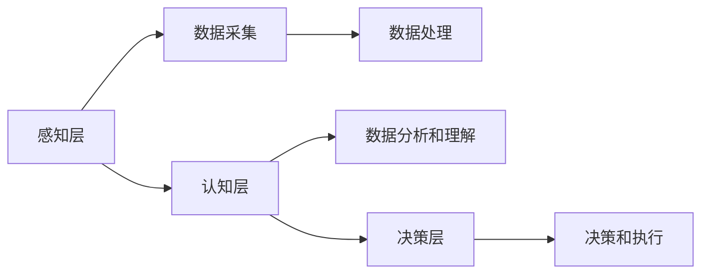

                 

关键词：人工智能、创业、差异化发展、竞争、制胜法宝

> 摘要：随着人工智能技术的快速发展，创业竞争日益激烈。本文将从技术、市场、团队等多个角度分析当前人工智能创业领域面临的挑战，并探讨如何通过差异化发展来实现竞争优势。

## 1. 背景介绍

近年来，人工智能（AI）技术在全球范围内取得了突破性进展，从语音识别、图像处理到自然语言处理，各种应用场景层出不穷。这不仅推动了人工智能产业链的快速发展，也吸引了大量创业者投身其中，希望在这个领域分得一杯羹。然而，随着竞争的加剧，如何脱颖而出成为每个创业者都必须面对的问题。

当前，人工智能创业领域主要面临以下几个方面的挑战：

1. **技术竞争**：人工智能技术更新迭代速度极快，创业者需要不断跟进前沿技术，否则很容易被市场淘汰。
2. **市场同质化**：由于市场需求的多样性和竞争的激烈性，许多创业项目在产品和服务上呈现出高度的同质化现象。
3. **团队建设**：人工智能创业团队需要具备跨学科的知识和技能，但人才稀缺，组建高效团队是一个难题。
4. **资金压力**：人工智能创业项目往往需要大量的资金投入，尤其是在技术研发和产品推广阶段。

## 2. 核心概念与联系

### 2.1 人工智能技术架构

人工智能技术可以分为三个层次：感知层、认知层和决策层。感知层主要负责数据的采集和处理，认知层通过算法模型对数据进行分析和理解，决策层则根据分析结果做出相应的决策。以下是一个简化的Mermaid流程图，展示了人工智能技术的基本架构：



### 2.2 创业与竞争的关系

创业过程本质上是一种竞争行为，创业者通过创新的产品或服务在市场中争夺资源。竞争有正面和负面两个方面：

- **正面竞争**：激发创业者的创新活力，推动技术进步和市场发展。
- **负面竞争**：可能导致市场资源过度集中，阻碍技术进步和行业发展。

### 2.3 差异化发展的重要性

在激烈的竞争环境中，差异化发展成为创业企业实现竞争优势的关键。差异化可以通过以下几种方式实现：

- **技术创新**：开发独特的技术或产品，提供与众不同的解决方案。
- **市场定位**：针对特定用户群体，提供定制化的产品和服务。
- **品牌建设**：塑造独特的品牌形象，提高品牌知名度和用户忠诚度。

## 3. 核心算法原理 & 具体操作步骤

### 3.1 算法原理概述

在人工智能领域，常用的算法包括机器学习、深度学习和强化学习。以下是对这些算法的基本原理进行概述：

- **机器学习**：通过数据训练模型，使其具备对未知数据的预测和分类能力。
- **深度学习**：基于多层神经网络，通过大量数据训练，实现复杂模式的识别。
- **强化学习**：通过试错和反馈机制，不断优化决策过程，实现最佳策略。

### 3.2 算法步骤详解

以机器学习为例，以下是机器学习算法的基本步骤：

1. **数据采集**：收集大量带有标签的数据，作为训练样本。
2. **数据预处理**：对数据进行清洗、归一化和特征提取。
3. **模型选择**：根据问题特点选择合适的机器学习模型。
4. **模型训练**：使用训练数据对模型进行训练。
5. **模型评估**：使用测试数据对模型进行评估，调整模型参数。
6. **模型部署**：将训练好的模型应用到实际场景中。

### 3.3 算法优缺点

- **机器学习**：优点是能够处理大规模数据，适应性强；缺点是需要大量数据，训练时间较长。
- **深度学习**：优点是能够处理复杂任务，效果较好；缺点是计算资源需求高，对数据质量要求较高。
- **强化学习**：优点是能够自适应环境变化，找到最优策略；缺点是训练过程复杂，收敛速度较慢。

### 3.4 算法应用领域

机器学习、深度学习和强化学习在人工智能的不同领域都有广泛应用：

- **机器学习**：在数据挖掘、自然语言处理、推荐系统等领域得到广泛应用。
- **深度学习**：在计算机视觉、语音识别、自动驾驶等领域取得显著成果。
- **强化学习**：在游戏AI、推荐系统、智能决策等领域展现潜力。

## 4. 数学模型和公式 & 详细讲解 & 举例说明

### 4.1 数学模型构建

以线性回归为例，线性回归模型可以用以下数学公式表示：

$$ y = w_0 + w_1 \cdot x $$

其中，$y$ 是预测值，$x$ 是输入特征，$w_0$ 和 $w_1$ 是模型参数。

### 4.2 公式推导过程

线性回归模型的推导过程如下：

1. **假设**：假设目标变量 $y$ 和输入特征 $x$ 之间存在线性关系。
2. **目标函数**：定义损失函数，用于衡量预测值和实际值之间的差距。
3. **求导**：对损失函数求导，找到使损失函数最小的参数值。
4. **求解**：根据求导结果，求解参数值，得到线性回归模型。

### 4.3 案例分析与讲解

假设我们要预测房价，输入特征为房屋面积。以下是线性回归模型的应用案例：

1. **数据采集**：收集包含房屋面积和房价的数据。
2. **数据预处理**：对数据进行清洗和归一化处理。
3. **模型训练**：使用训练数据，通过梯度下降算法训练线性回归模型。
4. **模型评估**：使用测试数据，评估模型预测效果。
5. **模型部署**：将训练好的模型应用于实际场景，预测新房屋的房价。

## 5. 项目实践：代码实例和详细解释说明

### 5.1 开发环境搭建

为了演示线性回归模型的实现，我们使用Python编程语言和Scikit-learn库。以下是开发环境搭建的步骤：

1. **安装Python**：从官方网站下载并安装Python。
2. **安装Scikit-learn**：使用pip命令安装Scikit-learn库。

### 5.2 源代码详细实现

以下是线性回归模型的Python代码实现：

```python
from sklearn.linear_model import LinearRegression
from sklearn.model_selection import train_test_split
from sklearn.metrics import mean_squared_error

# 数据加载
X, y = load_data()

# 数据划分
X_train, X_test, y_train, y_test = train_test_split(X, y, test_size=0.2, random_state=42)

# 模型训练
model = LinearRegression()
model.fit(X_train, y_train)

# 模型评估
y_pred = model.predict(X_test)
mse = mean_squared_error(y_test, y_pred)
print("MSE:", mse)

# 模型部署
new_data = load_new_data()
predicted_price = model.predict(new_data)
print("Predicted Price:", predicted_price)
```

### 5.3 代码解读与分析

以上代码实现了线性回归模型的训练、评估和部署。以下是代码的主要组成部分：

- **数据加载**：从文件中加载包含房屋面积和房价的数据。
- **数据划分**：将数据划分为训练集和测试集。
- **模型训练**：使用训练数据训练线性回归模型。
- **模型评估**：使用测试数据评估模型预测效果。
- **模型部署**：使用训练好的模型预测新房屋的房价。

## 6. 实际应用场景

线性回归模型在房地产、金融、电商等众多领域有广泛的应用。以下是一些实际应用场景：

- **房地产**：预测房屋价格，为投资者提供决策依据。
- **金融**：评估信贷风险，为金融机构提供风险管理工具。
- **电商**：预测商品销量，为电商企业提供库存管理建议。

## 7. 未来应用展望

随着人工智能技术的不断发展，线性回归模型的应用领域将更加广泛。未来可能的应用方向包括：

- **智能医疗**：预测疾病发生风险，为医生提供诊断建议。
- **智能制造**：预测设备故障，提高生产效率。
- **智能交通**：预测交通流量，优化交通管理。

## 8. 总结：未来发展趋势与挑战

### 8.1 研究成果总结

本文从技术、市场、团队等多个角度分析了当前人工智能创业领域面临的挑战，并探讨了如何通过差异化发展来实现竞争优势。主要研究成果包括：

- **技术竞争**：人工智能技术更新迭代速度极快，创业者需要不断跟进前沿技术。
- **市场同质化**：通过差异化发展，创业企业可以在市场中脱颖而出。
- **团队建设**：构建高效团队是人工智能创业的关键。
- **资金压力**：合理规划资金使用，避免资金压力。

### 8.2 未来发展趋势

未来，人工智能创业领域将呈现以下发展趋势：

- **技术创新**：随着人工智能技术的不断发展，创新将成为创业企业的核心竞争力。
- **跨界融合**：人工智能与其他领域的融合将推动产业升级。
- **数据驱动**：数据将成为创业企业的核心资产，数据驱动的决策将更加重要。

### 8.3 面临的挑战

未来，人工智能创业领域将面临以下挑战：

- **技术挑战**：人工智能技术的高门槛将限制新进入者的数量。
- **市场竞争**：激烈的市场竞争将导致行业洗牌。
- **人才短缺**：跨学科人才短缺将成为创业企业的难题。

### 8.4 研究展望

针对未来人工智能创业领域的发展趋势和挑战，以下是一些建议和研究方向：

- **技术创新**：持续关注人工智能前沿技术，推动技术创新。
- **跨界融合**：积极拓展与其他领域的合作，实现跨界融合。
- **人才培养**：加强跨学科人才培养，提高团队整体竞争力。
- **数据驱动**：利用大数据技术，实现数据驱动的决策。

## 9. 附录：常见问题与解答

### 问题1：如何快速跟进人工智能前沿技术？

**回答**：关注顶级会议和期刊，如NeurIPS、ICML、JMLR等，了解最新研究进展。此外，可以参加技术研讨会、工作坊等活动，与领域专家交流。

### 问题2：如何应对市场竞争？

**回答**：通过差异化发展，提供独特的解决方案，满足不同用户群体的需求。同时，注重品牌建设，提高品牌知名度和用户忠诚度。

### 问题3：如何组建高效团队？

**回答**：明确团队目标，搭建跨学科团队，注重团队成员之间的协作和沟通。同时，提供培训和发展机会，提高团队整体竞争力。

### 问题4：如何应对资金压力？

**回答**：合理规划资金使用，避免过度依赖融资。可以通过优化运营效率、降低成本等方式，提高企业的资金利用效率。

## 作者署名

作者：禅与计算机程序设计艺术 / Zen and the Art of Computer Programming
----------------------------------------------------------------

这篇文章详细探讨了人工智能创业领域面临的挑战以及如何通过差异化发展来赢得竞争优势。希望这篇文章能为人工智能创业者提供一些有价值的参考和启示。在未来的发展中，人工智能创业领域将继续充满机遇和挑战，让我们共同努力，迎接未来的挑战，共创美好未来。

