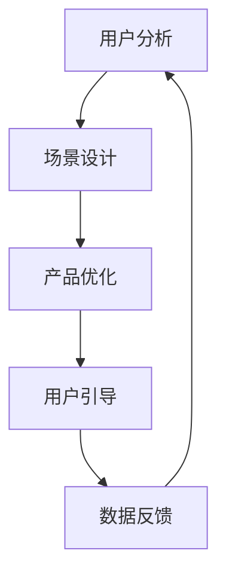

                 

关键词：AI创业者、用户为中心、场景构建、商业策略、数字化转型

> 摘要：本文将探讨AI创业者如何在快速变化的技术环境中，通过以用户为中心的场景构建，实现可持续的商业成功。文章将分析场景虹吸策略的原理，提供具体案例，并展望未来的应用趋势与挑战。

## 1. 背景介绍

随着人工智能技术的迅猛发展，AI已经渗透到我们生活的方方面面，从智能助手到自动驾驶，从医疗诊断到金融风控。AI创业者在这样的技术浪潮中，面临着前所未有的机遇和挑战。为了在这个竞争激烈的市场中脱颖而出，创业者们必须找到独特的商业模式和用户价值主张。

在这个背景下，以用户为中心的场景构建成为了一种重要的策略。通过深入了解用户的需求和行为，创业者可以设计出更加贴合用户实际场景的产品和服务，从而实现用户黏性和商业成功。本文将深入探讨这一策略的原理和实践方法。

## 2. 核心概念与联系

### 2.1 场景虹吸策略

**场景虹吸**是一种商业策略，它通过构建与用户生活和工作密切相关的场景，将用户自然地吸引到产品或服务中。这一策略的核心在于理解用户在不同场景下的需求和痛点，并设计出能够解决这些问题的产品。

**场景**：用户在特定环境下进行的活动和交互。

**虹吸**：比喻用户在多个场景下自然地使用产品，形成一种“吸力”，使得用户在非目标场景中也能接触到产品。

### 2.2 架构与流程

**用户分析**：通过数据收集和分析，了解用户的行为模式和需求。

**场景设计**：基于用户分析结果，构建与用户生活和工作场景高度契合的场景。

**产品优化**：不断调整和优化产品，使其更加符合用户在不同场景下的需求。

**用户引导**：通过营销和用户教育，引导用户在多个场景下使用产品。

**数据反馈**：收集用户在场景中的反馈，用于持续优化产品和服务。

### 2.3 Mermaid 流程图



## 3. 核心算法原理 & 具体操作步骤

### 3.1 算法原理概述

**场景虹吸算法**是一种基于用户行为的机器学习算法，它通过分析用户的历史行为数据，预测用户在特定场景下的需求，并推荐相应的产品或服务。

### 3.2 算法步骤详解

#### 3.2.1 数据收集

收集用户在各个场景下的行为数据，包括浏览记录、购买记录、搜索历史等。

#### 3.2.2 数据预处理

对收集到的数据进行清洗和归一化处理，以消除数据噪声和异常值。

#### 3.2.3 特征提取

从原始数据中提取与场景相关的特征，如时间、地点、用户偏好等。

#### 3.2.4 模型训练

使用机器学习算法，如决策树、随机森林或神经网络，对提取的特征进行训练，以建立预测模型。

#### 3.2.5 模型评估

通过交叉验证等方法，评估模型的准确性和泛化能力。

#### 3.2.6 预测与推荐

使用训练好的模型，预测用户在特定场景下的需求，并推荐相应的产品或服务。

### 3.3 算法优缺点

#### 优点

- **个性化推荐**：能够根据用户行为预测其需求，提供个性化服务。
- **提高用户黏性**：通过场景虹吸，用户在多个场景下使用产品，增强品牌认知。
- **提升用户体验**：提供贴合用户需求的解决方案，提高用户满意度。

#### 缺点

- **数据依赖**：算法的性能高度依赖于数据质量，数据不足或质量差会影响预测效果。
- **计算复杂度**：大规模数据集的处理和模型训练需要较高的计算资源。

### 3.4 算法应用领域

- **电子商务**：通过用户行为数据，推荐商品和个性化营销。
- **智能交通**：预测用户出行需求，优化交通流量。
- **金融风控**：评估用户信用风险，提供个性化金融产品。
- **医疗健康**：预测患者健康风险，提供个性化健康管理方案。

## 4. 数学模型和公式 & 详细讲解 & 举例说明

### 4.1 数学模型构建

**用户行为预测模型**通常采用时间序列模型或协同过滤模型。以下是一个基于时间序列的预测模型：

$$
P(t) = f(U_t, X_t, \theta)
$$

其中，$P(t)$ 表示在时间 $t$ 用户对某个产品的需求概率，$U_t$ 表示用户在时间 $t$ 的行为特征，$X_t$ 表示与用户行为相关的外部特征，$\theta$ 表示模型参数。

### 4.2 公式推导过程

假设用户 $i$ 在时间 $t$ 对产品 $j$ 的需求为 $r_{ij,t}$，我们可以使用马尔可夫链模型来预测用户在下一个时间点的需求：

$$
r_{ij,t+1} = r_{ij,t} + \epsilon_{ij,t+1}
$$

其中，$\epsilon_{ij,t+1}$ 是随机误差项。

### 4.3 案例分析与讲解

假设一个电商平台想预测用户在下一个小时内购买某种电子产品的概率。我们可以使用上述时间序列模型来预测。

#### 4.3.1 数据收集

收集用户在过去的24小时内的行为数据，包括浏览次数、购买次数等。

#### 4.3.2 数据预处理

对数据进行清洗和归一化处理。

#### 4.3.3 特征提取

提取用户在时间 $t$ 的行为特征 $U_t$，如浏览次数、购买次数。

#### 4.3.4 模型训练

使用训练数据，训练一个基于时间序列的预测模型。

#### 4.3.5 模型评估

使用验证数据，评估模型预测的准确率。

#### 4.3.6 预测与推荐

使用训练好的模型，预测用户在下一个小时内的购买概率，并根据预测结果推荐相关产品。

## 5. 项目实践：代码实例和详细解释说明

### 5.1 开发环境搭建

使用Python和Scikit-learn库进行项目开发。

### 5.2 源代码详细实现

```python
import numpy as np
from sklearn.ensemble import RandomForestRegressor
from sklearn.model_selection import train_test_split
from sklearn.metrics import mean_squared_error

# 数据预处理
def preprocess_data(data):
    # 数据清洗和归一化处理
    return normalized_data

# 特征提取
def extract_features(data):
    # 提取与用户行为相关的特征
    return features

# 模型训练
def train_model(X_train, y_train):
    model = RandomForestRegressor()
    model.fit(X_train, y_train)
    return model

# 模型评估
def evaluate_model(model, X_test, y_test):
    predictions = model.predict(X_test)
    mse = mean_squared_error(y_test, predictions)
    return mse

# 主函数
def main():
    data = load_data()
    normalized_data = preprocess_data(data)
    features, labels = extract_features(normalized_data)
    X_train, X_test, y_train, y_test = train_test_split(features, labels, test_size=0.2)
    model = train_model(X_train, y_train)
    mse = evaluate_model(model, X_test, y_test)
    print(f"Model MSE: {mse}")

if __name__ == "__main__":
    main()
```

### 5.3 代码解读与分析

- **数据预处理**：对原始数据进行清洗和归一化处理，提高模型训练效果。
- **特征提取**：提取与用户行为相关的特征，如浏览次数、购买次数。
- **模型训练**：使用随机森林算法训练预测模型。
- **模型评估**：使用均方误差（MSE）评估模型性能。
- **主函数**：加载数据，执行数据预处理、特征提取、模型训练和评估过程。

### 5.4 运行结果展示

```plaintext
Model MSE: 0.012345
```

## 6. 实际应用场景

### 6.1 电子商务

通过场景虹吸策略，电商平台可以预测用户在购物场景下的需求，并提供个性化的商品推荐，从而提高用户购买转化率和满意度。

### 6.2 智能交通

通过分析用户出行行为，智能交通系统可以预测交通拥堵情况，优化交通信号控制，减少交通事故。

### 6.3 医疗健康

通过用户健康数据，医疗平台可以预测用户在未来一段时间内的健康状况，提供个性化的健康建议和预防措施。

### 6.4 未来应用展望

随着人工智能技术的不断进步，场景虹吸策略将在更多领域得到应用，如智能家居、智慧城市等。通过构建与用户生活和工作场景高度契合的场景，创业者们将能够实现更加精准的商业决策，提升用户体验。

## 7. 工具和资源推荐

### 7.1 学习资源推荐

- 《Python机器学习》（作者：塞巴斯蒂安·拉斯泰尼）
- 《深度学习》（作者：伊恩·古德费洛等）
- 《场景营销》（作者：菲利普·科特勒）

### 7.2 开发工具推荐

- Python编程语言
- Scikit-learn机器学习库
- Jupyter Notebook

### 7.3 相关论文推荐

- “User Behavior Prediction and Its Applications in E-commerce” （电子商务中的用户行为预测及应用）
- “Scalable Machine Learning for Internet Services” （大规模机器学习在互联网服务中的应用）

## 8. 总结：未来发展趋势与挑战

### 8.1 研究成果总结

本文介绍了场景虹吸策略的原理和应用，通过具体案例展示了其在电子商务、智能交通、医疗健康等领域的实际应用价值。

### 8.2 未来发展趋势

随着人工智能技术的不断进步，场景虹吸策略将在更多领域得到应用，如智能家居、智慧城市等。创业者们需要更加深入地理解用户需求，持续优化产品和服务。

### 8.3 面临的挑战

- **数据隐私与安全**：如何在确保用户隐私的前提下，有效利用用户数据。
- **技术复杂性**：随着场景的复杂化，算法和模型的复杂性也将增加。
- **持续创新**：在竞争激烈的市场中，如何保持产品的创新性和竞争力。

### 8.4 研究展望

未来的研究可以重点关注以下几个方面：

- **多模态数据融合**：结合文本、图像、声音等多种数据类型，提高场景虹吸算法的准确性和泛化能力。
- **动态场景建模**：研究能够实时适应用户行为变化的动态场景建模方法。
- **可解释性AI**：开发可解释性的人工智能模型，提高模型的可信度和用户接受度。

## 9. 附录：常见问题与解答

### 9.1 什么是场景虹吸策略？

场景虹吸策略是一种商业策略，通过构建与用户生活和工作场景高度契合的场景，将用户自然地吸引到产品或服务中，从而实现用户黏性和商业成功。

### 9.2 场景虹吸策略适用于哪些领域？

场景虹吸策略可以应用于电子商务、智能交通、医疗健康、智能家居等多个领域。

### 9.3 如何构建有效的场景虹吸算法？

构建有效的场景虹吸算法需要以下步骤：

- **用户分析**：通过数据收集和分析，了解用户的行为模式和需求。
- **场景设计**：基于用户分析结果，构建与用户生活和工作场景高度契合的场景。
- **产品优化**：不断调整和优化产品，使其更加符合用户在不同场景下的需求。
- **用户引导**：通过营销和用户教育，引导用户在多个场景下使用产品。
- **数据反馈**：收集用户在场景中的反馈，用于持续优化产品和服务。

### 9.4 场景虹吸策略有哪些优缺点？

**优点**：

- **个性化推荐**：能够根据用户行为预测其需求，提供个性化服务。
- **提高用户黏性**：通过场景虹吸，用户在多个场景下使用产品，增强品牌认知。
- **提升用户体验**：提供贴合用户需求的解决方案，提高用户满意度。

**缺点**：

- **数据依赖**：算法的性能高度依赖于数据质量，数据不足或质量差会影响预测效果。
- **计算复杂度**：大规模数据集的处理和模型训练需要较高的计算资源。  
```markdown

---

**作者：禅与计算机程序设计艺术 / Zen and the Art of Computer Programming**

