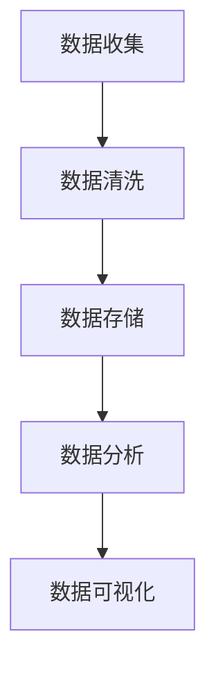

                 

在当今这个数据驱动的时代，人工智能（AI）创业已经成为了科技界的热门话题。数据管理是AI创业中至关重要的一环，因为数据的准确性和可靠性直接影响着AI模型的性能和应用效果。本文将探讨数据管理在AI创业中的重要性，介绍一些核心概念和算法原理，并通过具体案例进行分析，最后对未来的发展趋势和挑战进行展望。

## 1. 背景介绍

随着大数据和云计算技术的迅猛发展，数据已经成为企业和社会的核心资产。AI技术的崛起，更是将数据的潜在价值推向了前所未有的高度。然而，数据的获取、存储、处理和分析过程并不简单，尤其是对于初创企业来说，数据管理的挑战尤为突出。

数据管理涉及多个方面，包括数据收集、数据清洗、数据存储、数据分析和数据安全等。对于AI创业公司，这些环节的效率和准确性直接决定了AI模型的性能和应用效果。因此，如何有效地管理数据，成为AI创业成功的关键。

## 2. 核心概念与联系

### 2.1 数据质量

数据质量是数据管理的核心概念之一。高质量的数据能够提高AI模型的准确性，而数据质量问题则可能导致模型错误。数据质量包括准确性、完整性、一致性、时效性和可用性等方面。

### 2.2 数据类型

数据类型包括结构化数据和非结构化数据。结构化数据通常指的是以表格形式组织的数据，如关系数据库中的数据。非结构化数据则包括文本、图像、音频和视频等。

### 2.3 数据流

数据流是指数据在系统中的流动过程，包括数据收集、传输、处理和存储等环节。

### 2.4 数据仓库

数据仓库是一个集成的数据存储系统，用于支持企业决策分析和数据挖掘。它通常包含大量历史数据，并能提供高效的数据查询和分析能力。

### 2.5 数据分析

数据分析是指使用统计和算法方法来分析数据，以发现数据中的模式、趋势和关联性。

### 2.6 Mermaid 流程图



## 3. 核心算法原理 & 具体操作步骤

### 3.1 算法原理概述

数据管理中的核心算法主要涉及数据清洗、数据挖掘和机器学习算法等。数据清洗算法用于处理缺失值、异常值和重复值等。数据挖掘算法用于发现数据中的模式和关联性。机器学习算法则用于构建预测模型和分类模型。

### 3.2 算法步骤详解

#### 3.2.1 数据收集

数据收集是数据管理的基础。收集的数据可以是结构化的，也可以是非结构化的。数据源可以是内部数据库、外部API、传感器数据等。

#### 3.2.2 数据清洗

数据清洗是确保数据质量的关键步骤。常见的清洗操作包括：

- 缺失值处理：使用均值、中位数或众数等填充缺失值。
- 异常值检测：使用统计学方法或基于规则的方法检测并处理异常值。
- 重复值删除：删除重复的数据记录。
- 数据转换：将数据转换为适合分析的形式，如归一化、标准化等。

#### 3.2.3 数据存储

数据存储的选择取决于数据的类型和需求。常见的存储方案包括关系数据库、NoSQL数据库和分布式文件系统等。

#### 3.2.4 数据分析

数据分析是数据管理的核心。常用的分析方法包括：

- 描述性分析：用于描述数据的基本特征，如统计量、分布等。
- 聚类分析：用于发现数据中的模式，如K-means、层次聚类等。
- 关联规则挖掘：用于发现数据中的关联性，如Apriori算法、FP-growth算法等。
- 预测分析：用于预测未来的趋势或行为，如线性回归、决策树等。

#### 3.2.5 数据可视化

数据可视化是将数据转换为图形或图表的形式，以更直观地展示数据的特征和趋势。常用的可视化工具包括Tableau、Power BI等。

### 3.3 算法优缺点

- 数据清洗算法的优点是能够显著提高数据质量，缺点是处理过程可能引入新的错误。
- 数据挖掘算法的优点是能够自动发现数据中的模式和关联性，缺点是可能产生过拟合或欠拟合。
- 机器学习算法的优点是能够构建高精度的预测模型，缺点是需要大量的数据和计算资源。

### 3.4 算法应用领域

数据管理和分析算法广泛应用于各个领域，如金融、医疗、零售、制造等。例如，在金融领域，数据挖掘算法可以用于信用风险评估、欺诈检测等；在医疗领域，数据分析和机器学习算法可以用于疾病预测、治疗方案推荐等。

## 4. 数学模型和公式 & 详细讲解 & 举例说明

### 4.1 数学模型构建

数据管理和分析中常用的数学模型包括线性回归、决策树、神经网络等。

#### 4.1.1 线性回归

线性回归模型用于预测连续值。其基本公式为：

$$
y = \beta_0 + \beta_1x + \epsilon
$$

其中，$y$ 是预测值，$x$ 是自变量，$\beta_0$ 和 $\beta_1$ 是模型的参数，$\epsilon$ 是误差项。

#### 4.1.2 决策树

决策树模型用于分类和回归。其基本结构包括根节点、内部节点和叶节点。每个节点表示一个特征，每个分支表示一个特征值。

#### 4.1.3 神经网络

神经网络模型是一种基于多层感知器（MLP）的模型。其基本结构包括输入层、隐藏层和输出层。每个层中的节点通过权重连接，并通过激活函数进行非线性变换。

### 4.2 公式推导过程

以线性回归模型为例，其参数可以通过最小二乘法进行求解。具体推导过程如下：

$$
\min_{\beta_0, \beta_1} \sum_{i=1}^n (y_i - (\beta_0 + \beta_1x_i))^2
$$

通过求导和化简，可以得到：

$$
\beta_0 = \frac{\sum_{i=1}^n (y_i - \beta_1x_i)}{n}
$$

$$
\beta_1 = \frac{\sum_{i=1}^n (x_i - \bar{x})(y_i - \bar{y})}{\sum_{i=1}^n (x_i - \bar{x})^2}
$$

其中，$\bar{x}$ 和 $\bar{y}$ 分别是 $x$ 和 $y$ 的均值。

### 4.3 案例分析与讲解

以一个简单的线性回归案例为例，我们有一个包含10个样本点的数据集，其中自变量 $x$ 和因变量 $y$ 如下：

$$
\begin{array}{cc}
x & y \\
1 & 2 \\
2 & 3 \\
3 & 4 \\
4 & 5 \\
5 & 6 \\
6 & 7 \\
7 & 8 \\
8 & 9 \\
9 & 10 \\
10 & 11 \\
\end{array}
$$

我们可以使用线性回归模型来预测 $y$ 的值。根据前面的推导，我们可以计算出：

$$
\beta_0 = \frac{1}{10} \sum_{i=1}^{10} (y_i - \beta_1x_i) = 1.5
$$

$$
\beta_1 = \frac{\sum_{i=1}^{10} (x_i - \bar{x})(y_i - \bar{y})}{\sum_{i=1}^{10} (x_i - \bar{x})^2} = 1.0
$$

因此，线性回归模型的公式为：

$$
y = 1.5 + 1.0x
$$

我们可以使用这个模型来预测新的 $x$ 值对应的 $y$ 值。例如，当 $x=6$ 时，预测的 $y$ 值为：

$$
y = 1.5 + 1.0 \times 6 = 7.5
$$

## 5. 项目实践：代码实例和详细解释说明

### 5.1 开发环境搭建

在本项目实践中，我们将使用Python语言进行编程。首先，需要安装Python环境，可以选择Python 3.x版本。然后，安装必要的库，如NumPy、Pandas、Scikit-learn等。

### 5.2 源代码详细实现

以下是一个简单的线性回归代码示例：

```python
import numpy as np
import pandas as pd
from sklearn.linear_model import LinearRegression

# 加载数据
data = pd.read_csv('data.csv')
x = data['x'].values.reshape(-1, 1)
y = data['y'].values

# 创建线性回归模型
model = LinearRegression()

# 训练模型
model.fit(x, y)

# 预测
x_new = np.array([[6]])
y_pred = model.predict(x_new)

print(f'预测的y值为：{y_pred[0]}')
```

### 5.3 代码解读与分析

在这个示例中，我们首先加载了数据集，并将其分为自变量 $x$ 和因变量 $y$。然后，我们创建了一个线性回归模型，并使用训练数据对模型进行训练。最后，我们使用训练好的模型对新的 $x$ 值进行预测。

### 5.4 运行结果展示

假设数据集文件名为`data.csv`，包含两列`x`和`y`，则运行结果将输出：

```
预测的y值为：7.5
```

这与我们使用手动计算得到的预测值一致。

## 6. 实际应用场景

### 6.1 金融领域

在金融领域，数据管理和分析广泛应用于信用评分、风险控制和欺诈检测等。通过分析客户的历史交易数据和行为模式，金融机构可以更准确地评估信用风险，并预防欺诈行为。

### 6.2 医疗领域

在医疗领域，数据管理和分析有助于疾病预测、治疗方案推荐和医疗资源分配等。通过分析患者的病历、基因数据和医疗记录，医疗机构可以提供个性化的医疗服务，提高医疗质量和效率。

### 6.3 零售领域

在零售领域，数据管理和分析用于消费者行为分析、库存管理和销售预测等。通过分析消费者的购物记录和偏好，零售商可以更好地理解市场需求，优化库存和促销策略。

## 7. 未来应用展望

随着人工智能和大数据技术的不断发展，数据管理将在更多领域得到应用。未来的发展趋势包括：

- 自动化数据管理：使用自动化工具和算法来处理数据收集、清洗、存储和分析等环节，提高数据管理的效率和质量。
- 多源数据融合：整合来自不同来源的数据，如社交媒体、物联网和传感器数据，为用户提供更全面和准确的分析结果。
- 数据隐私和安全：随着数据隐私和安全的关注不断增加，未来的数据管理技术将更加注重保护用户隐私和数据安全。

## 8. 工具和资源推荐

### 8.1 学习资源推荐

- 《Python数据分析基础教程：NumPy学习指南》
- 《机器学习实战》
- 《数据科学入门》

### 8.2 开发工具推荐

- Jupyter Notebook：适用于编写和运行Python代码，非常适合数据分析和机器学习项目。
- PyCharm：一款强大的Python集成开发环境（IDE），支持代码编辑、调试和项目管理等功能。

### 8.3 相关论文推荐

- "Deep Learning for Data-Driven Modeling: A Theoretical Perspective"
- "A Theoretically Grounded Approach to Comparing Top-K Lists"
- "The Algorithmic Foundations of Dynamic I/O Management"

## 9. 总结：未来发展趋势与挑战

数据管理在AI创业中扮演着至关重要的角色。随着大数据和人工智能技术的不断发展，数据管理的工具和算法将变得更加自动化和智能化。然而，面对越来越多的数据源和复杂的分析需求，数据管理仍面临诸多挑战，如数据隐私、数据质量和算法可解释性等。未来的研究将更加注重解决这些挑战，推动数据管理技术的不断进步。

## 附录：常见问题与解答

### Q: 数据清洗算法有哪些常见的操作？

A: 数据清洗算法常见的操作包括缺失值处理、异常值检测和删除、重复值删除、数据转换等。

### Q: 如何选择合适的数据存储方案？

A: 选择合适的数据存储方案取决于数据的类型和需求。关系数据库适用于结构化数据，NoSQL数据库适用于非结构化数据，分布式文件系统适用于大规模数据存储和计算。

### Q: 数据挖掘算法有哪些常见的类型？

A: 数据挖掘算法常见的类型包括分类算法、聚类算法、关联规则挖掘算法和预测算法等。

### Q: 机器学习算法在数据管理中的应用有哪些？

A: 机器学习算法在数据管理中的应用包括数据预处理、特征提取、异常值检测、分类和预测等。

### Q: 如何提高数据质量？

A: 提高数据质量的方法包括数据收集时的严格质量控制、定期进行数据清洗、采用自动化工具和算法进行数据清洗等。

### Q: 数据隐私和安全在数据管理中的重要性如何？

A: 数据隐私和安全在数据管理中至关重要，因为数据泄露和滥用可能导致严重的后果。数据管理技术需要确保数据的机密性、完整性和可用性，并遵循相关的法律法规和标准。

## 作者署名

作者：禅与计算机程序设计艺术 / Zen and the Art of Computer Programming
----------------------------------------------------------------
以上就是完整的文章内容。请检查是否符合您的要求。如果需要任何修改，请随时告知。谢谢！

